```{r setup, include = FALSE}
library(RefManageR)
library(knitr)

options(htmltools.preserve.raw = FALSE,
        htmltools.dir.version = FALSE, servr.interval = 0.5, width = 115, digits = 3)
knitr::opts_chunk$set(
  collapse = TRUE, message = FALSE, fig.retina = 3, error = TRUE,
  warning = FALSE, cache = FALSE, fig.align = 'center',
  comment = "#", strip.white = TRUE, tidy = FALSE)

BibOptions(check.entries = FALSE,
           bib.style = "authoryear",
           style = "markdown",
           hyperlink = FALSE,
           no.print.fields = c("doi", "url", "ISSN", "urldate", "language", "note", "isbn", "volume"))
myBib <- ReadBib("../Stats_II.bib", check = FALSE)
```

## By the end of today you can … {.inverse background-color="#901A1E"}

1. say what an **explanatory research question** is — the kind this course teaches you to answer;

2. explain **how the course works** — the weekly rhythm, the quizzes, and what I assume you know;

3. **run R code inside your own course project** — set up today, together.

::: {.backgrnote}
One part of today's lecture per goal.
:::

## What is this course about? {.inverse background-color="#901A1E"}

[Part 1 of 3]{.part-pill}

::: {.lead}
Sociology asks many kinds of questions. 

This course is about one kind: *what is the effect of X?*
:::

## My research agenda {.inverse background-color="#901A1E"}

::: {.lead}
How does international immigration transform societies?
:::

## Some of my current work

```{r, echo = FALSE, out.width='42%'}
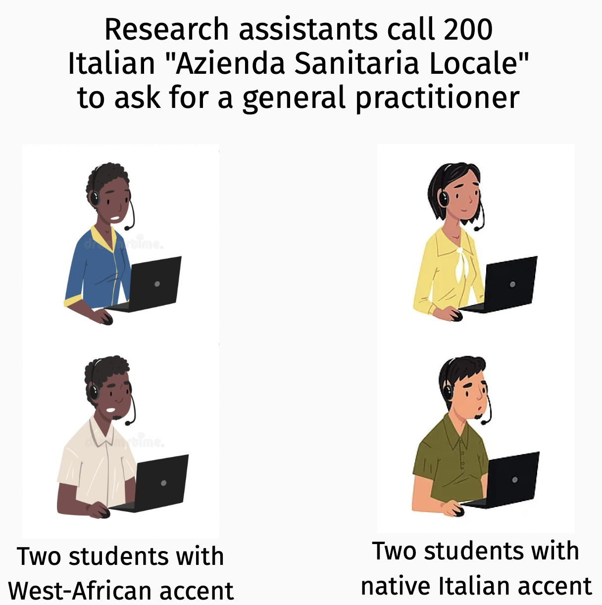
```

::: {.backgrnote .center}
*Source:* `r Citet(myBib, "schaeffer_when_2025")`
:::

## Some of my current work

```{r, echo = FALSE, out.width='82%'}
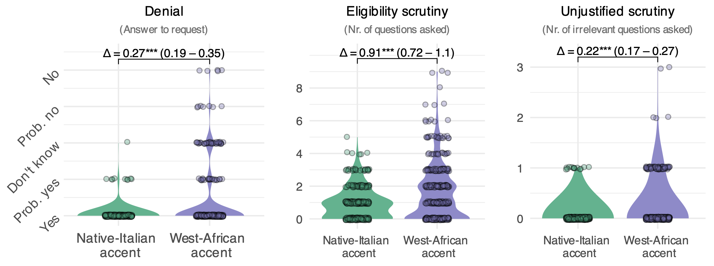
```

::: {.backgrnote .center}
*Source:* `r Citet(myBib, "schaeffer_when_2025")`
:::

## Some of my current work

```{r, echo = FALSE, out.width='60%'}
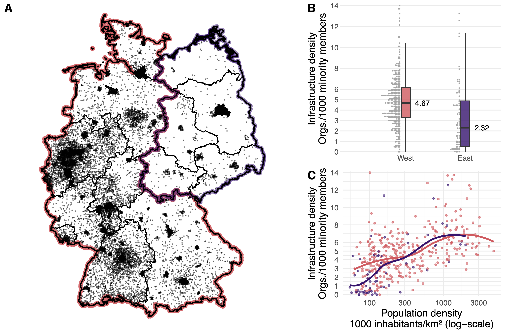
```

::: {.backgrnote .center}
*Source:* `r Citet(myBib, "wiedner_local_2025")`
:::

## Some of my current work

```{r, echo = FALSE, out.width='42%'}
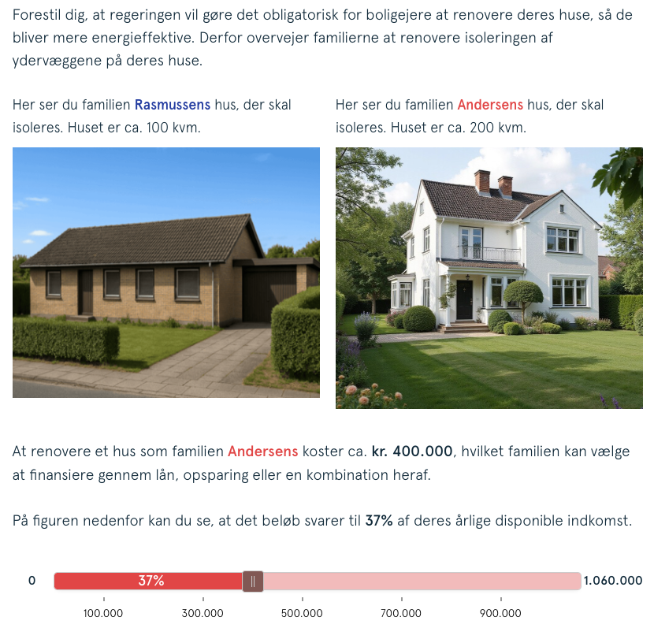
```

::: {.backgrnote .center}
*Source:* `r Citet(myBib, "Schaeffer_unveiling_2025")`
:::

## Some of my current work

```{r, echo = FALSE, out.width='72%'}
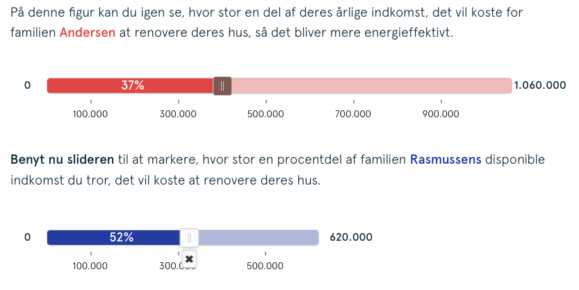
```

::: {.backgrnote .center}
*Source:* `r Citet(myBib, "Schaeffer_unveiling_2025")`
:::

## Some of my current work

```{r, echo = FALSE, out.width='50%'}
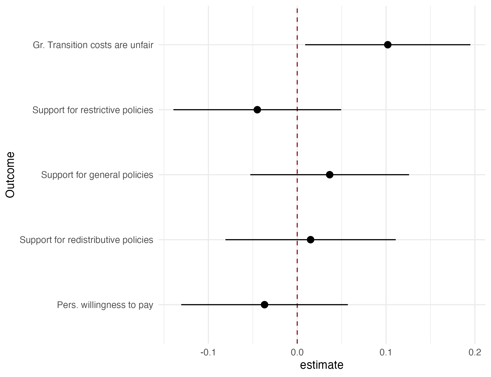
```

::: {.backgrnote .center}
*Source:* `r Citet(myBib, "Schaeffer_unveiling_2025")`
:::

## 4 types of research questions

::: {.push-left}
**(1) Ontological:** what is the *nature* of [X]{.alert}?

- What is power?
- What is gender; how is it different from sex?
- What is a state? [*"A human community that (successfully) claims the monopoly of the legitimate use of physical force within a given territory."* — Max Weber, "Politics as a Vocation" (1918)]{.backgrnote}

**(2) Critical:** is [X]{.alert} (un-)just?

- Is home office exploitation?
- Is the colorblind ideology a new form of racism?

::: {.content-box-blue}
**Discuss:** think of the last exam you wrote — which type of research question did it engage with?
:::
:::

::: {.push-right}
**(3) Descriptive:** what types of [X]{.alert} exist, and how frequent are they?

- What are the survival strategies of the poor?
- How did Danes structure their days during the COVID-19 lockdowns?

**(4) Explanatory:** what is the *effect* of [X]{.alert}?

- What are the consequences of anomie? [Why does the suicide rate vary across societies?]{.backgrnote}
- How does capitalism affect us?
- How does urbanization affect us?

::: {.content-box-red .fragment}
This course is about **explanatory** questions: *what is the effect of X?*
:::
:::

## Goal of empirical sociology

::: {.lead .center}
Use data to discover patterns, <br> and the [social mechanisms that bring them about.]{.alert}
:::

```{r, echo = FALSE, out.width='60%', fig.align='center'}
knitr::include_graphics('https://researchleap.com/wp-content/uploads/2021/12/Population-data.jpeg')
```

## Three learning goals

::: {.push-left}
**(1) Multiple OLS regression**

- Multiple predictors & confounder adjustment (Frisch-Waugh),
- Interaction effects,
- Polynomials.

**(2) Visualization of regression results**

- Model predictions,
- Coefficient plots.
:::

::: {.push-right .fragment}
**(3) Fundamentals of causal inference**

- Potential outcomes & directed acyclical graphs (DAG),
- Randomized Controlled Trials (RCT),
- Intention to treat (ITT) & instrument variable (IV) regression,
- Multiple regression,
- 2-SLS instrument variable regression,
- Regression discontinuity designs (RDD).

```{tikz, DAG1, echo = FALSE, out.width='40%'}
\usetikzlibrary{shapes,decorations,arrows,calc,arrows.meta,fit,positioning}
\tikzset{
    -Latex,auto,node distance =1 cm and 1 cm,semithick,
    state/.style ={ellipse, draw, minimum width = 0.7 cm},
    point/.style = {circle, draw, inner sep=0.04cm,fill,node contents={}},
    bidirected/.style={Latex-Latex,dashed},
    el/.style = {inner sep=2pt, align=left, sloped}
}

\begin{tikzpicture}
\sffamily
    \node[state] (1) at (0,0) {$C$};
    \node[state] (2) [below = of 1] {$X$};
    \node[state] (3) [right = of 2] {$Y$};

    \path (1) edge  (2);
    \path[bidirected] (2) edge[red, bend right=50] (3);
    \path (1) edge (3);
\end{tikzpicture}
```
:::

## Example: regression discontinuity design

::: {.push-left}
```{r, echo = FALSE, out.width='62%', fig.align='center'}
knitr::include_graphics('https://pbs.twimg.com/media/FOH1FlhWUAIqbN1.jpg:large')
```
:::

::: {.push-right}
```{r, echo = FALSE, out.width='100%', fig.align='center'}
knitr::include_graphics('https://pbs.twimg.com/media/FZIn0ymXgAAOopA.jpg:large')
```
:::

## Example: regression discontinuity design

::: {.push-left}
```{r, echo = FALSE, out.width='62%', fig.align='center'}
knitr::include_graphics('https://pbs.twimg.com/media/FOH1FlhWUAIqbN1.jpg:large')
```
:::

::: {.push-right}
::: {.center}
Municipalities where far-right candidates *ran* versus where they *won*
:::

```{r, echo = FALSE, out.width='90%', fig.align='center'}
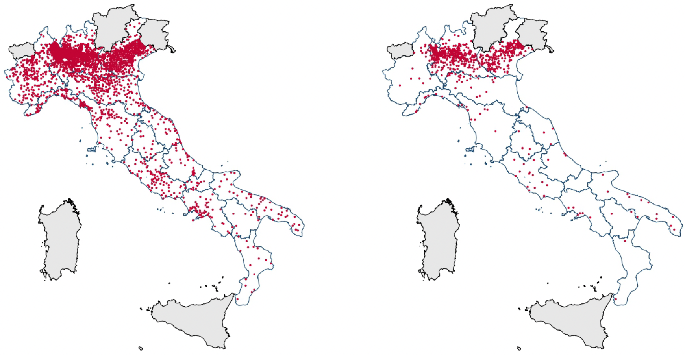
```

::: {.backgrnote .center}
*Source:* `r Citet(myBib, "romarri_far-right_2020")`
:::
:::

## Example: regression discontinuity design

```{r, echo = FALSE, out.width='35%', fig.align='center'}
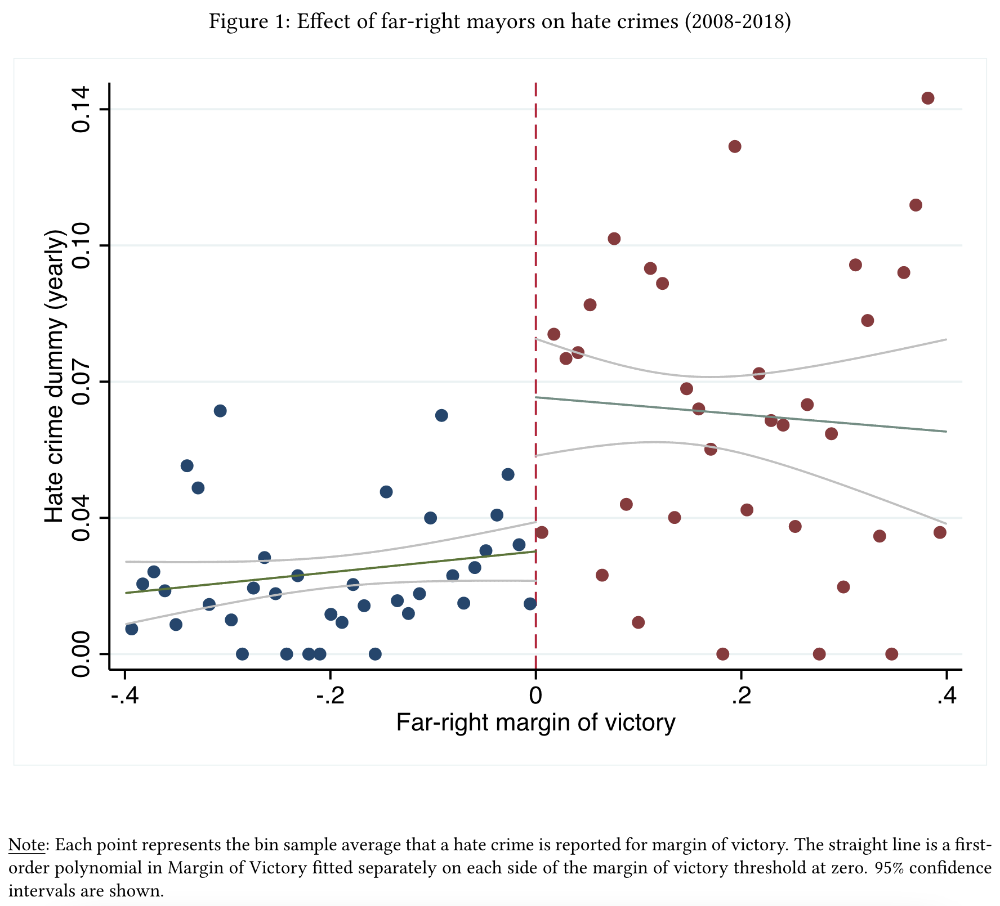
```

::: {.backgrnote .center}
*Source:* `r Citet(myBib, "romarri_far-right_2020")`
:::

::: {.push-left}
::: {.content-box-blue}
**Discuss:** why compare municipalities where the far-right *barely won* with those where it *barely lost*?
:::
:::

::: {.push-right}
::: {.content-box-red .fragment}
Near the threshold, winning is almost **random** — so the two groups are comparable, like in an experiment. [The full logic comes in Lecture 13.]{.backgrnote}
:::
:::

## Example: regression discontinuity design

::: {.left-column}
```{r, echo = FALSE, out.width='100%'}

```
:::

::: {.right-column}
```{r, echo = FALSE, out.width='88%', fig.align='center'}
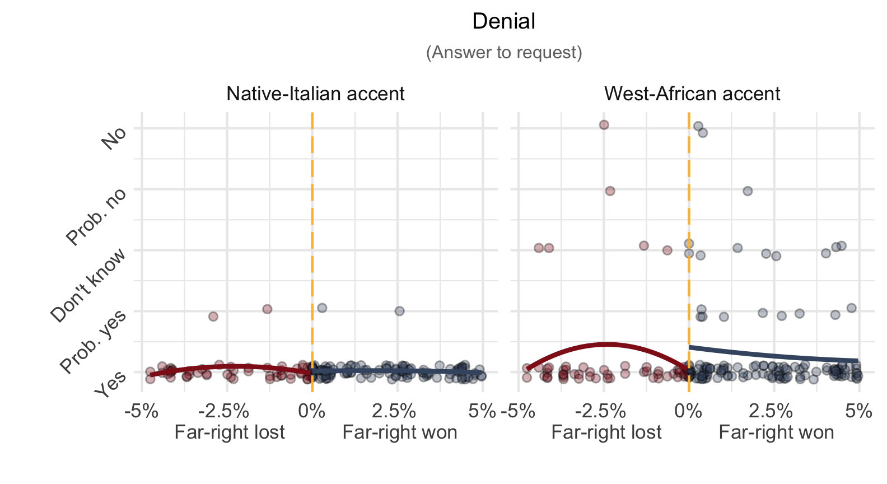
```

::: {.backgrnote .center}
*Source:* `r Citet(myBib, "schaeffer_when_2025")`
:::
:::

## Break {.inverse background-color="#901A1E"}

<div class="ku-timer" data-min="15"></div>

## How the course works {.inverse background-color="#901A1E"}

[Part 2 of 3]{.part-pill}

::: {.lead}
The weekly rhythm, the quizzes that qualify you for the exam, and what I assume you already know.
:::

## Course structure

::: {.left-column}
| TA      | Fridays | Room       |
|:--------|:--------|:-----------|
| Sofie   | 8 am    | CSS 2-2-49 |
| Natalie | 10 am   | CSS 2-0-30 |
| Joakim | 10 am   | CSS 2-0-42 |

::: {.small}
**Recommendations**

- Activate email notifications on Absalon.
- Regularly check your KU email, or forward it to your personal email.
- Ask *and answer* questions in the [t-R-ouble forum](https://absalon.ku.dk/courses/70545/discussion_topics/563046?module_item_id=2037268) on Absalon.
:::
:::

::: {.right-column}
```{r, echo = FALSE, out.width='100%', fig.align='center'}
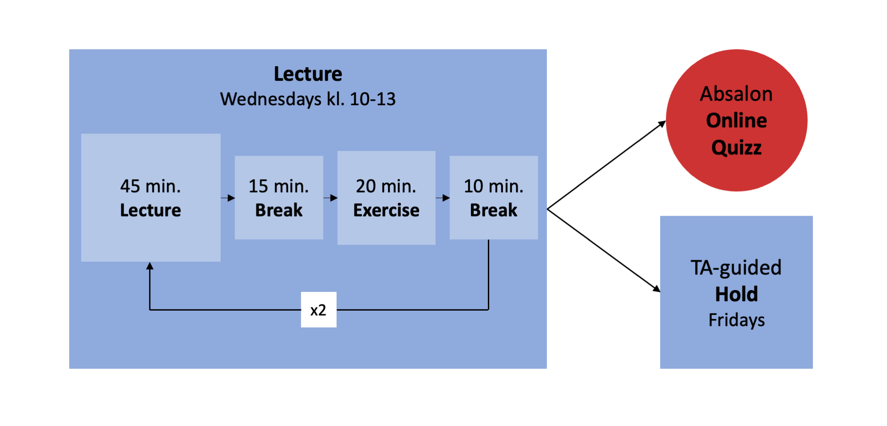
```
:::

## Weekly Absalon online quizzes

::: {.left-column}
- 13 online quizzes on Absalon, designed by [Epinion](https://epinionglobal.com/) & us.

- Based on data Epinion collects for the municipality of Copenhagen, DR, Skat, etc.

- Made available online Wednesdays after the lecture.

::: {.content-box-red}
**Beware:** submit **at least 10** completed quizzes — *individually, each within two weeks* of release — or you do **not** qualify for the exam.
:::
:::

::: {.right-column}
```{r, echo = FALSE, out.width='80%', fig.align='center'}

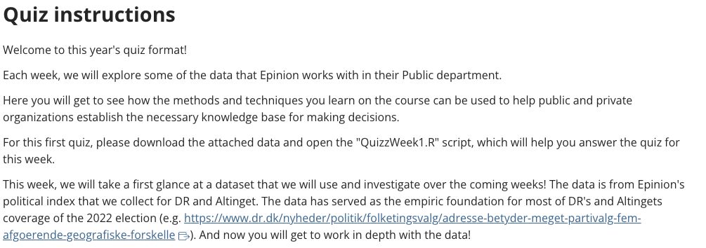
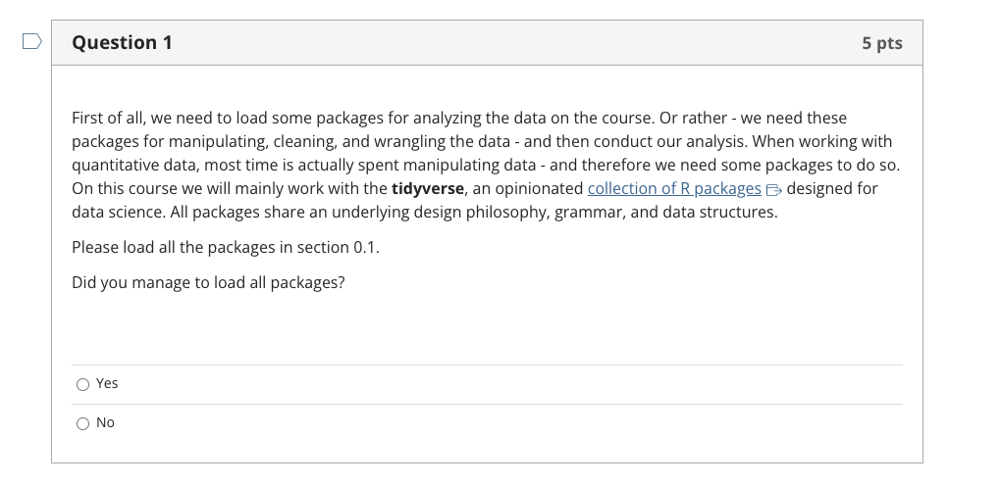
```
:::

## Consequently, this course assumes

1. You have **basic R coding skills** and know how to use RStudio.

. . .

2. You know **basic statistics**:
   - Descriptive statistics: $\%$, $\bar{x}$, $\text{SD}(x)$.
   - Associations:
     - Correlation: $r_{y,x}$,
     - OLS regression: $y_{i} = \alpha + \beta x_{i} + \epsilon_{i}$.
   - Inference: confidence intervals, $t$-values & $p$-values.

::: {.content-box-green .fragment}
Rusty on any of this? Part 3 of today gets your tools ready, and the first weeks refresh the statistics.
:::

## Two textbooks

$\rightarrow$ Available at Academic Books on City Campus and at the university library.

::: {.push-left}
::: {.center}
Carried over from last semester; serves as a reference for regression and statistical inference.
:::

```{r, echo = FALSE, out.width='36%', fig.align='center'}
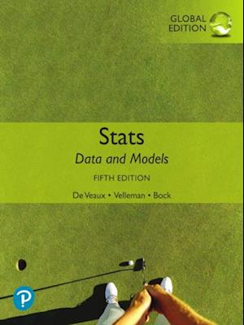
```

::: {.backgrnote .center}
`r Citet(myBib, "veaux_stats_2021")`
:::
:::

::: {.push-right}
::: {.center}
To learn how to identify causal effects, we use Angrist & Pischke's textbook.
:::

```{r, echo = FALSE, out.width='32%', fig.align='center'}
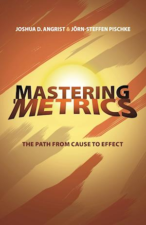
```

::: {.backgrnote .center}
`r Citet(myBib, "angrist_mastering_2014")`
:::
:::

## AI (like ChatGPT)

::: {.push-left}
1. **Privacy:** [don't use AI/LLMs to process sensitive information!]{.alert}

2. **Learning:**
   - Use AI to *explain, comment, debug, and improve* R code while you draft it.
   - Use AI to get *summaries* of text passages and concepts that you do not understand.
   - Use AI to *discuss* your understanding of the course materials and ask about things that confuse you.

3. **Generation:** don't use AI to *generate, draft, and write* your R code. [You need to learn how to code to assess whether the AI coded what you asked for.]{.alert}
:::

::: {.push-right}
```{r, echo = FALSE, out.width='100%', fig.align='center'}
knitr::include_graphics('https://media1.giphy.com/media/iiSb58oATiANL65Dd2/giphy.gif?cid=ecf05e470i00dk1kq5bvalzh4irqygm4pieeqkdyz9vk76ht&ep=v1_gifs_search&rid=giphy.gif&ct=g')
```
:::

## Questions? {.inverse background-color="#901A1E"}

```{r, echo = FALSE, out.width='45%', fig.align='center'}
knitr::include_graphics('https://www.mountpolley.com/wp-content/uploads/2020/08/pexels-pixabay-356079-1200x726.jpg')
```

## Get your tools ready {.inverse background-color="#901A1E"}

[Part 3 of 3]{.part-pill}

::: {.lead}
Everyone leaves today with a working R setup — we do this together, now.
:::

## Task 1: install R & RStudio

1. Get a [recent version of R (≥ 4.6.0)](https://mirrors.dotsrc.org/cran/).

2. [Install RStudio](https://posit.co/download/rstudio-desktop/), or update to the most recent version.

::: {.backgrnote}
The same steps, with more detail, are on the course website under **About & setup**.
:::

## Task 2: get to know RStudio

```{r, echo = FALSE, out.width='55%', fig.align='center'}
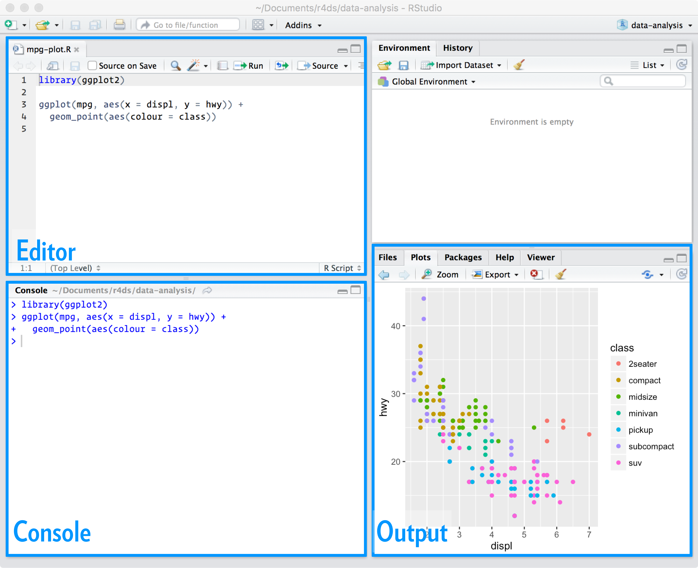
```

## Task 3: set RStudio preferences

::: {.left-column}
Set these preferences to improve *reproducibility*!

$\rightarrow$ RStudio / Tools / Global options.
:::

::: {.right-column}
```{r, echo = FALSE, out.width='70%', fig.align='center'}
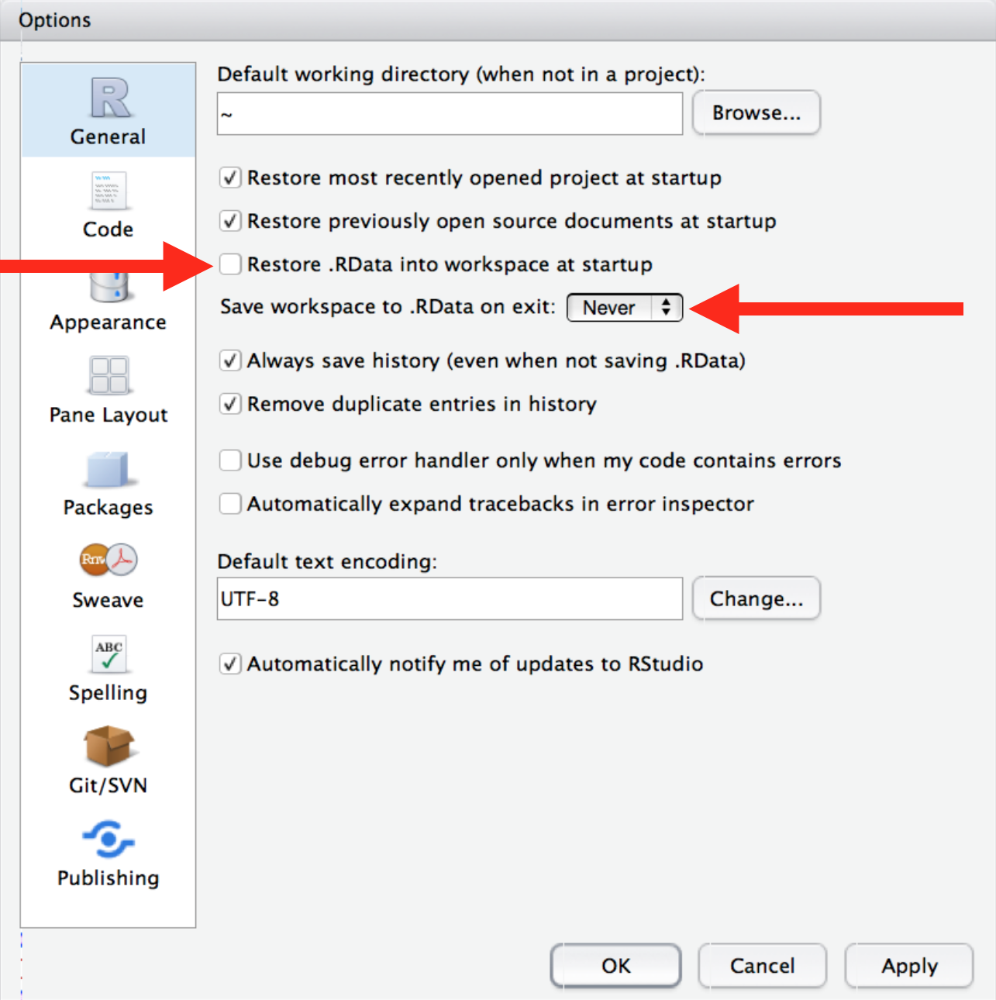
```
:::

## RStudio workflow

::: {.left-column}
1. Use **Projects** to manage all files (scripts, data, figures, and tables) belonging to the same project.

2. Always start your RStudio session by clicking on the **Project** for this course.

3. Use the editor to write as many **R scripts** as you like, saved in the same folder as your **Project**. Thereby you can reproduce your results.
:::

::: {.right-column}
```{r, echo = FALSE, out.width='85%', fig.align='center'}

```
:::

## Set up your "Stats_II" project

::: {.left-column}
- Click on the Project button.
:::

::: {.right-column}
```{r, echo = FALSE, out.width='40%', fig.align='center'}
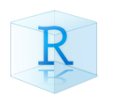
```
:::

## Set up your "Stats_II" project

::: {.left-column}
::: {.small}
Set up a new project in RStudio:

1. "New Directory"
2. "New Project"
3. Finally, a name for the folder and — under "Browse" — where you want that folder to be located. I call mine Stats_II. [This also generates a folder with the name you chose. Use that folder for everything related to this course.]{.backgrnote}

**Done!** Now you should find an empty folder under the path where you wanted it set up.

::: {.content-box-red}
**Beware:** in the future, always start RStudio by double-clicking the project icon in your folder for this course.
:::
:::
:::

::: {.right-column}
```{r, echo = FALSE, out.width='90%', fig.align='center'}
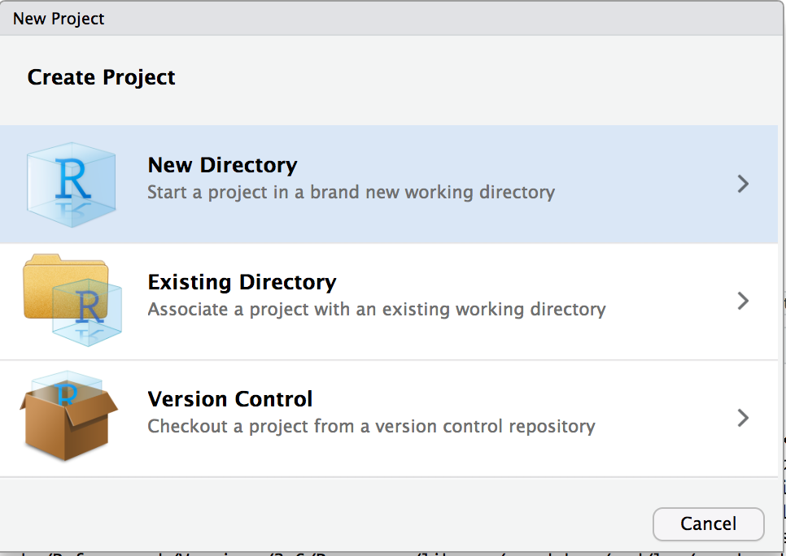
```
:::

## Set up your "Stats_II" project

::: {.left-column}
::: {.small}
Set up a new project in RStudio:

1. "New Directory"
2. "New Project"
3. Finally, a name for the folder and — under "Browse" — where you want that folder to be located.
:::
:::

::: {.right-column}
```{r, echo = FALSE, out.width='90%', fig.align='center'}
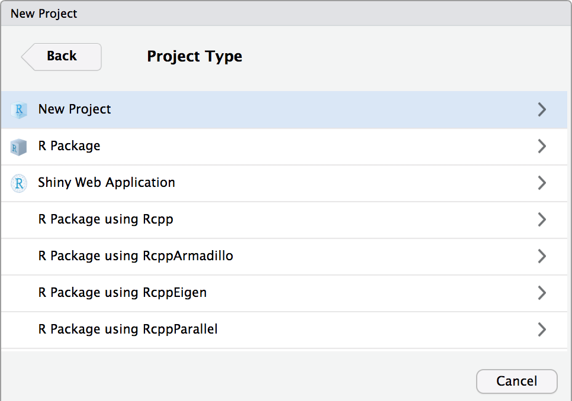
```
:::

## Set up your "Stats_II" project

::: {.left-column}
::: {.small}
Set up a new project in RStudio:

1. "New Directory"
2. "New Project"
3. Finally, a name for the folder and — under "Browse" — where you want that folder to be located.
:::
:::

::: {.right-column}
```{r, echo = FALSE, out.width='90%', fig.align='center'}
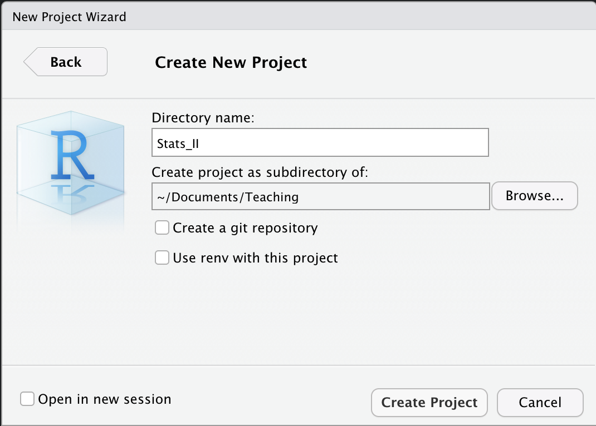
```
:::

## Set up your "Stats_II" project

::: {.left-column}
::: {.small}
**Done!** Now you should find an empty folder under the path where you wanted it set up.
:::
:::

::: {.right-column}
```{r, echo = FALSE, out.width='90%', fig.align='center'}
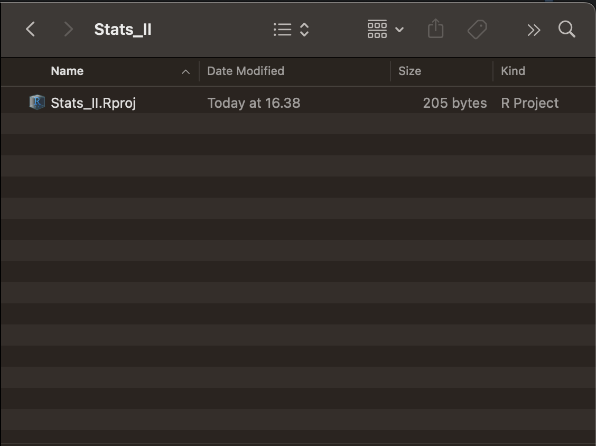
```
:::

## R scripts

::: {.left-column}
1. Open a new R script.
2. Save it in your new folder. [Find it under "Files".]{.backgrnote}
:::

::: {.right-column}
```{r, echo = FALSE, out.width='100%', fig.align='center'}
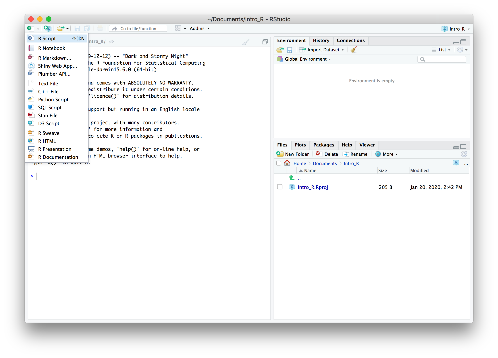
```
:::

## R scripts

::: {.left-column}
1. Type the lines shown in the screenshot on the right.
2. Save the file by clicking on the floppy-disc icon. [I called mine "Lecture.R".]{.backgrnote}
3. Mark all code and click "Run".
:::

::: {.right-column}
```{r, echo = FALSE, out.width='100%', fig.align='center'}
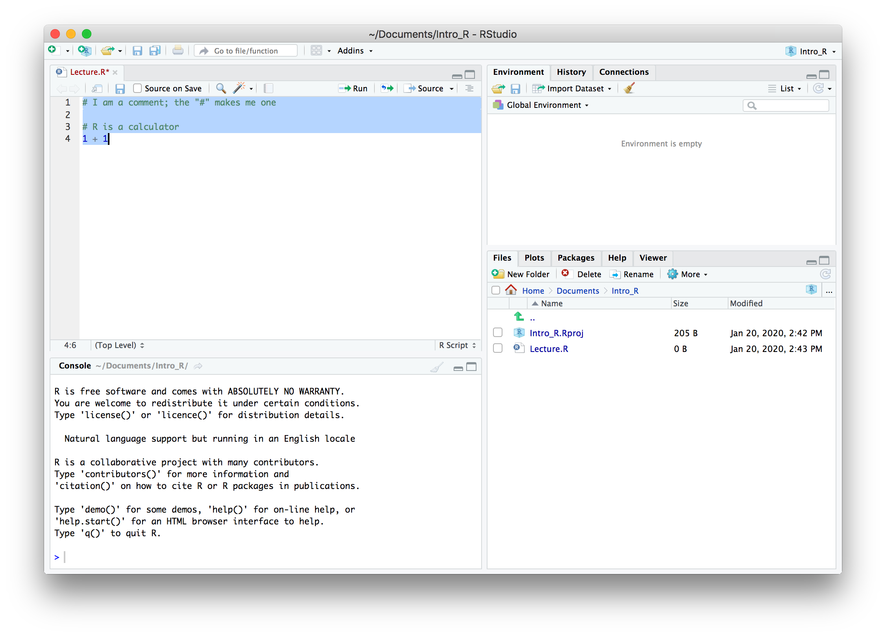
```
:::

## R scripts

::: {.left-column}
OK, you are good to go!

**Pro tip:** *use the R script to take notes during the lecture!*

A `#` defines a comment. So use it to take notes and code in one single document per lecture.
:::

::: {.right-column}
```{r, echo = FALSE, out.width='100%', fig.align='center'}
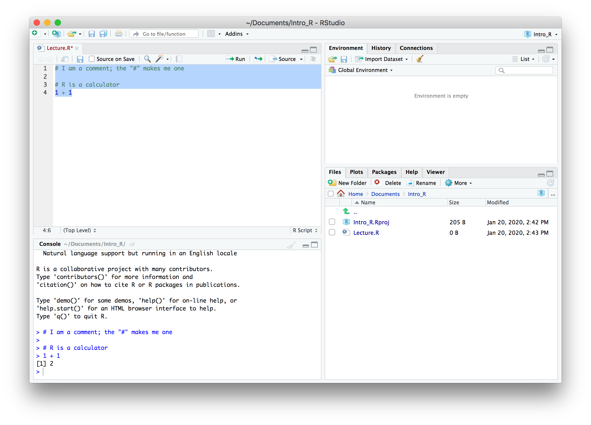
```
:::

## Check yourself: today's goals

Look back at the goals from the start of the lecture. Can you tick all three?

::: {.checklist}
- Explain to your neighbour what an **explanatory research question** is — and give one example.
- Name what it takes to **qualify for the exam** — how many quizzes, submitted how?
- Open **your Stats_II project** in RStudio and run a line of R code from a saved script.
:::

::: {.content-box-green}
Anything feel shaky? That is what this week's **Absalon quiz** and the **Friday exercise class** are for.
:::

## References

::: {.small}
```{r ref, results = 'asis', echo = FALSE}
PrintBibliography(myBib)
```
:::

```{=html}
<script>
(function () {
  function fmt(s) { var m = Math.floor(s / 60), ss = s % 60; return m + ":" + (ss < 10 ? "0" : "") + ss; }
  function build(el) {
    var total = (parseInt(el.getAttribute("data-min"), 10) || 5) * 60, rem = total, id = null;
    el.innerHTML =
      '<div class="kt-display">' + fmt(rem) + '</div>' +
      '<div class="kt-btns">' +
        '<button class="kt-start" type="button">Start</button>' +
        '<button class="kt-pause" type="button">Pause</button>' +
        '<button class="kt-reset" type="button">Reset</button>' +
      '</div>';
    var disp = el.querySelector(".kt-display");
    function render() { disp.textContent = fmt(rem); el.classList.toggle("kt-done", rem <= 0); }
    function start() { if (id) return; id = setInterval(function () { if (rem > 0) { rem--; render(); } else { stop(); } }, 1000); }
    function stop() { clearInterval(id); id = null; }
    function reset() { stop(); rem = total; render(); }
    el.querySelector(".kt-start").onclick = start;
    el.querySelector(".kt-pause").onclick = stop;
    el.querySelector(".kt-reset").onclick = reset;
    el._start = start; el._reset = reset; render();
  }
  function init() {
    document.querySelectorAll(".ku-timer").forEach(build);
    if (window.Reveal && Reveal.on) {
      Reveal.on("slidechanged", function (e) {
        document.querySelectorAll(".ku-timer").forEach(function (t) { if (t._reset) t._reset(); });
        var here = e.currentSlide ? e.currentSlide.querySelectorAll(".ku-timer") : [];
        here.forEach(function (t) { if (t._start) setTimeout(t._start, 250); });
      });
    }
  }
  if (document.readyState !== "loading") init();
  else document.addEventListener("DOMContentLoaded", init);
})();
</script>
```
