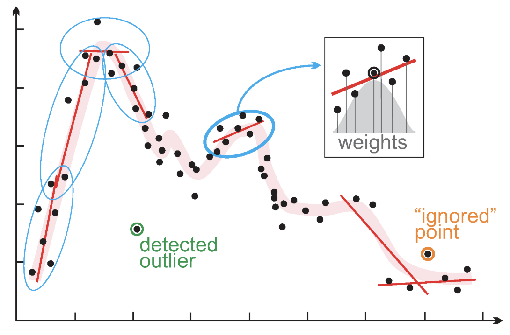

```{r setup, include = FALSE}
library(RefManageR)
library(knitr)
library(ggrepel)

options(htmltools.preserve.raw = FALSE,
        htmltools.dir.version = FALSE, servr.interval = 0.5, width = 115, digits = 3)
knitr::opts_chunk$set(
  collapse = TRUE, message = FALSE, fig.retina = 3, error = TRUE,
  warning = FALSE, cache = FALSE, fig.align = 'center',
  comment = "#", strip.white = TRUE, tidy = FALSE)

BibOptions(check.entries = FALSE,
           bib.style = "authoryear",
           style = "markdown",
           hyperlink = FALSE,
           no.print.fields = c("doi", "url", "ISSN", "urldate", "language", "note", "isbn", "volume"))
myBib <- ReadBib("../Stats_II.bib", check = FALSE)
```

```{r data, include = FALSE}
pacman::p_load(tidyverse, estimatr, modelsummary, wbstats, vdemdata, ggrepel, scales)

# World Bank: life expectancy at birth + health spending per capita (PPP $).
# Live, with a committed cache so the render never dies on an API outage.
life_raw <- tryCatch(
  wb_data(c("SP.DYN.LE00.IN", "SH.XPD.CHEX.PP.CD"), start_date = 2000, end_date = 2025),
  error = function(e) readRDS("data/wb_life_raw.rds")
)

Dat_life <- life_raw %>%
  rename(LifeExpect = SP.DYN.LE00.IN, HealthExp = SH.XPD.CHEX.PP.CD,
         year = date, country_text_id = iso3c) %>%
  select(country_text_id, country, year, LifeExpect, HealthExp) %>%
  drop_na(LifeExpect, HealthExp)

# V-Dem: civil liberties (equality before the law & individual liberty).
Dat_vdem <- vdem %>%
  as_tibble() %>%
  select(country_text_id, year, civ_liberties = v2xcl_rol)

Dat <- inner_join(Dat_life, Dat_vdem, by = c("country_text_id", "year")) %>%
  drop_na(LifeExpect, HealthExp, civ_liberties)

# A few salient countries to label on the scatter plots (latest year each)
label_countries <- c("United States", "Switzerland", "Norway", "Denmark", "Nigeria")
Dat_lab <- Dat %>%
  filter(country %in% label_countries) %>%
  group_by(country) %>% filter(year == max(year)) %>% ungroup()

# Models used across the deck
ols_lin  <- lm_robust(LifeExpect ~ I(HealthExp / 1000) + year + civ_liberties,
                      data = Dat, clusters = country)
ols_poly <- lm_robust(LifeExpect ~ poly(I(HealthExp / 1000), 2, raw = TRUE) + year + civ_liberties,
                      data = Dat, clusters = country)
ols_log  <- lm_robust(LifeExpect ~ log2(HealthExp) + year + civ_liberties,
                      data = Dat, clusters = country)

b_poly <- coef(ols_poly)
b1 <- b_poly[2]; b2 <- b_poly[3]
b_log <- coef(ols_log)["log2(HealthExp)"]
```

## By the end of today you can … {.inverse background-color="#901A1E"}

1. spot when OLS's **linearity assumption fails**, and use **LOESS** to see the true shape;

2. fit and interpret a **polynomial** — a curve built from a straight-line model — and know when higher orders **overfit**;

3. **transform** a predictor with **log₂** and read it as *"per doubling"* — then say which model fits best.

::: {.backgrnote}
One part per goal. Our running question: does **life expectancy** simply rise in a straight line with **health spending**?
:::

::: {.notes}
Frame the day as a repair job. Every model so far has assumed a straight line; today the data bends, and we learn two ways to fit a curve while *still* using ordinary OLS. Stress that neither trick leaves OLS behind — a polynomial and a log transform are both just linear regression on cleverly built predictors. That reassurance is the through-line.
:::

## When the line bends {.inverse background-color="#901A1E"}

[Part 1 of 3]{.part-pill}

::: {.lead}
More health spending buys more life — but surely not *forever*, and not at a constant rate. Let's look.
:::

## The research question of the day {.inverse background-color="#901A1E"}

::: {.push-left}
Richer countries spend more on health and live longer. But is the relationship a **straight line** — each extra dollar worth the same everywhere?

::: {.content-box-blue}
**Research question:** how does **life expectancy at birth** relate to **health spending per person** — linearly, or as a bending curve?
:::
:::

::: {.push-right}
<iframe src="https://ourworldindata.org/grapher/life-expectancy?tab=chart&time=1900..latest&country=OWID_WRL~DNK~IND~NGA~CHN" loading="lazy" style="width: 100%; height: 460px; border: 0;" allow="web-share; clipboard-write"></iframe>

::: {.backgrnote .center}
Life expectancy over time. *Source:* Our World in Data.
:::
:::

::: {.notes}
Let the Our World in Data chart breathe — it is the motivating hook, and it already hints at the shape: fast early gains, then a plateau. Pose the question sharply: is each extra dollar of health spending worth the same in Nigeria as in Denmark? Everyone's intuition says no, and that intuition is exactly the linearity assumption we are about to test.
:::

## Preparation

::: {.panel-tabset}

### Packages
```{r libs}
pacman::p_load(
  tidyverse,    # Data manipulation and visualization
  estimatr,     # OLS with clustered / robust standard errors
  modelsummary, # Regression tables
  wbstats,      # World Bank data
  vdemdata,     # V-Dem (civil liberties)
  scales        # Log axis helpers
)
```

### Get the data
```{r data-show, eval = FALSE}
# World Bank: life expectancy + health spending per capita (PPP $), 2000-
life_raw <- wb_data(c("SP.DYN.LE00.IN", "SH.XPD.CHEX.PP.CD"),
                    start_date = 2000, end_date = 2025)

Dat_life <- life_raw %>%
  rename(LifeExpect = SP.DYN.LE00.IN, HealthExp = SH.XPD.CHEX.PP.CD,
         year = date, country_text_id = iso3c) %>%
  select(country_text_id, country, year, LifeExpect, HealthExp) %>%
  drop_na(LifeExpect, HealthExp)

# V-Dem: civil liberties, joined on country + year, as a control
Dat_vdem <- vdem %>%
  as_tibble() %>%
  select(country_text_id, year, civ_liberties = v2xcl_rol)

Dat <- inner_join(Dat_life, Dat_vdem, by = c("country_text_id", "year")) %>%
  drop_na()
```

### A panel, not a cross-section
::: {.small}
This is **panel data**: many countries, each observed over many years — so the rows are **not independent**. Every model today uses `clusters = country` so the standard errors account for repeated observations of the same country.
:::

:::

::: {.notes}
Two things to flag and then move on. First, civil liberties rides along as a single control — the same V-Dem measure from Lectures 2, 9 and 11. Second, and more important: this is a *panel*, so observations repeat within countries and are not independent. `clusters = country` is not optional decoration; without it the standard errors are badly overconfident. Say that plainly and keep going.
:::

## A straight line through a curve

::: {.panel-tabset}

### The picture
```{r lin-plot, echo = FALSE, out.width='70%', fig.height = 4.1, fig.width = 10}
ggplot(Dat, aes(y = LifeExpect, x = HealthExp)) +
  geom_line(aes(colour = country, group = country), alpha = 0.25) +
  geom_point(aes(colour = country), alpha = 0.4, size = 1) +
  ggrepel::geom_text_repel(data = Dat_lab, aes(label = country, colour = country),
                           size = 4, fontface = "bold", seed = 1, min.segment.length = 0) +
  geom_smooth(method = "lm", se = FALSE, colour = "black", linewidth = 1.2) +
  labs(y = "Life expectancy at birth", x = "Health spending per person ($, PPP)") +
  theme_minimal(base_size = 15) + guides(colour = "none")
```

::: {.content-box-red}
**The line misses the shape — linearity is violated.**
:::

### The model
```{r lin-mod, results = 'hide'}
# I() lets us rescale inside the formula: 1 unit = $1,000
ols_lin <- lm_robust(
  LifeExpect ~ I(HealthExp / 1000) + year + civ_liberties,
  data = Dat, clusters = country
)

modelsummary(
  list("Life expectancy" = ols_lin),
  coef_rename = c("I(HealthExp/1000)" = "Health spend ($1,000s)",
                  "year" = "Year", "civ_liberties" = "Civil liberties"),
  stars = TRUE, gof_map = c("nobs", "r.squared"),
  output = "kableExtra"
)
```

::: {.small}
```{r lin-tab, ref.label = "lin-mod", echo = FALSE, results = 'asis'}
```
:::

:::

::: {.notes}
Show the picture first — the straight black line slicing through an obvious curve is more persuasive than any statistic. Name the tell-tale pattern: the line sits below the cloud in the middle and above it at both ends, which is exactly what a mis-specified linear fit looks like. Point at the labelled countries: the **United States** spends the *most* of anyone (far right) yet lives *shorter* than Switzerland or Norway — it sits well below the curve, a vivid reminder that beyond a point more money buys little life. Each faint coloured thread is one country tracked across years. The $R^2$ of about 0.45 is not terrible, which is the trap — a mediocre linear fit can still look respectable in a table while being the wrong shape.
:::

## LOESS: let the data draw the curve

::: {.push-left}
Before modelling a shape, **see** it. **LOESS** (locally estimated scatterplot smoothing) fits a little regression around each point using only its nearest neighbours, then stitches them into one smooth curve.

::: {.content-box-red}
**Beware:** LOESS is *descriptive* — it wiggles to the data and easily **overfits**. Use it to spot the shape, not to test a hypothesis.
:::
:::

::: {.push-right}
::: {.panel-tabset}

### The idea
```{r loess-img, echo = FALSE, out.width='78%'}

```

### On our data
```{r loess-fit, echo = FALSE, out.width='90%', fig.height = 4.2, fig.width = 6}
ggplot(Dat, aes(y = LifeExpect, x = HealthExp)) +
  geom_line(aes(colour = country, group = country), alpha = 0.25) +
  geom_point(aes(colour = country), alpha = 0.4, size = 1) +
  ggrepel::geom_text_repel(data = Dat_lab, aes(label = country, colour = country),
                           size = 3, fontface = "bold", seed = 1, min.segment.length = 0) +
  geom_smooth(se = FALSE, colour = "black", linewidth = 1.2) +   # LOESS is the default
  labs(y = "Life expectancy", x = "Health spending per person ($, PPP)") +
  theme_minimal(base_size = 13) + guides(colour = "none")
```

:::
:::

::: {.notes}
LOESS answers "what shape is this?" without committing to a formula. The mechanism is worth one sentence: a moving local regression, each point informed only by its neighbours, smoothed into a curve. Point at our fit — a steep early rise that flattens hard — that is the shape both of today's tools will try to capture. And repeat the warning: LOESS is a describing tool, not a modelling one; it will happily trace noise.
:::

## Two ways to fit a curve — with a straight-line model {.inverse background-color="#901A1E"}

::: {.lead}
The shape is clear. Now we fit it — **without leaving OLS**. Two tricks: **polynomials** and **transformations**.
:::

::: {.notes}
Set up the rest of the lecture as a choice between two tools that solve the same problem. The headline that reassures: both keep us inside ordinary least squares. A polynomial adds a squared predictor; a transformation reshapes a predictor. Neither is a new estimator — just a cleverer set of columns handed to the same `lm`.
:::

## Polynomials {.inverse background-color="#901A1E"}

[Part 2 of 3]{.part-pill}

::: {.lead}
A polynomial is a variable **interacted with itself** — last week's idea, pointed inward.
:::

## Remember interactions?

::: {.push-left}
In Lecture 11, an **interaction** let one variable's slope depend on **another** variable:
$$Y = \alpha + \beta_1 X + \beta_2 Z + \beta_3 (X \times Z)$$

A **polynomial** is the same move with $Z = X$ — a variable interacted with **itself**:
$$Y = \alpha + \beta_1 X + \beta_2 (X \times X) = \alpha + \beta_1 X + \beta_2 X^2$$
:::

::: {.push-right}
::: {.content-box-green}
So the health-spending slope now **depends on the level of health spending itself** — it can start steep and flatten out, exactly the shape LOESS showed.
:::

::: {.backgrnote}
Everything you learned about reading interaction terms carries straight over: the effect of $X$ is no longer one number.
:::
:::

::: {.notes}
This is the conceptual bridge from last week, and it is genuinely clarifying — students who found interactions hard suddenly see polynomials as the easy case, because there is only one variable. Say it as a slogan: a polynomial is a variable interacted with itself, so its own slope depends on its own level. That is precisely why it can bend. No need to re-run last week's models; just make the link.
:::

## The quadratic model

::: {.push-left}
```{r poly-mod, results = 'hide'}
ols_poly <- lm_robust(
  LifeExpect ~ poly(I(HealthExp / 1000), 2, raw = TRUE) +
    year + civ_liberties,
  data = Dat, clusters = country
)
```

$$Y_i = \alpha + \beta_1 X + \beta_2 X^2 + \dots + e_i$$

::: {.backgrnote}
`poly(x, 2, raw = TRUE)` adds both $X$ and $X^2$ in one clean term. `raw = TRUE` keeps the original units so the coefficients are interpretable.
:::
:::

::: {.push-right}
```{r poly-plot, echo = FALSE, out.width='92%', fig.height = 4.2, fig.width = 6}
ggplot(Dat, aes(y = LifeExpect, x = HealthExp)) +
  geom_line(aes(colour = country, group = country), alpha = 0.25) +
  geom_point(aes(colour = country), alpha = 0.4, size = 1) +
  ggrepel::geom_text_repel(data = Dat_lab, aes(label = country, colour = country),
                           size = 3, fontface = "bold", seed = 1, min.segment.length = 0) +
  geom_smooth(method = "lm", formula = y ~ poly(x, 2, raw = TRUE),
              se = FALSE, colour = "black", linewidth = 1.2) +
  labs(y = "Life expectancy", x = "Health spending per person ($, PPP)") +
  theme_minimal(base_size = 13) + guides(colour = "none")
```

::: {.content-box-green}
One squared term, and the straight line becomes a **curve** that follows the bend.
:::
:::

::: {.notes}
Keep the code moment short — the point is that adding a curve costs exactly one extra term, `poly(x, 2, raw = TRUE)`. Explain `raw = TRUE` once: without it R uses orthogonal polynomials whose coefficients are uninterpretable, and we want plain units. Then the picture: the red line now hugs the cloud. The interpretation of the two coefficients is the next slide, and it is the part they must get right.
:::

## Reading a quadratic

::: {.push-left}
::: {.small}
```{r poly-tab, echo = FALSE, results = 'asis'}
modelsummary(list("Life expectancy" = ols_poly),
             coef_rename = c("poly(I(HealthExp/1000), 2, raw = TRUE)1" = "Health spend",
                             "poly(I(HealthExp/1000), 2, raw = TRUE)2" = "Health spend²",
                             "year" = "Year", "civ_liberties" = "Civil liberties"),
             stars = TRUE, gof_map = c("nobs", "r.squared"), output = "kableExtra")
```
:::
:::

::: {.push-right}
The slope of health spending is no longer one number — it **changes as spending rises**:

- **$\beta_1 = `r round(b1, 2)`$** — near \$0, each extra \$1,000 adds about `r round(b1, 1)` years.
- **$\beta_2 = `r round(b2, 2)`$** — but every \$1,000 makes the *next* \$1,000 worth **less**.

::: {.content-box-green}
From \$1,000 to \$2,000: about $`r round(b1, 2)` + 2 \times (`r round(b2, 2)`) = \mathbf{`r round(b1 + 2*b2, 2)`}$ years. The gains **flatten** — diminishing returns, quantified.
:::
:::

::: {.notes}
The negative squared term is the whole story: it is what bends the line down. Walk the arithmetic slowly, because students reliably misread it — the effect of health spending is $\beta_1 + 2\beta_2 X$, so it shrinks as $X$ grows. Compute one concrete step, a poor country going from \$1,000 to \$2,000, and contrast it with what the same \$1,000 buys a rich country: almost nothing. That is diminishing returns made numerical, and it is a genuinely sociological point about where a health dollar does the most good.
:::

## Higher orders — and the overfitting trap

::: {.panel-tabset}

### The temptation
```{r overfit-plot, echo = FALSE, out.width='58%', fig.height = 4, fig.width = 8}
ggplot(Dat, aes(y = LifeExpect, x = HealthExp)) +
  geom_point(alpha = 0.12, colour = "grey55") +
  geom_smooth(method = "lm", formula = y ~ poly(x, 2, raw = TRUE), se = FALSE,
              aes(colour = "2 (quadratic)"), linewidth = 1.1) +
  geom_smooth(method = "lm", formula = y ~ poly(x, 9, raw = TRUE), se = FALSE,
              aes(colour = "9 (wiggly)"), linewidth = 1.1) +
  scale_colour_manual(values = c("2 (quadratic)" = "#901A1E", "9 (wiggly)" = "#425570"),
                      name = "Polynomial degree") +
  labs(y = "Life expectancy", x = "Health spending per person ($, PPP)") +
  theme_minimal(base_size = 13) + theme(legend.position = "top")
```

### The warning
::: {.content-box-red}
**Beware overfitting.** A high-degree polynomial bends to chase **every wiggle** — including noise. It fits *this* sample better and the *next* one worse. It also implies absurd swings (life expectancy shooting up or down at the extremes).
:::

::: {.content-box-green}
**Rule of thumb:** stop at the lowest degree that captures the shape. Here, a **quadratic** is plenty — degree 2, rarely more than 3.
:::

:::

::: {.notes}
The blue degree-9 curve is the cautionary tale — let them watch it thrash near the edges where data are thin, even swinging in directions no theory would predict. The lesson is not "more terms, better fit"; a high-degree polynomial fits *this* sample and generalises worse, the same overfitting idea as LOESS. Give them the discipline: choose the lowest degree that captures the shape you can defend, which is almost always two.
:::

## Break {.inverse background-color="#901A1E"}

<div class="ku-timer" data-min="15"></div>

## Your turn: exercise 1

::: {.left-column}
You fit a **polynomial** yourself — does xenophobia rise and then fall with **age**? Back to the ESS.

[**Open exercise 1 in a new tab ↗**](12-exercise1.html){target="_blank"}

<div class="ku-timer" data-min="20"></div>
:::

::: {.right-column}
<iframe src='12-exercise1.html' width='100%' height='620' frameborder='0' scrolling='yes' style="border:1px solid #ddd; border-radius:6px;"></iframe>
:::

## Transformations {.inverse background-color="#901A1E"}

[Part 3 of 3]{.part-pill}

::: {.lead}
A polynomial adds a term. A **transformation** reshapes the variable itself — and our favourite is the **logarithm**.
:::

## What is a logarithm? {data-auto-animate="true"}

::: {.push-left}
A logarithm is just a **power question, asked backwards.**

Raising 2 to a power means **repeated doubling** — multiply 2 by itself that many times:
$$2^{\color{#901A1E}{3}} = 2 \times 2 \times 2 = 8$$

The **base-2 logarithm asks the reverse:** *"2 raised to **which power** gives this number?"* — and the answer is exactly that **exponent**:
$$\log_2(8) = \color{#901A1E}{3} \quad\text{because}\quad 2^{\color{#901A1E}{3}} = 8$$
:::

::: {.push-right}
| exponent | power of 2 | value | log₂(value) |
|:--:|:--:|:--:|:--:|
| 1 | $2^1$ | 2 | 1 |
| 2 | $2^2$ | 4 | 2 |
| 3 | $2^3$ | 8 | 3 |
| 4 | $2^4$ | 16 | 4 |
| 10 | $2^{10}$ | 1,024 | 10 |

::: {.backgrnote}
Read a row left to right: multiply 2 by itself *exponent* times to get the *value*. **log₂ hands that count back to you.**
:::
:::

::: {.notes}
Assume they have genuinely forgotten what a logarithm is — most have, and that is fine. Anchor everything on one sentence: a logarithm is a power question asked backwards. Powers run forwards — 2 to the 3rd is 8 — and logs run back — the log base 2 of 8 is 3. Walk the table one row at a time, out loud: "two, times two, times two, is eight; so log base two of eight is three." Do not move on until the exponent-in / value-out / count-back-out loop feels automatic. This is the slide the whole transformation idea rests on.
:::

## …so log₂ counts doublings {data-auto-animate="true"}

::: {.push-left}
Because the exponent **counts doublings**, moving **+1 on the log₂ scale = one doubling** of the original value:
$$\log_2(2) = 1, \quad \log_2(4) = 2, \quad \log_2(8) = 3$$

::: {.content-box-green}
Perfect for health spending: \$500 → \$1,000 is *one doubling*, and so is \$4,000 → \$8,000. If each doubling buys the **same** extra years, a curve on the raw dollar scale becomes a **straight line** on the log₂ scale.
:::
:::

::: {.push-right}
```{r log-demo, echo = FALSE, out.width='92%', fig.height = 4.2, fig.width = 6}
tibble(x = 2^(0:10)) %>%
  mutate(log2x = log2(x)) %>%
  ggplot(aes(x = x, y = log2x)) +
  geom_step(colour = "grey70", linewidth = 0.4, direction = "hv") +
  geom_line(colour = "#901A1E", linewidth = 1) +
  geom_point(colour = "#901A1E", size = 2) +
  labs(x = "Original value (dollars)", y = expression(log[2](x)~"= number of doublings")) +
  theme_minimal(base_size = 13)
```
:::

::: {.notes}
Now connect the backwards-power idea to why it helps us model. The exponent is literally a count of doublings, so a one-step move on the log scale always means "twice as much", whether that is 500 to 1,000 or 4,000 to 8,000. The modelling payoff, in the green box: if life expectancy gains a fixed amount per doubling rather than per dollar, then against log-spending the curve becomes a straight line — and straight lines are exactly what OLS fits. Point at the plot: equal steps up the y-axis correspond to ever-bigger jumps in dollars.
:::

## The same fit, two ways to draw it

::: {.push-left}
We fit life expectancy on **log₂(spending)**. Drawn back on the **normal dollar axis**, that fit is a **curve** — rising fast, then flattening. Exactly the shape we needed.

::: {.content-box-green}
Same model, same fit. The **next slide** shows it on a **log₂ axis** — where the very same curve becomes a perfectly **straight line**. Flip back and forth.
:::
:::

::: {.push-right}
```{r log-plot-raw, echo = FALSE, out.width='92%', fig.height = 4.4, fig.width = 6}
ggplot(Dat, aes(y = LifeExpect, x = HealthExp)) +
  geom_line(aes(colour = country, group = country), alpha = 0.25) +
  geom_point(aes(colour = country), alpha = 0.4, size = 1) +
  ggrepel::geom_text_repel(data = Dat_lab, aes(label = country, colour = country),
                           size = 3, fontface = "bold", seed = 1, min.segment.length = 0) +
  # No axis transform here, so the log fit shows as a CURVE on the dollar scale
  stat_smooth(method = "lm", formula = y ~ log2(x),
              se = FALSE, colour = "black", linewidth = 1.2) +
  labs(y = "Life expectancy", x = "Health spending per person ($, PPP) - normal scale") +
  theme_minimal(base_size = 13) + guides(colour = "none")
```

::: {.backgrnote .center}
On the normal dollar axis, the log fit is a **curve**.
:::
:::

::: {.notes}
This is the first half of a back-and-forth pair — flip between this slide and the next to make the point land. Here the axis is ordinary dollars, and the log fit is a curve that hugs the data: steep among poor countries, flat among rich ones. On the next slide the axis becomes log₂ and that identical fit straightens into a line. Same model both times; only the ruler on the x-axis changed. That is the whole idea of a transformation.
:::

## The log₂ model

::: {.push-left}
```{r log-mod, results = 'hide'}
ols_log <- lm_robust(
  LifeExpect ~ log2(HealthExp) + year + civ_liberties,
  data = Dat, clusters = country
)

modelsummary(
  list("Life expectancy" = ols_log),
  coef_rename = c("log2(HealthExp)" = "Health spend (log2)",
                  "year" = "Year",
                  "civ_liberties" = "Civil liberties"),
  stars = TRUE, gof_map = c("nobs", "r.squared"),
  output = "kableExtra"
)
```

::: {.content-box-green}
**One coefficient, and it reads beautifully:** every **doubling** of health spending is associated with about **`r round(b_log, 2)` more years** of life expectancy.
:::
:::

::: {.push-right}
```{r log-plot, echo = FALSE, out.width='92%', fig.height = 4.4, fig.width = 6}
ggplot(Dat, aes(y = LifeExpect, x = HealthExp)) +
  geom_line(aes(colour = country, group = country), alpha = 0.25) +
  geom_point(aes(colour = country), alpha = 0.4, size = 1) +
  ggrepel::geom_text_repel(data = Dat_lab, aes(label = country, colour = country),
                           size = 3, fontface = "bold", seed = 1, min.segment.length = 0) +
  # The log2 axis transforms x BEFORE the fit, so a plain lm is already
  # the log-linear fit — and it comes out perfectly straight here.
  stat_smooth(method = "lm", se = FALSE, colour = "black", linewidth = 1.2) +
  scale_x_continuous(trans = log2_trans(),
                     breaks = c(50, 100, 200, 400, 800, 1600, 3200, 6400)) +
  labs(y = "Life expectancy",
       x = "Health spending per person ($, PPP) - doubling each step (log2)") +
  theme_minimal(base_size = 13) + guides(colour = "none")
```

::: {.backgrnote .center}
On a log₂ axis, that **same curve** is a straight **line**.
:::
:::

::: {.notes}
The payoff of the transform is interpretability: one number, and it means "years gained per doubling of spending" — about 3.6 here. Contrast that with the quadratic, which needed two coefficients and arithmetic to interpret. Show the log-scaled x-axis: the same data that curved is now a clean straight line, which is the visual proof that the log captured the shape. This "per doubling" reading is exactly how health economists talk, so it is worth drilling.
:::

## Which fits better — polynomial or log₂?

::: {.push-left}
::: {.panel-tabset}

### Fit
```{r compare-tab, echo = FALSE}
tibble(
  Model       = c("Linear", "Quadratic", "log₂"),
  `R²`        = c(ols_lin$r.squared, ols_poly$r.squared, ols_log$r.squared),
  `Adj. R²`   = c(ols_lin$adj.r.squared, ols_poly$adj.r.squared, ols_log$adj.r.squared)
) %>%
  kable(digits = 3)
```

### R code
```{r compare-code, eval = FALSE}
# Pull R² and adjusted R² from each fitted model
gof <- function(m) c(R2 = m$r.squared, adj = m$adj.r.squared)

rbind(
  Linear    = gof(ols_lin),
  Quadratic = gof(ols_poly),
  log2      = gof(ols_log)
) %>% round(3)
```

:::
:::

::: {.push-right}
::: {.content-box-green}
Both curves beat the straight line — but here the **log₂** model wins on fit *and* is simpler to read (one coefficient, not two).
:::

::: {.content-box-blue}
**Discuss:** the log needs one coefficient, the quadratic two. When might you still prefer the **polynomial** — for example, if the curve went **up and then down**?
:::
:::

::: {.notes}
Read the fit statistics across the three models — linear worst, quadratic better, log best here. Then resist the temptation to declare a universal winner. The log wins on *this* shape because the relationship is monotone and flattening. The blue box is the important nuance: a log can only bend one way, so if a relationship rises and then falls — a genuine hump, like age and earnings — a quadratic is the right tool and the log cannot do it. Match the tool to the shape you expect.
:::

## One more possibility, for later {.inverse background-color="#901A1E"}

::: {.push-left}
Polynomials and transformations keep a **linear** model and bend the *predictor*.

A third route bends the **link** between predictors and outcome — **generalized linear models** (logistic, Poisson …), for binary or count outcomes.
:::

::: {.push-right}
::: {.content-box-green}
You will meet **GLMs** later in your studies. Today's lesson is the foundation: even a "linear" model can fit deeply non-linear relationships once you reshape what goes into it.
:::
:::

::: {.notes}
A brief signpost, not a lesson — no need to teach GLMs. The point is to place today's tools in a bigger map: polynomials and logs bend the predictor while keeping a linear link; GLMs bend the link itself for outcomes that are binary or counts. Reassure them that everything today transfers. Then move to the summary.
:::

## Today's general lessons {.inverse background-color="#901A1E"}

1. When a scatter **bends**, the linearity assumption fails. **LOESS** reveals the shape — but only describes it, so beware overfitting.

2. A **polynomial** ($X + X^2$) is a variable **interacted with itself**: its slope depends on its own level, so it can curve. Read $\beta_1 + 2\beta_2 X$; watch for **overfitting** at high degrees.

3. A **log₂ transformation** turns "per dollar" into **"per doubling"** — one interpretable coefficient, and it straightens a flattening curve.

4. **Match the tool to the shape:** a log bends one way (monotone, flattening); a quadratic can rise **then fall**. Compare fits, but let theory choose.

5. It is **still OLS** — we only reshaped the predictors. That is what makes a "linear" model so powerful.

::: {.notes}
Run through quickly. If one idea survives, make it point five: a linear model is far more flexible than its name suggests, because linearity is a claim about the *coefficients*, not about the shape of the curve. Everything today was ordinary OLS fed a cleverer set of columns.
:::

## Check yourself: today's goals

::: {.checklist}
- Look at a scatter and say whether a straight line is defensible — and add a LOESS to check.
- Fit a quadratic, and interpret both coefficients as a slope that changes with the predictor's level.
- Fit a log₂ model and read the coefficient as "per doubling"; say when you'd use a polynomial instead.
:::

::: {.content-box-green}
Shaky on any of these? That is what this week's **Absalon quiz** and the **Friday exercise class** are for.
:::

## Today's important functions

::: {.small}
- `lm_robust(y ~ ..., clusters = country)`: OLS with **cluster-robust** SEs for panel data.
- `I(x / 1000)` and `I(x^2)`: build a rescaled or squared predictor **inside** the formula.
- `poly(x, 2, raw = TRUE)`: add $X$ and $X^2$ in one term, in original units.
- `log2(x)`: base-2 log — a one-unit rise is a **doubling**.
- `geom_smooth(method = "lm", formula = y ~ poly(x, 2))` / `y ~ log2(x)`: draw the fitted curve.
- `scale_x_continuous(trans = scales::log2_trans())`: plot on a log₂ axis.
:::

## References

::: {.small}
```{r ref, results = 'asis', echo = FALSE}
PrintBibliography(myBib)
```
:::

```{=html}
<script>
(function () {
  function fmt(s) { var m = Math.floor(s / 60), ss = s % 60; return m + ":" + (ss < 10 ? "0" : "") + ss; }
  function build(el) {
    var total = (parseInt(el.getAttribute("data-min"), 10) || 5) * 60, rem = total, id = null;
    el.innerHTML =
      '<div class="kt-display">' + fmt(rem) + '</div>' +
      '<div class="kt-btns">' +
        '<button class="kt-start" type="button">Start</button>' +
        '<button class="kt-pause" type="button">Pause</button>' +
        '<button class="kt-reset" type="button">Reset</button>' +
      '</div>';
    var disp = el.querySelector(".kt-display");
    function render() { disp.textContent = fmt(rem); el.classList.toggle("kt-done", rem <= 0); }
    function start() { if (id) return; id = setInterval(function () { if (rem > 0) { rem--; render(); } else { stop(); } }, 1000); }
    function stop() { clearInterval(id); id = null; }
    function reset() { stop(); rem = total; render(); }
    el.querySelector(".kt-start").onclick = start;
    el.querySelector(".kt-pause").onclick = stop;
    el.querySelector(".kt-reset").onclick = reset;
    el._start = start; el._reset = reset; render();
  }
  function init() {
    document.querySelectorAll(".ku-timer").forEach(build);
    if (window.Reveal && Reveal.on) {
      Reveal.on("slidechanged", function (e) {
        document.querySelectorAll(".ku-timer").forEach(function (t) { if (t._reset) t._reset(); });
        var here = e.currentSlide ? e.currentSlide.querySelectorAll(".ku-timer") : [];
        here.forEach(function (t) { if (t._start) setTimeout(t._start, 250); });
      });
    }
  }
  if (document.readyState !== "loading") init();
  else document.addEventListener("DOMContentLoaded", init);
})();
</script>
```
