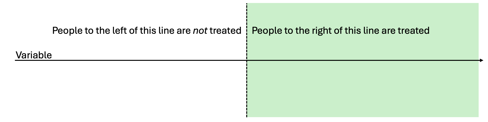
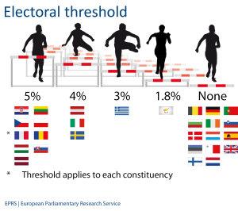
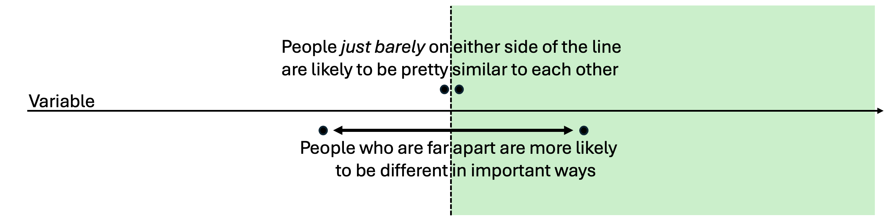
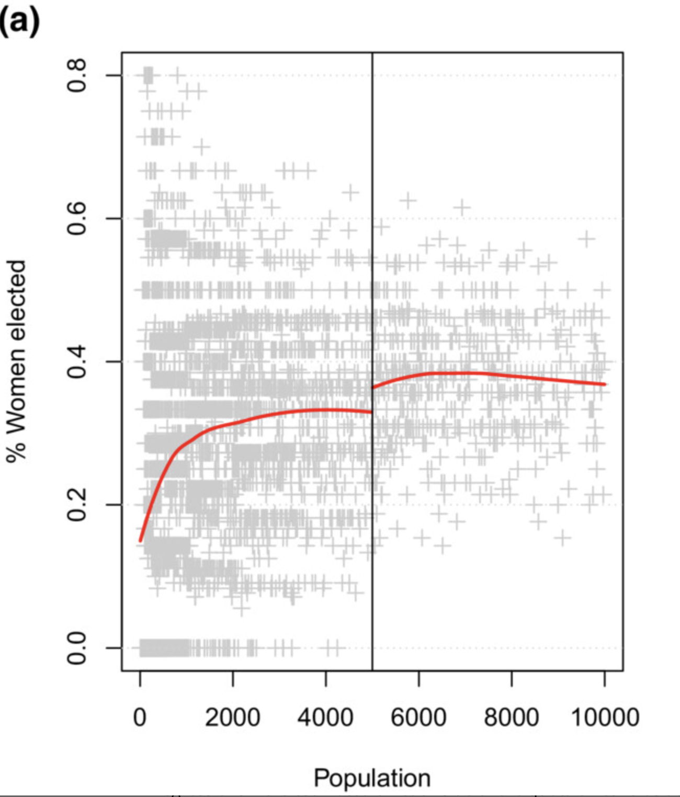
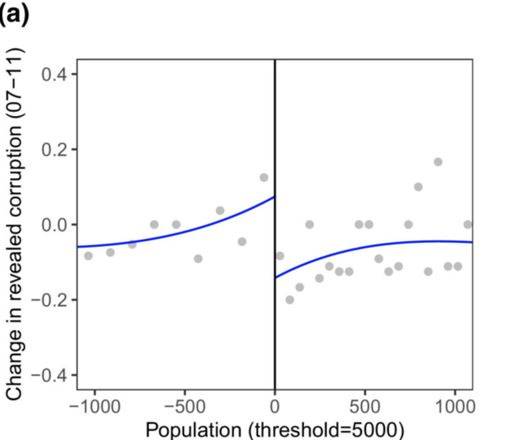
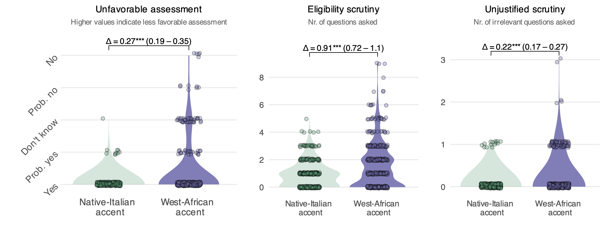
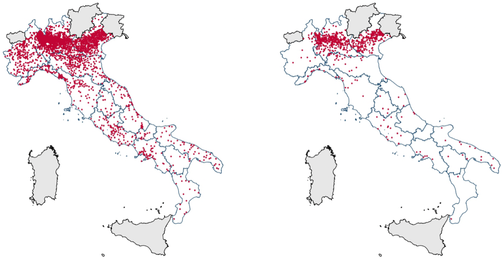
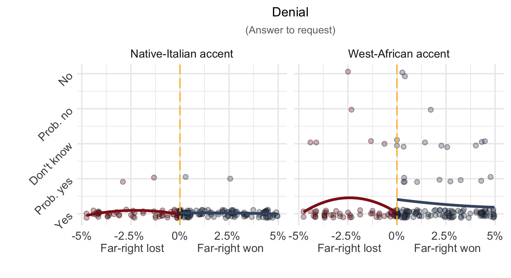

```{r setup, include = FALSE}
library(RefManageR)
library(knitr)

options(htmltools.preserve.raw = FALSE,
        htmltools.dir.version = FALSE, servr.interval = 0.5, width = 115, digits = 3)
knitr::opts_chunk$set(
  collapse = TRUE, message = FALSE, fig.retina = 3, error = TRUE,
  warning = FALSE, cache = FALSE, fig.align = 'center',
  comment = "#", strip.white = TRUE, tidy = FALSE)

BibOptions(check.entries = FALSE,
           bib.style = "authoryear",
           style = "markdown",
           hyperlink = FALSE,
           no.print.fields = c("doi", "url", "ISSN", "urldate", "language", "note", "isbn", "volume"))
myBib <- ReadBib("../Stats_II.bib", check = FALSE)
```

```{r data, include = FALSE}
pacman::p_load(
  tidyverse,        # Data manipulation & plots
  estimatr,         # OLS with robust SE
  modelsummary,     # Regression tables
  masteringmetrics, # The MLDA data
  rdrobust)         # Non-parametric RDD

# Minimum legal drinking age (MLDA): US deaths per 100,000, by age cell.
data("mlda", package = "masteringmetrics")
mlda <- mlda %>%
  drop_na() %>%
  mutate(
    D    = if_else(agecell < 21, 0, 1),  # 1 = old enough to drink legally
    age0 = agecell - 21,                 # Running variable, centred at the cutoff
    side = if_else(agecell < 21, "Below 21", "21 or older"))

# Brand palette for the RDD plots
col_below <- "#6b7f95"   # control side (too young)
col_above <- "#901A1E"   # treated side (KU red)
col_cut   <- "#111111"

# --- Models used across the deck ---
# Parametric: linear and quadratic, full data
RDD_lin  <- lm_robust(all ~ D * age0, data = mlda)
RDD_poly <- lm_robust(all ~ D * poly(age0, 2, raw = TRUE), data = mlda)

# Non-parametric: local linear + triangular kernel + optimal bandwidth
BW_all    <- rdbwselect(mlda$all, mlda$agecell, c = 21)
RDD_all   <- rdrobust(y = mlda$all, x = mlda$agecell, c = 21)
RDD_drive <- rdrobust(y = mlda$mva, x = mlda$agecell, c = 21)

# Numbers for the prose (robust inference — what rdrobust's summary reports)
b_lin  <- coef(RDD_lin)["D"]
b_poly <- coef(RDD_poly)["D"]
rd_est <- RDD_all$coef[1]
rd_p   <- RDD_all$pv[3]            # robust p-value
rd_cil <- RDD_all$ci[3, 1]        # robust 95% CI
rd_cih <- RDD_all$ci[3, 2]
rd_bw  <- RDD_all$bws[1, 1]
rd_n   <- sum(RDD_all$N_h)
mva_est <- RDD_drive$coef[1]
mva_p   <- RDD_drive$pv[3]
mva_pct <- 100 * mva_est / rd_est

# Trim rdrobust's / rdbwselect's long summaries to the lines that fit a slide
trim_rd <- function(mod) {
  o <- capture.output(summary(mod))
  cat(o[c(3, 5:7, 10:12, 15, 20:25)], sep = "\n")
}
trim_bw <- function(mod) {
  o <- capture.output(summary(mod))
  cat(o[c(3:6, 15:20)], sep = "\n")
}

# modelsummary prepends a stray &nbsp; to a lone column header — strip it. Use with results='asis'.
ms <- function(...) {
  cat(gsub("&amp;nbsp;", "", as.character(modelsummary(..., output = "kableExtra"))))
}

# A small helper: fit local lines on each side and draw solid (in view) + dashed (extrapolated)
rdd_plot <- function(formula = all ~ agecell, bw = NULL, zoom = NULL) {
  d <- mlda
  if (!is.null(bw)) d <- d
  ml <- lm(formula, data = subset(mlda, agecell < 21))
  mr <- lm(formula, data = subset(mlda, agecell >= 21))
  g  <- data.frame(agecell = seq(min(mlda$agecell), max(mlda$agecell), length.out = 300))
  g$pl <- predict(ml, g); g$pr <- predict(mr, g)
  list(ml = ml, mr = mr, g = g)
}
```

## By the end of today you can … {.inverse background-color="#901A1E"}

1. explain the **RDD logic** — why falling *just* above or below a strict rule's threshold is "as good as random", and how that connects to the **natural experiments** of Lecture 7;

2. estimate a **parametric RDD** with OLS — a centred running variable, a treatment dummy, an interaction — and weigh the **bias–reliability trade-off** a bandwidth controls;

3. run a **non-parametric** local-linear RDD with `rdrobust()` — optimal bandwidth and triangular-kernel weights — and read what it estimates: a **LATE, local to the cutoff**.

::: {.backgrnote}
One part per goal. Our running question: **what is the causal effect of legal drinking on mortality?**
:::

::: {.notes}
Frame the day as the last of the causal-design toolkit. We have randomised (L6), found nature's experiments (L7), instrumented (L10), and adjusted (L8/9). Today: exploit a *rule*. Stress up front that RDD is not a new statistical machine — it is OLS again — but a new *design* argument. Goal 1 is the idea, goal 2 is the hand-rolled version, goal 3 is the button you actually press.
:::

## The logic of a discontinuity {.inverse background-color="#901A1E"}

[Part 1 of 3]{.part-pill}

::: {.lead}
No randomiser, no instrument — just a strict rule that nature draws a sharp line through.
:::

## Remember RCTs

::: {.push-left}
```{r rct-img, echo = FALSE, out.width='72%'}

```

If we **randomly** split people into treatment and control, they come from the same population — similar on average *in every way*, including their untreated potential outcome $Y_0$.

$$E[Y_{0i}\mid D=1] = E[Y_{0i}\mid D=0]$$
:::

::: {.push-right}
$$\begin{aligned}
E&[Y_{1i}\mid D=1] - E[Y_{0i}\mid D=0] \\[4pt]
 &= E[\color{red}{Y_{0i}+\kappa}\mid D=1] - E[Y_{0i}\mid D=0] \\[4pt]
 &= \color{red}{\kappa} + \underbrace{E[Y_{0i}\mid D=1] - E[Y_{0i}\mid D=0]}_{=\,0\ \text{(if randomisation worked)}} \\[4pt]
 &= \color{red}{\kappa}.
\end{aligned}$$

::: {.backgrnote}
Balanced groups $\rightarrow$ the raw difference *is* the causal effect $\kappa$. The whole course has been about buying that balance.
:::
:::

::: {.notes}
A deliberate callback to Lecture 6, one minute only. The point is the mechanism: randomisation balances the *untreated* potential outcome, so the group that never differed on $Y_0$ can be compared directly. RDD is about to buy the same balance without a randomiser — by looking only where a rule splits otherwise-similar people.
:::

## RDD is different: rules, not randomness

::: {.push-left}
::: {.content-box-blue}
We don't use randomness, but **strict rules**. A rule creates a sharp **threshold** on an otherwise continuous variable.
:::

Societies are full of thresholds that decide who gets what:

- **Pension age** — one day older and you may draw your pension without penalty.
- **GPA cut-off** — just above it you study sociology; just below, you don't.
- **Electoral threshold** — 5 % of the vote and the party enters parliament; 4.9 % and it gets nothing.
:::

::: {.push-right}
```{r thresh-img, echo = FALSE, out.width='78%'}

```

::: {.content-box-green .center}
Can you think of other examples?
:::
:::

::: {.notes}
Get them generating examples — driving age, conscription cohorts, means-tested benefits, class-size caps, exam pass marks, tax brackets. The common structure: a continuous score, a bright line, and a treatment that switches on at the line. That structure is the whole design; spotting it in the wild is the creative part, exactly as with natural experiments last month.
:::

## The intuition

::: {.push-left}
**Compare everyone** either side of the line? The two groups differ in all sorts of ways — a poor GPA student and a top one are simply different people. That is **selection bias**.

**Compare only those *just barely* either side?** A student on 6.09 and one on 6.11 are, for all practical purposes, **the same** — bar the luck of the line.
:::

::: {.push-right}
```{r intu-img, echo = FALSE, out.width='100%'}

```

::: {.content-box-green .center}
Just below vs. barely above the threshold is often **as good as random**.
:::
:::

::: {.notes}
This is the emotional core of the lecture and the callback to L5/L7: near the cutoff, assignment is as-if random. Far from it, we are back to comparing apples and oranges. Make them feel the trade-off physically — squeeze the window and the comparison gets cleaner but the sample shrinks. That tension is Part 2 and Part 3.
:::

## Two assumptions

::: {.push-left}
::: {.content-box-blue}
The rule is strict, not random — yet **barely below vs. barely above is as good as random**, *if* two things hold.
:::
:::

::: {.push-right}
1. **Continuity.** Without the rule, the running variable and the outcome would relate **smoothly** across the cutoff — no natural jump would sit exactly there.

2. **No sorting.** Cases cannot **manipulate** which side of the line they land on. If people can nudge themselves just over, the ones who do are self-selected — and the magic is gone.
:::

::: {.notes}
Both assumptions are about the counterfactual world without the rule. Continuity: nothing *else* changes discontinuously at 21 (nothing but the drinking law flips on your 21st birthday). No sorting: a GPA cutoff is dangerous if teachers bump borderline students over; a birthday cutoff is safe because nobody chooses their birthday. Foreshadow that "no sorting" is testable-ish (look for a jump in the *density* at the cutoff), continuity is not — the same untestable-assumption flavour as the exclusion restriction in L7/L10.
:::

## The central RDD trade-off

::: {.push-left}
Compare **all** cases either side:

1. Maximum sample $\rightarrow$ a **reliable** (precise) estimate.
2. But the comparison is **invalidated by selection bias**.
:::

::: {.push-right}
Compare only cases **just barely** either side:

1. Tiny sample $\rightarrow$ an **unreliable** (noisy) estimate.
2. But the comparison is as good as random $\rightarrow$ **unbiased** — a *local* average treatment effect $(\lambda, \text{LATE})$.
:::

::: {.content-box-green .center style="clear: both;"}
The entire craft of RDD is finding the **best trade-off** between an unbiased $\lambda$ and a reliable one.
:::

::: {.notes}
Name the two failure modes so students can diagnose a bad RDD later: too wide a window buys precision at the cost of bias; too narrow buys credibility at the cost of noise. Everything technical today — bandwidths, kernels, `rdrobust` — is machinery for locating the sweet spot. Hold the green box; it is the thesis of the lecture.
:::

## You already know this $\lambda$ {background-color="#f5f0e8"}

::: {.push-left}
In **Lecture 7** the effect was a **ratio**, $\lambda = \rho/\phi$, because only *some* people complied with the instrument — we had to divide out the non-compliers.

::: {.content-box-blue}
**Ask yourself:** in a **sharp** RDD, *everyone* above the cutoff is treated and *everyone* below is not. What happens to $\phi$?
:::
:::

::: {.push-right}
::: {.fragment}
$\phi = 1$ — the rule moves treatment **perfectly**. So there is nothing to divide out:

$$\lambda = \frac{\rho}{\phi} = \frac{\text{jump at the cutoff}}{1} = \textbf{the jump itself.}$$

::: {.content-box-green}
Sharp RDD is IV with **perfect compliance**. The vertical gap at the threshold *is* the causal effect. And "local" now means **local to the cutoff** — not "for compliers" as in L7.
:::
:::
:::

::: {.notes}
This is the slide that stitches today onto Lectures 7 and 10, and it is worth pausing on because students otherwise file RDD as an unrelated trick. Sharp RDD = perfect compliance, so the Wald denominator is one and the reduced-form jump is the effect. Flag the two senses of "local" explicitly: L7's LATE is local to *compliers*; RDD's LATE is local to units *at the threshold*. Mention in passing that fuzzy RDDs exist (the rule only *nudges* treatment probability, so we are back to dividing by a first stage) but we stay sharp today.
:::

## Estimating it with OLS {.inverse background-color="#901A1E"}

[Part 2 of 3]{.part-pill}

::: {.lead}
Turning 21 makes drinking legal. Does it also make you more likely to die?
:::

## The research question of the day {.inverse background-color="#901A1E"}

::: {.push-left}
In the US you may drink legally at **21**. Nothing else about a person changes overnight on that birthday — but their **legal** access to alcohol jumps.

::: {.content-box-blue}
**Research question of the day:** what is the **causal effect** of legal drinking on **mortality**?
:::
:::

::: {.push-right}
The running variable is **age** (in month-wide cells); the cutoff is **21**; the treatment is **legal drinking**.

::: {.backgrnote}
Data: US deaths per 100,000, ages 20–22, 1997–2003 — the `mlda` data from Angrist & Pischke's *Mastering 'Metrics*.
:::
:::

::: {.notes}
Set the design out loud in the RDD vocabulary before any code: outcome = mortality, running variable = age, cutoff = 21, treatment = legal drinking. Ask what could confound a naive "do 21-year-olds die more than 20-year-olds?" comparison — maturation, income, independence — and note that none of those jump *discontinuously* at 21. Only the law does. That is the identifying idea.
:::

## The data

::: {.panel-tabset}

### MLDA data
::: {.small}
```{r mlda-show, eval = FALSE}
data("mlda", package = "masteringmetrics")
mlda <- drop_na(mlda)          # one row per one-month age cell
head(mlda)
```

```{r mlda-head, echo = FALSE}
head(mlda[, c("agecell", "all", "mva", "D", "age0")], 6)
```
:::

### Plot
```{r mlda-plot, echo = FALSE, out.width='62%', fig.height = 4.2, fig.width = 8}
ggplot(mlda, aes(y = all, x = agecell)) +
  geom_vline(xintercept = 21, colour = col_cut, linetype = "dashed") +
  geom_point(aes(colour = agecell >= 21), size = 2.4) +
  scale_colour_manual(values = c(`FALSE` = col_below, `TRUE` = col_above)) +
  labs(y = "Deaths per 100,000\n(ages 20–22, 1997–2003)", x = "Age (years + months)") +
  theme_minimal(base_size = 14) + guides(colour = "none")
```

### Code
```{r mlda-plot-code, eval = FALSE}
ggplot(mlda, aes(y = all, x = agecell)) +
  geom_vline(xintercept = 21, linetype = "dashed") +
  geom_point(aes(colour = agecell >= 21)) +
  labs(y = "Deaths per 100,000", x = "Age (years + months)")
```

:::

::: {.notes}
Let them look before you talk: is there a step at 21? Most students see it. Note the granularity — each dot is a one-month age cell, not a person, which is why the sample is small (that matters for reliability later). The eye already does informal RDD; our job is to make "is there a jump, and how big?" precise.
:::

## OLS finds the trade-off

::: {.push-left}
1. Use **all** the data to fit the lines $\rightarrow$ *reliable*.
2. Let OLS compare treated vs. control **exactly at 21** $\rightarrow$ *unbiased*.
3. The effect is still **local**: it might look different if the cutoff were 16.
:::

::: {.push-right}
```{r ols-lines, echo = FALSE, out.width='100%', fig.height = 5, fig.width = 8}
p <- rdd_plot()
ggplot(mlda, aes(y = all, x = agecell)) +
  annotate("segment", x = 21, xend = 21, y = p$g$pl[which.min(abs(p$g$agecell - 21))],
           yend = p$g$pr[which.min(abs(p$g$agecell - 21))],
           colour = col_cut, linewidth = 1.3) +
  geom_vline(xintercept = 21, colour = col_cut, linetype = "dashed") +
  geom_point(aes(colour = side), size = 2.4, alpha = .85) +
  geom_line(data = subset(p$g, agecell <= 21), aes(y = pl), colour = col_below, linewidth = 1.3) +
  geom_line(data = subset(p$g, agecell >  21), aes(y = pl), colour = col_below, linewidth = 1, linetype = "dashed") +
  geom_line(data = subset(p$g, agecell >= 21), aes(y = pr), colour = col_above, linewidth = 1.3) +
  geom_line(data = subset(p$g, agecell <  21), aes(y = pr), colour = col_above, linewidth = 1, linetype = "dashed") +
  scale_colour_manual(values = c("Below 21" = col_below, "21 or older" = col_above)) +
  labs(y = "Deaths per 100,000", x = "Age (years + months)",
       caption = "Solid = fitted in range · dashed = extrapolated · black bar = the jump at 21") +
  theme_minimal(base_size = 14) + guides(colour = "none")
```
:::

::: {.notes}
The picture makes the estimator obvious: two regression lines, one per side, and the effect is the vertical distance between them *at the cutoff*, not anywhere else. The dashed extensions are counterfactual — what each side predicts for the other, which is exactly the potential-outcome contrast. Reliability comes from using every point to fit the lines; unbiasedness comes from reading the gap only at 21.
:::

## Linear parametric RDD

::: {.push-left}
$$Y_i = \alpha + \color{red}{\lambda} D_i + \beta_1 a_i + \beta_2 (D_i \times a_i) + e_i$$

- $D_i$ — above (1) or below (0) the threshold.
- $a_i$ — the **running variable** (age), **centred at the cutoff** so $\lambda$ reads *at* 21.
- $D_i \times a_i$ — lets the slope **differ** on each side.

::: {.content-box-green}
$\color{red}{\lambda}$ is the jump at the cutoff: **`r sprintf("%.1f", b_lin)`** more deaths per 100,000 the moment drinking becomes legal.
:::
:::

::: {.push-right}
```{r lin-code}
mlda <- mlda %>%
  mutate(D    = if_else(agecell < 21, 0, 1),
         age0 = agecell - 21)          # centre the running variable

RDD_lin <- lm_robust(all ~ D * age0, data = mlda)
```

::: {.small}
```{r lin-tab, echo = FALSE, results = 'asis'}
ms(list("Deaths per 100,000" = RDD_lin),
   coef_rename = c("D" = "Legal to drink (λ)", "age0" = "Age (centred)",
                   "D:age0" = "Legal × age"),
   stars = TRUE, gof_map = c("nobs", "r.squared"))
```
:::
:::

::: {.notes}
Three things to underline. First, centring: subtract 21 so the intercept shift $D$ is evaluated at the cutoff, not at age zero — without it $\lambda$ is meaningless. Second, the interaction lets the age–mortality slope differ above and below, which we want; forcing one slope would bias the jump. Third, read $\lambda$ with units: about nine and a half extra deaths per 100,000, right at the birthday. That is the parametric answer; the rest of the lecture stress-tests it.
:::

## Problem 1: is a straight line right?

::: {.push-left}
Nothing guarantees the relationship is **linear**. If the true curve bends, two straight lines will **miss** at the cutoff — and mistake curvature for a jump.

::: {.backgrnote}
**Recall Lecture 12.** A `poly(age0, 2, raw = TRUE)` term adds a squared term to bend the line — same tool, and the effect of age is again *no longer one number*.
:::

::: {.content-box-red}
**Beware (also L12):** chasing $\max(R^2)$ with ever-higher polynomials **overfits** — a high-degree curve swings wildly exactly at the **boundary we care about**. Overfitting there becomes **bias** in $\lambda$.
:::
:::

::: {.push-right}
```{r form-plot, echo = FALSE, out.width='100%', fig.height = 5, fig.width = 8}
ml <- lm(all ~ agecell, data = subset(mlda, agecell < 21))
mr <- lm(all ~ agecell, data = subset(mlda, agecell >= 21))
ql <- lm(all ~ poly(agecell, 2), data = subset(mlda, agecell < 21))
qr <- lm(all ~ poly(agecell, 2), data = subset(mlda, agecell >= 21))
g  <- data.frame(agecell = seq(min(mlda$agecell), max(mlda$agecell), length.out = 300))
g$lin_l <- predict(ml, g); g$lin_r <- predict(mr, g)
g$q_l   <- predict(ql, g); g$q_r   <- predict(qr, g)

ggplot(mlda, aes(y = all, x = agecell)) +
  geom_vline(xintercept = 21, colour = col_cut, linetype = "dashed") +
  geom_point(aes(colour = side), alpha = .5, size = 2) +
  geom_line(data = subset(g, agecell <= 21), aes(y = lin_l, linetype = "Linear"), colour = col_below, linewidth = 1) +
  geom_line(data = subset(g, agecell >= 21), aes(y = lin_r, linetype = "Linear"), colour = col_above, linewidth = 1) +
  geom_line(data = subset(g, agecell <= 21), aes(y = q_l, linetype = "Quadratic"), colour = col_below, linewidth = 1.2) +
  geom_line(data = subset(g, agecell >= 21), aes(y = q_r, linetype = "Quadratic"), colour = col_above, linewidth = 1.2) +
  scale_colour_manual(values = c("Below 21" = col_below, "21 or older" = col_above), guide = "none") +
  scale_linetype_manual(values = c("Linear" = "solid", "Quadratic" = "21"), name = NULL) +
  labs(y = "Deaths per 100,000", x = "Age (years + months)") +
  theme_minimal(base_size = 14) + theme(legend.position = "top")
```
:::

::: {.notes}
This is the Lecture 12 callback, and it should feel like revision, not new material. A quadratic bends each side; whether the bend is real or noise is the judgement call. The danger is specific to RDD: overfitting anywhere is bad, but here the wobble lands right at the boundary where we read the effect, so it corrupts the one number we care about. Hold the discipline from L12 — lowest degree that captures a shape you can defend, almost always two.
:::

## Linear vs. quadratic $\lambda$

::: {.push-left}
$$\small Y_i = \alpha + \color{red}{\lambda} D_i + \beta_1 a_i + \beta_2 a_i^2 + \beta_3 (a_i D_i) + \beta_4 (a_i^2 D_i) + e_i$$

```{r poly-code, eval = FALSE}
RDD_poly <- lm_robust(
  all ~ D * poly(age0, 2, raw = TRUE),
  data = mlda)
```

::: {.content-box-green}
Allowing a curve moves the jump from **`r sprintf("%.1f", b_lin)`** to **`r sprintf("%.1f", b_poly)`**. The functional form is a *real* modelling choice — not a detail.
:::
:::

::: {.push-right}
::: {.small}
```{r poly-tab, echo = FALSE, results = 'asis'}
modelsummary(list("Linear" = RDD_lin, "Quadratic" = RDD_poly),
             coef_map = c("D" = "Legal to drink (λ)"),
             stars = TRUE, gof_map = c("nobs", "r.squared"), output = "kableExtra")
```
:::

::: {.backgrnote}
Same data, same cutoff — a different curve, a different $\lambda$. Which do we believe? That question drives Part 3.
:::
:::

::: {.notes}
Show only $\lambda$ in the table to keep the eye on the estimand — the higher-order terms are nuisance parameters here. The honest message: the answer moved by two deaths purely by changing the assumed shape, and we have no strong reason to prefer either global polynomial. That discomfort motivates abandoning global fits altogether in favour of *local* linear regression near the cutoff, which is where Part 3 goes.
:::

## Problem 2: which cases should count?

::: {.push-left}
Should a 19-year-old, two years from the cutoff, really shape the estimated **jump at 21**?

In RDD we care about the **boundary**. Cases far away carry little information about it — and force the curve to bend for reasons irrelevant to the cutoff.

$\rightarrow$ Restrict to a **bandwidth** around the threshold.
:::

::: {.push-right}
::: {.panel-tabset}

### Bandwidth
::: {style="font-size: 1.4em;"}
```{r bw-select, echo = FALSE, comment = ""}
trim_bw(BW_all)
```
:::

### R code
```{r bw-select-code, eval = FALSE}
rdbwselect(mlda$all, mlda$agecell, c = 21) %>%
  summary()
```

:::

::: {.content-box-green}
The algorithm picks the window that best balances $\frac{\text{reliability}}{\text{bias}}$: here about **± `r sprintf("%.2f", rd_bw)`** years around 21.
:::
:::

::: {.notes}
Motivate the bandwidth as the formal version of "compare people who are similar". `rdbwselect` chooses the window that minimises expected error — wide enough for signal, narrow enough to avoid bias. Don't dwell on the MSE-optimal derivation; the message is that the window is *chosen by a principled rule*, not by the researcher's taste, which protects against fishing for a bandwidth that gives the answer you want.
:::

## Break {.inverse background-color="#901A1E"}

<div class="ku-timer" data-min="15"></div>

## Your turn: exercise 1

::: {.left-column}
**Can a government buy the loyalty of the poor?** You replicate **Manacorda, Miguel & Vigorito (2011)**: Uruguay's PANES cash transfer went to households below an income score. Did the money buy **political support** for the government that sent it? Fit a **parametric** RDD and read the local effect.

[**Open exercise 1 in a new tab ↗**](13-exercise1.html){target="_blank"}

<div class="ku-timer" data-min="20"></div>
:::

::: {.right-column}
<iframe src='13-exercise1.html' width='100%' height='620' frameborder='0' scrolling='yes' style="border:1px solid #ddd; border-radius:6px;"></iframe>
:::

## Doing it properly: `rdrobust` {.inverse background-color="#901A1E"}

[Part 3 of 3]{.part-pill}

::: {.lead}
Drop the global polynomial. Fit a straight line *locally*, and weight the cases that matter.
:::

## Prefer local linear to global polynomial

::: {.push-left}
A global polynomial must fit points **far** from the cutoff, so it can **swing** to reach them.

$\downarrow$

Polynomials are **notoriously unstable at the boundaries** of the data.

$\downarrow$

In RDD the **boundary is all we care about**.

$\downarrow$

::: {.content-box-red}
So a wild boundary swing lands exactly on $\lambda$ $\rightarrow$ **bias**. Inside a narrow window, a **straight line** is safer.
:::
:::

::: {.push-right}
```{r local-plot, echo = FALSE, out.width='100%', fig.height = 5, fig.width = 8}
bw <- rd_bw
mlda <- mlda %>% mutate(inbw = if_else(abs(age0) <= bw, "Inside", "Outside"))
ll <- lm(all ~ agecell, data = subset(mlda, agecell < 21 & age0 >= -bw))
lr <- lm(all ~ agecell, data = subset(mlda, agecell >= 21 & age0 <= bw))
g2 <- data.frame(agecell = seq(21 - bw, 21 + bw, length.out = 100))
g2$pl <- predict(ll, g2); g2$pr <- predict(lr, g2)

ggplot(mlda, aes(y = all, x = agecell)) +
  annotate("rect", xmin = 21 - bw, xmax = 21 + bw, ymin = -Inf, ymax = Inf,
           fill = "grey80", alpha = .4) +
  geom_vline(xintercept = 21, colour = col_cut, linetype = "dashed") +
  geom_point(aes(colour = side, shape = inbw), size = 2.4, alpha = .8) +
  scale_shape_manual(values = c("Inside" = 19, "Outside" = 1)) +
  geom_line(data = subset(g2, agecell <= 21), aes(y = pl), colour = col_below, linewidth = 1.4) +
  geom_line(data = subset(g2, agecell >= 21), aes(y = pr), colour = col_above, linewidth = 1.4) +
  scale_colour_manual(values = c("Below 21" = col_below, "21 or older" = col_above)) +
  labs(y = "Deaths per 100,000", x = "Age (years + months)",
       caption = "Shaded = optimal bandwidth · solid dots count · straight lines fitted locally") +
  theme_minimal(base_size = 14) + guides(colour = "none", shape = "none")
```
:::

::: {.notes}
The reversal students must absorb: for *global* fits a polynomial beats a line because it is flexible, but for *boundary* estimation that flexibility is a liability — polynomials misbehave at the edges (Runge's phenomenon, if anyone asks). Inside a small window a line is both flexible enough and stable at the edge. So the modern default is not "higher polynomial" but "local linear inside a chosen bandwidth". Point at the hollow dots: they no longer distort the fit.
:::

## Weight by closeness: the kernel

::: {.push-left}
The bandwidth is blunt: a case just inside counts fully, a case just outside not at all.

Better to let importance **fade with distance** — cases nearer the cutoff embody the RDD logic most.

::: {.content-box-green}
The **triangular kernel** is the default: full weight *at* the cutoff, linearly down to zero at the bandwidth edge. It prioritises the one thing we care about — the value **at the line**.
:::
:::

::: {.push-right}
```{r kernel-plot, echo = FALSE, out.width='100%', fig.height = 5, fig.width = 8}
df <- tibble(distance = seq(-1, 1, by = .01)) %>%
  mutate(Triangular = 1 - abs(distance),
         Uniform = 1,
         Epanechnikov = 1 - distance^2) %>%
  pivot_longer(-distance, names_to = "Kernel", values_to = "Weight")

ggplot(df, aes(distance, Weight, colour = Kernel, linetype = Kernel)) +
  geom_vline(xintercept = 0, colour = col_cut, linetype = "dashed") +
  geom_line(linewidth = 1.3) +
  scale_colour_manual(values = c("Triangular" = col_above, "Uniform" = "grey55",
                                 "Epanechnikov" = "#425570")) +
  labs(x = "Distance from cutoff", y = "Weight (importance)",
       title = "How kernels weight cases by distance") +
  theme_minimal(base_size = 14) + theme(legend.position = "bottom")
```
:::

::: {.notes}
Three kernels, one idea: how fast should a case's vote fade as it moves from the line? Uniform is the plain bandwidth (everyone inside counts equally — the box). Triangular tents down to zero at the edge and is `rdrobust`'s default because it is optimal for estimating a value *at a boundary*. Epanechnikov is the middle. Students don't need the maths; they need to know the default is triangular and *why* — the cutoff value is the estimand, so weight the cutoff most.
:::

## All in one: `rdrobust()`

::: {.push-left}
`rdrobust()` implements the state of the art: **local linear** regression within an **optimised bandwidth**, using **triangular-kernel** weights.

`mlda$all` = all deaths per 100,000.

::: {.content-box-green}
The jump: **`r sprintf("%.1f", rd_est)`** more deaths per 100,000 (95 % CI [`r sprintf("%.1f", rd_cil)`, `r sprintf("%.1f", rd_cih)`], robust $p = `r sprintf("%.3f", rd_p)`$), from the **`r rd_n`** cells in the optimal window.
:::
:::

::: {.push-right}
::: {.panel-tabset}

### Estimate
::: {style="font-size: 1.4em;"}
```{r rdrobust-all, echo = FALSE, comment = ""}
trim_rd(RDD_all)
```
:::

### R code
```{r rdrobust-all-code, eval = FALSE}
RDD_all <- rdrobust(
  y = mlda$all,       # Outcome
  x = mlda$agecell,   # Running variable
  c = 21)             # Threshold
summary(RDD_all)
```

:::
:::

::: {.notes}
This is the payoff — one function that bundles the whole lecture. Walk the output: the bandwidth `rdrobust` chose, the number of effective observations either side, and the point estimate with its robust confidence interval. Note it lands close to our parametric quadratic, which is reassuring — the answer is not an artefact of one modelling choice. This is the line you would actually write in a paper.
:::

## Was it the drinking, or just age?

::: {.push-left}
If legal alcohol is the mechanism, the jump should be concentrated in **alcohol-related** deaths — above all **motor-vehicle** accidents.

`mlda$mva` = motor-vehicle deaths per 100,000.

::: {.content-box-green}
The traffic jump is **`r sprintf("%.1f", mva_est)`** — about **`r round(mva_pct)` %** of the all-cause jump. Roughly half of the extra deaths are on the road.
:::

::: {.backgrnote}
On this subgroup alone the robust interval is wide (p = `r sprintf("%.2f", mva_p)`) — a point estimate consistent with the alcohol story, not a second significance claim.
:::
:::

::: {.push-right}
::: {.panel-tabset}

### Estimate
::: {style="font-size: 1.4em;"}
```{r rdrobust-mva, echo = FALSE, comment = ""}
trim_rd(RDD_drive)
```
:::

### R code
```{r rdrobust-mva-code, eval = FALSE}
RDD_drive <- rdrobust(
  y = mlda$mva,       # Motor-vehicle deaths
  x = mlda$agecell,
  c = 21)
summary(RDD_drive)
```

:::
:::

::: {.notes}
This is a placebo-style logic check, and good RDD practice: if the story is alcohol, the effect should show up where alcohol kills, not spread evenly across causes. It does — half the excess deaths are motor-vehicle, exactly what a drinking mechanism predicts. Ask what other causes they'd expect to jump (alcohol poisoning, homicide, drowning) and which they would *not* (cancer) — the ones that don't move are the reassurance.
:::

## Research question answered {.inverse background-color="#901A1E"}

::: {.lead}
Making alcohol legal at 21 causes about **`r sprintf("%.1f", rd_est)` more deaths per 100,000**.

Roughly **half** of them are extra **traffic** deaths.
:::

::: {.notes}
Land the substantive point cleanly, then the design point: we learned this without an RCT, without an instrument, without controlling for anything — just by exploiting a rule and looking narrowly at the people it barely separates. That is the power of a discontinuity. Note the policy stakes and the LATE caveat: this is the effect *at 21*, for people near the margin, not necessarily what a cutoff at 18 would show.
:::

## Another rule: women and corruption

::: {.push-left}
`r Citet(myBib, "pereira_does_nodate")` use a Spanish law: from **2007**, municipalities above **5,000** residents had to fill **≥ 40 %** of party lists with women.

- **Outcome:** revealed corruption
- **Running variable:** municipality population
- **Cutoff:** 5,000

The quota **jumps** the share of women elected right at 5,000 — a textbook first stage.
:::

::: {.push-right}
```{r women1-img, echo = FALSE, out.width='84%'}

```

::: {.backgrnote .center}
% women elected jumps at the 5,000 threshold. *Source:* `r Citet(myBib, "pereira_does_nodate")`.
:::
:::

::: {.notes}
A clean second example on entirely different data, to show the design travels. The population cutoff is a favourite in political economy because it is administrative and hard to manipulate at exactly 5,000. Point out this plot is the "first stage" in RDD clothing: the treatment (share of women) genuinely jumps at the line, which is what licenses asking whether the *outcome* jumps too.
:::

## Women and corruption: the effect

::: {.push-left}
::: {.content-box-green}
There **is** an effect — more women, less revealed corruption at the cutoff.
:::

But **why**? A jump tells us *that*, not *how*.
:::

::: {.push-right}
```{r women2-img, echo = FALSE, out.width='96%'}

```

::: {.backgrnote .center}
*Source:* `r Citet(myBib, "pereira_does_nodate")`.
:::
:::

::: {.notes}
Use the "why" as a discussion hook — candidate mechanisms: differential socialisation, risk aversion, greater scrutiny of women once elected, or selection into lower-corruption policy areas. The point for method: RDD nails the *causal* jump but is silent on mechanism, just as an RCT would be. Identifying the channel is the next, harder research question — a nice reminder that a clean causal estimate is a beginning, not an end.
:::

## A third rule: far-right mayors and discrimination

::: {.push-left}
`r Citet(myBib, "schaeffer_when_2025")` exploit **close mayoral elections** in Italy: where a far-right candidate **barely won** vs. **barely lost** is as good as random.

- **Outcome:** discrimination in access to healthcare (an audit study)
- **Running variable:** far-right margin of victory
- **Cutoff:** 0 %
:::

::: {.push-right}
```{r farright1-img, echo = FALSE, out.width='96%'}

```

::: {.backgrnote .center}
Callers with a West-African accent get less favourable treatment than native-Italian callers. *Source:* `r Citet(myBib, "schaeffer_when_2025")`.
:::
:::

::: {.notes}
The close-election RDD is one of the most important designs in political sociology, and this is our own corner of it. First establish the outcome exists: an audit study where identical healthcare requests differ only by the caller's accent reveals baseline discrimination against West-African-accented callers. The RDD question is whether electing a far-right mayor *worsens* it — set that up here, deliver it next slide.
:::

## Far-right mayors: the discontinuity

::: {.push-left}
```{r farright-map, echo = FALSE, out.width='88%'}

```

::: {.backgrnote .center}
Municipalities where far-right candidates **ran** vs. **won**. *Source:* `r Citet(myBib, "romarri_far-right_2020")`.
:::
:::

::: {.push-right}
```{r farright2-img, echo = FALSE, out.width='100%'}

```

::: {.backgrnote .center}
Discrimination against West-African-accented callers **jumps** where the far-right *barely won*. *Source:* `r Citet(myBib, "schaeffer_when_2025")`.
:::
:::

::: {.notes}
The running variable is the far-right margin (0 % = the tie that decides the election); left of zero the far right lost, right of zero it won. Read the West-African panel: a clear step up in denial of care right at the cutoff, absent in the native-Italian panel. That contrast is the whole argument — barely-far-right and barely-not municipalities are otherwise alike, so the jump is the causal effect of who governs. A sobering, real-world close to the design.
:::

## Your turn: exercise 2

::: {.left-column}
Back to Uruguay's PANES — *does welfare buy loyalty?* — but now with **`rdrobust()`**: a local-linear, optimal-bandwidth, triangular-kernel estimate. Then push the bandwidth by hand and watch the answer move.

[**Open exercise 2 in a new tab ↗**](13-exercise2.html){target="_blank"}

<div class="ku-timer" data-min="15"></div>
:::

::: {.right-column}
<iframe src='13-exercise2.html' width='100%' height='620' frameborder='0' scrolling='yes' style="border:1px solid #ddd; border-radius:6px;"></iframe>
:::

## Today's general lessons {.inverse background-color="#901A1E"}

1. **The RDD logic.** A strict rule creates a natural experiment: *at* the cutoff, the only difference between treated and untreated is the rule, so assignment is as good as random. Sharp RDD is **IV with perfect compliance** — the jump *is* $\lambda$.

2. **The bias–reliability trade-off.** Wide bandwidth: more data, high precision, but risks comparing dissimilar people (bias). Narrow bandwidth: near-identical people (low bias), but little data (noise).

3. **Functional form matters.** If the data curve and you fit a straight line, you mistake the bend for a jump. Allow curvature (polynomials — but mind the L12 overfitting trap) *or* stay **local linear** in a narrow window.

4. **Weighting — the kernel.** Cases at the cutoff matter most. The **triangular kernel** gives them full weight and fades the rest to zero at the bandwidth edge.

::: {.notes}
Recap briskly against the three goals. If one sentence survives, make it lesson 1 tied to Lecture 7: RDD is not a fourth unrelated method but the natural-experiment idea sharpened to a knife-edge, where perfect compliance turns the Wald ratio into a plain vertical gap. Lessons 2–4 are the craft of estimating that gap honestly.
:::

## Check yourself: today's goals

::: {.checklist}
- Explain why "just below vs. barely above a threshold" is as good as random — and name the two assumptions it rests on.
- Write a parametric RDD in OLS: centred running variable, treatment dummy, interaction — and say what $\lambda$ measures and why we centre.
- Run `rdrobust(y, x, c)` and read its output — knowing it is a **local linear**, triangular-kernel estimate of a **LATE at the cutoff**.
:::

::: {.content-box-green}
Shaky on any of these? That is what this week's **Absalon quiz** and the **Friday exercise class** are for.
:::

## Today's important functions

::: {.small}
- `lm_robust(y ~ D * age0)`: the parametric RDD — treatment dummy, centred running variable, and their interaction (different slopes each side).
- `rdrobust::rdbwselect(y, x, c)`: choose the bandwidth that best trades reliability against bias.
- `rdrobust::rdrobust(y, x, c)`: the state-of-the-art estimate — local linear, optimal bandwidth, triangular-kernel weights.
:::

## References

::: {.small}
```{r ref, results = 'asis', echo = FALSE}
PrintBibliography(myBib)
```
:::

```{=html}
<script>
(function () {
  function fmt(s) { var m = Math.floor(s / 60), ss = s % 60; return m + ":" + (ss < 10 ? "0" : "") + ss; }
  function build(el) {
    var total = (parseInt(el.getAttribute("data-min"), 10) || 5) * 60, rem = total, id = null;
    el.innerHTML =
      '<div class="kt-display">' + fmt(rem) + '</div>' +
      '<div class="kt-btns">' +
        '<button class="kt-start" type="button">Start</button>' +
        '<button class="kt-pause" type="button">Pause</button>' +
        '<button class="kt-reset" type="button">Reset</button>' +
      '</div>';
    var disp = el.querySelector(".kt-display");
    function render() { disp.textContent = fmt(rem); el.classList.toggle("kt-done", rem <= 0); }
    function start() { if (id) return; id = setInterval(function () { if (rem > 0) { rem--; render(); } else { stop(); } }, 1000); }
    function stop() { clearInterval(id); id = null; }
    function reset() { stop(); rem = total; render(); }
    el.querySelector(".kt-start").onclick = start;
    el.querySelector(".kt-pause").onclick = stop;
    el.querySelector(".kt-reset").onclick = reset;
    el._start = start; el._reset = reset; render();
  }
  function init() {
    document.querySelectorAll(".ku-timer").forEach(build);
    if (window.Reveal && Reveal.on) {
      Reveal.on("slidechanged", function (e) {
        document.querySelectorAll(".ku-timer").forEach(function (t) { if (t._reset) t._reset(); });
        var here = e.currentSlide ? e.currentSlide.querySelectorAll(".ku-timer") : [];
        here.forEach(function (t) { if (t._start) setTimeout(t._start, 250); });
      });
    }
  }
  if (document.readyState !== "loading") init();
  else document.addEventListener("DOMContentLoaded", init);
})();
</script>
```
