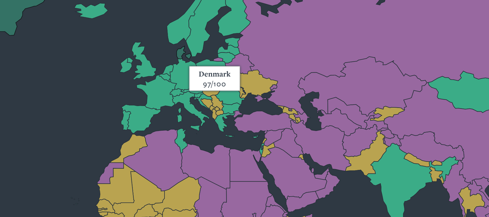
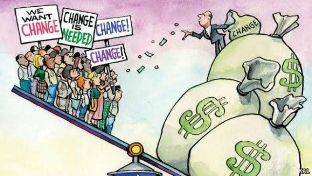
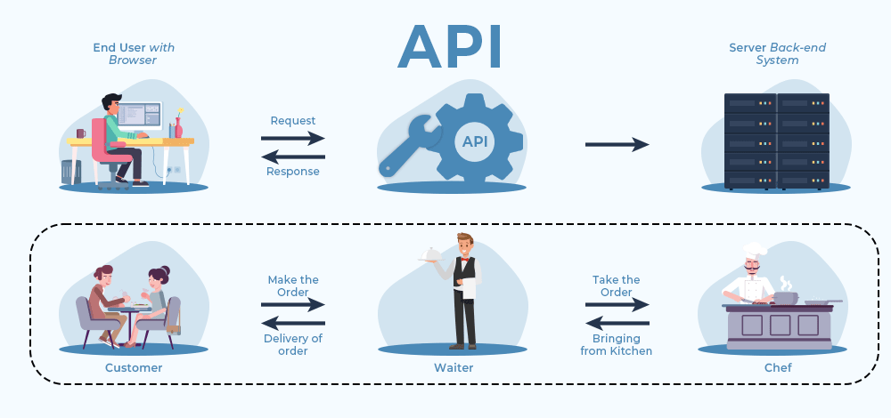
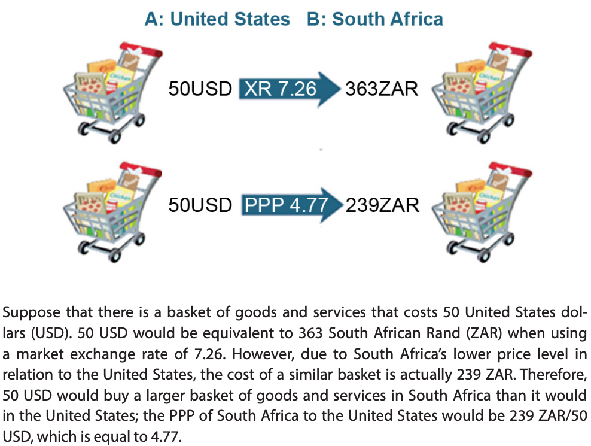
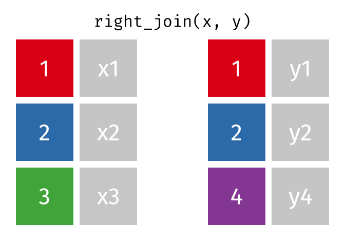
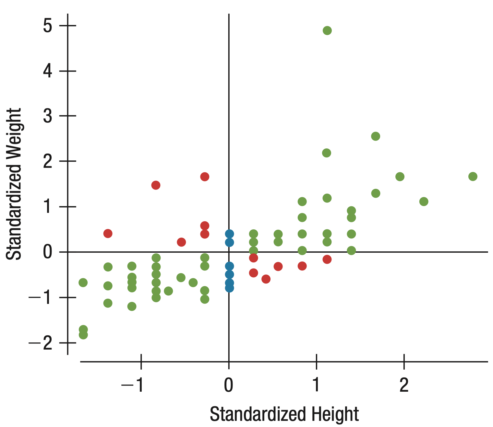
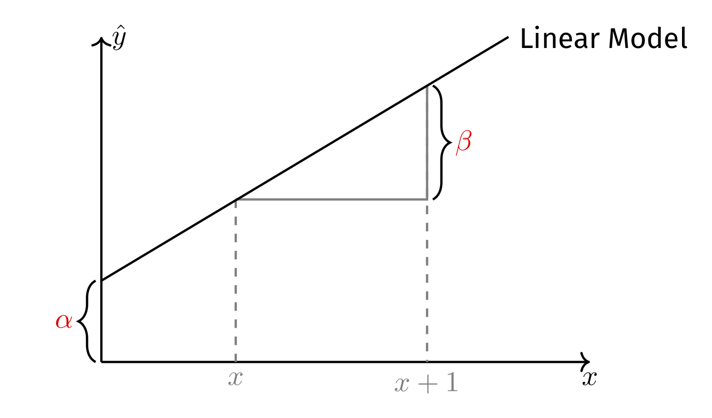
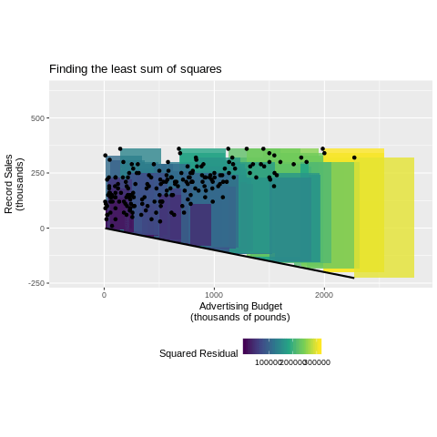
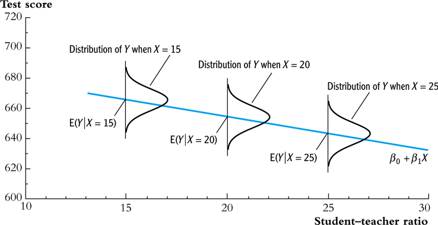

```{r setup, include = FALSE}
library(RefManageR)
library(knitr)
library(ggrepel) # Nicely placed labels in figures
library(modelr)

options(htmltools.preserve.raw = FALSE,
        htmltools.dir.version = FALSE, servr.interval = 0.5, width = 115, digits = 3)
knitr::opts_chunk$set(
  collapse = TRUE, message = FALSE, fig.retina = 3, error = TRUE,
  warning = FALSE, cache = FALSE, fig.align = 'center',
  comment = "#", strip.white = TRUE, tidy = FALSE)

BibOptions(check.entries = FALSE,
           bib.style = "authoryear",
           style = "markdown",
           hyperlink = FALSE,
           no.print.fields = c("doi", "url", "ISSN", "urldate", "language", "note", "isbn", "volume"))
myBib <- ReadBib("../Stats_II.bib", check = FALSE)
```

## By the end of today you can … {.inverse background-color="#901A1E"}

1. **download real data via APIs** (World Bank, V-Dem) and **join** data sets in R;

2. describe a relationship with **scatter plots, z-scores, and the correlation coefficient** $r$;

3. fit and **interpret a bivariate OLS regression** — and say when it may be read causally.

::: {.backgrnote}
One part of today's lecture per goal. Our running question: **is there a liberty–equality trade-off?**
:::

## The question & the data {.inverse background-color="#901A1E"}

[Part 1 of 3]{.part-pill}

::: {.lead}
A real sociological debate — and the data to weigh in on it, four function calls away.
:::

## Remember? Citizenship rights across the world

::: {.right-column}
[Freedom House World Map](https://freedomhouse.org/explore-the-map?type=fiw&year=2024)

```{r, echo = FALSE, out.width='92%'}

```
:::

::: {.left-column}
Last semester's course mapped *civic and political* citizenship rights.

One may criticize: *aren't socialist countries better at providing* **social** *citizenship rights — affordable housing, healthcare, work, a minimum quality of life?*
:::

## The research question of the day {.inverse background-color="#901A1E"}

::: {.push-left}
```{r, echo = FALSE, out.width='72%', fig.align='center'}

```
:::

::: {.push-right}
```{r, echo = FALSE, out.width='62%', fig.align='center'}

```
:::

::: {.content-box-blue}
**Research question of the day:** is there a **liberty–equality trade-off**? Do state-owned (socialist) economies reduce poverty — at the price of fewer civil liberties?
:::

::: {.notes}
An old and genuinely contested political claim: you can have equality or you can have liberty, but not both. Note that it is an *empirical* claim dressed as an ideological one — which means we can go and check it. Say up front that the answer today is descriptive, not causal; they will want to over-claim.
:::

## Our map for today: a triangle

```{tikz, triangle-map, echo = FALSE, out.width='62%', fig.align='center'}
\usetikzlibrary{arrows.meta, positioning}
\definecolor{kured}{HTML}{901A1E}
\begin{tikzpicture}[semithick, >=Latex]
\sffamily
\node[draw=kured, thick, rounded corners=3pt, inner xsep=0.4cm, inner ysep=0.3cm]
  (S) at (0,0) {\textbf{State ownership of the economy}};
\node[draw=black!75, rounded corners=3pt, inner xsep=0.4cm, inner ysep=0.3cm]
  (F) at (11,0) {\textbf{Civil liberties}};
\node[draw=black!75, rounded corners=3pt, inner xsep=0.4cm, inner ysep=0.3cm]
  (P) at (5.5,-4.5) {\textbf{Poverty}};

\draw[<->, kured, very thick] (S) -- node[below left=2pt] {\textbf{?} {\small Edge 1 -- lecture}} (P);
\draw[<->, black!60, dashed, thick] (F) -- node[below right=2pt] {\textbf{?} {\small Edge 2 -- Exercise 1}} (P);
\draw[<->, black!60, dashed, thick] (S) -- node[above=2pt] {\textbf{?} {\small Edge 3 -- Exercise 2}} (F);
\end{tikzpicture}
```

Three variables → **three pairwise relationships**. Only all three together answer the research question.

::: {.content-box-green}
**The thread for today:** the lecture walks **edge 1** step by step. *You* walk **edges 2 and 3** in the exercises — with the same tools. The final slide assembles the verdict.
:::

::: {.notes}
Spend a minute here — this triangle is the map for the whole day, exercises included. Three variables mean three pairwise relationships, and the research question needs all three. Tell them explicitly that the exercises are not busywork: without their two edges we cannot reach the verdict on the closing slide.
:::

## What is socialism — and how do we measure it?

**Socialism** (as an economic system): the means of production and distribution are<br>
**owned or controlled by the state** or collectively — rather than privately.

$\rightarrow$ The measurable core of the concept: **state ownership of the economy**.

We use the expert-coded V-Dem indicator *state ownership of the economy* (`v2clstown`) —
available for virtually **all countries since 1789** — and reverse it, so that **higher = more
state ownership**.

::: {.content-box-blue}
**Discuss:** why not simply code countries that *call themselves* socialist — say, from Wikipedia's list of socialist states?
:::

::: {.content-box-red .fragment}
Self-description is cheap talk — North Korea calls itself a *Democratic People's Republic*. A good operationalisation is **valid** (measures what states *do*, not what they *say*), **reliable** (many independent country experts, aggregated by a measurement model), and **comparable** (one scale, all countries, all years).
:::

::: {.notes}
This is the measurement slide, and it matters more than it looks. Ask the blue-box question and let someone defend the self-declared list before you reveal — the North Korea example usually ends the debate. Name the three criteria as the standard they should apply to *any* variable for the rest of the course: valid, reliable, comparable. Concepts are not variables until someone makes a defensible choice.
:::

## Preparation

::: {.panel-tabset}

### Packages for today's session
```{r libraries}
pacman::p_load( # Load (and install if needed) several R packages
  tidyverse,    # Data manipulation and visualization
  wbstats,      # Download data from the World Bank API
  vdemdata,     # Varieties of Democracy (V-Dem) data
  estimatr,     # OLS with robust standard errors
  modelsummary, # Nicely formatted regression tables
  countrycode   # Easy recoding of country names
)
```

### Working with APIs

An **API** (Application Programming Interface) lets R talk directly to a data provider —
no clicking, no downloading files by hand, fully reproducible.

```{r, echo = FALSE, out.width='62%', fig.align='center'}

```

:::

## (1) Varieties of Democracy data

::: {.left-column}
**Civil liberties** — the V-Dem *equality before the law and individual liberty* index
(`v2xcl_rol`): impartial administration, access to justice, property rights, freedom from
torture and political killings, freedom of religion and of movement — for men *and* women.
In T.H. Marshall's terms, the **civil** dimension of citizenship rights.

**State ownership of the economy**: our reversed `v2clstown` (see previous slide).
:::

::: {.right-column}
::: {.panel-tabset}

### The data
<iframe src='https://en.wikipedia.org/wiki/V-Dem_Institute' width='1200' height='480' frameborder='0' scrolling='yes'></iframe>

### Get the data
```{r vdem-data}
(Dat_vdem <- vdem %>% # The data ship with the vdemdata package
   as_tibble() %>%
   select(country = country_name, # Rename while selecting
          country_text_id, year,
          civ_liberties = v2xcl_rol,
          state_own_raw   = v2clstown) %>%
   # Reverse, so that higher = MORE state ownership
   mutate(state_ownership = -state_own_raw))
```

### Sanity check
```{r ref.label = "sanity", out.width='100%', fig.height = 4, fig.width = 11, results = FALSE, echo = FALSE}
```

::: {.content-box-green}
**Reading the scale:** it works like a **z-score** (today's topic!): 0 ≈ the average country-year since 1789; around **+2** ≈ heavily state-owned (North Korea); around **−2** ≈ almost fully private (Switzerland).
:::

::: {.notes}
Introduce the two V-Dem variables, then use the sanity-check tab as a habit rather than a slide: whenever you meet a new variable, look at its extremes and ask whether they make sense. North Korea at one end, Switzerland at the other, Denmark where you would expect — that is face validity, cheap and worth doing every time. It also previews the z-score, which is the next big idea.
:::

### … its R code
```{r sanity, fig.show = 'hide'}
Dat_vdem %>%
  filter(year == max(year)) %>%
  arrange(state_ownership) %>%
  # Keep the 8 lowest, the 8 highest, and Denmark
  filter(row_number() <= 8 | row_number() > n() - 8 |
           country == "Denmark") %>%
  ggplot(aes(y = state_ownership,
             x = reorder(country, state_ownership))) +
  geom_col(fill = "#901A1E") +
  labs(y = "State ownership of the economy", x = "",
       caption = "Source: V-Dem") +
  theme_minimal(base_size = 16) +
  theme(axis.text.x = element_text(angle = 60, hjust = 1))
```

:::
:::

## A case study: Denmark & the two Germanies

::: {.panel-tabset}

### State ownership since 1900
```{r ref.label = "gdr-control", out.width='72%', fig.height = 4.4, fig.width = 9, results = FALSE, echo = FALSE}
```

### … its R code
```{r gdr-control, fig.show = 'hide'}
ggplot(data = Dat_vdem %>%
         filter(country %in% c("Denmark", "Germany",
                               "German Democratic Republic"),
                year >= 1900),
       aes(y = state_ownership, x = year, color = country)) +
  geom_line(linewidth = 1) +
  scale_color_manual(values = c("Denmark" = "#901A1E",
                                "Germany" = "#425570",
                                "German Democratic Republic" = "#b5892c")) +
  labs(y = "State ownership of the economy", x = "", color = "",
       caption = "Source: V-Dem") +
  theme_minimal(base_size = 16) +
  theme(legend.position = "bottom")
```

### Civil liberties since 1900
```{r ref.label = "gdr-freedom", out.width='72%', fig.height = 4.4, fig.width = 9, results = FALSE, echo = FALSE}
```

### … its R code
```{r gdr-freedom, fig.show = 'hide'}
ggplot(data = Dat_vdem %>%
         filter(country %in% c("Denmark", "Germany",
                               "German Democratic Republic"),
                year >= 1900),
       aes(y = civ_liberties, x = year, color = country)) +
  geom_line(linewidth = 1) +
  scale_color_manual(values = c("Denmark" = "#901A1E",
                                "Germany" = "#425570",
                                "German Democratic Republic" = "#b5892c")) +
  labs(y = "Civil liberties",
       x = "", color = "", caption = "Source: V-Dem") +
  theme_minimal(base_size = 16) +
  theme(legend.position = "bottom")
```

### What do we see?
::: {.content-box-blue}
**Discuss:** socialist East Germany (1949–1990) in both plots — what happens to *state ownership* and to *civil liberties* while the GDR exists, and after 1990? What does this one case suggest about our research question?
:::

::: {.content-box-red .fragment}
The GDR ran a far more state-owned economy **and** offered far fewer civil liberties than West Germany or Denmark — one historical case *previewing* edge 3 of our triangle. But one case is an anecdote; now we test the pattern across **all** countries.
:::

::: {.notes}
A natural comparison: two Germanies, one nation, split for forty years. Let them read both series and describe what happens in 1949 and again after 1990. Then the methodological turn, which is the real point — this is a vivid *anecdote*, and one case cannot establish a pattern. That is exactly why we now go to all countries at once.
:::

:::

## (2) World Bank data: poverty across the world

::: {.panel-tabset}

### Searching the WB archive
With `wb_search()` you can search the World Bank archive for any keyword:

```{r}
(wb_poverty_archive <- wb_search("Poverty")) # Search the WB data bank
```

### Use the WB API
```{r wb-data}
# Download from the World Bank API; if it is unreachable, fall back to a
# cached copy so the analysis still runs (smart habit for any live data!)
poverty_raw <- tryCatch(
  wb_data("SI.POV.DDAY",                # Extreme poverty: below $3.00 a day (2021 PPP)
          start_date = 1972, end_date = 2025),
  error = function(e) readRDS("data/wb_poverty_raw.rds")
)

(Dat_poverty <- poverty_raw %>%
   rename(poverty = SI.POV.DDAY,
          year = date,
          country_text_id = iso3c) %>%
   select(country_text_id, year, country, poverty) %>%
   drop_na(poverty) %>%
   group_by(country) %>%
   filter(year == max(year)) %>% # Most recent estimate per country
   ungroup())
```

### What does "$3.00 a day" mean?
::: {.push-left}
**Step 1 — exchange rates mislead.** At the bank, about kr. 6.4 buy $1. But *prices*
differ between countries: the same money buys far less in Copenhagen than in Kampala.

**Step 2 — compare what money *buys*.** Price the *same basket of goods* in two
countries. That "exchange rate of living costs" is called
[purchasing power parity (PPP)]{.alert}: what costs $1 in the US costs about kr. 6.6 in Denmark.

**Step 3 — read the poverty line.** "Below $3.00 a day (PPP)" means living on what
**$3 buys in the US** — in Danish prices: about kr. 20 a day.
:::

::: {.push-right}
```{r, echo = FALSE, out.width='66%', fig.align='center'}

```

::: {.content-box-green}
**The poverty line in Danish terms:** less than $30 \times \text{kr. } 20 \approx$ **kr. 600 a month** — for housing, food, clothes, transport, *everything*.
:::

::: {.backgrnote}
The World Bank raised the international poverty line from $2.15 (2017 prices) to $3.00 (2021 prices) in June 2025.
:::
:::

::: {.notes}
Do not rush the PPP explanation — "$3.00 a day" means nothing until they can convert it. Walk the three steps, then land the Danish figure: about kr. 600 a month for housing, food, clothes, transport, everything. Let that sit for a second. A number they can feel is a number they will interpret carefully later.
:::

### Poverty across the world
```{r poverty-world, out.width='100%', fig.height = 7, fig.width = 20, echo = FALSE}
ggplot(data = Dat_poverty,
       aes(y = poverty, x = reorder(country, poverty))) +
  geom_col(fill = "#901A1E") +
  labs(y = "% below $3.00 a day\n(~ kr. 600 a month in Denmark)", x = "",
       caption = "Source: World Bank") +
  theme_minimal(base_size = 16) +
  theme(axis.text.x = element_text(angle = 60, hjust = 1))
```

:::

## Two tibbles, one analysis: relational data

If two tibbles share one or more variables, they are **relational**: the shared variables
are the [key]{.alert} that lets us combine them. Ours share *country* and *year*.

::: {.push-left}
```{r}
# Both tibbles have a `country` column with
# slightly different spellings -> keep the
# reliable key: ISO code + year
(Dat_vdem <- Dat_vdem %>% select(-country))
```
:::

::: {.push-right}
```{r}
Dat_poverty
```
:::

## Join: four types

::: {.push-left}
```{r, echo = FALSE, out.width='82%'}

```

```{r, echo = FALSE, out.width='82%'}

```
:::

::: {.push-right}
```{r, echo = FALSE, out.width='82%'}
knitr::include_graphics('img/L2/join_left.gif')
```

```{r, echo = FALSE, out.width='82%'}
knitr::include_graphics('img/L2/join_full.gif')
```
:::

::: {.backgrnote .center}
*Source:* [Tidy Animated Verbs](https://github.com/gadenbuie/tidyexplain)
:::

::: {.notes}
Let the animations play — they explain joins better than any sentence. The only question that matters is what happens to rows that find no partner: inner keeps just the matches, left keeps everything on the left, and so on. Flag the practical trap now: `inner_join()` silently drops unmatched countries, so always check how many rows you started and ended with. Their exercise uses `anti_join()` to find exactly those.
:::

## Inner join: poverty meets civil liberties & state ownership

```{r}
(Dat <- inner_join(Dat_poverty, Dat_vdem,
                   by = c("country_text_id", "year")))
```

::: {.content-box-green}
One row per country: its most recent poverty estimate, matched to civil liberties and state ownership **in that same year**. All three corners of our triangle in one tibble.
:::

::: {.notes}
Point at the key: country code *and* year, both needed — matching on country alone would pair a country's poverty in one year with its politics in another. Note also why we join on the ISO code rather than the name; country names are spelled differently in every data set, which is a real and common source of silent errors.
:::

## Break {.inverse background-color="#901A1E"}

<div class="ku-timer" data-min="15"></div>

## From picture to number {.inverse background-color="#901A1E"}

[Part 2 of 3]{.part-pill}

::: {.lead}
Edge 1 of the triangle: state ownership and poverty — first as a picture, then as *one* number.
:::

## Visual inspection: the scatter plot

::: {.left-column}
::: {.content-box-green}
**4 questions to ask every scatter plot:**

1. What is the *direction* of the relationship?
2. What *form* does it have?
3. How much *spread* is there?
4. Are there *outliers*?
:::
:::

::: {.notes}
Always look before you compute — these four questions are a habit for every scatter plot in this course. Make them answer all four aloud for this plot. Find Denmark together, and ask where they *expected* it to sit. The eyeballed answer to edge 1 should already be "not much of a relationship", which sets up the correlation coefficient.
:::

::: {.right-column}
```{r scatter1, out.width='100%', fig.height = 5, fig.width = 7.5, echo = FALSE}
ggplot(data = Dat,
       aes(y = poverty, x = state_ownership, label = country)) +
  geom_text(size = 3) +
  geom_label_repel(data = Dat %>% filter(country == "Denmark"),
                   color = "#901A1E", size = 5,
                   box.padding = 1.5, point.padding = 0.5,
                   force = 100, segment.size = 1) +
  labs(y = "% below $3.00 a day (~ kr. 600 a month in DK)",
       x = "State ownership of the economy") +
  theme_minimal(base_size = 14)
```
:::

## Z-standardization: a common unit

::: {.panel-tabset}

### What is it?
::: {.push-left}
$$z(x) = \frac{x - \bar{x}}{\text{SD}(x)}$$

**Subtract the mean:** values above 0 are above average, below 0 below average.

**Divide by the standard deviation:** the variable's new unit is *standard deviations*.

$\rightarrow$ Intuition: **how common vs. extreme is a case?** And: two very different variables now share one unit.
:::

::: {.push-right}
```{r, echo = FALSE, out.width='72%'}

```

::: {.backgrnote .center}
*Source:* `r Citet(myBib, "veaux_stats_2021", after = ", p. 199")`
:::
:::

### R code
```{r}
(Dat <- Dat %>%
   mutate( # z-standardize both variables
     z_state_ownership = scale(state_ownership) %>% as.numeric(),
     z_poverty       = scale(poverty) %>% as.numeric()
   ))
```

### The picture in z-units
```{r quadrants, out.width='64%', fig.height = 4.4, fig.width = 8, echo = FALSE}
quad_plot <- Dat %>%
  mutate(
    quadrant = case_when(
      (z_state_ownership < 0 & z_poverty > 0) |
        (z_state_ownership > 0 & z_poverty < 0) ~ "opposite signs",
      TRUE                                    ~ "same signs"
    )) %>%
  ggplot(aes(y = z_poverty, x = z_state_ownership)) +
  geom_text(aes(label = country, color = quadrant), size = 3) +
  scale_color_manual(values = c("#901A1E", "#425570")) +
  geom_hline(yintercept = 0, color = "#b5892c", lty = "longdash", linewidth = 1) +
  geom_vline(xintercept = 0, color = "#b5892c", lty = "longdash", linewidth = 1) +
  labs(y = "Extreme poverty (z)", x = "State ownership of the economy (z)") +
  theme_minimal(base_size = 14) +
  guides(color = "none")

quad_plot
```

:::

::: {.notes}
Two moves, and give each its own sentence: subtracting the mean re-centres everything on zero, dividing by the SD changes the unit to standard deviations. The payoff is that percentages and an expert-coded index now share one scale. The quadrant picture is the bridge to the next slide — countries in the blue quadrants agree in sign, those in the red disagree, and the correlation is essentially a tally of which kind dominates.
:::

## The correlation coefficient $r_{y,x}$

Eye-balling is not evidence. One number summarises the scatter plot:

$$r_{y,x} = \frac{\sum^{n}_{i=1}z_y \times z_x}{n-1}$$

::: {.push-left}
1. $z_y \times z_x$ is **positive** where a country is on the same side of both averages (blue), **negative** where the signs differ (red).

2. The sum $\sum z_y z_x$ captures the general trend.

3. Dividing by $n-1$ bounds $r$ between $-1$ and $+1$.
:::

::: {.push-right}
```{r}
Dat %>%
  select(poverty, state_ownership) %>%
  cor() # Estimate the correlation
```

::: {.content-box-blue}
**Discuss:** how do we interpret this $r$? What does it say about **edge 1** of our triangle?
:::

::: {.content-box-red .fragment}
Essentially **no linear association**: state-owned economies do *not* have systematically less extreme poverty.
:::
:::

::: {.notes}
Walk the formula through the quadrant picture rather than as algebra: same-side countries contribute positive products, opposite-side ones negative, and $r$ is essentially who wins. Then read our number — near zero, so edge 1 shows no poverty payoff. Insist on the word *linear*: $r$ near zero rules out a straight-line pattern, not any relationship whatsoever.
:::

## Your turn: edge 2 of the triangle

::: {.left-column}
```{r, echo = FALSE, out.width='72%'}
knitr::include_graphics('https://www.laserfiche.com/wp-content/uploads/2014/10/femalecoder.jpg')
```

[**Open exercise 1 in a new tab ↗**](2-exercise1.html){target="_blank"}

<div class="ku-timer" data-min="20"></div>
:::

::: {.right-column}
<iframe src='2-exercise1.html' width='100%' height='620' frameborder='0' scrolling='yes' style="border:1px solid #ddd; border-radius:6px;"></iframe>
:::

## Break {.inverse background-color="#901A1E"}

<div class="ku-timer" data-min="10"></div>

## The line: OLS regression {.inverse background-color="#901A1E"}

[Part 3 of 3]{.part-pill}

::: {.lead}
From "is there a relationship?" to "**how much** does poverty differ with state ownership?"
:::

## Correlation = a linear trend

::: {.left-column}
**How can we calculate that trend line directly?**

Then we could state *how much* poverty differs, per unit of state ownership.

::: {.content-box-green}
A **model** is a reduced representation of reality — it should capture the answer to our research question, not every data point. [And it should not be driven by a few singular cases.]{.backgrnote}
:::
:::

::: {.right-column}
```{r trend, out.width='96%', fig.height = 4.4, fig.width = 7, echo = FALSE}
quad_plot +
  geom_smooth(method = "lm", se = FALSE, color = "#425570")
```
:::

## Linear models: two parameters

::: {.left-column}
$\alpha$, the [constant/intercept]{.alert}: the value of $y$ where the line crosses the Y-axis $(\hat{y} \mid x = 0)$.

$\beta$, the [slope]{.alert}: how $\hat{y}$ changes when $x$ increases by one unit.

$$\hat{y} = \alpha + \beta x$$
:::

::: {.notes}
Two numbers fully describe a straight line: where it starts and how steeply it climbs. Keep hammering the units — $\beta$ is "how much $y$ changes per **one unit** of $x$", and every interpretation they write this term should name that unit. Warn them that $\alpha$ is only meaningful if $x = 0$ is a real, interpretable value; here it is, because our scale is centred.
:::

::: {.right-column}
```{r, echo = FALSE, out.width='88%'}

```
:::

## Regressing linear models from data

```{r mod-prep, include = FALSE}
mod <- lm(poverty ~ state_ownership, data = Dat)

Dat_ols <- Dat %>%
  add_residuals(model = mod) %>%
  add_predictions(model = mod)

dk_actual <- Dat_ols %>% filter(country == "Denmark") %>% pull(poverty)
dk_pred   <- Dat_ols %>% filter(country == "Denmark") %>% pull(pred)
```

::: {.panel-tabset}

### Residuals, $e$
::: {.left-column}
**Residuals**: $e_{i} = y_{i} - \hat{y}_i$ — the differences between what the model predicts and the actual data.

For Denmark:
$e = `r round(dk_actual, 1)`\% - `r round(dk_pred, 1)`\% = `r round(dk_actual - dk_pred, 1)`\%$
:::

::: {.right-column}
```{r residuals, out.width='100%', fig.height = 4.2, fig.width = 6.5, echo = FALSE}
resid_plot <- ggplot(data = Dat_ols,
                     aes(y = poverty, x = state_ownership, label = country)) +
  geom_point(alpha = 0.6) +
  geom_smooth(method = "lm", se = FALSE, color = "#425570") +
  labs(y = "% below $3.00 a day (~ kr. 600 a month in DK)",
       x = "State ownership of the economy") +
  theme_minimal(base_size = 13)

resid_plot +
  geom_linerange(data = Dat_ols %>% filter(country == "Denmark"),
                 aes(ymin = pred, ymax = pred + resid),
                 color = "#901A1E", linewidth = 1) +
  geom_point(data = Dat_ols %>% filter(country == "Denmark"),
             color = "#b5892c", size = 5, alpha = 0.7) +
  geom_point(data = Dat_ols %>% filter(country == "Denmark"),
             aes(y = pred), color = "#425570", size = 5, alpha = 0.7) +
  geom_label_repel(data = Dat_ols %>% filter(country == "Denmark"),
                   aes(y = pred,
                       label = paste0("Predicted for ", country, ": ",
                                      round(pred, 1), "%")),
                   size = 3.5, box.padding = 1.5, force = 50) +
  geom_label_repel(data = Dat_ols %>% filter(country == "Denmark"),
                   aes(label = paste0("Actual ", country, ": ",
                                      round(poverty, 1), "%")),
                   size = 3.5, nudge_y = 8, box.padding = 0.5)
```
:::

### The best-fitting line
::: {.left-column}
OLS finds the line that **minimizes the sum of squared residuals**:

$$\begin{aligned}
\min \text{RSS} &= \min \sum_{i=1}^{n} e_{i}^{2} \\
&= \min \sum_{i=1}^{n} (y_{i} - (\alpha + \beta x_{i}))^{2}
\end{aligned}$$
:::

::: {.right-column}
```{r min-resid, out.width='86%', fig.height = 4.2, fig.width = 6.5, echo = FALSE}
resid_plot +
  geom_linerange(aes(ymin = pred, ymax = pred + resid),
                 color = "#901A1E", alpha = 0.5)
```
:::

### … visualized
::: {.left-column}
The algorithm in action: tilt and shift the line until the squared residuals cannot get any smaller.
:::

::: {.right-column}
```{r, echo = FALSE, out.width='52%'}

```

::: {.backgrnote .center}
*Source:* [aftersox on Reddit](https://www.reddit.com/r/dataisbeautiful/comments/axl1jm/oc_ordinary_least_squares_ols_finding_the_line/)
:::
:::

### $R^2$: model fit
::: {.left-column}
How much smaller are the residuals from our model, compared to simply predicting the average $\bar{y}$ for everyone?

$$R^2 = \frac{\text{TSS} - \text{RSS}}{\text{TSS}}$$

with $\text{TSS} = \sum (y_i - \bar{y})^2$ and $\text{RSS} = \sum (y_i - \hat{y}_i)^2$.
:::

::: {.right-column}
```{r r2-fig, out.width='86%', fig.height = 4.2, fig.width = 6.5, echo = FALSE}
# A country with high state ownership AND high poverty, so the model's
# prediction differs visibly from the plain mean (currently: South Sudan)
example_country <- Dat_ols %>%
  filter(state_ownership > 1) %>%
  slice_max(poverty, n = 1)

resid_plot +
  geom_hline(yintercept = mean(Dat$poverty), color = "#b5892c", linewidth = 1) +
  geom_linerange(data = example_country,
                 aes(ymin = pred, ymax = pred + resid),
                 color = "#901A1E", linewidth = 1) +
  geom_linerange(data = example_country,
                 aes(ymin = mean(Dat$poverty), ymax = pred),
                 color = "#425570", linewidth = 2) +
  geom_label_repel(data = example_country,
                   size = 3.5, nudge_y = 5, box.padding = 0.5)
```
:::

### Regression in R
::: {.push-left}
```{r ols, results = 'hide'}
ols <- lm_robust( # OLS with robust standard errors
  poverty ~ state_ownership,
  data = Dat
)
zols <- lm_robust( # Same, on the z-standardized variables
  z_poverty ~ z_state_ownership,
  data = Dat
)

modelsummary(
  list("OLS" = ols, "Std. OLS" = zols),
  statistic = NULL,                 # No statistical inference (yet)
  gof_map = c("nobs", "r.squared"), # Two fit statistics only
  output = "kableExtra"
)
```
:::

::: {.push-right}
```{r ref.label = "ols", echo = FALSE, results = 'asis'}
```

::: {.content-box-green}
The standardized slope of a bivariate OLS **is** the correlation coefficient $r$.
:::
:::

::: {.notes}
A satisfying moment worth pausing on: run OLS on the z-standardised variables and the slope comes out as the correlation we computed earlier. Correlation and bivariate regression are the same fact in two costumes — regression just keeps the original units, which is what makes it interpretable.
:::

### Interpretation
::: {.push-left}
```{r ref.label = "min-resid", out.width='100%', fig.height = 4.2, fig.width = 6.5, echo = FALSE}
```
:::

::: {.push-right}
$\widehat{\text{Poverty}} = `r round(coef(mod)[1], 2)` + `r round(coef(mod)[2], 2)` \times \text{State ownership}$

At the scale's midpoint (state ownership $= 0$), predicted poverty is **`r round(coef(mod)[1], 2)`%**.

With every unit more state ownership, average poverty is **`r round(coef(mod)[2], 2)` percentage points `r ifelse(coef(mod)[2] > 0, "higher", "lower")`** — and $R^2 = `r round(summary(mod)$r.squared, 3)`$: state ownership accounts for almost **none** of the variance in poverty across the world.
:::

:::

::: {.notes}
Model them the full sentence, with units, and make someone repeat it back. Then $R^2$: state ownership explains almost none of the variation in world poverty. Say plainly that a tiny $R^2$ is not a failed analysis — it is a finding, and here it is the answer to edge 1.
:::

## Two ways to read a regression

::: {.push-left}
**1. Causal**

"More state ownership *changes* poverty by `r round(coef(mod)[2], 2)` percentage points."

::: {.content-box-red}
**Beware:** the causal reading holds **only under specific conditions**. Learning what those conditions are — and how to meet them — is the point of this course.
:::
:::

::: {.push-right}
**2. Descriptive: conditional means** $\bar{y} \mid x$

"*Among countries* with one unit more state ownership, average poverty is `r round(coef(mod)[2], 2)` percentage points different."

Regression as a (linear) model of **averages of the outcome** at different values of the predictor.

```{r, echo = FALSE, out.width='62%'}

```

::: {.backgrnote .center}
*Source:* [Zheng Tian](https://isem-cueb-ztian.github.io/Intro-Econometrics-2017/handouts/lecture_notes/lecture_6/lecture_6.html)
:::
:::

::: {.notes}
The most important slide in the deck for the rest of the course. Same coefficient, two readings — one says state ownership *changes* poverty, the other only says countries that differ in state ownership *have* different average poverty. Only the second is licensed by what we did today. Give them the discipline of the descriptive phrasing, "among countries with…", and tell them the whole course is about earning the right to the first reading.
:::

## Your turn: edge 3 — and the verdict

::: {.left-column}
```{r, echo = FALSE, out.width='72%'}
knitr::include_graphics('https://www.laserfiche.com/wp-content/uploads/2014/10/femalecoder.jpg')
```

[**Open exercise 2 in a new tab ↗**](2-exercise2.html){target="_blank"}

<div class="ku-timer" data-min="20"></div>
:::

::: {.right-column}
<iframe src='2-exercise2.html' width='100%' height='620' frameborder='0' scrolling='yes' style="border:1px solid #ddd; border-radius:6px;"></iframe>
:::

## The verdict: no liberty–equality trade-off

```{tikz, triangle-verdict, echo = FALSE, out.width='58%', fig.align='center'}
\usetikzlibrary{arrows.meta, positioning}
\definecolor{kured}{HTML}{901A1E}
\begin{tikzpicture}[semithick, >=Latex]
\sffamily
\node[draw=kured, thick, rounded corners=3pt, inner xsep=0.4cm, inner ysep=0.3cm]
  (S) at (0,0) {\textbf{State ownership of the economy}};
\node[draw=black!75, rounded corners=3pt, inner xsep=0.4cm, inner ysep=0.3cm]
  (F) at (11,0) {\textbf{Civil liberties}};
\node[draw=black!75, rounded corners=3pt, inner xsep=0.4cm, inner ysep=0.3cm]
  (P) at (5.5,-4.5) {\textbf{Poverty}};

\draw[<->, black!50, thick] (S) -- node[below left=2pt] {{\small 1: $r \approx 0$ -- no poverty payoff}} (P);
\draw[<->, kured, very thick] (F) -- node[below right=2pt] {{\small 2: $r < 0$ -- more liberties, less poor}} (P);
\draw[<->, kured, very thick] (S) -- node[above=2pt] {{\small 3: $r \ll 0$ -- high civil-liberties cost}} (F);
\end{tikzpicture}
```

::: {.content-box-green}
State-owned economies offer **far fewer civil liberties** (edge 3) and **no less poverty** (edge 1) — while countries with stronger civil liberties tend to have *less* poverty (edge 2). The premise of the trade-off does not hold in today's data.
:::

::: {.backgrnote}
Careful: these are *descriptive* associations across countries — not yet causal effects. That distinction is where this course is headed.
:::

::: {.notes}
Assemble the triangle with their exercise results — this is the moment the day pays off, so let them supply edges 2 and 3. The verdict: no poverty payoff, a real civil-liberties cost, and more liberties going with *less* poverty. The premise of the trade-off simply does not hold in these data. Then take it straight back: these are cross-country associations, and rich countries differ from poor ones in a thousand ways. That discomfort is the door into Lecture 3.
:::

## Check yourself: today's goals

Look back at the goals from the start of the lecture. Can you tick all three?

::: {.checklist}
- Download a World Bank indicator with `wb_data()` and **join** it to another data set — which variables form the *key*?
- Explain to your neighbour what $r = -0.7$ **means** — using the word *z-score* at least once.
- Read $\alpha$ and $\beta$ from a regression table and give the **descriptive** interpretation of $\beta$ — and say why the *causal* one needs more.
:::

::: {.content-box-green}
Anything feel shaky? That is what this week's **Absalon quiz** and the **Friday exercise class** are for.
:::

## Today's important functions

::: {.small}
1. `wb_search()` / `wb_data()`: search and download World Bank indicators via the API.
2. `inner_join()`, `left_join()`, `right_join()`, `full_join()`: combine tibbles that share a key.
3. `scale(x) %>% as.numeric()`: z-standardize a variable (`as.numeric()` ensures a vector, not a matrix).
4. `cor()`: estimate the correlation coefficient.
5. `estimatr::lm_robust()`: linear OLS regression (with robust standard errors).
6. `modelsummary()`: nicely formatted tables of one or several regression models.
:::

## References

::: {.small}
```{r ref, results = 'asis', echo = FALSE}
PrintBibliography(myBib)
```
:::

```{=html}
<script>
(function () {
  function fmt(s) { var m = Math.floor(s / 60), ss = s % 60; return m + ":" + (ss < 10 ? "0" : "") + ss; }
  function build(el) {
    var total = (parseInt(el.getAttribute("data-min"), 10) || 5) * 60, rem = total, id = null;
    el.innerHTML =
      '<div class="kt-display">' + fmt(rem) + '</div>' +
      '<div class="kt-btns">' +
        '<button class="kt-start" type="button">Start</button>' +
        '<button class="kt-pause" type="button">Pause</button>' +
        '<button class="kt-reset" type="button">Reset</button>' +
      '</div>';
    var disp = el.querySelector(".kt-display");
    function render() { disp.textContent = fmt(rem); el.classList.toggle("kt-done", rem <= 0); }
    function start() { if (id) return; id = setInterval(function () { if (rem > 0) { rem--; render(); } else { stop(); } }, 1000); }
    function stop() { clearInterval(id); id = null; }
    function reset() { stop(); rem = total; render(); }
    el.querySelector(".kt-start").onclick = start;
    el.querySelector(".kt-pause").onclick = stop;
    el.querySelector(".kt-reset").onclick = reset;
    el._start = start; el._reset = reset; render();
  }
  function init() {
    document.querySelectorAll(".ku-timer").forEach(build);
    if (window.Reveal && Reveal.on) {
      Reveal.on("slidechanged", function (e) {
        document.querySelectorAll(".ku-timer").forEach(function (t) { if (t._reset) t._reset(); });
        var here = e.currentSlide ? e.currentSlide.querySelectorAll(".ku-timer") : [];
        here.forEach(function (t) { if (t._start) setTimeout(t._start, 250); });
      });
    }
  }
  if (document.readyState !== "loading") init();
  else document.addEventListener("DOMContentLoaded", init);
})();
</script>
```
