```{r setup, include = FALSE}
library(RefManageR)
library(knitr)
library(tidyverse)
library(haven)
library(estimatr)
library(modelsummary)

options(htmltools.preserve.raw = FALSE,
        htmltools.dir.version = FALSE, servr.interval = 0.5, width = 115, digits = 3)
knitr::opts_chunk$set(
  collapse = TRUE, message = FALSE, fig.retina = 3, error = TRUE,
  warning = FALSE, cache = FALSE, fig.align = 'center',
  comment = "#", strip.white = TRUE, tidy = FALSE)

BibOptions(check.entries = FALSE,
           bib.style = "authoryear",
           style = "markdown",
           hyperlink = FALSE,
           no.print.fields = c("doi", "url", "ISSN", "urldate", "language", "note", "isbn", "volume"))
myBib <- ReadBib("../Stats_II.bib", check = FALSE)

# --- Data prepared once for the whole deck -------------------------------------
ESS <- read_spss("../assets/ESS9e03_1.sav") %>%
  filter(cntry == "DK") %>%
  select(idno, pspwght, gndr, eduyrs, agea, psppsgva, trstlgl, trstplc) %>%
  mutate(across(c(psppsgva, trstlgl, trstplc, pspwght), zap_labels),
         eduyrs = pmin(pmax(eduyrs, 9), 21), # Censor education at 9 & 21 years
         gndr   = as_factor(gndr)) %>%
  drop_na()

theme_set(theme_minimal(base_size = 15))
efficacy_lab <- "Feels the political system\nlets people have a say"
```

## By the end of today you can … {.inverse background-color="#901A1E"}

1. explain why we rely on **random samples** — and how **weights** repair imperfect randomness;

2. see that every sample carries **sampling error**, and **estimate** it with a *standard error*;

3. use **confidence intervals** and **hypothesis tests** to say what a sample can — and cannot — generalise.

::: {.backgrnote}
One part of today's lecture per goal. Our running question: **do better-educated people generally believe more in the political system's responsiveness?**
:::

## Random samples & weights {.inverse background-color="#901A1E"}

[Part 1 of 3]{.part-pill}

::: {.lead}
All our data are *samples*. To generalise from them safely, we lean on one idea: **randomness**.
:::

## The research question of the day

::: {.push-left}
::: {.lead}
Do **better-educated** people *generally* believe more strongly that the **political system is responsive** — that people like them have a say?
:::

[*Political efficacy*: the belief that one's voice counts in politics.]{.backgrnote}
:::

::: {.push-right}
::: {.content-box-blue}
**Discuss:** we only ever have data on *some* people, in *some* year. What has to be true about those people for us to trust a general answer?
:::
:::

## Preparation

::: {.panel-tabset}

### Packages for today's session
```{r libraries, eval = FALSE}
pacman::p_load(
  tidyverse,    # Data manipulation and visualization
  haven,        # Read SPSS/Stata files & handle labelled data
  estimatr,     # OLS with robust standard errors (for weights)
  modelsummary  # Nicely formatted regression tables
)
```

### Get the ESS data
Download **`ESS9e03_1.sav`** from Absalon into your course project folder, then:

```{r ess-show, eval = FALSE}
ESS <- read_spss("ESS9e03_1.sav") %>%
  filter(cntry == "DK") %>% # Keep only the Danish respondents
  # A minimal set of variables for today
  select(idno, pspwght, gndr, eduyrs, agea,
         psppsgva, trstlgl, trstplc) %>%
  mutate(across(c(psppsgva, trstlgl, trstplc, pspwght),
                zap_labels),                # Labelled -> numeric
         eduyrs = pmin(pmax(eduyrs, 9), 21), # Censor at 9 & 21 years
         gndr   = as_factor(gndr)) %>%
  drop_na() # Drop cases with missing values
```

:::

## Why do we study samples at all?

::: {.push-left}
**(1) Populations are too large** to survey everyone.

**(2) Even with data on everyone**, we care about *general patterns and social mechanisms* — not just this year's Danes or today's countries.

::: {.content-box-green}
So we treat **any** data set — even a full register — as **one sample** drawn from an unobservable "super-population".
:::
:::

::: {.push-right}
```{r, echo = FALSE, out.width='82%'}
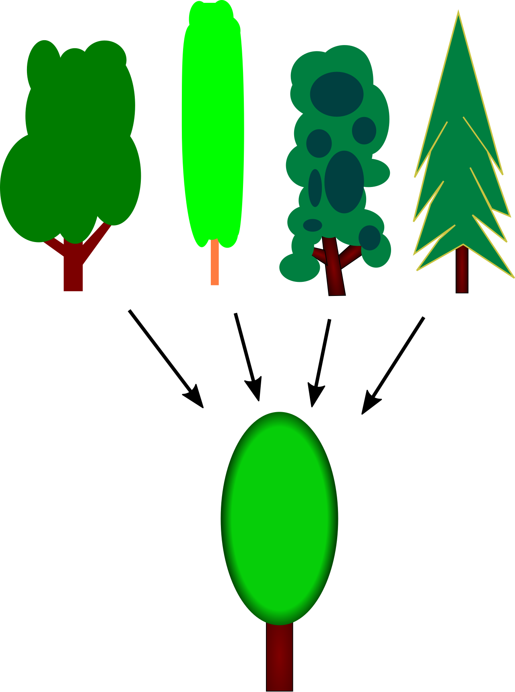
```

::: {.backgrnote .center}
*Source:* [Wikipedia](https://en.wikipedia.org/wiki/Generalization)
:::
:::

## Convenience samples mislead

::: {.push-left}
A good sample is **representative** — it mirrors the super-population.

::: {.content-box-blue}
**Discuss:** you snowball-sample starting from your best friend. What bias creeps in — and who gets left out?
:::

::: {.content-box-red .fragment}
Your friends resemble *you* (age, education, city, politics). Whole groups are systematically **missing** — the sample is biased before you compute anything.
:::
:::

::: {.push-right}
```{r, echo = FALSE, out.width='100%'}
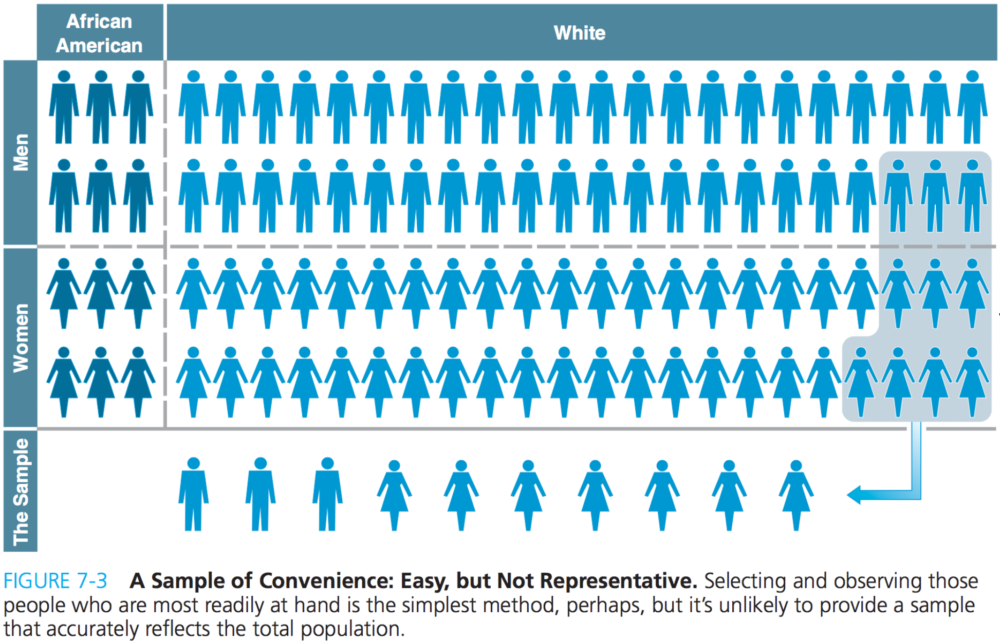
```
:::

## Randomness = fairness

::: {.push-left}
Why do so many games use dice, coins, shuffled cards?

::: {.content-box-green}
**Fairness:** a random draw gives *everyone the same chance*, [regardless of who they are]{.alert}. No player — and no social group — can be systematically forgotten.
:::

A random sample is the equivalent of **stirring the soup before you taste it**: one spoonful then represents the whole pot.
:::

::: {.push-right}
```{r, echo = FALSE, out.width='78%'}
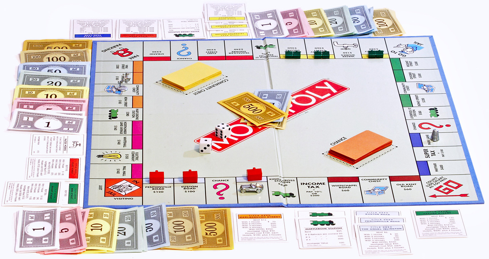
```
:::

## But participation is *not* random {.inverse background-color="#901A1E"}

::: {.lead}
Who answers a survey is never a perfect coin flip — some groups are harder to reach, or more willing to respond.
:::

We repair this after the fact with [post-stratification weights]{.alert}.

## What is a weight?

::: {.push-left}
A **weight** reflects how much a case should *count*, to undo over- or under-sampling.

[In a perfect random sample every case has weight 1. If older people are over-represented, we give them a weight below 1; under-represented groups get a weight above 1.]{.small}

::: {.content-box-blue}
**Discuss:** the plot shows the ESS weights by age. Why might survey researchers *down-weight* older respondents here?
:::
:::

::: {.push-right}
```{r weights-fig, out.width='100%', fig.height = 4, fig.width = 6, echo = FALSE}
ggplot(ESS, aes(y = pspwght, x = agea)) +
  geom_point(alpha = 1/3) +
  geom_smooth(method = "lm", se = FALSE, color = "#901A1E") +
  labs(y = "Post-stratification weight", x = "Age in years",
       caption = "Danish ESS 2018")
```
:::

## How weights work: a worked example

::: {.push-left}
Imagine a patriarchal ballot on women's driving rights, where a **man's vote counts double** a woman's.

```{r vote-table, echo = FALSE}
tibble(
  Gender      = c("man", "man", "woman", "woman", "woman"),
  Vote        = c("No", "Yes", "Yes", "Yes", "No"),
  `Voted yes` = c(0, 1, 1, 1, 0),
  Weight      = c(2, 2, 1, 1, 1)
) %>%
  kable()
```

::: {.content-box-blue}
**Discuss:** ignoring weights, what share voted "Yes"?
:::
:::

::: {.push-right}
Three equivalent ways to get the **weighted** share of "Yes":

::: {.panel-tabset}

### By hand
```{r}
# (yes × weight) summed, over total weight
((1*2 + 1 + 1) / (2 + 2 + 1 + 1 + 1)) * 100
```

### With vectors
```{r}
yes    <- c(0, 1, 1, 1, 0)
weight <- c(2, 2, 1, 1, 1)
sum(yes * weight) / sum(weight) * 100
```

### Built-in
```{r}
weighted.mean(x = yes, w = weight) * 100
```

:::
:::

## Weights can be powerful

::: {.push-left}
With the right weights, even a **wildly non-representative** sample can forecast well.

`r Citet(myBib, "wang_forecasting_2015")` predicted the 2012 US election from **Xbox gamers** — young, male, unrepresentative — reweighted to the electorate.

```{r, echo = FALSE, out.width='92%'}
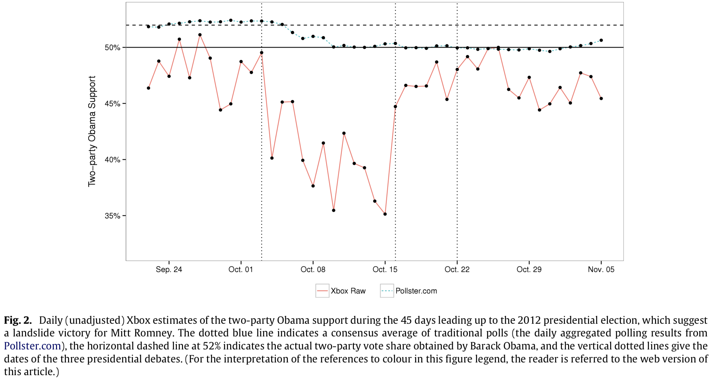
```
:::

::: {.push-right}
```{r, echo = FALSE, out.width='100%'}
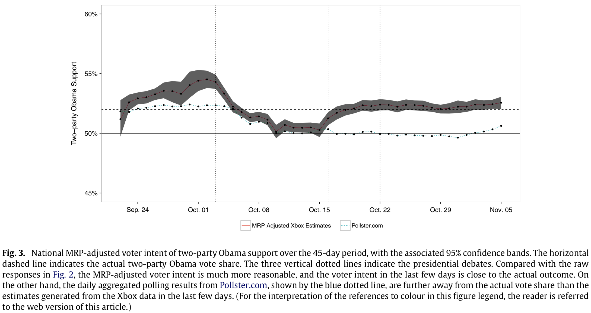
```

::: {.backgrnote .center}
*Source:* `r Citet(myBib, "wang_forecasting_2015")`
:::
:::

## Using weights in regression

::: {.push-left}
Most R functions take a `weights` argument. For weighted OLS use
`estimatr::lm_robust()`.

[Weights make the residuals heteroscedastic — which breaks a standard OLS assumption. `lm_robust()` fixes the standard errors for us.]{.backgrnote}
:::

::: {.push-right}
::: {.panel-tabset}

### Table
```{r wreg, echo = FALSE, results = 'asis'}
mod_unw <- lm_robust(psppsgva ~ eduyrs, data = ESS)
mod_wt  <- lm_robust(psppsgva ~ eduyrs, data = ESS, weights = pspwght)

modelsummary(
  list("Unweighted" = mod_unw, "Weighted" = mod_wt),
  statistic = NULL,
  gof_map = c("nobs", "r.squared"),
  output = "kableExtra"
)
```

### R code
```{r ref.label = "wreg", eval = FALSE}
```

:::
:::

## Sampling error & the standard error {.inverse background-color="#901A1E"}

[Part 2 of 3]{.part-pill}

::: {.lead}
Randomness removes *bias* — but a random sample is still **noisy**. How noisy, exactly?
:::

## A thought experiment: pretend we see everyone

::: {.push-left}
Suppose the Danish ESS (`r nrow(ESS)` people) **were** our whole super-population.

Then we could *calculate* the **true** slope of political efficacy on education (blue line):
$$\beta = `r round(coef(lm(psppsgva ~ eduyrs, data = ESS))["eduyrs"], 3)`$$

[No weights here — this is a make-believe population.]{.backgrnote}
:::

::: {.push-right}
```{r trueline, out.width='96%', fig.height = 4.2, fig.width = 6, echo = FALSE}
ggplot(ESS, aes(y = psppsgva, x = eduyrs)) +
  geom_jitter(alpha = 1/4, width = 0.15, height = 0.15) +
  geom_smooth(method = "lm", se = FALSE, color = "#425570", linewidth = 1.2) +
  labs(y = efficacy_lab, x = "Years of education")
```
:::

## Now draw one small sample

```{r draw-samples, include = FALSE}
set.seed(1261990)
ESS_sample   <- ESS %>% sample_n(50)
ESS_sample_2 <- ESS %>% sample_n(50)
b1 <- round(coef(lm(psppsgva ~ eduyrs, data = ESS_sample))["eduyrs"], 3)
b2 <- round(coef(lm(psppsgva ~ eduyrs, data = ESS_sample_2))["eduyrs"], 3)
```

::: {.push-left}
We rarely see the population — usually just a sample. Take **50 people at random**:

```{r eval = FALSE}
set.seed(1261990)
ESS_sample <- ESS %>% sample_n(50)
```

The sample's own regression line (red) gives $\hat\beta = `r b1`$ —
**not** the true `r round(coef(lm(psppsgva ~ eduyrs, data = ESS))["eduyrs"], 3)`.
:::

::: {.push-right}
```{r s1, out.width='96%', fig.height = 4.2, fig.width = 6, echo = FALSE}
base_pop <- geom_smooth(data = ESS, method = "lm", se = FALSE,
                        color = "#425570", linewidth = 1.2)
ggplot(ESS_sample, aes(y = psppsgva, x = eduyrs)) +
  geom_jitter(color = "#901A1E", alpha = 1/2, width = 0.15, height = 0.15) +
  base_pop +
  geom_smooth(method = "lm", se = FALSE, color = "#901A1E") +
  ylim(1, 5) +
  labs(y = efficacy_lab, x = "Years of education")
```
:::

## Another sample, another answer

::: {.push-left}
Draw a **different** 50 people and the line moves again: $\hat\beta = `r b2`$.

::: {.content-box-red}
**Beware:** each sample gives a *different* estimate. This scatter of estimates around the truth is **sampling error** — not a mistake, but the price of not seeing everyone.
:::
:::

::: {.push-right}
```{r s2, out.width='96%', fig.height = 4.2, fig.width = 6, echo = FALSE}
ggplot(ESS_sample_2, aes(y = psppsgva, x = eduyrs)) +
  geom_jitter(color = "#901A1E", alpha = 1/2, width = 0.15, height = 0.15) +
  geom_smooth(data = ESS_sample, method = "lm", se = FALSE,
              color = "#901A1E", linewidth = 0.4, alpha = 0.4) +
  base_pop +
  geom_smooth(method = "lm", se = FALSE, color = "#901A1E") +
  ylim(1, 5) +
  labs(y = efficacy_lab, x = "Years of education")
```
:::

## … and again, and again

::: {.push-left}
Keep drawing fresh samples of 50. Every red line is a **new random sample**; the blue line is the unchanging truth.

::: {.content-box-green}
The lines **fan out around the true line**. That fan *is* the sampling error — visible, and (as we'll see) predictable.
:::
:::

::: {.push-right}
```{r, echo = FALSE, out.width='100%'}
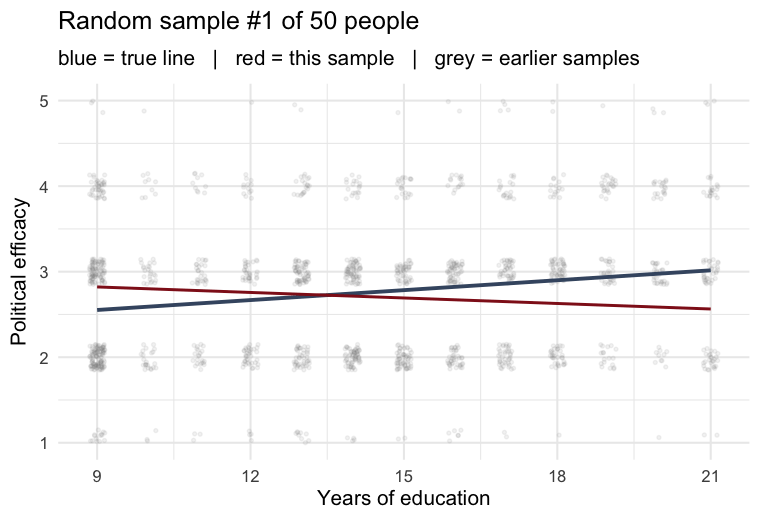
```
:::

## Do it 1000 times: the sampling distribution

::: {.panel-tabset}

### The idea
Repeat "draw 50, estimate $\hat\beta$" **1000 times** and collect all the estimates. Their
spread *is* the sampling error — and it has a beautiful, predictable shape.

```{r sim, fig.show = 'hide'}
set.seed(1261990)
sample_betas <- replicate(1000, {          # 1000 repetitions of …
  s <- ESS %>% sample_n(50)                # … draw 50 people
  coef(lm(psppsgva ~ eduyrs, data = s))["eduyrs"] # … store the slope
})
sd(sample_betas) # The true sampling error
```

### Watch it build
```{r, echo = FALSE, out.width='66%'}
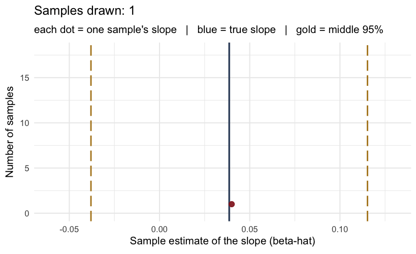
```

::: {.backgrnote .center}
**Each dot is one sample's slope.** As they pile up, a bell curve emerges around the true $\beta$.
:::

### Histogram
```{r hist, out.width='62%', fig.height = 4.2, fig.width = 7, echo = FALSE}
true_beta <- coef(lm(psppsgva ~ eduyrs, data = ESS))["eduyrs"] %>% unname()
sd_b <- sd(sample_betas)

ggplot(tibble(b = sample_betas), aes(x = b)) +
  geom_histogram(binwidth = 0.008, fill = "#901A1E", alpha = 0.85) +
  geom_vline(xintercept = true_beta, color = "#425570", linewidth = 1.2) +
  geom_vline(xintercept = true_beta + c(-1.96, 1.96) * sd_b,
             color = "#b5892c", linetype = "longdash", linewidth = 1) +
  labs(x = expression("1000 sample estimates of "*hat(beta)),
       y = "Count",
       caption = "Blue = true β · gold dashed = ±1.96 × sampling error")
```

### It's Normal!
::: {.push-left}
The estimates pile up in a **Normal (bell) curve** around the truth. We know its areas exactly:

- $\pm 1.65 \times$ SD covers the middle **90%**
- $\pm 1.96 \times$ SD covers the middle **95%**
:::

::: {.push-right}
```{r, echo = FALSE, out.width='88%'}
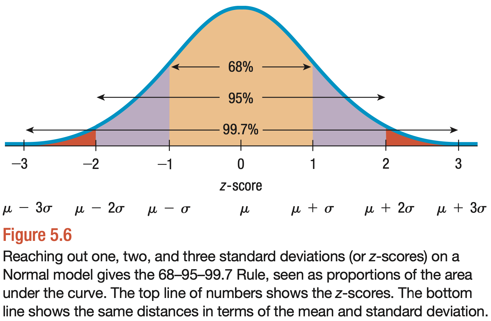
```

::: {.backgrnote .center}
*Source:* `r Citet(myBib, "veaux_stats_2021")`
:::
:::

### Small samples: the *t*
::: {.push-left}
With small $n$, the curve has slightly **fatter tails** — the $t$-distribution. Its critical value depends on the *degrees of freedom* ($n$ − parameters):

```{r}
# 95% critical value, df = 50 − 2
qt(p = 0.975, df = 48)
```
:::

::: {.push-right}
```{r, echo = FALSE, out.width='72%'}
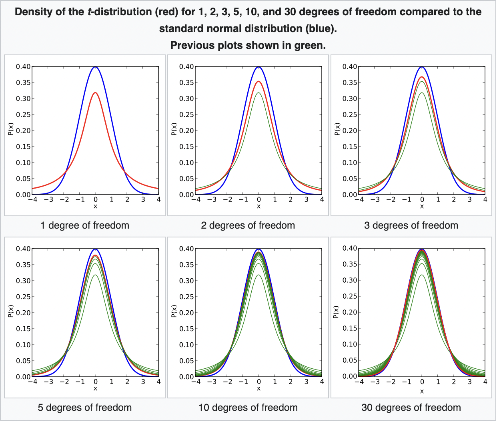
```

::: {.backgrnote .center}
*Source:* [Wikipedia](https://en.wikipedia.org/wiki/Student%27s_t-distribution)
:::
:::

:::

## The catch — and Gauss's gift

::: {.push-left}
::: {.content-box-blue}
**Discuss:** in real research we get **one** sample. We can't draw 1000. So how could we possibly know the sampling error?
:::

::: {.content-box-red .fragment}
Thanks to **Carl Friedrich Gauss**, we can *estimate* the sampling error from a **single sample**. That estimate is the [standard error]{.alert} $\hat\sigma$.
:::
:::

::: {.push-right}
For an OLS slope:
$$\hat{\sigma}(\hat\beta) = \sqrt{\frac{1}{n-2}\,\frac{\text{SD}(e)}{\text{SD}(x)}}$$

```{r se-demo, echo = FALSE, results = 'asis'}
mod_se <- lm_robust(psppsgva ~ eduyrs, se_type = "classical",
                    data = ESS_sample)
modelsummary(list("50-person sample" = mod_se),
             gof_map = c("nobs", "r.squared"), output = "kableExtra")
```

::: {.backgrnote}
The estimated SE from this one sample (`r round(sqrt(diag(vcov(lm_robust(psppsgva ~ eduyrs, se_type = "classical", data = ESS_sample))))["eduyrs"], 3)`) is remarkably close to the true sampling error from 1000 samples (`r round(sd(sample_betas), 3)`).
:::
:::

## Your turn: samples & weights

::: {.left-column}
```{r, echo = FALSE, out.width='72%'}
knitr::include_graphics('https://www.laserfiche.com/wp-content/uploads/2014/10/femalecoder.jpg')
```

<div class="ku-timer" data-min="20"></div>
:::

::: {.right-column}
<iframe src='3-exercise1.html' width='100%' height='620' frameborder='0' scrolling='auto'></iframe>
:::

## Break {.inverse background-color="#901A1E"}

<div class="ku-timer" data-min="10"></div>

## Confidence intervals & hypothesis tests {.inverse background-color="#901A1E"}

[Part 3 of 3]{.part-pill}

::: {.lead}
The standard error turns a single estimate into an **honest statement of uncertainty**.
:::

## 95% confidence intervals

::: {.push-left}
Combine the estimate with its standard error:

$$\hat\beta \pm \text{critical value} \times \hat\sigma$$

::: {.content-box-green}
**What "95%" means:** if we drew samples over and over and built this interval each time, **95% of those intervals** would contain the true $\beta$ — the blue line. It is a statement about the *procedure*, not any single interval.
:::

[Watch the intervals accumulate: only about 1 in 20 (the red ones) misses the truth.]{.backgrnote}
:::

::: {.push-right}
```{r, echo = FALSE, out.width='100%'}
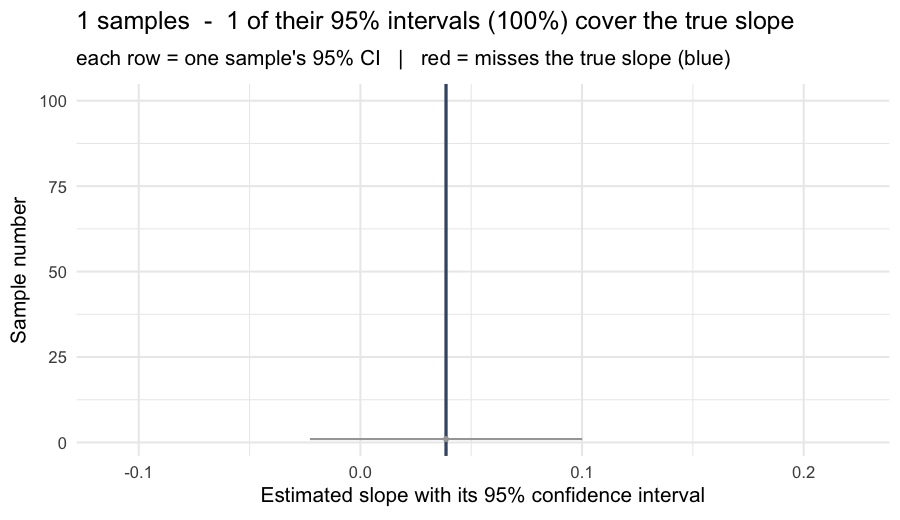
```
:::

## Confidence intervals, hands-on

::: {.lead}
Play with samples, coverage, and interval width yourself:
:::

<iframe src='https://seeing-theory.brown.edu/frequentist-inference/index.html#section2' width='100%' height='560' frameborder='0' scrolling='auto'></iframe>

## Uncertainty, drawn

::: {.push-left}
`geom_smooth(method = "lm")` shades the 95% CI around the line — wide where data are thin, narrow where they are dense.

```{r ci-code, eval = FALSE}
ggplot(ESS_sample, aes(y = psppsgva, x = eduyrs)) +
  geom_jitter(alpha = 1/3,
              width = 0.1, height = 0.1) +
  geom_smooth(method = "lm", color = "#901A1E") + # 95% CI band
  ylim(1, 5) +
  labs(y = "Political efficacy",
       x = "Years of education")
```

::: {.content-box-green}
The band is exactly the region where those **sampled regression lines** plausibly lie — watch them fall inside it.
:::
:::

::: {.push-right}
```{r, echo = FALSE, out.width='100%'}
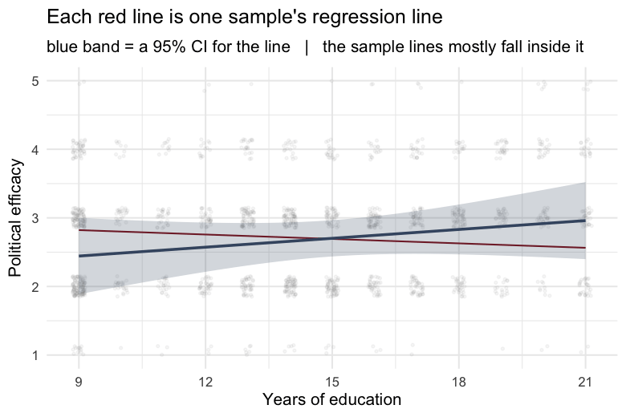
```
:::

## Hypothesis tests: argue with an opponent

::: {.push-left}
```{r, echo = FALSE, out.width='90%'}

```

::: {.backgrnote .center}
The debate of Socrates and Aspasia
:::
:::

::: {.push-right}
Research is a debate with a **sceptic** who dismisses your finding:

> *"Sure, your educated respondents scored higher — but that's just a fluke of your sample. Really there's no difference at all."*

$$\underbrace{H_{0}}_{\text{the } H_{\text{opponent}}}:\ \beta_{\text{education}} = 0$$

We test whether the data can **overturn** this null.
:::

## The (weird) logic of a test

::: {.push-left}
- $H_0$: **the sun is shining.**

- I see **5 kids walking to school with umbrellas.** How likely is that *if the sun is really shining*?

- If that probability is **below 5%**, I stop believing $H_0$ — I bet it's raining.

::: {.content-box-blue}
**Discuss:** can you phrase your own everyday $H_0$-and-evidence example?
:::
:::

::: {.push-right}
We never *prove* our hypothesis. We show the sceptic's $H_0$ makes the data **too surprising to keep believing**.
:::

## Put it into practice

::: {.panel-tabset}

### $t$ and $p$
::: {.push-left}
**$t$-value** $= \dfrac{\hat\beta}{\hat\sigma}$ — how many standard errors the estimate sits from 0.

**$p$-value** — if $H_0$ were true, the probability of an estimate this far from 0 (or further).

A small $p$ (by convention $< 0.05$) means the data are **hard to reconcile with $H_0$** — evidence against it, not proof of $H_1$.
:::

::: {.push-right}
```{r test-model}
ols <- lm_robust(psppsgva ~ eduyrs,
                 data = ESS_sample)
tidy(ols) %>%                    # Tidy result table
  filter(term == "eduyrs") %>%
  select(estimate, std.error,
         statistic, p.value)
```
:::

### In one small sample
In our 50-person sample the estimate is positive but **not** significant — with so few
people, sampling error is simply too large to rule out $H_0$.

### The full sample
```{r goal-model, echo = FALSE, results = 'asis'}
ols_goal <- lm_robust(psppsgva ~ eduyrs, weights = pspwght, data = ESS)
modelsummary(list("Political efficacy" = ols_goal),
             stars = TRUE, gof_map = c("nobs", "r.squared"),
             output = "kableExtra")
```

:::

## Learning goal achieved

::: {.push-left}
Using the **whole weighted sample**, education predicts political efficacy:

```{r, echo = FALSE}
gt <- tidy(lm_robust(psppsgva ~ eduyrs, weights = pspwght, data = ESS)) %>%
  filter(term == "eduyrs")
```

- $\hat\beta = `r round(gt$estimate, 3)`$ per year of education,
- standard error $`r round(gt$std.error, 3)`$,
- $t = `r round(gt$statistic, 1)`$, $p = `r format.pval(gt$p.value, digits = 2)`$.

::: {.content-box-green}
**Answer:** yes — better-educated Danes believe *significantly* more in the political system's responsiveness. The effect is small per year, but clearly not zero.
:::
:::

::: {.push-right}
```{r goalfig, out.width='96%', fig.height = 4.4, fig.width = 6, echo = FALSE}
ggplot(ESS, aes(y = psppsgva, x = eduyrs)) +
  geom_jitter(aes(size = pspwght), alpha = 1/4, width = 0.1, height = 0.1) +
  geom_smooth(aes(weight = pspwght), method = "lm", color = "#901A1E") +
  labs(y = efficacy_lab, x = "Years of education") +
  theme(legend.position = "none")
```
:::

## Your turn: inference

::: {.left-column}
```{r, echo = FALSE, out.width='72%'}
knitr::include_graphics('https://www.laserfiche.com/wp-content/uploads/2014/10/femalecoder.jpg')
```

<div class="ku-timer" data-min="20"></div>
:::

::: {.right-column}
<iframe src='3-exercise2.html' width='100%' height='620' frameborder='0' scrolling='auto'></iframe>
:::

## Check yourself: today's goals

Look back at the goals from the start of the lecture. Can you tick all three?

::: {.checklist}
- Explain to your neighbour why a **random** sample beats a convenience sample — and what a **weight** repairs.
- Say, in one sentence, what a **standard error** estimates — using the word *sampling distribution*.
- Read a regression's **$t$- and $p$-value** and state what they do (and don't) let you conclude about $H_0$.
:::

::: {.content-box-green}
Anything feel shaky? That is what this week's **Absalon quiz** and the **Friday exercise class** are for.
:::

## Today's important functions

::: {.small}
1. `haven::read_spss()` + `zap_labels()`: read SPSS data and turn labelled columns numeric.
2. `dplyr::sample_n()`: draw a random sample of rows.
3. `weighted.mean()`, and the `weights =` argument: analyses that respect survey weights.
4. `estimatr::lm_robust(..., weights =)`: weighted OLS with correct standard errors.
5. `qt()`: critical values from the $t$-distribution.
6. `geom_smooth(method = "lm")`: an OLS line with its 95% confidence band.
7. `broom::tidy()`: pull estimates, standard errors, $t$- and $p$-values into a tibble.
:::

## References

::: {.small}
```{r ref, results = 'asis', echo = FALSE}
PrintBibliography(myBib)
```
:::

```{=html}
<script>
(function () {
  function fmt(s) { var m = Math.floor(s / 60), ss = s % 60; return m + ":" + (ss < 10 ? "0" : "") + ss; }
  function build(el) {
    var total = (parseInt(el.getAttribute("data-min"), 10) || 5) * 60, rem = total, id = null;
    el.innerHTML =
      '<div class="kt-display">' + fmt(rem) + '</div>' +
      '<div class="kt-btns">' +
        '<button class="kt-start" type="button">Start</button>' +
        '<button class="kt-pause" type="button">Pause</button>' +
        '<button class="kt-reset" type="button">Reset</button>' +
      '</div>';
    var disp = el.querySelector(".kt-display");
    function render() { disp.textContent = fmt(rem); el.classList.toggle("kt-done", rem <= 0); }
    function start() { if (id) return; id = setInterval(function () { if (rem > 0) { rem--; render(); } else { stop(); } }, 1000); }
    function stop() { clearInterval(id); id = null; }
    function reset() { stop(); rem = total; render(); }
    el.querySelector(".kt-start").onclick = start;
    el.querySelector(".kt-pause").onclick = stop;
    el.querySelector(".kt-reset").onclick = reset;
    el._start = start; el._reset = reset; render();
  }
  function init() {
    document.querySelectorAll(".ku-timer").forEach(build);
    if (window.Reveal && Reveal.on) {
      Reveal.on("slidechanged", function (e) {
        document.querySelectorAll(".ku-timer").forEach(function (t) { if (t._reset) t._reset(); });
        var here = e.currentSlide ? e.currentSlide.querySelectorAll(".ku-timer") : [];
        here.forEach(function (t) { if (t._start) setTimeout(t._start, 250); });
      });
    }
  }
  if (document.readyState !== "loading") init();
  else document.addEventListener("DOMContentLoaded", init);
})();
</script>
```
