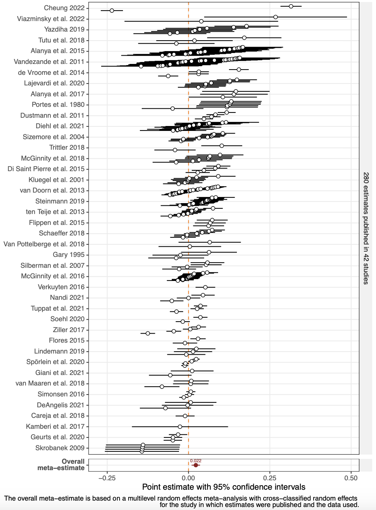

```{r setup, include = FALSE}
library(RefManageR)
library(knitr)
library(ggrepel) # Nicely placed labels in figures

options(htmltools.preserve.raw = FALSE,
        htmltools.dir.version = FALSE, servr.interval = 0.5, width = 115, digits = 3)
knitr::opts_chunk$set(
  collapse = TRUE, message = FALSE, fig.retina = 3, error = TRUE,
  warning = FALSE, cache = FALSE, fig.align = 'center',
  comment = "#", strip.white = TRUE, tidy = FALSE)

BibOptions(check.entries = FALSE,
           bib.style = "authoryear",
           style = "markdown",
           hyperlink = FALSE,
           no.print.fields = c("doi", "url", "ISSN", "urldate", "language", "note", "isbn", "volume"))
myBib <- ReadBib("../Stats_II.bib", check = FALSE)
```

## By the end of today you can … {.inverse background-color="#901A1E"}

1. state a causal hypothesis as a **counterfactual comparison** — the **potential-outcomes** framework;

2. explain why a **naïve comparison of two groups** is usually *not* the causal effect — **selection bias**;

3. read a **DAG** — spot a **confounder** on a **backdoor path** — and use a **balance test** to expose it.

::: {.backgrnote}
One part per goal. Our running question: does consuming **news** make immigrant minorities report **more discrimination**?
:::

## From hypothesis to comparison {.inverse background-color="#901A1E"}

[Part 1 of 3]{.part-pill}

::: {.lead}
Every causal claim is secretly a **comparison** — of what happened against what *would* have happened.
:::

## The research question of the day {.inverse background-color="#901A1E"}

::: {.push-left}
The **integration paradox**: immigrants and their descendants who are *better* integrated — more educated, longer resident — often report **more** discrimination, not less `r Citet(myBib, "schaeffer_integration_2024")`.

One proposed mechanism: the better integrated **consume more news**, become more *aware* of discrimination, and so report it more often.

::: {.content-box-blue}
**Research question:** does consuming **news** *increase* how often immigrant minorities **report discrimination**?
:::
:::

::: {.push-right}
```{r, echo = FALSE, out.width='58%'}

```

::: {.backgrnote .center}
280 estimates from 42 studies; overall ≈ +0.022. *Source:* `r Citet(myBib, "schaeffer_integration_2024")`
:::
:::

## A hypothesis is a comparison

A causal claim implies a [counterfactual]{.alert}: things would have been different had $X$ (not) happened.

$H_1:$ news consumption **increases** how often minorities report discrimination:

$$0 < \text{Avg}_n[\text{Discr.} \mid \text{news} = 1] - \text{Avg}_n[\text{Discr.} \mid \text{news} = 0]$$

::: {.backgrnote}
$H_0:$ news consumption does **not** change it: the difference of the two group averages is $\leq 0$.
:::

::: {.content-box-blue}
**Discuss:** what comparison is implied by each classic claim? **Marx** — capitalist labour alienates people and *reduces* mental health. **Simmel** — city life *increases* nervous stimulation and makes residents distant.
:::

## Why not just ask people?

::: {.push-left}
The obvious "study": ask people *"How does reading the news affect you?"*

::: {.content-box-blue}
**Discuss:** why is simply *asking* a bad way to test our hypothesis?
:::
:::

::: {.push-right}
::: {.content-box-red .fragment}
People have **inaccurate perceptions** of what shapes them — social desirability, faulty memory, little self-insight. Statements by research subjects are valuable, but they are **not credible causal evidence**. We need a comparison, not an introspection.
:::
:::

## Preparation

::: {.panel-tabset}

### Packages
```{r libs}
pacman::p_load(
  tidyverse,    # Data manipulation and visualization
  estimatr,     # OLS with robust / weighted standard errors
  modelsummary  # Regression AND balance tables
)
```

### The APAD survey
::: {.small}
`r Citet(myBib, "schaeffer_association_2023")` — **1,093** immigrants and children of immigrants in Berlin, Hamburg, Munich, Frankfurt & Cologne, interviewed August 2021.

1. *"On a typical day, about how much time do you spend watching, reading, or listening to **news** about politics and current affairs?"* (hours + minutes)

2. *"How often were you personally **discriminated** …"* — when looking for work, at work, in education, looking for housing, with officials, out in public. (1) Never … (5) Very often — averaged into one index.
:::

### Get & prepare the data
```{r apad-data}
# APAD ships as a local file (download it from Absalon into your project folder)
load("../assets/APAD.RData")

APAD <- APAD %>%
  mutate(
    news    = news_hrs * 60 + news_mins,          # total daily minutes
    news_yn = if_else(news >= 15, 1, 0),          # reads news? (>= 15 min)
    dis_index = rowMeans(                          # average across the 6 domains
      select(., dis_trainee, dis_job, dis_school,
             dis_house, dis_gov, dis_public),
      na.rm = TRUE
    )
  )
```

:::

## The naïve comparison

::: {.panel-tabset}

### The picture
```{r naive-plot, echo = FALSE, out.width='60%', fig.height = 4, fig.width = 7}
ggplot(APAD, aes(y = dis_index, x = news)) +
  geom_point(aes(size = gewFAKT), alpha = 1/3) +
  geom_smooth(aes(weight = gewFAKT), method = "lm", color = "#901A1E") +
  scale_y_continuous(breaks = 1:5,
    labels = c("Never", "Rarely", "Sometimes", "Often", "Very often")) +
  labs(y = "Perceived discrimination", x = "Daily minutes of news") +
  theme_minimal(base_size = 14) + theme(legend.position = "none")
```

### The regression
```{r naive-ols, results = 'hide'}
# Weighted OLS: discrimination on the news dummy
ols <- lm_robust(dis_index ~ news_yn, weights = gewFAKT, data = APAD)

modelsummary(list("Discrimination" = ols), stars = TRUE,
             coef_rename = c("news_yn" = "Reads news"),
             gof_map = c("nobs", "r.squared"), output = "kableExtra")
```

### Read it
```{r naive-tab, ref.label = "naive-ols", echo = FALSE, results = 'asis'}
```

::: {.content-box-red}
News readers report, if anything, **`r abs(round(coef(ols)["news_yn"], 2))` points *less*** discrimination — and the difference is **not significant** ($t \approx `r round(coef(ols)["news_yn"] / sqrt(diag(vcov(ols)))["news_yn"], 1)`$). Taken at face value, $H_1$ looks *wrong*. **But is this a fair comparison?**
:::

:::

## Break {.inverse background-color="#901A1E"}

<div class="ku-timer" data-min="15"></div>

## Your turn: exercise 1

::: {.left-column}
You run the naïve analysis yourself — on a *different* outcome: support for an anti-discrimination law.

<div class="ku-timer" data-min="20"></div>
:::

::: {.right-column}
<iframe src='5-exercise1.html' width='100%' height='620' frameborder='0' scrolling='auto'></iframe>
:::

## Potential outcomes & selection bias {.inverse background-color="#901A1E"}

[Part 2 of 3]{.part-pill}

::: {.lead}
To see *why* the comparison can mislead, we need the language of **potential outcomes**.
:::

## Two futures for one person

::: {.push-left}
For **Ferda**, two *potential outcomes* — one for each version of her life:

$$\text{effect}_{\text{Ferda}} = Y_{1,\text{Ferda}} - Y_{0,\text{Ferda}}$$

| Ferda | |
|---|:--:|
| $Y_0$: discrimination *without* news | 2 (rarely) |
| $Y_1$: discrimination *with* news | 4 (often) |
| **Personal causal effect** | **+2** |
:::

::: {.push-right}
::: {.content-box-red}
**The fundamental problem of causal inference:** we only ever see **one** of Ferda's two futures. The other potential outcome is **always missing** — so a personal causal effect can never be observed directly.
:::

```{r, echo = FALSE, out.width='52%'}

```
:::

## The average causal effect

$$\text{Avg}_n[Y_{1i} - Y_{0i}] = \frac{1}{n}\sum_{i=1}^{n} Y_{1i} - \frac{1}{n}\sum_{i=1}^{n} Y_{0i}$$

::: {.push-left}
The **average causal effect** is just the average of everyone's *personal* causal effects.
:::

::: {.push-right}
It compares two whole worlds: one where **everyone** reads the news, against one where **no one** does. Neither world is ever fully observed — but, under the right conditions, we can *estimate* the average.
:::

## Apples and oranges: Ferda vs. Tuki

::: {.push-left}
We can't see Ferda's missing future — so what if we compare her to **Tuki**, who doesn't read news?

::: {.small}
| | Ferda | Tuki |
|---|:--:|:--:|
| $Y_0$: without news | [2]{.gray} | 5 |
| $Y_1$: with news | 4 | [5]{.gray} |
| true effect | [+2]{.gray} | [0]{.gray} |
:::

Grey = the counterfactual we *never* see.
:::

::: {.push-right}
$$\underbrace{Y_{1,\text{Ferda}}}_{4} - \underbrace{Y_{0,\text{Tuki}}}_{5} = -1$$

::: {.content-box-blue}
**Discuss:** Ferda's true effect is $+2$, yet comparing her to Tuki gives $-1$. Why is comparing *different people* so misleading here?
:::
:::

## The hidden term: selection bias

$$\underbrace{Y_{1,\text{Ferda}}}_{4} - \underbrace{Y_{0,\text{Tuki}}}_{5}
= \underbrace{Y_{1,\text{Ferda}} - Y_{0,\text{Ferda}}}_{\text{true effect: }4-2 = +2}
+ \underbrace{Y_{0,\text{Ferda}} - Y_{0,\text{Tuki}}}_{\text{selection bias: }2-5 = -3}$$

::: {.content-box-red}
**Selection bias** $= Y_{0,\text{Ferda}} - Y_{0,\text{Tuki}} \neq 0$: the two people **differ at baseline**. Even with *no* news at all, Tuki would report more discrimination than Ferda. That pre-existing gap contaminates the comparison.
:::

## From two people to two groups

$$\underbrace{\text{Avg}_n[Y_{1i} \mid D_i = 1] - \text{Avg}_n[Y_{0i} \mid D_i = 0]}_{\text{difference in observed group means}}
= \underbrace{\text{effect on the treated}}_{\text{what we want}}
+ \underbrace{\text{selection bias}}_{\text{what contaminates it}}$$

::: {.content-box-red}
$$\text{Selection bias} = \underbrace{\text{Avg}_n[Y_{0i} \mid D_i = 1]}_{\text{unobserved!}} - \text{Avg}_n[Y_{0i} \mid D_i = 0]$$
the gap in the outcome's **baseline** ($Y_0$) between the groups we compare.
:::

::: {.content-box-green}
**Think:** if the minorities who read the news had *not* read them, would they report discrimination as often as those who never read news? If not — the comparison is biased.
:::

## (Im)balance of *observed* variables

::: {.panel-tabset}

### The idea
::: {.left-column}
We can never see the *unobserved* baseline $Y_0$. But if the two groups differ on things we **can** measure — age, citizenship, generation — that is a strong hint they differ on $Y_0$ too.

A **balance test** compares the groups on those background variables.
:::

::: {.right-column}
```{r balance, results = 'hide'}
APAD %>%
  select(news_yn, age, german, imor,
         nbh_exposed, gewFAKT) %>%
  rename(weights = gewFAKT) %>% # so it is used as a weight
  datasummary_balance(~ news_yn, data = .,
                      output = "kableExtra")
```
:::

### The table
::: {.small}
```{r balance-tab, ref.label = "balance", echo = FALSE, results = 'asis'}
```
:::

::: {.content-box-red}
The groups are **not** balanced — news readers are markedly **older** (≈ 44 vs. 37) and more often German citizens. Our naïve comparison is confounded — and these are only the *observed* differences.
:::

:::

## DAGs: seeing the bias {.inverse background-color="#901A1E"}

[Part 3 of 3]{.part-pill}

::: {.lead}
A **directed acyclic graph** draws our causal assumptions — and makes the source of the bias visible.
:::

## Reading a DAG

::: {.push-left}
- **Nodes** = variables; **arrows** = causal effects.
- A [backdoor path]{.alert} links $D$ and $Y$ starting with an arrow *into* $D$ `r Citep(myBib, c("pearl_causal_2016", "gerxhani_causal_2022"))`.
- A [confounder]{.alert} $C$ sits on a backdoor path — it makes $D$ and $Y$ correlate **without any causal arrow between them**. Confounder bias *is* selection bias.
:::

::: {.push-right}
```{tikz dag-generic, echo = FALSE, out.width='58%'}
\usetikzlibrary{shapes.geometric, arrows.meta, positioning}
\definecolor{kured}{HTML}{901A1E}
\begin{tikzpicture}[>=Latex, semithick]
\sffamily
\node[ellipse, draw, minimum width=0.9cm] (C) at (0,2) {$C$};
\node[ellipse, draw, minimum width=0.9cm] (D) at (0,0) {$D$};
\node[ellipse, draw, minimum width=0.9cm] (Y) at (3.2,0) {$Y$};
\draw[->] (C) -- (D);
\draw[->] (C) -- (Y);
\draw[<->, kured, dashed, bend right=45] (D) to (Y);
\end{tikzpicture}
```

::: {.backgrnote}
The red dashed arrow is not really part of the DAG — it just marks the **spurious** $D$–$Y$ correlation that the backdoor path through $C$ produces.
:::
:::

## Our case: a confounded correlation

::: {.push-left}
Plausibly, **German citizenship** shapes *both* whether people follow German news *and* how much discrimination they encounter.

It opens a **backdoor path** — so the raw news–discrimination correlation is (at least partly) **spurious**, exactly the selection bias the balance table revealed.
:::

::: {.push-right}
```{tikz dag-apad, echo = FALSE, out.width='86%'}
\usetikzlibrary{shapes.geometric, arrows.meta, positioning}
\definecolor{kured}{HTML}{901A1E}
\begin{tikzpicture}[>=Latex, semithick]
\sffamily
\node[ellipse, draw, align=center] (C) at (0,2) {German\\citizen};
\node[ellipse, draw, align=center] (D) at (0,0) {Reads\\news};
\node[ellipse, draw, align=center] (Y) at (3.6,0) {Discrimination};
\draw[->] (C) -- (D);
\draw[->] (C) -- (Y);
\draw[<->, kured, dashed, bend right=42] (D) to (Y);
\end{tikzpicture}
```
:::

## The verdict: correlation ≠ causation

::: {.push-left}
```{r ref.label = "naive-plot", echo = FALSE, out.width='100%', fig.height = 4, fig.width = 7}
```
:::

::: {.push-right}
::: {.content-box-red}
**Correlation ≠ causation.** The baseline $Y_0$ differs between the groups we compare, because **confounders** sort people *into* and *out of* reading the news.
:::

::: {.backgrnote}
Ice-cream sales and shark attacks correlate — but *temperature* drives both. A raw correlation is a starting point, never a conclusion. The rest of this course is about earning the causal reading.
:::
:::

## Your turn: exercise 2

::: {.left-column}
You draw the DAG and run a balance test yourself — is **racial appearance** balanced across news readers?

<div class="ku-timer" data-min="20"></div>
:::

::: {.right-column}
<iframe src='5-exercise2.html' width='100%' height='620' frameborder='0' scrolling='auto'></iframe>
:::

## Today's general lessons {.inverse background-color="#901A1E"}

1. A causal claim is a **counterfactual** claim — it compares an outcome *with* a treatment to the same outcome *without* it.

2. **Potential outcomes** ($Y_0$, $Y_1$) make this precise; a personal causal effect is $Y_1 - Y_0$. The **fundamental problem**: one of them is always missing.

3. The **average causal effect** is the average of those personal effects.

4. A **naïve comparison of groups** usually is *not* the causal effect — it adds **selection bias**: the groups differ in their baseline $Y_0$.

5. A **balance test** exposes *observed* imbalance; a **DAG** shows *why* — a **confounder** on a **backdoor path**. Confounder bias *is* selection bias.

## Check yourself: today's goals

::: {.checklist}
- Write a causal hypothesis as a difference of two potential-outcome averages — and say which term is never observed.
- Explain, using Ferda & Tuki, how an observed group difference splits into a causal effect **plus** selection bias.
- Draw the news → discrimination DAG with a confounder, and say what a balance test would show.
:::

::: {.content-box-green}
Shaky on any of these? That is what this week's **Absalon quiz** and the **Friday exercise class** are for.
:::

## Today's important functions

::: {.small}
- `rowMeans(select(., ...))`: average several items into one index (same units).
- `estimatr::lm_robust(y ~ d, weights = ...)`: weighted OLS with robust standard errors.
- `modelsummary::datasummary_balance(~ group, data = ...)`: a balance table across two groups (rename your weight column to `weights`).
:::

## References

::: {.small}
```{r ref, results = 'asis', echo = FALSE}
PrintBibliography(myBib)
```
:::

```{=html}
<script>
(function () {
  function fmt(s) { var m = Math.floor(s / 60), ss = s % 60; return m + ":" + (ss < 10 ? "0" : "") + ss; }
  function build(el) {
    var total = (parseInt(el.getAttribute("data-min"), 10) || 5) * 60, rem = total, id = null;
    el.innerHTML =
      '<div class="kt-display">' + fmt(rem) + '</div>' +
      '<div class="kt-btns">' +
        '<button class="kt-start" type="button">Start</button>' +
        '<button class="kt-pause" type="button">Pause</button>' +
        '<button class="kt-reset" type="button">Reset</button>' +
      '</div>';
    var disp = el.querySelector(".kt-display");
    function render() { disp.textContent = fmt(rem); el.classList.toggle("kt-done", rem <= 0); }
    function start() { if (id) return; id = setInterval(function () { if (rem > 0) { rem--; render(); } else { stop(); } }, 1000); }
    function stop() { clearInterval(id); id = null; }
    function reset() { stop(); rem = total; render(); }
    el.querySelector(".kt-start").onclick = start;
    el.querySelector(".kt-pause").onclick = stop;
    el.querySelector(".kt-reset").onclick = reset;
    el._start = start; el._reset = reset; render();
  }
  function init() {
    document.querySelectorAll(".ku-timer").forEach(build);
    if (window.Reveal && Reveal.on) {
      Reveal.on("slidechanged", function (e) {
        document.querySelectorAll(".ku-timer").forEach(function (t) { if (t._reset) t._reset(); });
        var here = e.currentSlide ? e.currentSlide.querySelectorAll(".ku-timer") : [];
        here.forEach(function (t) { if (t._start) setTimeout(t._start, 250); });
      });
    }
  }
  if (document.readyState !== "loading") init();
  else document.addEventListener("DOMContentLoaded", init);
})();
</script>
```
