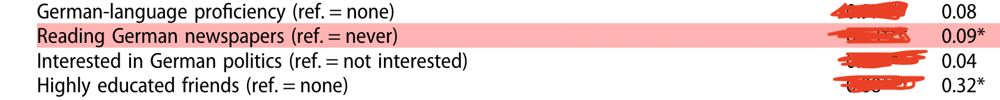
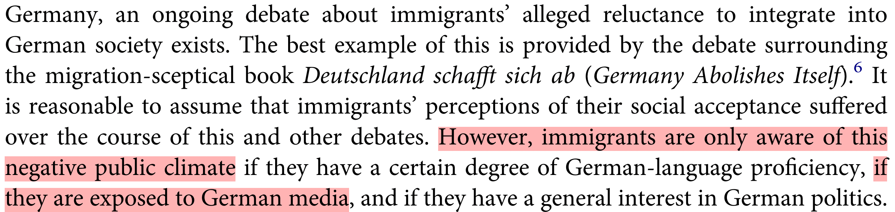
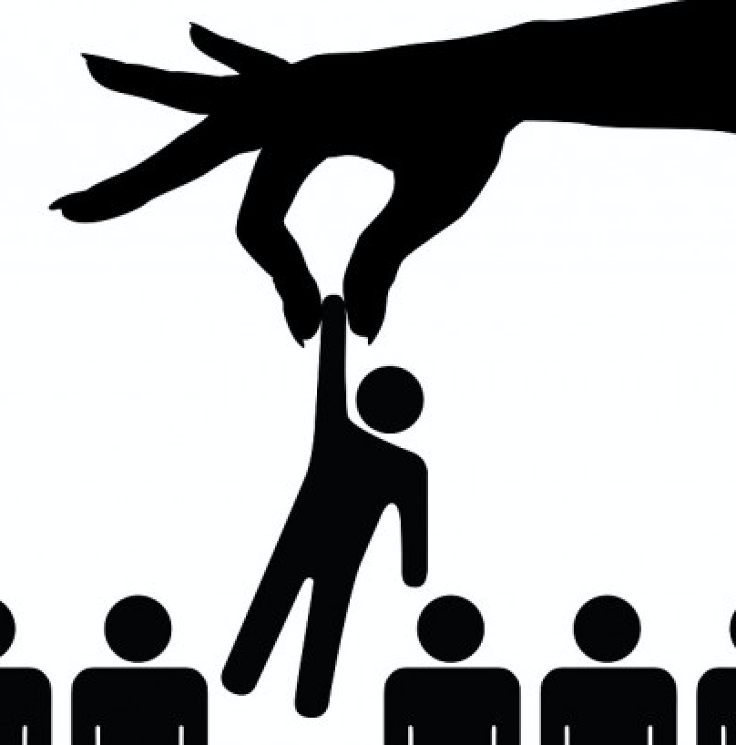
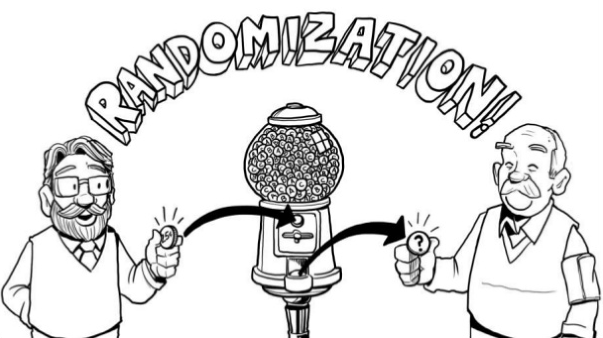
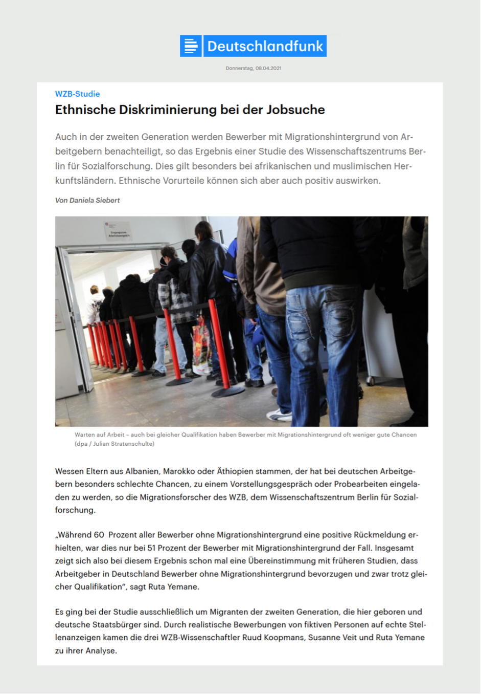
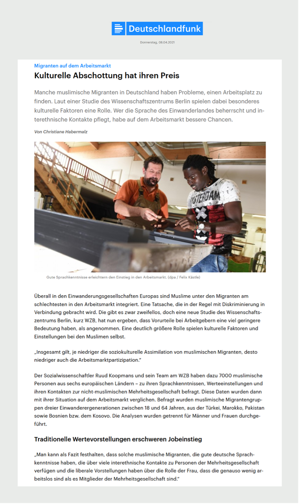
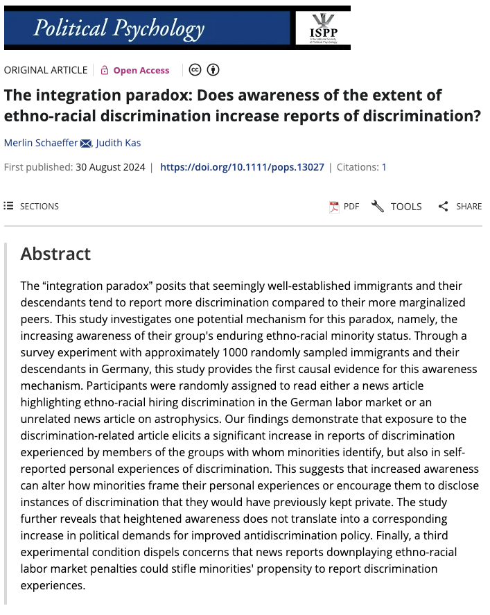
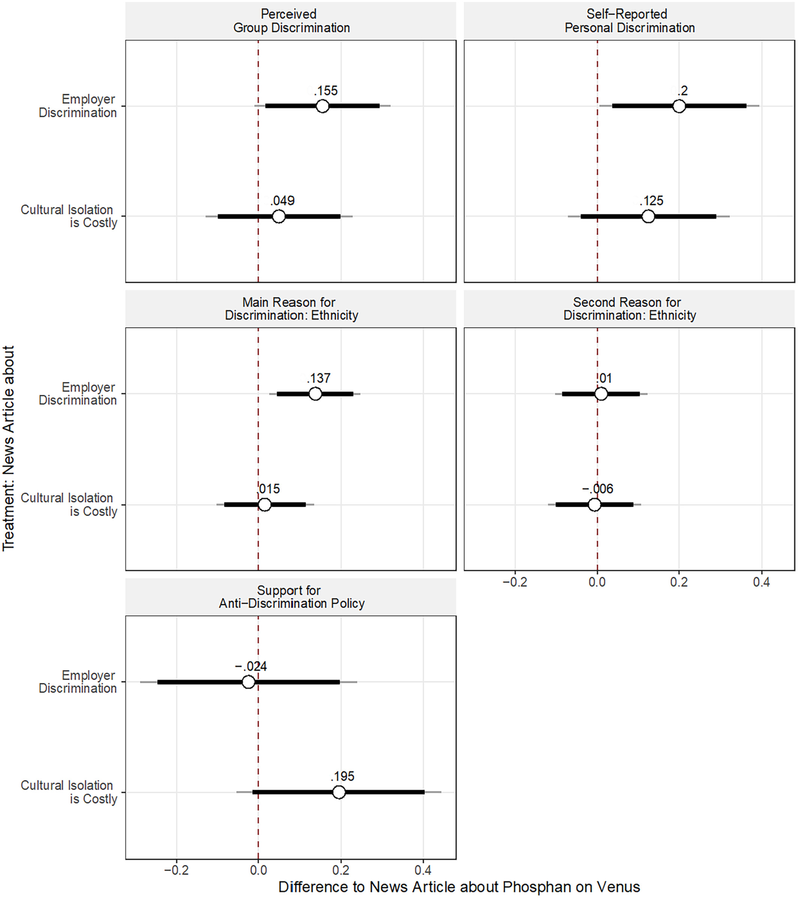

```{r setup, include = FALSE}
library(RefManageR)
library(knitr)
library(ggrepel)   # Nicely placed labels in figures.
library(modelr)

options(htmltools.preserve.raw = FALSE,
        htmltools.dir.version = FALSE, servr.interval = 0.5, width = 115, digits = 3)
knitr::opts_chunk$set(
  collapse = TRUE, message = FALSE, fig.retina = 3, error = TRUE,
  warning = FALSE, cache = FALSE, fig.align = 'center',
  comment = "#", strip.white = TRUE, tidy = FALSE)

BibOptions(check.entries = FALSE,
           bib.style = "authoryear",
           style = "markdown",
           hyperlink = FALSE,
           no.print.fields = c("doi", "url", "ISSN", "urldate", "language", "note", "isbn", "volume"))
myBib <- ReadBib("../Stats_II.bib", check = FALSE)
```

## &nbsp; {.clear}

```{r, echo = FALSE, out.width='55%', fig.align='center'}
knitr::include_graphics('https://pbs.twimg.com/media/EouSsOKUUAM0P_y.jpg')
```

::: {.lead .center}
How do we *know* it works?
:::
::: {.backgrnote .center}
*Source:* `r Citet(myBib, "polack_safety_2020")`
:::

::: {.notes}
Open with the question, not the answer: they all took this vaccine — how does anyone actually *know* it works? Let them try for a moment. The answer is the design, not the statistics: tens of thousands of people, a coin flip deciding who got the shot. That design is today's whole lecture.
:::

## Goal of empirical sociology

::: {.lead .center}
Use data to discover patterns, <br> and the [social mechanisms that bring them about.]{.alert}
:::

```{r, echo = FALSE, out.width='60%', fig.align='center'}
knitr::include_graphics('https://researchleap.com/wp-content/uploads/2021/12/Population-data.jpeg')
```

## By the end of today you can … {.inverse background-color="#901A1E"}

1. explain why a simple group comparison can **mislead** us — *selection bias*;

2. see how **randomization** fixes it — in one picture *and* one formula;

3. **estimate a causal effect** from a real experiment in R.

::: {.backgrnote}
One part of today's lecture per goal. Our running question throughout: **does news media
consumption increase immigrant minorities' reports of discrimination?**
:::

::: {.notes}
Three goals, three parts — say that explicitly so they can locate themselves later. Flag the arc: we start with a comparison that fails, then the one idea that repairs it, then they estimate a real causal effect themselves in R. Last week's lecture diagnosed the disease; today is the cure.
:::

## The Integration Paradox {.inverse background-color="#901A1E"}

::: {.push-left}
Immigrants who are *better integrated* — e.g. higher educated, fluent in the language — report
**more** discrimination, not less.

One suspected channel: **the news media** (highlighted in the study on the right).

::: {.content-box-blue}
**Research question of the day:** does news media consumption *increase* immigrant minorities' reports of discrimination?
:::
:::

::: {.push-right}
```{r, echo = FALSE, out.width='90%', fig.align='center'}


```

```{r, echo = FALSE, out.width='90%', fig.align='center'}

```

::: {.backgrnote .center}
*Source:* `r Citet(myBib, "steinmann_paradox_2019")`
:::
:::

::: {.notes}
Remind them of the paradox from last week — better integrated, *more* reported discrimination. Today we chase one suspected channel: the news media. Put the research question on the board and leave it there; every slide today is in service of answering it.
:::

## Why naïve comparisons mislead {.inverse background-color="#901A1E"}

[Part 1 of 3]{.part-pill}

::: {.lead}
Just comparing news-readers with non-readers will *not* give us a causal effect. Let's see why.
:::

## Preparation

::: {.panel-tabset}

### Packages for today's session
```{r libraries}
pacman::p_load( # Load several R packages using the pacman package manager
  tidyverse,  # A collection of packages for data manipulation and visualization
  ggplot2,    # Powerful package for creating static, animated and interactive visualizations
  estimatr,   # Package for fast estimators for regression with weighted data
  modelr,     # Provides functions for modelling and prediction
  kableExtra, # Enhances table creation in R
  modelsummary) # Creates tables and plots to summarize statistical models
```

### The APAD survey
::: {.left-column}
- `r Citet(myBib, "schaeffer_association_2023")`
- 1093 immigrants and children of immigrants.
- Berlin, Hamburg, Munich, Frankfurt, Cologne.
- Interviewed August 2021.
- Financed by [the German Research Council (DFG)](https://gepris.dfg.de/gepris/projekt/428878477?language=en)
:::

::: {.right-column}
::: {.small}
1. > On a typical day, about how much time do you spend watching, reading, or listening to news about politics and current affairs? *Please give your answer in hours and then minutes.*

2. > How often were you personally discriminated against in the following situations here in Germany? [Discrimination means a person is treated worse than others, with no factual justification — e.g. insult, ostracism, harassment. Disadvantaging rules and laws also count.]{.backgrnote}
   > ... looking for work &nbsp;·&nbsp; at work &nbsp;·&nbsp; in education<br>
   > ... looking for housing &nbsp;·&nbsp; with officials &nbsp;·&nbsp; in public<br><br>
   > (1) Never (2) Rarely (3) Sometimes (4) Often (5) Very often
:::
:::

### Get the APAD data
::: {.push-left}
::: {.small}
```{r results = FALSE, echo = FALSE}
# Read APAD data,
load("../assets/APAD.RData")
```

```{r eval = FALSE}
load("APAD.RData") # Load APAD dataset
```

```{r results = FALSE}
APAD <- APAD %>% # Process the APAD data
  mutate(
    # News consumption in minutes (e.g. 2h 30m -> 150)
    news = news_hrs * 60 + news_mins,
    # Binary: reads >= 15 minutes of news per day?
    news_yn = case_when(
      news <  15 ~ 0,
      news >= 15 ~ 1,
      TRUE       ~ as.numeric(NA)
    ),
    # Average perceived discrimination across 6 domains
    dis_index = rowMeans(
      select(., dis_trainee, dis_job, dis_school,
             dis_house, dis_gov, dis_public),
      na.rm = TRUE
    ),
    # z-standardised version (mean 0, SD 1)
    z_dis_index = scale(dis_index) %>% as.numeric()
  )
```
:::
:::

::: {.push-right}
<br>
```{r echo = FALSE}
APAD
```
:::

:::

## Naïve comparison

::: {.push-left}
```{r naiv, out.width = "94%", fig.height = 3.2, fig.width = 5, echo = FALSE}
ggplot(data = APAD, aes(y = dis_index, x = news)) +
  geom_point(aes(size = gewFAKT), alpha = 1/3) +
  geom_smooth(aes(weight = gewFAKT), method = "lm", colour = "#901A1E") +
  scale_y_continuous(breaks = 1:5, labels = c("Never", "Rarely", "Sometimes", "Often", "Very often")) +
  labs(y = "Perceived discrimination", x = "Daily minutes of news consumption") +
  theme_minimal(base_size = 14) +
  theme(legend.position = "none")
```

::: {.content-box-blue}
**Discuss:** we find a tiny association. Can we trust it as the *effect of news*?
:::

::: {.content-box-red .fragment}
**No** — news-readers and non-readers differ in *many* other ways.
:::
:::

::: {.notes}
Ask before revealing: we found a tiny association — can we read it as the effect of news? Most will hesitate, which is the right instinct. The reveal names why: readers and non-readers differ in many other ways, so we are not comparing like with like. Do not over-explain here — the next three slides do the work.
:::

::: {.push-right}
::: {.small}
```{r naiv_OLS}
ols <- lm_robust( # Weighted OLS
  dis_index ~ news_yn,
  weights = gewFAKT,
  data = APAD
)

modelsummary( # Regression table
  list("Discr." = ols),             # Named list of models
  stars = TRUE,                     # Significance stars
  gof_map = c("nobs", "r.squared"), # Fit statistics to show
  output = "kableExtra"
)
```
:::
:::

## The dream: two parallel worlds

::: {.lead}
To know the *causal* effect, we'd compare the **same person** — reading news vs. not.
:::

| Person | If reads news ($Y_1$) | If **no** news ($Y_0$) | Causal effect |
|:-------|:---------------------:|:----------------------:|:-------------:|
| Aisha  | 4 | [?]{.gray} | [?]{.gray} |
| Ben    | [?]{.gray} | 2 | [?]{.gray} |
| Chen   | 5 | [?]{.gray} | [?]{.gray} |

::: {.content-box-blue}
**Discuss:** what would we *need* in order to measure one person's causal effect?
:::

::: {.content-box-red .fragment}
Both worlds at once — impossible. The missing cell is the **counterfactual**: the [fundamental problem of causal inference]{.alert}.
:::

::: {.notes}
Point at the grey question marks — one per person, always exactly one. Ask what we would *need* to measure a single person's causal effect, and let them arrive at the impossible answer: both worlds at once. Name it once, clearly: the missing cell is the counterfactual, and this is the fundamental problem of causal inference.
:::

## Why the naïve comparison misleads

::: {.lead}
The raw gap between readers and non-readers mixes **two** things:
:::

::: {.lead}
$$
\underbrace{Avg_{n}[Y_{1i}|D_{i}=1] - Avg_{n}[Y_{0i}|D_{i}=0]}_{\text{Difference we actually observe}}
= \underbrace{\color{#901A1E}{\kappa}}_{\substack{\text{causal}\\\text{effect}}}
+ \underbrace{Avg_{n}[Y_{0i}|D_{i}=1] - Avg_{n}[Y_{0i}|D_{i}=0]}_{\text{selection bias}}
$$
:::

::: {.content-box-blue .center}
**Discuss:** which term do we actually *want* — and which one gets in the way?
:::

::: {.content-box-red .center .fragment}
We want the causal effect $\color{#901A1E}{\kappa}$. **Selection bias** is the contamination: the groups already differed in baseline $Y_0$, *before any news*.
:::

::: {.notes}
Do not read the formula symbol by symbol — point at the two braces instead. What we observe is one number; it silently contains two things. Ask which one they want and which one is in the way, then reveal. The phrase to repeat all day: the groups already differed *before any news*.
:::

## Do the groups actually differ?

::: {.panel-tabset}

### Balance table
::: {.content-box-blue}
**Discuss:** do news-readers and non-readers look the same on their background traits?
:::

::: {.small}
```{r ref.label = "balance1", echo = FALSE}
```
:::

::: {.content-box-red .fragment}
No — readers are **older and more often German citizens**. The comparison is **confounded**.
:::

::: {.notes}
Let them inspect the columns before you reveal — ask them to find the biggest gap. Age and citizenship jump out. This is the abstract selection-bias term made visible in an actual table, so say so: this is what contamination looks like in data. And add the caveat — these are only the variables we happened to measure.
:::

### R code
```{r balance1, results = FALSE}
APAD %>% # Start with the APAD data, then pipe
  # Compare readers vs non-readers on background variables
  select(news_yn, age, nbh_exposed, imor, german, gewFAKT) %>%
  # datasummary_balance() treats a column called `weights` as survey weights
  rename(weights = gewFAKT) %>%
  datasummary_balance(
    formula = ~ news_yn, # Split the table by news_yn (0 vs 1)
    data = .,
    title = "Who reads the news? Background of readers vs non-readers",
    output = "kableExtra"
  )
```

:::

## Seeing the problem: a DAG

::: {.push-left}
```{tikz, DAG2, echo = FALSE, out.width='95%'}
\usetikzlibrary{shapes,decorations,arrows,calc,arrows.meta,fit,positioning}
\tikzset{
    -Latex,auto,node distance =1.2 cm and 1.2 cm,semithick,
    state/.style ={ellipse, draw, minimum width = 0.7 cm},
    point/.style = {circle, draw, inner sep=0.04cm,fill,node contents={}},
    bidirected/.style={Latex-Latex,dashed},
    el/.style = {inner sep=2pt, align=left, sloped}
}

\begin{tikzpicture}
\sffamily
    \node[state] (1) at (0,0) {German citizen};
    \node[state] (2) [below = of 1] {Read news};
    \node[state] (3) [right = of 2] {Discrimination};

    \path (1) edge  (2);
    \path[bidirected] (2) edge[red, bend right=50] (3);
    \path (1) edge (3);
\end{tikzpicture}
```
:::

::: {.push-right}
**Reading a DAG:** an arrow means *"causes"*.

::: {.content-box-blue}
**Discuss:** the red link is a correlation. Why is it *not* a causal effect?
:::

::: {.content-box-red .fragment}
Citizenship drives *both* news use *and* discrimination → it opens a [backdoor path]{.alert}. The link is **spurious**.
:::
:::

::: {.notes}
Same picture they met last week, so keep it quick. Trace the red link and ask why it is not a causal effect. The reveal: citizenship feeds *both* boxes, which opens a backdoor path — correlation flows along it without any causal arrow between news and discrimination.
:::

## The fix: experiments & randomization {.inverse background-color="#901A1E"}

[Part 2 of 3]{.part-pill}

::: {.lead}
If observing can't tell us, we *intervene* — and let a coin decide who gets the treatment.
:::

## Experiment: we don't watch, we *act*

::: {.left-column}
- We don't *passively observe* — we [actively intervene]{.alert}.

- **We** decide who gets the treatment $D$ and who doesn't.

```{r, echo = FALSE, out.width='85%', fig.align='center'}

```
:::

::: {.push-right}
```{tikz, DAG3, echo = FALSE, out.width='80%'}
\usetikzlibrary{shapes,decorations,arrows,calc,arrows.meta,fit,positioning}
\tikzset{
  -Latex,auto,node distance =1.2 cm and 1.2 cm,semithick,
  state/.style ={ellipse, draw, minimum width = 0.7 cm},
  point/.style = {circle, draw, inner sep=0.04cm,fill,node contents={}},
  bidirected/.style={Latex-Latex,dashed},
  el/.style = {inner sep=2pt, align=left, sloped}
}

\begin{tikzpicture}
\sffamily
\node[state] (1) [red] at (0,0) {$I$};
\node[state] (2) [right = of 1] {$D$};
\node[state] (3) [above = of 2] {$C$};
\node[state] (4) [right = of 2] {$Y$};

\path (1) [red] edge (2);
\path (2) edge (4);
\path (3) edge [dashed] (4);
\path (3) edge [dashed] (2);
\end{tikzpicture}
```

::: {.content-box-blue .center}
**Discuss:** how can our intervention $\color{red}{I}$ **cut the link** between treatment $D$ and confounders $C$?
:::
:::

::: {.notes}
The pivot of the lecture: we stop *watching* and start *acting*. We decide who gets the treatment, which means the confounders no longer get to. Pose the question and let them sit with it over the break — the answer is the next part.
:::

##  {background-image="https://gummibaerenland.de/cdn/shop/products/212669_lakritz_schnecken_1.jpg?v=1649245056&width=1200" background-size="cover" background-position="center"}

## Break {.inverse background-color="#901A1E"}

<div class="ku-timer" data-min="15"></div>

## &nbsp; {.clear}

::: {.left-column}
```{r, echo = FALSE, out.width='65%'}
knitr::include_graphics('https://www.laserfiche.com/wp-content/uploads/2014/10/femalecoder.jpg')
```

[**Open exercise 1 in a new tab ↗**](6-exercise1.html){target="_blank"}

<div class="ku-timer" data-min="20"></div>
:::

::: {.right-column}
<iframe src='6-exercise1.html' width='100%' height='620' frameborder='0' scrolling='yes' style="border:1px solid #ddd; border-radius:6px;"></iframe>
:::

## Break {.inverse background-color="#901A1E"}

<div class="ku-timer" data-min="10"></div>

## Randomized Controlled Trial (RCT)

::: {.push-left}
```{r, echo = FALSE, out.width='100%', fig.align='center'}

```
:::

::: {.push-right}
We flip a coin — [randomly]{.alert} deciding who gets the treatment:

- $\text{News} = 0 \rightarrow$ *Control* group
- $\text{News} = 1 \rightarrow$ *Treatment* group

::: {.content-box-green}
Because assignment is random, it can **not** be driven by citizenship, age, or *anything else*.
:::
:::

::: {.notes}
Define the RCT plainly: a coin, not a person and not a preference, decides who is treated. The consequence is the sentence in the green box — assignment *cannot* be driven by citizenship, age, or anything else, because a coin knows none of those things.
:::

## Why randomization works: a fair coin

::: {.push-left}
```{r, echo = FALSE, out.width='78%', fig.align='center'}
knitr::include_graphics('https://media1.giphy.com/media/v1.Y2lkPTc5MGI3NjExaGJzdDlrMXNwNTFtNHlpd3ppM2p6NmVsYjBmZGczOXJyNnBmdzFoOSZlcD12MV9pbnRlcm5hbF9naWZfYnlfaWQmY3Q9Zw/Ps8XflhsT5EVa/giphy.webp')
```
:::

::: {.push-right}
A fair coin gives **everyone the same chance** of treatment, [regardless of who they are]{.alert}.

So the two groups look alike on average — on age, citizenship, **and on things we can't even measure**.

::: {.content-box-green .center}
Equal baselines: <br> $Avg_{n}[Y_{0i}|\text{News}=1] = Avg_{n}[Y_{0i}|\text{News}=0]$
:::

::: {.notes}
This is the single most important idea of the course, so slow down. A fair coin gives everyone the same chance of treatment regardless of who they are — so the two groups end up alike on age, on citizenship, **and on everything we never thought to measure**. That last clause is what no amount of statistical adjustment can buy you.
:::
:::

## Why it works: the selection bias vanishes

::: {.push-left}
Randomly split subjects → both groups come from the [same underlying population]{.alert}.

$\rightarrow$ similar on average *in every way*, **including their baseline $Y_0$**.

$\rightarrow$ so $E[Y_{0i}|D=1] = E[Y_{0i}|D=0]$, and **selection bias = 0**.

::: {.content-box-red}
**Beware:** randomization can still fail by chance — especially in *small* samples.
:::
:::

::: {.push-right}
$$
\begin{aligned}
& E[Y_{1i}|D=1] - E[Y_{0i}|D=0] \\[4pt]
& = E[Y_{0i} + \color{#901A1E}{\kappa}\,|D=1] - E[Y_{0i}|D=0] \\[4pt]
& = \color{#901A1E}{\kappa} + \underbrace{E[Y_{0i}|D=1] - E[Y_{0i}|D=0]}_{= \; 0 \;\text{ if randomised}} \\[4pt]
& = \underbrace{\color{#901A1E}{\kappa}}_{\text{the average causal effect}}
\end{aligned}
$$
:::

::: {.notes}
Walk the four lines slowly — it is the same decomposition as before, but now one term dies. Randomisation makes the baselines equal, so selection bias is zero and what remains *is* the causal effect. Do not skip the red box: randomisation can still fail by chance, especially in small samples, which is exactly why we run a balance test afterwards.
:::

## Why it works: no backdoor in the DAG

::: {.left-column}
Randomising $I$ means **no arrow points *into* it**.

$\Rightarrow$ no backdoor path from $I$ to $Y$.

$\Rightarrow$ no confounding, no selection bias.
:::

::: {.right-column}
```{tikz, DAG3c, echo = FALSE, out.width='72%'}
\usetikzlibrary{shapes,decorations,arrows,calc,arrows.meta,fit,positioning}
\tikzset{
  -Latex,auto,node distance =1.2 cm and 1.2 cm,semithick,
  state/.style ={ellipse, draw, minimum width = 0.7 cm},
  point/.style = {circle, draw, inner sep=0.04cm,fill,node contents={}},
  bidirected/.style={Latex-Latex,dashed},
  el/.style = {inner sep=2pt, align=left, sloped}
}

\begin{tikzpicture}
\sffamily
\node[state] (1) [red] at (0,0) {$I$};
\node[state] (2) [right = of 1] {$D$};
\node[state] (3) [above = of 2] {$C$};
\node[state] (4) [right = of 2] {$Y$};

\path (1) [red] edge (2);
\path (2) edge (4);
\path (3) edge [dashed] (4);
\path (3) edge [dashed] (2);
\end{tikzpicture}
```
:::

::: {.notes}
The same result in pictures for the students who don't think in algebra. The point to make with your finger: nothing points *into* the red node, because we control it. No incoming arrow means no backdoor path, which means no confounding. Formula people and picture people should both leave convinced.
:::

## A real experiment, in R {.inverse background-color="#901A1E"}

[Part 3 of 3]{.part-pill}

::: {.lead}
We ran an actual RCT inside the APAD survey — now we estimate its causal effect ourselves.
:::

## &nbsp; {.clear}

::: {.push-left}
::: {.lead .center}
**The APAD survey experiment**
:::

We asked subjects to read a news article — and [randomly]{.alert} decided which one:

  + Venus $\rightarrow$ *Control* group
  + Discrimination $\rightarrow$ **_Treatment_ 1**
  + Acculturation $\rightarrow$ **_Treatment_ 2**

```{r, echo = FALSE, out.width='45%', fig.align='center'}

```
:::

::: {.push-right}
```{r, echo = FALSE, out.width='100%', fig.align='center'}

```
:::

::: {.notes}
Now it stops being hypothetical: we built an experiment *inside* the survey they already know. Everyone read an article; a random draw decided which one — Venus for the control, discrimination or acculturation for the two treatments. Stress that respondents could not choose, and did not know there was a draw.
:::

## &nbsp; {.clear}

::: {.push-right}
```{r, echo = FALSE, out.width='89%', fig.align='center'}

```
:::

## &nbsp; {.clear}

::: {.push-right}
```{r, echo = FALSE, out.width='75%', fig.align='center'}

```
:::

## Did randomization balance the groups?

::: {.panel-tabset}

### Surveyed news reading
::: {.small}
```{r ref.label = "balance1", echo = FALSE}
```
:::

::: {.content-box-red}
**Beware:** the observational split is **imbalanced** — the groups differed before any treatment.
:::

### Randomised article
::: {.small}
```{r balance2, echo = FALSE}
APAD %>% # Start with the APAD data, then pipe
  # Keep the treatment indicator, background variables, and survey weights
  select(article, news_yn, age, nbh_exposed, imor, german, gewFAKT) %>%
  # datasummary_balance() treats a column called `weights` as survey weights
  rename(weights = gewFAKT) %>%
  datasummary_balance(
    formula = ~ article, # Split the table by the randomised treatment
    data = .,
    title = "Background of the randomly assigned treatment groups",
    output = "kableExtra"
  )
```
:::

::: {.content-box-green}
Randomised split: the groups are **balanced** — exactly what randomization buys us.
:::

::: {.notes}
This pair of tabs is the payoff of the whole lecture, so put them side by side deliberately. Same data, same background variables, two different ways of splitting people: the *surveyed* split is imbalanced, the *randomised* split is balanced. Nothing about the respondents changed — only who decided. That contrast is worth a full minute of silence.
:::

### R code
```{r ref.label = "balance2", results = FALSE}
```

:::

## The causal effect

::: {.push-left}
::: {.small}
```{r OLS_causal, results = 'hide'}
# Weighted OLS on the survey experiment
ols <- lm_robust(
  dis_index ~ article,
  weights = gewFAKT,
  data = APAD
)
# Same, but on the z-standardised outcome (effect in SDs)
zols <- lm_robust(
  z_dis_index ~ article,
  weights = gewFAKT,
  data = APAD
)

modelsummary( # Regression table with readable labels
  list("Discr." = ols, "Z-Discr." = zols),
  stars = TRUE,
  coef_map = c(
    "(Intercept)"    = "Intercept (Venus control)",
    "articleTreat_1" = "Article on discrimination",
    "articleTreat_2" = "Article on acculturation"
  ),
  gof_map = c("nobs", "r.squared"),
  output = "kableExtra"
)
```
:::
:::

. . .

::: {.push-right}
```{r ref.label = "OLS_causal", echo = FALSE, results = 'asis'}
```

::: {.content-box-green}
Because assignment was random, this difference **is** the causal effect $\kappa$ — no confounding to worry about.
:::
:::

::: {.notes}
Note how ordinary the code is — it is the same `lm_robust()` they have run for weeks. That is the lesson: the credibility came from the *design*, not from a fancier estimator. Read the discrimination-article coefficient aloud, then say the sentence they should be able to repeat: because assignment was random, this difference *is* the causal effect.
:::

## Visualise the effect

::: {.panel-tabset}

### Plot
```{r Coefplot2, out.width='80%', fig.height = 3.6, fig.width = 9, echo = FALSE}
plotdata <- zols %>%
  tidy() %>%                        # Coefficients as a tibble
  filter(term != "(Intercept)") %>% # Keep only the treatment effects
  mutate(term = recode(
    term,
    "articleTreat_1" = "Read about\ndiscrimination",
    "articleTreat_2" = "Read about\nacculturation"
  ))

ggplot(plotdata, aes(x = estimate, y = term)) +
  geom_vline(xintercept = 0, linewidth = 0.6, colour = "grey60") +
  geom_pointrange(aes(xmin = conf.low, xmax = conf.high),
                  colour = "#901A1E", linewidth = 1.1, size = 1) +
  geom_text(aes(label = sprintf("%+.2f", estimate)),
            vjust = -1.1, size = 5, colour = "#901A1E") +
  scale_x_continuous(limits = c(-0.15, 0.6)) +
  labs(x = "Effect on perceived discrimination (standard deviations)", y = NULL,
       title = "Only the discrimination article had a clear effect",
       subtitle = "Point estimate with 95% CI vs. control (Venus); grey line = no effect") +
  theme_minimal(base_size = 16) +
  theme(panel.grid.major.y = element_blank(),
        plot.title = element_text(face = "bold", size = rel(1.05)))
```

### R code
```{r ref.label = "Coefplot2", eval = FALSE}
```

:::

::: {.notes}
Read the plot as a picture first: the grey line is "no effect", and a whole interval sitting clear of it is what a real finding looks like. Only the discrimination article moved people; acculturation did essentially nothing. Ask them what a bar crossing the grey line would have meant — good check of last week's inference.
:::

## It's real research!

::: {.push-left}
```{r, echo = FALSE, out.width='72%'}

```

::: {.backgrnote .center}
*Source:* `r Citet(myBib, "schaeffer_integration_2024")`
:::
:::

::: {.push-right}
::: {.center}
Effects of experimentally induced awareness of discrimination
:::

```{r, echo = FALSE, out.width='68%'}

```

::: {.backgrnote}
Point estimates with 90% and 95% confidence intervals, post-stratification-weighted OLS with (cluster-)robust standard errors.
:::
:::

::: {.notes}
Worth saying out loud: what they just estimated in class is a published paper, not a teaching toy. Their coefficient is in that figure. This is also the moment to mention that they will replicate this study themselves — it makes the exercise feel like research rather than homework.
:::

## &nbsp; {.clear}

::: {.left-column}
```{r, echo = FALSE, out.width='72%'}
knitr::include_graphics('https://www.laserfiche.com/wp-content/uploads/2014/10/femalecoder.jpg')
```

[**Open exercise 2 in a new tab ↗**](6-exercise2.html){target="_blank"}
:::

::: {.right-column}
<iframe src='6-exercise2.html' width='100%' height='620' frameborder='0' scrolling='yes' style="border:1px solid #ddd; border-radius:6px;"></iframe>
:::

## The logic in one line {.nostretch}

```{tikz, logicchain, echo = FALSE, out.width='88%', fig.align='center'}
\usetikzlibrary{arrows.meta, positioning}
\definecolor{kured}{HTML}{901A1E}
\tikzset{
  -Latex, semithick, node distance = 0.85cm,
  stage/.style = {draw=black!75, rounded corners=2.5pt,
                  inner xsep=0.35cm, inner ysep=0.3cm},
  hero/.style = {stage, draw=kured, fill=kured, text=white, font=\bfseries}
}

\begin{tikzpicture}
\sffamily
\node[stage] (a) at (0,0) {Confounding};
\node[hero] (b) [right = of a] {Randomize};
\node[stage] (c) [right = of b] {Balanced groups};
\node[stage] (d) [right = of c] {Raw difference $=$ causal effect $\kappa$};

\path (a) edge (b);
\path (b) edge (c);
\path (c) edge (d);
\end{tikzpicture}
```

<br>

- **Experiment:** *we* set the treatment, then watch the outcome.
- **RCT:** treatment assigned by chance → groups alike on *everything*, even the unmeasured.
- **Balance test:** our check that randomization worked.
- **OLS on an RCT:** the coefficient *is* the causal effect.

::: {.notes}
Trace the chain left to right — it is the whole lecture in four boxes. "Randomize" is red because it is the only step that is a *choice we make*; everything downstream follows from it. If they remember one picture from today, this is the one.
:::

## But what if you *can't* randomize? {.inverse background-color="#901A1E"}

::: {.lead}
Most of sociology can't run experiments.
:::

Then we try to make groups comparable **after the fact** — by *statistically holding confounders constant*.

::: {.content-box-green}
That tool is **multiple OLS regression** — the heart of the next weeks.
:::

::: {.notes}
End on the honest limitation. We cannot randomise someone's citizenship, their neighbourhood, or their education — which rules out experiments for most of the questions sociologists actually care about. So the next weeks ask: can we make groups comparable *after the fact*? That is multiple regression, and it is a weaker tool than a coin — say that plainly now so they are properly sceptical later.
:::

## Check yourself: today's goals

Look back at the goals from the start of the lecture. Can you tick all three?

::: {.checklist}
- Explain **selection bias** to a friend in one sentence — *why can a raw group comparison mislead?*
- Show — with the DAG *or* the formula — **why randomization removes it**.
- Run `lm_robust()` on an experiment in R and **read the coefficient as a causal effect**.
:::

::: {.content-box-green}
Anything feel shaky? That is what this week's **Absalon quiz** and the **Friday exercise class** are for.
:::

## References

::: {.small}
```{r ref, results = 'asis', echo = FALSE}
PrintBibliography(myBib)
```
:::

```{=html}
<script>
(function () {
  function fmt(s) { var m = Math.floor(s / 60), ss = s % 60; return m + ":" + (ss < 10 ? "0" : "") + ss; }
  function build(el) {
    var total = (parseInt(el.getAttribute("data-min"), 10) || 5) * 60, rem = total, id = null;
    el.innerHTML =
      '<div class="kt-display">' + fmt(rem) + '</div>' +
      '<div class="kt-btns">' +
        '<button class="kt-start" type="button">Start</button>' +
        '<button class="kt-pause" type="button">Pause</button>' +
        '<button class="kt-reset" type="button">Reset</button>' +
      '</div>';
    var disp = el.querySelector(".kt-display");
    function render() { disp.textContent = fmt(rem); el.classList.toggle("kt-done", rem <= 0); }
    function start() { if (id) return; id = setInterval(function () { if (rem > 0) { rem--; render(); } else { stop(); } }, 1000); }
    function stop() { clearInterval(id); id = null; }
    function reset() { stop(); rem = total; render(); }
    el.querySelector(".kt-start").onclick = start;
    el.querySelector(".kt-pause").onclick = stop;
    el.querySelector(".kt-reset").onclick = reset;
    el._start = start; el._reset = reset; render();
  }
  function init() {
    document.querySelectorAll(".ku-timer").forEach(build);
    if (window.Reveal && Reveal.on) {
      Reveal.on("slidechanged", function (e) {
        document.querySelectorAll(".ku-timer").forEach(function (t) { if (t._reset) t._reset(); });
        var here = e.currentSlide ? e.currentSlide.querySelectorAll(".ku-timer") : [];
        here.forEach(function (t) { if (t._start) setTimeout(t._start, 250); });
      });
    }
  }
  if (document.readyState !== "loading") init();
  else document.addEventListener("DOMContentLoaded", init);
})();
</script>
```
