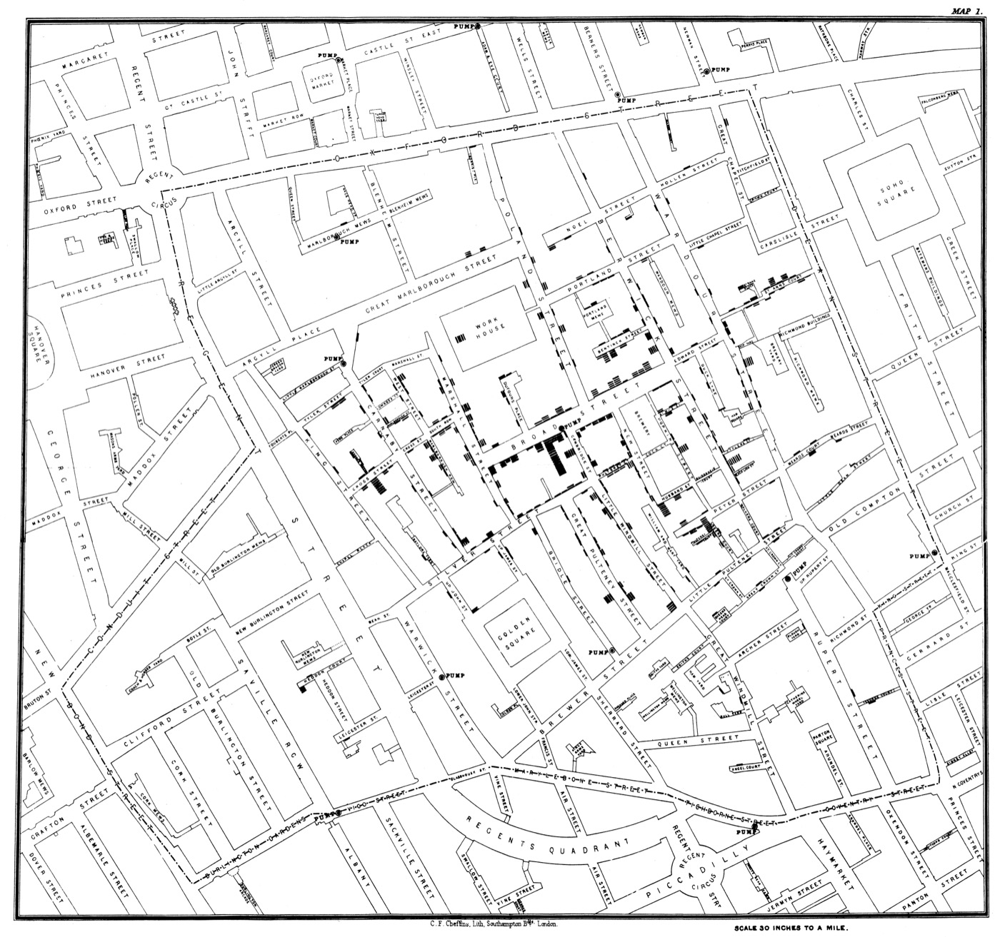
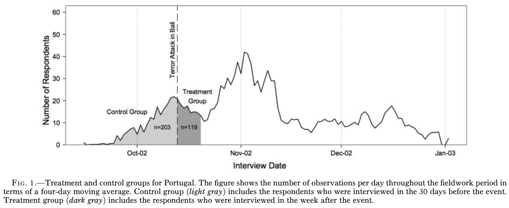
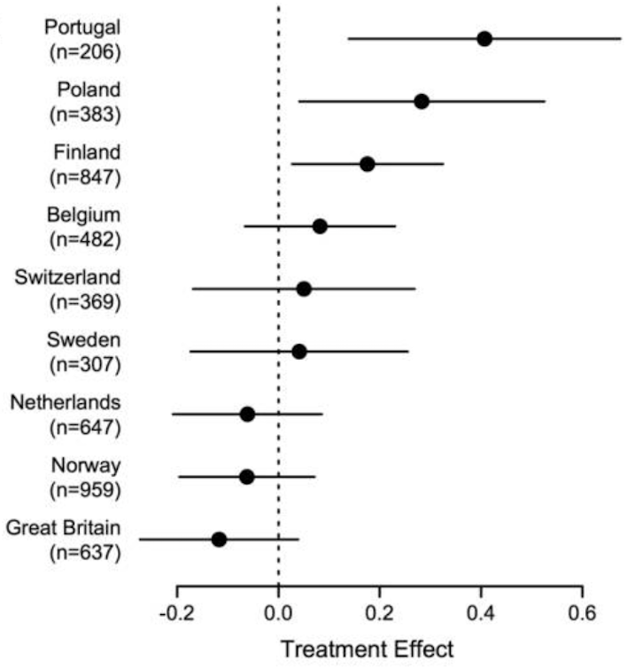
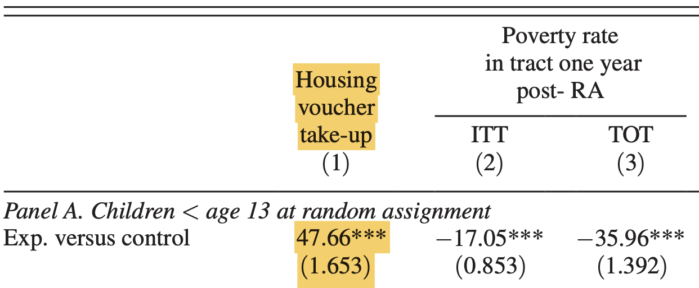
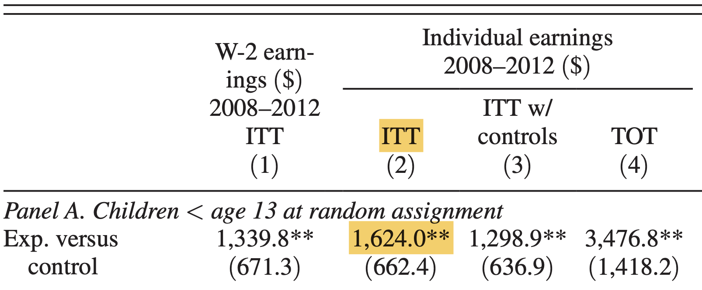
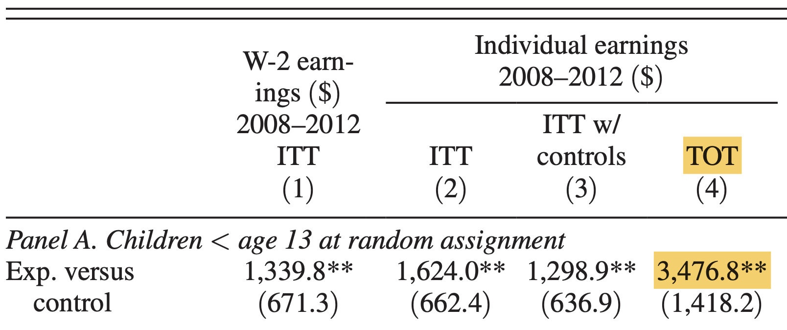

```{r setup, include = FALSE}
library(RefManageR)
library(knitr)

options(htmltools.preserve.raw = FALSE,
        htmltools.dir.version = FALSE, servr.interval = 0.5, width = 115, digits = 3)
knitr::opts_chunk$set(
  collapse = TRUE, message = FALSE, fig.retina = 3, error = TRUE,
  warning = FALSE, cache = FALSE, fig.align = 'center',
  comment = "#", strip.white = TRUE, tidy = FALSE)

BibOptions(check.entries = FALSE,
           bib.style = "authoryear",
           style = "markdown",
           hyperlink = FALSE,
           no.print.fields = c("doi", "url", "ISSN", "urldate", "language", "note", "isbn", "volume"))
myBib <- ReadBib("../Stats_II.bib", check = FALSE)
```

## By the end of today you can … {.inverse background-color="#901A1E"}

1. recognise a **natural experiment** — "as-if random" assignment *by nature* — and why it trades a little internal validity for more external validity;

2. see how **non-compliance** turns an RCT into an **intention-to-treat** design, where the *offer* $Z$ is not the *treatment* $D$;

3. use an **instrumental variable** to recover the treatment effect for **compliers** — the Wald estimator $\rho/\phi$ — and state the **three IV assumptions**.

::: {.backgrnote}
Two real studies: terror attacks → xenophobia (a natural experiment), and moving out of poverty → children's earnings (an experiment with non-compliance).
:::

## Natural experiments {.inverse background-color="#901A1E"}

[Part 1 of 3]{.part-pill}

::: {.lead}
Some of the most important "treatments" can never be randomised in a lab. Sometimes the world randomises them *for us*.
:::

## The research question of the day {.inverse background-color="#901A1E"}

::: {.lead}
What is the **average causal effect** of a **terrorist attack** on **xenophobia**?
:::

It is *claimed* that attacks like 9/11 shift public attitudes. Can we show it — causally?

::: {.notes}
It's *claimed* that attacks like 9/11 shift public attitudes — today we test that causally. Stress the phrase "average causal effect": we want a cause, not a correlation. Sensitive topic — keep it factual.
:::

## We would need an RCT

::: {.push-left}
If we could **randomly** assign the "treatment", treatment and control groups would come from the same population — alike on **everything**, including their untreated potential outcome $Y_0$:

$$E[Y_{0i} \mid D = 1] = E[Y_{0i} \mid D = 0]$$

so the selection-bias term vanishes and the raw difference **is** the causal effect $\kappa$.
:::

::: {.push-right}
$$\begin{aligned}
& E[Y_{1i} \mid D{=}1] - E[Y_{0i} \mid D{=}0] \\
&= \kappa + \underbrace{E[Y_{0i} \mid D{=}1] - E[Y_{0i} \mid D{=}0]}_{= \,0 \text{ if randomised}} \\
&= \kappa .
\end{aligned}$$

::: {.content-box-red}
**But we cannot treat people with terrorism!** Many sociological "treatments" are impossible — or unethical — to assign.
:::
:::

::: {.notes}
Recall Lecture 6: randomising equalises the two groups' baseline $Y_0$, so selection bias is zero and the raw difference *is* the effect κ. Then hit the wall — we cannot randomly assign terrorism, it's impossible and unethical. So we go hunting for randomisation the world already did for us.
:::

## Nature can randomise for us

::: {.push-left}
A **natural experiment**: exposure to treatment vs. control is [as-if random]{.alert} — decided *by nature* or by forces outside the researcher's control.

The first one: **John Snow** traced the 1854 London cholera outbreak to one water pump. Because rival companies' pipes were laid haphazardly, *which* water a household got was **as-if random** — unrelated to their wealth or health `r Citep(myBib, "snow_mode_1856")`.
:::

::: {.push-right}
```{r, echo = FALSE, out.width='72%'}

```

::: {.backgrnote .center}
Snow's cholera map, 1854. *Source:* `r Citet(myBib, "snow_mode_1856")`
:::
:::

::: {.notes}
The core idea: sometimes exposure is "as-if random" by nature. Snow, 1854 — rival water firms had laid their pipes haphazardly, so *which* water a house drank was unrelated to wealth or health. That let him compare death rates by supplier and pin cholera on one pump. The first natural experiment in history.
:::

## The Bali bombings, October 2002

::: {.push-left}
`r Citet(myBib, "legewie_terrorist_2013")` spotted a natural experiment: the 2002 **Bali attack** struck *during* the European Social Survey's fieldwork.

Whether a respondent was interviewed **before** or **after** the attack was **as-if random** — so "after" is the treatment group, "before" the control.

::: {.content-box-blue}
**Two assumptions:** (1) the interview *date* is as-if random (watch for *reachability bias* — easy-to-reach people are interviewed earlier); (2) **no other** event moved attitudes at the same time.
:::
:::

::: {.push-right}
```{r, echo = FALSE, out.width='100%'}

```

::: {.backgrnote .center}
Portugal: control = 30 days before, treatment = week after. *Source:* `r Citet(myBib, "legewie_terrorist_2013")`
:::
:::

::: {.notes}
Legewie's move: the Bali attack landed *mid-fieldwork* in the ESS, so interview timing splits people into after (treated) and before (control). Point at the figure — control is the 30 days before, treatment the week after. Name the two assumptions: interview date is as-if random (threat = *reachability bias*, easy-to-reach people are interviewed early), and no *other* big event hit at the same moment.
:::

## RCT vs. natural experiment

```{tikz natexp-dag, echo = FALSE, out.width='30%', fig.align='center'}
\usetikzlibrary{shapes.geometric, arrows.meta, positioning, quotes}
\definecolor{kured}{HTML}{901A1E}
\begin{tikzpicture}[>=Latex, semithick]
\sffamily
\node[ellipse, draw=kured, thick] (E) at (0,0) {$E$};
\node[ellipse, draw] (D) at (2.6,0) {$D$};
\node[ellipse, draw, gray] (C) at (2.6,1.8) {$C$};
\node[ellipse, draw] (Y) at (5.2,0) {$Y$};
\draw[->, kured] (E) -- (D);
\draw[<->, kured, dashed] (E) to["?"] (C);
\draw[->] (D) -- (Y);
\draw[->, gray, dashed] (C) -- (D);
\draw[->, gray, dashed] (C) -- (Y);
\end{tikzpicture}
```

::: {.push-left}
::: {.content-box-red}
**Internal validity — the RCT wins.** The researcher *controls* assignment, so the intervention $I$ is **known** to be random. We are sure no confounder $C$ sneaks in.
:::
:::

::: {.push-right}
::: {.content-box-blue}
**External validity — the natural experiment wins.** We study a **real event** $E$, not an artificial lab intervention — findings travel better. The price: we must *assume* $E$ is as-if random (the "?" arrow), not *know* it.
:::
:::

::: {.notes}
Not a winner — a trade-off. RCT: we *control* assignment, so internal validity is high — we *know* it's random. Natural experiment: a *real* event, so external validity is better — but we must *assume* the as-if-random arrow (the "?"), we can't guarantee it. Both aim to shut the confounder $C$ — one by design, one by argument.
:::

## Learning goal 1: terror can raise xenophobia

::: {.push-left}
Because the interview day is as-if random, Legewie estimates the **causal** effect of the Bali attack on anti-immigrant attitudes — country by country, with plain **weighted OLS**.

::: {.content-box-green}
The attack **significantly raised xenophobia** in **Portugal, Poland & Finland** — but had **no** detectable effect in Great Britain, the Netherlands, or Norway. The same shock, different societies: *why* is the next research question `r Citep(myBib, "legewie_terrorist_2013")`.
:::

::: {.backgrnote}
Finding the natural experiment — not the statistics — is the hard, creative part.
:::
:::

::: {.push-right}
```{r, echo = FALSE, out.width='72%'}

```

::: {.backgrnote .center}
*Source:* `r Citet(myBib, "legewie_terrorist_2013")`
:::
:::

::: {.notes}
The payoff. Point at the plot: significant rise in Portugal, Poland, Finland — nothing in the UK, Netherlands, Norway. Same shock, different societies — *why?* is the real sociological question (tell them to read the paper). And stress: the hard, creative part was *spotting* the natural experiment; the statistics are just weighted OLS.
:::

## Break {.inverse background-color="#901A1E"}

<div class="ku-timer" data-min="15"></div>

## Your turn: exercise 1

::: {.left-column}
You replicate Legewie: estimate the Bali effect for **Portugal** and **Sweden**, and make a coefficient plot — real AJS-style analysis.

[**Open exercise 1 in a new tab ↗**](7-exercise1.html){target="_blank"}

<div class="ku-timer" data-min="20"></div>
:::

::: {.right-column}
<iframe src='7-exercise1.html' width='100%' height='640' frameborder='0' scrolling='yes' style="border:1px solid #ddd; border-radius:6px;"></iframe>
:::

## Non-compliance & intention-to-treat {.inverse background-color="#901A1E"}

[Part 2 of 3]{.part-pill}

::: {.lead}
Even a *real* RCT hits a snag: you can offer a treatment, but you cannot force people to take it.
:::

## Does your neighbourhood shape your future?

::: {.push-left}
**Moving to Opportunity (MTO):** one of the largest social-science RCTs ever. ~4,600 low-income families in high-poverty housing were **randomly** offered a voucher to move to a low-poverty neighbourhood.

The question: does growing up in a poor neighbourhood hold children back — *causally*?
:::

::: {.push-right}
::: {.content-box-red}
**The catch:** the lottery randomised the **offer**, not the **move**. Families could decline. So the randomly assigned $Z$ (offer) is **not** the treatment $D$ (actually moving).
:::
:::

::: {.notes}
Gear change — this time a *real* RCT. The US government took ~4,600 poor families and randomly *offered* a voucher to move to a low-poverty area. The question: does your childhood neighbourhood set your destiny? Tease the catch coming next — they could offer the move, but not force it.
:::

## Only some compliers move

::: {.push-left}
Among families with young children who were offered the experimental voucher, only about **48%** actually moved `r Citep(myBib, "chetty_effects_2016")`.

This is **non-compliance**: the random $Z$ (the offer) and the treatment $D$ (moving) come apart, $|r_{Z,D}| < 1$.
:::

::: {.push-right}
```{r, echo = FALSE, out.width='86%'}

```

::: {.backgrnote .center}
Take-up ≈ 0.4766. *Source:* `r Citet(myBib, "chetty_effects_2016")`
:::
:::

::: {.notes}
The snag: only ~48% of offered families actually moved. So the randomly-assigned thing (Z = the offer) is *not* the treatment (D = moving). Give it its name — non-compliance — and note it breaks the clean RCT logic we just relied on.
:::

## The intention-to-treat effect

::: {.push-left}
Compare everyone **offered** the voucher to everyone not offered — regardless of who moved. Because the *offer* was randomised, this **intention-to-treat (ITT)** difference is a clean causal effect: **+\$1,624** in adult earnings for kids offered the move.

::: {.content-box-blue}
**But of what?** It is the causal effect of **being offered** the move $Z$ — **not** of actually **moving** $D$. It is *diluted*: a big effect for the ~48% who moved, mixed with zero for the ~52% who stayed.
:::
:::

::: {.push-right}
```{r, echo = FALSE, out.width='86%'}

```

::: {.backgrnote .center}
ITT ≈ +\$1,624. *Source:* `r Citet(myBib, "chetty_effects_2016")`
:::
:::

::: {.notes}
The offer was random, so offered-vs-not is a clean causal effect: +\$1,624. But push them: the effect of *what*? Of being *offered*, not of *moving*. It's diluted — a big effect for the ~48% who moved, blended with zero for the ~52% who stayed.
:::

## RCT vs. intention-to-treat

::: {.push-left}
::: {.content-box-red}
**Full-compliance RCT:** the intervention *is* the treatment.
$$|r_{I,D}| = 1 \;\Rightarrow\; I = D$$
The randomised difference is the treatment effect directly.
:::
:::

::: {.push-right}
::: {.content-box-blue}
**ITT / non-compliance:** the offer only *nudges* the treatment.
$$|r_{Z,D}| < 1 \;\Rightarrow\; Z \neq D$$
The randomised offer injects *some* random variation into $D$ — enough to work with.
:::
:::

::: {.content-box-green style="clear: both;"}
That leftover random variation in $D$ is exactly what an **instrumental variable** exploits.
:::

::: {.notes}
Two correlations side by side: perfect RCT, intervention = treatment (|r| = 1); non-compliance, offer ≠ treatment (|r| < 1). The bridge line to Part 3: that *leftover* random wiggle the offer injects into $D$ is exactly what an instrumental variable exploits.
:::

## Instrumental variables {.inverse background-color="#901A1E"}

[Part 3 of 3]{.part-pill}

::: {.lead}
Use the randomly-assigned **offer** as an *instrument* to recover the effect of the **treatment itself**.
:::

## The cast of characters

Every IV argument juggles the same seven players. Anchor them in the MTO study:

::: {.small}
| Symbol | Role | In Moving to Opportunity |
|:--:|---|---|
| $Z$ | **Instrument** — randomly assigned | the **voucher offer** (the lottery) |
| $D$ | **Treatment** — what we care about | **actually moving** to a low-poverty area |
| $Y$ | **Outcome** | the child's **adult income** |
| $C$ | **Confounders** — why we can't just compare movers | ambition, family resources … |
| $\phi$ | **First stage** $Z \rightarrow D$ | offer → move $= 0.48$ |
| $\rho$ | **Reduced form** $Z \rightarrow Y$ (the ITT) | offer → income $= \$1{,}624$ |
| $\lambda$ | **What we want** $D \rightarrow Y$ | move → income $= \rho/\phi \approx \$3{,}400$ |
:::

::: {.backgrnote}
Keep this in view — every formula today is just these seven symbols.
:::

::: {.notes}
Slow down here — this is the anchor. Map every symbol to MTO out loud: Z = the offer, D = moved, Y = income, φ = 0.48, ρ = \$1,624, λ = what we want. Tell them to keep this table in their heads; everything that follows is just these seven letters.
:::

## An instrument, and its three demands

::: {.push-left}
**Goal:** the causal effect $\lambda$ of the treatment $D$ on outcome $Y$.

::: {.content-box-red}
**Three requirements for an instrument $Z$:**

1. **First stage:** $Z$ has a real effect $\phi$ on $D$ *(testable)*.
2. **As-if random:** $Z$ is unrelated to confounders $C$ *(by design)*.
3. **Exclusion restriction:** $Z$ affects $Y$ **only** through $D$ *(not testable — argue for it)*.
:::
:::

::: {.push-right}
```{tikz iv-dag, echo = FALSE, out.width='82%'}
\usetikzlibrary{shapes.geometric, arrows.meta, positioning, quotes}
\definecolor{kured}{HTML}{901A1E}
\begin{tikzpicture}[>=Latex, semithick]
\sffamily
\node[ellipse, draw=kured, thick] (Z) at (0,0) {$Z$};
\node[ellipse, draw] (D) at (2.6,0) {$D$};
\node[ellipse, draw, gray] (C) at (2.6,1.8) {$C$};
\node[ellipse, draw] (Y) at (5.2,0) {$Y$};
\draw[->, kured] (Z) to["$\phi$"] (D);
\draw[->] (D) to["$\lambda$"] (Y);
\draw[->, gray, dashed] (C) -- (D);
\draw[->, gray, dashed] (C) -- (Y);
\end{tikzpicture}
```
:::

::: {.notes}
Three tests for a good instrument. (1) First stage — does Z actually move D? This one is *testable* (the offer did cause moves). (2) As-if random — true here by the lottery. (3) Exclusion restriction — Z reaches Y *only* through D. Flag #3 now as the hard, untestable one; we unpack it next.
:::

## The exclusion restriction is fragile

::: {.push-left}
Winning the lottery clearly makes families **move** (first stage ✓) and was **random** (✓) — two boxes ticked.

::: {.content-box-blue}
**Discuss:** could the random offer still reach a child's income through some *other* path than moving — and so ruin the instrument?
:::

::: {.content-box-red .fragment}
Yes — if winning also sparked **optimism** that lifted income *directly*, whether or not the family moved. Then $Z$ reaches $Y$ through a **second path**: the exclusion restriction breaks. It is the **one requirement you cannot test** — you must *argue* it is implausible.
:::
:::

::: {.push-right}
::: {.small .center}
**A violated exclusion restriction**
:::
```{tikz excl-dag, echo = FALSE, out.width='88%'}
\usetikzlibrary{shapes.geometric, arrows.meta, positioning, quotes}
\definecolor{kured}{HTML}{901A1E}
\begin{tikzpicture}[>=Latex, semithick]
\sffamily
\node[ellipse, draw, align=center] (Z) at (0,0) {Win\\lottery};
\node[ellipse, draw, align=center] (D) at (3,0) {Moving out\\of poverty};
\node[ellipse, draw=kured, align=center] (C) at (3,2.1) {Optimistic\\personality};
\node[ellipse, draw, align=center] (Y) at (6.2,0) {Income\\as adult};
\draw[->] (Z) -- (D);
\draw[->, kured] (Z) to["?"] (C);
\draw[->] (D) -- (Y);
\draw[->, kured] (C) -- (Y);
\end{tikzpicture}
```
:::

::: {.notes}
The crux — and the assumption students confuse with "as-if random". Ask the blue question first, give them a moment, *then* reveal: winning → optimism → income *directly*, bypassing the move. Hammer the point — you can never *test* this, you can only *argue* it's implausible. This is where IV papers live or die.
:::

## Why divide? The dilution intuition

::: {.push-left}
The offer only moved **48%** of families. So the offer's effect on income — the **\$1,624** ITT — is a **diluted** effect of *moving*: a big gain for the ~48% who moved, blended with **zero** for the ~52% who did not.

To undo the dilution, **scale it back up** by the share who actually moved:
$$\lambda = \frac{\$1{,}624}{0.48} \approx \$3{,}400$$
:::

::: {.push-right}
::: {.content-box-green}
**In one line:** a *weak* nudge that *still* shifted incomes must mean each real **mover** was affected a **lot**. Dividing the (small) reduced form by the (small) first stage recovers that full per-mover effect.
:::

::: {.backgrnote}
If everyone had complied ($\phi = 1$), the ITT *would* be the treatment effect — no scaling needed. Non-compliance is exactly why we divide.
:::
:::

::: {.notes}
Build the intuition *before* the algebra. The offer moved only 48%, so its \$1,624 effect on income is a diluted version of the real move-effect. Scale it back up — divide by 0.48 — to get ~\$3,400. One line to say aloud: a weak nudge that *still* shifted incomes means each actual mover must have gained a lot.
:::

## The Wald estimator: a ratio

Two effects we *can* estimate cleanly, because $Z$ is random:

::: {.push-left}
**First stage** — $Z$'s effect on the treatment:
$$\phi = E[D \mid Z{=}1] - E[D \mid Z{=}0]$$

**Reduced form** — $Z$'s effect on the outcome (the ITT):
$$\rho = E[Y \mid Z{=}1] - E[Y \mid Z{=}0]$$
:::

::: {.push-right}
If $Z$ works only through $D$, then $\phi \times \lambda = \rho$, so:
$$\lambda = \frac{\rho}{\phi} = \frac{\text{reduced form}}{\text{first stage}}$$

::: {.content-box-green}
For MTO: $\lambda = \dfrac{\$1{,}624}{0.4766} \approx \mathbf{\$3{,}400}$ — the effect of *moving* for those who move because of the offer.
:::
:::

::: {.notes}
Now formalise: first stage φ, reduced form ρ, and λ = ρ/φ. Same \$3,400 as the last slide — this is just that intuition written as algebra. If it helps, read it as "the outcome effect of the offer, undone by how much the offer actually shifted the treatment."
:::

## IV is LATE — only for compliers

::: {.push-left}
The instrument only moves the **compliers** — people who take the treatment *because* they were assigned it. So IV recovers a **Local Average Treatment Effect**:
$$\lambda = E[Y_{1i} - Y_{0i} \mid \text{complier}]$$

- **Why only compliers?** Never- and always-takers do the *same* thing whether offered or not — the offer shifts neither their $D$ nor their $Y$, so they add **nothing** to $\rho$ or $\phi$ and cancel out of the ratio. Only compliers are left.
- **Monotonicity:** assume **no defiers** (who do the *opposite* of their assignment). Almost always reasonable.
:::

::: {.push-right}
```{tikz complier-tree, echo = FALSE, out.width='96%'}
\usetikzlibrary{trees}
\definecolor{kured}{HTML}{901A1E}
\begin{tikzpicture}[semithick,
  level 1/.style={sibling distance=5cm},
  level 2/.style={sibling distance=2.4cm},
  every node/.style={align=center, font=\sffamily\small}]
\node {Sample}
  child {node {Offered\\$Z=1$}
    child {node[kured] {moved\\= complier}}
    child {node {stayed\\= never-taker}}
  }
  child {node {Not offered\\$Z=0$}
    child {node {moved\\= always-taker}}
    child {node[kured] {stayed\\= complier}}
  };
\end{tikzpicture}
```
:::

::: {.notes}
The twist nobody expects: IV speaks *only* about compliers. Walk the tree. Why? Never- and always-takers do the same thing regardless of the offer, so the instrument shifts neither their D nor their Y — they cancel out of both ρ and φ. Monotonicity = assume no "defiers" who do the opposite; almost always reasonable.
:::

## Learning goal 2: neighbourhoods matter

::: {.push-left}
Instrumenting the move with the random voucher offer, `r Citet(myBib, "chetty_effects_2016")` recover the effect of **actually moving** as a young child: about **+\$3,477** in annual adult earnings.

::: {.content-box-green}
Growing up in a low-poverty neighbourhood **causally** raises children's later earnings — powerful evidence that place shapes destiny, for the compliers whose move the lottery caused.
:::
:::

::: {.push-right}
```{r, echo = FALSE, out.width='86%'}

```

::: {.backgrnote .center}
IV / treatment-on-treated ≈ +\$3,477. *Source:* `r Citet(myBib, "chetty_effects_2016")`
:::
:::

::: {.notes}
Payoff number two: instrument the move with the random offer, and moving out as a young child raises adult earnings by ~\$3,477 (the treatment-on-treated column). Strong causal evidence that place shapes destiny — but keep them honest: this is the effect for the *compliers*, the families whose move the lottery actually caused.
:::

## Your turn: exercise 2

::: {.left-column}
Does **arresting** domestic-violence suspects deter repeat offences? The Minneapolis experiment had non-compliance too — you compute the **IV** estimate yourself.

[**Open exercise 2 in a new tab ↗**](7-exercise2.html){target="_blank"}

<div class="ku-timer" data-min="20"></div>
:::

::: {.right-column}
<iframe src='7-exercise2.html' width='100%' height='640' frameborder='0' scrolling='yes' style="border:1px solid #ddd; border-radius:6px;"></iframe>
:::

## Today's general lessons {.inverse background-color="#901A1E"}

1. A **natural experiment** exploits *as-if random* exposure created by the world — less control than an RCT, but real events and better external validity.

2. With **non-compliance**, the randomised offer $Z$ is not the treatment $D$. The **intention-to-treat** effect is the clean causal effect *of the offer* — diluted by everyone who didn't comply.

3. An **instrumental variable** uses the random $Z$ to recover the treatment effect $\lambda = \rho/\phi$ — *if* the first stage is real, $Z$ is as-if random, and the **exclusion restriction** holds.

4. IV estimates a **LATE**: the effect only for **compliers**, assuming **no defiers** (monotonicity). It is silent about never- and always-takers.

::: {.notes}
Recap the four ideas: natural experiment (nature randomises), ITT (the effect of the offer), IV (recovers the treatment effect as ρ/φ), LATE (compliers only). Tie it together: the whole day was about finding — or engineering — random variation to shut the confounder C.
:::

## Check yourself: today's goals

::: {.checklist}
- Explain why an interview date, or a lottery, can serve as "as-if random" assignment — and what could break that.
- Say why the ITT effect of *being offered* a move is not the effect of *moving*, and what non-compliance does to $r_{Z,D}$.
- Compute an IV estimate as reduced form ÷ first stage, and state whose effect (which group) it is.
:::

::: {.content-box-green}
Shaky on any of these? That is what this week's **Absalon quiz** and the **Friday exercise class** are for.
:::

## References

::: {.small}
```{r ref, results = 'asis', echo = FALSE}
PrintBibliography(myBib)
```
:::

```{=html}
<script>
(function () {
  function fmt(s) { var m = Math.floor(s / 60), ss = s % 60; return m + ":" + (ss < 10 ? "0" : "") + ss; }
  function build(el) {
    var total = (parseInt(el.getAttribute("data-min"), 10) || 5) * 60, rem = total, id = null;
    el.innerHTML =
      '<div class="kt-display">' + fmt(rem) + '</div>' +
      '<div class="kt-btns">' +
        '<button class="kt-start" type="button">Start</button>' +
        '<button class="kt-pause" type="button">Pause</button>' +
        '<button class="kt-reset" type="button">Reset</button>' +
      '</div>';
    var disp = el.querySelector(".kt-display");
    function render() { disp.textContent = fmt(rem); el.classList.toggle("kt-done", rem <= 0); }
    function start() { if (id) return; id = setInterval(function () { if (rem > 0) { rem--; render(); } else { stop(); } }, 1000); }
    function stop() { clearInterval(id); id = null; }
    function reset() { stop(); rem = total; render(); }
    el.querySelector(".kt-start").onclick = start;
    el.querySelector(".kt-pause").onclick = stop;
    el.querySelector(".kt-reset").onclick = reset;
    el._start = start; el._reset = reset; render();
  }
  function init() {
    document.querySelectorAll(".ku-timer").forEach(build);
    if (window.Reveal && Reveal.on) {
      Reveal.on("slidechanged", function (e) {
        document.querySelectorAll(".ku-timer").forEach(function (t) { if (t._reset) t._reset(); });
        var here = e.currentSlide ? e.currentSlide.querySelectorAll(".ku-timer") : [];
        here.forEach(function (t) { if (t._start) setTimeout(t._start, 250); });
      });
    }
  }
  if (document.readyState !== "loading") init();
  else document.addEventListener("DOMContentLoaded", init);
})();
</script>
```
