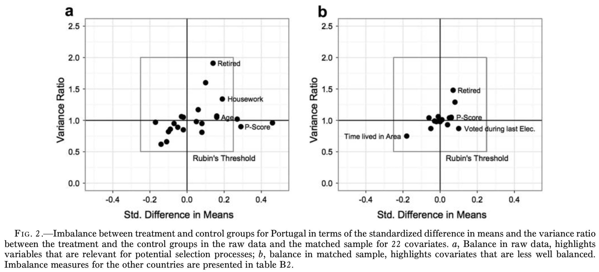
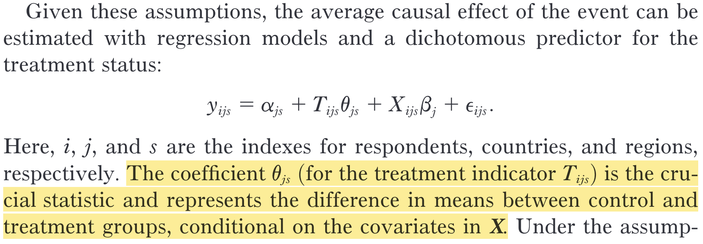

```{r setup, include = FALSE}
library(RefManageR)
library(knitr)

options(htmltools.preserve.raw = FALSE,
        htmltools.dir.version = FALSE, servr.interval = 0.5, width = 115, digits = 3)
knitr::opts_chunk$set(
  collapse = TRUE, message = FALSE, fig.retina = 3, error = TRUE,
  warning = FALSE, cache = FALSE, fig.align = 'center',
  comment = "#", strip.white = TRUE, tidy = FALSE)

BibOptions(check.entries = FALSE,
           bib.style = "authoryear",
           style = "markdown",
           hyperlink = FALSE,
           no.print.fields = c("doi", "url", "ISSN", "urldate", "language", "note", "isbn", "volume"))
myBib <- ReadBib("../Stats_II.bib", check = FALSE)
```

## By the end of today you can … {.inverse background-color="#901A1E"}

1. explain **omitted variable bias** — why leaving a confounder out of a regression shifts a coefficient, and **in which direction**;

2. read a multiple OLS coefficient as *"holding the other variables constant"* — and show what that means with the **Frisch–Waugh** three-step;

3. estimate an **adjusted** effect in R — and say honestly what multiple OLS does **not** fix.

::: {.backgrnote}
One part per goal. Our running question: back to Legewie's Bali attack — but this time the natural experiment is **not quite** as-if random.
:::

::: {.notes}
Set the stakes: they can already run `lm()` with two predictors — nobody needs a lecture to add a `+`. What they cannot yet do is say *why* the number moved, by how much, and in which direction. That is today. Flag goal 3 as the honest one: today's tool is weaker than a coin flip, and we will say exactly how.
:::

## Where we are {.inverse background-color="#901A1E"}

::: {.push-left}
::: {.lead}
Three lectures, three ways to earn a causal claim:
:::

- **L6 — randomize it.** A coin balances *everything*, observed and not. Gold standard, rarely available.
- **L7 — find a natural experiment.** Let the world randomize for you; use an **instrument** if compliance is broken.
- **Today — adjust for it.** No coin, no instrument: measure the confounder and *hold it constant*.
:::

::: {.push-right}
::: {.content-box-red}
**Beware:** these are in descending order of credibility. Today's tool is the weakest of the three — and the one you will use most often.
:::
:::

::: {.notes}
This slide replaces about ten slides of IV recap from the old deck — they did Minneapolis and the Wald estimator properly last week, so do not re-teach it. Just place today in the sequence and be blunt about the ranking: randomisation, then natural experiments, then statistical adjustment. Today's tool is the weakest *and* the one they will reach for constantly, which is exactly why it needs a careful lecture.
:::

## The crack in last week's natural experiment {.inverse background-color="#901A1E"}

[Part 1 of 3]{.part-pill}

::: {.lead}
Legewie's Bali design assumed interview date was as-if random. The balance table says: **almost, but not quite.**
:::

## Almost random is not random

::: {.push-left}
Last week we treated the day of a respondent's ESS interview as **as-if random** — so the people interviewed after the Bali attack should look like those interviewed before.

Legewie checked. They do *not* quite:

> "The treatment group is on average slightly younger, and the proportion of people who are retired and who work from home is lower."

::: {.backgrnote}
`r Citet(myBib, "legewie_terrorist_2013", after = ", p. 1211")`
:::
:::

::: {.push-right}
```{r, echo = FALSE, out.width='88%'}

```

::: {.content-box-blue}
**Discuss:** why would people interviewed *early* in a survey period differ systematically from those interviewed late?
:::
:::

::: {.notes}
Do not re-explain the Bali design — one sentence of reminder, then straight to the crack. The mechanism behind the imbalance is *reachability bias*: people who are easy to contact get interviewed early, and being easy to contact correlates with being retired, at home, older. So the "randomisation" leaked. Let them work that out from the blue box before you say it.
:::

## Age, the confounder

::: {.push-left}
1. Xenophobia tends to **increase with age**.

2. The younger a respondent, the **more likely** they were still to be interviewed after the attack.

$$\Rightarrow \text{Avg}[Y_{0i} \mid D = 0] \;\color{#901A1E}{>}\; \text{Avg}[Y_{0i} \mid D = 1]$$

The treatment group had a *lower* baseline to begin with — so the raw comparison **understates** the attack's effect.

::: {.backgrnote}
In **Portugal** the imbalance runs the other way — older respondents were more likely to land in the treatment group. Same logic, opposite sign.
:::
:::

::: {.push-right}
```{tikz dag-age, echo = FALSE, out.width='92%'}
\usetikzlibrary{shapes.geometric, arrows.meta, positioning}
\definecolor{kured}{HTML}{901A1E}
\begin{tikzpicture}[>=Latex, semithick]
\sffamily
\node[ellipse, draw, align=center] (D) at (0,0) {Interviewed\\after Bali};
\node[ellipse, draw=kured, thick, dashed] (C) at (3.2,2.4) {Age};
\node[ellipse, draw, align=center] (Y) at (6.4,0) {Xenophobia};
\draw[->] (D) -- (Y);
\draw[->, kured, dashed] (C) -- (D);
\draw[->, kured, dashed] (C) -- (Y);
\end{tikzpicture}
```

::: {.content-box-blue}
**Discuss:** does this imbalance make our estimate of the Bali effect **too large** or **too small**?
:::
:::

::: {.notes}
The two bullets are the two arrows — walk them one at a time, then trace the backdoor path. Getting the *direction* right is the hardest exam skill in this block, so make them commit out loud before you move on. Do not resolve it yet; the toy simulation is where they will see it happen. And flag the Portugal footnote, because their exercise uses Portugal and the sign is reversed there.
:::

## The problem, stated plainly

::: {.lead}
We cannot re-run the survey. The confounder is **already baked into** the data.
:::

::: {.push-left}
::: {.content-box-blue}
**Discuss:** age is *measured* — it is sitting right there in the data set. Can we use that somehow to repair the comparison after the fact?
:::
:::

::: {.push-right}
::: {.content-box-red .fragment}
Yes — that is exactly what **multiple OLS** does. It compares people of the *same age* who differ only in whether they were interviewed after the attack. The rest of today is *how*, and *how much you should trust it*.
:::
:::

::: {.notes}
The pivot of the lecture. The key contrast: last week the design fixed the problem before the data existed; today we fix it afterwards, with a variable we happened to measure. Put weight on "happened to measure" — it sets up the honesty slide in Part 3.
:::

## A laboratory where we know the truth

::: {.lead}
Real data never tells you the right answer. So let's **simulate** data where we *set* the true effect — then check whether OLS finds it.
:::

::: {.panel-tabset}

### Packages
```{r libs}
pacman::p_load(
  tidyverse,    # Data manipulation and visualization
  estimatr,     # OLS with robust standard errors
  modelr,       # Residuals and predictions from a model
  modelsummary  # Nicely formatted regression tables
)
```

### Step 1: age
```{r sim-age}
set.seed(831983) # So everyone gets the SAME "random" numbers

toydat <- tibble(
  age = rnorm( # 500 fictitious people
    n = 500,
    mean = 40, # Average age 40
    sd = 5     # Standard deviation 5 years
  )
)
```

### Step 2: who gets treated
```{r sim-treat}
# Older people are interviewed EARLIER, so they less often
# end up in the post-attack (treatment) group.
toydat <- toydat %>%
  mutate(
    int_day = (-0.1 * age) + rnorm(n = 500, mean = 0, sd = 1),
    bali    = if_else(int_day >= mean(int_day), 1, 0)
  )
```

### Step 3: the outcome
```{r sim-outcome}
# WE decide the truth: the Bali effect is exactly 1,
# and each year of age adds 0.3 to xenophobia.
toydat <- toydat %>%
  mutate(
    xeno = (1 * bali) + (0.3 * age) + #<<
      rnorm(n = 500, mean = 0, sd = 1)
  )
```

::: {.content-box-green}
**The true causal effect of Bali is 1.** Remember that number — it is the only time in this course you will know it.
:::

:::

::: {.notes}
Sell the trick before the code: in real research we never know the right answer, so we cannot tell a good method from a bad one. In a simulation we *write down* the truth and then check whether our method recovers it. Walk the three steps as a story — people have ages, age pushes them into one group, and then we build xenophobia by hand out of the treatment plus age plus noise. Point hard at the highlighted line: the truth is 1. They must carry that number into the next slide.
:::

## Which model is right?

::: {.push-left}
```{r toy-ols, results = 'hide'}
# Bivariate: the treatment only
ols_bi <- lm_robust(xeno ~ bali, data = toydat)

# Multiple: add the confounder
ols_mult <- lm_robust(xeno ~ bali + age, data = toydat)

modelsummary(
  list("Bivariate" = ols_bi, "Multiple" = ols_mult),
  coef_rename = c("bali" = "Exposed to Bali", "age" = "Age"),
  stars = TRUE, gof_map = c("nobs", "r.squared"),
  output = "kableExtra"
)
```

::: {.content-box-blue}
**Discuss:** we *know* the true effect is **1**. Which of these two models found it?
:::
:::

::: {.push-right}
::: {.small}
```{r toy-tab, ref.label = "toy-ols", echo = FALSE, results = 'asis'}
```
:::

::: {.content-box-red .fragment}
The **bivariate** model is badly wrong — it misses the truth by a wide margin. Adding one variable, `age`, recovers ≈ 1. Same data, same outcome, one extra column.
:::
:::

::: {.notes}
This is the money slide of Part 1. Show only the first column, ask them to compare it to 1, and let the size of the miss land. Then reveal the second column. The lesson to state explicitly: nothing about the data changed and nothing about the outcome changed — the only difference is which variables we let the model see. Do not explain *why* yet; that is Part 2, and the suspense is useful.
:::

## Omitted variable bias {.inverse background-color="#901A1E"}

[Part 2 of 3]{.part-pill}

::: {.lead}
The gap between those two numbers is not random noise. It has a **formula**.
:::

## Where the gap comes from

::: {.push-left}
When we compare xenophobia between the exposed and the unexposed, we are comparing people who differ in **two** ways:

1. They differ in **exposure** — that is the causal effect we want, `r round(coef(lm_robust(xeno ~ bali + age, data = toydat))["bali"], 2)` in our simulation.

2. They also differ in **age**. How much? Regress the confounder on the treatment:

::: {.content-box-blue}
**Discuss:** the exposed are on average `r abs(round(coef(lm_robust(age ~ bali, data = toydat))["bali"], 1))` years **younger**. Given that each year of age adds ≈ 0.3 xenophobia, how much xenophobia does that age gap alone account for?
:::
:::

::: {.push-right}
```{r toy-cd, results = 'hide'}
# How much do the two groups differ in AGE?
ols_age <- lm_robust(age ~ bali, data = toydat)

modelsummary(
  list("Age" = ols_age),
  coef_rename = c("bali" = "Exposed to Bali"),
  stars = TRUE, gof_map = c("nobs"),
  output = "kableExtra"
)
```

::: {.small}
```{r toy-cd-tab, ref.label = "toy-cd", echo = FALSE, results = 'asis'}
```
:::
:::

::: {.notes}
Build the arithmetic with them rather than showing it. Two groups, two differences: the one we want and the one that is contaminating it. Get the age gap on the board, remind them each year is worth about 0.3, and let someone multiply. When they produce the number they will recognise it as almost exactly the gap between the two columns on the previous slide — that recognition is the point.
:::

## The formula

```{r ovb-nums, include = FALSE}
b_bi   <- coef(lm_robust(xeno ~ bali, data = toydat))["bali"]
b_mult <- coef(lm_robust(xeno ~ bali + age, data = toydat))["bali"]
b_cy   <- coef(lm_robust(xeno ~ bali + age, data = toydat))["age"]
b_dc   <- coef(lm_robust(age ~ bali, data = toydat))["bali"]
```

::: {.push-left}
```{tikz dag-ovb, echo = FALSE, out.width='62%'}
\usetikzlibrary{shapes.geometric, arrows.meta, positioning}
\definecolor{kured}{HTML}{901A1E}
\begin{tikzpicture}[>=Latex, semithick]
\sffamily
\node[ellipse, draw] (D) at (0,0) {$D$};
\node[ellipse, draw=kured, thick, dashed] (C) at (2,2.2) {$C$};
\node[ellipse, draw] (Y) at (4,0) {$Y$};
\draw[->] (D) -- node[below]{$\beta_{D \rightarrow Y}$} (Y);
\draw[->, kured, dashed] (C) -- node[above left]{$\beta_{D \rightarrow C}$} (D);
\draw[->, kured, dashed] (C) -- node[above right]{$\beta_{C \rightarrow Y}$} (Y);
\end{tikzpicture}
```

::: {.content-box-red}
$$\underbrace{\tilde\beta_{D \rightarrow Y}}_{\text{what the biased model gives}} = \underbrace{\beta_{D \rightarrow Y}}_{\text{the truth}} + \underbrace{(\beta_{C \rightarrow Y} \times \beta_{D \rightarrow C})}_{\textbf{omitted variable bias}}$$
:::
:::

::: {.push-right}
Put our simulated numbers in — **the two paths, multiplied**:

$$\underbrace{`r round(b_bi, 2)`}_{\text{bivariate}} \;\approx\; \underbrace{`r round(b_mult, 2)`}_{\text{multiple}} \;+\; (\underbrace{`r round(b_cy, 2)`}_{C \rightarrow Y} \times \underbrace{`r round(b_dc, 2)`}_{D \rightarrow C})$$

::: {.content-box-green}
It **adds up**. The bias is not a mystery: it is the confounder's effect on the outcome, times the imbalance in the confounder between the groups.
:::
:::

::: {.notes}
Let them watch the arithmetic close. Two things make this slide work: the bias is the *product of the two dashed arrows*, and it is a product — so if **either** arrow is zero there is no bias at all. Ask what that means practically: a variable is only a confounder if it affects the outcome *and* is imbalanced across the groups. That is the test they should apply for the rest of the course.
:::

## Which way does the bias run?

::: {.push-left}
The formula also tells you the **sign** — before you run anything:

| $\beta_{C \rightarrow Y}$ | $\beta_{D \rightarrow C}$ | Bias |
|:--|:--|:--|
| $+$ | $+$ | **too large** |
| $+$ | $-$ | **too small** |
| $-$ | $+$ | **too small** |
| $-$ | $-$ | **too large** |

::: {.backgrnote}
Same rule as multiplying two signed numbers — because that is exactly what it is.
:::
:::

::: {.push-right}
::: {.content-box-blue}
**Discuss:** in Legewie's data, age raises xenophobia ($+$) and the exposed group is *younger* ($-$). Was his raw estimate too large or too small?
:::

::: {.content-box-red .fragment}
**Too small.** The bias is negative, so the unadjusted estimate *understates* the effect of the attack. Adjusting for age should push it **up**.
:::
:::

::: {.notes}
The most exam-relevant slide in the deck. Make them do the sign reasoning out loud before revealing — and note it is just multiplying two signs, nothing more. The payoff is that they can predict the *direction* of a bias without any data, which is what a good discussant does in a seminar. Tell them explicitly that "controlling for it will lower the estimate" is a claim they can now check rather than guess.
:::

## Naming things

::: {.push-left}
You will meet the same idea under several names. They are the same problem seen from different angles:

- **Selection bias** (L5) — the general problem: groups differ at baseline.
- **Confounder bias** — named after the *variable* that causes it.
- **Omitted variable bias** — named after the *fact that it is missing from your model*.
:::

::: {.push-right}
::: {.content-box-green}
"Omitted variable bias" is the useful name today, because it points at the fix: the variable is **omitted**, so put it in.
:::

::: {.content-box-red}
**Beware:** that only works for variables you actually **measured**. There is no formula for the confounders you never recorded.
:::
:::

::: {.notes}
Students get genuinely confused by the three names, so spend thirty seconds tidying the vocabulary. The distinction worth making: selection bias is the general condition, omitted variable bias names one specific culprit that you could have included. Then plant the red box — it is the seed of the honesty slide later in Part 3.
:::

## Break {.inverse background-color="#901A1E"}

<div class="ku-timer" data-min="15"></div>

## Your turn: exercise 1

::: {.left-column}
You estimate the **adjusted** Bali effect for Portugal — controlling for age, gender and employment status — and compare it to the unadjusted one.

[**Open exercise 1 in a new tab ↗**](8-exercise1.html){target="_blank"}

<div class="ku-timer" data-min="20"></div>
:::

::: {.right-column}
<iframe src='8-exercise1.html' width='100%' height='620' frameborder='0' scrolling='yes' style="border:1px solid #ddd; border-radius:6px;"></iframe>
:::

## How OLS does it — and what it can't do {.inverse background-color="#901A1E"}

[Part 3 of 3]{.part-pill}

::: {.lead}
"Holding age constant" sounds like a metaphor. `r Citet(myBib, "frisch_partial_1933")` showed it is an **arithmetic procedure**.
:::

## Frisch–Waugh, step 1

::: {.push-left}
**Regress the outcome on the confounder, keep the residuals** — the part of xenophobia that age does *not* explain.

```{r fw1}
toydat <- toydat %>%
  add_residuals(
    model = lm(xeno ~ age, data = .),
    var   = "e_xeno"
  )
```

::: {.backgrnote}
Each red line is one person's residual: how far they sit from what their age alone predicted.
:::
:::

::: {.push-right}
```{r fw1-plot, echo = FALSE, out.width='86%', fig.height = 4.2, fig.width = 6}
toydat %>%
  mutate(pred = xeno - e_xeno) %>%
  ggplot(aes(x = age, y = xeno)) +
  geom_linerange(aes(ymin = pred, ymax = xeno),
                 color = "#901A1E", alpha = 0.45) +
  geom_smooth(method = "lm", se = FALSE, color = "#425570") +
  geom_point(alpha = 0.45) +
  labs(x = "Age", y = "Xenophobia") +
  theme_minimal(base_size = 14)
```
:::

::: {.notes}
Announce the three steps before starting, so they know where this is going. Step 1 strips age out of the outcome. Ask what the leftovers mean: `e_xeno` is xenophobia *for someone of that age* — above or below what age alone would predict. That phrasing is what "holding age constant" actually means, and it is worth saying in those words.
:::

## Frisch–Waugh, step 2

::: {.push-left}
**Regress the treatment on the confounder, keep the residuals** — the part of Bali exposure that age does *not* explain.

```{r fw2}
toydat <- toydat %>%
  add_residuals(
    model = lm(bali ~ age, data = .),
    var   = "e_bali"
  )
```

::: {.content-box-blue}
**Discuss:** what kind of person has a large *positive* `e_bali`?
:::
:::

::: {.push-right}
```{r fw2-plot, echo = FALSE, out.width='86%', fig.height = 4.2, fig.width = 6}
toydat %>%
  mutate(pred = bali - e_bali) %>%
  ggplot(aes(x = age, y = bali)) +
  geom_linerange(aes(ymin = pred, ymax = bali),
                 color = "#901A1E", alpha = 0.45) +
  geom_smooth(method = "lm", se = FALSE, color = "#425570") +
  geom_point(alpha = 0.35) +
  scale_y_continuous(breaks = c(0, 1)) +
  labs(x = "Age", y = "Exposed to Bali (0/1)") +
  theme_minimal(base_size = 14)
```
:::

::: {.notes}
Exactly the same operation, now on the treatment — the symmetry is the point, both variables cleaned with the same rag. The blue box has a nice concrete answer: someone *older* than you would expect given that they were exposed, i.e. a surprising case. Those surprising people are precisely the ones carrying the information, which sets up the "why it works" slide.
:::

## Frisch–Waugh, step 3

::: {.push-left}
**Regress the two sets of residuals on each other.** Its slope is *identical* to the multiple-regression coefficient.

```{r fw3, results = 'hide'}
ols_resid <- lm_robust(e_xeno ~ e_bali, data = toydat)

modelsummary(
  list("Multiple OLS" = ols_mult, "Residualised" = ols_resid),
  coef_rename = c("bali" = "Exposed to Bali", "age" = "Age",
                  "e_bali" = "Exposed to Bali (resid.)"),
  coef_omit = "(Intercept)",
  stars = TRUE, gof_map = c("nobs"),
  output = "kableExtra"
)
```
:::

::: {.push-right}
::: {.small}
```{r fw3-tab, ref.label = "fw3", echo = FALSE, results = 'asis'}
```
:::

::: {.content-box-green}
Same number, two routes. **That is all "controlling for age" does** — it removes age from both variables and fits a line to what is left.
:::

::: {.backgrnote}
We meet this again in **Lecture 9**, on real cross-country data.
:::
:::

::: {.notes}
Let them see the two coefficients match before you say anything. The demystification is the whole point: multiple regression is not a black box that "adjusts" in some vague way, it subtracts the confounder out of both variables and runs the same bivariate OLS they already know. Flag the forward-reference — they will do this again in Lecture 9 on real data, so a flicker of recognition then is intended.
:::

## Why it works

::: {.push-left}
Look at step 2 again: after removing age, the people with the **most** residual variation in treatment are the *untypical* ones — the older person who was still interviewed late, the younger one interviewed early.

::: {.content-box-green}
Multiple OLS quietly **down-weights typical cases and up-weights untypical ones**. The comparison is carried by people who broke the pattern.
:::
:::

::: {.push-right}
```{r fw3-plot, echo = FALSE, out.width='86%', fig.height = 4.2, fig.width = 6}
ggplot(toydat, aes(x = e_bali, y = e_xeno)) +
  geom_point(alpha = 0.45) +
  geom_smooth(method = "lm", color = "#901A1E") +
  labs(x = "Exposure to Bali, with age removed",
       y = "Xenophobia, with age removed") +
  theme_minimal(base_size = 14)
```

::: {.content-box-red}
**Beware:** if *nobody* breaks the pattern — if age predicted exposure perfectly — there would be no residual variation left, and nothing to estimate from.
:::
:::

::: {.notes}
A genuinely useful intuition that most textbooks skip. The estimate is carried by the surprising cases, the people whose treatment status you could not have guessed from their age. Then the warning, which matters practically: the more strongly a control predicts the treatment, the less variation survives and the noisier the estimate gets. That is the honest reason you cannot just throw in every control you can think of.
:::

## Still just OLS

::: {.push-left}
Nothing new is being minimised. The best-fitting *plane* still minimises the sum of squared residuals:

$$\min \sum_{i=1}^{n} \left(y_i - (\alpha + \beta_1 x_{1i} + \dots + \beta_k x_{ki})\right)^2$$

$$y_{i} = \alpha + \beta_{1}x_{1} + \beta_{2}x_{2} + \ldots + \beta_{k}x_{k} + \epsilon_{i}$$
:::

::: {.push-right}
::: {.content-box-red}
**Beware — two things that follow:**

1. Multiple OLS assumes a **linear** relation for *every* continuous predictor, not just the one you care about.

2. Every coefficient is adjusted for **all** the others. There is no such thing as adding a control "just for one variable".
:::
:::

::: {.notes}
Keep this brief — it is reassurance, not new machinery. Same loss function they met in Lecture 2, just more slopes. The two warnings are what actually matters: the linearity assumption now applies to every continuous control, and adjustment is mutual, so a badly chosen control can distort the coefficient they care about. Point three arrives on the next slide.
:::

## What multiple OLS cannot fix

::: {.push-left}
::: {.content-box-green}
**It can** close a backdoor path through a confounder you **measured** — even long after the data were collected.
:::

::: {.content-box-red}
**It cannot** do anything about a confounder you never measured. And no test will tell you one is there.
:::

If the confounders you *can* see turned out to be imbalanced — is it likely that the ones you *cannot* see are perfectly balanced?
:::

::: {.push-right}
```{tikz dag-unobs, echo = FALSE, out.width='72%'}
\usetikzlibrary{shapes.geometric, arrows.meta, positioning}
\definecolor{kured}{HTML}{901A1E}
\begin{tikzpicture}[>=Latex, semithick]
\sffamily
\node[ellipse, draw] (D) at (0,0) {$D$};
\node[ellipse, draw=gray, double, align=center] (C1) at (0,2.4) {$C_1$\\{\footnotesize observed}};
\node[ellipse, draw] (Y) at (4.4,0) {$Y$};
\node[ellipse, draw=kured, thick, dashed, align=center] (C2) at (4.4,2.4) {$C_2$\\{\footnotesize unobserved}};
\draw[->] (D) -- (Y);
\draw[->, gray, dashed] (C1) -- (D);
\draw[->, gray, dashed] (C1) -- (Y);
\draw[->, kured, dashed] (C2) -- (D);
\draw[->, kured, dashed] (C2) -- (Y);
\end{tikzpicture}
```

::: {.backgrnote}
The double circle is a **closed** backdoor path — we controlled for it. The red dashed one stays wide open.
:::
:::

::: {.notes}
The honesty slide, and the one to slow down for. The double circle means closed; the red path is still open and no diagnostic will ever flag it. Then put the rhetorical question to them properly, because it is the strongest argument in the lecture: if the confounders you could see were imbalanced, what are the odds the invisible ones happen to be perfectly balanced? This is precisely why L7's natural experiment and L6's coin outrank today's tool.
:::

## Back to Bali: the Portuguese sample

```{r bali-data, include = FALSE}
pacman::p_load(haven)

# Bali terror attack, and the ESS 2002 fieldwork window around it
event_date_begin <- as.Date("2002-09-14")
event_date       <- as.Date("2002-10-13")
event_date_end   <- as.Date("2002-10-20")

ESS <- read_dta("../assets/Legewie_ESS_02.dta") %>%
  mutate(
    int_date = sprintf("%s-%s-%s", inwyr, inwmm, inwdd) %>% as.Date(),
    treat = case_when(
      int_date > event_date & int_date <= event_date_end   ~ "After Bali",
      int_date < event_date & int_date > event_date_begin  ~ "Before Bali",
      TRUE ~ NA_character_
    ) %>% fct_relevel("Before Bali", "After Bali"),
    anti_immi = rowMeans(
      across(c(imtcjob, imbleco, imbgeco, imueclt,
               imwbcnt, imwbcrm, imbghct)),
      na.rm = TRUE
    ) %>% scale() %>% as.numeric(),
    anti_immi = max(anti_immi, na.rm = TRUE) - anti_immi,
    across(c(brncntr, mocntr, facntr), as_factor),
    age     = inwyr - yrbrn,
    pspwght = pweight * dweight
  ) %>%
  filter(cntry == "PT",
         brncntr == "yes", mocntr == "yes", facntr == "yes") %>%
  select(treat, age, anti_immi, cntry, int_date, pspwght) %>%
  drop_na()
```

::: {.push-left}
The same wrangling as last week — now keeping **age** as well, and restricting to **Portugal**.

::: {.panel-tabset}

### Balance
::: {.small}
```{r bali-balance, echo = FALSE, results = 'asis'}
ESS %>%
  select(treat, age, anti_immi, pspwght) %>%
  rename(weights = pspwght) %>%
  datasummary_balance(~ treat, data = .,
                      output = "kableExtra")
```
:::

### R code
```{r bali-balance-code, eval = FALSE}
ESS %>%
  select(treat, age, anti_immi, pspwght) %>%
  rename(weights = pspwght) %>% # Used as survey weights
  datasummary_balance(~ treat, data = .,
                      output = "kableExtra")
```

:::
:::

::: {.push-right}
::: {.content-box-blue}
**Discuss:** in Portugal, which group is older — and so, by the sign rule, is the raw estimate too large or too small here?
:::

::: {.backgrnote}
Careful: the direction is the **opposite** of the all-country pattern Legewie reports. Portugal is its own case.
:::
:::

::: {.notes}
Now the real data, where nobody knows the truth. Point out that the balance table is the empirical counterpart of $\beta_{D \rightarrow C}$ from the formula — the imbalance term, measured. In Portugal the treatment group is *older*, which is the reverse of the pooled pattern, so the sign rule now predicts the adjustment will push the estimate **down**. Make them commit to a direction before the next slide.
:::

## The adjusted effect

```{r bali-mods, include = FALSE}
ols_pt_bi   <- lm_robust(anti_immi ~ treat, weights = pspwght, data = ESS)
ols_pt_mult <- lm_robust(anti_immi ~ treat + age, weights = pspwght, data = ESS)
ols_pt_dc   <- lm_robust(age ~ treat, weights = pspwght, data = ESS)

b_pt_bi   <- coef(ols_pt_bi)["treatAfter Bali"]
b_pt_mult <- coef(ols_pt_mult)["treatAfter Bali"]
b_pt_cy   <- coef(ols_pt_mult)["age"]
b_pt_dc   <- coef(ols_pt_dc)["treatAfter Bali"]
```

::: {.push-left}
```{r bali-tab-code, eval = FALSE}
ols_pt_bi   <- lm_robust(anti_immi ~ treat,
                         weights = pspwght, data = ESS)
ols_pt_mult <- lm_robust(anti_immi ~ treat + age,
                         weights = pspwght, data = ESS)

modelsummary(
  list("Bivariate" = ols_pt_bi, "Adjusted" = ols_pt_mult),
  coef_rename = c("treatAfter Bali" = "After Bali", "age" = "Age"),
  stars = TRUE, gof_map = c("nobs", "r.squared"),
  output = "kableExtra"
)
```

::: {.small}
```{r bali-tab, echo = FALSE, results = 'asis'}
modelsummary(
  list("Bivariate" = ols_pt_bi, "Adjusted" = ols_pt_mult),
  coef_rename = c("treatAfter Bali" = "After Bali", "age" = "Age"),
  stars = TRUE, gof_map = c("nobs", "r.squared"),
  output = "kableExtra"
)
```
:::
:::

::: {.push-right}
The same decomposition, now on real data:

$$\underbrace{`r round(b_pt_bi, 3)`}_{\text{bivariate}} \;\approx\; \underbrace{`r round(b_pt_mult, 3)`}_{\text{adjusted}} \;+\; (\underbrace{`r round(b_pt_cy, 3)`}_{C \rightarrow Y} \times \underbrace{`r round(b_pt_dc, 2)`}_{D \rightarrow C})$$

::: {.content-box-green}
Adjusting for age moves the estimate by only **`r sprintf("%+.3f", b_pt_mult - b_pt_bi)`** SD. **Why so little?** The bias is a *product* — and in Portugal age barely predicts xenophobia (`r round(b_pt_cy, 4)` per year). A big imbalance times a tiny effect is still a tiny bias.
:::
:::

::: {.notes}
The payoff, and the honest one: the formula they verified in a toy simulation also works on real survey data — walk the arithmetic once more. But do **not** oversell the shift, because it is small, and that is the lesson. Ask them why before you reveal: the imbalance is real, 2.6 years, yet age turns out to barely move xenophobia in Portugal. A product with one near-zero factor is near zero. This is exactly the point from the formula slide, now confirmed on real data — and a useful corrective to the instinct that every control must be added.
:::

## It's real research

::: {.push-left}
```{r, echo = FALSE, out.width='94%'}

```

::: {.backgrnote .center}
*Source:* `r Citet(myBib, "legewie_terrorist_2013", after = ", p. 1210")`
:::
:::

::: {.push-right}
Legewie's published models adjust for a whole battery of observed confounders — age, gender, education, employment, and more.

::: {.content-box-green}
Alternative names for the same thing, all of which you will meet in papers:
**controlling for** $X$ · **partialling out** $X$ · **adjusted for** $X$ · **conditional on** $X$.
:::
:::

::: {.notes}
Show them the published table so today's move looks like normal scholarly practice rather than a classroom exercise. The vocabulary box is genuinely useful — all four phrases mean the identical operation, and papers switch between them without warning. Mention that they will produce a version of this table themselves in exercise 1.
:::

## Your turn: exercise 2

::: {.left-column}
You become the simulator: **set** the confounder's strength and sign yourself, predict the bias from the formula, then check whether OLS agrees.

[**Open exercise 2 in a new tab ↗**](8-exercise2.html){target="_blank"}

<div class="ku-timer" data-min="20"></div>
:::

::: {.right-column}
<iframe src='8-exercise2.html' width='100%' height='620' frameborder='0' scrolling='yes' style="border:1px solid #ddd; border-radius:6px;"></iframe>
:::

## Today's general lessons {.inverse background-color="#901A1E"}

1. A confounder you leave out of your model creates **omitted variable bias**: $\tilde\beta = \beta + (\beta_{C \rightarrow Y} \times \beta_{D \rightarrow C})$. It is the same problem as selection bias, named after the missing variable.

2. Because the bias is a **product of two effects**, you can predict its **sign** before running anything — and it is zero if *either* effect is zero.

3. **Frisch–Waugh:** "controlling for $C$" means residualise $Y$ on $C$, residualise $D$ on $C$, and regress the leftovers. Nothing more mysterious than that.

4. Multiple OLS is **still OLS** — one plane, minimising squared residuals, with every coefficient adjusted for all the others.

5. It can repair imbalance in **observed** confounders. It can do **nothing** about unobserved ones — which is why a good design still beats a good regression.

::: {.notes}
Run these fast, they are tired. If one sentence survives the day, make it point five: regression fixes the confounders you thought to measure, and nothing else. That is precisely why Lecture 6 randomised and Lecture 7 went hunting for natural experiments — and why Lecture 9 will push on how far clever controls can take you.
:::

## Check yourself: today's goals

::: {.checklist}
- Write down the omitted variable bias formula, and say what makes the bias zero.
- Given a DAG and the signs of two arrows, say whether an unadjusted estimate is too large or too small.
- Explain in the three Frisch–Waugh steps what "controlling for age" does — and name one thing multiple OLS cannot fix.
:::

::: {.content-box-green}
Shaky on any of these? That is what this week's **Absalon quiz** and the **Friday exercise class** are for.
:::

## Today's important functions

::: {.small}
- `lm_robust(y ~ d + c, ...)`: multiple OLS — the coefficient on `d` holds `c` constant.
- `modelr::add_residuals(model = ..., var = ...)`: keep a model's residuals (the Frisch–Waugh workflow).
- `modelsummary::datasummary_balance(~ group, data = ...)`: the balance table — your empirical read on $\beta_{D \rightarrow C}$.
- `modelsummary(list("Bivariate" = ..., "Adjusted" = ...))`: put the unadjusted and adjusted models side by side.
- `set.seed()` + `rnorm()`: simulate data where *you* know the true effect.
:::

## References

::: {.small}
```{r ref, results = 'asis', echo = FALSE}
PrintBibliography(myBib)
```
:::

```{=html}
<script>
(function () {
  function fmt(s) { var m = Math.floor(s / 60), ss = s % 60; return m + ":" + (ss < 10 ? "0" : "") + ss; }
  function build(el) {
    var total = (parseInt(el.getAttribute("data-min"), 10) || 5) * 60, rem = total, id = null;
    el.innerHTML =
      '<div class="kt-display">' + fmt(rem) + '</div>' +
      '<div class="kt-btns">' +
        '<button class="kt-start" type="button">Start</button>' +
        '<button class="kt-pause" type="button">Pause</button>' +
        '<button class="kt-reset" type="button">Reset</button>' +
      '</div>';
    var disp = el.querySelector(".kt-display");
    function render() { disp.textContent = fmt(rem); el.classList.toggle("kt-done", rem <= 0); }
    function start() { if (id) return; id = setInterval(function () { if (rem > 0) { rem--; render(); } else { stop(); } }, 1000); }
    function stop() { clearInterval(id); id = null; }
    function reset() { stop(); rem = total; render(); }
    el.querySelector(".kt-start").onclick = start;
    el.querySelector(".kt-pause").onclick = stop;
    el.querySelector(".kt-reset").onclick = reset;
    el._start = start; el._reset = reset; render();
  }
  function init() {
    document.querySelectorAll(".ku-timer").forEach(build);
    if (window.Reveal && Reveal.on) {
      Reveal.on("slidechanged", function (e) {
        document.querySelectorAll(".ku-timer").forEach(function (t) { if (t._reset) t._reset(); });
        var here = e.currentSlide ? e.currentSlide.querySelectorAll(".ku-timer") : [];
        here.forEach(function (t) { if (t._start) setTimeout(t._start, 250); });
      });
    }
  }
  if (document.readyState !== "loading") init();
  else document.addEventListener("DOMContentLoaded", init);
})();
</script>
```
