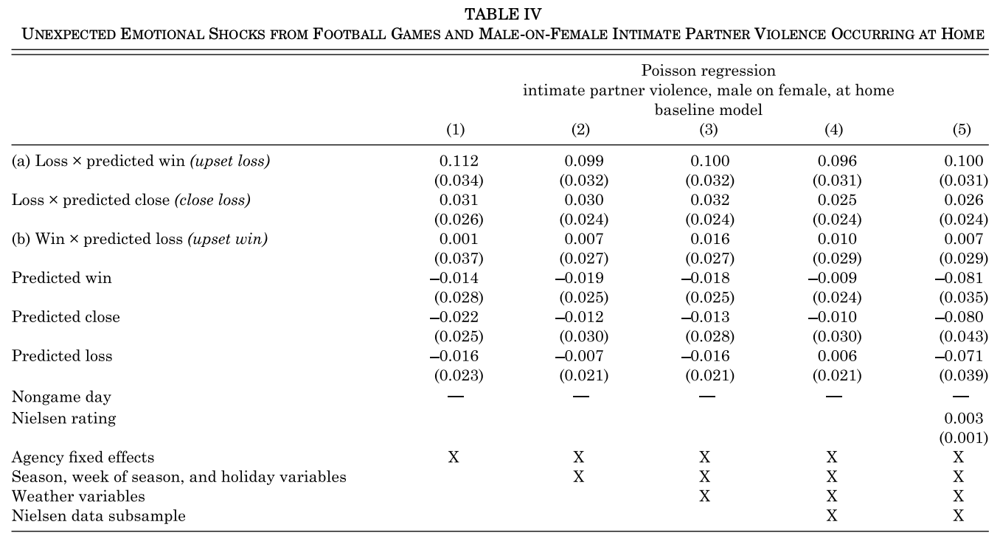
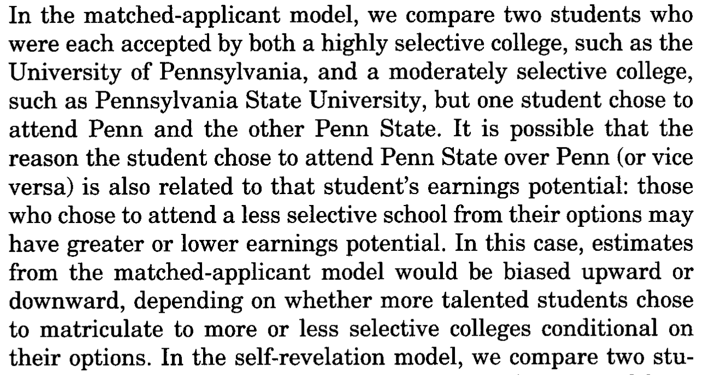
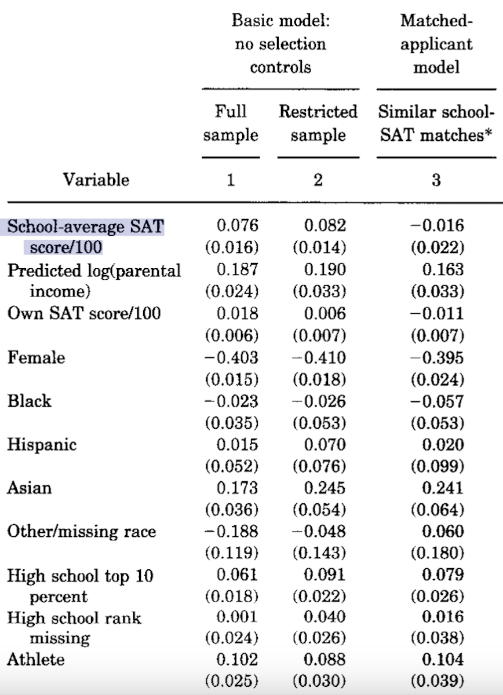

```{r setup, include = FALSE}
library(RefManageR)
library(knitr)
library(ggrepel) # Nicely placed labels in figures
library(modelr)  # add_residuals(): the Frisch-Waugh workflow

options(htmltools.preserve.raw = FALSE,
        htmltools.dir.version = FALSE, servr.interval = 0.5, width = 115, digits = 3)
knitr::opts_chunk$set(
  collapse = TRUE, message = FALSE, fig.retina = 3, error = TRUE,
  warning = FALSE, cache = FALSE, fig.align = 'center',
  comment = "#", strip.white = TRUE, tidy = FALSE)

BibOptions(check.entries = FALSE,
           bib.style = "authoryear",
           style = "markdown",
           hyperlink = FALSE,
           no.print.fields = c("doi", "url", "ISSN", "urldate", "language", "note", "isbn", "volume"))
myBib <- ReadBib("../Stats_II.bib", check = FALSE)
```

## By the end of today you can … {.inverse background-color="#901A1E"}

1. tell a **confounder** from a **mediator** on a causal diagram — and know that you *control* the first but usually *not* the second;

2. read a **multiple regression** coefficient as "holding the other variables constant" — and see *how* it does that (**Frisch–Waugh**);

3. use a **smart summary control** to stand in for confounders you cannot measure.

::: {.backgrnote}
One part per goal. Two running questions: the **gender pay gap** in Denmark, and — back to Lecture 2 — does **state ownership of the economy** reduce poverty?
:::

## Confounders vs. mediators {.inverse background-color="#901A1E"}

[Part 1 of 2]{.part-pill}

::: {.lead}
Adding a variable to a regression can *sharpen* a comparison — or quietly *ruin* it. The difference is the arrow's direction.
:::

## Two jobs for a control variable

```{tikz confmed-dag, echo = FALSE, out.width='29%', fig.align='center'}
\usetikzlibrary{shapes.geometric, arrows.meta, positioning}
\definecolor{kured}{HTML}{901A1E}
\definecolor{kublue}{HTML}{425570}
\begin{tikzpicture}[>=Latex, semithick]
\sffamily
\node[ellipse, draw, minimum width=1cm] (D) at (0,0) {$D$};
\node[ellipse, draw, minimum width=1cm] (Y) at (4,0) {$Y$};
\node[ellipse, draw=kured, thick] (C) at (2,1.7) {$C$};
\node[ellipse, draw=kublue, thick] (M) at (2,-1.7) {$M$};
\draw[->] (D) -- (Y);
\draw[->, kured] (C) -- (D);
\draw[->, kured] (C) -- (Y);
\draw[->, kublue] (D) -- (M);
\draw[->, kublue] (M) -- (Y);
\end{tikzpicture}
```

::: {.push-left}
::: {.content-box-red}
**Confounder** $C$ (red) — sits on a **backdoor path**: an arrow runs *into* the treatment $D$ *and* into the outcome $Y$.

$\rightarrow$ **Control it.** Multiple OLS blocks the backdoor and makes the comparison fairer.
:::
:::

::: {.push-right}
::: {.content-box-blue}
**Mediator** $M$ (blue) — sits on the **causal path** $D \rightarrow M \rightarrow Y$: an arrow runs *out of* the treatment.

$\rightarrow$ **Usually leave it in.** Controlling a mediator removes *part of the very effect you want*.
:::
:::

## Why the direction matters

::: {.content-box-red}
To get closer to the overall causal effect $D \rightarrow Y$, **control observed confounders** — but **never control a mediator**: you would throw away the part of the effect that runs through it.
:::

::: {.content-box-blue}
The exception is deliberate: sometimes we *want* the **partial effect** of $D$ that does **not** run through $M$ — then controlling $M$ is exactly the point. Know which question you are asking.
:::

## A clear case of mediation

::: {.panel-tabset}

### The question
::: {.left-column}
Danish women earn less per month than Danish men. **How much of that gap is because women more often work *fewer contracted hours*?**

Work hours is a **mediator**: gender shapes hours, and hours shape pay.
:::

::: {.right-column}
```{tikz gender-dag, echo = FALSE, out.width='86%'}
\usetikzlibrary{shapes.geometric, arrows.meta, positioning}
\definecolor{kured}{HTML}{901A1E}
\begin{tikzpicture}[>=Latex, semithick]
\sffamily
\node[ellipse, draw] (G) at (0,0) {Gender};
\node[ellipse, draw, gray] (H) at (3,-1.6) {Work hours};
\node[ellipse, draw] (W) at (6,0) {Gross wage};
\draw[->, kured, very thick] (G) -- node[above]{direct} (W);
\draw[->, gray] (G) -- (H);
\draw[->, gray] (H) -- (W);
\end{tikzpicture}
```
:::

### The data
```{r ess-data}
pacman::p_load(tidyverse, haven, estimatr, modelsummary)

# ESS round 9, Denmark. Monthly gross wage, gender, contracted work hours.
ESS <- read_spss("../assets/ESS9e03_1.sav") %>%
  filter(cntry == "DK") %>%
  select(pspwght, gndr, wkhct, grspnum, infqbst) %>%
  mutate(
    across(c(pspwght, wkhct, grspnum), zap_labels),
    gndr   = as_factor(gndr),
    grwage = case_when(          # Put everyone on a monthly basis
      infqbst == 1 ~ 4 * grspnum,   # weekly  -> monthly
      infqbst == 3 ~ grspnum / 12,  # yearly  -> monthly
      TRUE         ~ grspnum        # already monthly
    )
  ) %>%
  filter(wkhct > 0) %>%
  drop_na()
```

### The models
```{r ess-mods, results = 'hide'}
mod1 <- lm_robust(grwage ~ gndr,         data = ESS, weights = pspwght)
mod2 <- lm_robust(grwage ~ gndr + wkhct, data = ESS, weights = pspwght)

modelsummary(
  list("Gross wage" = mod1, "Gross wage" = mod2),
  coef_rename = c("gndrFemale" = "Female", "wkhct" = "Weekly hours"),
  stars = TRUE, gof_map = c("nobs", "r.squared"),
  output = "kableExtra"
)
```

### The verdict
```{r ess-tab, ref.label = "ess-mods", echo = FALSE, results = 'asis'}
```

```{r ess-share, echo = FALSE}
share <- round((1 - coef(mod2)["gndrFemale"] / coef(mod1)["gndrFemale"]) * 100)
```

::: {.content-box-green}
The raw gap of **`r format(round(-coef(mod1)["gndrFemale"]), big.mark = ",")` kr./month** shrinks to **`r format(round(-coef(mod2)["gndrFemale"]), big.mark = ",")` kr.** once we hold work hours constant: about **`r share`%** of the gender pay gap runs *through* fewer contracted hours. The rest does not — and controlling hours would hide it.
:::

:::

## An *unclear* case — back to Lecture 2

::: {.left-column}
In Lecture 2 we asked: do **state-owned (socialist) economies** reduce poverty? Descriptively — no. But they also offer **fewer civil liberties**, and civil liberties themselves predict *less* poverty.

::: {.content-box-blue}
**Discuss:** are **civil liberties** a **confounder** or a **mediator** of the state ownership → poverty relationship? Should we control for them?
:::
:::

::: {.right-column}
```{tikz triangle-dag, echo = FALSE, out.width='90%'}
\usetikzlibrary{shapes.geometric, arrows.meta, positioning}
\definecolor{kured}{HTML}{901A1E}
\begin{tikzpicture}[>=Latex, semithick]
\sffamily
\node[ellipse, draw, align=center] (S) at (0,0) {State\\ownership};
\node[ellipse, draw, gray, align=center] (F) at (3,2.4) {Civil\\liberties};
\node[ellipse, draw, align=center] (P) at (6,0) {Poverty};
\draw[->, kured, very thick] (S) -- (P);
\draw[<->, gray, dashed] (S) -- (F);
\draw[->, gray, dashed] (F) -- (P);
\end{tikzpicture}
```

::: {.backgrnote}
The double-headed dashed arrow is the honest part: with cross-country data we cannot be sure whether fewer civil liberties *cause* state ownership or the reverse.
:::
:::

## The revised research question {.inverse background-color="#901A1E"}

::: {.lead}
Would state-owned economies reduce poverty *more* — **if they did not also curb their citizens' civil liberties?**
:::

That is the **partial effect** of state ownership that does **not** run through civil liberties. Multiple OLS can estimate it.

## Preparation

::: {.panel-tabset}

### Packages
```{r libs}
pacman::p_load(
  tidyverse,    # Data manipulation and visualization
  wbstats,      # World Bank data via API
  vdemdata,     # Varieties of Democracy (V-Dem) data
  estimatr,     # OLS with robust standard errors
  modelsummary  # Regression tables
)
```

### Get & join the data
```{r tri-data}
# V-Dem: civil liberties (equality before the law and individual liberty) and state ownership
Dat_vdem <- vdem %>%
  as_tibble() %>%
  select(country_text_id, year,
         civ_liberties = v2xcl_rol,
         state_own_raw   = v2clstown) %>%
  mutate(state_ownership = -state_own_raw) # Reverse: higher = MORE state ownership

# World Bank: extreme poverty (< $3.00 a day). Live, with cached fallback.
Dat_poverty <- tryCatch(
  wb_data("SI.POV.DDAY", start_date = 1972, end_date = 2025),
  error = function(e) readRDS("data/wb_poverty_raw.rds")
) %>%
  rename(poverty = SI.POV.DDAY, year = date, country_text_id = iso3c) %>%
  select(country_text_id, year, country, poverty) %>%
  drop_na(poverty) %>%
  group_by(country) %>% filter(year == max(year)) %>% ungroup()

(Dat <- inner_join(Dat_poverty, Dat_vdem,
                   by = c("country_text_id", "year")) %>%
   drop_na(poverty, state_ownership, civ_liberties))
```

:::

## Multiple OLS: one control changes everything

::: {.push-left}
```{r tri-mods, results = 'hide'}
# Bivariate: state ownership only
ols <- lm_robust(poverty ~ state_ownership, data = Dat)

# Multiple: add civil liberties
ols_mult <- lm_robust(
  poverty ~ state_ownership + civ_liberties,
  data = Dat
)

modelsummary(
  list("Poverty" = ols, "Poverty" = ols_mult),
  coef_rename = c("state_ownership" = "State ownership",
                  "civ_liberties" = "Civil liberties"),
  stars = TRUE, gof_map = c("nobs", "r.squared"),
  output = "kableExtra"
)
```
:::

::: {.push-right}
::: {.small}
```{r ref.label = "tri-mods", echo = FALSE, results = 'asis'}
```
:::

::: {.content-box-red .fragment}
On its own, state ownership looks *harmless*. **Holding civil liberties constant, its sign flips** — among countries with the same civil liberties, more state ownership goes with *less* poverty. Civil liberties were masking it.
:::
:::

## What does "holding constant" actually do? {.inverse background-color="#901A1E"}

::: {.lead}
`r Citet(myBib, "frisch_partial_1933")` showed that "controlling for" a variable is exactly a **three-step residualisation** — regression by subtraction.
:::

## Frisch–Waugh, step 1

::: {.push-left}
**Regress the outcome on the control, keep the residuals** — the part of poverty that civil liberties do *not* explain.

```{r fw1}
Dat <- Dat %>%
  add_residuals(
    model = lm(poverty ~ civ_liberties, data = .),
    var   = "e_poverty"
  )
```
:::

::: {.push-right}
```{r fw1-plot, echo = FALSE, out.width='88%', fig.height = 4.2, fig.width = 6}
Dat %>%
  mutate(pred = poverty - e_poverty) %>%
  ggplot(aes(x = civ_liberties, y = poverty)) +
  geom_linerange(aes(ymin = pred, ymax = poverty),
                 color = "#901A1E", alpha = 0.5) +
  geom_smooth(method = "lm", se = FALSE, color = "#425570") +
  geom_point(alpha = 0.5) +
  labs(x = "Civil liberties",
       y = "% below $3.00 a day") +
  theme_minimal(base_size = 14)
```
:::

## Frisch–Waugh, step 2

::: {.push-left}
**Regress the treatment on the control, keep the residuals** — the part of state ownership that civil liberties do *not* explain.

```{r fw2}
Dat <- Dat %>%
  add_residuals(
    model = lm(state_ownership ~ civ_liberties, data = .),
    var   = "e_stateown"
  )
```
:::

::: {.push-right}
```{r fw2-plot, echo = FALSE, out.width='88%', fig.height = 4.2, fig.width = 6}
Dat %>%
  mutate(pred = state_ownership - e_stateown) %>%
  ggplot(aes(x = civ_liberties, y = state_ownership)) +
  geom_linerange(aes(ymin = pred, ymax = state_ownership),
                 color = "#901A1E", alpha = 0.5) +
  geom_smooth(method = "lm", se = FALSE, color = "#425570") +
  geom_point(alpha = 0.5) +
  labs(x = "Civil liberties",
       y = "State ownership of the economy") +
  theme_minimal(base_size = 14)
```
:::

## Frisch–Waugh, step 3

::: {.push-left}
**Regress the two sets of residuals on each other.** Its slope is *identical* to the multiple-regression coefficient.

```{r fw3, results = 'hide'}
ols_resid <- lm_robust(e_poverty ~ e_stateown, data = Dat)

modelsummary(
  list("Multiple OLS" = ols_mult,
       "Residualised" = ols_resid),
  coef_rename = c("state_ownership" = "State ownership",
                  "civ_liberties" = "Civil liberties",
                  "e_stateown" = "State ownership (resid.)"),
  coef_omit = "(Intercept)",
  stars = TRUE, gof_map = c("nobs"),
  output = "kableExtra"
)
```
:::

::: {.push-right}
::: {.small}
```{r ref.label = "fw3", echo = FALSE, results = 'asis'}
```
:::

::: {.content-box-green}
Same number, two routes: the residualised slope on `e_stateown` equals the multiple model's `state_ownership` coefficient. That is all *controlling for civil liberties* does.
:::
:::

## Show the result

::: {.panel-tabset}

### Coefficient plot
```{r coefplot, echo = FALSE, out.width='62%', fig.height = 4, fig.width = 8}
ols_mult %>%
  tidy() %>%
  filter(term != "(Intercept)") %>%
  mutate(term = recode(term,
                       "state_ownership" = "State ownership",
                       "civ_liberties" = "Civil liberties")) %>%
  ggplot(aes(x = reorder(term, estimate), y = estimate)) +
  geom_hline(yintercept = 0, color = "#901A1E", lty = "dashed") +
  geom_pointrange(aes(ymin = conf.low, ymax = conf.high)) +
  coord_flip() +
  labs(x = "", y = "Estimated coefficient (percentage points of poverty)") +
  theme_minimal(base_size = 15)
```

### Predictions
```{r predplot, echo = FALSE, out.width='58%', fig.height = 4, fig.width = 7}
fict <- tibble(state_ownership = seq(-3, 3, 0.1),
               civ_liberties = mean(Dat$civ_liberties)) # control at its mean
fict <- predict(ols_mult, newdata = fict,
                interval = "confidence", level = 0.95)$fit %>%
  as_tibble() %>% bind_cols(fict, .)

ggplot(fict, aes(x = state_ownership, y = fit)) +
  geom_ribbon(aes(ymin = lwr, ymax = upr), alpha = 0.3) +
  geom_line(linewidth = 1) +
  labs(x = "State ownership of the economy\n(civil liberties held at their average)",
       y = "Predicted % below $3.00 a day") +
  theme_minimal(base_size = 14)
```

::: {.backgrnote}
To predict, set the **control to an informative constant** (here: average civil liberties), then vary the treatment.
:::

:::

## Break {.inverse background-color="#901A1E"}

<div class="ku-timer" data-min="15"></div>

## Your turn: exercise 1

::: {.left-column}
You practice multiple OLS on the **carbon divide** from Lecture 4: do regions differ in emissions *beyond* their wealth?

<div class="ku-timer" data-min="20"></div>
:::

::: {.right-column}
<iframe src='9-exercise1.html' width='100%' height='620' frameborder='0' scrolling='auto'></iframe>
:::

## Smart summary controls {.inverse background-color="#901A1E"}

[Part 2 of 2]{.part-pill}

::: {.lead}
"To control for a wide range of factors seems daunting: the possibilities are virtually infinite, and many characteristics are hard to quantify."
:::

::: {.backgrnote}
— `r Citet(myBib, "angrist_mastering_2014", after = ", p. 51")`
:::

## Football and domestic violence

::: {.left-column}
```{r, echo = FALSE, out.width='96%'}

```

::: {.content-box-blue}
**Discuss:** what confounds the effect of a team *losing* on domestic violence? (Team quality, the kind of fan, the kind of city …) How could a single variable stand in for all of them?
:::
:::

::: {.right-column}
```{tikz card-dag, echo = FALSE, out.width='82%'}
\usetikzlibrary{shapes.geometric, arrows.meta, positioning}
\definecolor{kured}{HTML}{901A1E}
\begin{tikzpicture}[>=Latex, semithick]
\sffamily
\node[ellipse, draw, gray, align=center] (C) at (0,2.2) {Team quality,\\fans, city … ($C$)};
\node[ellipse, draw, align=center] (S) at (0,0) {Point spread\\(betting market)};
\node[ellipse, draw, align=center] (L) at (3,-2) {Upset\\loss};
\node[ellipse, draw, align=center] (V) at (6,0) {Domestic\\violence};
\draw[->, gray, dashed] (C) -- (S);
\draw[->, gray, dashed] (C) to[bend left=20] (V);
\draw[->] (S) -- (L);
\draw[->, kured, very thick] (L) -- (V);
\end{tikzpicture}
```

::: {.backgrnote}
The **point spread** already prices in everything the market knows about both teams — one number that summarises a world of confounders `r Citep(myBib, "card_family_2011")`.
:::
:::

## Football and domestic violence

::: {.left-column}
By comparing games with the *same* pre-game point spread, `r Citet(myBib, "card_family_2011")` isolate the **emotional shock** of an **upset loss** — a loss when your team was *predicted to win*.

::: {.content-box-green}
An upset loss raises at-home male-on-female violence by about **10%** — and it barely moves as more controls are added (columns 1→5). The summary control did the work.
:::
:::

::: {.right-column}
```{r, echo = FALSE, out.width='100%'}

```

::: {.backgrnote .center}
*Source:* `r Citet(myBib, "card_family_2011")`
:::
:::

## Do selective universities pay off?

::: {.left-column}
Graduates of selective universities earn more. But the ambitious, well-connected, and able both **choose** selective universities **and** earn more anyway — a swarm of confounders ($C$).

::: {.content-box-blue}
**Discuss:** what single thing could summarise a student's ambition and ability *as the admissions system saw it*?
:::
:::

::: {.right-column}
```{tikz dk-dag, echo = FALSE, out.width='72%'}
\usetikzlibrary{shapes.geometric, arrows.meta, positioning}
\definecolor{kured}{HTML}{901A1E}
\begin{tikzpicture}[>=Latex, semithick]
\sffamily
\node[ellipse, draw, align=center] (U) at (0,0) {Selective\\university};
\node[ellipse, draw, gray, dashed, align=center] (C) at (0,2.6) {Ambition, ability,\\parental \$ … ($C$)};
\node[ellipse, draw, align=center] (Y) at (5,0) {Earnings};
\draw[->, kured, very thick] (U) -- node[above]{?} (Y);
\draw[->, gray, dashed] (C) -- (U);
\draw[->, gray, dashed] (C) to[bend left=18] (Y);
\end{tikzpicture}
```
:::

## The smart summary control: where you applied

::: {.push-left}
`r Citet(myBib, "dale_estimating_2002")` compare students who **applied to and were admitted to the same set of schools** — then some went to the more selective one, some did not.

Sharing an application portfolio is a **summary** of ambition and ability *as the system measured it*: a stand-in for the confounders no survey captures.
:::

::: {.push-right}
```{r, echo = FALSE, out.width='86%'}

```

::: {.backgrnote .center}
*Source:* `r Citet(myBib, "dale_estimating_2002")`
:::
:::

## The premium disappears

::: {.push-left}
```{r, echo = FALSE, out.width='64%'}

```
:::

::: {.push-right}
Without selection controls, each **+100 points** of school-average SAT buys about **+7.6%** earnings.

::: {.content-box-green}
Among **matched applicants**, the effect collapses to **−0.016 ≈ 0**. The "selectivity premium" was mostly *who chose selective schools*, not the schools themselves.
:::

::: {.backgrnote .center}
*Source:* `r Citet(myBib, "dale_estimating_2002")`
:::
:::

## No Harvard premium → no KU premium {.inverse background-color="#901A1E"}

::: {.lead}
If a selective *US* university barely raises earnings once you compare like with like, a selective *Danish* one probably doesn't either.
:::

$\rightarrow$ Your KU degree pays off **because you are able and put in the work** — the diploma mostly *reflects* that, it does not manufacture it.

## Break {.inverse background-color="#901A1E"}

<div class="ku-timer" data-min="10"></div>

## Your turn: exercise 2

::: {.left-column}
You visualise the adjustment: a **before/after coefficient plot** and **model predictions** — again on the carbon divide.

<div class="ku-timer" data-min="20"></div>
:::

::: {.right-column}
<iframe src='9-exercise2.html' width='100%' height='620' frameborder='0' scrolling='auto'></iframe>
:::

## Today's general lessons {.inverse background-color="#901A1E"}

1. A **confounder** opens a backdoor path (arrow *into* the treatment) — **control it**. A **mediator** lies on the causal path (arrow *out of* the treatment) — **usually don't**, or you delete part of the effect.

2. Adding a control can move a coefficient a lot — even **flip its sign** (state ownership & poverty). Always ask *why* a variable belongs in the model.

3. **Frisch–Waugh:** "controlling for $C$" = residualise $Y$ on $C$, residualise $D$ on $C$, regress the residuals. Same number, clearer intuition.

4. When confounders are unmeasurable, a **smart summary control** — a point spread, a shared application portfolio — can stand in for many of them at once.

5. Multiple OLS **improves** comparisons; only a real experiment *guarantees* them.

## Check yourself: today's goals

::: {.checklist}
- Point to the confounder and the mediator on a DAG, and say which you would put in the regression — and why.
- Explain, in the three Frisch–Waugh steps, what "holding civil liberties constant" does to the state ownership coefficient.
- Give one example of a *smart summary control* and the confounders it stands in for.
:::

::: {.content-box-green}
Shaky on any of these? That is what this week's **Absalon quiz** and the **Friday exercise class** are for.
:::

## Today's important functions

::: {.small}
- `lm_robust(y ~ d + c, ...)`: multiple OLS — the coefficient on `d` holds `c` constant.
- `modelr::add_residuals(model = ..., var = ...)`: keep a model's residuals (the Frisch–Waugh workflow).
- `tidy()` + `geom_pointrange()` + `coord_flip()`: the coefficient plot.
- `predict(model, newdata = ..., interval = "confidence")`: predictions — set controls to an informative constant.
- `modelsummary(list(...))`: put bivariate and multiple models side by side.
:::

## References

::: {.small}
```{r ref, results = 'asis', echo = FALSE}
PrintBibliography(myBib)
```
:::

```{=html}
<script>
(function () {
  function fmt(s) { var m = Math.floor(s / 60), ss = s % 60; return m + ":" + (ss < 10 ? "0" : "") + ss; }
  function build(el) {
    var total = (parseInt(el.getAttribute("data-min"), 10) || 5) * 60, rem = total, id = null;
    el.innerHTML =
      '<div class="kt-display">' + fmt(rem) + '</div>' +
      '<div class="kt-btns">' +
        '<button class="kt-start" type="button">Start</button>' +
        '<button class="kt-pause" type="button">Pause</button>' +
        '<button class="kt-reset" type="button">Reset</button>' +
      '</div>';
    var disp = el.querySelector(".kt-display");
    function render() { disp.textContent = fmt(rem); el.classList.toggle("kt-done", rem <= 0); }
    function start() { if (id) return; id = setInterval(function () { if (rem > 0) { rem--; render(); } else { stop(); } }, 1000); }
    function stop() { clearInterval(id); id = null; }
    function reset() { stop(); rem = total; render(); }
    el.querySelector(".kt-start").onclick = start;
    el.querySelector(".kt-pause").onclick = stop;
    el.querySelector(".kt-reset").onclick = reset;
    el._start = start; el._reset = reset; render();
  }
  function init() {
    document.querySelectorAll(".ku-timer").forEach(build);
    if (window.Reveal && Reveal.on) {
      Reveal.on("slidechanged", function (e) {
        document.querySelectorAll(".ku-timer").forEach(function (t) { if (t._reset) t._reset(); });
        var here = e.currentSlide ? e.currentSlide.querySelectorAll(".ku-timer") : [];
        here.forEach(function (t) { if (t._start) setTimeout(t._start, 250); });
      });
    }
  }
  if (document.readyState !== "loading") init();
  else document.addEventListener("DOMContentLoaded", init);
})();
</script>
```
