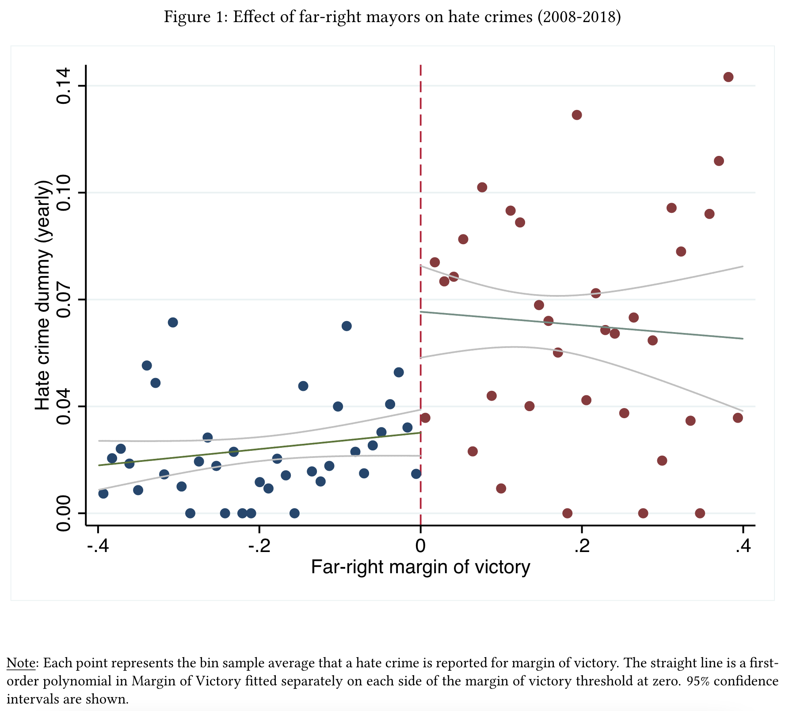

```{r setup, include = FALSE}
library(RefManageR)
library(knitr)
library(ggrepel) # Nicely placed labels in figures.
library(modelr)
library(webexercises) # Small web-based answer scales.
library(equatiomatic) # Regression equations from model objects.

options(htmltools.preserve.raw = FALSE,
        htmltools.dir.version = FALSE, servr.interval = 0.5, width = 115, digits = 3)
knitr::opts_chunk$set(
  collapse = TRUE, message = FALSE, fig.retina = 3, error = TRUE,
  warning = FALSE, cache = FALSE, fig.align = 'center',
  comment = "#", strip.white = TRUE, tidy = FALSE)

BibOptions(check.entries = FALSE, 
           bib.style = "authoryear", 
           style = "markdown",
           hyperlink = FALSE,
           no.print.fields = c("doi", "url", "ISSN", "urldate", "language", "note", "isbn", "volume"))
myBib <- ReadBib("./../../../Stats_II.bib", check = FALSE)

xaringanExtra::use_xaringan_extra(c("tile_view", "tachyons"))
xaringanExtra::use_panelset()
```

# 4 Types of research questions

.push-left[
- **Ontological**: What is the nature of X?
  + What is power?
  + What is gender; how is it different from race?
  + What defines a state? .backgrnote[
> A human community that (successfully) claims the monopoly of the legitimate use of physical force within a given territory

> --- Max Weber, “Politics as a Vocation” 1918]


- **Critical**: Is X (un-)just?
  + Is home office exploitation?
  + Is color-blind ideology a new form of racism?
]

--

.push-right[
- **Descriptive**: What is the case?
  + What are the survival strategies of the poor?
  + How did Danes structure their days during the COVID-19 lockdowns?


- **Explanatory**: Why is X the case?
  - Why does the suicide rate vary across societies?
  - How does capitalism affect human beings?
  - How does urbanization change our psyche?
  - Why do people obey power?
  - How does a state gain legitimacy over the use of physical force? 
]

--

.content-box-green[
.center[
What are you interested in?
]]

---
# 4 Types of research questions

.push-left[
- **Ontological**: What is the nature of X?
  + What is power?
  + What is gender; how is it different from race?
  + What defines a state? .backgrnote[
> A human community that (successfully) claims the monopoly of the legitimate use of physical force within a given territory

> --- Max Weber, “Politics as a Vocation” 1918]


- **Critical**: Is X (un-)just?
  + Is home office exploitation?
  + Is color-blind ideology a new form of racism?
]

.push-right[
- **Descriptive**: What is the case?
  + What are the survival strategies of the poor?
  + How did Danes structure their days during the COVID-19 lockdowns?


.content-box-red[
- **Explanatory**: Why is X the case?
  - Why does the suicide rate vary across societies?
  - How does capitalism affect human beings?
  - How does urbanization change our psyche?
  - Why do people obey power?
  - How does a state gain legitimacy over the use of physical force? 
]]

---
# The goal of social science research

.font140[.center[.alert[Use data to discover patterns ("social facts" in Durkheim's terms), <br> and the **social mechanisms that bring them about**.]]]

```{r, echo = FALSE, out.width='70%', fig.align='center'}
knitr::include_graphics('https://liu.se/-/media/istock-501261958.jpg?mw=1120&mh=1120&hash=DA8977CCE6A6E600AE80A40CFEE771C9')
```

---
# 4 statistical techniques

.push-left[
```{tikz, DAG1,  echo = FALSE, out.width='50%'}
\usetikzlibrary{shapes,decorations,arrows,calc,arrows.meta,fit,positioning}
\tikzset{
    -Latex,auto,node distance =1 cm and 1 cm,semithick,
    state/.style ={ellipse, draw, minimum width = 0.7 cm},
    point/.style = {circle, draw, inner sep=0.04cm,fill,node contents={}},
    bidirected/.style={Latex-Latex,dashed},
    el/.style = {inner sep=2pt, align=left, sloped}
}

\begin{tikzpicture}
\sffamily
    \node[state] (1) at (0,0) {$C$};
    \node[state] (2) [below = of 1] {$X$};
    \node[state] (3) [right = of 2] {$Y$};

    \path (1) edge  (2);
    % \path[bidirected] (2) edge[red, bend right=50] (3);
    \path (1) edge (3);
\end{tikzpicture}
```
]
RCT

IV

.push-right[
```{r, echo = FALSE, out.width='50%', fig.align='center'}

```
]

---
# 1 Randomized controlled trials (RCT)

---
# 2 Multiple regression

.push-left[
```{tikz, ref.label = "DAG1",  echo = FALSE, out.width='40%'}
```
.backgrnote[
The red bi-directed arrow is officially not part of the DAG, but helps you see that the correlation between $X$ and $Y$ is spurious because of $C$.
]]

---
# 2 Multiple regression

.push-left[
```{tikz, DAG2,  echo = FALSE, out.width='100%'}
\usetikzlibrary{shapes,decorations,arrows,calc,arrows.meta,fit,positioning}
\tikzset{
    -Latex,auto,node distance =1 cm and 1 cm,semithick,
    state/.style ={ellipse, draw, minimum width = 0.7 cm},
    point/.style = {circle, draw, inner sep=0.04cm,fill,node contents={}},
    bidirected/.style={Latex-Latex,dashed},
    el/.style = {inner sep=2pt, align=left, sloped}
}

\begin{tikzpicture}
\sffamily
    \node[state] (1) at (0,0) {Poor team};
    \node[state] (2) at (2,0) {C?};
    \node[state] (3) [below = of 1] {Sports bet};
    \node[state] (4) [below = of 3] {Lost football game};
    \node[state] (5) [right = of 4] {Domestic violence};

    \path (1) edge  (3);
    \path (2) edge  (3);
    \path (3) edge  (4);
    \path (4) edge (5);
    \path (1) edge (5);
    \path (2) edge (5);
\end{tikzpicture}
```

.backgrnote[
The red bi-directed arrow is officially not part of the DAG, but helps you see that the correlation between read news and perceived discrimination is biased because immigrant minorities who obtained German citizenship read news more often than those who are foreign citizens.]

```{r, echo = FALSE, out.width='60%', fig.align='center'}
knitr::include_graphics('https://wpr-public.s3.amazonaws.com/wprorg/styles/facebook/s3/field/image/ap20296067506098.jpg?itok=hZu82HBq')
```

]

--

.push-right[
```{r, echo = FALSE, out.width='100%', fig.align='center'}
knitr::include_graphics('./img/Card_n_Dahl.png')
```
.backgrnote[.center[*Source:* `r Citet(myBib, "polack_safety_2020")`]]
]

---
# 3 Instrument variable regression


---
# 4 Regression discontinuity design

.push-left[
.center[Municipalities where far-right candidates *ran*
versus where they *won*]
```{r, echo = FALSE, out.width='100%', fig.align='center'}
knitr::include_graphics('./img/Map_Italy.png')
```
]

.push-right[
```{r, echo = FALSE, out.width='100%', fig.align='center'}

```
.backgrnote[.center[*Source:* `r Citet(myBib, "polack_safety_2020")`]]
]

---
class: inverse
# Today's general lessons

1. R allows you to easily download tons of interesting data.
2. You can combine (i.e., join/merge) data than contain (at least party) the same observations, if they have some variables in common that uniquely identify them. This allows for a lot of fascinating analyses and great term papers!
3. Always make a scatter plot of the variables you want to correlate.
4. Z-standardization helps interpretation and gives a common unit to different variables.
5. The correlation coefficient is an easy to understand statistic of a (undirected) association between two variables.
6. As a linear model, regression expresses on outcome variable as a linear function of a predictor. It thus estimates a directed relation. 
7. $\beta$ the slope, tells us how average levels of $\hat{y}$ chnage with a unit increase in $x$. 
8. OLS finds the linear model that best fits the data.
9. Regression should under normal circumstances not be interpreted in causal terms.
10. Categorical predictors are (typically) dummy coded and then tel us the average difference in the outcome between a category to the reference group.
11. We should make sure that the correlations and regressions we estimate actually capture aprrox. linear relationships and that they are not driven by outliers.

---
# References