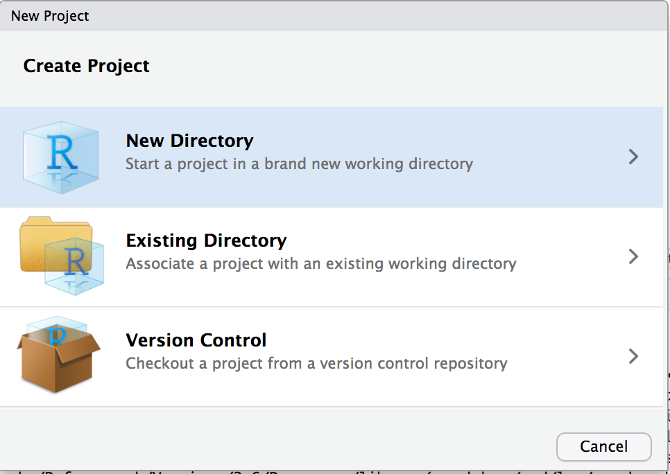
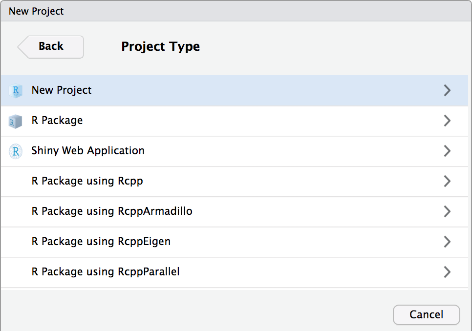
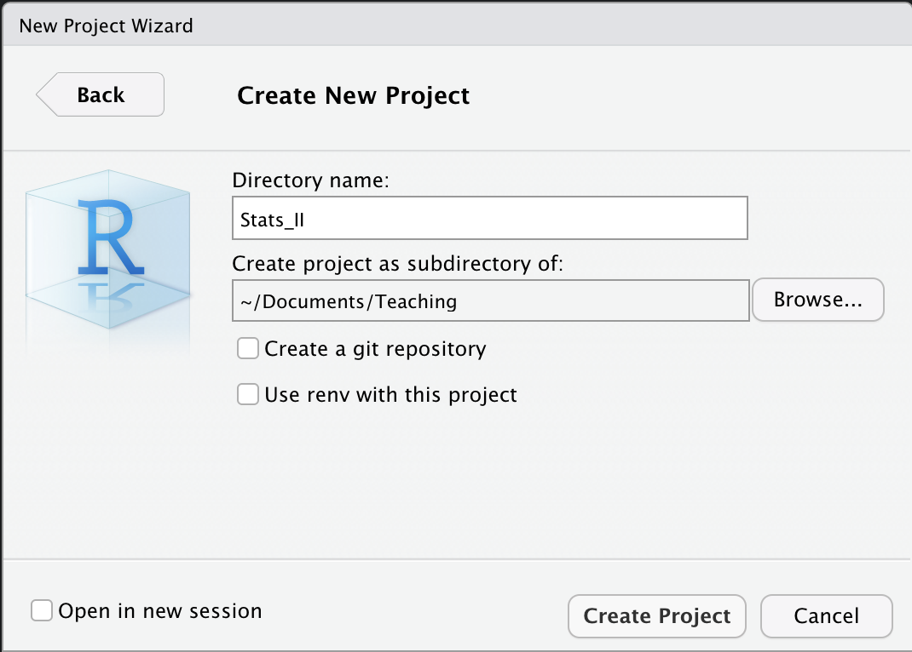
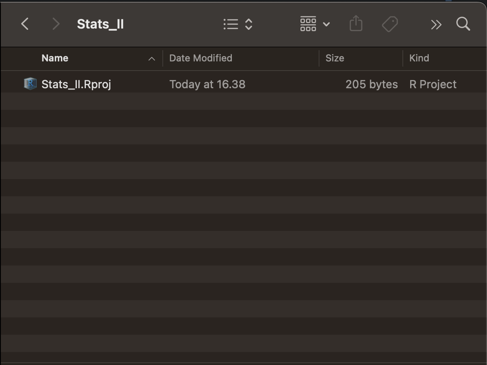

```{r setup, include = FALSE}
library(RefManageR)
library(knitr)
library(ggrepel) # Nicely placed labels in figures.
library(modelr)
library(webexercises) # Small web-based answer scales.
library(equatiomatic) # Regression equations from model objects.

options(htmltools.preserve.raw = FALSE,
        htmltools.dir.version = FALSE, servr.interval = 0.5, width = 115, digits = 3)
knitr::opts_chunk$set(
  collapse = TRUE, message = FALSE, fig.retina = 3, error = TRUE,
  warning = FALSE, cache = FALSE, fig.align = 'center',
  comment = "#", strip.white = TRUE, tidy = FALSE)

BibOptions(check.entries = FALSE, 
           bib.style = "authoryear", 
           style = "markdown",
           hyperlink = FALSE,
           no.print.fields = c("doi", "url", "ISSN", "urldate", "language", "note", "isbn", "volume"))
myBib <- ReadBib("./../../../Stats_II.bib", check = FALSE)

xaringanExtra::use_xaringan_extra(c("tile_view", "tachyons"))
xaringanExtra::use_panelset()
```


```{r, echo = FALSE, out.width='70%', fig.align='center'}
knitr::include_graphics('https://d33wubrfki0l68.cloudfront.net/8a64bb047429d7ae0e2acae35c40e421e6439bf6/80e5d/diagrams/rstudio-editor.png')
```

---
# Set R Studio preferences

.left-column[
Set these preferences to improve *reproducibility*!
  + $\rightarrow$ RStudio/Preferences
]

.right-column[
```{r, echo = FALSE, out.width='70%', fig.align='center'}
knitr::include_graphics('https://d33wubrfki0l68.cloudfront.net/7fa44a5471d40025344176ede4169c5ad3159482/1577f/screenshots/rstudio-workspace.png')
```
]

---
# R Studio workflow

.left-column[
1. Use **Projects** to manage all files (scripts, data, figures and tables) belonging to the same project.
2. Use the editor the write **R scripts**, so you can reproduce your results.
]

.right-column[
```{r, echo = FALSE, out.width='85%', fig.align='center'}
knitr::include_graphics('https://d33wubrfki0l68.cloudfront.net/8a64bb047429d7ae0e2acae35c40e421e6439bf6/80e5d/diagrams/rstudio-editor.png')
```
]

---
# Set up your "Stats_II" project

.left-column[
- Click on the Project button.
]

.right-column[
```{r, echo = FALSE, out.width='40%', fig.align='center'}

```
]

---
layout: true
# Set up your "Stats_II" project
.left-column[
- Set up a new project in R Studio. 
  + "New Directory"
  + "New Project"
  + Finally, a name for the folder and under "Browse" where you want that folder to be located.
  + **Done!** Now you should find an empty folder under the path your wanted it to be set up.
  + In the future, start RStudio by double clicking on the project icon in your folder.
]

---

.right-column[
```{r, echo = FALSE, out.width='90%', fig.align='center'}

```
]

---

.right-column[
```{r, echo = FALSE, out.width='90%', fig.align='center'}

```
]

---

.right-column[
```{r, echo = FALSE, out.width='90%', fig.align='center'}

```
]

---

.right-column[
```{r, echo = FALSE, out.width='90%', fig.align='center'}

```
]


---
layout: false
layout: true
# R Scripts
---

.left-column[
- Open a new R Script.
- Save it in your new folder.
  + Find it under "Files".
]

.right-column[
```{r, echo = FALSE, out.width='100%', fig.align='center'}
knitr::include_graphics('./img/Rscript1.png')
```
]

---

.left-column[
- Type the following lines.
- Save the file;
  - I called mine "Lecture.R".
- Mark all code and click "run".
]

.right-column[
```{r, echo = FALSE, out.width='100%', fig.align='center'}
knitr::include_graphics('./img/Rscript3.png')
```
]

---

.left-column[
OK, you are good to go! 

**Pro tip:** *Use the R Script to take notes during the lecture!*
]

.right-column[
```{r, echo = FALSE, out.width='100%', fig.align='center'}
knitr::include_graphics('./img/Rscript4.png')
```
]
