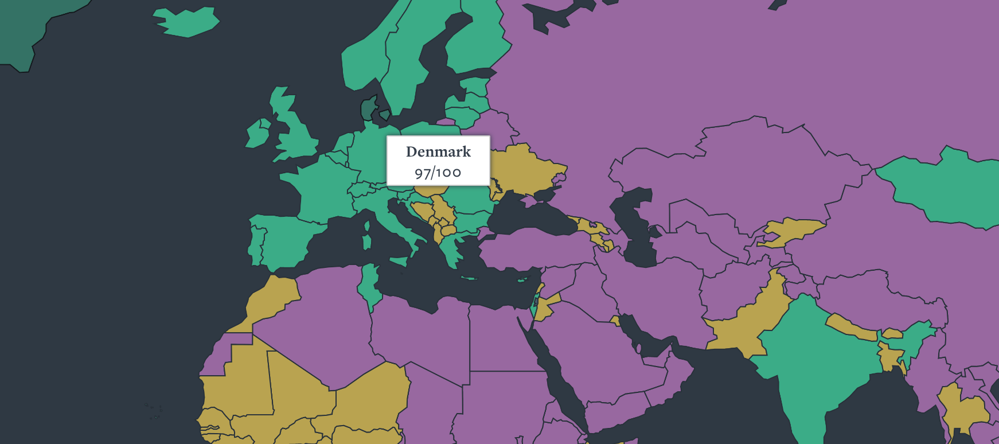

```{r setup, include = FALSE}
library(RefManageR)
library(knitr)
library(ggrepel) # Nicely placed labels in figures.
library(modelr)
library(webexercises) # Small web-based answer scales.
library(equatiomatic) # Regression equations from model objects.

options(htmltools.preserve.raw = FALSE,
        htmltools.dir.version = FALSE, servr.interval = 0.5, width = 115, digits = 3)
knitr::opts_chunk$set(
  collapse = TRUE, message = FALSE, fig.retina = 3, error = TRUE,
  warning = FALSE, cache = TRUE, fig.align = 'center',
  comment = "#", strip.white = TRUE, tidy = FALSE)

BibOptions(check.entries = FALSE, 
           bib.style = "authoryear", 
           style = "markdown",
           hyperlink = FALSE,
           no.print.fields = c("doi", "url", "ISSN", "urldate", "language", "note", "isbn", "volume"))
myBib <- ReadBib("./../../../Stats_II.bib", check = FALSE)

xaringanExtra::use_xaringan_extra(c("tile_view", "tachyons"))
xaringanExtra::use_panelset()
```

# The goal of social science research

.font140[.center[.alert[Use data to **discover patterns** ("social facts" in Durkheim's terms), <br> and the social mechanisms that bring them about.]]]

```{r, echo = FALSE, out.width='70%', fig.align='center'}
knitr::include_graphics('https://liu.se/-/media/istock-501261958.jpg?mw=1120&mh=1120&hash=DA8977CCE6A6E600AE80A40CFEE771C9')
```
---
class: inverse middle
# Today's schedule

1. **Application**: Socialism, citizenship rights, & poverty
  + Worldbank API
  + Freedom house API
  + Join/merge different data sources
  
2. **Scatter plots**

3. **Correlation**
  + Z-standardization
  + $r_{y,x}$
  
4. **OLS regression**
  + Estimation
  + Interpretation
  + Causal & descriptive interpretation.
  
---
# Remember? .font70[Citizenship across the world]

.right-column[
[Freedom House World Map 2021](https://freedomhouse.org/explore-the-map?type=fiw&year=2020)

```{r, echo = FALSE, out.width='100%'}

```
]

--

.left-column[
- Some of you criticized:<br><br> *But aren't socialist countries good at providing work and equality?*
]

---
class: inverse
# Research question of the day

.center[.font140[
**Is there a freedom-equality trade-off?**
]
.font110[
In other words:<br>
**Are socialist countries good at reducing poverty**,<br> potentially at the cost of offering less freedom?
]]

<br>
.push-left[
```{r, echo = FALSE, out.width='90%'}
knitr::include_graphics('https://miro.medium.com/max/1280/1*8Y_EPw2a67TRRos3b24YlA.jpeg')
```
]

.push-right[
```{r, echo = FALSE, out.width='96%'}
knitr::include_graphics('https://almayasabdam.com/wp-content/uploads/2020/09/1496441134_communists.png')
```
]

---
# Preparations

.panelset[
.panel[.panel-name[Packages for today's session]
```{r}
pacman::p_load(
  tidyverse, # Data manipulation,
  ggplot2, # beautiful figures,
  democracyData, # download democracy datasets used in the scholarly literature.
  wbstats, # download data from Worldbank. Tremendous source of global socio-economic data.
  texreg, # regression tables with nice layout,
  countrycode) # Easy recodings of country names.
```
]]

---
class: clear
# Freedom House Data .font70[on (civic and political) citizenship rights]

.panelset[
.panel[.panel-name[The data]

.left-column[
- Since 1972, Freedom House publishes an annual report on the the current state of civil and political rights around the world on a scale from 1 (most free) to 7 (least free). .backgrnote[
For more background, see [Wikipedia](https://en.wikipedia.org/wiki/Freedom_House) and my [lecture on citizenship rights](https://merlin-guest-lectures.netlify.app/2022/05/05/gep-citizenship-rights-for-immigrants/).
]

- We add civil and political rights and reverse the scale: higher values = more citizenship rights.
]

.right-column[
<iframe src='https://en.wikipedia.org/wiki/Freedom_House' width='1200' height='670' frameborder='0' scrolling='yes'></iframe>
]]
.panel[.panel-name[Get the data]
```{r}
(Dat_citi_rights <- download_fh(verbose = FALSE) %>% # Download Freedom House data for all countries since 1972, #<<
   rename(country = fh_country, # rename country ID,
          citizen_rights = fh_total_reversed, # rename Citizenship rights indicator,
          date = year) %>% # rename year,
   select(country, date, citizen_rights)) # Keep only these 3 variables.
```
]

.panel[.panel-name[Plot code] 
```{r citiz-world, fig.show = 'hide', echo = TRUE}
ggplot(data = Dat_citi_rights %>% filter(date == 2020), # Make coord system for data from 2020,
       aes(y = citizen_rights, # Y- and X-axis of plot,
           x = reorder(country, citizen_rights))) +
  geom_bar(stat = "identity") + # plot data as is in a bar chart,
  labs(y = "Citizenship rights", x = "") + # Axis labels,
  theme_minimal() + # Simple background layout,
  theme(axis.text.x = element_text(angle = 60, hjust = 1)) # Write country names in a 60 degree angle.
```
]
.panel[.panel-name[Citizenship rights in 2020 across the world]
```{r ref.label = "citiz-world", out.width='100%', fig.height = 8, fig.width = 20, results = FALSE, echo = FALSE}
```
]]

---
class: clear
# Worldbank Data .font70[On poverty across the World]

.panelset[
.panel[.panel-name[Searching Wb archive]
- With `wbstats::wb_search()`, you can search the Wb archive for any keyword! Here I use "poverty":
```{r}
(wb_poverty_archive <- wb_search("poverty")) #<<
```
]
.panel[.panel-name[Get Wb data]
```{r}
(Dat_poverty <- wb_data("SI.POV.UMIC", # Download poverty data: <5.50$ per day, #<<
                        start_date = 2002, end_date = 2022) %>% #<<
   rename(poverty = SI.POV.UMIC) %>% # rename poverty variable,
   select(country, date, poverty) %>% # Keep only 3 variables
   drop_na(poverty) %>% # Drop cases with missing data,
   group_by(country) %>% # Group by country,
   filter(date == max(date)) %>% # Keep the most recent data per country.
   ungroup())
```
]
.panel[.panel-name[Poverty across the world]
```{r poverty-world, out.width='100%', fig.height = 8, fig.width = 20, results = FALSE, echo = FALSE}
ggplot(data = Dat_poverty, # Make coord system for data,
       aes(y = poverty, # Y- and X-axis of plot,
           x = reorder(country, poverty))) +
  geom_bar(stat = "identity") + # plot data as is in a bar chart,
  labs(y = "% population with less than 5.50$ a day", x = "") + # Axis labels,
  theme_minimal() + # Simple background layout,
  theme(axis.text.x = element_text(angle = 60, hjust = 1)) # Write country names in a 60 degree angle.
```
]]

---
class: inverse
# 

.push-left[
<br>
<br>
<br>
<br>
OK great, now I have two tibbles. But how can I combine them into one single tibble?
]

.push-right[
```{r, echo = FALSE, out.width='96%'}
knitr::include_graphics('https://powietrze.malopolska.pl/wp-content/uploads/2020/10/q.jpg')
```
]

---
# Relational data

.left-column[
- If you work with multiple data frames, you work with relational data .alert[if they have one or more variable(s) in common].
]

.right-column[
```{r, echo = FALSE, out.width='100%'}
knitr::include_graphics('https://d33wubrfki0l68.cloudfront.net/245292d1ea724f6c3fd8a92063dcd7bfb9758d02/5751b/diagrams/relational-nycflights.png')
```
]

---
# Relational data

- Our two data frames are related, because both contain data for *countries* at various *dates*. Thus they contain (at least partly) the same observations. The combination of country and date are the **key** that allows us to relate both data frames.

.push-left[
```{r}
Dat_citi_rights
```
]

.push-right[
```{r}
Dat_poverty
```
]

---
# **Join**/merge .font60[four different types]

.push-left[
```{r, echo = FALSE, out.width='90%'}
knitr::include_graphics('https://raw.githubusercontent.com/gadenbuie/tidyexplain/master/images/inner-join.gif')
```
.center[.backgrnote[*Source*: [Tidy Animated Verbs](https://github.com/gadenbuie/tidyexplain)]]
]

--

.push-right[
```{r, echo = FALSE, out.width='90%'}
knitr::include_graphics('https://raw.githubusercontent.com/gadenbuie/tidyexplain/master/images/left-join.gif')
```
.center[.backgrnote[*Source*: [Tidy Animated Verbs](https://github.com/gadenbuie/tidyexplain)]]
]

---
# **Join**/merge .font60[four different types]

.push-left[
```{r, echo = FALSE, out.width='90%'}
knitr::include_graphics('https://raw.githubusercontent.com/gadenbuie/tidyexplain/master/images/right-join.gif')
```
.center[.backgrnote[*Source*: [Tidy Animated Verbs](https://github.com/gadenbuie/tidyexplain)]]
]

--

.push-right[
```{r, echo = FALSE, out.width='90%'}
knitr::include_graphics('https://raw.githubusercontent.com/gadenbuie/tidyexplain/master/images/full-join.gif')
```
.center[.backgrnote[*Source*: [Tidy Animated Verbs](https://github.com/gadenbuie/tidyexplain)]]
]

---
# Inner join/merge .font70[Poverty and citizenship rights]

```{r}
(Dat <- inner_join(Dat_poverty, Dat_citi_rights, by = c("country", "date"))) #<<
```

---
# Socialism .font70[We need to make our own index ...]

.panelset[
.panel[.panel-name[Socialist countries]
.left-column[
- Wikipedia has tables on self-declared socialist countries.
- I suggest a simple index:
  + Years socialist minus years since.
  + Min. 5 years given socialist history.
]

.right-column[
<iframe src='https://en.wikipedia.org/wiki/List_of_socialist_states' width='1200' height='670' frameborder='0' scrolling='yes'></iframe>
]]

.panel[.panel-name[Coding the index]
.font60[
```{r}
Dat <- Dat %>% mutate(socialist = case_when( # Years socialist minus years since,
  country == "China" ~ date - 1949,
  country == "Vietnam" ~ date - 1945,
  country == "Algeria" ~ date - 1962,
  grepl(country,"Portugal|Bangladesh") ~ date - 1972,
  country == "Guinea-Bissau" ~ date - 1973,
  country == "India" ~ date - 1976,
  country == "Nicaragua" ~ date - 1979,
  country == "Sri Lanka" ~ date - 1978,
  country == "Tanzania" ~ date - 1964,
  country == "Albania" ~ (1992 - 1944) - (date - 1992),
  grepl(country, "Angola|Cabo Verde|Madagascar") ~ (1992 - 1975) - (date - 1992),
  grepl(country,"Belarus|Bulgaria") ~ (1990 - 1946) - (date - 1990),
  grepl(country, "Benin|Mozambique") ~ (1990 - 1975) - (date - 1990),
  country == "Chad" ~ (1975 - 1962) - (date - 1975), country == "Congo, Rep." ~ (1992 - 1970) - (date - 1992),
  country == "Czech Republic" ~ (1990 - 1948) - (date - 1990), country == "Djibouti" ~ (1992 - 1981) - (date - 1992),
  country == "Ethiopia" ~ (1991 - 1974) - (date - 1991), country == "Ghana" ~ (1966 - 1960) - (date - 1966),
  country == "Guinea" ~ (1984 - 1958) - (date - 1984), country == "Hungary" ~ (1989 - 1949) - (date - 1989),
  country == "Iraq" ~ (2005 - 1958) - (date - 2005), country == "Mali" ~ (1991 - 1960) - (date - 1991),
  country == "Mauritania" ~ (1978 - 1961) - (date - 1978), country == "Mongolia" ~ (1992 - 1924) - (date - 1992),
  country == "Myanmar" ~ (1988 - 1962) - (date - 1988), country == "Poland" ~ (1989 - 1945) - (date - 1989),
  country == "Romania" ~ (1989 - 1947) - (date - 1989), country == "Russian Federation" ~ (1991 - 1922) - (date - 1991),
  country == "Seychelles" ~ (1991 - 1977) - (date - 1991), country == "Senegal" ~ (1981 - 1960) - (date - 1981),
  country == "Sierra Leone" ~ (1991 - 1978) - (date - 1991), country == "Somalia" ~ (1991 - 1969) - (date - 1991),
  country == "Sudan" ~ (1985 - 1969) - (date - 1985), country == "Syria" ~ (2012 - 1963) - (date - 2012),
  country == "Tunisia" ~ (1988 - 1964) - (date - 1988), country == "Ukraine" ~ (1991 - 1919) - (date - 1991),
  country == "Yemen, Rep." ~ (1991 - 1967) - (date - 1991), country == "Zambia" ~ (1991 - 1973) - (date - 1991),
  grepl(country,"Slovenia|Croatia|Serbia|Montenegro|Bosnia and Herzegovina|North Macedonia|Kosovo") ~ (1992 - 1943) - (date - 1992),
  TRUE ~ 0),
  socialist = case_when( # Min. 5 years given socialist history,
    (socialist < 5 & socialist > 0) | socialist < 0 ~ 5,
    TRUE ~ socialist)) %>% drop_na() # Drop countries with missing values.
```
]]
.panel[.panel-name[Resulting data] 
```{r}
Dat
```
]
.panel[.panel-name[Plot socialism years across the world]
```{r socialism-world, out.width='100%', fig.height = 8, fig.width = 20, results = FALSE, echo = FALSE}
ggplot(data = Dat, # Make coord system for data,
       aes(y = socialist, # Y- and X-axis of plot,
           x = reorder(country, socialist))) +
  geom_bar(stat = "identity") + # plot data as is in a bar chart,
  labs(y = "Our Socialism index", x = "") + # Axis labels,
  theme_minimal() + # Simple background layout,
  theme(axis.text.x = element_text(angle = 60, hjust = 1)) # Write country names in a 60 degree angle.
```
]]

---
class: inverse middle center
# Scatter plots


---
# Visual inspection

.left-column[
.content-box-blue[
.center[**4 questions for scatter plots**]
1. What is the direction of the 
relationship?
2. What form does the relation 
have?
3. How much spread is in the 
data?
4. Are there any outliers?
]]
.right-column[
```{r socialism-corr1, out.width='100%', fig.height = 5, fig.width = 7, results = FALSE, echo = FALSE}
ggplot(data = Dat, 
       aes(y = poverty, x = socialist, label = country)) +
  geom_text() +
  geom_label_repel(data = Dat %>% filter(country == "Denmark"), 
                   show.legend = FALSE, color = "#901A1E",
                   alpha = 0.8, segment.curvature = -0.1,
                   segment.ncp = 4, segment.angle = 10,
                   size = 5, box.padding = 1.5,
                   point.padding = 0.5, force = 100,
                   segment.size  = 1) +
  labs(y = "% population with less than 5.50$ a day", 
       x = "Our Socialism index") +
  theme_minimal()
```
]

---
class: inverse middle center
# Correlation

---
class: clear
# Z-standardization .font60[Giving two variables a comparable same unit]

.panelset[
.panel[.panel-name[What is it?]

.push-left[
$$z(x) = \frac{x - \bar{x}}{\text{SD}(x)}$$
- **We subtract the mean:** Values above 0 are above average, values below 0 are below average.
- **We divide by the standard deviation:** Our variable now has standard deviations as unit.<br><br> $\rightarrow$ Intuitive understanding how common vis-á-vis extreme cases are.
]

.push-right[
```{r, echo = FALSE, out.width='100%'}
knitr::include_graphics('https://www.native-instruments.com/fileadmin/userlib/images/7727639_4467.normal-light.png')
```
]
]
.panel[.panel-name[R Code]
```{r}
(Dat <- Dat %>%
   mutate( # Z-Standardize variables.
     z_socialist = scale(socialist) %>% as.numeric(), #<<
     z_poverty = scale(poverty) %>% as.numeric())) #<<
```
]
.panel[.panel-name[Illustration]
```{r, echo = FALSE, out.width='40%'}
knitr::include_graphics('img/Correlation.png')
```
.backgrnote[.center[
*Source*: `r Citet(myBib, "veaux_stats_2021", after = ", p.199")`
]]]
.panel[.panel-name[Figure]
```{r socialism-corr2, out.width='70%', fig.height = 4, fig.width = 7.5, results = FALSE, echo = FALSE}
socialism_corr2 <- Dat %>%
  mutate(
    color = case_when(
      (z_socialist < 0 & z_poverty > 0) | 
        (z_socialist > 0 & z_poverty < 0) ~ "-1",
      (z_socialist > 0 & z_poverty > 0) |
        (z_socialist < 0 & z_poverty < 0)~ "1")) %>%
  ggplot(aes(y = z_poverty, x = z_socialist)) +
  geom_text(aes(label = country, color = color)) +
  scale_color_manual(values = c("#901A1E", "#425570")) +
  geom_hline(yintercept = 0, color = "#ffbd38", lty = "longdash", size = 1) +
  geom_vline(xintercept = 0, color = "#ffbd38", lty = "longdash", size = 1) +
  labs(y = "% population with less than 5.50$ a day", 
       x = "Our socialism index") +
  theme_minimal() +
  guides(color = "none")

socialism_corr2
```
]]

---
class: inverse
# 

.push-left[
```{r, echo = FALSE, out.width='70%'}
knitr::include_graphics('https://thumbs.dreamstime.com/b/charakter-d-der-eine-lupe-h%C3%A4lt-und-ein-questio-kontrolliert-99243756.jpg')
```
]

.push-right[
<br>
<br>
<br>
<br>
OK but this remains rather approximate. I mean eye-balling is hardly enough to count as scientific evidence, is it?
]

---
# The correlation coefficient: $r_{y,x}$

.panelset[
.panel[.panel-name[What is it?]
.push-left[
```{r, echo = FALSE, out.width='80%'}
knitr::include_graphics('img/Correlation.png')
```
.backgrnote[.center[
*Source*: `r Citet(myBib, "veaux_stats_2021", after = ", p.199")`
]]]

.push-right[
.content-box-blue[
.center[**A precise statistic in three steps**]
1. $z_y*z_x$
  + positive for a green points, 0
for blue ones, and negative for red ones. Larger products contribute more to the relationship.
2. $\sum^{n}_{i=1}z_y*z_x$
  + Is the relationship overall positive or negative.
3. $r = \frac{\sum^{n}_{i=1}z_y*z_x}{n-1}$
  + We divide by $n - 1$, so that the resulting $r$ varies between -1 and 1.
]]]
.panel[.panel-name[Poverty & Socialism]
.left-column[
.content-box-green[.center[
How do we interpret this result?
]]]
.right-column[
```{r}
Dat %>% # Use our data,
  select(poverty, socialist) %>% # Select vars for analysis,
  cor() # Estimate correlation. #<<
```
]]]

---
class: inverse middle center
# Break

<iframe src='https://www.online-timer.net/' width='400' height='385' frameborder='0' scrolling='yes'></iframe>

---
class: middle clear

.left-column[
```{r, echo = FALSE, out.width='80%'}
knitr::include_graphics('https://www.laserfiche.com/wp-content/uploads/2014/10/femalecoder.jpg')
```

<iframe src='https://www.online-timer.net/' width='400' height='385' frameborder='0' scrolling='yes'></iframe>
]

.right-column[
<br>

<iframe src='exercise1.html' width='1000' height='600' frameborder='0' scrolling='yes'></iframe>
]

---
class: inverse middle center
# OLS regression

---
# Correlation = linear trend

.right-column[
```{r socialism-ols, out.width='100%', fig.height = 4, fig.width = 6, results = FALSE, echo = FALSE}
socialism_corr2 + 
  geom_smooth(method = "lm", se = FALSE)
```
]

.left-column[
- **How can we directly calculate that trend line?** <br><br> Then we could state how much of a reduction in poverty we would expect for every year increase of socialism.
]

---
# Models

.left-column[
- **A model** is an attempt to give a reduced and simplified representation of reality. <br><br>Our models should capture the general answer to our research question. .backgrnote[
Models should not be driven by few singular cases, like in this example.]
]

.right-column[
```{r ref.label = "socialism-ols", out.width='100%', fig.height = 4, fig.width = 6, results = FALSE, echo = FALSE}
```
]

---
# Linear models

.left-column[
.content-box-blue[
.center[**Linear models are defined by two parameters**]

$\color{orange}{\alpha}$ 'constant'/'intercept': The value of y at which the line intercepts the Y-axis $(\hat{Y}|X=0)$.
  
$\color{orange}{\beta}$ 'slope': How does $\hat{Y}$ change, if $X$ increases by one unit.
]]

.right-column[
```{r, echo = FALSE, out.width='100%'}
knitr::include_graphics('img/LinearModel.png')
```
]

---
# Regressing linear models from data

.panelset[
.panel[.panel-name[Residuals, e]
```{r results = FALSE, echo = FALSE}
mod <- Dat %>%
  lm(formula = poverty ~ socialist, data = .)

Dat_ols <- Dat %>% 
  add_residuals(model = mod) %>% 
  add_predictions(model = mod)
```

.left-column[
- **Residuals**, $e_{i} =y_{i} - \hat{y}$
  + the differences between what our model predicts and the actual data.

$e_{\text{Denmark}} = `r Dat_ols$poverty[Dat_ols$country == "Denmark"]`\% - `r round(Dat_ols$pred[Dat_ols$country == "Denmark"], 1)`\%=`r Dat_ols$poverty[Dat_ols$country == "Denmark"] - round(Dat_ols$pred[Dat_ols$country == "Denmark"], 1)`\%$
]
.right-column[
```{r residuals, out.width='100%', fig.height = 4, fig.width = 6.5, results = FALSE, echo = FALSE}
resid <- ggplot(data = Dat_ols, mapping = aes(y = poverty, x = socialist, label = country)) +
  geom_point() +
  geom_smooth(method = "lm", se = FALSE) +
  labs(y = "% population with less than 5.50$ a day", 
       x = "Our socialism index") +
  theme_minimal()

resid + 
  geom_linerange(data = Dat_ols %>% filter(country == "Denmark"), size = 1,
                 mapping = aes(ymin = pred, ymax = (resid + pred)), color = "#901A1E") +
  geom_point(data = Dat_ols %>% filter(country == "Denmark"), 
             color = "#ffbd38", size = 5, alpha = 0.6) +
  geom_point(data = Dat_ols %>% filter(country == "Denmark"), 
             aes(y = pred), color = "#425570", size = 5, alpha = 0.6) +
  geom_label_repel(data = Dat_ols %>% filter(country == "Denmark"), 
                   aes(y = pred, label = paste("Predicted poverty for ", country, ": ", round(pred, 1), "%", sep = "")),
                   show.legend = FALSE,
                   alpha = 0.8, segment.curvature = -0.1,
                   segment.ncp = 4, segment.angle = 10,
                   size = 3, box.padding = 1.5,
                   point.padding = 0.5, force = 100,
                   segment.size  = 0.3) +
  geom_label_repel(data = Dat_ols %>% filter(country == "Denmark"), 
                   aes(label = paste("Actual poverty in ", country, ": ", poverty, "%", sep = "")),
                   show.legend = FALSE,
                   alpha = 0.8, segment.curvature = -0.1,
                   segment.ncp = 4, segment.angle = 10,
                   size = 3, box.padding = 1.5,
                   point.padding = 0.5, force = 100,
                   segment.size  = 0.3)
```
]]

.panel[.panel-name[Minimize 1]

.left-column[
- **The _best_ fitting line**:
$$\begin{align*}
      \min \text{RSS} &= \min \sum_{i=1}^{n} e_{i}^{2} \\
      &= \min \sum_{i=1}^{n} y_{i} - \hat{y_{i}} \\
      &= \min \sum_{i=1}^{n} (y_{i} - (\color{orange}{\alpha} + \color{orange}{\beta} x_{i})^{2}
    \end{align*}$$
]

.right-column[
```{r min_resid, out.width='100%', fig.height = 4, fig.width = 6.5, results = FALSE, echo = FALSE}
resid + 
  geom_linerange(mapping = aes(ymin = pred, ymax = (resid + pred)), color = "#901A1E") +
  geom_label_repel(show.legend = FALSE,
                   alpha = 0.8, segment.curvature = -0.1,
                   segment.ncp = 4, segment.angle = 10,
                   size = 3, box.padding = 1.5,
                   point.padding = 0.5, force = 100,
                   segment.size  = 0.3)
```
]]

.panel[.panel-name[... 2]
.left-column[
- **The _best_ fitting line**:
$$\begin{align*}
      \min \text{RSS} &= \min \sum_{i=1}^{n} e_{i}^{2} \\
      &= \min \sum_{i=1}^{n} y_{i} - \hat{y_{i}} \\
      &= \min \sum_{i=1}^{n} (y_{i} - (\color{orange}{\alpha} + \color{orange}{\beta} x_{i})^{2}
    \end{align*}$$
]

.right-column[
<blockquote class="twitter-tweet"><p lang="es" dir="ltr">Tuve un ataque de artemanía es intenté replicar una recta de regresión. <a href="https://t.co/b7OXZrK26J">pic.twitter.com/b7OXZrK26J</a></p>&mdash; Jorge Pacheco Jara (@jorge_pacheco) <a href="https://twitter.com/jorge_pacheco/status/1327398681239314434?ref_src=twsrc%5Etfw">November 13, 2020</a></blockquote> <script async src="https://platform.twitter.com/widgets.js" charset="utf-8"></script>
]]

.panel[.panel-name[... 3]
.left-column[
- **The _best_ fitting line**:
$$\begin{align*}
      \min \text{RSS} &= \min \sum_{i=1}^{n} e_{i}^{2} \\
      &= \min \sum_{i=1}^{n} y_{i} - \hat{y_{i}} \\
      &= \min \sum_{i=1}^{n} (y_{i} - (\color{orange}{\alpha} + \color{orange}{\beta} x_{i})^{2}
    \end{align*}$$
]

.right-column[
```{r, echo = FALSE, out.width='50%'}
knitr::include_graphics('https://mlfromscratch.com/content/images/size/w2000/2020/06/linear_regression_gif.gif')
```
.backgrnote[.center[
*Source*: [Machine Learning From Scratch](https://mlfromscratch.com/linear-regression-from-scratch/#/)
]]]]

.panel[.panel-name[R2 model fit]
.left-column[
- How much smaller are the residuals from our model (blue line), compared to simply using the mean $\bar{y}$ as best guess (orange line)?
$$\text{TSS}=\sum_{i=1}^{n}(y_i-\bar{y})^2$$
$$\text{RSS}=\sum_{i=1}^{n}(y_i-\hat{y}_i)^2$$
$R^2=\frac{\text{TSS} - \text{RSS}}{\text{TSS}}$
]
.right-column[
```{r R2, out.width='100%', fig.height = 4, fig.width = 6.5, results = FALSE, echo = FALSE}
resid +
  geom_hline(yintercept = mean(Dat$poverty), color = "#ffbd38") +
  geom_linerange(data = Dat_ols %>% filter(country == "Tanzania"),
                 mapping = aes(ymin = pred, ymax = (resid + pred)), color = "#901A1E") +
  geom_linerange(data = Dat_ols %>% filter(country == "Tanzania"),
                 mapping = aes(ymin = mean(Dat$poverty), ymax = (pred)), color = "#901A1E", size = 2) +
  geom_label_repel(data = Dat_ols %>% filter(country == "Tanzania"),
                   show.legend = FALSE,
                   alpha = 0.8, segment.curvature = -0.1,
                   segment.ncp = 4, segment.angle = 10,
                   size = 3, box.padding = 1.5,
                   point.padding = 0.5, force = 100,
                   segment.size  = 0.3)
```
]]

.panel[.panel-name[Regression using R]
.push-left[
```{r ols, eval = FALSE}
# Estimate regression models.
ols <- lm(data = Dat, formula = poverty ~ socialist)
zols <- lm(data = Dat, formula = z_poverty ~ z_socialist)

htmlreg(list(ols, zols), # Nicely-formatted table.
        custom.model.names = c("OLS", "Z-OLS"))
```

```{r ref.label = "min_resid", out.width='90%', fig.height = 4, fig.width = 6.5, results = FALSE, echo = FALSE}
```
]

.push-right[
```{r ref.label = "ols", results = 'asis', echo = FALSE}
```
]]

.panel[.panel-name[Interpretation]
.push-left[
```{r ref.label = "min_resid", out.width='100%', fig.height = 4, fig.width = 6.5, results = FALSE, echo = FALSE}
```
]

.push-right[
`r extract_eq(ols, use_coefs = TRUE)` $\rightarrow$ the best-fitting line that $\min \sum_{i=1}^{n} e_{i}^{2}$.

- Among countries without a socialist past, poverty is on average `r round(coef(ols)[1], 2)`%.
  + $(\hat{y}|\text{Socialism = 0}) = `r round(coef(ols)[1], 2)`\%$.
  
- With every year of socialism, the average level of poverty `r round(coef(ols)[2], 2)`% lower.

- This model accounts for `r round(summary(ols)$r.squared * 100, 2)`% more of the variation of poverty across the world, than simply using the mean as best guess $\bar{y} = `r round(mean(Dat$poverty), 2)`\%$.
]]]

---
# Two types of interpretation

.left-column[
.center[**1. Causal**]

With every additional year of socialism, poverty is expected to decline by `r round(coef(ols)[2], 2)`%. Thus, if China and Vietnam stay socialist, poverty will further decline.

.alert[Beware, this interpretation only holds under some conditions. Fortunately, I will teach you how to estimate regressions that have a causal interpretation later this semester!]
]

--

.right-column[
.center[
**2. Descriptive: conditional means $\bar{y}|x$**
]

With every year of socialism, the average level of poverty `r round(coef(ols)[2], 2)`% lower.

Here regression is a (linear) model that describes the average of the outcome for different values of the predictor.
]

---
class: inverse middle center
# Break

<iframe src='https://www.online-timer.net/' width='400' height='385' frameborder='0' scrolling='yes'></iframe>


---
class: middle clear

.left-column[
```{r, echo = FALSE, out.width='100%'}
knitr::include_graphics('https://cdn.dribbble.com/users/10549/screenshots/9916149/media/a9dbfea8e23e5b8e23db142528c3bc9f.png?compress=1&resize=1200x900&vertical=top')
```

```{r pov-citiz-corr2, out.width='90%', fig.height = 4, fig.width = 7.5, results = FALSE, echo = FALSE}
ggplot(data = Dat, aes(y = poverty, x = citizen_rights)) +
  geom_text(aes(label = country)) +
  geom_smooth(method = "lm", se = FALSE) +
  labs(y = "% population with less than 5.50$ a day", 
       x = "Freedom House index of citizenship rights") +
  theme_minimal() +
  guides(color = "none")
```

```{r citiz-sicial-corr, out.width='90%', fig.height = 4, fig.width = 7.5, results = FALSE, echo = FALSE}
ggplot(data = Dat, aes(y = citizen_rights, x = socialist)) +
  geom_text(aes(label = country)) +
  geom_smooth(method = "lm", se = FALSE) +
  labs(y = "% population with less than 5.50$ a day", 
       x = "Freedom House index of citizenship rights") +
  theme_minimal() +
  guides(color = "none")
```
]

.right-column[
<br>

<iframe src='exercise2.html' width='1000' height='600' frameborder='0' scrolling='yes'></iframe>
]

---
class: inverse
# Today's general lessons

1. R allows you to easily download tons of interesting data.
2. You can combine (i.e., join/merge) data than contain (at least party) the same observations, if they have some variables in common that uniquely identify them. This allows for a lot of fascinating analyses and great term papers!
3. Always make a scatter plot of the variables you want to correlate.
4. Z-standardization helps interpretation and gives a common unit to different variables.
5. The correlation coefficient is an easy to understand statistic of a (undirected) association between two variables.
6. As a linear model, regression expresses on outcome variable as a linear function of a predictor. It thus estimates a directed relation. 
7. $\beta$ the slope, tells us how average levels of $\hat{y}$ chnage with a unit increase in $x$. 
8. OLS finds the linear model that best fits the data.
9. Regression should under normal circumstances not be interpreted in causal terms.

---
class: inverse
# Today's (important) functions

1. `cor()`: Estimate correlation coefficient.
2. `lm()`: Estimate linear OLS regression.
3. `plot(model_object)` to test regression assumptions.
4. `inner_join()`, `left_join()`, `right_join()`, and `full_join()` allow you to join/merge different tibbles together than have common observations and a key that identifies them.
5. `textreg::texreg()`, `textreg::htmlreg()`, and `textreg::screenreg()`: Create nicely-formatted (html, Word, ASCII, or Latex) tables of (one or several) regression models.
6. `scale()` z-standardizes variables. But sometimes it returns a matrix rather than a vector. Therefore it makes sense to always code `scale(x) %>% as.numeric()` to ensure you get an numeric vector out of it.
