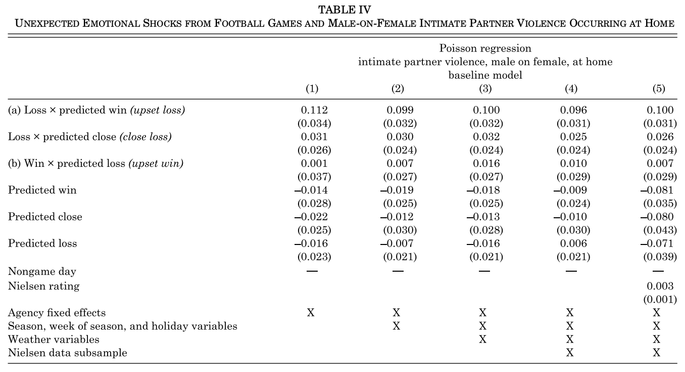
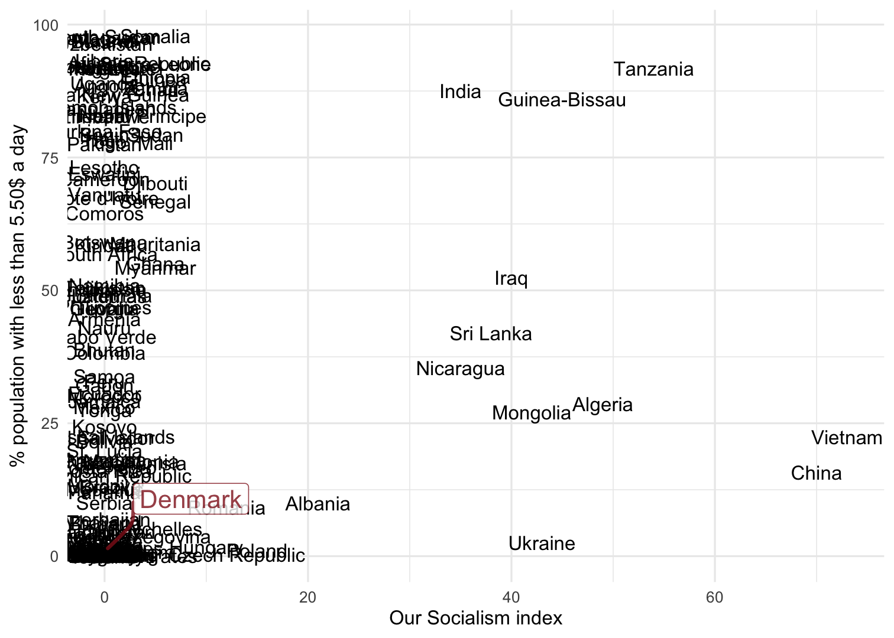
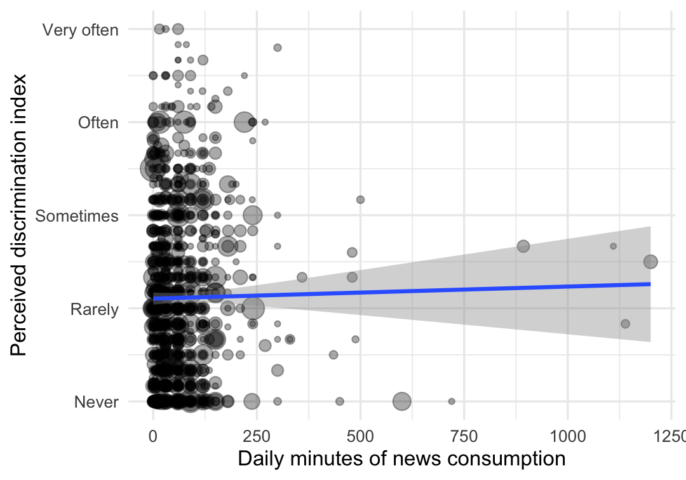

```{r setup, include = FALSE}
library(RefManageR)
library(knitr)
library(ggrepel) # Nicely placed labels in figures.
library(modelr)
library(webexercises) # Small web-based answer scales.
library(equatiomatic) # Regression equations from model objects.

options(htmltools.preserve.raw = FALSE,
        htmltools.dir.version = FALSE, servr.interval = 0.5, width = 115, digits = 3)
knitr::opts_chunk$set(
  collapse = TRUE, message = FALSE, fig.retina = 3, error = TRUE,
  warning = FALSE, cache = FALSE, fig.align = 'center',
  comment = "#", strip.white = TRUE, tidy = FALSE)

BibOptions(check.entries = FALSE, 
           bib.style = "authoryear", 
           style = "markdown",
           hyperlink = FALSE,
           no.print.fields = c("doi", "url", "ISSN", "urldate", "language", "note", "isbn", "volume"))
myBib <- ReadBib("./../../../Stats_II.bib", check = FALSE)

xaringanExtra::use_xaringan_extra(c("tile_view", "tachyons"))
xaringanExtra::use_panelset()
```
class: middle center
background-image: url("https://stanfordbloodcenter.org/wp-content/uploads/2021/01/iStock-1208283967.jpg")
background-position: center
background-size: cover

.font160[
**My research agenda**
]
.font200[
**Theory-driven empirical analysis of <br> <br> immigration-based ethnic diversity and stratification, <br> <br>& their contentious political consequences**
]

---
class: clear
```{r, echo = FALSE, out.width='100%', fig.align='center'}

```

---
layout: true
# Some of my current work

---
.left-column[
```{r, echo = FALSE, out.width='100%'}
knitr::include_graphics('https://www.templehealth.org/sites/default/files/styles/without_crop/public/2021-01/man-wearing-mask-coughing-into-shoulder.jpg?itok=Z6mUgWPd')
```
]


.right-column[
> In the following you are asked to take a stand on the case of **[name]** who has lived in Denmark **[length of residence]**. **[Name]** has been tested positive for COVID-19 (Corona virus) and later developed severe symptoms such as fever, fatigue, dry coughs, breathing difficulties, and chest pains. He is **[age]**. The doctor who examined **[name]**, assessed that he needs treatment. However, given the increased pressure the healthcare system is experiencing, **[name]** might be admitted a hospital bed at the expense of someone else.

> Based on the above scenario, to what degree do you feel this person should be prioritized a hospital bed?
.center[.backgrnote[*Source*: `r Citet(myBib, "larsen_healthcare_2021")`]]
]

---


```{r, echo = FALSE, out.width='80%'}
knitr::include_graphics('https://www.tandfonline.com/na101/home/literatum/publisher/tandf/journals/content/cjms20/2021/cjms20.v047.i07/1369183x.2020.1860742/20220705/images/large/cjms_a_1860742_f0001_oc.jpeg')
```
.center[.backgrnote[*Source*: `r Citet(myBib, "larsen_healthcare_2021")`]]

---

```{r, echo = FALSE, out.width='45%'}
knitr::include_graphics('./img/Krzysz.png')
```
.center[.backgrnote[*Source*: `r Citet(myBib, "krakowski_populist_2022")`]]

---

```{r, echo = FALSE, out.width='80%'}
knitr::include_graphics('./img/Ethnic_Discr2-1.png')
```
.center[.backgrnote[*Source*: `r Citet(myBib, "krakowski_populist_2022")`]]

---


```{r, echo = FALSE, out.width='60%'}
knitr::include_graphics('https://www.degruyter.com/document/doi/10.1515/zfsoz-2017-1022/asset/graphic/j_zfsoz-2017-1022_abb_001.jpg')
```
.center[.backgrnote[*Source*: `r Citet(myBib, c("junger_immigration_2022", "kruse_halo-effekt_2022", "klinger_halo-effekt_2017"))`]]

---
layout: false
class: inverse middle center

.push-left[.font200[
Did you do the

**pre-work setup**?
]]


.push-right[
<iframe src='https://merlin-advanced-stats.netlify.app/about/' width='1000' height='600' frameborder='0' scrolling='yes'></iframe>
]

---
layout: false
class: inverse middle
# I assume

- You know how to use R and RStudio.


--


- You know basic statistics:
  + Descriptive statistics: $\%$, $\bar{x}$, $\text{SD}(x)$.
  + Associations: Correlation $r_{y,x}$, OLS regression $y_{i} = \alpha + \beta x_{i} + \epsilon_{i}$.
  + Inference: Confidence intervals, $t$-values & $p$-values.

--


- *You want to do professional analyses and communicate your results with appealing visualizations.*

---
class: inverse middle
# Today's schedule

1. Explanatory sociology


2. Learning goals
  + Advanced OLS regression
  + Visualization of regression results
  + Causal inference
  
  
3. Course organization

---
class: inverse middle center
# Explanatory sociology

---
# 4 Types of research questions

.push-left[
- **Ontological**: What is the nature of X?
  + What is power?
  + What is gender; how is it different from race?
  + What defines a state? .backgrnote[
> A human community that (successfully) claims the monopoly of the legitimate use of physical force within a given territory

> --- Max Weber, “Politics as a Vocation” 1918]


- **Critical**: Is X (un-)just?
  + Is home office exploitation?
  + Is color-blind ideology a new form of racism?
]

--

.push-right[
- **Descriptive**: What is the case?
  + What are the survival strategies of the poor?
  + How did Danes structure their days during the COVID-19 lockdowns?


- **Explanatory**: Why is X the case?
  - Why does the suicide rate vary across societies?
  - How does capitalism affect human beings?
  - How does urbanization change our psyche?
  - Why do people obey power?
  - How does a state gain legitimacy over the use of physical force? 
]

--

.content-box-green[
.center[
What type of research question do my three examples try to answer?

What are you interested in?
]]

---
# 4 Types of research questions

.push-left[
- **Ontological**: What is the nature of X?
  + What is power?
  + What is gender; how is it different from race?
  + What defines a state? .backgrnote[
> A human community that (successfully) claims the monopoly of the legitimate use of physical force within a given territory

> --- Max Weber, “Politics as a Vocation” 1918]


- **Critical**: Is X (un-)just?
  + Is home office exploitation?
  + Is color-blind ideology a new form of racism?
]

.push-right[
- **Descriptive**: What is the case?
  + What are the survival strategies of the poor?
  + How did Danes structure their days during the COVID-19 lockdowns?


.content-box-red[
- **Explanatory**: Why is X the case?
  - Why does the suicide rate vary across societies?
  - How does capitalism affect human beings?
  - How does urbanization change our psyche?
  - Why do people obey power?
  - How does a state gain legitimacy over the use of physical force? 
]]

---
# The goal of empirical social science

.font140[.center[.alert[Use data to discover patterns ("social facts" in Durkheim's terms), <br> and the **social mechanisms that bring them about**.]]]

```{r, echo = FALSE, out.width='70%', fig.align='center'}
knitr::include_graphics('https://liu.se/-/media/istock-501261958.jpg?mw=1120&mh=1120&hash=DA8977CCE6A6E600AE80A40CFEE771C9')
```

---
class: inverse middle center
# Learning goals

---
# This semester / Learning goals

.push-left[
- More flexible OLS regression:
  + Multiple regression,
  + Interaction effects,
  + Polynomials.
- Visualization of regression results.
- Work with various data.

```{r, echo = FALSE, out.width='80%', fig.align='center'}
knitr::include_graphics('https://www.journals.uchicago.edu/cms/10.1086/686942/asset/images/medium/fg3.gif')
```
.backgrnote[.center[*Source:* `r Citet(myBib, "legewie_contested_2016")`]]

]

--

.push-right[
- .alert[Causal Inference]:
  1. Randomized Controlled Trials (RCTs),
  2. Multiple Regression,
  3. Instrument Variable Regression,
  4. Regression Discontinuity Design.

```{tikz, DAG1,  echo = FALSE, out.width='50%'}
\usetikzlibrary{shapes,decorations,arrows,calc,arrows.meta,fit,positioning}
\tikzset{
    -Latex,auto,node distance =1 cm and 1 cm,semithick,
    state/.style ={ellipse, draw, minimum width = 0.7 cm},
    point/.style = {circle, draw, inner sep=0.04cm,fill,node contents={}},
    bidirected/.style={Latex-Latex,dashed},
    el/.style = {inner sep=2pt, align=left, sloped}
}

\begin{tikzpicture}
\sffamily
    \node[state] (1) at (0,0) {$C$};
    \node[state] (2) [below = of 1] {$X$};
    \node[state] (3) [right = of 2] {$Y$};

    \path (1) edge  (2);
    \path[bidirected] (2) edge[red, bend right=50] (3);
    \path (1) edge (3);
\end{tikzpicture}
```
]

---
layout: true
# Example 1: Multiple regression

---
.push-left[
```{tikz, ref.label = "DAG1",  echo = FALSE, out.width='40%'}
```
.backgrnote[
The red bi-directed arrow is officially not part of the DAG, but helps you see that the correlation between $X$ and $Y$ is spurious because of $C$.
]]

---

.push-left[
```{tikz, DAG2,  echo = FALSE, out.width='100%'}
\usetikzlibrary{shapes,decorations,arrows,calc,arrows.meta,fit,positioning}
\tikzset{
    -Latex,auto,node distance =1 cm and 1 cm,semithick,
    state/.style ={ellipse, draw, minimum width = 0.7 cm},
    point/.style = {circle, draw, inner sep=0.04cm,fill,node contents={}},
    bidirected/.style={Latex-Latex,dashed},
    el/.style = {inner sep=2pt, align=left, sloped}
}

\begin{tikzpicture}
\sffamily
    \node[state] (1) at (0,0) {Poor team};
    \node[state] (2) at (2,0) {C?};
    \node[state] (3) [below = of 1] {Sports bet};
    \node[state] (4) [below = of 3] {Lost football game};
    \node[state] (5) [right = of 4] {Domestic violence};

    \path (1) edge  (3);
    \path (2) edge  (3);
    \path (3) edge  (4);
    \path (4) edge (5);
    \path (1) edge (5);
    \path (2) edge (5);
\end{tikzpicture}
```

.backgrnote[
The red bi-directed arrow is officially not part of the DAG, but helps you see that the correlation between read news and perceived discrimination is biased because immigrant minorities who obtained German citizenship read news more often than those who are foreign citizens.]

```{r, echo = FALSE, out.width='60%', fig.align='center'}
knitr::include_graphics('https://wpr-public.s3.amazonaws.com/wprorg/styles/facebook/s3/field/image/ap20296067506098.jpg?itok=hZu82HBq')
```

]

---

.left-column[
```{tikz, ref.label = "DAG2",  echo = FALSE, out.width='100%'}
```
.backgrnote[
The red bi-directed arrow is officially not part of the DAG, but helps you see that the correlation between read news and perceived discrimination is biased because immigrant minorities who obtained German citizenship read news more often than those who are foreign citizens.]

```{r, echo = FALSE, out.width='100%', fig.align='center'}
knitr::include_graphics('https://wpr-public.s3.amazonaws.com/wprorg/styles/facebook/s3/field/image/ap20296067506098.jpg?itok=hZu82HBq')
```
]

.right-column[
```{r, echo = FALSE, out.width='100%', fig.align='center'}

```
.backgrnote[.center[*Source:* `r Citet(myBib, "card_family_2011")`]]
]

---
layout: false
class: clear
# Example 2: Regression discontinuity design

.push-left[
```{r, echo = FALSE, out.width='62%', fig.align='center'}
knitr::include_graphics('https://pbs.twimg.com/media/FOH1FlhWUAIqbN1.jpg:large')
```
]

.push-right[
```{r, echo = FALSE, out.width='100%', fig.align='center'}
knitr::include_graphics('https://pbs.twimg.com/media/FZIn0ymXgAAOopA.jpg:large')
```
]

---
class: clear
# Example 2: Regression discontinuity design

.push-left[
```{r, echo = FALSE, out.width='62%', fig.align='center'}
knitr::include_graphics('https://pbs.twimg.com/media/FOH1FlhWUAIqbN1.jpg:large')
```
]


.push-right[
.center[Municipalities where far-right candidates *ran*
versus where they *won*]
```{r, echo = FALSE, out.width='100%', fig.align='center'}
knitr::include_graphics('./img/Map_Italy.png')
```
.backgrnote[.center[*Source:* `r Citet(myBib, "romarri_far-right_2020")`]]
]

---
class: clear
# Example 2: Regression discontinuity design

```{r, echo = FALSE, out.width='50%', fig.align='center'}
knitr::include_graphics('./img/Romarri.png')
```
.backgrnote[.center[*Source:* `r Citet(myBib, "romarri_far-right_2020")`]]

---
class: inverse middle center
# Break

<iframe src='https://www.online-timer.net/' width='400' height='385' frameborder='0' scrolling='yes'></iframe>


---
layout: false
class: inverse middle center
# Course organization

---
# Weekly course elements

```{r, echo = FALSE, out.width='100%', fig.align='center'}
knitr::include_graphics('./img/Structure.png')
```  

---
layout: true
# Working with data

.left-column[
```{r, echo = FALSE, out.width='50%', fig.align='center'}
knitr::include_graphics('https://www.rstudio.com/wp-content/uploads/2018/10/RStudio-Logo-Flat.png')
```  
- We presume that you are familiar with using R.

- You will learn to work with various different types of data in this course.

- Become as fluent in working with data as you are in Danish/English ;)
]

---
.right-column[
.center[Data collected by the Worldbank]
```{r, echo = FALSE, out.width='90%', fig.align='center'}

```  

]

---

.right-column[
.center[European Social Survey]
```{r, echo = FALSE, out.width='90%', fig.align='center'}
knitr::include_graphics('./../2-Random/2-Random_files/figure-html/true_ols-1.png')
```  

]

---

.right-column[
.center[APAX survey]
```{r, echo = FALSE, out.width='90%', fig.align='center'}

```  

]

---
layout: false
# Textbooks

.push-left[
.center[We continue to use the book from last semester]

```{r, echo = FALSE, out.width='40%', fig.align='center'}
knitr::include_graphics('https://imgcdn.saxo.com/_9781292362328')
```
.backgrnote[.center[`r Citet(myBib, "veaux_stats_2021")`]]
]

.push-right[
.center[Additionally, we will use Angrist and Pischke's excellent introduction to causal inference.]

```{r, echo = FALSE, out.width='40%', fig.align='center'}
knitr::include_graphics('https://imgcdn.saxo.com/_9780691152844')
```
.backgrnote[.center[`r Citet(myBib, "angrist_mastering_2014")`]]
]

---
# Recommendations

.push-left[
- Take notes!
  + I will use the blackboard.
  + The slides are visualizations, not a textbook written in bullet points.
  + Many things I say are not on the slides.
 
  
- Activate email notifications on Absalon.


- Regularly check your KU email or forward it to your personal email.
]

.push-right[
```{r, echo = FALSE, out.width='80%', fig.align='center'}
knitr::include_graphics('https://media.istockphoto.com/vectors/school-children-vector-id513534403?s=170667a')
```
]

---
class: inverse middle center
# Questions

```{r, echo = FALSE, out.width='50%', fig.align='center'}
knitr::include_graphics('https://www.mountpolley.com/wp-content/uploads/2020/08/pexels-pixabay-356079-1200x726.jpg')
```

---
# References

.push-left[
.font70[
```{r ref1, results = 'asis', echo = FALSE}
PrintBibliography(myBib, start = 1, end = 5)
```
]]

.push-right[
.font70[
```{r ref2, results = 'asis', echo = FALSE}
PrintBibliography(myBib, start = 6, end = length(myBib))
```
]]