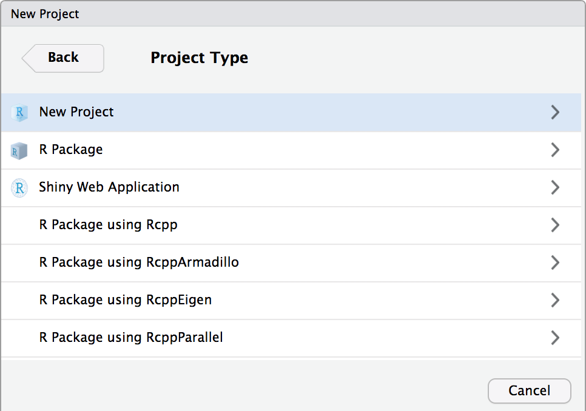

```{r setup, include = FALSE}
library(RefManageR)
library(knitr)
library(ggrepel) # Nicely placed labels in figures.
library(modelr)
library(webexercises) # Small web-based answer scales.
library(equatiomatic) # Regression equations from model objects.
library(pdftools)

options(htmltools.preserve.raw = FALSE,
        htmltools.dir.version = FALSE, servr.interval = 0.5, width = 115, digits = 3)
knitr::opts_chunk$set(
  collapse = TRUE, message = FALSE, fig.retina = 3, error = TRUE,
  warning = FALSE, cache = FALSE, fig.align = 'center',
  comment = "#", strip.white = TRUE, tidy = FALSE)

BibOptions(check.entries = FALSE, 
           bib.style = "authoryear", 
           style = "markdown",
           hyperlink = FALSE,
           no.print.fields = c("doi", "url", "ISSN", "urldate", "language", "note", "isbn", "volume"))
myBib <- ReadBib("./../../../Stats_II.bib", check = FALSE)

xaringanExtra::use_xaringan_extra(c("tile_view", "tachyons"))
xaringanExtra::use_panelset()
```
# Course structure

.left-column[
<br>

| TA       | Fridays  | Room       |
|:---------|:---------|:-----------|
| Sofie     | 8  am    | CSS 2-2-55 |
| Halfdan | 8  am    | CSS 4-0-02 |
| Sofie    | 10 am    | CSS 2-2-55 |
| Halfdan    | 10 am    | CSS 1-0-10 |
]

.right-column[
```{r, echo = FALSE, out.width='100%', fig.align='center'}

```  
]

---
class: middle center
background-image: url("https://stanfordbloodcenter.org/wp-content/uploads/2021/01/iStock-1208283967.jpg")
background-position: center
background-size: cover

.font160[
**My research agenda**
]
.font200[
**How Does International Immigration<br><br>Transform our Societies?**
]


---
layout: true
# Some of my current work

---

.left-column[
```{r, echo = FALSE, out.width='100%'}
knitr::include_graphics('https://www.templehealth.org/sites/default/files/styles/without_crop/public/2021-01/man-wearing-mask-coughing-into-shoulder.jpg?itok=Z6mUgWPd')
```
]

.right-column[
```{r, echo = FALSE, out.width='100%'}
knitr::include_graphics('./img/Paired_Vignette.png')
```
.center[.backgrnote[*Source*: `r Citet(myBib, "schaeffer_who_2023")`]]
]

---

```{r, echo = FALSE, out.width='80%'}

```
.center[.backgrnote[*Source*: `r Citet(myBib, "schaeffer_who_2023")`]]

---

```{r, echo = FALSE, out.width='42%'}

```
.center[.backgrnote[*Source*: `r Citet(myBib, "schaeffer_when_2025")`]]

---

```{r, echo = FALSE, out.width='95%'}

```
.center[.backgrnote[*Source*: `r Citet(myBib, "schaeffer_when_2025")`]]

---


```{r, echo = FALSE, out.width='45%'}
knitr::include_graphics('./img/Wiedner.png')
```
.center[.backgrnote[*Source*: `r Citet(myBib, "wiedner_local_2025")`]]
  
---
layout: false
class: inverse middle center
# Explanatory Sociology

---
# 4 Types of research questions

.push-left[
**(1) Ontological**: What is the nature of .alert[X]?
  + What is power?
  + What is gender; how is it different from race?
  + What is a state? .backgrnote[
> A human community that (successfully) claims the monopoly of the legitimate use of physical force within a given territory

> -- Max Weber, "Politics as a Vocation" 1918]


**(2) Critical**: Is .alert[X] (un-)just?
  + Is home office exploitation?
  + Is the color-blind ideology a new form of racism?
]

--

.push-right[
**(3) Descriptive**: What types of .alert[X] exist<br> and how frequent are they?
  + What are the survival strategies of the poor?
  + How did Danes structure their days during the COVID-19 lockdowns?


**(4) Explanatory**: What is the effect of .alert[X]?
  - What are the consequences of anomie? <br> .backgrnote[Why does the suicide rate vary across societies?]
  - How does capitalism affect us?
  - How does urbanization affect us?
  - .backgrnote[Why do people obey power?]
  - .backgrnote[How does a state gain legitimacy over the use of physical force?]
]

--

.content-box-green[
.center[
Think of the last exam you wrote. What type of research question did it enage with?
]]

---
# 4 Types of research questions

.push-left[
**(1) Ontological**: What is the nature of .alert[X]?
  + What is power?
  + What is gender; how is it different from race?
  + What is a state? .backgrnote[
> A human community that (successfully) claims the monopoly of the legitimate use of physical force within a given territory

> -- Max Weber, "Politics as a Vocation" 1918]


**(2) Critical**: Is .alert[X] (un-)just?
  + Is home office exploitation?
  + Is the color-blind ideology a new form of racism?
]

.push-right[
**(3) Descriptive**: What types of .alert[X] exist<br> and how frequent are they?
  + What are the survival strategies of the poor?
  + How did Danes structure their days during the COVID-19 lockdowns?


.content-box-red[
**(4) Explanatory**: What is the effect of $X$?
  - What are the consequences of anomie? <br> .backgrnote[Why does the suicide rate vary across societies?]
  - How does capitalism affect us?
  - How does urbanization affect us?
  - .backgrnote[Why do people obey power?]
  - .backgrnote[How does a state gain legitimacy over the use of physical force?]
]]

---
# Goal of empirical sociology

.font130[.center[Use data to discover patterns, <br> and the .alert[social mechanisms that bring them about.]]]

```{r, echo = FALSE, out.width='70%', fig.align='center'}
knitr::include_graphics('https://researchleap.com/wp-content/uploads/2021/12/Population-data.jpeg')
```

---
class: inverse middle center
# Three learning goals

---
# Three learning goals

.push-left[
**(1) Multiple OLS regression**
  + Multiple predictors & confounder adjustment,
  + Interaction effects,
  + Polynomials.


**(2) Visualization of regression results**
  + Model predictions,
  + Coefficient plots.

```{r, echo = FALSE, out.width='65%', fig.align='center'}
knitr::include_graphics('https://www.journals.uchicago.edu/cms/10.1086/686942/asset/images/medium/fg3.gif')
```
.backgrnote[.center[*Source:* `r Citet(myBib, "legewie_contested_2016")`]]

]

--

.push-right[
**(3) Fundamentals of causal inference**
  + Potential outcomes and directed acyclical graphs,
  + Randomized Controlled Trials,
  + Intention to treat & instrument variable regression,
  + Multiple regression,
  + 2-SLS instrument variable regression,
  + Regression discontinuity designs.

```{tikz, DAG1,  echo = FALSE, out.width='45%'}
\usetikzlibrary{shapes,decorations,arrows,calc,arrows.meta,fit,positioning}
\tikzset{
    -Latex,auto,node distance =1 cm and 1 cm,semithick,
    state/.style ={ellipse, draw, minimum width = 0.7 cm},
    point/.style = {circle, draw, inner sep=0.04cm,fill,node contents={}},
    bidirected/.style={Latex-Latex,dashed},
    el/.style = {inner sep=2pt, align=left, sloped}
}

\begin{tikzpicture}
\sffamily
    \node[state] (1) at (0,0) {$C$};
    \node[state] (2) [below = of 1] {$X$};
    \node[state] (3) [right = of 2] {$Y$};

    \path (1) edge  (2);
    \path[bidirected] (2) edge[red, bend right=50] (3);
    \path (1) edge (3);
\end{tikzpicture}
```
]

---
layout: false
class: clear
# Example: Regression discontinuity design

.push-left[
```{r, echo = FALSE, out.width='62%', fig.align='center'}
knitr::include_graphics('https://pbs.twimg.com/media/FOH1FlhWUAIqbN1.jpg:large')
```
]

.push-right[
```{r, echo = FALSE, out.width='100%', fig.align='center'}
knitr::include_graphics('https://pbs.twimg.com/media/FZIn0ymXgAAOopA.jpg:large')
```
]

---
class: clear
# Example: Regression discontinuity design

.push-left[
```{r, echo = FALSE, out.width='62%', fig.align='center'}
knitr::include_graphics('https://pbs.twimg.com/media/FOH1FlhWUAIqbN1.jpg:large')
```
]


.push-right[
.center[Municipalities where far-right candidates <br> *ran*
versus where they *won*]
```{r, echo = FALSE, out.width='100%', fig.align='center'}

```
.backgrnote[.center[*Source:* `r Citet(myBib, "romarri_far-right_2020")`]]
]

---
class: clear
# Example: Regression discontinuity design


```{r, echo = FALSE, out.width='50%', fig.align='center'}
knitr::include_graphics('./img/Romarri.png')
```
.backgrnote[.center[*Source:* `r Citet(myBib, "romarri_far-right_2020")`]]

---
class: clear
# Example: Regression discontinuity design

.left-column[
```{r, echo = FALSE, out.width='100%'}

```
]

.right-column[
```{r, echo = FALSE, out.width='100%', fig.align='center'}

```
.backgrnote[.center[*Source:* `r Citet(myBib, "schaeffer_when_2025")`]]
]

---
class: inverse middle center
# Break

<iframe src='https://www.online-timer.net/' width='400' height='385' frameborder='0' scrolling='yes'></iframe>

---
# Course structure

.right-column[
```{r, echo = FALSE, out.width='100%', fig.align='center'}

```
]

--

.left-column[
.center[**Recommendations**]
- Activate email notifications on Absalon.

- Regularly check your KU email or forward it to your personal email.

- Ask and answer questions in the [t-R-ouble forum](https://absalon.ku.dk/courses/70545/discussion_topics/563046?module_item_id=2037268) on Absalon.
]

---
class: clear

```{r, echo = FALSE, out.width='60%', fig.align='center'}


```  
---
# Weekly Absalon Online Quizzes

.left-column[
- 13 Online Quizzes on Absalon designed by [Epinion](https://epinionglobal.com/) & Adna.

- Based on data Epinion collects for municipality of Copenhagen, DR, Skat, etc.

- .alert[Submit at least 10 completed quizzes] to qualify for the integrated exam with "Velfærd, ulighed og mobilitet"!

- .alert[Submit individually and within two weeks] after they are made available online (i.e., Wednesdays after the lecture).
]

.right-column[
```{r, echo = FALSE, out.width='80%', fig.align='center'}


```  
]

---
class: inverse
# Consequently, this course assumes

1. You have basic R coding skills and know how to use RStudio.

--

2. You know basic statistics:
  + Descriptive statistics: $\%$, $\bar{x}$, $\text{SD}(x)$.
  + Associations: 
      + Correlation: $r_{y,x}$,
      + OLS regression: $y_{i} = \alpha + \beta x_{i} + \epsilon_{i}$.
  + Inference: Confidence intervals, $t$-values & $p$-values.

---
layout: false
# Two textbooks

$\rightarrow$ Both textbooks are accessible at Academic Books and are available at the university library.

.push-left[
.center[The first textbook, carried over from last semester, serves as a reference for regression and statistical inference.]

```{r, echo = FALSE, out.width='40%', fig.align='center'}
knitr::include_graphics('https://imgcdn.saxo.com/_9781292362328')
```
.backgrnote[.center[`r Citet(myBib, "veaux_stats_2021")`]]
]

.push-right[
.center[To deepen our understanding of how regression analysis can be applied to identify causal effects, we will heavily rely on Angrist and Pischke's textbook]

```{r, echo = FALSE, out.width='35%', fig.align='center'}
knitr::include_graphics('https://imgcdn.saxo.com/_9780691152844')
```
.backgrnote[.center[`r Citet(myBib, "angrist_mastering_2014")`]]
]

---
class: inverse middle center
# Questions

```{r, echo = FALSE, out.width='50%', fig.align='center'}
knitr::include_graphics('https://www.mountpolley.com/wp-content/uploads/2020/08/pexels-pixabay-356079-1200x726.jpg')
```

---
# Task 1

1. Get a [recent version of R (>= 4.5.0)](https://mirrors.dotsrc.org/cran/).

2. [Install RStudio](https://posit.co/download/rstudio-desktop/), or update to the most recent version.

---
# Task 2 .font70[Open RStudio and follow these instructions]

```{r, echo = FALSE, out.width='55%', fig.align='center'}
knitr::include_graphics('https://d33wubrfki0l68.cloudfront.net/8a64bb047429d7ae0e2acae35c40e421e6439bf6/80e5d/diagrams/rstudio-editor.png')
```

---
# Task 3 .font70[Set R Studio preferences]

.left-column[
Set these preferences to improve *reproducibility*!<br>
  $\rightarrow$ RStudio/Tools/Global options.
]

.right-column[
```{r, echo = FALSE, out.width='70%', fig.align='center'}
knitr::include_graphics('https://d33wubrfki0l68.cloudfront.net/7fa44a5471d40025344176ede4169c5ad3159482/1577f/screenshots/rstudio-workspace.png')
```
]

---
# R Studio workflow

.left-column[
1. Use **Projects** to manage all files (scripts, data, figures and tables) belonging to the same project.

2. Always start your RStudio session by clicking on the **Project** for this course.

2. Use the editor the write as many **R scripts** as you like, save them in the same folder as your **Project**. Thereby you can reproduce your results.
]

.right-column[
```{r, echo = FALSE, out.width='85%', fig.align='center'}
knitr::include_graphics('https://d33wubrfki0l68.cloudfront.net/8a64bb047429d7ae0e2acae35c40e421e6439bf6/80e5d/diagrams/rstudio-editor.png')
```
]

---
# Set up your "Stats_II" project

.left-column[
- Click on the Project button.
]

.right-column[
```{r, echo = FALSE, out.width='40%', fig.align='center'}

```
]

---
layout: true
# Set up your "Stats_II" project
.left-column[
Set up a new project in R Studio. 
  1. "New Directory"
  2. "New Project"
  3. Finally, a name for the folder and under "Browse" where you want that folder to be located. I call mine Stats_II. 
    + This will also generate a folder with the name you chose. Use that folder for everything related to this course.

**Done!** Now you should find an empty folder under the path your wanted it to be set up.

.alert[In the future, always start RStudio by double clicking on the project icon in your folder for this course.]
]

---

.right-column[
```{r, echo = FALSE, out.width='90%', fig.align='center'}
knitr::include_graphics('./img/RProject2.png')
```
]

---

.right-column[
```{r, echo = FALSE, out.width='90%', fig.align='center'}

```
]

---

.right-column[
```{r, echo = FALSE, out.width='90%', fig.align='center'}
knitr::include_graphics('./img/RProject4.png')
```
]

---

.right-column[
```{r, echo = FALSE, out.width='90%', fig.align='center'}
knitr::include_graphics('./img/RProject5.png')
```
]


---
layout: false
layout: true
# R Scripts
---

.left-column[
1. Open a new R Script.
2. Save it in your new folder.
  + Find it under "Files".
]

.right-column[
```{r, echo = FALSE, out.width='100%', fig.align='center'}
knitr::include_graphics('./img/Rscript1.png')
```
]

---

.left-column[
1. Type the lines shon in the screenshot on the right.
2. Save the file by clicking on the flopy disc icon;
  - I called mine "Lecture.R".
3. Mark all code and click "run".
]

.right-column[
```{r, echo = FALSE, out.width='100%', fig.align='center'}
knitr::include_graphics('./img/Rscript3.png')
```
]

---

.left-column[
OK, you are good to go! 

**Pro tip:** *Use the R Script to take notes during the lecture!*

A `#` defines a comment. So use it to take notes and code in one single document per lecture.
]

.right-column[
```{r, echo = FALSE, out.width='100%', fig.align='center'}
knitr::include_graphics('./img/Rscript4.png')
```
]

---
layout: false
class: clear
# AI & Large Language Models like ChatGPT

.push-left[
1. **Privacy**: .alert[Don't use AI/LLMs to process sensitive information!]
2. **Learning**: Use AI/LLMs to *explain, comment, debug, and improve* R code that you drafted. Also use AI/LLMs to get *summaries* of text passages and concepts that you do not understand. This will help you to read complex texts and better understand difficult topics. You can also use use AI/LLMs to *discuss* your understanding of the course materials and ask things that confuse you.

3. **Generation**: Don't use AI/LLMs to *generate, draft, and write* your R code. .alert[You need to learn how to code to assess whether ChatGPT coded what you asked for.]
]

.push-right[
```{r, echo = FALSE, out.width='100%', fig.align='center'}
knitr::include_graphics('https://media1.giphy.com/media/iiSb58oATiANL65Dd2/giphy.gif?cid=ecf05e470i00dk1kq5bvalzh4irqygm4pieeqkdyz9vk76ht&ep=v1_gifs_search&rid=giphy.gif&ct=g')
```  
]

---
# References

.push-left[
.font70[
```{r ref1, results = 'asis', echo = FALSE}
PrintBibliography(myBib, start = 1, end = 5)
```
]]

.push-right[
.font70[
```{r ref2, results = 'asis', echo = FALSE}
PrintBibliography(myBib, start = 6, end = length(myBib))
```
]]