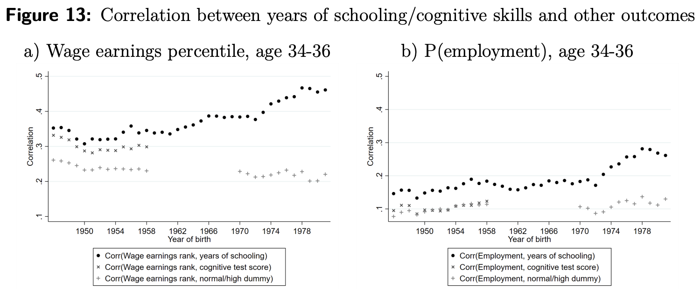
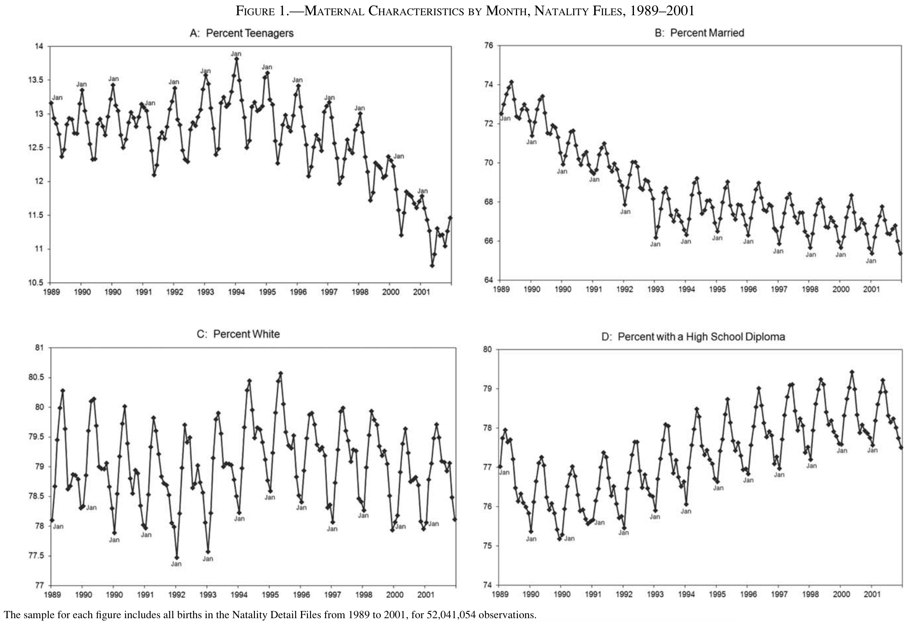
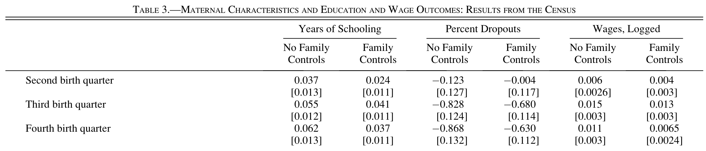
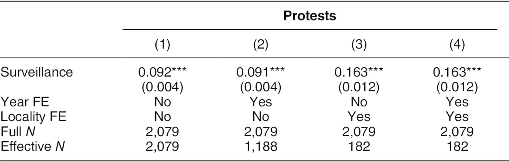
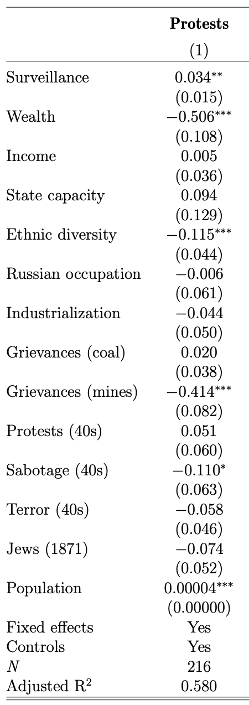
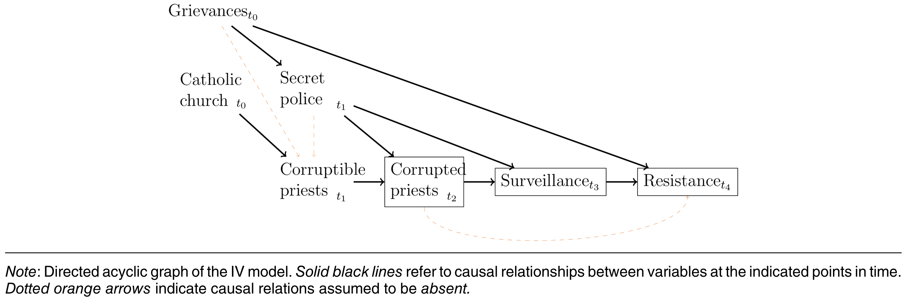
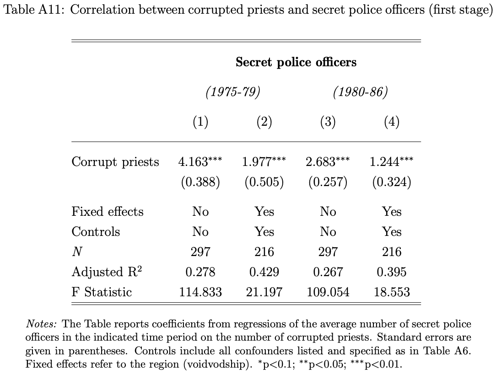
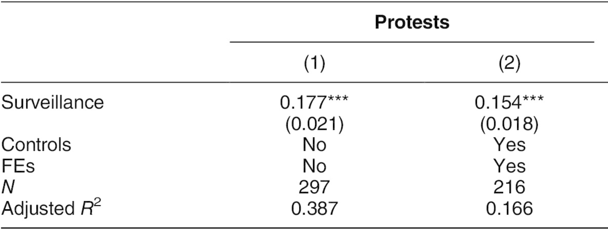

```{r setup, include = FALSE}
library(RefManageR)
library(knitr)
library(ggrepel) # Nicely placed labels in figures.
library(modelr)
library(webexercises) # Small web-based answer scales.
library(equatiomatic) # Regression equations from model objects.
library(essentials)

options(htmltools.preserve.raw = FALSE, tikzDefaultEngine = "xetex",
        htmltools.dir.version = FALSE, servr.interval = 0.5, width = 115, digits = 3)
knitr::opts_chunk$set(
  collapse = TRUE, message = FALSE, fig.retina = 3, error = TRUE,
  warning = FALSE, cache = FALSE, fig.align = 'center',
  comment = "#", strip.white = TRUE, tidy = FALSE)

BibOptions(check.entries = FALSE, 
           bib.style = "authoryear", 
           style = "markdown",
           hyperlink = FALSE,
           no.print.fields = c("doi", "url", "ISSN", "urldate", "language", "note", "isbn", "volume"))
myBib <- ReadBib("./../../../Stats_II.bib", check = FALSE)

xaringanExtra::use_xaringan_extra(c("tile_view", "tachyons"))
xaringanExtra::use_panelset()
```
# Goal of empirical sociology

.font130[.center[Use data to discover patterns, <br> and the .alert[social mechanisms that bring them about.]]]

```{r, echo = FALSE, out.width='50%', fig.align='center'}
knitr::include_graphics('https://blogger.googleusercontent.com/img/b/R29vZ2xl/AVvXsEgykJbXZbwIX-nd1oVOyzmEfj09ho8aQ4HBhfMH27t6YeTYSBevfrD2DFTEQSe7e3UwaVnv-fAJAOVpjW2pSGfG2QNrgHfkTmFtRWK4VXl6KmWK6vVlLud0DRU6lFXAqBF7iij420oOTLFh/s1600/photo.JPG')
```


---
class: inverse middle
# Today's schedule

Application of the day: Does education pay off?
  + Recapitulation of IV.
  + Two-stage least Squares (2SLS).
  + Wald IV versus 2SLS IV Estimator.

---
class: inverse
# Application of the day

.push-left[.center[.font130[
**_Returns to education_: <br><br>Does education really pay off?**
]]]

.push-right[
```{r, echo = FALSE, out.width='65%', fig.align='center'}
knitr::include_graphics('https://c8.alamy.com/zooms/9/bfa9df51a3cd4e3199eaf06327d83679/e3r26y.jpg')
knitr::include_graphics('https://uniavisen.dk/wp-content/uploads/2019/09/customcustomsizeimmatrikulationuniavisenheddarysstad031.jpg')
```
]

---
# Isn't the answer obvious?

.left-column[
```{tikz, DAG_1, echo = FALSE, out.width='100%'}
\usetikzlibrary{shapes,decorations,arrows,calc,arrows.meta,fit,positioning,quotes}
\tikzset{
  -Latex,auto,node distance =1 cm and 1 cm,semithick,
  state/.style ={ellipse, draw, minimum width = 0.7 cm},
  point/.style = {circle, draw, inner sep=0.04cm,fill,node contents={}},
  bidirected/.style={Latex-Latex,dashed},
  el/.style = {inner sep=2pt, align=left, sloped}
}

\begin{tikzpicture}
\sffamily
\node[state, align = center] (1) at (0,0) {Education};
\node[state, align = center] (2) [right = of 1] {\$};

\path (1) edge (2);
\end{tikzpicture}
```
]

.right-column[
```{r, echo = FALSE, out.width='100%', fig.align='center'}

```
.backgrnote[.center[*Source:* `r Citet(myBib, "karlson_making_2021")`]]
]

---
# No, there are confounders!

.left-column[
```{tikz, DAG_2, echo = FALSE, out.width='100%'}
\usetikzlibrary{shapes,decorations,arrows,calc,arrows.meta,fit,positioning,quotes}
\tikzset{
  -Latex,auto,node distance =1 cm and 1 cm,semithick,
  state/.style ={ellipse, draw, minimum width = 0.7 cm},
  point/.style = {circle, draw, inner sep=0.04cm,fill,node contents={}},
  bidirected/.style={Latex-Latex,dashed},
  el/.style = {inner sep=2pt, align=left, sloped}
}

\begin{tikzpicture}
\sffamily
\node[state, align = center] (1) at (0,0) {Education};
\node[state, align = center] (2) [right = of 1] {\$};
\node[state, align = center] (3) [dashed, red, above = of 1] {Parental \\ education};
\node[state, align = center] (4) [dashed, red, below = of 1] {Cognitive \\ ability};

\path (1) edge (2);
\path (3) edge [dashed, red] (2);
\path (4) edge [dashed, red] (2);
\path (3) edge [dashed, red] (1);
\path (4) edge [dashed, red] (1);
\end{tikzpicture}
```


]

.right-column[
```{r, echo = FALSE, out.width='80%', fig.align='center'}
knitr::include_graphics('https://www.learnliberty.org/wp-content/uploads/2017/09/Sni%CC%81mek-obrazovky-2021-11-09-v-21.24.45.png')
```
]

---
# We need an RCT!

.push-left[
```{r, echo = FALSE, out.width='60%', fig.align='center'}
knitr::include_graphics('./img/randomization2.png')
```

If we *randomly* divide subjects into treatment and control groups, .alert[they come from the same underlying population]. 
  <br> <br> $\rightarrow$ They will be similar, on average, *in every way*;<br> **including their $Y_{0}$ **!
  <br> <br> $\rightarrow E[Y_{0i}|D=1] = E[Y_{0i}|D=0]$!
]

.push-right[
```{tikz, DAG_RCT, echo = FALSE, out.width='70%'}
\usetikzlibrary{shapes,decorations,arrows,calc,arrows.meta,fit,positioning,quotes}
\tikzset{
  -Latex,auto,node distance =1 cm and 1 cm,semithick,
  state/.style ={ellipse, draw, minimum width = 0.7 cm},
  point/.style = {circle, draw, inner sep=0.04cm,fill,node contents={}},
  bidirected/.style={Latex-Latex,dashed},
  el/.style = {inner sep=2pt, align=left, sloped}
}

\begin{tikzpicture}
\sffamily
\node[state] (1) [red] at (0,0) {$I$};
\node[state] (2) [right = of 1] {$D$};
\node[state] (3) [dashed, above = of 2] {$C$};
\node[state] (4) [right = of 2] {$Y$};

\path (1) [red] edge ["$|r|=1$"] (2);
\path (2) edge (4);
\path (3) edge [dashed] (4);
\path (3) edge [dashed] (2);
\end{tikzpicture}
```
]

---
# `r Citet(myBib, "angrist_does_1991")` had an idea

.right-column[
- In the US, the school year starts 1 June.
- Kids enter school in the year in which they turn 6.
- Attending school is mandatory until one turns 16.

.center[

$\rightarrow$ Dropouts born in the 4th quarter of a year, will have one more year of education compared to those born in the first one!

]

.push-left[
**Carl**: Born 1 January 1930, enters school aged 6.5 in June 1936. He drops out on the day of his 16th birthday with 9 years of schooling.
]
.push-right[
**Luis**: Born 31 December 1930, enters school aged 5.5 in June 1936. He drops out on the day of his 16th birthday with 10 years of schooling.
]

.content-box-green[
Is the quarter of birth a valid instrument for years of schooling?
]]

.left-column[.font90[
```{tikz, DAGIV, echo = FALSE, out.width='70%'}
\usetikzlibrary{shapes,decorations,arrows,calc,arrows.meta,fit,positioning,quotes}
\tikzset{
  -Latex,auto,node distance =1 cm and 1 cm,semithick,
  state/.style ={ellipse, draw, minimum width = 0.7 cm},
  point/.style = {circle, draw, inner sep=0.04cm,fill,node contents={}},
  bidirected/.style={Latex-Latex, dashed},
  el/.style = {inner sep=2pt, align=left, sloped}
}

\begin{tikzpicture}
\sffamily
\node[state] (1) [red] at (0,0) {$Z$};
\node[state] (2) [right = of 1] {$D$};
\node[state] (3) [above = of 2] {$C$};
\node[state] (4) [right = of 2] {$Y$};

\path (1) [red] edge ["$\phi$"] (2);
\path (2) edge ["$\lambda$"](4);
\path (3) edge [dashed] (4);
\path (3) edge [dashed] (2);
\end{tikzpicture}
```

.content-box-red[
.center[**3 Requirements**]
1. *First stage*: Instrument $Z_{i}$ has causal effect $\phi$ on $D_{i}$.

2. *Randomization*: $Z_{i}$ is randomly assigned (RCT or natural experiment).

3. *Exclusion restriction*: $Z_{i}$ affects $Y_{i}$ **_only_** through its effect on $D_{i}$.
]]]

---
# `r Citet(myBib, "angrist_does_1991")` had an idea

.right-column[
- In the US, the school year starts 1 June.
- Kids enter school in the year in which they turn 6.
- Attending school is mandatory until one turns 16.

.center[

$\rightarrow$ Dropouts born in the 4th quarter of a year, will have one more year of education compared to those born in the first one!

]

.push-left[
**Carl**: Born 1 January 1930, enters school aged 6.5 in June 1936. He drops out on the day of his 16th birthday with 9 years of schooling.
]
.push-right[
**Luis**: Born 31 December 1930, enters school aged 5.5 in June 1936. He drops out on the day of his 16th birthday with 10 years of schooling.
]]

.left-column[.font90[
```{tikz ref.label = "DAGIV", echo = FALSE}

```

**First Stage:** $E[D_{i}|Z_{i}=1]-E[D_{i}|Z_{i}=0]; \text{call this }\phi.$

**Reduced Form:** $E[Y_{i}|Z_{i}=1]-E[Y_{i}|Z_{i}=0]; \text{call this }\rho.$

**IV Estimator:** $\lambda = \frac{\rho}{\phi} = \frac{E[Y_{i}|Z_{i}=1]-E[Y_{i}|Z_{i}=0]}{E[D_{i}|Z_{i}=1]-E[D_{i}|Z_{i}=0]}.$
]]

---
  # Replication
  
.panelset[
.panel[.panel-name[The data]
.font80[
```{r}
pacman::p_load(
  tidyverse, # Data manipulation,
  ggplot2, # beautiful figures,
  modelsummary, # for balance and regression tables.
  estimatr, # Regression for weighted data,
  modelr, # Turn results of lm() into a tibble,
  ivreg, # IV 2SLS,
  masteringmetrics) # Data and examples from Mastering Metrics

# Load the data from the Quarter of Birth IV study
data("ak91", package = "masteringmetrics")
ak91 # Print forst 10 rows of the data
```
]]
.panel[.panel-name[Naïv comparison]
.push-left[.font80[
```{r}
# Regress wage on years of schooling (S) and age
mult_OLS = lm_robust(lnw ~ s + age, data = ak91)
# Make a regression table
modelsummary(list("log Wage" = mult_OLS), stars = TRUE,
             gof_map = c("nobs", "r.squared"), output = "kableExtra")
```
]]
.push-right[
```{r naiv, out.width='100%', fig.height = 4, fig.width = 5, results = FALSE, echo = FALSE}
ggplot(data = ak91, aes(y = lnw, x = s)) +
  geom_jitter(alpha = 1/10, width = 0.1, height = 0) +
  geom_smooth(method = "lm", SE = FALSE) +
  labs(y = "lnw \n (log of wage)", x = "s \n (years of schooling)") + 
  theme_minimal()
```
]]
.panel[.panel-name[The reduced form/ITT]
.push-left[.font80[
```{r}
# Reduced form
reduced_frm <- lm_robust(lnw ~ qob, data = ak91)
# Regression table
modelsummary(list("log Wage" = reduced_frm), stars = TRUE,
             gof_map = c("nobs", "r.squared"), output = "kableExtra")
```
]]
.push-right[
.push-left[
```{r reduced1, out.width='100%', fig.height = 4, fig.width = 5, results = FALSE, echo = FALSE}
ggplot(data = ak91, aes(y = lnw, x = qob)) +
  geom_jitter(alpha = 1/10, width = 0.1, height = 0.2) +
  geom_smooth(method = "lm", SE = FALSE) +
  labs(y = "lnw \n (log of wage)", x = "qob \n (quarter of birth)") + 
  theme_minimal()
```
]
.push-right[
```{r reduced2, out.width='100%', fig.height = 4, fig.width = 5, results = FALSE, echo = FALSE}
ggplot(data = ak91, aes(y = lnw, x = qob)) +
  geom_smooth(method = "lm") +
  labs(y = "lnw \n (log of wage)", x = "qob \n (quarter of birth)") + 
  theme_minimal()
```
]]]
.panel[.panel-name[The first stage]
.push-left[.font80[
```{r}
# First stage
frst_stage <- lm_robust(s ~ qob, data = ak91)
# Regression table
modelsummary(list("Schooling" = frst_stage), stars = TRUE,
             gof_map = c("nobs", "r.squared"), output = "kableExtra")
```
]]
.push-right[
.push-left[
```{r first1, out.width='100%', fig.height = 4, fig.width = 5, results = FALSE, echo = FALSE}
ggplot(data = ak91, aes(y = s, x = qob)) +
  geom_jitter(alpha = 1/10, width = 0.1, height = 0.2) +
  geom_smooth(method = "lm", SE = FALSE) +
  labs(y = "s \n (years of schooling)", x = "qob \n (quarter of birth)") + 
  theme_minimal()
```
]
.push-right[
```{r first2, out.width='100%', fig.height = 4, fig.width = 5, results = FALSE, echo = FALSE}
ggplot(data = ak91, aes(y = s, x = qob)) +
  geom_smooth(method = "lm", SE = FALSE) +
  labs(y = "s \n (years of schooling)", x = "qob \n (quarter of birth)") + 
  theme_minimal()
```
]]]
.panel[.panel-name[IV]
.left-column[.font80[
```{r iv, eval  = FALSE}
iv <- ivreg( # IV (2SLS) #<<
  lnw ~ s | qob, #<<
  data = ak91) #<<

modelsummary(
  list("OLS" = mult_OLS, 
       "Reduced Form" = reduced_frm, 
       "1st Stage" = frst_stage, 
       "IV" = iv), stars = TRUE, 
  gof_map = c("nobs", "r.squared"),
  output = "gt")
```
$$\text{IV} = \frac{\rho}{\phi} = \frac{`r coef(reduced_frm)["qob"]`}{`r coef(frst_stage)["qob"]`} = `r coef(reduced_frm)["qob"] / coef(frst_stage)["qob"]`$$
]]
.right-column[.font90[
```{r ref.label = "iv", echo = FALSE}

```
]]]]

---
class: inverse middle center

# Two-Stage Least Squares (2SLS)

The Frisch-Waugh perspective on IV

---
# The *first* stage
  
  .left-column[
```{tikz, ref.label = "DAGIV", echo = FALSE, out.width='100%'}
```
    
```{r ref.label = "first1", out.width='100%', fig.height = 4, fig.width = 5, results = FALSE, echo = FALSE}
```
]

.right-column[
```{r}
frst_stage <- lm_robust(s ~ qob, data = ak91) # The first stage
  
(ak91 <- ak91 %>% # Add predictions and residuals
      add_predictions(frst_stage, data = .) %>%
      add_residuals(frst_stage, data = .) %>%
      rename(pred_s = pred, e_s = resid))
```
  
.content-box-green[.font80[
Which is unconfounded, the predicted education `pred_s` or the residuals `e_s`?
]]]

---
# The *second* stage
  
.push-left[
```{tikz, ref.label = "DAGIV", echo = FALSE, out.width='50%'}
```
    
- An instrument $Z_{i}$ induces random variation into the treatment $D_{i}$. 
- We can isolate that random variation, by taking the predictions $\hat{D}_{i}$ from the **first stage**:
      $$D_{i} = \alpha_1 + \phi Z_{i} + e_{i}.$$
- We then use $\hat{D}_{i}$ as predictor in the **second stage**:
      $$Y_{i} = \alpha_2 + \lambda_{\text{2SLS}}\hat{D}_{i} + e_{i}.$$
]

.push-right[.font80[
```{r}
scnd_stage <- lm_robust(lnw ~ pred_s, data = ak91) # Second stage
iv <- ivreg(lnw ~ s | qob, data = ak91) # IV (2SLS) #<< 

modelsummary(list("2n Stage" = scnd_stage, 
                    "IV" = iv), stars = TRUE, 
               gof_map = c("nobs", "r.squared"),
               output = "gt")
```
]]

---
class: inverse middle center
# Break

<iframe src='https://panel.letstimeit.com/instant-timer/15-minute' width='600' height='400' frameborder='0' scrolling='yes'></iframe>

---
class: middle clear

.left-column[
```{r, echo = FALSE, out.width='100%'}
knitr::include_graphics('https://cdn.dribbble.com/users/10549/screenshots/9916149/media/a9dbfea8e23e5b8e23db142528c3bc9f.png?compress=1&resize=1200x900&vertical=top')
```

<iframe src='https://panel.letstimeit.com/instant-timer/20-minute' width='600' height='400' frameborder='0' scrolling='yes'></iframe>

]

.right-column[
<br>
<iframe src='exercise1.html' width='1000' height='600' frameborder='0' scrolling='yes'></iframe>
]

---
class: inverse middle center
# Break

<iframe src='https://panel.letstimeit.com/instant-timer/10-minute' width='600' height='400' frameborder='0' scrolling='yes'></iframe>


---
# Two perspectives on IV
  
```{tikz, DAG_IV, echo = FALSE, out.width='25%'}
\usetikzlibrary{shapes,decorations,arrows,calc,arrows.meta,fit,positioning,quotes}
\tikzset{
  -Latex,auto,node distance =1 cm and 1 cm,semithick,
  state/.style ={ellipse, draw, minimum width = 0.7 cm},
  point/.style = {circle, draw, inner sep=0.04cm,fill,node contents={}},
  bidirected/.style={Latex-Latex, dashed},
  el/.style = {inner sep=2pt, align=left, sloped}
}

\begin{tikzpicture}
\sffamily
\node[state] (1) [red] at (0,0) {$Z$};
\node[state] (2) [right = of 1] {$D$};
\node[state] (3) [dashed, gray, above = of 2] {$C$};
\node[state] (4) [right = of 2] {$Y$};

\path (1) [red] edge ["$\phi$"] (2);
\path (2) edge ["$\lambda$"](4);
\path (3) edge [dashed, gray] (4);
\path (3) edge [dashed, gray] (2);
\end{tikzpicture}
```

.push-left[
.content-box-blue[
.center[**Wald IV estimator**]
    
$$\lambda_{\text{Wald}} = \frac{\rho}{\phi}$$
      *Conceptually*: Weigh up the ITT (or $\rho$ ) on $Y$ to get the causal effect of $D$ among complyers.
]]

.push-right[
.content-box-green[
.center[**2SLS IV estimator**]
    
$$Y_{i} = \alpha + \lambda_{\text{2SLS}}\hat{D}_{i} + e_{i}$$
      *Conceptually*: Use (first stage) OLS to isolate random variation in $D$. Use that random variation in a second (stage) OLS to estimate the causal effect of $D$ on $Y$ among complyers.
    
*Advantage*: We can use several instruments to identify as much random variation in $D$ as possible!
]]

---
# Control vs. instrument variables
  
.push-right[.content-box-blue[
```{tikz, ref.label = "DAG_IV", echo = FALSE, out.width='50%'}
```
    
An instrument variable $Z$ induces random variation into $D$. 
    
By using IV, we only keep the predicted values (not the resuduals) of $D$, the part of $D$ that **_correlates_** with $Z$.
]]

.push-left[.content-box-red[
  ```{tikz, DAG_FrischWaugh, echo = FALSE, out.width='29%'}
  \usetikzlibrary{shapes,decorations,arrows,calc,arrows.meta,fit,positioning,quotes}
  \tikzset{
    -Latex,auto,node distance =1 cm and 1 cm,semithick,
    state/.style ={ellipse, draw, minimum width = 0.7 cm},
    point/.style = {circle, draw, inner sep=0.04cm,fill,node contents={}},
    bidirected/.style={Latex-Latex,dashed},
    el/.style = {inner sep=2pt, align=left, sloped}
  }
  
  \begin{tikzpicture}
  \sffamily
  \node[state, align = center] (1) at (0,0) {$D$};
  \node[state] (2) [gray, double, above = of 1] {$C$};
  \node[state] (3) [right = of 1] {$Y$};
  
  \path (1) edge (3);
  \path (2) edge [gray, dashed] (1);
  \path (2) edge [gray, dashed] (3);
  \end{tikzpicture}
  ```
  
A confounder $C$ induces bias into $D$. 
  
By controlling for $C$, we only keep the residuals (not the predicted values) of $D$, the part of $D$ that **_does not correlate_** with $C$.
]]

---
# Remember the exclusion restriction!
  
.left-column[
```{tikz, DAG_5, echo = FALSE, out.width='100%'}
\usetikzlibrary{shapes,decorations,arrows,calc,arrows.meta,fit,positioning,quotes}
\tikzset{
  -Latex,auto,node distance =1 cm and 1 cm,semithick,
  state/.style ={ellipse, draw, minimum width = 0.7 cm},
  point/.style = {circle, draw, inner sep=0.04cm,fill,node contents={}},
  bidirected/.style={Latex-Latex,dashed},
  el/.style = {inner sep=2pt, align=left, sloped}
}
    
\begin{tikzpicture}
\sffamily
\node[state, align = center] (1) at (0,0) {Education};
\node[state, align = center] (2) [right = of 1] {\$};
\node[state, align = center] (3) [dashed, red, above = of 1] {Parental \\ education};
\node[state, align = center] (4) [dashed, gray, below = of 1] {Cognitive \\ ability};
\node[state, align = center] (5) [red, left = of 1] {Quarter of \\ birth};

\path (1) edge (2);
\path (3) edge [dashed, red] (2);
\path (3) edge [dashed, red] (5);
\path (4) edge [dashed, gray] (2);
\path (3) edge [dashed, red] (1);
\path (4) edge [dashed, gray] (1);
\path (5) edge [red] (1);
\end{tikzpicture}
```
]

.right-column[
```{r, echo = FALSE, out.width='100%', fig.align='center'}

```
.backgrnote[.center[*Source:* `r Citet(myBib, "buckles_season_2013")`]]
]

---
# Remember the exclusion restriction!
  
.left-column[
```{tikz, ref.label = "DAG_5", echo = FALSE, out.width='100%'}
```
]

.right-column[
```{r, echo = FALSE, out.width='100%', fig.align='center'}

```
.backgrnote[.center[*Source:* `r Citet(myBib, "buckles_season_2013")`]]
]

---
# Remember the exclusion restriction!
.content-box-blue[
```{tikz, DAG_IV2, echo = FALSE, out.width='25%'}
\usetikzlibrary{shapes,decorations,arrows,calc,arrows.meta,fit,positioning,quotes}
\tikzset{
  -Latex,auto,node distance =1 cm and 1 cm,semithick,
  state/.style ={ellipse, draw, minimum width = 0.7 cm},
  point/.style = {circle, draw, inner sep=0.04cm,fill,node contents={}},
  bidirected/.style={Latex-Latex, dashed},
  el/.style = {inner sep=2pt, align=left, sloped}
}

\begin{tikzpicture}
\sffamily
\node[state] (1) [red] at (0,0) {$Z$};
\node[state] (2) [right = of 1] {$D$};
\node[state] (3) [dashed, gray, above = of 2] {$C$};
\node[state] (4) [right = of 2] {$Y$};

\path (1) [red] edge ["$\phi$"] (2);
\path (2) edge ["$\lambda$"](4);
\path (3) edge [dashed, red] (4);
\path (1) edge [dashed, red] (3);
\path (3) edge [dashed, red] (1);
\end{tikzpicture}
```
    
If the exclusion restriction does not hold, an instrument basically turns into a confounder. This has two implications:
      
1. The instrument does not induce random variation but bias into $D$. Remember, a backdoor path is any path from $D$ to $Y$ that starts with an arrow into $D$.
    
2. We learned from the Wald-IV perspective: By using IV, we weigh up it's bias by $\frac{1}{\phi}$!
]

---

<!-- --- -->
<!-- layout: false -->
<!-- class: inverse middle center -->
<!-- # Does state surveillance spark resistance? -->

<!-- <iframe width="560" height="315" src="https://www.youtube.com/embed/YsShZNHmpGE" title="YouTube video player" frameborder="0" allow="accelerometer; autoplay; clipboard-write; encrypted-media; gyroscope; picture-in-picture" allowfullscreen></iframe> -->

<!-- --- -->
<!-- layout: true -->
<!-- # The end of communism in Poland -->

<!-- --- -->

<!-- .left-column[ -->
<!-- ```{r, echo = FALSE, out.width='85%'} -->
<!-- knitr::include_graphics('https://dzieje.pl/sites/default/files/styles/open_article_750x0_/public/201204/solidarnosc_tkk2.jpg?itok=YpPQeO8f') -->
<!-- knitr::include_graphics('https://edupolis.pl/wp-content/uploads/2021/05/Solidarnosc.jpg') -->
<!-- ``` -->


<!-- ] -->

<!-- .right-column[.font80[ -->
<!-- > Following World War II, in 1947 the Soviet Union imposed a Marxist–Leninist government in Poland, called the Polish People’s Republic (henceforth, PPR). [...]  -->


<!-- > By the early 1980s, protests organized by workers of state firms led to the creation of the Independent and Self-Governing Trade Union Solidarity (henceforth, Solidarność), the first independent trade union in Communist Poland. Solidarność created a broad, nonviolent, anticommunist social movement. The following years saw bitter fights, and the PPR was ultimately forced to hold (semi-)free elections in 1989. -->

<!-- > `r Citet(myBib, "hager_does_2022", after = ", page 567")` -->
<!-- ]] -->
<!-- --- -->

<!-- .left-column[ -->
<!-- ```{tikz, DAG_Hager, echo = FALSE, out.width='80%'} -->
<!-- \usetikzlibrary{shapes,decorations,arrows,calc,arrows.meta,fit,positioning,quotes} -->
<!-- \tikzset{ -->
<!--   -Latex,auto,node distance =1 cm and 1 cm,semithick, -->
<!--   state/.style ={ellipse, draw, minimum width = 0.7 cm}, -->
<!--   point/.style = {circle, draw, inner sep=0.04cm,fill,node contents={}}, -->
<!--   bidirected/.style={Latex-Latex,dashed}, -->
<!--   el/.style = {inner sep=2pt, align=left, sloped} -->
<!-- } -->

<!-- \begin{tikzpicture} -->
<!-- \sffamily -->
<!-- \node[state, align = center] (1) at (0,0) {Surveillance}; -->
<!-- \node[state, align = center] (2) [right = of 1] {Resistance}; -->

<!-- \path (1) edge (2); -->
<!-- \end{tikzpicture} -->
<!-- ``` -->

<!-- ```{r, echo = FALSE, out.width='85%'} -->
<!-- knitr::include_graphics('https://dzieje.pl/sites/default/files/styles/open_article_750x0_/public/201204/solidarnosc_tkk2.jpg?itok=YpPQeO8f') -->
<!-- knitr::include_graphics('https://edupolis.pl/wp-content/uploads/2021/05/Solidarnosc.jpg') -->
<!-- ``` -->
<!-- ] -->

<!-- .right-column[ -->
<!-- ```{r, echo = FALSE, out.width='40%'} -->
<!-- knitr::include_graphics('https://static.cambridge.org/binary/version/id/urn:cambridge.org:id:binary:20220425072255995-0362:S0003055421000770:S0003055421000770_fig1.png') -->
<!-- ``` -->

<!-- .font70[ -->
<!-- > To obtain these data, we digitized archival sources from the Institute of National Remembrance (IPN, Polish acronym), which lists all secret police officers who operated in the region. [...] The resulting variable, *Surveillance*, indicates the number of officers per year and municipality from 1945 to 1989.  -->

<!-- > `r Citet(myBib, "hager_does_2022", after = ", page 567")` -->
<!-- ]] -->

<!-- --- -->

<!-- .left-column[ -->
<!-- ```{tikz, ref.label = "DAG_Hager", echo = FALSE, out.width='80%'} -->

<!-- ``` -->

<!-- ```{r, echo = FALSE, out.width='85%'} -->
<!-- knitr::include_graphics('https://dzieje.pl/sites/default/files/styles/open_article_750x0_/public/201204/solidarnosc_tkk2.jpg?itok=YpPQeO8f') -->
<!-- knitr::include_graphics('https://edupolis.pl/wp-content/uploads/2021/05/Solidarnosc.jpg') -->
<!-- ``` -->
<!-- ] -->

<!-- .right-column[ -->
<!-- ```{r, echo = FALSE, out.width='40%'} -->
<!-- knitr::include_graphics('https://static.cambridge.org/binary/version/id/urn:cambridge.org:id:binary-alt:20220425072512-79013-optimisedImage-S0003055421000770_fig2.jpg') -->
<!-- ``` -->

<!-- .font70[ -->
<!-- > We measure antiregime protests by geocoding all Solidarność strikes from 1980 to 1986 (Table A.1). Four reasons make the strikes a particularly relevant outcome. First and most important, Solidarność ultimately led to the toppling of the PPR. [...] To measure Solidarność strikes, we consulted archival sources by Niezależny Samorządny Zwiazek Zawodowy (NSZZ) Solidarność 1980–1989. -->

<!-- > `r Citet(myBib, "hager_does_2022", after = ", page 568")` -->

<!-- ]] -->

<!-- --- -->

<!-- .left-column[ -->
<!-- ```{tikz, ref.label = "DAG_Hager", echo = FALSE, out.width='80%'} -->

<!-- ``` -->

<!-- ```{r, echo = FALSE, out.width='85%'} -->
<!-- knitr::include_graphics('https://dzieje.pl/sites/default/files/styles/open_article_750x0_/public/201204/solidarnosc_tkk2.jpg?itok=YpPQeO8f') -->
<!-- knitr::include_graphics('https://edupolis.pl/wp-content/uploads/2021/05/Solidarnosc.jpg') -->
<!-- ``` -->
<!-- ] -->

<!-- .right-column[ -->
<!-- .center[Multiple OLS] -->
<!-- ```{r, echo = FALSE, out.width='100%'} -->
<!--  -->
<!-- ``` -->
<!-- ] -->

<!-- --- -->

<!-- .left-column[ -->
<!-- ```{tikz, DAG_Hager2, echo = FALSE, out.width='80%'} -->
<!-- \usetikzlibrary{shapes,decorations,arrows,calc,arrows.meta,fit,positioning,quotes} -->
<!-- \tikzset{ -->
<!--   -Latex,auto,node distance =1 cm and 1 cm,semithick, -->
<!--   state/.style ={ellipse, draw, minimum width = 0.7 cm}, -->
<!--   point/.style = {circle, draw, inner sep=0.04cm,fill,node contents={}}, -->
<!--   bidirected/.style={Latex-Latex,dashed}, -->
<!--   el/.style = {inner sep=2pt, align=left, sloped} -->
<!-- } -->

<!-- \begin{tikzpicture} -->
<!-- \sffamily -->
<!-- \node[state, align = center] (1) at (0,0) {Surveillance}; -->
<!-- \node[state, align = center] (2) [right = of 1] {Resistance}; -->
<!-- \node[state, align = center] (3) [red, dashed, above = of 1] {$C?$}; -->

<!-- \path (1) edge (2); -->
<!-- \path (3) edge [red, dashed] (1); -->
<!-- \path (3) edge [red, dashed] (2); -->
<!-- \end{tikzpicture} -->
<!-- ``` -->

<!-- ```{r, echo = FALSE, out.width='70%'} -->
<!-- knitr::include_graphics('https://dzieje.pl/sites/default/files/styles/open_article_750x0_/public/201204/solidarnosc_tkk2.jpg?itok=YpPQeO8f') -->
<!-- knitr::include_graphics('https://edupolis.pl/wp-content/uploads/2021/05/Solidarnosc.jpg') -->
<!-- ``` -->

<!-- .content-box-green[ -->
<!-- Why might these results not be causal? -->
<!-- ] -->
<!-- ] -->

<!-- .right-column[ -->
<!-- .center[Multiple OLS] -->
<!-- ```{r, echo = FALSE, out.width='100%'} -->
<!--  -->
<!-- ``` -->
<!-- ] -->

<!-- --- -->

<!-- .left-column[ -->
<!-- ```{tikz, ref.label = "DAG_Hager2", echo = FALSE, out.width='80%'} -->

<!-- ``` -->

<!-- ```{r, echo = FALSE, out.width='70%'} -->
<!-- knitr::include_graphics('https://dzieje.pl/sites/default/files/styles/open_article_750x0_/public/201204/solidarnosc_tkk2.jpg?itok=YpPQeO8f') -->
<!-- knitr::include_graphics('https://edupolis.pl/wp-content/uploads/2021/05/Solidarnosc.jpg') -->
<!-- ``` -->

<!-- .content-box-green[ -->
<!-- Why might these results not be causal? -->
<!-- ] -->
<!-- ] -->

<!-- .right-column[ -->
<!-- .center[Multiple OLS] -->
<!-- ```{r, echo = FALSE, out.width='23%'} -->
<!--  -->
<!-- ``` -->
<!-- ] -->

<!-- --- -->
<!-- layout: true -->
<!-- class: clear -->
<!-- # `r Citet(myBib, "hager_does_2022")` had an idea -->

<!-- --- -->

<!-- .push-left[ -->
<!-- ```{r, echo = FALSE, out.width='60%'} -->
<!-- knitr::include_graphics('https://images.fineartamerica.com/images/artworkimages/mediumlarge/2/the-confession-1838-detail-giuseppe-molteni.jpg') -->
<!-- ``` -->

<!-- .font70[ -->
<!-- > Beginning in 1946, the Polish People’s Republic made a concerted effort to turn Catholic priests into agents of the secret police. [...]  -->

<!-- > Important for our case, corrupted priests were crucial in the regime’s attempt to recruit additional spies and agents. The priests used confessions to collect compromising information on parishioners (Żurek Reference Żurek2009, 22, 66, 68). -->

<!-- > `r Citet(myBib, "hager_does_2022", after = ", page 571")` -->

<!-- ]] -->

<!-- --- -->

<!-- .left-column[ -->
<!-- ```{r, echo = FALSE, out.width='100%'} -->
<!-- knitr::include_graphics('https://images.fineartamerica.com/images/artworkimages/mediumlarge/2/the-confession-1838-detail-giuseppe-molteni.jpg') -->
<!-- ``` -->

<!-- .font70[ -->
<!-- > Important for our case, corrupted priests were crucial in the regime’s attempt to recruit additional spies and agents. -->

<!-- > `r Citet(myBib, "hager_does_2022", after = ", page 571")` -->

<!-- ]] -->

<!-- .right-column[ -->
<!-- ```{r, echo = FALSE, out.width='100%'} -->
<!--  -->
<!-- ``` -->

<!-- .font70[ -->
<!-- > we exploit the fact that the placement of Catholic priests—who were then turned into spies—is arguably exogenous. To use corrupted priests as an instrumental variable for surveillance, we must invoke five assumptions. Below, we focus on two particularly important assumptions: exogeneity and excludability. -->

<!-- > `r Citet(myBib, "hager_does_2022", after = ", page 571")` -->
<!-- ]] -->

<!-- --- -->

<!-- .right-column[ -->
<!-- ```{r, echo = FALSE, out.width='100%'} -->
<!--  -->
<!-- ``` -->

<!-- .font70[ -->
<!-- > we exploit the fact that the placement of Catholic priests—who were then turned into spies—is arguably exogenous. To use corrupted priests as an instrumental variable for surveillance, we must invoke five assumptions. Below, we focus on two particularly important assumptions: exogeneity and excludability. -->

<!-- > `r Citet(myBib, "hager_does_2022", after = ", page 571")` -->
<!-- ]] -->

<!-- .left-column[ -->
<!-- ```{r, echo = FALSE, out.width='70%'} -->
<!-- knitr::include_graphics('https://static.cambridge.org/binary/version/id/urn:cambridge.org:id:binary-alt:20220425072512-26492-optimisedImage-S0003055421000770_tab2.jpg') -->
<!-- ``` -->
<!-- ] -->

<!-- --- -->

<!-- .push-right[ -->
<!-- ```{r, echo = FALSE, out.width='100%'} -->
<!--  -->
<!-- ``` -->
<!-- .font70[ -->
<!-- > Important for our case, corrupted priests were crucial in the regime’s attempt to recruit additional spies and agents. -->

<!-- > `r Citet(myBib, "hager_does_2022", after = ", page 571")` -->
<!-- ]] -->

<!-- .push-left[ -->
<!-- ```{r, echo = FALSE, out.width='100%'} -->
<!--  -->
<!-- ``` -->

<!-- ] -->

<!-- --- -->

<!-- .push-right[ -->
<!-- ```{r, echo = FALSE, out.width='100%'} -->
<!--  -->
<!-- ``` -->
<!-- ] -->

<!-- .push-left[ -->
<!-- ```{r, echo = FALSE, out.width='90%'} -->
<!--  -->
<!-- ``` -->
<!-- ] -->

---
layout: false
class: inverse
# Today's general lessons 1

Two-stage least squares (2SLS)

1. 2SLS is a statistical technique that can be used to estimate the causal effect of a treatment variable on an outcome variable, even if the treatment variable and outcome variable are correlated.

2. 2SLS works by first predicting the treatment variable using an instrument variable. An instrument variable is a variable that is correlated with the treatment variable but not with the outcome variable, except through the treatment variable. Once the treatment variable has been predicted, 2SLS uses the predicted treatment variable to predict the outcome variable. The estimated causal effect of the treatment variable on the outcome variable is the coefficient on the predicted treatment variable in the second stage regression.

---
# Today's general lessons 2
  
Instrument variables vs. control variables: are both used to reduce bias in statistical models. However, they work in different ways.

1. An *instrument variable* is used to identify and control for unconfounded random variation in the treatment variable. 

2. A *control variable* is used to control for systematically confounded variation in the treatment variable.

| Characteristic | Instrument variable | Control variable |
|---|---|---|
| Purpose | To identify unconfounded random variation in the treatment variable. | To control for systematically confounded variation in the treatment variable. |
| Correlation with treatment variable | Causes treatment variable. | Causes treatment variable. |
| Correlation with outcome variable | Must be uncorrelated with outcome variable, except through the treatment variable. | Causes outcome variable. |
  
---
class: inverse
# Today's general lessons 3

The exclusion restriction

1. The exclusion restriction is a key assumption that must be met for 2SLS to produce unbiased estimates of the causal effect of the treatment variable on the outcome variable. The exclusion restriction states that the instrument variable is only correlated with the outcome variable through the treatment variable.

2. If the exclusion restriction does not hold, then 2SLS estimates will be biased. In particular, the instrument variable will basically turn into a confounder.

---
class: inverse
# Today's (important) functions

1. `ivreg()`: Estimate 2SLS regression.

---
# References
  
.font80[
```{r ref1, results = 'asis', echo = FALSE}
PrintBibliography(myBib)
```
]

