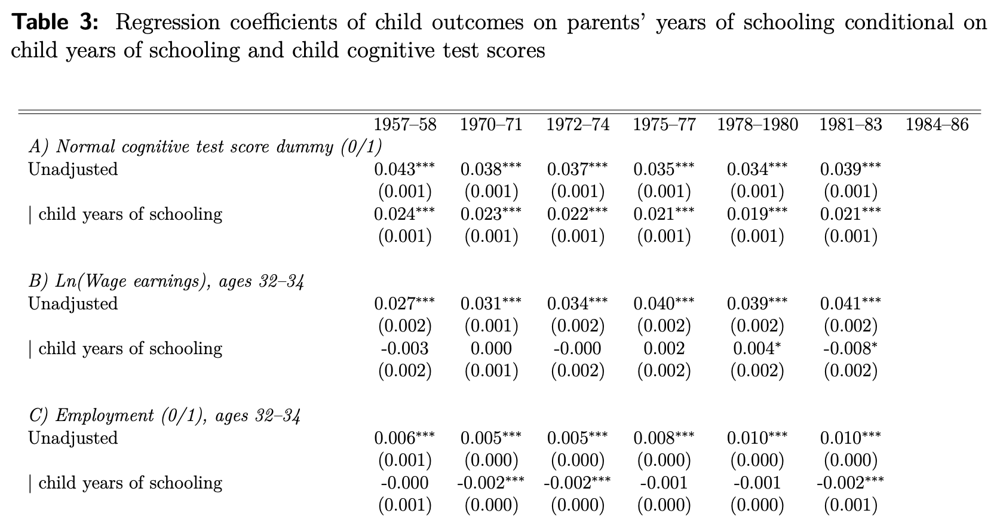

```{r setup, include = FALSE}
library(RefManageR)
library(knitr)
library(ggrepel) # Nicely placed labels in figures.
library(modelr)
library(webexercises) # Small web-based answer scales.
library(equatiomatic) # Regression equations from model objects.
library(essentials)

options(htmltools.preserve.raw = FALSE, tikzDefaultEngine = "xetex",
        htmltools.dir.version = FALSE, servr.interval = 0.5, width = 115, digits = 3)
knitr::opts_chunk$set(
  collapse = TRUE, message = FALSE, fig.retina = 3, error = TRUE,
  warning = FALSE, cache = FALSE, fig.align = 'center',
  comment = "#", strip.white = TRUE, tidy = FALSE)

BibOptions(check.entries = FALSE, 
           bib.style = "authoryear", 
           style = "markdown",
           hyperlink = FALSE,
           no.print.fields = c("doi", "url", "ISSN", "urldate", "language", "note", "isbn", "volume"))
myBib <- ReadBib("./../../../Stats_II.bib", check = FALSE)

xaringanExtra::use_xaringan_extra(c("tile_view", "tachyons"))
xaringanExtra::use_panelset()
```
# The goal of social science research

.font140[.center[.alert[Use data to discover patterns ("social facts" in Durkheim's terms), <br> and **the social mechanisms that bring them about**.]]]

```{r, echo = FALSE, out.width='70%', fig.align='center'}
knitr::include_graphics('https://liu.se/-/media/istock-501261958.jpg?mw=1120&mh=1120&hash=DA8977CCE6A6E600AE80A40CFEE771C9')
```

---
class: inverse middle center
# Today's schedule

1. Application of the day: Does education pay off?

---
class: inverse
# Application of the day

.push-left[.center[.font130[
**_Returns to education_:<br><br> Does education really pay off?**
]]]

.push-right[
```{r, echo = FALSE, out.width='65%', fig.align='center'}
knitr::include_graphics('https://c8.alamy.com/zooms/9/bfa9df51a3cd4e3199eaf06327d83679/e3r26y.jpg')
knitr::include_graphics('https://uniavisen.dk/wp-content/uploads/2019/09/customcustomsizeimmatrikulationuniavisenheddarysstad031.jpg')
```
]

---
# Isn't the answer obvious?

.left-column[
```{tikz, DAG_1, echo = FALSE, out.width='100%'}
\usetikzlibrary{shapes,decorations,arrows,calc,arrows.meta,fit,positioning,quotes}
\tikzset{
  -Latex,auto,node distance =1 cm and 1 cm,semithick,
  state/.style ={ellipse, draw, minimum width = 0.7 cm},
  point/.style = {circle, draw, inner sep=0.04cm,fill,node contents={}},
  bidirected/.style={Latex-Latex,dashed},
  el/.style = {inner sep=2pt, align=left, sloped}
}

\begin{tikzpicture}
\sffamily
\node[state, align = center] (1) at (0,0) {Education};
\node[state, align = center] (2) [right = of 1] {\$};

\path (1) edge (2);
\end{tikzpicture}
```
]

.right-column[
```{r, echo = FALSE, out.width='100%', fig.align='center'}
knitr::include_graphics('./img/Karlson_1.png')
```
.backgrnote[.center[*Source:* `r Citet(myBib, "karlson_making_2021")`]]
]

---
# No, there are confounders!

.left-column[
```{tikz, DAG_2, echo = FALSE, out.width='100%'}
\usetikzlibrary{shapes,decorations,arrows,calc,arrows.meta,fit,positioning,quotes}
\tikzset{
  -Latex,auto,node distance =1 cm and 1 cm,semithick,
  state/.style ={ellipse, draw, minimum width = 0.7 cm},
  point/.style = {circle, draw, inner sep=0.04cm,fill,node contents={}},
  bidirected/.style={Latex-Latex,dashed},
  el/.style = {inner sep=2pt, align=left, sloped}
}

\begin{tikzpicture}
\sffamily
\node[state, align = center] (1) at (0,0) {Education};
\node[state, align = center] (2) [right = of 1] {\$};
\node[state, align = center] (3) [dashed, red, above = of 1] {Parental \\ education};

\path (1) edge (2);
\path (3) edge [dashed, red] (2);
\path (3) edge [dashed, red] (1);
\end{tikzpicture}
```

```{r, echo = FALSE, out.width='100%', fig.align='center'}
knitr::include_graphics('https://www.learnliberty.org/wp-content/uploads/2017/09/Sni%CC%81mek-obrazovky-2021-11-09-v-21.24.45.png')
```
]

.right-column[
```{r, echo = FALSE, out.width='100%', fig.align='center'}

```
.backgrnote[.center[*Source:* `r Citet(myBib, "karlson_making_2021")`]]
]

---
# No, there are confounders!

.left-column[
```{tikz, DAG_3, echo = FALSE, out.width='100%'}
\usetikzlibrary{shapes,decorations,arrows,calc,arrows.meta,fit,positioning,quotes}
\tikzset{
  -Latex,auto,node distance =1 cm and 1 cm,semithick,
  state/.style ={ellipse, draw, minimum width = 0.7 cm},
  point/.style = {circle, draw, inner sep=0.04cm,fill,node contents={}},
  bidirected/.style={Latex-Latex,dashed},
  el/.style = {inner sep=2pt, align=left, sloped}
}

\begin{tikzpicture}
\sffamily
\node[state, align = center] (1) at (0,0) {Education};
\node[state, align = center] (2) [right = of 1] {\$};
\node[state, align = center] (3) [dashed, red, above = of 1] {Parental \\ education};
\node[state, align = center] (4) [dashed, red, below = of 1] {Cognitive \\ ability};

\path (1) edge (2);
\path (3) edge [dashed, red] (2);
\path (4) edge [dashed, red] (2);
\path (3) edge [dashed, red] (1);
\path (4) edge [dashed, red] (1);
\end{tikzpicture}
```
]

.right-column[
```{r, echo = FALSE, out.width='100%', fig.align='center'}

```
.backgrnote[.center[*Source:* `r Citet(myBib, "karlson_making_2021")`]]
]

---
# We need an RCT!

.push-left[
```{r, echo = FALSE, out.width='60%', fig.align='center'}
knitr::include_graphics('./img/randomization2.png')
```

- If we *randomly* divide subjects into treatment and control groups: They come from the same underlying population. 
  <br> <br> $\rightarrow$ Similar .alert[on average], *in every way*,<br> **including their $Y_{0}$ **!
  <br> <br> $\rightarrow E[Y_{0i}|D=1] = E[Y_{0i}|D=0]$!
]

.push-right[
```{tikz, DAG_RCT, echo = FALSE, out.width='70%'}
\usetikzlibrary{shapes,decorations,arrows,calc,arrows.meta,fit,positioning,quotes}
\tikzset{
  -Latex,auto,node distance =1 cm and 1 cm,semithick,
  state/.style ={ellipse, draw, minimum width = 0.7 cm},
  point/.style = {circle, draw, inner sep=0.04cm,fill,node contents={}},
  bidirected/.style={Latex-Latex,dashed},
  el/.style = {inner sep=2pt, align=left, sloped}
}

\begin{tikzpicture}
\sffamily
\node[state] (1) [red] at (0,0) {$I$};
\node[state] (2) [right = of 1] {$D$};
\node[state] (3) [dashed, above = of 2] {$C$};
\node[state] (4) [right = of 2] {$Y$};

\path (1) [red] edge ["$|r|=1$"] (2);
\path (2) edge (4);
\path (3) edge [dashed] (4);
\path (3) edge [dashed] (2);
\end{tikzpicture}
```
]

---
# `r Citet(myBib, "angrist_does_1991")` had an idea

.left-column[
```{tikz, DAG_4, echo = FALSE, out.width='100%'}
\usetikzlibrary{shapes,decorations,arrows,calc,arrows.meta,fit,positioning,quotes}
\tikzset{
  -Latex,auto,node distance =1 cm and 1 cm,semithick,
  state/.style ={ellipse, draw, minimum width = 0.7 cm},
  point/.style = {circle, draw, inner sep=0.04cm,fill,node contents={}},
  bidirected/.style={Latex-Latex,dashed},
  el/.style = {inner sep=2pt, align=left, sloped}
}

\begin{tikzpicture}
\sffamily
\node[state, align = center] (1) at (0,0) {Education};
\node[state, align = center] (2) [right = of 1] {\$};
\node[state, align = center] (3) [dashed, gray, above = of 1] {Parental \\ education};
\node[state, align = center] (4) [dashed, gray, below = of 1] {Cognitive \\ ability};
\node[state, align = center] (5) [red, left = of 1] {Quarter of \\ birth};

\path (1) edge (2);
\path (3) edge [dashed, gray] (2);
\path (4) edge [dashed, gray] (2);
\path (3) edge [dashed, gray] (1);
\path (4) edge [dashed, gray] (1);
\path (5) edge [red] (1);
\end{tikzpicture}
```
]

.right-column[
- In the US, the school year starts 1 June.
- Kids enter school in the year in which they turn 6.
- Attending school is mandatory until one turns 16.

.center[

$\rightarrow$ Dropouts' born in the 4th quarter of a year, will have one more year of education compared to those born in the first one!

]

.push-right[
**Carl**: Born 1 January 1930, enters school aged 6.5 in June 1936. He drops out on the day of his 16th birthday with 9 years of schooling.
]
.push-left[
**Luis**: Born 31 December 1930, enters school aged 5.5 in June 1936. He drops out on the day of his 16th birthday with 10 years of schooling.
]

.content-box-green[
Under which assumptions is the quarter of birth a valid instrument for years of schooling?
]]

---
# Replication

.panelset[
.panel[.panel-name[The data]
```{r}
pacman::p_load(
  tidyverse, # Data manipulation,
  ggplot2, # beautiful figures,
  texreg, # regression tables with nice layout,
  estimatr, # Regression for weighted data,
  modelr, # Turn results of lm() into a tibble,
  ivreg, # IV 2SLS,
  masteringmetrics) # Data and examples from Mastering Metrics

# Load the data from the Quarter of Birth IV study
data("ak91", package = "masteringmetrics")
ak91 <- ak91 %>%
  mutate(
    ln_wage = lnw, # Wage as adult,
    age = age, # Age
    yrs_educ = s, # Years of education,
    qrt_birth = qob) # Quarter of birth.
```
]
.panel[.panel-name[Naïv comparison]
.push-left[
```{r}
# Multiple OLS
mult_OLS = lm_robust(ln_wage ~ yrs_educ + age,
                     data = ak91)
# Regression table
screenreg(mult_OLS, include.ci = FALSE, digits = 3)
```
]]
.panel[.panel-name[The first stage]
.push-left[
```{r}
# Bivariate OLS
frst_stage <- lm_robust(yrs_educ ~ qrt_birth, 
                       data = ak91)
# Regression table
screenreg(frst_stage, include.ci = FALSE, digits = 3)
```
]
.push-right[
```{r first, out.width='100%', fig.height = 4, fig.width = 5, results = FALSE, echo = FALSE}
ggplot(data = ak91, aes( y = yrs_educ, x = qrt_birth)) +
  geom_jitter(alpha = 1/10, width = 0.1, height = 0.2) +
  geom_smooth(method = "lm", SE = FALSE) +
  theme_minimal()
```
]]
.panel[.panel-name[The reduced form]
.push-left[
```{r}
# Bivariate OLS
reduced_frm <- lm_robust(ln_wage ~ qrt_birth, 
                       data = ak91)
# Regression table
screenreg(reduced_frm, include.ci = FALSE, digits = 3)
```
]]
.panel[.panel-name[IV]
.left-column[
```{r iv, eval  = FALSE}
iv <- ivreg( # IV regression
  ln_wage ~ yrs_educ | qrt_birth, 
  data = ak91)

screenreg( # Regression table
  list(mult_OLS, frst_stage, 
       reduced_frm, iv), 
  include.ci = FALSE, digits = 3,
  custom.model.names = 
    c("OLS", "1st Stage", 
      "Reduced Form", "IV"))
```
]
.right-column[.font90[
```{r ref.label = "iv", echo = FALSE}

```
$$\text{IV} = \frac{\rho}{\phi} = \frac{`r coef(reduced_frm)["qrt_birth"]`}{`r coef(frst_stage)["qrt_birth"]`} = `r coef(reduced_frm)["qrt_birth"] / coef(frst_stage)["qrt_birth"]`$$
]]]]

---
class: inverse middle center

# Two-stage Least Squares (2SLS)

---

---
```{r}
mod8 <- ivreg(ln_wage ~ yrs_educ | qob, data = ak91)
summary(mod8)
```

---
# References

.font80[
```{r ref1, results = 'asis', echo = FALSE}
PrintBibliography(myBib)
```
]