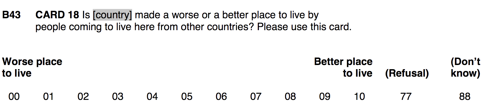

```{r setup, include = FALSE}
library(RefManageR)
library(knitr)
library(ggrepel) # Nicely placed labels in figures.
library(modelr)
library(webexercises) # Small web-based answer scales.
library(equatiomatic) # Regression equations from model objects.
library(essentials)

options(htmltools.preserve.raw = FALSE, tikzDefaultEngine = "xetex",
        htmltools.dir.version = FALSE, servr.interval = 0.5, width = 115, digits = 3)
knitr::opts_chunk$set(
  collapse = TRUE, message = FALSE, fig.retina = 3, error = TRUE,
  warning = FALSE, cache = FALSE, fig.align = 'center',
  comment = "#", strip.white = TRUE, tidy = FALSE)

BibOptions(check.entries = FALSE, 
           bib.style = "authoryear", 
           style = "markdown",
           hyperlink = FALSE,
           no.print.fields = c("doi", "url", "ISSN", "urldate", "language", "note", "isbn", "volume"))
myBib <- ReadBib("./../../../Stats_II.bib", check = FALSE)

xaringanExtra::use_xaringan_extra(c("tile_view", "tachyons"))
xaringanExtra::use_panelset()
```
# Goal of empirical sociology

.font130[.center[Use data to .alert[discover patterns], <br> and the social mechanisms that bring them about.]]

```{r, echo = FALSE, out.width='70%', fig.align='center'}
knitr::include_graphics('https://liu.se/-/media/istock-501261958.jpg?mw=1120&mh=1120&hash=DA8977CCE6A6E600AE80A40CFEE771C9')
```

---
class: inverse middle
# Today's schedule

1. Application of the day: Xenophobia and education in Denmark and Bulgaria.
  + OLS is additive.
  + Conditional relationships are multiplicative.
  + Interaction terms between a continuous and a categorical variable.

2. Application 2: Do socialism and citizenship rights interact?
  + Interaction terms between two continuous variables.

---
class: inverse 

```{r, echo = FALSE, out.width='70%', fig.align='center'}

```
<br>

.push-left[
<iframe src='https://www.dw.com/en/denmark-tells-syrian-refugees-to-return-to-damascus/a-57174584' width='700' height='430' frameborder='0' scrolling='yes'></iframe>
]

.push-right[
<iframe src='https://www.dw.com/en/why-do-so-many-refugees-avoid-bulgaria/a-18707897' width='700' height='430' frameborder='0' scrolling='yes'></iframe>
]
---
# Preparations

.panelset[
.panel[.panel-name[Get the ESS data]
.left-column[
Download the "ESS9e03_1.sav" data from Absalon. Place them into the folder for this course and where you have your R-project.
]
.right-column[
.font90[
```{r ESS}
pacman::p_load(
  tidyverse, # Data manipulation,
  haven, # Handle labelled data.
  ggplot2, # beautiful figures,
  estimatr, # Regression for weighted data,
  modelsummary) # regression tables with nice layout.

# Read the ESS round 9 data
ESS <- read_spss("../../../assets/ESS9e03_1.sav") %>%
  # Keep only Danes and Bulgarians
  filter(cntry == "DK" | cntry == "BG") %>% 
  mutate( # Define variables as categorical and continuous
    cntry = as_factor(cntry) %>% fct_relevel("Denmark"),
    gndr = as_factor(gndr),
    eduyrs = case_when( # Recode education to sensible levels
      eduyrs < 9 ~ 9,
      eduyrs > 21 ~ 21,
      TRUE ~zap_labels(eduyrs)),
    agea = zap_labels(agea),
    # Outcome: Subtract from maximum to turn the scale around
    imwbcnt = 10 - zap_labels(imwbcnt)) %>%
  # Keep only a minimum set of variables we need today,
  select(idno, cntry, pspwght, gndr, eduyrs, agea, imwbcnt) %>%
  drop_na() # Delete cases with missing values.
```
]]]
.panel[.panel-name[The resulting data]
```{r}
ESS
```
]]

---
# Multiple OLS

.panelset[
.panel[.panel-name[Denmark vis-á-vis Bulgaria]

.push-right[
.font90[
```{r OLS, echo = FALSE}
ols_bi <- lm_robust(imwbcnt ~ cntry, data = ESS, 
                    weights = pspwght)
ols_mult_1 <- lm_robust(imwbcnt ~ cntry + eduyrs, 
                        data = ESS, weights = pspwght)
ols_mult_2 <- lm_robust(imwbcnt ~ cntry + eduyrs + agea, 
                        data = ESS, weights = pspwght)

modelsummary(list("Xeno" = ols_bi, "Xeno" = ols_mult_1, "Xeno" = ols_mult_2),
             gof_map = c("nobs", "r.squared"), stars = TRUE)
```
]]

.push-left[
```{r Coefplot, fig.height = 3.5, fig.width = 5, echo = FALSE, out.width='100%'}
bind_rows( # Combine estimate results into one tibble,
  ols_bi %>% tidy(),
  ols_mult_1 %>% tidy(),
  ols_mult_2 %>% tidy(),
  .id = "model") %>%
  filter(term == "cntryBulgaria") %>% # Keep country estimates,
  mutate( # Rename the model variable,
    term = case_when(
      model == 1 ~ "Bivariate",
      model == 2 ~ "Controlled for \n education",
      model == 3 ~ "Controlled for \n education and age") %>%
      fct_relevel("Controlled for \n education and age", 
                  "Controlled for \n education",
                  "Bivariate")) %>%
  ggplot(aes(y = estimate, x = term, # Plot the results,
             ymin = conf.low, ymax = conf.high)) +
  geom_pointrange() +
  geom_hline(yintercept = 0, lty = "dashed", color = "red") +
  coord_flip() +
  labs(y = "Difference in xenophobia between
       Denmark (reference) and Bulgaria
       (10-point Likert Scale)",
       x = "") +
  theme_minimal()
```
]]
.panel[.panel-name[Code]
.push-left[
.font90[
```{r ref.label = "Coefplot", fig.show = 'hide'}
```
]]
..push-right[
.font90[
```{r ref.label = "OLS", results = FALSE}

```
]]]
.panel[.panel-name[Multiple OLS is additive]
.right-column[
.font90[
```{r echo = FALSE}
ols_equa <- lm(imwbcnt ~ cntry + eduyrs + agea, 
                        data = ESS, weights = pspwght)
```

```{r ref.label = "OLS", echo = FALSE}

```

]]
.left-column[
**Multiple OLS, so far:** Allows us to express an outcome as linear function of several continuous and categorical predictor variables. The predictors are adjusted/controlled for each other .alert[and additive].

.font70[
`r extract_eq(ols_equa, use_coefs = TRUE)`

$\rightarrow$ For a Bulgarian who is 20 and has 10 years of education, Model 3 predicts: 
$4.21 + 1.61 + (10\times -0.04) + (20 \times 0.01) = 5.62 \text{ Xeno}$

]]]
.panel[.panel-name[Additive implies linear]

.push-left[
.font90[
```{r ref.label = "OLS", echo = FALSE}

```
]]

.push-right[
```{r fig.height = 6, fig.width = 5, echo = FALSE, out.width='100%'}
library(plotly)
### Estimation of the regression plane
mod <- lm(imwbcnt ~ eduyrs + agea, 
                        data = ESS, weights = pspwght)
cf.mod <- coef(mod)

### Calculate z on a grid of x-y values
x1.seq <- seq(min(ESS$eduyrs),max(ESS$eduyrs),length.out=25)
x2.seq <- seq(min(ESS$agea),max(ESS$agea),length.out=25)
z <- t(outer(x1.seq, x2.seq, function(x,y) cf.mod[1]+cf.mod[2]*x+cf.mod[3]*y))

ESS_plot <- ESS %>% filter(imwbcnt > 3 & imwbcnt < 7) %>% sample_n(200)

#### Draw the plane with "plot_ly" and add points with "add_trace"
plot_ly(x=~x1.seq, y=~x2.seq, z=~z, type="surface") %>%
  add_trace(data=ESS_plot, x=ESS_plot$eduyrs, y=ESS_plot$agea, z=ESS_plot$imwbcnt, mode="markers", type="scatter3d",
  marker = list(color="#a6a6a6", opacity=0.7, symbol=105)) %>%
  layout(scene = list(
    xaxis = list(title = "Eduyrs"),
    yaxis = list(title = "Age"),
    zaxis = list(title = "Xeno")))
```
]]]

---
# But what if relations are conditional?

.panelset[
.panel[.panel-name[Plot]
.push-left[

.content-box-blue[
Two predictors $X_{1i}$ and $X_{2i}$ are **"conditional on each other"** or **"interact"**, when the association between the outcome $Y_{i}$ and one of the predictors depends on values of the other.
]

- The association between xenophobia and education is more negative in Denmark than in Bulgaria. 
  + .backgrnote[That is, the association between education and xenophobia depends on the country people live in.]


- The difference in average xenophobia between Danes and Bulgarians is larger among better educated people.
  + .backgrnote[That is, the association between country and xenophobia depends on people's level of education.]
]
.push-right[
```{r conditional1, fig.height = 4, fig.width = 6, echo = FALSE, out.width='90%'}
ggplot(data = ESS, aes(y = imwbcnt, x = eduyrs, color = cntry)) +
  geom_jitter(aes(size = pspwght), alpha = 1/8) +
  geom_smooth(method = "lm") +
  labs(y = "Immigration makes DK/BG \n a worse place to live",
       x = "Years of education") +
  theme_minimal() +
  theme(legend.position = "bottom") +
  guides(size = FALSE)
```
]]

.panel[.panel-name[Code]
```{r ref.label = "conditional1", eval = FALSE}

```
]]

---
# Then specify them as *multiplicative*

$$Y_{i} = \alpha + \beta_{1} X_{1} + \beta_{2}X_{2} + \color{red}{\beta_{3}(X_{1}\times X_{2})} + e_{i}$$

.push-left[
.font80[
```{r inter}
ols_inter <- lm_robust(imwbcnt ~ cntry*eduyrs, #<<
                       data = ESS, weights = pspwght)

# Report results in a regression table
modelsummary(list("Xeno" = ols_mult_1, "Xeno" = ols_inter),
             gof_map = c("nobs", "r.squared"), stars = TRUE)
```
]]

--

.push-right[
```{r ref.label = "conditional1", fig.height = 4, fig.width = 6, echo = FALSE, out.width='75%'}

```
- R *adds* an "interaction term", technically the product of the two interacted variables (i.e. $\text{Bulgaria} \times \text{Education}$).

- Thereby, multiple OLS processes the conditional relation in an additive way (aka "linearization").
]

---
# Then specify them as *multiplicative*

.push-left[
```{r}
ESS <- ESS %>% mutate(
    cntry_num = case_when(
      # Numerical cntry dummy variable,
      cntry == "Denmark" ~ 0,
      cntry == "Bulgaria" ~ 1),
    # Generate interaction term by hand
    intr_trm = cntry_num * eduyrs)

ESS %>% 
  select(idno, cntry, cntry_num, eduyrs, intr_trm)
```
]

.push-right[
```{r ref.label = "conditional1", fig.height = 4, fig.width = 6, echo = FALSE, out.width='75%'}

```
- R *adds* an "interaction term", technically the product of the two interacted variables (i.e. $\text{Bulgaria} \times \text{Education}$).

- Thereby, multiple OLS processes the conditional relation in an additive way (aka "linearization").
]

---
# Then specify them as *multiplicative*

.push-left[
.font90[
```{r}
ols_inter2 <- lm_robust(imwbcnt ~ cntry + eduyrs + intr_trm,
                       data = ESS, weights = pspwght)
# Report results in a regression table
modelsummary(list("Xeno" = ols_inter, "Xeno" = ols_inter2),
             gof_map = c("nobs", "r.squared"), stars = TRUE)
```
]]

.push-right[
```{r ref.label = "conditional1", fig.height = 4, fig.width = 6, echo = FALSE, out.width='75%'}

```
- R *adds* an "interaction term", technically the product of the two interacted variables (i.e. $\text{Bulgaria} \times \text{Education}$).

- Thereby, multiple OLS processes the conditional relation in an additive way (aka "linearization").
]

---
layout: true
class: clear
# Tricky interpretation .font70[The two conditional "Main terms"]

---
.push-left[
.font90[
```{r ref.label = "inter", echo = FALSE}
```
]]

.push-right[
```{r ref.label = "conditional1", fig.height = 4, fig.width = 6, echo = FALSE, out.width='75%'}

```
<br>

$$\beta_1\color{red}{|x_2=0} \text{ & } \beta_2\color{red}{|x_1=0}$$

$\rightarrow \beta_{\text{eduyrs}}\color{red}{|\text{Bulgaria} = 0},$

$\rightarrow \beta_{\text{Bulgaria}}\color{red}{|\text{eduyrs} = 0}.$
]

---

.push-left[
.font90[
```{r ref.label = "inter", echo = FALSE}
```
]]

.push-right[
```{r ref.label = "conditional1", fig.height = 4, fig.width = 6, echo = FALSE, out.width='75%'}

```
<br>

$$\beta_1\color{red}{|x_2=0} \text{ & } \beta_2\color{red}{|x_1=0}$$

$\rightarrow \beta_{\text{eduyrs}}\color{red}{|\text{Bulgaria} = 0}$: A year increase in education goes along with a decline of xenophobia by `r coef(ols_inter)["eduyrs"]` scale points, .alert[if Bulgaria = 0]. $\rightarrow$ .alert[In Denmark]

$\rightarrow \beta_{\text{Bulgaria}}\color{red}{|\text{eduyrs} = 0}.$
]

---

.push-left[
.font90[
```{r ref.label = "inter", echo = FALSE}
```
]]

.push-right[
```{r conditional2, fig.height = 4, fig.width = 6, echo = FALSE, out.width='75%'}
ggplot(data = ESS, aes(y = imwbcnt, x = eduyrs, color = cntry)) +
  geom_jitter(aes(size = pspwght), alpha = 1/8) +
  geom_vline(xintercept = 0, color = "red") +
  geom_smooth(method = "lm", fullrange=TRUE) +
  labs(y = "Immigration makes DK/BG \n a worse place to live",
       x = "Years of education") +
  theme_minimal() +
  scale_x_continuous(limits = c(0, 21)) +
  theme(legend.position = "bottom") +
  guides(size = FALSE)
```
<br>

$$\beta_1\color{red}{|x_2=0} \text{ & } \beta_2\color{red}{|x_1=0}$$

$\rightarrow \beta_{\text{eduyrs}}\color{red}{|\text{Bulgaria} = 0}$: A year increase in education goes along with a decline of xenophobia by `r coef(ols_inter)["eduyrs"]` scale points, .alert[if Bulgaria = 0]. $\rightarrow$ .alert[In Denmark].

$\rightarrow \beta_{\text{Bulgaria}}\color{red}{|\text{eduyrs} = 0}.$
]

---
layout: false
class: clear
# Solution: Rescale .font70[(e.g. mean center, or z-standardize)]

.push-left[
```{r}
ESS <- ESS %>% mutate(
    # Center education around the mean of education.
    mc_eduyrs = eduyrs - mean(eduyrs, na.rm = TRUE))

summary(ESS$mc_eduyrs)
```
]
.push-right[
```{r conditional3, fig.height = 4, fig.width = 6, echo = FALSE, out.width='100%'}
ggplot(data = ESS, aes(y = imwbcnt, x = mc_eduyrs, color = cntry)) +
  geom_jitter(aes(size = pspwght), alpha = 1/8) +
  geom_vline(xintercept = 0, color = "red") +
  geom_smooth(method = "lm", fullrange=TRUE) +
  labs(y = "Immigration makes DK/BG \n a worse place to live",
       x = "Years of education \n (centered around the mean)") +
  theme_minimal() +
  scale_x_continuous(limits = c(-5, 8), breaks = c(-4, -2, 0, 2, 4, 6, 8)) +
  theme(legend.position = "bottom") +
  guides(size = FALSE)
```
]

---
layout: true
class: clear
# Improved interpretation .font70[The two conditional "Main terms"]

---

.push-left[
```{r inter2, echo = FALSE}
ols_inter3 <- lm_robust(imwbcnt ~ cntry*mc_eduyrs,
                       data = ESS, weights = pspwght)
# Report results in a regression table
modelsummary(list("Xeno" = ols_inter, "Xeno" = ols_inter3),
             gof_map = c("nobs", "r.squared"), stars = TRUE)
```
]

.push-right[
```{r ref.label = "conditional3", fig.height = 4, fig.width = 6, echo = FALSE, out.width='75%'}
```
<br>

$$\beta_1\color{red}{|x_2=0} \text{ & } \beta_2\color{red}{|x_1=0}$$

$\rightarrow \beta_{\text{eduyrs}}\color{red}{|\text{Bulgaria} = 0}$: A year increase in education goes along with a decline of xenophobia by `r coef(ols_inter)["eduyrs"]` scale points, .alert[if Bulgaria = 0]. $\rightarrow$ .alert[In Denmark].

$\rightarrow \beta_{\text{Bulgaria}}\color{red}{|\text{eduyrs} = 0}.$
]

---

.push-left[

```{r ref.label = "inter2", echo = FALSE}

```
]

.push-right[
```{r ref.label = "conditional3", fig.height = 4, fig.width = 6, echo = FALSE, out.width='50%'}
```
<br>

$$\beta_1\color{red}{|x_2=0} \text{ & } \beta_2\color{red}{|x_1=0}$$

$\rightarrow \beta_{\text{eduyrs}}\color{red}{|\text{Bulgaria} = 0}$: A year increase in education goes along with a decline of xenophobia by `r coef(ols_inter)["eduyrs"]` scale points, .alert[if Bulgaria = 0]. $\rightarrow$ .alert[In Denmark].

$\rightarrow \beta_{\text{Bulgaria}}\color{red}{|\text{eduyrs} = 0}$: Bulgarians are, on average, `r coef(ols_inter3)["cntryBulgaria"]` scale points more xenophobic than Danes, .alert[if education = 0]. $\rightarrow$ .alert[Among persons with an average level of education].

]

---
layout: true
class: clear
# Interpretation .font70[The "Interaction term" *alters* the main terms]

.push-left[
The interaction term, $\beta_3(X_{1i}\times X_{2i})$, can be interpreted in two ways
```{r inter3, echo = FALSE}
# Report results in a regression table
modelsummary(list("Xeno" = ols_inter3),
             gof_map = c("nobs", "r.squared"), stars = TRUE)
```
]

---

.push-right[
```{r ref.label = "conditional3", fig.height = 4, fig.width = 6, echo = FALSE, out.width='66%'}
```
<br>

1) When the variable `cntryBulgaria` increases by one unit, $\beta_{\text{Educ}}$ increases by $\beta_{3}$. 
  + In Bulgaria, the association between education and xenophobia is $`r coef(ols_inter3)["mc_eduyrs"]` + `r coef(ols_inter3)["cntryBulgaria:mc_eduyrs"]` = `r coef(ols_inter3)["mc_eduyrs"] + coef(ols_inter3)["cntryBulgaria:mc_eduyrs"]`$.
  + The difference in $\beta_{\text{Educ}}$ between Denmark and Bulgaria is `r coef(ols_inter3)["cntryBulgaria:mc_eduyrs"]`.

]

---

.push-right[
```{r ref.label = "conditional3", fig.height = 4, fig.width = 6, echo = FALSE, out.width='66%'}
```
<br>

2) When the variable `mc_eduyrs` increases by one unit, $\beta_{\text{cntryBulgaria}}$ increases by $\beta_{3}$.
  + Among the best educated (i.e. 8 years more than the average), the xenophobia gap between Danes and Bulgarians is $`r coef(ols_inter3)["cntryBulgaria"]` + 8 \times `r coef(ols_inter3)["cntryBulgaria:mc_eduyrs"]` = `r coef(ols_inter3)["cntryBulgaria"] + (8 * coef(ols_inter3)["cntryBulgaria:mc_eduyrs"])`$
  + With every year of education, the average xenophobia gap between Danes and Bulgarians changes by `r coef(ols_inter3)["cntryBulgaria:mc_eduyrs"]`.

]

---
layout: false
# Another example

.panelset[
.panel[.panel-name[Age and gender]
.left-column[
.font90[
```{r inter_another, echo = FALSE}
ols_inter <- lm_robust(imwbcnt ~ mc_eduyrs*gndr,
                       data = ESS, weights = pspwght)
# Report results in a regression table
modelsummary(list("Xeno" = ols_inter),
             gof_map = c("nobs", "r.squared"), stars = TRUE)
```
]]
.right-column[
```{r conditional4, fig.height = 4, fig.width = 6, echo = FALSE, out.width='90%'}
ggplot(data = ESS, aes(y = imwbcnt, x = mc_eduyrs, color = gndr)) +
  geom_jitter(aes(size = pspwght), alpha = 1/8) +
  geom_vline(xintercept = 0, color = "red") +
  geom_smooth(method = "lm", fullrange=TRUE) +
  labs(y = "Immigration makes DK/BG \n a worse place to live",
       x = "Years of education \n (centered around the mean)") +
  theme_minimal() +
  scale_x_continuous(limits = c(-5, 8), breaks = c(-4, -2, 0, 2, 4, 6, 8)) +
  theme(legend.position = "bottom") +
  guides(size = FALSE)
```
]]
.panel[.panel-name[Interpretation Main terms]

.left-column[
.font90[
```{r ref.label = "inter_another", echo = FALSE}

```
]]
.right-column[
```{r ref.label = "conditional4", fig.height = 4, fig.width = 6, echo = FALSE, out.width='45%'}
```
$\rightarrow \beta_{Educ}|\text{Female}=0$: Among men, an additional year of education is significantly associated with `r coef(ols_inter)["mc_eduyrs"]` scale points less xenophobia.

$\rightarrow \beta_{Female}|\text{Educ}=0$: At average levels of education, the gender gap in xenophobia is `r coef(ols_inter)["gndrFemale"]` but insignificant.
]]
.panel[.panel-name[Interpretation Interaction term]

.left-column[
.font90[
```{r ref.label = "inter_another", echo = FALSE}

```
]]
.right-column[
```{r ref.label = "conditional4", fig.height = 4, fig.width = 6, echo = FALSE, out.width='45%'}
```

1) The association between education and xenophobia among women is $`r coef(ols_inter)["mc_eduyrs"]` + `r coef(ols_inter)["mc_eduyrs:gndrFemale"]`= `r coef(ols_inter)["mc_eduyrs"] + coef(ols_inter)["mc_eduyrs:gndrFemale"]`$. This is `r coef(ols_inter)["mc_eduyrs:gndrFemale"]` more negative than the association among men, but this different in slopes is not significant.

2) With every year increase of education, the gender gap in xenophobia declines by `r coef(ols_inter)["mc_eduyrs:gndrFemale"]`. At two years more education than the average citizen, the gender gap is $`r coef(ols_inter)["gndrFemale"]` + 2\times `r coef(ols_inter)["mc_eduyrs:gndrFemale"]`= `r coef(ols_inter)["gndrFemale"] + (2 * coef(ols_inter)["mc_eduyrs:gndrFemale"])`$ scale points, but (probably) insignificant.


]]
.panel[.panel-name[Code]
.push-left[
```{r ref.label = "inter_another", results = FALSE}

```
]

.push-right[
```{r ref.label = "conditional4", fig.show='hide'}
```
]]]


---
# Control for potential confounders .font70[Easy ...]

.push-left[
```{r inter4, echo = FALSE}
ols_inter4 <- lm_robust(imwbcnt ~ cntry*mc_eduyrs + gndr + agea,
                       data = ESS, weights = pspwght)
# Report results in a regression table
modelsummary(list("Xeno" = ols_inter3, "Xeno" = ols_inter4),
             gof_map = c("nobs", "r.squared"), stars = TRUE)
```
]

---
# Visualize!

.push-left[
```{r ref.label = "inter4", echo = FALSE}

```
]

.push-right[
.panelset[
.panel[.panel-name[Fictional data]
.font90[
```{r}
(fict_dat <- tibble(
  # Repeat the vector -5:8, each element twice #<<
  mc_eduyrs = rep(-5:8, each = 2), #<<
  # Repeat DK/BG 14 times #<<
  cntry = rep(c("Denmark", "Bulgaria"), 14), #<<
  # Set controls to constant value
  gndr = "Female",
  agea = mean(ESS$agea, na.rm = TRUE)))
```
]]
.panel[.panel-name[Predictions]
.font90[
```{r}
(fict_dat <- predict( #<<
  ols_inter4, newdata = fict_dat, #<<
  interval = "confidence", level = 0.95)$fit %>% #<<
   as_tibble() %>% # Turn into a tibble, then
   bind_cols(fict_dat, .)) # Add to the synthetic data.
```
]]
.panel[.panel-name[Plot]
```{r predictions, fig.height = 4, fig.width = 5, echo = FALSE, out.width='90%'}
ggplot(data = fict_dat, aes(y = fit, x = mc_eduyrs)) +
  geom_ribbon(aes(ymin = lwr, ymax = upr, fill = cntry), alpha = 0.5) +
  geom_line(aes(color = cntry)) +
  labs(
    fill = "Country:", color = "Country:",
    title = "Predictions based on multiple OLS",
    x = "By mean-centered years of education
    (At average age and gender set to women)",
    y = "Predicted xenophobia") +
  theme_minimal() +
  theme(legend.position = "bottom")
```
]
.panel[.panel-name[Code]
```{r ref.label = "predictions", fig.show = 'hide'}
```
]]]

---
class: inverse middle center
# Break

<iframe src='https://www.online-timer.net/' width='400' height='385' frameborder='0' scrolling='yes'></iframe>

---
class: middle clear

.left-column[
```{r, echo = FALSE, out.width='80%'}
knitr::include_graphics('https://www.laserfiche.com/wp-content/uploads/2014/10/femalecoder.jpg')
```

<iframe src='https://www.online-timer.net/' width='400' height='385' frameborder='0' scrolling='yes'></iframe>
]

.right-column[
<br>
<iframe src='exercise1.html' width='1000' height='600' frameborder='0' scrolling='yes'></iframe>
]

---
class: inverse middle center
# Break

<iframe src='https://www.online-timer.net/' width='400' height='385' frameborder='0' scrolling='yes'></iframe>

---
class: inverse
# Revised research question

.center[.font140[
Is socialism good at reducing poverty if combined with citizenship rights,<br><br> but not good at it if under autocratic rule?
]]

<br>
.push-left[
```{r, echo = FALSE, out.width='90%'}
knitr::include_graphics('https://miro.medium.com/max/1280/1*8Y_EPw2a67TRRos3b24YlA.jpeg')
```
]

.push-right[
```{r, echo = FALSE, out.width='96%'}
knitr::include_graphics('https://almayasabdam.com/wp-content/uploads/2020/09/1496441134_communists.png')
```
]

---
class: inverse
# Revised research question

.center[.font140[
Is socialism good at reducing poverty if combined with citizenship rights,<br><br> but not good at it if under autocratic rule?
]]

```{r include = FALSE}
pacman::p_load(
  tidyverse, # Data manipulation,
  ggplot2, # beautiful figures,
  wbstats, # download data from Worldbank. Tremendous source of global socio-economic data.
  estimatr, # OLS with robust SE,
  democracyData, # download democracy data used in the scholarly literature.
  countrycode, # Easy recodings of country names,
  modelsummary, # regression tables with nice layout,
  remotes) # Install beta version packages from GitHub.

# 1. Download Freedom House data for all countries since 1972,
Dat_citi_rights <- download_fh(verbose = FALSE) %>% 
   rename(country = fh_country, # rename country ID,
          citizen_rights = fh_total_reversed, # rename Citizenship rights indicator,
          date = year) %>% # rename year,
   select(country, date, citizen_rights) # Keep only these 3 variables.

# 2. Download poverty data: <US$2.15 per day
Dat_poverty <- wb_data("SI.POV.DDAY", 
                        start_date = 2002, end_date = 2022) %>% #<<
   rename(poverty = SI.POV.DDAY) %>% # rename poverty variable,
   select(country, date, poverty) %>% # Keep only 3 variables
   drop_na(poverty) %>% # Drop cases with missing data,
   group_by(country) %>% # Group by country,
   filter(date == max(date)) %>% # Keep the most recent data per country.
   ungroup()

# 3. Join Freedom House and Worldbank data
Dat <- inner_join(Dat_poverty, Dat_citi_rights, by = c("country", "date"))

# 4. Code socialism index
Dat <- Dat %>% mutate(socialist = case_when( # Years socialist minus years since,
  country == "China" ~ date - 1949,
  country == "Vietnam" ~ date - 1945,
  country == "Algeria" ~ date - 1962,
  str_detect(country,"Portugal|Bangladesh") ~ date - 1972,
  country == "Guinea-Bissau" ~ date - 1973,
  country == "India" ~ date - 1976,
  country == "Nicaragua" ~ date - 1979,
  country == "Sri Lanka" ~ date - 1978,
  country == "Tanzania" ~ date - 1964,
  country == "Albania" ~ (1992 - 1944) - (date - 1992),
  str_detect(country, "Angola|Cabo Verde|Madagascar") ~ (1992 - 1975) - (date - 1992),
  str_detect(country,"Belarus|Bulgaria") ~ (1990 - 1946) - (date - 1990),
  str_detect(country, "Benin|Mozambique") ~ (1990 - 1975) - (date - 1990),
  country == "Chad" ~ (1975 - 1962) - (date - 1975), country == "Congo, Rep." ~ (1992 - 1970) - (date - 1992),
  country == "Czech Republic" ~ (1990 - 1948) - (date - 1990), country == "Djibouti" ~ (1992 - 1981) - (date - 1992),
  country == "Ethiopia" ~ (1991 - 1974) - (date - 1991), country == "Ghana" ~ (1966 - 1960) - (date - 1966),
  country == "Guinea" ~ (1984 - 1958) - (date - 1984), country == "Hungary" ~ (1989 - 1949) - (date - 1989),
  country == "Iraq" ~ (2005 - 1958) - (date - 2005), country == "Mali" ~ (1991 - 1960) - (date - 1991),
  country == "Mauritania" ~ (1978 - 1961) - (date - 1978), country == "Mongolia" ~ (1992 - 1924) - (date - 1992),
  country == "Myanmar" ~ (1988 - 1962) - (date - 1988), country == "Poland" ~ (1989 - 1945) - (date - 1989),
  country == "Romania" ~ (1989 - 1947) - (date - 1989), country == "Russian Federation" ~ (1991 - 1922) - (date - 1991),
  country == "Seychelles" ~ (1991 - 1977) - (date - 1991), country == "Senegal" ~ (1981 - 1960) - (date - 1981),
  country == "Sierra Leone" ~ (1991 - 1978) - (date - 1991), country == "Somalia" ~ (1991 - 1969) - (date - 1991),
  country == "Sudan" ~ (1985 - 1969) - (date - 1985), country == "Syria" ~ (2012 - 1963) - (date - 2012),
  country == "Tunisia" ~ (1988 - 1964) - (date - 1988), country == "Ukraine" ~ (1991 - 1919) - (date - 1991),
  country == "Yemen, Rep." ~ (1991 - 1967) - (date - 1991), country == "Zambia" ~ (1991 - 1973) - (date - 1991),
  str_detect(country,"Slovenia|Croatia|Serbia|Montenegro|Bosnia and Herzegovina|North Macedonia|Kosovo") ~ (1992 - 1943) - (date - 1992),
  TRUE ~ 0),
  socialist = case_when( # Min. 5 years given socialist history,
    (socialist < 5 & socialist > 0) | socialist < 0 ~ 5,
    TRUE ~ socialist)) %>% drop_na() # Drop countries with missing values.
```

<br>
.push-left[
```{r socialism-corr1, out.width='90%', fig.height = 5, fig.width = 7, results = FALSE, echo = FALSE}
ggplot(data = Dat, 
       aes(y = poverty, x = socialist, label = country)) +
  geom_smooth(method = "lm") +
  geom_text() +
  geom_label_repel(data = Dat %>% filter(country == "Denmark"), 
                   show.legend = FALSE, color = "#901A1E",
                   alpha = 0.8, segment.curvature = -0.1,
                   segment.ncp = 4, segment.angle = 10,
                   size = 5, box.padding = 1.5,
                   point.padding = 0.5, force = 100,
                   segment.size  = 1) +
  labs(y = "% population with less than 5.50$ a day", 
       x = "Our Socialism index") +
  theme_minimal()
```
]

.push-right[
```{r citizen-corr1, out.width='90%', fig.height = 5, fig.width = 7, results = FALSE, echo = FALSE}
ggplot(data = Dat, 
       aes(y = poverty, x = citizen_rights, label = country)) +
  geom_smooth(method = "lm") +
  geom_text() +
  geom_label_repel(data = Dat %>% filter(country == "Denmark"), 
                   show.legend = FALSE, color = "#901A1E",
                   alpha = 0.8, segment.curvature = -0.1,
                   segment.ncp = 4, segment.angle = 10,
                   size = 5, box.padding = 1.5,
                   point.padding = 0.5, force = 100,
                   segment.size  = 1) +
  labs(y = "% population with less than 5.50$ a day", 
       x = "Freedom House Index of Citizenship Rights") +
  theme_minimal()
```
]

---
class: clear
# Interaction of two continuous variables

.panelset[
.panel[.panel-name[Additive multiple OLS]
.push-left[
```{r socialism1, echo = FALSE}
# Same data as Lecture 2 
Dat <- Dat %>% mutate( # Mean-center predictors
  mc_socialist = socialist - mean(socialist, na.rm = TRUE),
  mc_citizen_rights = citizen_rights - mean(citizen_rights, na.rm = TRUE))

# Multiple OLS
ols_add <- lm_robust(poverty ~ mc_socialist + mc_citizen_rights, data = Dat)

# Report results in a regression table
modelsummary(list("Poverty" = ols_add),
             gof_map = c("nobs", "r.squared"), stars = TRUE)
```
]
.push-right[
```{r fig.height = 5, fig.width = 5, echo = FALSE, out.width='80%'}
library(rockchalk)
plotPlane(ols_add, "mc_citizen_rights", "mc_socialist", pch=16, alty=1,alwd=1, theta=50, phi=10)
```
]]
.panel[.panel-name[Interactions imply non-linearity!]
.push-left[
```{r socialism2, echo = FALSE, .fig.show = 'hide'}
# Same data as Lecture 2 
Dat <- Dat %>% mutate( # Mean-center predictors
  mc_socialist = socialist - mean(socialist, na.rm = TRUE),
  mc_citizen_rights = citizen_rights - mean(citizen_rights, na.rm = TRUE))

# Multiple OLS
ols_inter <- lm_robust(poverty ~ mc_socialist*mc_citizen_rights, data = Dat)

# Report results in a regression table
modelsummary(list("Poverty" = ols_add, "Poverty" = ols_inter),
             gof_map = c("nobs", "r.squared"), stars = TRUE)

# The 3-D plot
library(rockchalk)
plotPlane(ols_inter, "mc_citizen_rights", "mc_socialist", pch=16, alty=1,alwd=1, theta=50, phi=10)
```
]

.push-right[
```{r fig.height = 5, fig.width = 5, echo = FALSE, out.width='80%'}
plotPlane(ols_inter, "mc_citizen_rights", "mc_socialist", pch=16, alty=1,alwd=1, theta=35, phi=20)
```
]]
.panel[.panel-name[Interpretation]
.push-left[
```{r ref.label = "socialism2", echo = FALSE}

```
]
.push-right[
$\beta_{\text{Socialism}}|\text{Citizen Rights}=0$: At average levels of citizenship rights, socialism is significantly (but only marginally) related to declines in poverty.

$\beta_{\text{Citizen Rights}}|\text{Socialism}=0$: At average levels of socialism, a unit increase in citizenship rights is significantly related to a `r coef(ols_inter)["mc_citizen_rights"]` percentage point decline in poverty.

$$\beta_{\text{Socialism} \times \text{Citizen Rights}}$$
1) With every unit more citizenship rights, socialism gets `r coef(ols_inter)["mc_socialist:mc_citizen_rights"]` percentage points worse at being related to declines in poverty.

2) With every additional year of socialism, citizenship rights are `r coef(ols_inter)["mc_socialist:mc_citizen_rights"]` percentage points less associated with declines in poverty.

]]
.panel[.panel-name[Code]
```{r ref.label = "socialism2", eval = FALSE}
```
]]

---
class: inverse middle center

.font150[
Are citizenship rights off-setting the benefits of socialism?

Or

Is socialism off-setting the benefits of citizenship rights?

<br> <br>

$\rightarrow$ We would need a clever *causal research design* to answer that!
]
---
layout: false
class: inverse
# Today's general lessons

1. *Interaction*: When the association between an outcome and one predictor depends on the values of another predictor, the two predictors are said to be "conditional on each other" or to "interact."

2. *Interaction Term*: A mathematical expression that captures the interaction effect between two predictors. It is typically created by multiplying the two variables involved in the interaction.

3. *Interpreting Interaction Terms*:
  + *Main Effects*: The relationship between each predictor and the outcome when the other predictor is held at zero.
  + *Interaction Effect*: The change in the relationship between a predictor and the outcome as the other predictor increases by one unit, and vice versa.

4. *Visualization*: Due to the complexity of interaction terms, visualizing them using predictions is recommended.
