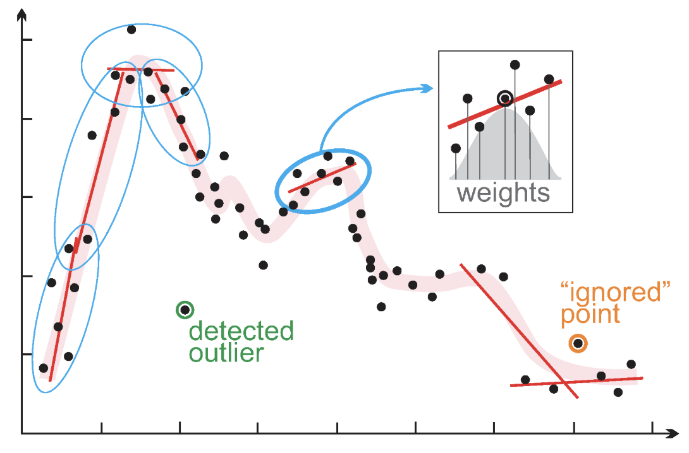

```{r setup, include = FALSE}
library(RefManageR)
library(knitr)
library(ggrepel) # Nicely placed labels in figures.
library(modelr)
library(webexercises) # Small web-based answer scales.
library(equatiomatic) # Regression equations from model objects.
library(essentials)

options(htmltools.preserve.raw = FALSE, tikzDefaultEngine = "xetex",
        htmltools.dir.version = FALSE, servr.interval = 0.5, width = 115, digits = 3)
knitr::opts_chunk$set(
  collapse = TRUE, message = FALSE, fig.retina = 3, error = TRUE,
  warning = FALSE, cache = FALSE, fig.align = 'center',
  comment = "#", strip.white = TRUE, tidy = FALSE)

BibOptions(check.entries = FALSE, 
           bib.style = "authoryear", 
           style = "markdown",
           hyperlink = FALSE,
           no.print.fields = c("doi", "url", "ISSN", "urldate", "language", "note", "isbn", "volume"))
myBib <- ReadBib("./../../../Stats_II.bib", check = FALSE)

xaringanExtra::use_xaringan_extra(c("tile_view", "tachyons"))
xaringanExtra::use_panelset()
```
# Goal of empirical sociology

.font130[.center[Use data to .alert[discover patterns], <br> and the social mechanisms that bring them about.]]

```{r, echo = FALSE, out.width='70%', fig.align='center'}
knitr::include_graphics('https://researchleap.com/wp-content/uploads/2021/12/Population-data.jpeg')
```

---
class: inverse middle
# Today's schedule

Application of the day: Life expectancy at birth!
1. Recap: Interaction terms.
2. LOESS (locally estimated scatterplot smoothing)
3. Polynomials
  + Polynomials as interaction terms
  + Higher order polynomials
4. Data transformations
  + $\log_2$

---
layout: true
class: inverse 
# Life expectancy at birth

.push-left[
```{r, echo = FALSE, out.width='65%', fig.align='center'}
knitr::include_graphics('https://upload.wikimedia.org/wikipedia/commons/thumb/4/4d/The_newborn_baby_in_men.jpg/1920px-The_newborn_baby_in_men.jpg')
knitr::include_graphics('https://ychef.files.bbci.co.uk/976x549/p086k2k4.jpg')
```
]

---

.push-right[
<iframe src="https://ourworldindata.org/grapher/life-expectancy?tab=chart&time=1770..2019&country=Africa~Asia~Europe~OWID_WRL~Americas~Oceania" loading="lazy" style="width: 100%; height: 500px; border: 0px none;"></iframe>
]

---

.push-right[
<iframe src="https://ourworldindata.org/grapher/life-expectancy-unwpp?tab=chart&country=Europe+%28UN%29~Africa+%28UN%29~Asia+%28UN%29~Oceania+%28UN%29~Northern+America+%28UN%29~Latin+America+and+the+Caribbean+%28UN%29" loading="lazy" style="width: 100%; height: 500px; border: 0px none;" allow="web-share; clipboard-write"></iframe>
]
---
layout: false
class: inverse 
# Is life expectacy simply a (linear) function of<br> how much money we spend on health?

<iframe src="https://ourworldindata.org/grapher/total-healthcare-expenditure-gdp" loading="lazy" style="width: 90%; height: 450px; border: 0px none;"></iframe>

---
# Preparations

.panelset[
.panel[.panel-name[Woldbank health data]
```{r WB}
pacman::p_load(
  tidyverse, # Data manipulation,
  ggplot2, # beautiful figures,
  wbstats, # download data from Worldbank. Tremendous source of global socio-economic data.
  estimatr, # OLS with robust SE
  modelsummary, # regression tables with nice layout,
  directlabels, # Labels addded to ggplot2 lines,
  rockchalk, # 3d plots of interaction effects,
  vdemdata) # Use varieties of democracy data

Dat_life <- wb_data(
  # Download Life expectancy and healthcare expenditures data.
  c("SP.DYN.LE00.IN", "SH.XPD.CHEX.PP.CD"), #<<
  start_date = 2000, end_date = 2025) %>%
  rename(LifeExpect = SP.DYN.LE00.IN, # rename health variables, #<<
         HealthExp = SH.XPD.CHEX.PP.CD, #<<
         year = date, # rename year variable,
         country_text_id = iso3c) %>%
  select(country_text_id, country, year, LifeExpect, HealthExp) %>% # Keep only 4 variables
  drop_na(LifeExpect, HealthExp) # Drop cases with missing data
```
]
.panel[.panel-name[Join citizenship rights]
```{r Citizen}
Dat_vdem <- vdem %>% # The data are part of the package we loaded earlier
   as_tibble() %>% # turn into a tiblle
   select(country_name, country_text_id, year, v2xcl_rol) %>%
   rename(equal_liberty = v2xcl_rol) # rename liberty variable

# Join Worldbank Health and Citizenship rights data
Dat <- inner_join(Dat_life, Dat_vdem, by = c("country_text_id", "year"))
```
]
.panel[.panel-name[Add socialism]
.font60[
```{r join}
Dat <- Dat %>% mutate(
  socialist = case_when( # Years socialist minus years since not socialist anymore,
    country == "China" ~ year - 1949,
    country == "Viet Nam" ~ year - 1945,
    country == "Algeria" ~ year - 1962,
    str_detect(country,"Portugal|Bangladesh") ~ year - 1972,
    country == "Guinea-Bissau" ~ year - 1973, country == "India" ~ year - 1976, 
    country == "Nicaragua" ~ year - 1979, country == "Sri Lanka" ~ year - 1978,
    country == "Tanzania" ~ year - 1964, country == "Albania" ~ (1992 - 1944) - (year - 1992),
    str_detect(country, "Angola|Cabo Verde|Madagascar") ~ (1992 - 1975) - (year - 1992),
    str_detect(country,"Belarus|Bulgaria") ~ (1990 - 1946) - (year - 1990),
    str_detect(country, "Benin|Mozambique") ~ (1990 - 1975) - (year - 1990),
    country == "Chad" ~ (1975 - 1962) - (year - 1975), country == "Congo, Rep." ~ (1992 - 1970) - (year - 1992),
    country == "Czech Republic" ~ (1990 - 1948) - (year - 1990), country == "Djibouti" ~ (1992 - 1981) - (year - 1992),
    country == "Ethiopia" ~ (1991 - 1974) - (year - 1991), country == "Ghana" ~ (1966 - 1960) - (year - 1966),
    country == "Guinea" ~ (1984 - 1958) - (year - 1984), country == "Hungary" ~ (1989 - 1949) - (year - 1989),
    country == "Iraq" ~ (2005 - 1958) - (year - 2005), country == "Mali" ~ (1991 - 1960) - (year - 1991),
    country == "Mauritania" ~ (1978 - 1961) - (year - 1978), country == "Mongolia" ~ (1992 - 1924) - (year - 1992),
    country == "Myanmar" ~ (1988 - 1962) - (year - 1988), country == "Poland" ~ (1989 - 1945) - (year - 1989),
    country == "Romania" ~ (1989 - 1947) - (year - 1989), country == "Russian Federation" ~ (1991 - 1922) - (year - 1991),
    country == "Seychelles" ~ (1991 - 1977) - (year - 1991), country == "Senegal" ~ (1981 - 1960) - (year - 1981),
    country == "Sierra Leone" ~ (1991 - 1978) - (year - 1991), country == "Somalia" ~ (1991 - 1969) - (year - 1991),
    country == "Sudan" ~ (1985 - 1969) - (year - 1985), country == "Syria" ~ (2012 - 1963) - (year - 2012),
    country == "Tunisia" ~ (1988 - 1964) - (year - 1988), country == "Ukraine" ~ (1991 - 1919) - (year - 1991),
    country == "Yemen, Rep." ~ (1991 - 1967) - (year - 1991), country == "Zambia" ~ (1991 - 1973) - (year - 1991),
    str_detect(country,"Slovenia|Croatia|Serbia|Montenegro|Bosnia and Herzegovina|North Macedonia|Kosovo") ~ (1992 - 1943) - (year - 1992),
    TRUE ~ 0),
  socialist = case_when( # Min. 5 years given any socialist history,
    socialist != 0 & socialist < 5 ~ 5,
    TRUE ~ socialist)) %>% drop_na() # Drop countries with missing values.
```
]]
.panel[.panel-name[The resulting data]
```{r}
Dat
```
]]

---
class: clear
# Development of life expectancy at birth

.panelset[
.panel[.panel-name[Some country trends]
```{r LifeExp1, out.width='55%', fig.height = 5, fig.width = 7, echo = FALSE}
ggplot(data = Dat %>%  # Start of the ggplot function, specifying the data to be used
         # Filter the data to include only these four countries
         filter(country == "Denmark" | country == "Switzerland" | country == "Germany" | country == "Sweden"),  
       # Define the aesthetics: LifeExpect on y-axis, HealthExp on x-axis, color by country
       aes(y = LifeExpect, x = HealthExp, color = country)) +  
  geom_line(alpha = 0.5) +  # Add lines to the plot with a transparency of 0.5
  # Add text labels to the plot, using the 'date' column for labels, with a size of 2.3
  geom_text(aes(label = year), size = 2.3) +  
  guides(color = FALSE) +  # Remove the legend for color
  scale_x_continuous(expand=c(0, 1300)) +  # Adjust the x-axis scale, adding 1300 units of space to the right 
  # Add direct labels to the lines, placing them at the last points of each line
  geom_dl(aes(label = country), method = list(dl.combine("last.points"))) + 
  labs(y = "Life expectacy at birth",  # Set the y-axis label
       x = "Health expenditure per capita in $") +  # Set the x-axis label
  theme_minimal()  # Use a minimal theme for the plot
```
]
.panel[.panel-name[Code]
```{r ref.label = "LifeExp1", out.width='90%', fig.height = 5, fig.width = 7, fig.show = "hide"}
```
]]

---
class: inverse center middle

# Recap: Interaction effects

---
# Recap: Interaction effects

.push-left[
.font80[
```{r out.width='50%', fig.height = 5, fig.width = 5}
ols_1 <- lm_robust(
  LifeExpect ~ socialist*equal_liberty, data = Dat,
  clusters = country) # Note that we need to specify this argument, #<<
# because the observations are not independent! #<<
# They are repeated observations of the same countries. #<<

# 3D plot of interaction. Controls set to their mean.
plotPlane(ols_1, "equal_liberty", "socialist", theta = 35, phi = 20)
```
```{r LifeExp2, results = 'hide'}
modelsummary(list("Life Exp." = ols_1),
             gof_map = c("nobs", "r.squared"), 
             stars = TRUE, output = "gt")
```
]]

.push-right[
.font80[
```{r ref.label = "LifeExp2", echo = FALSE}
```
]]

---
class: inverse center middle

# The problem: Non-linear relationships

---
# Health expenditures

.push-left[
.font80[
```{r I-ols, echo = FALSE}
ols_2 <- lm_robust(
  # I() transforms x #<<
  LifeExpect ~ I(HealthExp / 1000) + # 1 unit increase = $1000 #<<
    year + socialist*equal_liberty, 
  data = Dat, clusters = country)
```
```{r, echo = FALSE}
modelsummary(list("Life Exp." = ols_2),
             gof_map = c("nobs", "r.squared"), 
             stars = TRUE, output = "gt")
```
]]

--

.push-right[
.font90[
```{r I-ols, results = 'hide'}
```
```{r LifeExp3, out.width='90%', fig.height = 5, fig.width = 7, echo = FALSE}
ggplot(data = Dat, aes(y = LifeExpect, x = HealthExp)) +
  geom_point(aes(color = country), alpha = 0.5) +
  geom_line(aes(color = country), alpha = 0.3) +
  geom_dl(data = Dat %>% filter(country == "Switzerland" | country == "Denmark"), aes(label = country, color = country), method = list(dl.combine("last.points"))) +
  geom_smooth(method = "lm", color = "black") +
  labs(y = "Life expectacy at birth",
       x = "Health expenditure per capita in $") +
  theme_minimal() +
  guides(color = FALSE)
```

.center[.alert[This clearly violates OLS' linearity assumption!]]
]]

---
# Health expenditures .font70[The goal]

.left-column[
We need a non-linear model:
  + Here: An initial steep increase, which progressively flattens out.]
.right-column[
```{r LifeExp4, out.width='90%', fig.height = 5, fig.width = 7, echo = FALSE}
ggplot(data = Dat, aes(y = LifeExpect, x = HealthExp)) +
  geom_point(aes(color = country), alpha = 0.5) +
  geom_line(aes(color = country), alpha = 0.3) +
  geom_dl(data = Dat %>% filter(country == "Switzerland" | country == "Denmark"), 
          aes(label = country, color = country), method = list(dl.combine("last.points"))) +
  geom_smooth(color = "black", formula = y ~ log2(x)) +
  labs(y = "Life expectacy at birth",
       x = "Health expenditure per capita in $") +
  theme_minimal() +
  guides(color = FALSE)
```
]

---
class: inverse center middle

# .font80[Step 1: Get a first impression using LOWESS <br> (locally weighted scatterplot smoothing)]

---
class: clear
# LOWESS

.left-column[
- LOWESS is a *local* regression for every observation plus the (approx. 6) nearest observations to the left and right.
- It then combines all those regression lines into a *smoothed non-parametric* line.
- Beware, LOWESS tends to overfit to the particular data.
]

.right-column[
.panelset[
.panel[.panel-name[LOWESS idea]
```{r, echo = FALSE, out.width='70%', fig.align='center'}

```
]
.panel[.panel-name[LOWESS fit]
```{r LifeExp4a, out.width='80%', fig.height = 5, fig.width = 7, echo = FALSE}
# Start of the ggplot function, setting LifeExpect on the y-axis and HealthExp on the x-axis
ggplot(data = Dat, aes(y = LifeExpect, x = HealthExp)) +  
  # Add points to the plot, colored by country
  geom_point(aes(color = country), alpha = 0.5) +  
  # Add lines to the plot, colored by country
  geom_line(aes(color = country), alpha = 0.3) +  
  # Add direct labels, but only for Switzerland and Denmark after filtering the data
  geom_dl(data = Dat %>% filter(country == "Switzerland" | country == "Denmark"),  
          # Label by country and place labels at the last points of the lines
          aes(label = country, color = country), method = list(dl.combine("last.points"))) +  
  # Add a LOWESS to the plot to show the overall trend, colored black. #<<
  geom_smooth(color = "black") + #<<
  labs(y = "Life expectacy at birth",  # Set the y-axis label
       x = "Health expenditure per capita in $") +  # Set the x-axis label
  theme_minimal() +  # Use a minimal theme for the plot
  guides(color = FALSE)  # Remove the legend for color
```
]
.panel[.panel-name[Code]
```{r ref.label = "LifeExp4a", out.width='90%', fig.height = 5, fig.width = 7, fig.show = "hide"}

```
]]]

---
class: inverse center middle

# Step 2: Modeling non-linear relations <br><br> Possibility 1:<br> *Polynomials*

---
layout: true
# Polynomials

.push-left[
.font70[
```{r poly, echo = FALSE}
ols_3 <- lm_robust(
  LifeExpect ~ I(HealthExp/1000) + 
    I((HealthExp/1000)^2) + #<<
    year + socialist*equal_liberty, 
  data = Dat, clusters = country)
```
```{r, echo = FALSE}
modelsummary(list("Life Exp." = ols_3),
             gof_map = c("nobs", "r.squared"), 
             stars = TRUE, output = "gt")
```
]]

---

.push-right[
```{r ref.label = "poly", results = 'hide'}
```

$$Y_{i} = \alpha + \beta_{1}X_{1} + \beta_{2}X_{1}^2 + \ldots + e_{i}$$
.content-box-green[.center[
Do you see any similarity to the logic of an interaction term?
]]]

---

.push-right[

$$Y_{i} = \alpha + \beta_{1}X_{1} + \beta_{2}X_{1}^2 + \ldots + e_{i}$$

.center[Interpretation:]

$\beta_{\text{HealthExp}}$: At 0, a $1000 increase in `HealthExp` is associated with an increase in life expectancy at birth of `r coef(ols_3)["I(HealthExp/1000)"]` years.

$\beta_{\text{HealthExp}^2}$: With every $1000 increase in `HealthExp`, this association declines by `r coef(ols_3)["I((HealthExp/1000)^2)"]` years.
 - For example, the increase from $1000 to $2000 is associated with an increase in life expectancy at birth of $`r coef(ols_3)["I(HealthExp/1000)"]` + ( 2 \times `r coef(ols_3)["I((HealthExp/1000)^2)"]` ) = `r coef(ols_3)["I(HealthExp/1000)"] + (2 * coef(ols_3)["I((HealthExp/1000)^2)"])`$ years.
]

---
layout: true
# Polynomials

.push-left[
.font70[
```{r}
ols_4 <- lm_robust( LifeExpect ~ 
  poly(I(HealthExp/1000), degree = 2, raw = TRUE) + # Better use poly() #<<
    year + socialist*equal_liberty, data = Dat, clusters = country)
```
```{r, echo = FALSE}
modelsummary(list("Life Exp." = ols_4),
             gof_map = c("nobs", "r.squared"), 
             stars = TRUE, output = "gt")
```
]]

---

.push-right[

$$Y_{i} = \alpha + \beta_{1}X_{1} + \beta_{2}X_{1}^2 + \ldots + e_{i}$$

.center[Interpretation:]

$\beta_{\text{HealthExp}}$: At $0, a $1000 increase in `HealthExp` is associated with an increase in life expectancy at birth of `r coef(ols_3)["I(HealthExp/1000)"]` years.

$\beta_{\text{HealthExp}^2}$: With every $1000 increase in `HealthExp`, this association declines by `r coef(ols_3)["I((HealthExp/1000)^2)"]` years.
 - For example, the increase from $1000 to $2000 is associated with an increase in life expectancy at birth of $`r coef(ols_3)["I(HealthExp/1000)"]` + ( 2 \times `r coef(ols_3)["I((HealthExp/1000)^2)"]` ) = `r coef(ols_3)["I(HealthExp/1000)"] + (2 * coef(ols_3)["I((HealthExp/1000)^2)"])`$ years.

.center[.alert[This is complex; so plot it!]]
]

---

.push-right[
.panelset[
.panel[.panel-name[Fictional data]
.font90[
```{r}
(fict_dat <- tibble( # 1. Make fictional data
  # Realistic variation in x: Min to max
  HealthExp = min(Dat$HealthExp):max(Dat$HealthExp), 
  # Hold other variables constant.
  socialist = 0, # Non-socialist
  equal_liberty = 1, # Max democracy
  year = 2022)) # most recent date
```
]]
.panel[.panel-name[Predict]
.font90[
```{r}
(fict_dat <- predict( # 2. Add predctions based on the model
  ols_4, newdata = fict_dat,
  interval = "confidence", level = 0.95)$fit %>%
   as_tibble() %>% # Turn into a tibble, then
   bind_cols(fict_dat, .)) # Add to the synthetic data.
```
]]
.panel[.panel-name[Plot]
.font70[
```{r predictions2, fig.height = 4, fig.width = 5, echo = FALSE, out.width='100%'}
# 3. plot the predictions
ggplot(data = fict_dat, aes(y = fit, x = HealthExp)) +
  # Add a ribbon for uncertainty (likely confidence intervals)
  geom_ribbon(aes(ymin = lwr, ymax = upr), alpha = 0.5) +  
  geom_line() +  # Add a line for the fitted values
  geom_text(
    data = Dat %>%  # Use original 'Dat' data for labeling
      filter(year == 2022 &  # Filter for the year 2022 and specific countries
               (country == "Mali" | country == "Nepal" | 
                  country == "Morocco" | country == "Mexico" | 
                  country == "Poland" | country == "Japan" | 
                  country == "Denmark" | country == "Switzerland" |
                  country == "United States")), 
    # Position labels using actual life expectancy and health expenditure
    aes(y = LifeExpect, HealthExp, label = country)) + 
  labs(title = "Predictions based on multiple OLS",  # Set the plot title
       x = "By Healthcare Expenditures in $ \n(Socialism, Citizenship rights, and time held constant)",
       y = "Predicted Life expectancy at birth") +  # Set y-axis label
  theme_minimal()  # Use a minimal theme
```
]]
.panel[.panel-name[Plot code]
.font90[
```{r ref.label = "predictions2", fig.height = 4, fig.width = 5, fig.show = 'hide', out.width='100%'}

```
]]]]


---
layout: true
class: clear
# Higher order Polynomials .font70[Beware of overfitting!]

.push-left[
.font80[
```{r}
ols_5 <- lm_robust(LifeExpect ~ 
        poly(I(HealthExp/1000), degree = 4, raw = TRUE) + #<<
        year + socialist*equal_liberty, data = Dat, clusters = country)
```
```{r, echo = FALSE}
modelsummary(list("Life Exp." = ols_5),
             gof_map = c("nobs", "r.squared"), 
             stars = TRUE, output = "gt")
```
]]

---
.push-right[
.panelset[
.panel[.panel-name[Fictional data]
.font90[
```{r}
(fict_dat <- tibble( # 1. Make fictional data
  # Realistic variation in x: Min to max
  HealthExp = min(Dat$HealthExp):max(Dat$HealthExp), 
  # Hold other variables constant.
  socialist = 0, # Non-socialist
  equal_liberty = 1, # Max democracy
  year = 2022)) # most recent date
```
]]
.panel[.panel-name[Predict]
.font90[
```{r}
(fict_dat <- predict( # 2. Get predictions
  ols_5, newdata = fict_dat,
  interval = "confidence", level = 0.95)$fit %>%
   as_tibble() %>% # Turn into a tibble, then
   bind_cols(fict_dat, .)) # Add to the synthetic data.
```
]]
.panel[.panel-name[Plot]
```{r predictions3, fig.height = 4, fig.width = 5, echo = FALSE, out.width='100%'}
# 3. Plot the predictions
ggplot(data = fict_dat, aes(y = fit, x = HealthExp)) +
  # Add a ribbon for uncertainty (likely confidence intervals)
  geom_ribbon(aes(ymin = lwr, ymax = upr), alpha = 0.5) +  
  geom_line() +  # Add a line for the fitted values
  geom_text(
    data = Dat %>%  # Use original 'Dat' data for labeling
      filter(year == 2022 &  # Filter for the year 2022 and specific countries
               (country == "Mali" | country == "Nepal" | 
                  country == "Morocco" | country == "Mexico" | 
                  country == "Poland" | country == "Japan" | 
                  country == "Denmark" | country == "Switzerland" |
                  country == "United States")), 
    # Position labels using actual life expectancy and health expenditure
    aes(y = LifeExpect, HealthExp, label = country)) + 
  labs(title = "Predictions based on multiple OLS",  # Set the plot title
       x = "By Healthcare Expenditures in $ \n(Socialism, Citizenship rights, and time held constant)",
       y = "Predicted Life expectancy at birth") +  # Set y-axis label
  theme_minimal()  # Use a minimal theme
```
]
.panel[.panel-name[Plot code]
.font90[
```{r ref.label = "predictions3", fig.height = 4, fig.width = 5, fig.show = 'hide', out.width='100%'}

```
]]]]

---

.push-right[
With a unit increase in $X$, each polynomial always alters the one before it:

$\beta_{\text{HealthExp}}$: At $0, a $1000 increase in `HealthExp` is associated with an increase in life expectancy at birth of `r coef(ols_5)["poly(I(HealthExp/1000), degree = 4, raw = TRUE)1"]` years.

$\beta_{\text{HealthExp}^2}$: With every $1000 increase in `HealthExp`, $\beta_{\text{HealthExp}}$ changes by `r coef(ols_5)["poly(I(HealthExp/1000), degree = 4, raw = TRUE)2"]`.

$\beta_{\text{HealthExp}^3}$: With every $1000 increase in `HealthExp`, $\beta_{\text{HealthExp}^2}$ changes by $`r coef(ols_5)["poly(I(HealthExp/1000), degree = 4, raw = TRUE)3"]`$.

$\beta_{\text{HealthExp}^4}$: With every $1000 increase in `HealthExp`, $\beta_{\text{HealthExp}^3}$ changes by $`r coef(ols_5)["poly(I(HealthExp/1000), degree = 4, raw = TRUE)4"]`$.

.center[.alert[It gets super abstract; so always plot the implied association!]]
]

---
layout: false
# Polynomials .font70[in a nutshell]
$$Y_{i} = \alpha + \beta_{1}X_{1} + \beta_{2}X_{1}^2 + \ldots + e_{i}$$
.push-left[
.content-box-blue[
- You can best think of a polynomial as an interaction of a variable with itself.
  + Polynomials *linearize* non-linear associations


- The more polynomials, the more complex and "wobbly" the non-linear relation.
  + Beware to not overfit the model to the particular data. .alert[In Sociology, it rarely makes sense to use polynomials beyond 2 or 3.]


- In a multiple OLS framework, we can control for other variables.
]]

.push-right[
```{r ref.label = "predictions3", fig.height = 4, fig.width = 5, echo = FALSE, out.width='100%'}

```
]

---
class: inverse middle center
# Break

<iframe src='https://panel.letstimeit.com/instant-timer/15-minute' width='600' height='400' frameborder='0' scrolling='yes'></iframe>

---
class: middle clear

.left-column[
```{r, echo = FALSE, out.width='80%'}
knitr::include_graphics('https://www.laserfiche.com/wp-content/uploads/2014/10/femalecoder.jpg')
```

<iframe src='https://panel.letstimeit.com/instant-timer/20-minute' width='600' height='400' frameborder='0' scrolling='yes'></iframe>

]

.right-column[
<br>
<iframe src='exercise1.html' width='1000' height='600' frameborder='0' scrolling='yes'></iframe>
]

---
class: inverse middle center
# Break

<iframe src='https://panel.letstimeit.com/instant-timer/10-minute' width='600' height='400' frameborder='0' scrolling='yes'></iframe>


---
class: inverse center middle

# Modeling non-linear relations <br><br> Possibility 2:<br> *Data transformation*

---
layout: true
# Transform $Y$ or $X$ .font70[Our favorite: The logarithm]

.push-left[
- Sometimes it helps to transform $Y$ and/or $X$. Textbooks discuss several transformations. .alert[The most common and useful is log()/ln().]

```{r, echo = FALSE, out.width='60%', fig.align='center'}
knitr::include_graphics('https://helpingwithmath.com/wp-content/uploads/2021/10/Logarithms-1.png')
```

$$\text{Example 1: }\log_2(32)=5 \leftrightarrow 2^5 = 32$$
$$\text{Example 1: }\log_2(4)=2 \leftrightarrow 2^2 = 4$$
- When we use log to the base 2, .alert[an increase of the exponent by 1 implies a doubling of the original value/argument!]
]

---
.push-right[
$$Y_{i} = \alpha + \beta \log_2(X_{i}) + e_{i}$$
```{r LifeExp5, out.width='100%', fig.height = 5, fig.width = 7, echo = FALSE}
ggplot(data = Dat, aes(y = LifeExpect, x = HealthExp)) +
  geom_point(aes(color = country), alpha = 0.5) +
  geom_line(aes(color = country), alpha = 0.3) +
  geom_dl(data = Dat %>% filter(country == "Switzerland" | country == "Denmark"), aes(label = country, color = country), method = list(dl.combine("last.points"))) +
  stat_smooth(method = "lm", formula = y ~ log2(x), color = "black", size = 1) +
  labs(y = "Life expectacy at birth",
       x = "Health expenditure per capita in $") +
  theme_minimal() +
  guides(color = FALSE)
```
]

---

.push-right[
$$Y_{i} = \alpha + \beta \log_2(X_{i}) + e_{i}$$
```{r LifeExp6, out.width='100%', fig.height = 5, fig.width = 7, echo = FALSE}
require(scales)

ggplot(data = Dat, aes(y = LifeExpect, x = HealthExp)) +
  geom_point(aes(color = country), alpha = 0.5) +
  geom_line(aes(color = country), alpha = 0.3) +
  geom_dl(data = Dat %>% filter(country == "Switzerland" | country == "Denmark"), aes(label = country, color = country), method = list(dl.combine("last.points"))) +
  scale_x_continuous(trans = log2_trans(), breaks = c(25, 50, 100, 200, 400, 800, 1600, 3400, 6800)) +
  stat_smooth(method = "lm", color = "black", size = 1, se = FALSE) +
  labs(y = "Life expectacy at birth",
       x = "Health expenditure per capita in $") +
  theme_minimal() +
  guides(color = FALSE)
```
]

---

.push-right[
$$Y_{i} = \alpha + \beta \log_2(X_{i}) + e_{i}$$
```{r LifeExp7, out.width='100%', fig.height = 5, fig.width = 7, echo = FALSE}
require(scales)

ggplot(data = Dat, aes(y = LifeExpect, x = HealthExp)) +
  geom_point(aes(color = country), alpha = 0.5) +
  geom_line(aes(color = country), alpha = 0.3) +
  geom_dl(data = Dat %>% filter(country == "Switzerland" | country == "Denmark"), aes(label = country, color = country), method = list(dl.combine("last.points"))) +
  # coord_trans(x="log2") +
  scale_x_continuous(trans = log2_trans(), breaks = c(25, 50, 100, 200, 400, 800, 1600, 3400, 6800),
                     labels = c("25 \n 4.64", "50 \n 5.64", "100 \n 6.64", "200 \n 7.64", "400 \n 8.64", "800 \n 9.64", "1600 \n 10.64", "3400 \n 11.64", "6800 \n 12.64")) +
  stat_smooth(method = "lm", color = "black", size = 1, se = FALSE) +
  labs(y = "Life expectacy at birth",
       x = "Health expenditure per capita in $") +
  theme_minimal() +
  guides(color = FALSE)
```
]

---
layout: true
# $\log_2$ transformed $X$

.push-left[
.font80[
```{r loggie, echo = FALSE}
ols_6 <- lm_robust(LifeExpect ~ I(log2(HealthExp)) + #<<
                     year + socialist*equal_liberty, 
                   data = Dat, clusters = country)
```
```{r, echo = FALSE}
modelsummary(list("Life Exp." = ols_6),
             gof_map = c("nobs", "r.squared"), 
             stars = TRUE, output = "gt")
```
]]

---

.push-right[.font80[
```{r ref.label = "loggie", results = 'hide'}
```
]
.content-box-green[
How can we interpret the coefficient of `r coef(ols_6)["I(log2(HealthExp))"]`?
]]

---

.push-right[
.panelset[
.panel[.panel-name[Fictional data]
.font90[
```{r}
(fict_dat <- tibble( # 1. Make fictional data
  # Realistic variation in x: Min to max
  HealthExp = min(Dat$HealthExp):max(Dat$HealthExp), 
  # Hold other variables constant.
  socialist = 0, # Non-socialist
  equal_liberty = 1, # Max democracy
  year = 2022)) # most recent date
```
]]
.panel[.panel-name[Predict]
.font90[
```{r}
(fict_dat <- predict( # 2. Get predictions
  ols_6, newdata = fict_dat,
  interval = "confidence", level = 0.95)$fit %>%
   as_tibble() %>% # Turn into a tibble, then
   bind_cols(fict_dat, .)) # Add to the synthetic data.
```
]]
.panel[.panel-name[Plot]
```{r predictions4, fig.height = 4, fig.width = 5, echo = FALSE, out.width='100%'}
# 3. Plot the predictions
ggplot(data = fict_dat, aes(y = fit, x = HealthExp)) +
  # Add a ribbon for uncertainty (likely confidence intervals)
  geom_ribbon(aes(ymin = lwr, ymax = upr), alpha = 0.5) +  
  geom_line() +  # Add a line for the fitted values
  geom_text(
    data = Dat %>%  # Use original 'Dat' data for labeling
      filter(year == 2022 &  # Filter for the year 2022 and specific countries
               (country == "Mali" | country == "Nepal" | 
                  country == "Morocco" | country == "Mexico" | 
                  country == "Poland" | country == "Japan" | 
                  country == "Denmark" | country == "Switzerland" |
                  country == "United States")), 
    # Position labels using actual life expectancy and health expenditure
    aes(y = LifeExpect, HealthExp, label = country)) + 
  labs(title = "Predictions based on multiple OLS",  # Set the plot title
       x = "By Healthcare Expenditures in $ \n(Socialism, Citizenship rights, and time held constant)",
       y = "Predicted Life expectancy at birth") +  # Set y-axis label
  theme_minimal()  # Use a minimal theme
```
]
.panel[.panel-name[Plot code]
.font90[
```{r ref.label = "predictions4", fig.height = 4, fig.width = 5, fig.show = 'hide', out.width='100%'}

```
]]]]

---
layout: false
class: clear
# Which is better polynomials or $\log_2(X)$?

.right-column[
.font80[
```{r echo = FALSE}
library(texreg)
screenreg(list(ols_5, ols_6), include.ci = FALSE, digits = 3)
```
]]

--

.left-column[
In this case, the $R^{2}$ and the Adjusted $R^{2}$ (which penalizes additional predictors, that is, overtly complex models) both suggest: $\log_2(X)$ describes the relationship better.

It also better fits our theoretical intuition of the process.
]

---
layout: false
class: inverse center middle

# Modeling non-linear relations <br><br> Possibility 3:<br> *Generalized Linear Models with link functions*

$$Y_{i} = g^{-1}(\alpha + \beta_{1}X_{i1} + \ldots)$$
## Later in your studies ...

---
class: inverse middle center
# Break

<iframe src='https://panel.letstimeit.com/instant-timer/15-minute' width='600' height='400' frameborder='0' scrolling='yes'></iframe>

---
class: middle clear

.left-column[
```{r, echo = FALSE, out.width='80%'}
knitr::include_graphics('https://www.laserfiche.com/wp-content/uploads/2014/10/femalecoder.jpg')
```

<iframe src='https://panel.letstimeit.com/instant-timer/20-minute' width='600' height='400' frameborder='0' scrolling='yes'></iframe>

]

.right-column[
<br>
<iframe src='exercise2.html' width='1000' height='600' frameborder='0' scrolling='yes'></iframe>
]


---
layout: false
class: inverse
# Today's general lessons

1. Although OLS estimates linear models, we can "linearize" non-linear relationships. We can do so in two ways: by using polynomials, or by transforming $Y$ or $X$.
2. Polynomials are basically interaction terms of a variable with itself. By introducing $X^2$, or even higher order polynomials to our model, we let $\beta_{x}$ change with a change in $X$. Importantly, every polynomial moderates/aletrs the one before it with a unit increase in $X$. 
3. Polynomials allow us to model very complex relationships. But we should be careful to not overfit the model to our particular data. Usually, a simple polynomial (i.e. $x$ and $X^2$ are enough).
4. An alternative to polynomials is to transform $Y$ and/or $X$. Many algebraic transformations are possible. But one of the most useful is the logarithm, which allows us to express $Y$ or $X$ in terms of rates of change instead of absolute unit increases.


