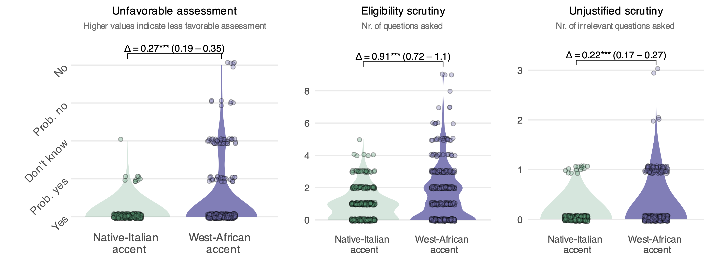

```{r setup, include = FALSE}
library(RefManageR)
library(knitr)
library(ggrepel) # Nicely placed labels in figures.
library(modelr)
library(webexercises) # Small web-based answer scales.
library(equatiomatic) # Regression equations from model objects.
library(essentials)
# library(RDDtools)
library(rdrobust)

options(htmltools.preserve.raw = FALSE, tikzDefaultEngine = "xetex",
        htmltools.dir.version = FALSE, servr.interval = 0.5, width = 115, digits = 3)
knitr::opts_chunk$set(
  collapse = TRUE, message = FALSE, fig.retina = 3, error = TRUE,
  warning = FALSE, cache = FALSE, fig.align = 'center',
  comment = "#", strip.white = TRUE, tidy = FALSE)

BibOptions(check.entries = FALSE, 
           bib.style = "authoryear", 
           style = "markdown",
           hyperlink = FALSE,
           no.print.fields = c("doi", "url", "ISSN", "urldate", "language", "note", "isbn", "volume"))
myBib <- ReadBib("./../../../Stats_II.bib", check = FALSE)

xaringanExtra::use_xaringan_extra(c("tile_view", "tachyons"))
xaringanExtra::use_panelset()
```
# The goal of social science research

.font130[.center[Use data to discover patterns, <br> and the .alert[social mechanisms that bring them about.]]]

```{r, echo = FALSE, out.width='50%', fig.align='center'}
knitr::include_graphics('https://blogger.googleusercontent.com/img/b/R29vZ2xl/AVvXsEgykJbXZbwIX-nd1oVOyzmEfj09ho8aQ4HBhfMH27t6YeTYSBevfrD2DFTEQSe7e3UwaVnv-fAJAOVpjW2pSGfG2QNrgHfkTmFtRWK4VXl6KmWK6vVlLud0DRU6lFXAqBF7iij420oOTLFh/s1600/photo.JPG')
```

---
class: inverse middle
# Today's schedule

Intuition

Application 1: Drinking + Driving = Death
1. Simple RDD.
2. RDD with different slopes.
3. Polynomial RDD.
5. Non-parametric RDD.

Application 2: Does Electing Women Reduce Corruption?

Application 3: Ethnic discrimination in Access to healthcare and far-right mayors.

---
# Remember RCTs!

.push-left[
```{r, echo = FALSE, out.width='60%', fig.align='center'}
knitr::include_graphics('./img/randomization2.png')
```

- If we .alert[randomly] divide subjects into treatment and control groups: They come from the same underlying population. 
  <br> <br> $\rightarrow$ Similar on average, *in every way*,<br> **including their $Y_{0}$ **!
  <br> <br> $\rightarrow E[Y_{0i}|D=1] = E[Y_{0i}|D=0]$!
]

.push-right[

$$\begin{equation}\begin{split} E & [Y_{1i}|D=1] - E[Y_{0i}|D=0] \\  \\ & = E[\color{red}{Y_{0i} + \kappa} |D=1] - E[Y_{0i}|D=0], \\ \\ &= \color{red}{\kappa} + \underbrace{E[Y_{0i} |D=1] - E[Y_{0i}|D=0]}_{\underbrace{0}_{\text{(if randomization has worked)}}}, \\ \\ & = \underbrace{\color{red}{\kappa}.}_{\text{The average causal effect}} \end{split}\end{equation}$$
]

---
# RDD is different

.push-left[
.content-box-blue[
We don't use randomness, but .alert[strict rules]. <br> Specifically, rules create (sharp) thresholds on otherwise continuous variables.
]

Societies have all kinds of thresholds that define what people get below and above the cut point.

- Pension age
  - People above a certain age are allowed to withdraw their pension
  - Everyone else has to pay a penalty to do the same thing
- GPA
  - Applicants above the GPA threshold get to study sociology
  - Those below it need to find another field of study
]

.push-right[

```{r, echo = FALSE, out.width='80%', fig.align='center'}
knitr::include_graphics('https://i0.wp.com/epthinktank.eu/wp-content/uploads/2014/11/11-electoral-threshold.png?fit=300%2C266&ssl=1')
```


.content-box-green[.center[
Can you think of other examples?
]]]

---
# RDD intuition

What if we compared *all* cases that fall on either side of a threshold?

```{r, echo = FALSE, out.width='100%', fig.align='center'}
knitr::include_graphics('img/RDD_intuition.png')
```

---
# RDD intuition

What if we compared only cases that fall *just barely* on either side of the threshold?

```{r, echo = FALSE, out.width='100%', fig.align='center'}
knitr::include_graphics('img/RDD_intuition2.png')
```

---
# RDD intuition

.content-box-blue[
.center[
Although the rule is strict and not random:<br>
**Falling just below or barely above the threshold is often _as good as random_!**
]

This holds under two assumptions:
1. **Continuity of Expected Potential Outcomes**: If the rule did not exist, the relationship between the continuous variable and the outcome would be smooth (continuous) across the cutoff. Without the rule, the world would be smoth.
2. **No Sorting**: Cases must not be able to manipulate and place themselves on one side of the cutoff.
]

```{r, echo = FALSE, out.width='90%', fig.align='center'}
knitr::include_graphics('img/RDD_intuition2.png')
```

---
# RDD intuition

```{r, echo = FALSE, out.width='90%', fig.align='center'}
knitr::include_graphics('https://theeffectbook.net/the-effect_files/figure-html/regressiondiscontinuity-fuzzydag-1.png')
```
.center[.backgrnote[*Source*: Huntington-Klein: ("The Effect")[https://theeffectbook.net/ch-RegressionDiscontinuity.html?panelset_003=r-code3]]]

---
# The central RDD challenge

.push-left[
If we compare **all cases** that fall on either side of the threshold:

1. Maximum sample size $\rightarrow$ **reliable** estimate.
2. Comparison $\rightarrow$ *invalidated by selection bias*.
]

.push-right[
If we compare only **cases that fall just barely** on either side of the threshold:

1. Tiny sample $\rightarrow$ *unreliable* results.
2. Comparison $\rightarrow$ as good as random $\rightarrow$ **unbiased** <br> $\rightarrow$ local average treatment effect $(\lambda, \text{ LATE})$.
]

```{r, echo = FALSE, out.width='100%', fig.align='center'}
knitr::include_graphics('img/RDD_intuition2.png')
```

---
class: inverse center middle
# An Example

.push-right[
```{r, echo = FALSE, out.width='100%', fig.align='center'}
knitr::include_graphics('https://dam-p-dfi.pqcloud.eu/preview/6XAlSpTzaLfBqzdLvpQ4nU/previews/cropOffsetX_0_cropOffsetY_0_maxWidth_1280_cropWidth_7212_cropHeight_4056.jpg/*/landscape169L.jpg?authcred=R3Vlc3Q6R3Vlc3Q=')
```
]

.push-left[
.font120[<br><br>What is the causal effect of <br><br> making alcohol consumption legal <br><br> on mortality?]
]

---
# Alcohol and mortality

.left-column[
  .content-box-green[
  What are the advantages and disadvantages of:
  1. Compare all those who are legally too young to drink (>21) to those who are old enough?
  2. Compare only those who are legally just too young to drink (pink) to those who are barely old enough (blue)?
]]

.right-column[
.panelset[
.panel[.panel-name[MLDA data]
.font80[
```{r}
pacman::p_load(
  tidyverse, # Data manipulation,
  ggplot2, # beautiful figures,
  estimatr, # OLS with robust SE
  modelsummary, # regression tables
  masteringmetrics, # data for today
  rdrobust) # Non-parametric regression

# Get the Minimum legal drinking age data!
data("mlda", package = "masteringmetrics")
(mlda <- mlda %>% drop_na()) # Drop missings and print forst 10 rows of the data
```
]]
.panel[.panel-name[Plot]
```{r RDD1, out.width='90%', fig.height = 5, fig.width = 8, echo = FALSE}
mlda <- mlda %>% mutate(
  # Define those who are allowed to drink
  over21 = case_when( 
    agecell >= 20.9 & agecell < 21 ~ "No-close",
    agecell >= 21.0 & agecell < 21.1 ~ "Yes-close",
    agecell >= 21 ~ "Yes",
    TRUE ~ "No"))

ggplot(data = mlda, aes(y = all, x = agecell, color = over21)) +
  geom_point() +
  geom_vline(xintercept = 21, color = "#e41a1c") +
  theme_minimal() + 
  scale_color_manual(values = c("#9970ab", "#c51b7d", "#a6dba0", "#2166ac")) +
  labs(y = "Nr of deaths among US Americans \n aged 20-22 (1997-2003)",
       x = "Age in years + months") +
  guides(color = "none")
```
]
.panel[.panel-name[Zoom out...]
```{r RDD5, out.width='90%', fig.height = 5, fig.width = 8, echo = FALSE}
mlda <- mlda %>% mutate(
  # Define those who are allowed to drink
  close = case_when( 
    agecell >= 20.7 & agecell < 21 ~ "No-close",
    agecell >= 21 & agecell < 21.3 ~ "Yes-close",
    agecell >= 21 ~ "Yes",
    TRUE ~ "No"))

ggplot(data = mlda, aes(y = all, x = agecell, color = close)) +
  geom_point() +
  geom_vline(xintercept = 21, color = "#e41a1c") +
  theme_minimal() + 
  scale_color_manual(values = c("#9970ab", "#c51b7d", "#a6dba0", "#2166ac")) +
  labs(y = "Nr of deaths among US Americans \n aged 20-22 (1997-2003)",
       x = "Age in months") +
  guides(color = "none")
```
]
.panel[.panel-name[Code]
```{r ref.label = "RDD1", out.width='90%', fig.height = 5, fig.width = 8, fig.show = "hide"}

```
]]]

---
class: inverse middle center

.font120[
How do we find the *best* trade-off between:

a) an **unbiased estimate** $\lambda$ (i.e. as few observations close to the threshold as possible) 

versus 

b) an **reliable estimate** (large sample size)
]

---
# OLS Regression!

.left-column[
1. We use all data to estimate regression lines $\rightarrow$ *reliable*!

2. We compare compare exactly at cutoff (21) $\rightarrow$ *unbiased*!
  - In fact, OLS allows us to compare treated & control (those allowed to drink and those not allowed) **at exactly 21**.

3. Though unbiased, the effect is "local" (may look different if threshold was 16).

]
.right-column[
```{r RDD6, out.width='100%', fig.height = 5, fig.width = 8, echo = FALSE}
mlda <- mlda %>% mutate(
  # Define those who are allowed to drink
  twentyone = case_when( 
    agecell >= 21 ~ "Yes",
    TRUE ~ "No"))


# 1. Fit the underlying linear models manually
# (We assume your dataframe is named 'mlda')
model_left  <- lm(all ~ agecell, data = subset(mlda, agecell < 21))
model_right <- lm(all ~ agecell, data = subset(mlda, agecell >= 21))

# 2. Define helper functions to predict Y for any X
pred_left  <- function(x) predict(model_left, newdata = data.frame(agecell = x))
pred_right <- function(x) predict(model_right, newdata = data.frame(agecell = x))

# 3. Get the range of the x-axis to know where lines should start/end
min_x <- min(mlda$agecell)
max_x <- max(mlda$agecell)

# 4. Plot
ggplot(data = mlda, aes(y = all, x = agecell, color = close)) +
  geom_point() +
  geom_vline(xintercept = 21, color = "#e41a1c") +
  geom_smooth(aes(color = twentyone), method = "lm") +
    geom_segment(aes(x = min_x, xend = 21, 
                   y = pred_left(min_x), yend = pred_left(21)), 
               color = "#9970ab", size = 1, inherit.aes = FALSE) +
    geom_segment(aes(x = 21, xend = max_x, 
                   y = pred_left(21), yend = pred_left(max_x)), 
               color = "#9970ab", linetype = "dashed", size = 1, inherit.aes = FALSE) +
    # Right Model (Green): Solid after 21, Dashed before 21
  geom_segment(aes(x = 21, xend = max_x, 
                   y = pred_right(21), yend = pred_right(max_x)), 
               color = "#a6dba0", size = 1, inherit.aes = FALSE) +
  geom_segment(aes(x = min_x, xend = 21, 
                   y = pred_right(min_x), yend = pred_right(21)), 
               color = "#a6dba0", linetype = "dashed", size = 1, inherit.aes = FALSE) +
  theme_minimal() + 
  scale_color_manual(values = c("#9970ab", "#c51b7d", "#a6dba0", "#2166ac")) +
  labs(y = "Nr of deaths per 100.000 US Americans \n aged 20-22 (1997-2003)",
       x = "Age in months") +
  guides(color = "none")
```
]

---
# Linear parametric RDD

.push-left[
$$\begin{equation}
Y_{i} = \alpha + \color{red}{\lambda} D_{i} + \beta_1 a_{i} + \beta_2(D_{i} \times a_{i}) + e_{i}
\end{equation}$$

- $D$ indicates whether an observation *i* is above (1) or below (0) the rule's threshold.
- $a_{i}$ (*"running variable"*), is the continuous variable on which the rule is based.
  + .alert[Centered around the threshold!]
]

.push-right[
```{r echo = FALSE}
mlda <- mlda %>%
  mutate(
    D = case_when(
      agecell < 21 ~ 0,
      TRUE ~ 1),
    age0 = agecell - 21) #<<

RDD <- lm_robust(all ~ D*age0, data = mlda)

# Regression table
modelsummary(list("Death per 100,000 persons" = RDD), stars = TRUE,
             gof_map = c("nobs", "r.squared"), output = "gt")
```
]

---
class: inverse middle center
# Break

<iframe src='https://panel.letstimeit.com/instant-timer/15-minute' width='600' height='400' frameborder='0' scrolling='yes'></iframe>
  
---
class: middle clear

.left-column[
  ```{r, echo = FALSE, out.width='80%'}
  knitr::include_graphics('https://www.laserfiche.com/wp-content/uploads/2014/10/femalecoder.jpg')
  ```
  
  <iframe src='https://panel.letstimeit.com/instant-timer/20-minute' width='600' height='400' frameborder='0' scrolling='yes'></iframe>
]

.right-column[
  <br>
    <iframe src='exercise1.html' width='1000' height='600' frameborder='0' scrolling='yes'></iframe>
]


---
class: inverse middle center
# Break

<iframe src='https://panel.letstimeit.com/instant-timer/10-minute' width='600' height='400' frameborder='0' scrolling='yes'></iframe>

---
class: clear
# Two problems of linear parametric RDD

.left-column[
1. Is linear **the correct functional form**, and if not what is? Adding polynomials to $\text{max}(R^2)$ risks overfitting to single data points $\rightarrow$ *bias*.
]

.right-column[
```{r RDD7, out.width='100%', fig.height = 5, fig.width = 8, echo = FALSE}
# 0. Data Setup
mlda <- mlda %>% mutate(
  twentyone = case_when(
    agecell >= 21 ~ "Yes",
    TRUE ~ "No"
  )
)

# 1. Fit Polynomial Models (Quadratic)
# We use poly(x, 2) to allow for a curve (non-linear)
model_left  <- lm(all ~ poly(agecell, 2), data = subset(mlda, agecell < 21))
model_right <- lm(all ~ poly(agecell, 2), data = subset(mlda, agecell >= 21))

# 2. Generate Prediction Data
# We create a dense grid of x-values so the lines look smooth
x_grid <- seq(min(mlda$agecell), max(mlda$agecell), length.out = 200)
plot_data <- data.frame(agecell = x_grid)

# Predict values for the whole range using both models
plot_data$pred_left  <- predict(model_left, newdata = plot_data)
plot_data$pred_right <- predict(model_right, newdata = plot_data)

# 3. Define Bandwidth Size (for visual ribbon)
# e.g., 0.5 years (6 months) around the cutoff
bw <- 0.5 

# 4. Plot
ggplot(data = mlda, aes(y = all, x = agecell)) +
  # Data Points
  geom_point(aes(color = close), alpha = 0.8) +
  # Cutoff Line
  geom_vline(xintercept = 21, color = "#e41a1c", lwd = 1) +
  # --- LEFT MODEL (Purple) ---
  # Solid line up to 21
  geom_line(data = subset(plot_data, agecell <= 21), 
            aes(y = pred_left), color = "#9970ab", size = 1.2) +
  # Dashed extrapolation after 21
  geom_line(data = subset(plot_data, agecell > 21), 
            aes(y = pred_left), color = "#9970ab", linetype = "dashed", size = 1) +
  # --- RIGHT MODEL (Green) ---
  # Solid line after 21
  geom_line(data = subset(plot_data, agecell >= 21), 
            aes(y = pred_right), color = "#a6dba0", size = 1.2) +
  # Dashed extrapolation before 21
  geom_line(data = subset(plot_data, agecell < 21), 
            aes(y = pred_right), color = "#a6dba0", linetype = "dashed", size = 1) +
  # Styling
  theme_minimal() + 
  scale_y_continuous(limits = c(88,110)) +
  scale_color_manual(values = c("#9970ab", "#c51b7d", "#a6dba0", "#2166ac")) +
  labs(y = "Nr of deaths per 100,000 US Americans \n aged 20-22 (1997-2003)",
       x = "Age in months",
       caption = "Shaded area indicates optimal bandwidth range") +
  guides(color = "none")
```
]

---
class: clear
# Two problems of linear parametric RDD

.left-column[
1. Is linear **the correct functional form**, and if not what is? Adding polynomials to $\text{max}(R^2)$ risks overfitting to single data points $\rightarrow$ *bias*.
]

.right-column[
$$Y_i = \alpha + \color{red}{\lambda} D_i + \beta_1 a_i + \beta_2 a_i^2 + \beta_1 (a_i \times D_i) + \beta_2 (a_i^2 \times D_i) + e_i$$

```{r echo = FALSE}
RDD_poly <- lm_robust(all ~ D*poly(age0, 2, raw = TRUE), data = mlda)

# Regression table
modelsummary(list("Linear" = RDD,
                  "Quadratic" = RDD_poly), stars = TRUE,
             gof_map = c("nobs", "r.squared"), output = "gt")
```
]

---
class: clear
# Two problems of linear parametric RDD

.left-column[
1. Is linear **the correct functional form**, and if not what is? Adding polynomials to $\text{max}(R^2)$ risks overfitting to single data points $\rightarrow$ *bias*.

2. What should be **the importance of single observations** in estimating the regression? 
  1. Should case far away from the threshold matter at all?
  2. Should cases closer to the threshold matter more? 
]

.right-column[
```{r RDD8, out.width='100%', fig.height = 5, fig.width = 8, echo = FALSE}
# 0. Define Bandwidth Size
bw <- 1 

# 1. Prepare Data
# Create a variable to distinguish points inside vs outside the bandwidth
mlda <- mlda %>% mutate(
  in_bandwidth = ifelse(agecell >= (21 - bw) & agecell <= (21 + bw), "Inside", "Outside")
)

# 2. Fit Polynomial Models (Weighted by proximity to cutoff)
# Note: We fit the model ONLY on data inside the bandwidth/weights scope
model_left  <- lm(all ~ poly(agecell, 2), weights = (1 / abs(agecell - 21)), 
                  data = subset(mlda, agecell < 21 & agecell > 20))
model_right <- lm(all ~ poly(agecell, 2), weights = (1 / abs(agecell - 21)), 
                  data = subset(mlda, agecell >= 21 & agecell < 22))

# 3. Generate Prediction Grid
x_grid <- seq(min(mlda$agecell), max(mlda$agecell), length.out = 200)
plot_data <- data.frame(agecell = x_grid)

plot_data$pred_left  <- predict(model_left, newdata = plot_data)
plot_data$pred_right <- predict(model_right, newdata = plot_data)

# 4. Plot
ggplot(data = mlda, aes(y = all, x = agecell)) +
  
  # --- Bandwidth Ribbon ---
  annotate("rect", xmin = 21 - bw, xmax = 21 + bw, ymin = -Inf, ymax = Inf, 
           fill = "gray80", alpha = 0.4) +
  
  # --- Data Points ---
  # Shape 19 = Solid Circle, Shape 1 = Hollow Circle
  geom_point(aes(color = close, shape = in_bandwidth, size = (1 / abs(agecell - 21))), alpha = 0.8) +
  scale_shape_manual(values = c("Inside" = 19, "Outside" = 1)) +
  
  # --- Cutoff Line ---
  geom_vline(xintercept = 21, color = "#e41a1c", lwd = 1) +
  
  # --- LEFT MODEL (Purple) ---
  # 1. Outside Bandwidth (Dashed)
  geom_line(data = subset(plot_data, agecell <= 21 - bw), 
            aes(y = pred_left), color = "#9970ab", linetype = "dashed", size = 1) +
  # 2. Inside Bandwidth (Solid)
  geom_line(data = subset(plot_data, agecell >= 21 - bw & agecell <= 21), 
            aes(y = pred_left), color = "#9970ab", linetype = "solid", size = 1.2) +
  # 3. Extrapolation (Dashed)
  geom_line(data = subset(plot_data, agecell > 21), 
            aes(y = pred_left), color = "#9970ab", linetype = "dashed", size = 1) +

  # --- RIGHT MODEL (Green) ---
  # 1. Outside Bandwidth (Dashed)
  geom_line(data = subset(plot_data, agecell >= 21 + bw), 
            aes(y = pred_right), color = "#a6dba0", linetype = "dashed", size = 1) +
  # 2. Inside Bandwidth (Solid)
  geom_line(data = subset(plot_data, agecell <= 21 + bw & agecell >= 21), 
            aes(y = pred_right), color = "#a6dba0", linetype = "solid", size = 1.2) +
  # 3. Extrapolation (Dashed)
  geom_line(data = subset(plot_data, agecell < 21), 
            aes(y = pred_right), color = "#a6dba0", linetype = "dashed", size = 1) +
  
  # --- Styling ---
  theme_minimal() + 
  scale_y_continuous(limits = c(88, 110)) +
  scale_color_manual(values = c("#9970ab", "#c51b7d", "#a6dba0", "#2166ac")) +
  labs(y = "Nr of deaths per 100,000 US Americans \n aged 20-22 (1997-2003)",
       x = "Age in months",
       caption = "Solid lines = Local fit within bandwidth. Dashed lines = Extrapolation.") +
  guides(color = "none", size = "none", shape = "none")
```
]

---
# 1. Bandwidth .font70[Cases outside of it do not count]

.push-left[
There are different algorithms that estimate the optimal bandwidth. They all weigh: $\frac{\text{Reliability}}{\text{Bias}}$. Within optimal bandwidth, RDD has $\text{min}(\text{Bias})$ and $\text{max}(\text{Reliability})$. 

.font80[

```{r}
rdrobust::rdbwselect(mlda$all, mlda$agecell, c = 21) %>% summary()
```

]]

.push-right[
```{r RDD9, out.width='100%', fig.height = 5, fig.width = 8, echo = FALSE}
# 0. Define Bandwidth Size
bw <- 0.493 

# 1. Prepare Data
# Create a variable to distinguish points inside vs outside the bandwidth
mlda <- mlda %>% mutate(
  in_bandwidth = ifelse(agecell >= (21 - bw) & agecell <= (21 + bw), "Inside", "Outside")
)

# 2. Fit Polynomial Models (Weighted by proximity to cutoff)
# Note: We fit the model ONLY on data inside the bandwidth/weights scope
model_left  <- lm(all ~ poly(agecell, 2), 
                  data = subset(mlda, agecell < 21 & agecell > 20.507))
model_right <- lm(all ~ poly(agecell, 2), 
                  data = subset(mlda, agecell >= 21 & agecell < 21.493))

# 3. Generate Prediction Grid
x_grid <- seq(min(mlda$agecell), max(mlda$agecell), length.out = 200)
plot_data <- data.frame(agecell = x_grid)

plot_data$pred_left  <- predict(model_left, newdata = plot_data)
plot_data$pred_right <- predict(model_right, newdata = plot_data)

# 4. Plot
ggplot(data = mlda, aes(y = all, x = agecell)) +
  
  # --- Bandwidth Ribbon ---
  annotate("rect", xmin = 21 - bw, xmax = 21 + bw, ymin = -Inf, ymax = Inf, 
           fill = "gray80", alpha = 0.4) +
  
  # --- Data Points ---
  # Shape 19 = Solid Circle, Shape 1 = Hollow Circle
  geom_point(aes(color = close, shape = in_bandwidth), size = 2, alpha = 0.8) +
  scale_shape_manual(values = c("Inside" = 19, "Outside" = 1)) +
  
  # --- Cutoff Line ---
  geom_vline(xintercept = 21, color = "#e41a1c", lwd = 1) +
  
  # --- LEFT MODEL (Purple) ---
  # 1. Outside Bandwidth (Dashed)
  geom_line(data = subset(plot_data, agecell <= 21 - bw), 
            aes(y = pred_left), color = "#9970ab", linetype = "dashed", size = 1) +
  # 2. Inside Bandwidth (Solid)
  geom_line(data = subset(plot_data, agecell >= 21 - bw & agecell <= 21), 
            aes(y = pred_left), color = "#9970ab", linetype = "solid", size = 1.2) +
  # 3. Extrapolation (Dashed)
  geom_line(data = subset(plot_data, agecell > 21), 
            aes(y = pred_left), color = "#9970ab", linetype = "dashed", size = 1) +

  # --- RIGHT MODEL (Green) ---
  # 1. Outside Bandwidth (Dashed)
  geom_line(data = subset(plot_data, agecell >= 21 + bw), 
            aes(y = pred_right), color = "#a6dba0", linetype = "dashed", size = 1) +
  # 2. Inside Bandwidth (Solid)
  geom_line(data = subset(plot_data, agecell <= 21 + bw & agecell >= 21), 
            aes(y = pred_right), color = "#a6dba0", linetype = "solid", size = 1.2) +
  # 3. Extrapolation (Dashed)
  geom_line(data = subset(plot_data, agecell < 21), 
            aes(y = pred_right), color = "#a6dba0", linetype = "dashed", size = 1) +
  
  # --- Styling ---
  theme_minimal() + 
  scale_y_continuous(limits = c(88, 110)) +
  scale_color_manual(values = c("#9970ab", "#c51b7d", "#a6dba0", "#2166ac")) +
  labs(y = "Nr of deaths per 100,000 US Americans \n aged 20-22 (1997-2003)",
       x = "Age in months",
       caption = "Solid lines = Local fit within bandwidth. Dashed lines = Extrapolation.") +
  guides(color = "none", size = "none", shape = "none")
```
]

---
# 2. Better linear! 

.push-left[
OLS fits to entire data within bandwidth. To fit data points far away from the cutoff, polynomials might have to "swing" wildly.

.center[
$\downarrow$
]

Notoriously unstable at the boundaries of the data.

.center[
$\downarrow$
]

In RDD, we only care about the boundary/cutoff!

.center[
$\downarrow$

Bias
]]

.push-right[
```{r RDD10, out.width='100%', fig.height = 5, fig.width = 8, echo = FALSE}
# 0. Define Bandwidth Size
bw <- 0.493 

# 1. Prepare Data
# Create a variable to distinguish points inside vs outside the bandwidth
mlda <- mlda %>% mutate(
  in_bandwidth = ifelse(agecell >= (21 - bw) & agecell <= (21 + bw), "Inside", "Outside")
)

# 2. Fit Polynomial Models (Weighted by proximity to cutoff)
# Note: We fit the model ONLY on data inside the bandwidth/weights scope
model_left  <- lm(all ~ agecell,
                  data = subset(mlda, agecell < 21 & agecell > 20.507))
model_right <- lm(all ~ agecell,
                  data = subset(mlda, agecell >= 21 & agecell < 21.493))

# 3. Generate Prediction Grid
x_grid <- seq(min(mlda$agecell), max(mlda$agecell), length.out = 200)
plot_data <- data.frame(agecell = x_grid)

plot_data$pred_left  <- predict(model_left, newdata = plot_data)
plot_data$pred_right <- predict(model_right, newdata = plot_data)

# 4. Plot
ggplot(data = mlda, aes(y = all, x = agecell)) +
  
  # --- Bandwidth Ribbon ---
  annotate("rect", xmin = 21 - bw, xmax = 21 + bw, ymin = -Inf, ymax = Inf, 
           fill = "gray80", alpha = 0.4) +
  
  # --- Data Points ---
  # Shape 19 = Solid Circle, Shape 1 = Hollow Circle
  geom_point(aes(color = close, shape = in_bandwidth), size = 2, alpha = 0.8) +
  scale_shape_manual(values = c("Inside" = 19, "Outside" = 1)) +
  
  # --- Cutoff Line ---
  geom_vline(xintercept = 21, color = "#e41a1c", lwd = 1) +
  
  # --- LEFT MODEL (Purple) ---
  # 1. Outside Bandwidth (Dashed)
  geom_line(data = subset(plot_data, agecell <= 21 - bw), 
            aes(y = pred_left), color = "#9970ab", linetype = "dashed", size = 1) +
  # 2. Inside Bandwidth (Solid)
  geom_line(data = subset(plot_data, agecell >= 21 - bw & agecell <= 21), 
            aes(y = pred_left), color = "#9970ab", linetype = "solid", size = 1.2) +
  # 3. Extrapolation (Dashed)
  geom_line(data = subset(plot_data, agecell > 21), 
            aes(y = pred_left), color = "#9970ab", linetype = "dashed", size = 1) +

  # --- RIGHT MODEL (Green) ---
  # 1. Outside Bandwidth (Dashed)
  geom_line(data = subset(plot_data, agecell >= 21 + bw), 
            aes(y = pred_right), color = "#a6dba0", linetype = "dashed", size = 1) +
  # 2. Inside Bandwidth (Solid)
  geom_line(data = subset(plot_data, agecell <= 21 + bw & agecell >= 21), 
            aes(y = pred_right), color = "#a6dba0", linetype = "solid", size = 1.2) +
  # 3. Extrapolation (Dashed)
  geom_line(data = subset(plot_data, agecell < 21), 
            aes(y = pred_right), color = "#a6dba0", linetype = "dashed", size = 1) +
  
  # --- Styling ---
  theme_minimal() + 
  scale_y_continuous(limits = c(88, 110)) +
  scale_color_manual(values = c("#9970ab", "#c51b7d", "#a6dba0", "#2166ac")) +
  labs(y = "Nr of deaths per 100,000 US Americans \n aged 20-22 (1997-2003)",
       x = "Age in months",
       caption = "Solid lines = Local fit within bandwidth. Dashed lines = Extrapolation.") +
  guides(color = "none", size = "none", shape = "none")
```
]
---
# 2. Better linear! 

.push-left[.font80[
```{r}
RDD_linear <- lm_robust(
  all ~ D*age0, 
  data = mlda %>% filter(abs(age0) < 0.493)) # Apply bandwidth #<<
RDD_poly <- lm_robust(all ~ D*poly(age0, 2, raw = TRUE), data = mlda %>% filter(abs(age0) < 0.493))

# Regression table
modelsummary(list("Linear" = RDD_linear,
                  "Quadratic" = RDD_poly), stars = TRUE,
             gof_map = c("nobs", "r.squared"), output = "gt")
```
]]

.push-right[
```{r RDD11, out.width='100%', fig.height = 5, fig.width = 8, echo = FALSE}
# 0. Define Bandwidth Size
bw <- 0.493 

# 1. Prepare Data
# Create a variable to distinguish points inside vs outside the bandwidth
mlda <- mlda %>% mutate(
  in_bandwidth = ifelse(agecell >= (21 - bw) & agecell <= (21 + bw), "Inside", "Outside")
)

# 2. Fit Models
# --- A. Linear Models (Original) ---
lin_left  <- lm(all ~ agecell,
                data = subset(mlda, agecell < 21 & agecell > 20.507))
lin_right <- lm(all ~ agecell,
                data = subset(mlda, agecell >= 21 & agecell < 21.493))

# --- B. Polynomial Models (New: Quadratic) ---
poly_left  <- lm(all ~ poly(agecell, 2),
                 data = subset(mlda, agecell < 21 & agecell > 20.507))
poly_right <- lm(all ~ poly(agecell, 2),
                 data = subset(mlda, agecell >= 21 & agecell < 21.493))

# 3. Generate Prediction Grid
x_grid <- seq(min(mlda$agecell), max(mlda$agecell), length.out = 200)
plot_data <- data.frame(agecell = x_grid)

# Predict Linear
plot_data$lin_pred_left  <- predict(lin_left, newdata = plot_data)
plot_data$lin_pred_right <- predict(lin_right, newdata = plot_data)

# Predict Polynomial
plot_data$poly_pred_left  <- predict(poly_left, newdata = plot_data)
plot_data$poly_pred_right <- predict(poly_right, newdata = plot_data)

# 4. Plot
ggplot(data = mlda, aes(y = all, x = agecell)) +
  
  # --- Bandwidth Ribbon ---
  annotate("rect", xmin = 21 - bw, xmax = 21 + bw, ymin = -Inf, ymax = Inf, 
           fill = "gray80", alpha = 0.4) +
  
  # --- Data Points ---
  geom_point(aes(color = close, shape = in_bandwidth, size = (1 / abs(agecell - 21))), alpha = 0.5) +
  scale_shape_manual(values = c("Inside" = 19, "Outside" = 1)) +
  
  # --- Cutoff Line ---
  geom_vline(xintercept = 21, color = "#e41a1c", lwd = 1) +
  
  # ==========================
  # 1. LINEAR FITS (Lighter/Original Colors)
  # ==========================
  # Left Linear
  geom_line(data = subset(plot_data, agecell <= 21), 
            aes(y = lin_pred_left), color = "#cab2d6", size = 1) + # Light Purple
  geom_line(data = subset(plot_data, agecell > 21), 
            aes(y = lin_pred_left), color = "#cab2d6", linetype = "dashed", size = 0.8) +
  
  # Right Linear
  geom_line(data = subset(plot_data, agecell >= 21), 
            aes(y = lin_pred_right), color = "#b2df8a", size = 1) + # Light Green
  geom_line(data = subset(plot_data, agecell < 21), 
            aes(y = lin_pred_right), color = "#b2df8a", linetype = "dashed", size = 0.8) +
  
  # Right Poly (Dark Green)
  geom_line(data = subset(plot_data, agecell >= 21), 
            aes(y = poly_pred_right), color = "#33a02c", size = 1.2) +
  geom_line(data = subset(plot_data, agecell < 21), 
            aes(y = poly_pred_right), color = "#33a02c", linetype = "dashed", size = 1) +
  
  # --- Styling ---
  theme_minimal() + 
  
  # ZOOM IN HERE using coord_cartesian to keep data points visible
  coord_cartesian(ylim = c(99.8, 106), xlim = c(20.4,21.6)) +
  
  scale_color_manual(values = c("#9970ab", "#c51b7d", "#a6dba0", "#2166ac")) +
  labs(y = "Nr of deaths per 100,000",
       x = "Age in months",
       caption = "Light Lines = Linear Fit | Dark Lines = Quadratic Fit") +
  guides(color = "none", size = "none", shape = "none")
```
]

---
class: clear
# 3. Weigh .font70[Give more weight to points closer to the cutoff]

.left-column[
The bandwidth excludes cases that should not matter at all.

But generally, cases closer to the threshold should matter more; they embody the core logic of an RDD.

]

.right-column[
```{r RDD12, out.width='100%', fig.height = 5, fig.width = 8, echo = FALSE}
# 0. Define Bandwidth Size
bw <- 0.493 

# 1. Prepare Data
# Create a variable to distinguish points inside vs outside the bandwidth
mlda <- mlda %>% mutate(
  in_bandwidth = ifelse(agecell >= (21 - bw) & agecell <= (21 + bw), "Inside", "Outside")
)

# 2. Fit Models
# --- A. Linear Models (Original) ---
lin_left  <- lm(all ~ agecell, weights = (1 / abs(agecell - 21)), 
                data = subset(mlda, agecell < 21 & agecell > 20.507))
lin_right <- lm(all ~ agecell, weights = (1 / abs(agecell - 21)), 
                data = subset(mlda, agecell >= 21 & agecell < 21.493))

# 3. Generate Prediction Grid
x_grid <- seq(min(mlda$agecell), max(mlda$agecell), length.out = 200)
plot_data <- data.frame(agecell = x_grid)

# Predict Linear
plot_data$lin_pred_left  <- predict(lin_left, newdata = plot_data)
plot_data$lin_pred_right <- predict(lin_right, newdata = plot_data)

# Predict Polynomial
plot_data$poly_pred_left  <- predict(poly_left, newdata = plot_data)
plot_data$poly_pred_right <- predict(poly_right, newdata = plot_data)

# 4. Plot
ggplot(data = mlda, aes(y = all, x = agecell)) +
  
  # --- Bandwidth Ribbon ---
  annotate("rect", xmin = 21 - bw, xmax = 21 + bw, ymin = -Inf, ymax = Inf, 
           fill = "gray80", alpha = 0.4) +
  
  # --- Data Points ---
  geom_point(aes(color = close, shape = in_bandwidth, size = (1 / abs(agecell - 21))), alpha = 0.5) +
  scale_shape_manual(values = c("Inside" = 19, "Outside" = 1)) +
  
  # --- Cutoff Line ---
  geom_vline(xintercept = 21, color = "#e41a1c", lwd = 1) +
  
  # ==========================
  # 1. LINEAR FITS (Lighter/Original Colors)
  # ==========================
  # Left Linear
  geom_line(data = subset(plot_data, agecell <= 21), 
            aes(y = lin_pred_left), color = "#cab2d6", size = 1) + # Light Purple
  geom_line(data = subset(plot_data, agecell > 21), 
            aes(y = lin_pred_left), color = "#cab2d6", linetype = "dashed", size = 0.8) +
  
  # Right Linear
  geom_line(data = subset(plot_data, agecell >= 21), 
            aes(y = lin_pred_right), color = "#b2df8a", size = 1) + # Light Green
  geom_line(data = subset(plot_data, agecell < 21), 
            aes(y = lin_pred_right), color = "#b2df8a", linetype = "dashed", size = 0.8) +
  
  # --- Styling ---
  theme_minimal() + 
  
  # ZOOM IN HERE using coord_cartesian to keep data points visible
  coord_cartesian(xlim = c(20.4, 21.6)) +
  
  scale_color_manual(values = c("#9970ab", "#c51b7d", "#a6dba0", "#2166ac")) +
  labs(y = "Nr of deaths per 100,000",
       x = "Age in months",
       caption = "Light Lines = Linear Fit | Dark Lines = Quadratic Fit") +
  guides(color = "none", size = "none", shape = "none")
```
]
---
class: clear
# 3. Weigh .font70[Give more weight to points closer to the cutoff]

.left-column[
The bandwidth excludes cases that should not matter at all.

But generally, cases closer to the threshold should matter more; they embody the core logic of an RDD.

$\rightarrow$ *Triangular Kernel* weights are the default.

The Triangular Kernel is default because it prioritizes the only thing we truly care about: the value at the cutoff.
]

.right-column[
```{r Kernels, out.width='100%', fig.height = 5, fig.width = 8, echo = FALSE}
# Create dummy data around a cutoff of 0
df <- data.frame(distance = seq(-1, 1, by = 0.01))

# 1. Triangular (The Tent): Linear decay
# Default in rdrobust because it is optimal for boundary estimation
df$Triangular <- 1 - abs(df$distance)

# 2. Uniform (The Box): Equal weight
# "Democracy" - everyone in the bandwidth counts the same
df$Uniform <- 1

# 3. Epanechnikov (The Dome): Quadratic decay
# Often minimizes Mean Squared Error in general settings
df$Epanechnikov <- 1 - df$distance^2

# Reshape for plotting
df_long <- pivot_longer(df, cols = c("Triangular", "Uniform", "Epanechnikov"), 
                        names_to = "Kernel", values_to = "Weight")

ggplot(df_long, aes(x = distance, y = Weight, color = Kernel, linetype = Kernel)) +
  
  # Fill the area under the curves lightly
  geom_polygon(aes(fill = Kernel, group = Kernel), alpha = 0.1) +
  
  # Draw the lines
  geom_line(size = 1.2) +
  
  # Draw the cutoff pole
  geom_vline(xintercept = 0, color = "black", linetype = "dashed") +
  
  # Styling
  scale_color_manual(values = c("Triangular" = "blue", "Uniform" = "gray50", "Epanechnikov" = "red")) +
  scale_fill_manual(values = c("Triangular" = "blue", "Uniform" = "gray50", "Epanechnikov" = "red")) +
  
  labs(title = "Comparison of RDD Kernels",
       subtitle = "How different kernels weigh cases based on their distance",
       x = "Distance from Cutoff",
       y = "Weight (Importance)") +
  theme_minimal() +
  theme(legend.position = "bottom")
```
]

---
# All in one

.left-column[
`rdrobust()` imlements state-of the-art RDDs: Local linear regression within optimized bandwidth and triangular kernel weights.

`mlda$all` is all deaths per 100,000 inhabitants of the US.
]

.right-column[
```{r}
RDD_all <- rdrobust(y = mlda$all, x = mlda$agecell, # Outcome & running variable #<<
  c = 21) # The threshold #<<
summary(RDD_all)
```
]

---
# All in one

.left-column[
`mlda$mva` are motor vehicle related deaths per 100,000 inhabitants of the US.
]

.right-column[
```{r}
RDD_drive <- rdrobust(y = mlda$mva, x = mlda$agecell, # Outcome & running variable #<<
  c = 21) # The threshold #<<
summary(RDD_drive)
```
]

---
class: inverse middle center

.font140[
Research questions answered:

9.5 more people die per 100,000 inhabitants when you make alcohol legal. 

Approx. 50% of these deaths are increases in traffic related accidents.
]

---
# More examples .font70[Women and corruption]

.push-left[
Pereira, Miguel & Pablo Fernandez-Vazquez (2023): "Does Electing Women Reduce Corruption? *Legislative Studies Quarterly*, 48(4), 731-763.

In 2007, Spain made a new rule saying that for municipalities with a population larger than 5.000 people, parties had to provide at least 40% of their seats to women. Pereira & Fernandez-Vazquez use this as an RDD:
- Outcome: (Revealed) Corruption
- Running Variable: Municipality population
- Cutoff: 5.000
]

.push-right[
```{r, echo = FALSE, out.width='80%', fig.align='center'}
knitr::include_graphics('./img/women_elected_threshold.png')
```
]

---
# More examples .font70[Women and corruption]
  
.push-left[
.content-box-green[
There's an effect! But why?
]]

.push-right[
```{r, echo = FALSE, out.width='100%', fig.align='center'}
knitr::include_graphics('./img/women_elected_effects.png')
```
]

???
- Women are socialized differently
- Women are more risk averse
- Women are under more scrutiny when elected
- Women tend to work on policies in low-corruption areas

<!-- --- -->
<!-- class: clear -->
<!-- # More examples .font70[Cumulative advantage in basketball] -->

<!-- .push-left[ -->
<!-- Biegert, Thomas, Michael Kühhirt & Van Lancker (2023): "They Can’t All Be Stars: The Matthew Effect, Cumulative Status Bias, and Status Persistence in NBA All-Star Elections" *American Sociological Review* 88(2): 189–219. -->

<!-- **Matthew Effect**: Robert K. Merton argued that small early advantages between equals can create large downstream *"Cumulative"* inequalities. We cannot reward *every* deserving person. But rewarding one person at the threshold but not the other more or less equal ones creates an actual inequality where there didn't use to be any. -->
<!-- ] -->

<!-- .push-right[ -->
<!-- ```{r, echo = FALSE, out.width='70%', fig.align='center'} -->
<!-- knitr::include_graphics('./img/lebron.png') -->
<!-- ``` -->
<!-- ] -->

<!-- --- -->
<!-- class: clear -->
<!-- # More examples .font70[Cumulative advantage in basketball] -->

<!-- .push-left[ -->
<!-- - Fans vote 5 players starting the NBA "All-Star Game". -->
<!-- - Outcome: Play "All-Star Game" in the *following* years. -->
<!-- - Running Variable: Rank of fan votes  -->
<!-- - Cutoff: 5 -->
<!-- ] -->

<!-- .push-right[ -->
<!-- ```{r, echo = FALSE, out.width='100%', fig.align='center'} -->
<!-- knitr::include_graphics('./img/nba_rdd_effects.png') -->
<!-- ``` -->
<!-- ] -->

<!-- --- -->
<!-- # Empirical example #2 -->
<!-- ## Cumulative advantage in basketball -->

<!-- .push-left[ -->
<!-- Maybe the players who won the first time are just better? Nope. Every measure of performance is insignificant, while the RDD estimate remains significant. -->
<!-- ] -->

<!-- .push-right[ -->
<!-- ```{r, echo = FALSE, out.width='100%', fig.align='center'} -->
<!-- knitr::include_graphics('./img/nba_covariates.png') -->
<!-- ``` -->
<!-- ] -->

---
class: clear
# More examples .font70[Far-right mayors and discrimination]

```{r, echo = FALSE, out.width='42%'}
knitr::include_graphics('./img/Krzysz.png')
```
.center[.backgrnote[*Source*: `r Citet(myBib, "schaeffer_when_2025")`]]

---
class: clear
# More examples .font70[Far-right mayors and discrimination]

```{r, echo = FALSE, out.width='95%'}

```
.center[.backgrnote[*Source*: `r Citet(myBib, "schaeffer_when_2025")`]]

---
class: clear
# More examples .font70[Far-right mayors and discrimination]

.push-left[
```{r, echo = FALSE, out.width='62%', fig.align='center'}
knitr::include_graphics('https://pbs.twimg.com/media/FOH1FlhWUAIqbN1.jpg:large')
```
]


.push-right[
.center[Municipalities where far-right candidates <br> *ran*
versus where they *won*]
```{r, echo = FALSE, out.width='100%', fig.align='center'}
knitr::include_graphics('./img/Map_Italy.png')
```
.backgrnote[.center[*Source:* `r Citet(myBib, "romarri_far-right_2020")`]]
]

---
class: clear
# More examples .font70[Far-right mayors and discrimination]

.left-column[
```{r, echo = FALSE, out.width='100%'}
knitr::include_graphics('./img/Krzysz.png')
```
]

.right-column[
```{r, echo = FALSE, out.width='100%', fig.align='center'}
knitr::include_graphics('./img/Figure2a-1.png')
```
.backgrnote[.center[*Source:* `r Citet(myBib, "schaeffer_when_2025")`]]
]


---
class: clear
.left-column[
```{r, echo = FALSE, out.width='80%'}
knitr::include_graphics('https://www.laserfiche.com/wp-content/uploads/2014/10/femalecoder.jpg')
```

<iframe src='https://www.online-timer.net/' width='400' height='385' frameborder='0' scrolling='yes'></iframe>
]

.right-column[
<br>
<iframe src='exercise2.html' width='1000' height='600' frameborder='0' scrolling='yes'></iframe>
]

---
layout: false
class: inverse
# Today's general lessons

1. The RDD Logic: RDD works because strict rules create a "Natural Experiment". At the cutoff, the only difference between treated and untreated units is the rule itself, making assignment "as good as random".
2. The Bandwidth-Bias Trade-off: We always face a dilemma:
  + Wide Bandwidth: Uses more data $\rightarrow$ High Precision (Low Variance), but risks comparing dissimilar people $\rightarrow$ High Bias.
  + Narrow Bandwidth: Compares identical people $\rightarrow$ Low Bias, but uses little data $\rightarrow$ Low Reliability\Precision (High Variance).
3. Functional Form Matters: Real life is rarely a straight line. If the data is curved, a straight regression line will "miss" the cutoff (Bias). We solve this by allowing for curvature (polynomials) or sticking to local linear regression within a narrow window.
4. Weighting (The Kernel): In RDD, not all data points are equal. Observations exactly at the cutoff are the most important for estimating the jump. We use Triangular Kernels to give maximum "volume" to the data at the border and turn down the volume for data further away.

---
layout: false
class: inverse
# Today's important functions

- `rdrobust()`: Estimates Local linear RDD with optimized bandwidth and triangular Kernel weights.

---
# References

.push-left[
.font70[
```{r ref1, results = 'asis', echo = FALSE}
PrintBibliography(myBib, start = 1, end = 5)
```
]]

.push-right[
.font70[
```{r ref2, results = 'asis', echo = FALSE}
PrintBibliography(myBib, start = 6, end = length(myBib))
```
]]