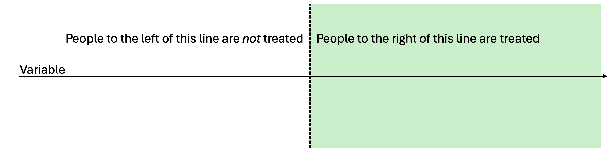
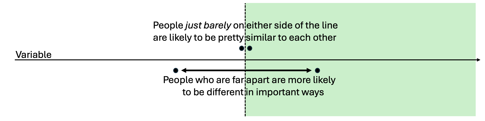
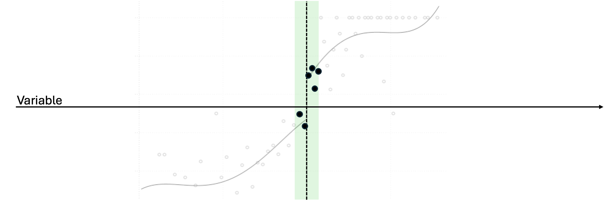
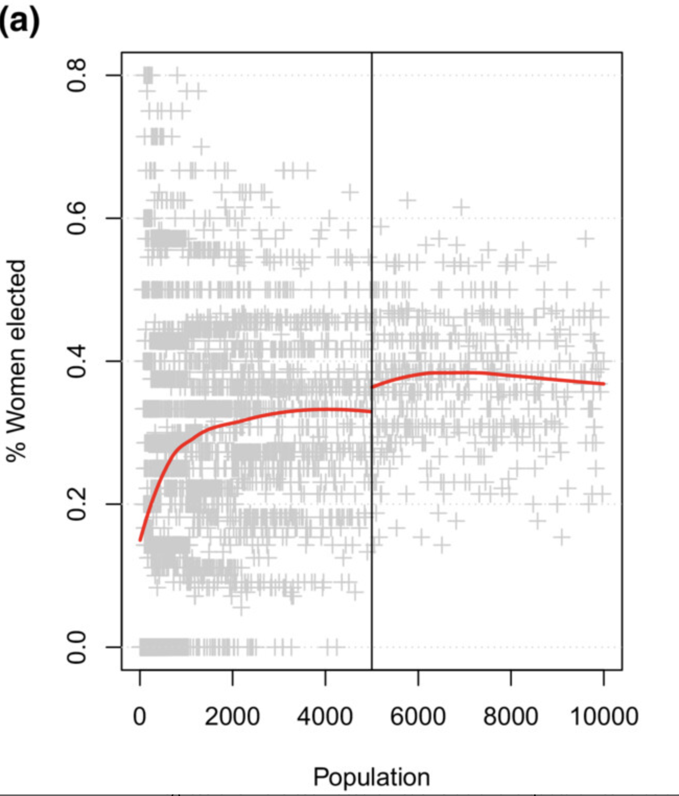
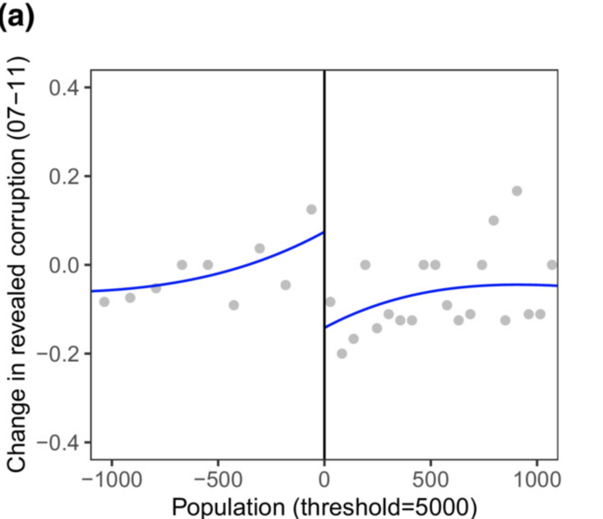
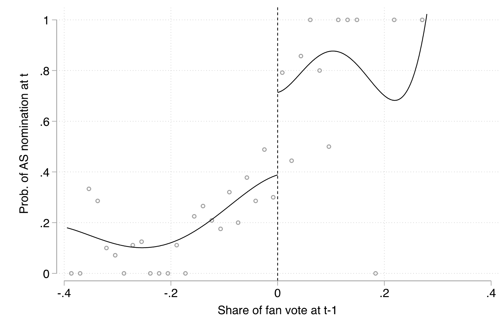
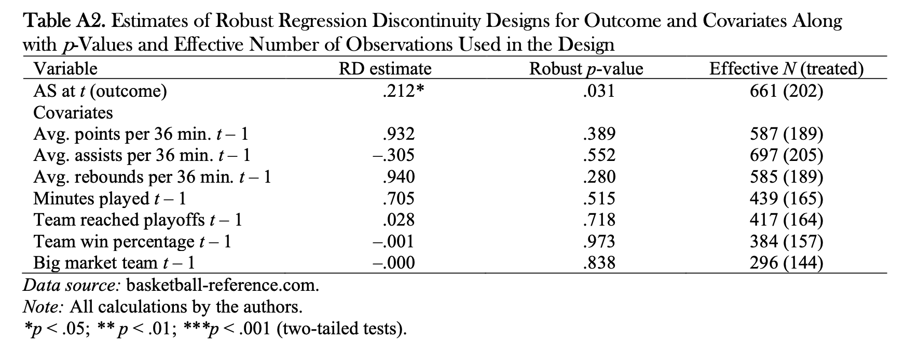

```{r setup, include = FALSE}
library(RefManageR)
library(knitr)
library(ggrepel) # Nicely placed labels in figures.
library(modelr)
library(webexercises) # Small web-based answer scales.
library(equatiomatic) # Regression equations from model objects.
library(essentials)
library(RDDtools)

options(htmltools.preserve.raw = FALSE, tikzDefaultEngine = "xetex",
        htmltools.dir.version = FALSE, servr.interval = 0.5, width = 115, digits = 3)
knitr::opts_chunk$set(
  collapse = TRUE, message = FALSE, fig.retina = 3, error = TRUE,
  warning = FALSE, cache = FALSE, fig.align = 'center',
  comment = "#", strip.white = TRUE, tidy = FALSE)

BibOptions(check.entries = FALSE, 
           bib.style = "authoryear", 
           style = "markdown",
           hyperlink = FALSE,
           no.print.fields = c("doi", "url", "ISSN", "urldate", "language", "note", "isbn", "volume"))
myBib <- ReadBib("./../../../Stats_II.bib", check = FALSE)

xaringanExtra::use_xaringan_extra(c("tile_view", "tachyons"))
xaringanExtra::use_panelset()
```
# The goal of social science research

.font140[.center[.alert[Use data to discover patterns ("social facts" in Durkheim's terms), <br> and the <ins>social mechanisms that bring them about</ins>.]]]

```{r, echo = FALSE, out.width='50%', fig.align='center'}

```

---
class: inverse middle
# Today's schedule

Intuition

Application 1: Drinking + Driving = Death
1. Simple RDD.
2. RDD with different slopes.
3. Polynomial RDD.
5. Non-parametric RDD.

Application 2: Does Electing Women Reduce Corruption?

Application 3: Ethnic discrimination in Access to healthcare and far-right mayors.

---
# Remember RCTs!

.push-left[
```{r, echo = FALSE, out.width='60%', fig.align='center'}
knitr::include_graphics('./img/randomization2.png')
```

- If we *randomly* divide subjects into treatment and control groups: They come from the same underlying population. 
  <br> <br> $\rightarrow$ Similar .alert[on average], *in every way*,<br> **including their $Y_{0}$ **!
  <br> <br> $\rightarrow E[Y_{0i}|D=1] = E[Y_{0i}|D=0]$!
]

.push-right[

$$\begin{equation}\begin{split} E & [Y_{1i}|D=1] - E[Y_{0i}|D=0] \\  \\ & = E[\color{red}{Y_{0i} + \kappa} |D=1] - E[Y_{0i}|D=0], \\ \\ &= \color{red}{\kappa} + \underbrace{E[Y_{0i} |D=1] - E[Y_{0i}|D=0]}_{\underbrace{0}_{\text{(if randomization has worked)}}}, \\ \\ & = \underbrace{\color{red}{\kappa}.}_{\text{The average causal effect}} \end{split}\end{equation}$$
]

---
# The intuition for RDD is different

## With regression discontinuity designs (RDDs) we try leverage artificial thresholds to imitate experimental group assignment

Society has all kinds of thresholds where people get different treatment above and below that cut point:

1. Elections
  - The person with the most votes in an election gets to be the Mayor
  - Every other candidate else does not
2. Pension age
  - People above a certain age are allowed to withdraw their pension
  - Everyone else has to pay a penalty to do the same thing
3. Borders
  - People on one side of Øresundsbroen pay one tax rate
  - People on the other side pay another tax rate

---
# RDD Intuitions

## What if we compared people who fall right on either side of the threshold?

- Assignment isn't random
- But right at the threshold, maybe it's close to random?

```{r, echo = FALSE, out.width='100%', fig.align='center'}

```

---
# RDD Intuitions

## But which group you fall into becomes less random the further you get from the threshold

- Someone who loses an election *badly* is probably very different from a person who loses an election by a few votes
- Someone who is 23 is probably very different from a person who is 64

```{r, echo = FALSE, out.width='100%', fig.align='center'}

```

---
# RDD Intuitions

## So we would really like to compare people just barely on either side of the threshold

```{r, echo = FALSE, out.width='100%', fig.align='center'}

```


---
class: inverse center middle
# How can we make this work? An Example

.push-right[
```{r, echo = FALSE, out.width='100%', fig.align='center'}
knitr::include_graphics('https://dam-p-dfi.pqcloud.eu/preview/6XAlSpTzaLfBqzdLvpQ4nU/previews/cropOffsetX_0_cropOffsetY_0_maxWidth_1280_cropWidth_7212_cropHeight_4056.jpg/*/landscape169L.jpg?authcred=R3Vlc3Q6R3Vlc3Q=')
```
]

--

.push-left[
.font120[<br><br>What is the causal effect of <br><br> making alcohol consumption legal <br><br> on mortality?]
]

---
# Let's try our idea

.left-column[
.content-box-green[
Let's compare those who are legally too young to drink (>21) to those who are old enough to drink?
]]

.right-column[
.panelset[
.panel[.panel-name[MLDA data]
.font80[
```{r}
pacman::p_load(
  tidyverse, # Data manipulation,
  ggplot2, # beautiful figures,
  estimatr, # OLS with robust SE
  texreg, # regression tables with nice layout,
  rdrobust, # Non-parametric regression,
  RDDtools # easy RDD fitting
)

# Get the Minimum legal drinking age data!
data("mlda", package = "masteringmetrics")
mlda <- mlda %>% drop_na()
mlda # print the tibble.
```
]]
.panel[.panel-name[Note]
- Everything on this slide and the next is done with tidyverse and ggplot2
- Later we will use the RDDtools package to do the more complex tasks
- When we do that, it will be much easier to use the plot() command instead of ggplot2
]
.panel[.panel-name[Plot]
```{r RDD1, out.width='90%', fig.height = 5, fig.width = 8, echo = FALSE}
mlda <- mlda %>% mutate(
  # Define those who are allowed to drink
  over21 = case_when( 
    agecell >= 21 ~ "Yes",
    TRUE ~ "No")
  )

ggplot(data = mlda, aes(y = all, x = agecell, color = over21)) +
  geom_point() +
  theme_minimal() + 
  scale_color_manual(values = c("red", "blue")) +
  labs(y = "Nr of deaths among US Americans \n aged 20-22 (1997-2003)",
       x = "Age in months") +
  guides(color = "none")
```
]
.panel[.panel-name[Code]
```{r ref.label = "RDD1", out.width='90%', fig.height = 5, fig.width = 8, fig.show = "hide"}

```
]]]

---
# Let's try our idea

.left-column[
.content-box-green[
So now let's zoom in on the data right around the threshold
]]

.right-column[
.panelset[
.panel[.panel-name[Start at the threshold...]
```{r RDD4, out.width='90%', fig.height = 5, fig.width = 8, echo = FALSE}
mlda <- mlda %>% mutate(
  # Define those who are allowed to drink
  close = case_when( 
    agecell >= 20.9 & agecell < 21 ~ "low",
    agecell >= 21 & agecell < 21.1 ~ "high",
    TRUE ~ "No"))

ggplot(data = mlda, aes(y = all, x = agecell, color = close)) +
  geom_point() +
  theme_minimal() + 
    scale_color_manual(values = c("blue", "red", "black")) +
  labs(y = "Nr of deaths among US Americans \n aged 20-22 (1997-2003)",
       x = "Age in months") +
  guides(color = "none")
```
]
.panel[.panel-name[Zoom out...]
```{r RDD5, out.width='90%', fig.height = 5, fig.width = 8}
mlda <- mlda %>% mutate(
  # Define those who are allowed to drink
  close = case_when( 
    agecell >= 20.7 & agecell < 21 ~ "low",
    agecell >= 21 & agecell < 21.3 ~ "high",
    TRUE ~ "No"))

ggplot(data = mlda, aes(y = all, x = agecell, color = close)) +
  geom_point() +
  theme_minimal() + 
    scale_color_manual(values = c("blue", "red", "black")) +
  labs(y = "Nr of deaths among US Americans \n aged 20-22 (1997-2003)",
       x = "Age in months") +
  guides(color = "none")
```
]]]

---
# But we need a model

.push-left[
The simplest approach is to use linear regression, and add a binary variable (0/1) *D* to indicate whether an observation *i* is above or below the threshold on the running variable of interest, *a*. Note that in the equations on the right, *y* is our dependent variable (e.g. death rate), and $\alpha$ is the intercept.
]

.push-right[

A simple regression model:

$$\begin{equation}
y_{i} = \alpha + \rho D_{i} + \gamma a_{i} + e_{i}
\end{equation}$$

We might also consider adding polynomial terms to help the model if we are not convinced that the relationship is linear. For instance, we could add a squared term (a "second order" polynomial):

$$\begin{equation}
y_{i} = \alpha + \rho D_{i} + \gamma_{1} a_{i} + \gamma_{2} a_{i}^{2} + e_{i}
\end{equation}$$

We can even add a polynomial with a power of three, or more! For instance, a "third order" polynomial:

$$\begin{equation}
y_{i} = \alpha + \rho D_{i} + \gamma_{1} a_{i} + \gamma_{2} a_{i}^{2} + \gamma_{3} a_{i}^{3} + e_{i}
\end{equation}$$
]

## The modeling strategy on this page is referred to as *parametric* regression discontinuity

---
# Implementation
## Parametric RDD with RDDtools

.left-column[
.content-box-green[
Using the R package RDDtools, we can implement all of these models rather easily. The main challenge is just to install it. See Exercise 1 on that point.

**First, creating a plot of the discontinuity with RDDtools**
]]

.right-column[
.panelset[
.panel[.panel-name[Convert data]
```{r RDDtools1, out.width='90%', fig.height = 5, fig.width = 8}
# Tell the package that it is an RDD dataset
# y = the Y variable of interest, in this case mlda$all
# x = the X variable of interest, in this case mlda$agecell
# cutpoint = the point of discontinuity in the data, in this case 21
drinking_rdd_data <- RDDdata(
  y=mlda$all,
  x=mlda$agecell,
  cutpoint=21
  )

# Note that this renames the variables to y and x. Do not be alarmed.
# And do not change the variable names back, or you will get error messages
```
]
.panel[.panel-name[Plot discontinuity]
```{r RDDtools2, out.width='90%', fig.height = 5, fig.width = 8, echo = FALSE}
# It's helpful to change the axis labels since it changes the variable names
# and 'x' and 'y' aren't very informative
plot(
  drinking_rdd_data,
  xlab='Age in months\n', # A little extra white space
  ylab="Nr of deaths among US Americans aged 20-22 (1997-2003)"
  )
```
]
.panel[.panel-name[Code]
```{r ref.label = "RDDtools2", out.width='90%', fig.height = 5, fig.width = 8, fig.show = "hide"}

```
]]]


---
# Implementation
## Parametric RDD with RDDtools

.left-column[
.content-box-green[
Using the R package RDDtools, we can implement all of these models rather easily. The main challenge is just to install it. See Exercise 1 on that point.

**Next, creating a simple linear model without any polynomial terms**
]]

.right-column[
.panelset[
.panel[.panel-name[Convert data]
```{r RDDtools3, out.width='90%', fig.height = 5, fig.width = 8}
# Order refers to the polynomial. Polynomials of order 1 are just normal variables
# without any exponents.
# Slope can be set to "same" if we want both sides of the threshold to have the same
# slope. It can also be set to "separate" if we want to add an interaction term so as
# to allow the slopes on each side to differ from one another, as described in the textbook.
rdd_linear <- RDDreg_lm(
  RDDobject = drinking_rdd_data,
  order = 1,
  slope='same'
  )
summary(rdd_linear)
```
]
.panel[.panel-name[Plot the estimate]
```{r RDDtools4, out.width='90%', fig.height = 5, fig.width = 8, echo=FALSE}
# It's helpful to change the axis labels since it changes the variable names
# and 'x' and 'y' aren't very informative
plot(
  rdd_linear,
  xlab='Age in months\n', # A little extra white space
  ylab="Nr of deaths among US Americans aged 20-22 (1997-2003)"
  )
```
]
.panel[.panel-name[Code]
```{r ref.label = "RDDtools4", out.width='90%', fig.height = 5, fig.width = 8, fig.show = "hide"}

```
]]]


---
# Implementation
## Parametric RDD with RDDtools

.left-column[
.content-box-green[
Using the R package RDDtools, we can implement all of these models rather easily. The main challenge is just to install it. See Exercise 1 on that point.

**Finally, adding in some polynomial terms (power of 2)**
]]

.right-column[
.panelset[
.panel[.panel-name[Convert data]
```{r RDDtools5, out.width='90%', fig.height = 5, fig.width = 8}
# Order refers to the polynomial. Polynomials of order 1 are just normal variables
# without any exponents.
# Slope can be set to "same" if we want both sides of the threshold to have the same
# slope. It can also be set to "separate" if we want to add an interaction term so as
# to allow the slopes on each side to differ from one another, as described in the textbook.
rdd_quadratic <- RDDreg_lm(
  RDDobject = drinking_rdd_data,
  order = 2,
  slope='same'
  )
summary(rdd_quadratic)
```
]
.panel[.panel-name[Plot the estimate]
```{r RDDtools6, out.width='90%', fig.height = 5, fig.width = 8, echo = FALSE}
# It's helpful to change the axis labels since it changes the variable names
# and 'x' and 'y' aren't very informative
plot(
  rdd_quadratic,
  xlab='Age in months\n', # A little extra white space
  ylab="Nr of deaths among US Americans aged 20-22 (1997-2003)"
  )
```
]
.panel[.panel-name[Code]
```{r ref.label = "RDDtools6", out.width='90%', fig.height = 5, fig.width = 8, fig.show = "hide"}

```
]]]

---
class: inverse middle center
# Break

<iframe src='https://www.online-timer.net/' width='400' height='385' frameborder='0' scrolling='yes'></iframe>

---
class: middle clear
# Time to try Exercise #1

.left-column[
```{r, echo = FALSE, out.width='80%'}
knitr::include_graphics('https://www.laserfiche.com/wp-content/uploads/2014/10/femalecoder.jpg')
```

<iframe src='https://www.online-timer.net/' width='400' height='385' frameborder='0' scrolling='yes'></iframe>
]

.right-column[
<br>
<iframe src='exercise1.html' width='1000' height='600' frameborder='0' scrolling='yes'></iframe>
]

---
# Reminder!

## We would really like to compare people just barely on either side of the threshold

But so far we are using all the data points, and using polynomials to home in on real effect with our estimates. This lets us keep all the data, which gives us more statistical power. But there is an alternative.

```{r, echo = FALSE, out.width='100%', fig.align='center'}

```


---
# Options
# For balancing quality with statistical power

1. Parametric Regression Discontinuity: Model the entire dataset, taking into account potential non-linearities in the data

2. Nonparametric Regression Discontinuity: *Only* use data that is within a certain distance of the threshold

---
# Nonparametric RDD

## How do we balance the "bandwidth"

If we draw the green box too small (too close to the threshold), we will lose statistical power and won't be able to draw meaningful conclusions. If we draw the green box too big, we get more observations, but we lose the strength of the comparison. We call the width of the box the "bandwidth"

```{r, echo = FALSE, out.width='100%', fig.align='center'}

```
---
# Nonparametric RDD

That is, we want to estimate this:
$$\begin{equation}
y_{i} = \alpha + \rho D_{i} + \gamma a_{i} + e_{i}
\end{equation}$$

But we only want to estimate it in a sample where:
$$\begin{equation}
threshold - bandwidth \ge a_{i} \le threshold + bandwidth
\end{equation}$$


```{r, echo = FALSE, out.width='100%', fig.align='center'}

```
---
# Implementation
## Nonparametric RDD with RDDtools

.left-column[
.content-box-green[
Thankfully, finding the right bandwidth is automated with a function in RDDtools. So the process is relatively simple for us here.
]]

.right-column[
.panelset[
.panel[.panel-name[Run estimates]
```{r RDDtools7, out.width='90%', fig.height = 5, fig.width = 8}
# Weird-looking function name, but it figures out the optimal bandwidth given your data
bandwidth <- RDDbw_IK(drinking_rdd_data)
reg_nonparam <- RDDreg_np(RDDobject = drinking_rdd_data, bw = bandwidth, slope='same')
coef_nonparam <- summary(reg_nonparam)$coefMat[1]
se_nonparam <- summary(reg_nonparam)$coefMat[2]
```
]
.panel[.panel-name[Show model summary]
```{r RDDtools8, out.width='90%', fig.height = 5, fig.width = 8}
summary(reg_nonparam)
```
]]]

---
# Empirical example #1
## Women and corruption

From Pereira & Fernandez-Vazquez. (2022). Does electing women reduce corruption? *Legislative Studies Quarterly*

---
# Empirical example #1
## Women and corruption

.push-left[
In 2007 Spain made a new rule saying that for towns with a population larger than 5000 people, parties had to provide at least 40% of their seats to women. They use this as an RDD to look into the well-known correlation between women in government and corruption.
]

.push-right[
```{r, echo = FALSE, out.width='70%', fig.align='center'}

```
]

---
# Empirical example #1
## Women and corruption

.push-left[
There's an effect! But why?
]

.push-right[
```{r, echo = FALSE, out.width='80%', fig.align='center'}

```
]

---
# Empirical example #1
## Women and corruption

.push-left[
There's an effect! But why?

- Women are socialized differently
- Women are more risk averse
- Women are under more scrutiny when elected
- Women tend to work on policies in low-corruption areas
]

.push-right[
```{r, echo = FALSE, out.width='80%', fig.align='center'}

```
]

---
# Empirical example #2
## Cumulative advantage in basketball

.push-left[
From Biegert, Kühhirt, & Van Lancker. (2022). They Can’t All Be Stars: The Matthew Effect, Cumulative Status Bias, and Status Persistence in NBA All-Star Elections *American Sociological Review*
]

.push-right[
.content-box-green[
Sociologists have argued for 80 years that small early advantages between equals can create large inequalities. Here they study this using unique data from professional basketball.
]
]

---
# Empirical example #2
## Cumulative advantage in basketball

.push-left[
- Fans vote to decide who plays in the NBA "All-Star Game"
- People in the Top X players at each position get to play
- People with just a few votes less do not get to play

.content-box-green[
Does winning the fan vote in time *t* increase a person's chances of winning the fan vote again in time *t+1* and beyond? 
]

]

.push-right[
```{r, echo = FALSE, out.width='60%', fig.align='center'}
knitr::include_graphics('./img/lebron.png')
```
]

---
# Empirical example #2
## Cumulative advantage in basketball

.push-left[
There's an effect! But why?

Sociologist Robert Merton argued that this happens because we don't have enough available space to reward *every* deserving person (in his case, it was scientists...think the Nobel prize). We have to make decisions between people who are more or less equal, and rewarding one person at the threshold but not the other creates an actual inequality where there didn't use to be any.
]

]

.push-right[
```{r, echo = FALSE, out.width='100%', fig.align='center'}

```
]

---
# Empirical example #2
## Cumulative advantage in basketball

.push-left[
Maybe the players who won the first time are just better? Nope. Every measure of performance is insignificant, while the RDD estimate remains significant.
]

.push-right[
```{r, echo = FALSE, out.width='100%', fig.align='center'}

```
]

---
# Empirical example #2
## Far-right elections and welfare chauvisnism

.push-left[
I can't show you the evidence, because it isn't published yet! But I saw your professor present this work in Leipzig.

.content-box-green[
Newly arrived residents of Italian regions that just barely elect far-right governments are more likely to experience delays and difficulties getting their healthcare access set up, compared to those who live in regions that just barely *did not* elect far-right governments.
]

]

.push-right[
```{r, echo = FALSE, out.width='80%', fig.align='center'}

```
]


---
class: inverse middle center
# Break

<iframe src='https://www.online-timer.net/' width='400' height='385' frameborder='0' scrolling='yes'></iframe>

---
class: middle clear
# Time to try Exercise #2

.left-column[
```{r, echo = FALSE, out.width='80%'}
knitr::include_graphics('https://www.laserfiche.com/wp-content/uploads/2014/10/femalecoder.jpg')
```

<iframe src='https://www.online-timer.net/' width='400' height='385' frameborder='0' scrolling='yes'></iframe>
]

.right-column[
<br>
<iframe src='exercise2.html' width='1000' height='600' frameborder='0' scrolling='yes'></iframe>
]

---