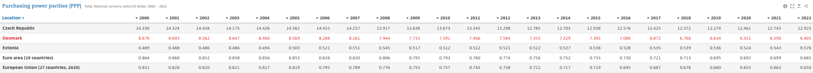
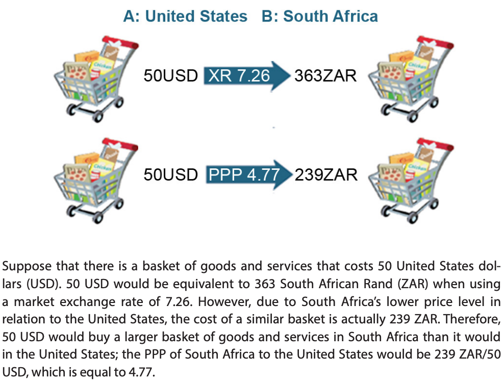
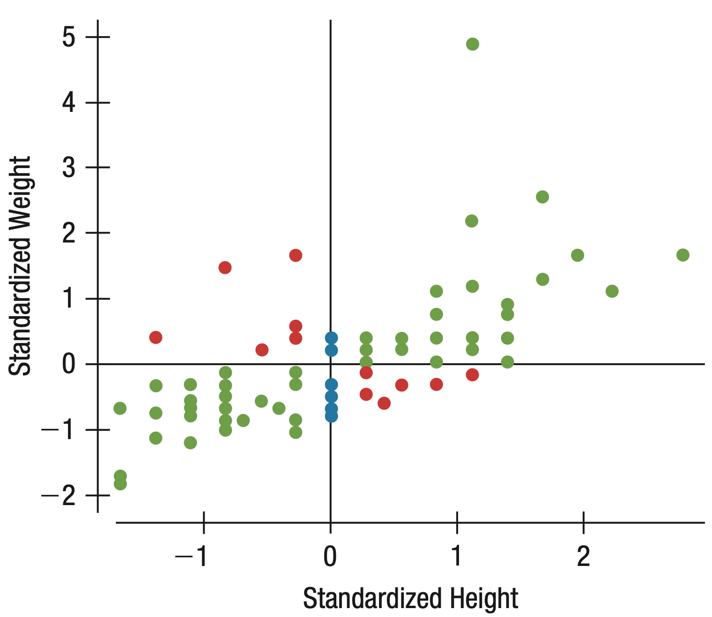

```{r setup, include = FALSE}
library(RefManageR)
library(knitr)
library(ggrepel) # Nicely placed labels in figures.
library(modelr)
library(webexercises) # Small web-based answer scales.
library(equatiomatic) # Regression equations from model objects.

options(htmltools.preserve.raw = FALSE,
        htmltools.dir.version = FALSE, servr.interval = 0.5, width = 115, digits = 3)
knitr::opts_chunk$set(
  collapse = TRUE, message = FALSE, fig.retina = 3, error = TRUE,
  warning = FALSE, cache = FALSE, fig.align = 'center',
  comment = "#", strip.white = TRUE, tidy = FALSE)

BibOptions(check.entries = FALSE, 
           bib.style = "authoryear", 
           style = "markdown",
           hyperlink = FALSE,
           no.print.fields = c("doi", "url", "ISSN", "urldate", "language", "note", "isbn", "volume"))
myBib <- ReadBib("./../../../Stats_II.bib", check = FALSE)

xaringanExtra::use_xaringan_extra(c("tile_view", "tachyons"))
xaringanExtra::use_panelset()
```

# Goal of empirical sociology

.font130[.center[Use data to .alert[discover patterns], <br> and the social mechanisms that bring them about.]]

```{r, echo = FALSE, out.width='70%', fig.align='center'}
knitr::include_graphics('https://liu.se/-/media/istock-501261958.jpg?mw=1120&mh=1120&hash=DA8977CCE6A6E600AE80A40CFEE771C9')
```
---
class: inverse
# Today's schedule

1. **Today's research question**: Socialism, citizenship rights, and poverty.
  + Application Programming Interfaces (API)
  + World Bank API
  + Democracy data API
  + Join different data sources
  
2. **Recap**
  
  2.1 *Scatter plots*
  2.2 *Correlation*
    + Z-standardization
    + $r_{y,x}$
  
  2.3 *Bivariate OLS regression*
  + OLS estimation
  + Causal versus descriptive interpretation
  
---
class: clear
# Remember? .font70[Civic and political Citizenship rights across the world]

.right-column[
[Freedom House World Map 2021](https://freedomhouse.org/explore-the-map?type=fiw&year=2020)

```{r, echo = FALSE, out.width='100%'}
knitr::include_graphics('img/FreedomHouse.png')
```
]

--

.left-column[
Some of you criticized:<br> *But aren't socialist countries better at providing* **social** *citizenship rights, like affordable housing, healthcare, work, and minimum quality of life?*
]

---
class: inverse
# Today's research question

.center[.font140[
**Is there a freedom-equality trade-off?**
]
.font110[
In other words:<br>
**Are socialist countries good at reducing poverty**,<br> potentially at the cost of offering less freedom?
]]

<br>
.push-left[
```{r, echo = FALSE, out.width='90%'}
knitr::include_graphics('https://miro.medium.com/max/1280/1*8Y_EPw2a67TRRos3b24YlA.jpeg')
```
]

.push-right[
```{r, echo = FALSE, out.width='96%'}
knitr::include_graphics('https://almayasabdam.com/wp-content/uploads/2020/09/1496441134_communists.png')
```
]

---
# Preparations

.panelset[
.panel[.panel-name[Packages for today's session]
```{r}
pacman::p_load(
  tidyverse, # Data manipulation,
  ggplot2, # beautiful figures,
  wbstats, # download data from Worldbank. Tremendous source of global socio-economic data.
  estimatr, # OLS with robust SE,
  modelsummary, # regression tables with nice layout,
  democracyData, # Use democracy data APIs,
  countrycode, # Easy recodings of country names,
  remotes) # Install beta version packages from GitHub.
```
]]

---
class:c clear
# Application Programming Interfaces (API)

```{r, echo = FALSE, out.width='80%'}
knitr::include_graphics('https://rapidapi.com/blog/wp-content/uploads/2023/03/What-is-an-API-definition.webp')
```

---
class: clear
# (1) Freedom House Data .font70[Civic and political citizenship rights]

.panelset[
.panel[.panel-name[The data]

.left-column[
- Since 1972, Freedom House codes civil and political citizenship rights around the world on a scale from 7 (most free) to 1 (least free).
]

.right-column[
<iframe src='https://en.wikipedia.org/wiki/Freedom_House' width='1200' height='480' frameborder='0' scrolling='yes'></iframe>
]]
.panel[.panel-name[Use API to get the data]
```{r}
(Dat_citi_rights <- download_fh(verbose = FALSE) %>% # Use API to download FH data for all countries since 1972, #<<
   rename(country = fh_country, # rename country ID,
          citizen_rights = fh_total_reversed, # rename Citizenship rights indicator,
          date = year) %>% # rename year variable,
   select(country, date, citizen_rights)) # Keep only these 3 variables.
```
]

.panel[.panel-name[Citizenship rights across the world '22]
```{r ref.label = "citiz-world", out.width='100%', fig.height = 8, fig.width = 20, results = FALSE, echo = FALSE}
```
]

.panel[.panel-name[Plot code] 
```{r citiz-world, fig.show = 'hide', echo = TRUE}
ggplot(data = Dat_citi_rights %>% filter(date == 2022), # Make coordinate system for data from 2022,
       aes(y = citizen_rights, # Y- and X-axis of plot,
           x = reorder(country, citizen_rights))) +
  geom_bar(stat = "identity") + # plot data as is in a bar chart,
  labs(y = "Citizenship rights", x = "", cap = "Source: Freedom House data for 2022") + # Axis labels,
  theme_minimal() + # Simple background layout,
  theme(axis.text.x = element_text(angle = 60, hjust = 1)) # Write country names in a 60 degree angle.
```
]]

---
class: clear
# (2) World Bank Data .font70[Poverty across the world]

.panelset[
.panel[.panel-name[Searching WB archive]
- With `wbstats::wb_search()`, you can search the Wb archive for any keyword! Here I use "poverty":
```{r}
(wb_poverty_archive <- wb_search("Poverty")) #<<
```
]
.panel[.panel-name[Use WB API]
```{r}
(Dat_poverty <- wb_data("SI.POV.DDAY", # Download poverty data: <$2.15 per day, #<<
                        start_date = 2002, end_date = 2023) %>% #<<
   rename(poverty = SI.POV.DDAY) %>% # rename poverty variable,
   select(country, date, poverty) %>% # Keep only 3 variables
   drop_na(poverty) %>% # Drop cases with missing data,
   group_by(country) %>% # Group by country,
   filter(date == max(date)) %>% ungroup()) # Keep the most recent poverty statistic per country.
```
]
.panel[.panel-name[Purchasing power parity (PPP)]
```{r, echo = FALSE, out.width='100%'}
# knitr::include_graphics('https://images.ctfassets.net/lnmc2aao6j57/5ARQpAg9LHPbNsKCMCkkGs/01af3346041c007104c9ca091c307a78/info-purchasing_power_parity-mobile.png')

```
.push-left[
```{r, echo = FALSE, out.width='75%'}
# knitr::include_graphics('https://images.ctfassets.net/lnmc2aao6j57/5ARQpAg9LHPbNsKCMCkkGs/01af3346041c007104c9ca091c307a78/info-purchasing_power_parity-mobile.png')

```
]
.push-right[
<br>
.content-box-red[
US$1 buys as much in the US, as DKK6.5 buy in Denmark.

US$2.15 = DKK14 per day.

$30\times\text{DKK}14 \approx \text{DKK}420$ to get by per month.
]]]

.panel[.panel-name[Poverty across the world]
```{r poverty-world, out.width='100%', fig.height = 8, fig.width = 20, results = FALSE, echo = FALSE}
ggplot(data = Dat_poverty, # Make coord system for data,
       aes(y = poverty, # Y- and X-axis of plot,
           x = reorder(country, poverty))) +
  geom_bar(stat = "identity") + # plot data as is in a bar chart,
  labs(y = "% population with less than US$2.15 a day\n (like living in Denmark with DKK420 per month)", x = "") + # Axis labels,
  theme_minimal() + # Simple background layout,
  theme(axis.text.x = element_text(angle = 60, hjust = 1)) # Write country names in a 60 degree angle.
```
]]

---
class: inverse
# 

.push-left[
<br>
<br>
<br>
<br>
OK great, now I have two tibbles. But how can I combine them?
]

.push-right[
```{r, echo = FALSE, out.width='96%'}
knitr::include_graphics('https://powietrze.malopolska.pl/wp-content/uploads/2020/10/q.jpg')
```
]

---
# Relational data

.left-column[
- If you work with multiple tibbles, you work with relational data .alert[if they have one or more variable(s) in common].
]

.right-column[
```{r, echo = FALSE, out.width='100%'}
knitr::include_graphics('https://d33wubrfki0l68.cloudfront.net/245292d1ea724f6c3fd8a92063dcd7bfb9758d02/5751b/diagrams/relational-nycflights.png')
```
]

---
# Relational data

Our tibbles are related, because both contain *countries* at various *dates*. <br>The combination of country and date is the **key** that allows us to relate both tibbles.

.push-left[
```{r}
Dat_citi_rights
```
]

.push-right[
```{r}
Dat_poverty
```
]

---
# **Join** .font60[Four types]

.push-left[
```{r, echo = FALSE, out.width='90%'}
knitr::include_graphics('https://raw.githubusercontent.com/gadenbuie/tidyexplain/master/images/inner-join.gif')
```
.center[.backgrnote[*Source*: [Tidy Animated Verbs](https://github.com/gadenbuie/tidyexplain)]]
]

--

.push-right[
```{r, echo = FALSE, out.width='90%'}
knitr::include_graphics('https://raw.githubusercontent.com/gadenbuie/tidyexplain/master/images/left-join.gif')
```
.center[.backgrnote[*Source*: [Tidy Animated Verbs](https://github.com/gadenbuie/tidyexplain)]]
]

---
# **Join** .font60[Four types]

.push-left[
```{r, echo = FALSE, out.width='90%'}
knitr::include_graphics('https://raw.githubusercontent.com/gadenbuie/tidyexplain/master/images/right-join.gif')
```
.center[.backgrnote[*Source*: [Tidy Animated Verbs](https://github.com/gadenbuie/tidyexplain)]]
]

--

.push-right[
```{r, echo = FALSE, out.width='90%'}
knitr::include_graphics('https://raw.githubusercontent.com/gadenbuie/tidyexplain/master/images/full-join.gif')
```
.center[.backgrnote[*Source*: [Tidy Animated Verbs](https://github.com/gadenbuie/tidyexplain)]]
]

---
# Inner join .font70[Poverty and citizenship rights]

```{r}
(Dat <- inner_join(Dat_poverty, Dat_citi_rights, by = c("country", "date"))) #<<
```

---
# (3) Socialism .font70[Construct our own index ...]

.panelset[
.panel[.panel-name[Socialist countries]
.left-column[
- Wikipedia has tables on self-declared socialist countries.
- I suggest a simple index:
  + Years socialist minus years since not socialist anymore.
  + Min. 5 years given any socialist history.
]

.right-column[
<iframe src='https://en.wikipedia.org/wiki/List_of_socialist_states' width='1200' height='480' frameborder='0' scrolling='yes'></iframe>
]]

.panel[.panel-name[Coding the index]
.font70[
```{r}
Dat <- Dat %>% mutate(
  socialist = case_when( # Years socialist minus years since not socialist anymore,
    country == "China" ~ date - 1949,
    country == "Vietnam" ~ date - 1945,
    country == "Algeria" ~ date - 1962,
    str_detect(country,"Portugal|Bangladesh") ~ date - 1972,
    country == "Guinea-Bissau" ~ date - 1973, country == "India" ~ date - 1976, 
    country == "Nicaragua" ~ date - 1979, country == "Sri Lanka" ~ date - 1978,
    country == "Tanzania" ~ date - 1964, country == "Albania" ~ (1992 - 1944) - (date - 1992),
    str_detect(country, "Angola|Cabo Verde|Madagascar") ~ (1992 - 1975) - (date - 1992),
    str_detect(country,"Belarus|Bulgaria") ~ (1990 - 1946) - (date - 1990),
    str_detect(country, "Benin|Mozambique") ~ (1990 - 1975) - (date - 1990),
    country == "Chad" ~ (1975 - 1962) - (date - 1975), country == "Congo, Rep." ~ (1992 - 1970) - (date - 1992),
    country == "Czech Republic" ~ (1990 - 1948) - (date - 1990), country == "Djibouti" ~ (1992 - 1981) - (date - 1992),
    country == "Ethiopia" ~ (1991 - 1974) - (date - 1991), country == "Ghana" ~ (1966 - 1960) - (date - 1966),
    country == "Guinea" ~ (1984 - 1958) - (date - 1984), country == "Hungary" ~ (1989 - 1949) - (date - 1989),
    country == "Iraq" ~ (2005 - 1958) - (date - 2005), country == "Mali" ~ (1991 - 1960) - (date - 1991),
    country == "Mauritania" ~ (1978 - 1961) - (date - 1978), country == "Mongolia" ~ (1992 - 1924) - (date - 1992),
    country == "Myanmar" ~ (1988 - 1962) - (date - 1988), country == "Poland" ~ (1989 - 1945) - (date - 1989),
    country == "Romania" ~ (1989 - 1947) - (date - 1989), country == "Russian Federation" ~ (1991 - 1922) - (date - 1991),
    country == "Seychelles" ~ (1991 - 1977) - (date - 1991), country == "Senegal" ~ (1981 - 1960) - (date - 1981),
    country == "Sierra Leone" ~ (1991 - 1978) - (date - 1991), country == "Somalia" ~ (1991 - 1969) - (date - 1991),
    country == "Sudan" ~ (1985 - 1969) - (date - 1985), country == "Syria" ~ (2012 - 1963) - (date - 2012),
    country == "Tunisia" ~ (1988 - 1964) - (date - 1988), country == "Ukraine" ~ (1991 - 1919) - (date - 1991),
    country == "Yemen, Rep." ~ (1991 - 1967) - (date - 1991), country == "Zambia" ~ (1991 - 1973) - (date - 1991),
    str_detect(country,"Slovenia|Croatia|Serbia|Montenegro|Bosnia and Herzegovina|North Macedonia|Kosovo") ~ (1992 - 1943) - (date - 1992),
    TRUE ~ 0),
  socialist = case_when( # Min. 5 years given any socialist history,
    (socialist < 5 & socialist > 0) | socialist < 0 ~ 5,
    TRUE ~ socialist)) %>% drop_na() # Drop countries with missing values.
```
]]
.panel[.panel-name[Resulting data] 
```{r}
Dat
```
]
.panel[.panel-name[Socialist history across the world]
```{r socialism-world, out.width='100%', fig.height = 8, fig.width = 20, results = FALSE, echo = FALSE}
ggplot(data = Dat, # Make coord system for data,
       aes(y = socialist, # Y- and X-axis of plot,
           x = reorder(country, socialist))) +
  geom_bar(stat = "identity") + # plot data as is in a bar chart,
  labs(y = "Our Socialism index", x = "") + # Axis labels,
  theme_minimal() + # Simple background layout,
  theme(axis.text.x = element_text(angle = 60, hjust = 1)) # Write country names in a 60 degree angle.
```
]]

---
class: inverse middle center
# Break

<iframe src='https://www.online-timer.net/' width='400' height='385' frameborder='0' scrolling='yes'></iframe>

---
class: inverse middle center
# Scatter plots


---
# Visual inspection

.left-column[
.content-box-blue[
.center[**4 questions for scatter plots**]
1. What is the *direction* of the 
relationship?

2. What *form* does the relation 
have?

3. How much *spread* is in the 
data?

4. Are there any *outliers*?
]]
.right-column[
```{r socialism-corr1, out.width='100%', fig.height = 5, fig.width = 7, results = FALSE, echo = FALSE}
ggplot(data = Dat, 
       aes(y = poverty, x = socialist, label = country)) +
  geom_text() +
  geom_label_repel(data = Dat %>% filter(country == "Denmark"), 
                   show.legend = FALSE, color = "#901A1E",
                   alpha = 0.8, segment.curvature = -0.1,
                   segment.ncp = 4, segment.angle = 10,
                   size = 5, box.padding = 1.5,
                   point.padding = 0.5, force = 100,
                   segment.size  = 1) +
  labs(y = "% population with less than US$2.15 a day\n (like living in Denmark with DKK420 per month)", 
       x = "Our Socialism index") +
  theme_minimal()
```
]

---
class: inverse middle center
# Correlation

---
class: clear
# Z-standardization .font60[Give two variables a comparable unit]

.panelset[
.panel[.panel-name[What is it?]

.push-left[
$$z(x) = \frac{x - \bar{x}}{\text{SD}(x)}$$
**We subtract the mean:** Values above 0 are above average, values below 0 are below average.

**We divide by the standard deviation:** Our variable now has standard deviations as unit.<br><br> $\rightarrow$ Intuitive understanding how common vis-á-vis extreme cases are.
]

.push-right[
```{r, echo = FALSE, out.width='100%'}
knitr::include_graphics('https://www.native-instruments.com/fileadmin/userlib/images/7727639_4467.normal-light.png')
```
]
]
.panel[.panel-name[R Code]
```{r}
(Dat <- Dat %>%
   mutate( # Z-Standardize variables.
     z_socialist = scale(socialist) %>% as.numeric(), #<<
     z_poverty = scale(poverty) %>% as.numeric())) #<<
```
]
.panel[.panel-name[Illustration]
```{r, echo = FALSE, out.width='40%'}

```
.backgrnote[.center[
*Source*: `r Citet(myBib, "veaux_stats_2021", after = ", p.199")`
]]]
.panel[.panel-name[Figure]
```{r socialism-corr2, out.width='70%', fig.height = 4, fig.width = 7.5, results = FALSE, echo = FALSE}
socialism_corr2 <- Dat %>%
  mutate(
    color = case_when(
      (z_socialist < 0 & z_poverty > 0) | 
        (z_socialist > 0 & z_poverty < 0) ~ "-1",
      (z_socialist > 0 & z_poverty > 0) |
        (z_socialist < 0 & z_poverty < 0)~ "1")) %>%
  ggplot(aes(y = z_poverty, x = z_socialist)) +
  geom_text(aes(label = country, color = color)) +
  scale_color_manual(values = c("#901A1E", "#425570")) +
  geom_hline(yintercept = 0, color = "#ffbd38", lty = "longdash", size = 1) +
  geom_vline(xintercept = 0, color = "#ffbd38", lty = "longdash", size = 1) +
  labs(y = "% population with less than US$2.15 a day\n (like living in Denmark with DKK420 per month)", 
       x = "Our socialism index") +
  theme_minimal() +
  guides(color = "none")

socialism_corr2
```
]]

---
class: inverse
# 

.push-left[
```{r, echo = FALSE, out.width='70%'}
knitr::include_graphics('https://thumbs.dreamstime.com/b/charakter-d-der-eine-lupe-h%C3%A4lt-und-ein-questio-kontrolliert-99243756.jpg')
```
]

.push-right[
<br>
<br>
<br>
<br>
OK but eye-balling is hardly enough to count as scientific evidence, is it?
]

---
# The correlation coefficient: $r_{y,x}$

.panelset[
.panel[.panel-name[What is it?]
.push-left[
```{r, echo = FALSE, out.width='80%'}

```
.backgrnote[.center[
*Source*: `r Citet(myBib, "veaux_stats_2021", after = ", p.199")`
]]]

.push-right[
.content-box-blue[
.center[**A precise statistic**<br> in three steps]
1. $z_y*z_x$
  + positive for a green points, zero for blue ones, and negative for red ones. Larger products contribute more to the association
2. $\sum^{n}_{i=1}z_y*z_x$
  + The general trend.
3. $r = \frac{\sum^{n}_{i=1}z_y*z_x}{n-1}$
  + We divide by $n - 1$;<br> the resulting $r$ varies between -1 and 1.
]]]
.panel[.panel-name[Poverty & Socialism]
.left-column[
.content-box-green[.center[
How do we interpret this result?
]]]
.right-column[
```{r}
Dat %>% # Use our data,
  select(poverty, socialist) %>% # Select vars for analysis,
  cor() # Estimate correlation. #<<
```
]]]

---
class: middle clear

.left-column[
```{r, echo = FALSE, out.width='80%'}
knitr::include_graphics('https://www.laserfiche.com/wp-content/uploads/2014/10/femalecoder.jpg')
```

<iframe src='https://www.online-timer.net/' width='400' height='385' frameborder='0' scrolling='yes'></iframe>
]

.right-column[
<br>

<iframe src='exercise1.html' width='1000' height='600' frameborder='0' scrolling='yes'></iframe>
]

---
class: inverse middle center
# Break

<iframe src='https://www.online-timer.net/' width='400' height='385' frameborder='0' scrolling='yes'></iframe>

---
class: inverse middle center
# OLS regression

---
# Correlation = linear trend

.right-column[
```{r socialism-ols, out.width='100%', fig.height = 4, fig.width = 6, results = FALSE, echo = FALSE}
socialism_corr2 + 
  geom_smooth(method = "lm", se = FALSE)
```
]

.left-column[
- **How can we directly calculate that trend line?** <br><br> Then we could state how much of a reduction in poverty we would expect for a year increase of socialism.
]

---
# Models

.left-column[
- **Model**: attempt to give reduced representation of reality. <br><br>Model should capture answer to our research question. .backgrnote[
Models should not be driven by few singular cases, like in this example.]
]

.right-column[
```{r ref.label = "socialism-ols", out.width='100%', fig.height = 4, fig.width = 6, results = FALSE, echo = FALSE}
```
]

---
# Linear models

.left-column[
.content-box-blue[
.center[**Linear models**<br>defined by two parameters]

$\color{orange}{\alpha}$ 'constant'/'intercept': The value of y at which the line intercepts the Y-axis $(\hat{Y}|X=0)$.
  
$\color{orange}{\beta}$ 'slope': How does $\hat{Y}$ change, if $X$ increases by one unit.
]]

.right-column[
```{r, echo = FALSE, out.width='100%'}
knitr::include_graphics('img/LinearModel.png')
```
]

---
# Regressing linear models from data

.panelset[
.panel[.panel-name[Residuals, e]
```{r results = FALSE, echo = FALSE}
mod <- Dat %>%
  lm(formula = poverty ~ socialist, data = .)

Dat_ols <- Dat %>% 
  add_residuals(model = mod) %>% 
  add_predictions(model = mod)
```

.left-column[
**Residuals**, $e_{i} =y_{i} - \hat{y}$<br>
differences between what model predicts and actual data.

$e_{\text{Denmark}} = `r Dat_ols$poverty[Dat_ols$country == "Denmark"]`\% - `r round(Dat_ols$pred[Dat_ols$country == "Denmark"], 1)`\%=`r Dat_ols$poverty[Dat_ols$country == "Denmark"] - round(Dat_ols$pred[Dat_ols$country == "Denmark"], 1)`\%$
]
.right-column[
```{r residuals, out.width='100%', fig.height = 4, fig.width = 6.5, results = FALSE, echo = FALSE}
resid <- ggplot(data = Dat_ols, mapping = aes(y = poverty, x = socialist, label = country)) +
  geom_point() +
  geom_smooth(method = "lm", se = FALSE) +
  labs(y = "% population with less than US$2.15 a day\n (like living in Denmark with DKK420 per month)", 
       x = "Our socialism index") +
  theme_minimal()

resid + 
  geom_linerange(data = Dat_ols %>% filter(country == "Denmark"), size = 1,
                 mapping = aes(ymin = pred, ymax = (resid + pred)), color = "#901A1E") +
  geom_point(data = Dat_ols %>% filter(country == "Denmark"), 
             color = "#ffbd38", size = 5, alpha = 0.6) +
  geom_point(data = Dat_ols %>% filter(country == "Denmark"), 
             aes(y = pred), color = "#425570", size = 5, alpha = 0.6) +
  geom_label_repel(data = Dat_ols %>% filter(country == "Denmark"), 
                   aes(y = pred, label = paste("Predicted poverty for ", country, ": ", round(pred, 1), "%", sep = "")),
                   show.legend = FALSE,
                   alpha = 0.8, segment.curvature = -0.1,
                   segment.ncp = 4, segment.angle = 10,
                   size = 3, box.padding = 1.5,
                   point.padding = 0.5, force = 100,
                   segment.size  = 0.3) +
  geom_label_repel(data = Dat_ols %>% filter(country == "Denmark"), 
                   aes(label = paste("Actual poverty in ", country, ": ", poverty, "%", sep = "")),
                   show.legend = FALSE,
                   alpha = 0.8, segment.curvature = -0.1,
                   segment.ncp = 4, segment.angle = 10,
                   size = 3, box.padding = 1.5,
                   point.padding = 0.5, force = 100,
                   segment.size  = 0.3)
```
]]

.panel[.panel-name[Minimize 1]

.left-column[
- **_Best_ fitting line**:
$$\begin{align*}
      \min \text{RSS} &= \min \sum_{i=1}^{n} e_{i}^{2} \\
      &= \min \sum_{i=1}^{n} y_{i} - \hat{y_{i}} \\
      &= \min \sum_{i=1}^{n} (y_{i} - (\color{orange}{\alpha} + \color{orange}{\beta} x_{i})^{2}
    \end{align*}$$
]

.right-column[
```{r min_resid, out.width='100%', fig.height = 4, fig.width = 6.5, results = FALSE, echo = FALSE}
resid + 
  geom_linerange(mapping = aes(ymin = pred, ymax = (resid + pred)), color = "#901A1E") +
  geom_label_repel(show.legend = FALSE,
                   alpha = 0.8, segment.curvature = -0.1,
                   segment.ncp = 4, segment.angle = 10,
                   size = 3, box.padding = 1.5,
                   point.padding = 0.5, force = 100,
                   segment.size  = 0.3)
```
]]

.panel[.panel-name[... 2]
.left-column[
- **_Best_ fitting line**:
$$\begin{align*}
      \min \text{RSS} &= \min \sum_{i=1}^{n} e_{i}^{2} \\
      &= \min \sum_{i=1}^{n} y_{i} - \hat{y_{i}} \\
      &= \min \sum_{i=1}^{n} (y_{i} - (\color{orange}{\alpha} + \color{orange}{\beta} x_{i})^{2}
    \end{align*}$$
]

.right-column[
```{r, echo = FALSE, out.width='50%'}
knitr::include_graphics('https://i.redd.it/gyw14y0tvak21.gif')
```
.backgrnote[.center[
*Source*: [aftersox on Reddit](https://www.reddit.com/r/dataisbeautiful/comments/axl1jm/oc_ordinary_least_squares_ols_finding_the_line/)
]]]]

.panel[.panel-name[R2 model fit]
.left-column[
How much smaller are the residuals from our model (blue line), compared to simply using the average $\bar{y}$ (orange line)?
$$\text{TSS}=\sum_{i=1}^{n}(y_i-\bar{y})^2$$
$$\text{RSS}=\sum_{i=1}^{n}(y_i-\hat{y}_i)^2$$
$$R^2=\frac{\text{TSS} - \text{RSS}}{\text{TSS}}$$
]
.right-column[
```{r R2, out.width='100%', fig.height = 4, fig.width = 6.5, results = FALSE, echo = FALSE}
resid +
  geom_hline(yintercept = mean(Dat$poverty), color = "#ffbd38") +
  geom_linerange(data = Dat_ols %>% filter(country == "Vietnam"),
                 mapping = aes(ymin = pred, ymax = (resid + pred)), color = "#901A1E") +
  geom_linerange(data = Dat_ols %>% filter(country == "Vietnam"),
                 mapping = aes(ymin = mean(Dat$poverty), ymax = (pred)), color = "#901A1E", size = 2) +
  geom_label_repel(data = Dat_ols %>% filter(country == "Vietnam"),
                   show.legend = FALSE,
                   alpha = 0.8, segment.curvature = -0.1,
                   segment.ncp = 4, segment.angle = 10,
                   size = 3, box.padding = 1.5,
                   point.padding = 0.5, force = 100,
                   segment.size  = 0.3)
```
]]

.panel[.panel-name[Regression using R]
.right-column[
```{r ols, eval = FALSE}
ols <- lm_robust(data = Dat, formula = poverty ~ socialist)
zols <- lm_robust(data = Dat, formula = z_poverty ~ z_socialist)

modelsummary(list("OLS" = ols, "Std. OLS" = zols), # Nicely-formatted table
             statistic = NULL, # Don't report stat. inference
             gof_map = c("nobs", "r.squared")) # Only 2 models fit stats
```

```{r ref.label = "min_resid", out.width='70%', fig.height = 4, fig.width = 6.5, results = FALSE, echo = FALSE}
```
]

.left-column[
```{r ref.label = "ols", results = 'asis', echo = FALSE}
```
]]

.panel[.panel-name[Interpretation]
.push-left[
```{r ref.label = "min_resid", out.width='100%', fig.height = 4, fig.width = 6.5, results = FALSE, echo = FALSE}
```
]

.push-right[
```{r ols2, include = FALSE}
ols <- lm(data = Dat, formula = poverty ~ socialist)
```
`r extract_eq(ols, use_coefs = TRUE)` $\rightarrow$ the best-fitting line that $\min \sum_{i=1}^{n} e_{i}^{2}$.

Among countries without a socialist past, poverty is on average `r round(coef(ols)[1], 2)`%.
  + $(\hat{y}|\text{Socialism = 0}) = `r round(coef(ols)[1], 2)`\%$.
  
With every year of socialism, the average level of poverty is `r round(coef(ols)[2], 2)` percentage points lower.

This model accounts for `r round(summary(ols)$r.squared, 2)`* 100% more of the variance of poverty across the world, than the average $\bar{y} = `r round(mean(Dat$poverty), 2)`\%$.
]]]

---
# Two types of interpretation

.left-column[
.center[**1. Causal**]

With every additional year of socialism, poverty is expected to decline by `r round(coef(ols)[2], 2)` percentage points. Thus, if China and Vietnam stay socialist, poverty will further decline.

.alert[Beware, this interpretation only holds under some conditions.] 

I will teach you how to estimate regressions that have a causal interpretation later this semester!
]

--

.right-column[
.center[
**2. Descriptive: conditional means $\bar{y}|x$**
]

With every year of socialism, the average level of poverty `r round(coef(ols)[2], 2)` percentage points lower.

Here regression is a (linear) model that describes the average of the outcome for different values of the predictor.

```{r, echo = FALSE, out.width='75%'}
knitr::include_graphics('https://isem-cueb-ztian.github.io/Intro-Econometrics-2017/handouts/lecture_notes/lecture_6/figure/fig-4-4.png')
```
.backgrnote[.center[
*Source*: [Zheng Tian](https://isem-cueb-ztian.github.io/Intro-Econometrics-2017/handouts/lecture_notes/lecture_6/lecture_6.html#org39dfbe6)
]]

]

---
class: inverse middle center
# Break

<iframe src='https://www.online-timer.net/' width='400' height='385' frameborder='0' scrolling='yes'></iframe>


---
class: middle clear

.left-column[
```{r, echo = FALSE, out.width='100%'}
knitr::include_graphics('https://cdn.dribbble.com/users/10549/screenshots/9916149/media/a9dbfea8e23e5b8e23db142528c3bc9f.png?compress=1&resize=1200x900&vertical=top')
```

```{r pov-citiz-corr2, out.width='90%', fig.height = 4, fig.width = 7.5, results = FALSE, echo = FALSE}
ggplot(data = Dat, aes(y = poverty, x = citizen_rights)) +
  geom_text(aes(label = country)) +
  geom_smooth(method = "lm", se = FALSE) +
  labs(y = "% population with less than US$2.15 a day\n (like living in Denmark with DKK420 per month)", 
       x = "Freedom House index of citizenship rights") +
  theme_minimal() +
  guides(color = "none")
```

```{r citiz-sicial-corr, out.width='90%', fig.height = 4, fig.width = 7.5, results = FALSE, echo = FALSE}
ggplot(data = Dat, aes(y = citizen_rights, x = socialist)) +
  geom_text(aes(label = country)) +
  geom_smooth(method = "lm", se = FALSE) +
  labs(y = "% population with less than US$2.15 a day\n (like living in Denmark with DKK420 per month)", 
       x = "Freedom House index of citizenship rights") +
  theme_minimal() +
  guides(color = "none")
```
]

.right-column[
<br>

<iframe src='exercise2.html' width='1000' height='600' frameborder='0' scrolling='yes'></iframe>
]

---
class: inverse
# Today's general lessons

1. R provides convenient access to a wide range of interesting data through APIs, allowing for easy downloading.
2. When datasets share common variables that uniquely identify cases, you can join them together, enabling fascinating analyses and excellent term papers!
3. It's always beneficial to create a scatter plot to visualize the relationship between the variables you wish to correlate.
4. Z-standardization aids interpretation and provides a common unit for different variables.
5. The correlation coefficient is a simple statistic that measures the strength of association between two variables.
6. Bivariate OLS regression, being a linear model, expresses an outcome variable as a linear function of a predictor.
7. The slope, denoted by β, indicates how average levels of the predicted variable (ŷ) change with a unit increase in the predictor (x).
8. OLS determines the linear model that best fits the data.
9. It is generally recommended not to interpret regression in causal terms, except under normal circumstances.

---
class: inverse
# Today's (important) functions

1. `cor()`: Estimate correlation coefficient.
2. `estimatr::lm_robust()`: Estimate linear OLS regression (with robust standard errors, which matters when using weights).
3. `plot(model_object)` to test regression assumptions.
4. `inner_join()`, `left_join()`, `right_join()`, and `full_join()` allow you to join/merge different tibbles together than have common observations and a key that identifies them.
5. `modelsummary()`: Create nicely-formatted (html, Word, ASCII, or Latex) tables of (one or several) regression models.
6. `scale()` z-standardizes variables. But sometimes it returns a matrix rather than a vector. Therefore it makes sense to always code `scale(x) %>% as.numeric()` to ensure you get an numeric vector out of it.

---
# References

.font80[
```{r ref1, results = 'asis', echo = FALSE}
PrintBibliography(myBib)
```
]