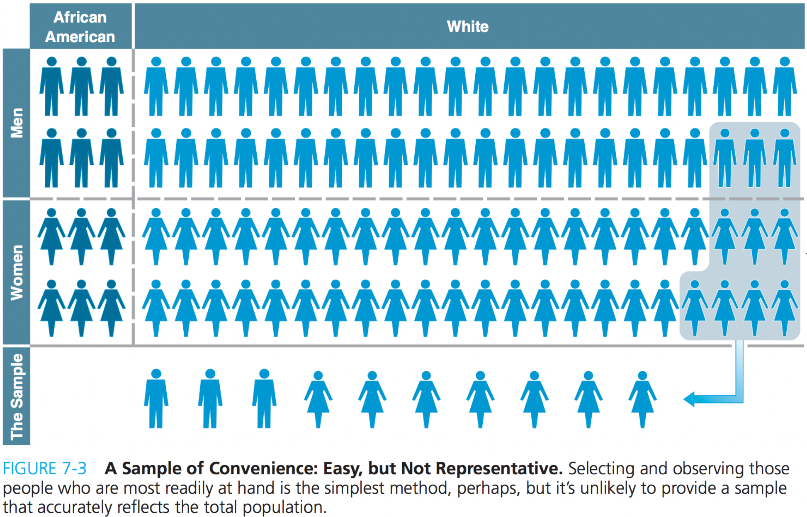
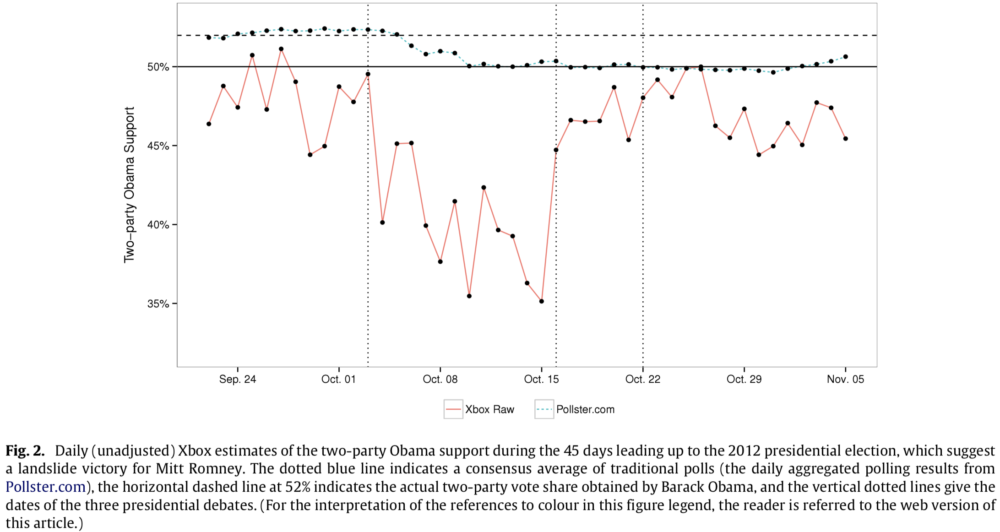
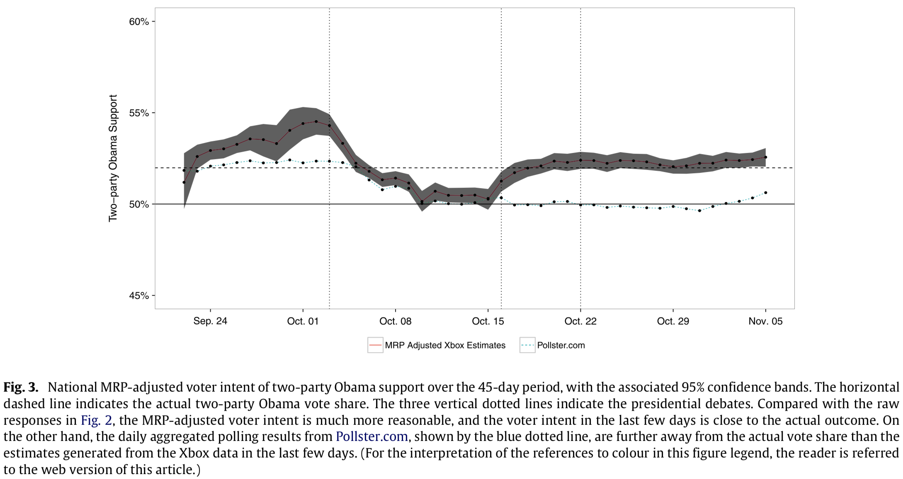

```{r setup, include = FALSE}
library(RefManageR)
library(knitr)

options(htmltools.dir.version = FALSE, servr.interval = 0.5, width = 115, digits = 3)
knitr::opts_chunk$set(
  collapse = TRUE, message = FALSE, fig.retina = 3, error = TRUE,
  warning = FALSE, cache = FALSE, fig.align = 'center',
  comment = "#", strip.white = TRUE, tidy = FALSE)

BibOptions(check.entries = FALSE, 
           bib.style = "authoryear", 
           style = "markdown",
           hyperlink = FALSE,
           no.print.fields = c("doi", "url", "ISSN", "urldate", "language", "note", "isbn", "volume"))
# myBib <- ReadBib("Stats_II.bib", check = FALSE)

xaringanExtra::use_xaringan_extra(c("tile_view", "tachyons"))
xaringanExtra::use_panelset()
```
# The goal of social science research

.font140[.center[.alert[Use data to discover patterns ("social facts" in Durkheim's terms), <br> and the social mechanisms that bring them about.]]]

```{r, echo = FALSE, out.width='70%', fig.align='center'}
knitr::include_graphics('https://liu.se/-/media/istock-501261958.jpg?mw=1120&mh=1120&hash=DA8977CCE6A6E600AE80A40CFEE771C9')
```

---
# Why randomness?

.push-left[.content-box-red[
.center[**We rely on randomness to<br> draw unbiased conclusions from data**]

- *Specifically*, two types of conclusions:
  1. Random sample $\rightarrow$ general population.
  2. Random $x \rightarrow$ causal effect of $x$ on $y$.


- More *fundamentally*:
  + Which social mechanisms generate the population and its patterns? <br> (aka the 'Data Generating Process')
]]


.push-right[
```{r, echo = FALSE, out.width='80%', fig.align='center'}
knitr::include_graphics('https://m.media-amazon.com/images/I/71jm22A7m9L._AC_SL1200_.jpg')
```
.center[.backgrnote[
Similar to some mirrors that give us a biased reflection,<br> many data sources we use to draw insights about how societies work also lead to biased insights.]]
]

---
class: inverse middle center

.push-left[
<br>
<br>
<br>
<br>
Excuse me?!

**How can randomness lead to unbiased insights about the fundamental ways in which society works?**
]

.push-right[
```{r, echo = FALSE, out.width='60%', fig.align='center'}
knitr::include_graphics('https://www.wearekura.com/wp-content/uploads/2017/08/identity-struggle.jpg')
```
]

---
# Think about it

.push-left[
.content-box-green[
Why do many games have a random element?
]

```{r, echo = FALSE, out.width='60%', fig.align='center'}
knitr::include_graphics('https://upload.wikimedia.org/wikipedia/commons/7/78/Monopoly_board_on_white_bg.jpg')
```
]

--

.push-right[
```{r, echo = FALSE, out.width='80%', fig.align='center'}
knitr::include_graphics('https://lotterylab.s3.amazonaws.com/summernoteimages/606ffa6b3468c.gif')
```

1. Thrill: No one knows the outcome.

2. .font120[.alert[Fairness!]] Known and similar probabilities for everyone, *regardless of who they are*.

]

---
# Samples

.center[**Research is based on samples for one of two reasons:**]

--

.push-left[
1) Populations are too large to study everyone.

```{r, echo = FALSE, out.width='50%', fig.align='center'}
knitr::include_graphics('https://www.kuechengoetter.de/uploads/media/630x630/02/28602-suppentopf-mit-nudeln-und-haehnchen.jpg?v=1-0')
```
.center[.backgrnote[
Our sample is basically a tasting of what's cooking <br>(i.e., what's really going on).]]

]

--

.push-right[
2) Even if we have (e.g., register) data on everyone, .font120[.alert[we are interested in social mechanisms]].
For example, we *generally* want to know, whether:
  - Urbanization results in a blasé outlook (Simmel).
  - Anomie makes people suicidal (Durkheim).
  - Capitalism alienates people from their creative talents (Marx).
    
    
  $\rightarrow$ We generally want to know these things, not only for the current population of Denmark. We thus treat any data as a sample of an unobservable "super population".
]

--

.left-column[

]

---
# Convenience samples

.left-column[
Samples should be representative: They should accurately reflect the (unobservable super) population.

.content-box-green[
If you sampled among your friends and family, what biases would that result in? That is, who would be underrepresented?
]
]

.right-column[
```{r, echo = FALSE, out.width='100%', fig.align='center'}

```
]

---
# Random samples!

.push-left[

```{r, echo = FALSE, out.width='60%', fig.align='center'}
knitr::include_graphics('https://lotterylab.s3.amazonaws.com/summernoteimages/606ffa6b3468c.gif')
```

<br>
<br>
Random samples are "fair": Everyone in the (unobservable super) population has the same probability to be part of the sample, .alert[regardless of who they are]!

$\rightarrow$ No group can be forgotten.
]

--

.push-right[
<br>
<br>
```{r, echo = FALSE, out.width='50%', fig.align='center'}
knitr::include_graphics('https://www.kuechengoetter.de/uploads/media/630x630/02/28602-suppentopf-mit-nudeln-und-haehnchen.jpg?v=1-0')
```
.center[.backgrnote[
Random sampling is basically the equivalent of giving the soup a proper stir before we taste it ;).]]
]

---
class: inverse middle center

.push-right[
<br>
Nice talk man.

**But we all know that it's not random who participates in a study**

<br>
```{r, echo = FALSE, out.width='70%', fig.align='center'}
knitr::include_graphics('https://bloximages.chicago2.vip.townnews.com/buffalonews.com/content/tncms/assets/v3/editorial/1/dc/1dc9a2da-fc52-11eb-9244-2b611ea83ea0/61169b5e36ff5.image.jpg')
```

]

.push-left[
<br>
<br>
<br>
<br>
<br>
```{r, echo = FALSE, out.width='60%', fig.align='center'}
knitr::include_graphics('https://www.business2community.com/wp-content/uploads/2013/03/Question1.jpg')
```
]

---
# Weights

.push-left[
- A *weight* tells you the probability that an observation should be in the sample. For a true random sample, each case of the population has an equal probability to be sampled. Thus the weight would be 1 for every observation of a sample.
-  Yet, for various reasons, some populations tend to be under-sampled. Post-stratification weights try to counterbalance this.
<br>

.content-box-green[.center[
Why would survey researchers assign lower weights to older people?
]]]

.push-right[
.panelset[
.panel[.panel-name[Plot]
```{r echo = FALSE}
YOUR_EMAIL <- "merlin.schaeffer@uni-koeln.de"
```
```{r weights_fig, out.width='100%', fig.height = 4, fig.width = 5, results = FALSE, echo = FALSE, cache = TRUE}
library(tidyverse) # Data manipulation.
library(haven) #<< Handle labelled data.
library(essurvey) # Read ESS data from API.

# Import the ESS round 9 data via the API
ESS <- import_country(
  country = "Denmark", rounds = 9,
  ess_email = YOUR_EMAIL, format = "spss") %>%
  # Keep only a minimum set of variables I need today
  select(idno, pspwght, agea, eduyrs, agea) %>%
  drop_na() # Delete cases with missing values

ggplot(data = ESS, 
       mapping = aes(y = pspwght, x = agea)) +
  geom_point(alpha = 0.3) +
  geom_smooth(method = "lm", SE = FALSE) + # OLS regression line.
  labs(y = "Post-stratification weight", x = "Age in years",
       caption = "Danish European Social Survey 2018") +
  theme_minimal()
```
]
.panel[.panel-name[Code]
```{r ref.label="weights_fig", results = FALSE, fig.show = "hide"}
```
]]]

---
# Working with weights

- Statistically, we use weights by multiplication. 

.push-left[
- Imagine a patriarchal society, where men's votes count twice as much. Here we have a ballot on whether women should be allowed to drive:

```{r results = 'asis', echo = FALSE}
library(knitr)
i <- 1:5
Gender <- c("man", "man", "woman", "woman", "woman")
Vote <- c("No", "Yes", "Yes", "Yes", "No")
`Voted yes` <- c(0, 1, 1, 1, 0)
Weight <- c(2, 2, 1, 1, 1)

dat <- tibble(i, Gender, Vote, `Voted yes`, Weight)
kable(dat, format = "html")
```

.center[
.content-box-green[
What is the patriarchy-weighted percent <br> of "Yes"-votes?
]
]
]

--

.push-right[
- Three equivalent ways to the percent of patriarchy-weighted "Yes"-votes:

.panelset[
.panel[.panel-name[1.]
```{r}
((0*2 + 1*2 + 1 + 1 + 0) / 7) * 100 # 1
```
]
.panel[.panel-name[2.]
```{r}
(sum(`Voted yes` * weight) / sum(weight)) * 100 # 2
```
]
.panel[.panel-name[3.]
```{r}
weighted.mean(x = `Voted yes`, w = weight) * 100 # 3
```
]]]

---
# Weights really work!

.push-left[
```{r, echo = FALSE, out.width='100%', fig.align='center'}

```
]

--

.push-right[
```{r, echo = FALSE, out.width='100%', fig.align='center'}

```
]


---
# Working with weights

.left-column[
- Most R commands have a weights argument.

- With OLS regression you should use: `estmiatr::lm_robust()`. 
.backgrnote[
Using weights results in heteroscedastic residuals, which violates an assumption of OLS. lm_robust() corrects for that (i.e., is robust to it).]
]

.right-column[
.panelset[
```{r weighted_reg, results= FALSE, echo = FALSE}
library(estimatr) # Weighted OLS regression with robust inference.
library(texreg) # Nicely-formatted regression tables.

# Prepare the data
ESS <- ESS %>% mutate(
    psppsgva = zap_labels(psppsgva), # Make numeric
    eduyrs = case_when( # Censor years of education at 9 & 21 years.
        eduyrs > 21 ~ 21,
        eduyrs < 9 ~ 9,
        TRUE ~ as.numeric(eduyrs)),
    gndr = as_factor(gndr)) # Make factor

# Estimate the models
mod1 <- lm(psppsgva ~ eduyrs, # Unweighted
           data = ESS)
mod2 <- lm_robust(psppsgva ~ eduyrs, # Weighted
                  weights = pspwght, 
                  data = ESS)

# Make a nice table
htmlreg(list(mod1, mod2), 
        include.ci = FALSE, digits = 3,
        custom.model.names = c("Unweighted", "Weighted"))
```

.panel[.panel-name[Example]
```{r ols_fig, out.width='90%', fig.height = 4, fig.width = 6, results = FALSE, echo = FALSE}
ggplot(data = ESS, aes(y = psppsgva, x = eduyrs)) +
  geom_point(aes(size = pspwght), alpha = 0.5) +
  geom_smooth(aes(weight = pspwght), method = "lm") +
  theme_minimal() +
  labs(y = "The political system allows people \n to have a say in what government does",
       x = "Years of education")
```
]
.panel[.panel-name[OLS Regression]
```{r ref.label = "weighted_reg", echo = FALSE, results = 'asis'}
```
]
.panel[.panel-name[Code]
```{r ref.label = "weighted_reg", results = FALSE}
```
]]]

---
class: inverse middle center

.push-left[
<br>
<br>
<br>
<br>
<br>
```{r, echo = FALSE, out.width='60%', fig.align='center'}
knitr::include_graphics('https://www.business2community.com/wp-content/uploads/2013/03/Question1.jpg')
```
]

.push-left[
<br>
OK, great: Randomness prohibits systematic biases and thus enables us to draw unbiased representative samples. If randomization has partly failed, we use post-stratification weights to counterbalance.

**But doesn't all this mean that I have randomness (e.g., just by chance too many vegetarians or so) and thus also bias in my data?**
]

---
# Sampling error $\sigma$ .font60[(aka sampling variability)]

.push-left[
- **Lets assume, the Danish ESS with it's `r nrow(ESS)` respondents was our (unobservable super) population of interest.** 
  + Thus, I don't use weights in this example ;)


- That would mean, we know the true OLS regression line (in blue): $\beta = `r coef(lm(psppsgva ~ eduyrs, data = ESS))["eduyrs"]`$
]

.push-right[
```{r true_ols, out.width='90%', fig.height = 4, fig.width = 6, results = FALSE, echo = FALSE}
ggplot(data = ESS, aes(y = psppsgva, x = eduyrs)) +
  geom_point(alpha = 0.5) +
  geom_smooth(method = "lm", se = FALSE) +
  theme_minimal() +
  labs(y = "The political system allows people \n to have a say in what government does",
       x = "Years of education")
```
]

---
# Sampling error $\sigma$ .font60[(aka sampling variability)]

.push-left[
- **Lets assume, the Danish ESS with it's `r nrow(ESS)` respondents was our (unobservable super) population of interest.** 
  + Thus, I don't use weights in this example ;)


- That would mean, we know the true OLS regression line (in blue): $\beta = `r coef(lm(psppsgva ~ eduyrs, data = ESS))["eduyrs"]`$

- Now I take a random sample of 50 persons.

```{r sample1}
set.seed(831983) # Random seed, to reproduce result.
ESS_sample <- ESS %>% sample_n(50) # Draw the sample.
```
]

.push-right[
```{r sample1_ols1, out.width='90%', fig.height = 4, fig.width = 6, results = FALSE, echo = FALSE}
ggplot(data = ESS_sample, aes(y = psppsgva, x = eduyrs)) +
  geom_point(alpha = 0.5, color = "#901A1E") +
  geom_smooth(data = ESS, method = "lm", se = FALSE) +
#  geom_smooth(method = "lm", se = FALSE, color = "#901A1E") +
  theme_minimal() +
  labs(y = "The political system allows people \n to have a say in what government does",
       x = "Years of education")
```
]

---
# Sampling error $\sigma$ .font60[(aka sampling variability)]

.push-left[
- **Lets assume, the Danish ESS with it's `r nrow(ESS)` respondents was our (unobservable super) population of interest.** 
  + Thus, I don't use weights in this example ;)


- That would mean, we know and can *calculate* the true OLS regression line (in blue): $\beta = `r coef(lm(psppsgva ~ eduyrs, data = ESS))["eduyrs"]`$

- Now I take a random sample of 50 persons.

```{r ref.label = "sample1", eval = FALSE}
```

- ... and *estimate* an OLS regression line based on that 50-person sample (in red): $\hat{\beta} = `r coef(lm(psppsgva ~ eduyrs, data = ESS_sample))["eduyrs"]`$
]

.push-right[
```{r sample1_ols2, out.width='90%', fig.height = 4, fig.width = 6, results = FALSE, echo = FALSE}
ggplot(data = ESS_sample, aes(y = psppsgva, x = eduyrs)) +
  geom_point(alpha = 0.5, color = "#901A1E") +
  geom_smooth(data = ESS, method = "lm", se = FALSE) +
  geom_smooth(method = "lm", se = FALSE, color = "#901A1E") +
  theme_minimal() +
  labs(y = "The political system allows people \n to have a say in what government does",
       x = "Years of education")
```
]

---
# Sampling error $\sigma$ .font60[(aka sampling variability)]

.push-left[
- **Lets assume, the Danish ESS with it's `r nrow(ESS)` respondents was our (unobservable super) population of interest.** 
  + Thus, I don't use weights in this example ;)


- That would mean, we know and can *calculate* the true OLS regression line (in blue): $\beta = `r coef(lm(psppsgva ~ eduyrs, data = ESS))["eduyrs"]`$

- .alert[Let's take another random sample of 50 persons.]

```{r sample2}
ESS_sample_2 <- ESS %>% sample_n(50) # Draw the sample.
```

- ... and *estimate* an OLS regression line based on that 50-person sample (in red): $\hat{\beta} = `r coef(lm(psppsgva ~ eduyrs, data = ESS_sample_2))["eduyrs"]`$
]

.push-right[
```{r sample1_ols3, out.width='90%', fig.height = 4, fig.width = 6, results = FALSE, echo = FALSE}
ggplot(data = ESS_sample_2, aes(y = psppsgva, x = eduyrs)) +
  geom_point(alpha = 0.5, color = "#901A1E") +
  geom_smooth(data = ESS_sample, 
              method = "lm", se = FALSE, color = "#901A1E", size = 0.3, alpha = 0.1) +
  geom_smooth(data = ESS, method = "lm", se = FALSE) +
  geom_smooth(method = "lm", se = FALSE, color = "#901A1E") +
  theme_minimal() +
  labs(y = "The political system allows people \n to have a say in what government does",
       x = "Years of education")
```
]

---
# Let's do this a 1000 times more!

.panelset[
.panel[.panel-name[Code for the Nerds]
```{r cache = TRUE}
Samples <- bind_rows(ESS_sample, ESS_sample_2, 
                     .id = "sample_nr") %>%
  mutate(sample_nr = as.numeric(sample_nr))

for (draw in 3:103) {
  Samples <- bind_rows(
    Samples,
    ESS %>% sample_n(50) %>% mutate(sample_nr = draw))
}
```
]
.panel[.panel-name[Animated figure]
```{r}
library(gganimate)

ggplot(data = Samples, aes(y = psppsgva, x = eduyrs)) +
  geom_point(alpha = 0.5, color = "#901A1E") +
  geom_smooth(method = "lm", se = FALSE, color = "#901A1E", size = 0.7) +
  geom_smooth(data = ESS, method = "lm", se = FALSE) +
  theme_minimal() +
  labs(y = "The political system allows people \n to have a say in what government does",
       x = "Years of education") +
  transition_states(factor(sample_nr),
                    transition_length = 100,
                    state_length = 500) +
  shadow_mark(alpha = 0.1, size = 0.1)
```
]]

---


---
class: inverse middle center

.push-left[
<br>
<br>
<br>
<br>
<br>
```{r, echo = FALSE, out.width='60%', fig.align='center'}
knitr::include_graphics('https://www.business2community.com/wp-content/uploads/2013/03/Question1.jpg')
```
]

.push-left[
<br>
Duh! But if I can't sample the whole (unobservable super) population, then I surely also can't draw thousands of 50 person samples or so.

**So is there no applied solution to the sampling error problem?**
]

---
# The standard error $\hat{\sigma}$ .font70[(i.e., estimated sampling error)]

.push-left[
**Goal**: Gain unbiased insights from data.

.center[
$\downarrow$ 
]

**Solution**: *Random sampling* prohibits systematic biases, and *weighting* helps to alleviate partly failed randomization.

.center[
$\downarrow$ 
]

**Problem**: Random samples contain unsystematic *sampling error*.

.center[
$\downarrow$ 
]

**Question**: With how much confidence can we *infer* (i.e., generalize) from our random sample?
]

--

.push-right[
.push-left[
```{r, echo = FALSE, out.width='60%', fig.align='center'}
knitr::include_graphics('https://upload.wikimedia.org/wikipedia/commons/thumb/e/ec/Carl_Friedrich_Gauss_1840_by_Jensen.jpg/440px-Carl_Friedrich_Gauss_1840_by_Jensen.jpg')
```
.center[.backgrnote[Carl Friedrich Gauss (1777-1855)]]
]
.push-right[
Thanks to mathematicians, such as Carl Friedrich Gauss, we can *estimate* the sampling error of most statistics based on a single sample!
]]

---
# The standard error of OLS $\hat{\sigma}(\beta)$

.push-left[
True sampling error from our repeated samples:
]

.push-right[
Estimated sampling errors each based on a single sample using Gauss' formula for the standard error of an OLS regression coefficient: $\hat{\sigma}(\beta)=\sqrt{\frac{1}{n-2}\frac{\text{SD}(e)}{\text{SD}(x)}}$.


]


---
class: inverse
# Today's general lessons


---
class: inverse
# Today's (important) R functions

---
# References
