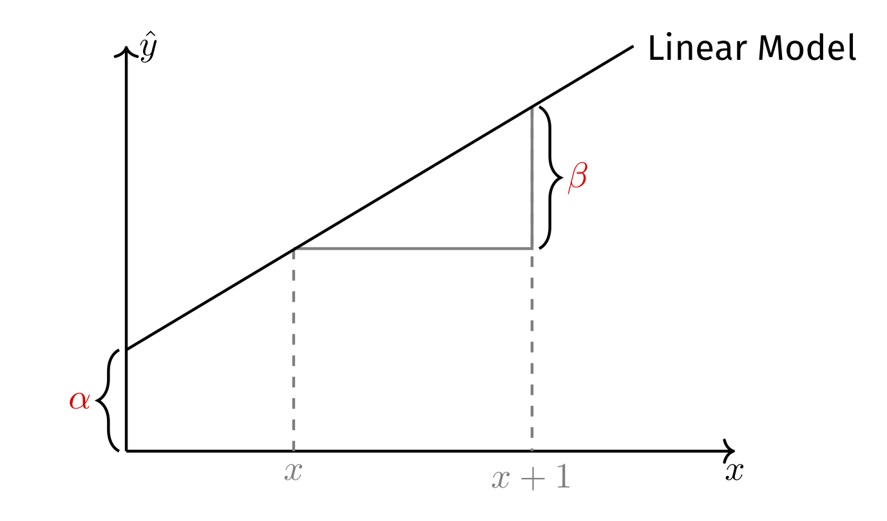

```{r setup, include = FALSE}
library(RefManageR)
library(knitr)
library(ggrepel) # Nicely placed labels in figures
library(modelr)

options(htmltools.dir.version = FALSE, servr.interval = 0.5, width = 115, digits = 3)
knitr::opts_chunk$set(
  collapse = TRUE, message = FALSE, fig.retina = 3, error = TRUE,
  warning = FALSE, cache = FALSE, fig.align = 'center',
  comment = "#", strip.white = TRUE, tidy = FALSE)

BibOptions(check.entries = FALSE, 
           bib.style = "authoryear", 
           style = "markdown",
           hyperlink = FALSE,
           no.print.fields = c("doi", "url", "ISSN", "urldate", "language", "note", "isbn", "volume"))
myBib <- ReadBib("./../../../Stats_II.bib", check = FALSE)

xaringanExtra::use_xaringan_extra(c("tile_view", "tachyons"))
xaringanExtra::use_panelset()
```
# Remember? .font70[Citizenship across the world]

.right-column[
[Freedom House World Map 2021](https://freedomhouse.org/explore-the-map?type=fiw&year=2020)

```{r, echo = FALSE, out.width='100%'}

```
]

--

.left-column[
- When we looked at the low levels of freedom in terms of citizenship rights in socialist countries, some of you criticized:<br><br> *But aren't socialist countries are good in providing work and equality?*
]

---
class: inverse
# Research question of the day

.center[.font110[
**Is there a freedom-equality trade-off?**

In other words:<br>
**Are socialist countries good at reducing poverty**,<br> potentially at the cost of offering less freedom?
]]

<br>
.push-left[
```{r, echo = FALSE, out.width='90%'}
knitr::include_graphics('https://miro.medium.com/max/1280/1*8Y_EPw2a67TRRos3b24YlA.jpeg')
```
]

.push-right[
```{r, echo = FALSE, out.width='96%'}
knitr::include_graphics('https://almayasabdam.com/wp-content/uploads/2020/09/1496441134_communists.png')
```
]

---
# Preparations

.panelset[
.panel[.panel-name[Packages for today's session]
```{r}
pacman::p_load(
  tidyverse, # Data manipulation,
  ggplot2, # beautiful figures,
  democracyData, # Download democracy datasets used in the scholarly literature.
  wbstats, # Download data from Worldbank. Tremendous source of global socio-economic data.
  texreg) # Regression tables with nice layout.
```
]]

---
class: clear
# Freedom House Data .font70[on (civic and political) citizenship rights]

.panelset[
.panel[.panel-name[The data]

.push-left[
- "Since 1972 (1978 in book form), Freedom House publishes an annual report, Freedom in the World, on the degree of democratic freedoms in nations and significant disputed territories around the world, by which it seeks to assess the current state of civil and political rights on a scale from 1 (most free) to 7 (least free)" [(Wikipedia)](https://en.wikipedia.org/wiki/Freedom_House). For more background, check out my [lecture on citizenship rights](https://merlin-guest-lectures.netlify.app/2022/05/05/gep-citizenship-rights-for-immigrants/).

- We add civil and political rights together and reverse the scale so higher values mean more citizenship rights.
]

.push-right[
<iframe src='https://en.wikipedia.org/wiki/Freedom_House' width='1200' height='670' frameborder='0' scrolling='yes'></iframe>
]]
.panel[.panel-name[Get the data]
```{r cache = TRUE}
(Dat_citi_rights <- download_fh(verbose = FALSE) %>% # Download Freedom House data for all countries since 1972,
   rename(country = fh_country, # rename country ID,
          citizen_rights = fh_total_reversed, # rename Citizenship rights indicator,
          date = year) %>% # rename year,
   select(country, date, citizen_rights)) # Keep only these 3 variables.
```
]

.panel[.panel-name[Plot code] 
```{r citiz-world, fig.show = 'hide', echo = TRUE}
ggplot(data = Dat_citi_rights %>% filter(date == 2020), # Make coord system for data from 2020,
       aes(y = citizen_rights, # Y- and X-axis of plot,
           x = reorder(country, citizen_rights))) +
  geom_bar(stat = "identity") + # plot data as is in a bar chart,
  labs(y = "Citizenship rights", x = "") + # Axis labels,
  theme_minimal() + # Simple background layout,
  theme(axis.text.x = element_text(angle = 60, hjust = 1)) # Write country names in a 60 degree angle.
```
]
.panel[.panel-name[Plot of citizenship rights across the world]
```{r ref.label = "citiz-world", out.width='100%', fig.height = 8, fig.width = 20, results = FALSE, echo = FALSE}
```
]]

---
class: clear
# Worldbank Data .font70[On poverty across the World]

.panelset[
.panel[.panel-name[Searching Wb archive]
- With `wbstats::wb_search()`, you can search through the Wb archive for any keyword, here I use "poverty":
```{r cache = TRUE}
(wb_poverty_archive <- wb_search("poverty"))
```
]
.panel[.panel-name[Get Wb data]
```{r cache = TRUE}
(Dat_poverty <- wb_data("SI.POV.UMIC", # Download poverty data: <5.50$ per day,
                        start_date = 2011, end_date = 2022) %>%
   rename(poverty = SI.POV.UMIC) %>% # rename poverty variable,
   select(country, date, poverty) %>% # Keep only 3 variables
   drop_na(poverty) %>% # Drop cases with missing data,
   group_by(country) %>% # Group by country,
   filter(date == max(date)) %>% # Keep the most recent data per country.
   ungroup())
```
]
.panel[.panel-name[Plot code] 
```{r poverty-world, fig.show = 'hide', echo = TRUE}
ggplot(data = Dat_poverty, # Make coord system for data,
       aes(y = poverty, # Y- and X-axis of plot,
           x = reorder(country, poverty))) +
  geom_bar(stat = "identity") + # plot data as is in a bar chart,
  labs(y = "% population with less than 5.50$ a day", x = "") + # Axis labels,
  theme_minimal() + # Simple background layout,
  theme(axis.text.x = element_text(angle = 60, hjust = 1)) # Write country names in a 60 degree angle.
```
]
.panel[.panel-name[Plot poverty across the world]
```{r ref.label = "poverty-world", out.width='100%', fig.height = 8, fig.width = 20, results = FALSE, echo = FALSE}
```
]]

---
# Join data .font70[Poverty and citizenship rights]

.panelset[
.panel[.panel-name[Join poverty & citizenship rights data]
```{r}
(Dat <- left_join(Dat_poverty, Dat_citi_rights, by = c("country", "date")))
```
]

.panel[.panel-name[Scatterplot]
.left-column[
.content-box-blue[
.center[Remember, 4 questions for scatter plots:]
1. What is the direction of the 
relationship?
2. What form does the relation 
have?
3. How much spread is in the 
data?
4. Are there any outliers?
]]
.right-column[
```{r poverty-corr1, out.width='95%', fig.height = 5, fig.width = 8, results = FALSE, echo = FALSE}
ggplot(data = Dat, 
       aes(y = poverty, x = citizen_rights, label = country)) +
  geom_text() +
  geom_label_repel(data = Dat %>% filter(country == "Denmark"), 
                   show.legend = FALSE, color = "#901A1E",
                   alpha = 0.8, segment.curvature = -0.1,
                   segment.ncp = 4, segment.angle = 10,
                   size = 5, box.padding = 1.5,
                   point.padding = 0.5, force = 100,
                   segment.size  = 0.3) +
  labs(y = "% population with less than 5.50$ a day", 
       x = "Citizenship rights") +
  theme_minimal()
```
]]]

---
# Socialism .font70[We need to make our own index ...]

.panelset[
.panel[.panel-name[Socialist countries]
.left-column[
- Wikipedia has tables on self-declared socialist countries.
- I suggest a simple index:
  + Years socialist minus years since.
  + Min. 5 years given socialist history.
]

.right-column[
<iframe src='https://en.wikipedia.org/wiki/List_of_socialist_states' width='1200' height='670' frameborder='0' scrolling='yes'></iframe>
]]
.panel[.panel-name[Coding the index]
.font70[
```{r}
Dat <- Dat %>% mutate(socialist = case_when( # Years socialist minus years since,
  country == "China" ~ date - 1949,
  country == "Vietnam" ~ date - 1945,
  country == "Albania" ~ (1992 - 1944) - (date - 1992),
  grepl(country,"Belarus|Bulgaria") ~ (1990 - 1946) - (date - 1990),
  grepl(country, "Benin|Mozambique") ~ (1990 - 1975) - (date - 1990),
  country == "Congo, Rep." ~ (1992 - 1970) - (date - 1992),
  country == "Czech Republic" ~ (1990 - 1948) - (date - 1990),
  country == "Ethiopia" ~ (1991 - 1974) - (date - 1991),
  country == "Hungary" ~ (1989 - 1949) - (date - 1989),
  country == "Mongolia" ~ (1992 - 1924) - (date - 1992),
  country == "Poland" ~ (1989 - 1945) - (date - 1989),
  country == "Romania" ~ (1989 - 1947) - (date - 1989),
  country == "Russian Federation" ~ (1991 - 1922) - (date - 1991),
  country == "Somalia" ~ (1991 - 1969) - (date - 1991),
  country == "Ukraine" ~ (1991 - 1919) - (date - 1991),
  country == "Yemen, Rep." ~ (1991 - 1967) - (date - 1991),
  grepl(country,"Slovenia|Croatia|Serbia|Montenegro|Bosnia and Herzegovina|North Macedonia|Kosovo") ~ (1992 - 1943) - (date - 1992),
  grepl(country, "Cabo Verde|Madagascar|Angola") ~ (1992 - 1975) - (date - 1992),
  country == "Egypt, Arab Rep." ~ (2007 - 1953) - (date - 2007),
  country == "Iraq" ~ (2005 - 1958) - (date - 2005),
  country == "Mali" ~ (1991 - 1960) - (date - 1991),
  country == "Seychelles" ~ (1991 - 1977) - (date - 1991),
  country == "Sierra Leone" ~ (1991 - 1978) - (date - 1991),
  country == "Syria" ~ (2012 - 1963) - (date - 2012),
  country == "Tunisia" ~ (1988 - 1964) - (date - 1988),
  country == "Zambia" ~ (1991 - 1973) - (date - 1991),
  TRUE ~ 0),
  socialist = case_when( # Min. 5 years given socialist history,
    (socialist < 5 & socialist > 0) | socialist < 0 ~ 5,
    TRUE ~ socialist)) %>%
  drop_na() # Drop countries with missing values.
```
]]
.panel[.panel-name[Plot code] 
```{r socialism-world, fig.show = 'hide', echo = TRUE}
ggplot(data = Dat, # Make coord system for data,
       aes(y = socialist, # Y- and X-axis of plot,
           x = reorder(country, socialist))) +
  geom_bar(stat = "identity") + # plot data as is in a bar chart,
  labs(y = "Our Socialism index", x = "") + # Axis labels,
  theme_minimal() + # Simple background layout,
  theme(axis.text.x = element_text(angle = 60, hjust = 1)) # Write country names in a 60 degree angle.
```
]
.panel[.panel-name[Plot socialism years across the world]
```{r ref.label = "socialism-world", out.width='100%', fig.height = 8, fig.width = 20, results = FALSE, echo = FALSE}
```
]]

---
# Visual inspection

```{r socialism-corr1, out.width='80%', fig.height = 5, fig.width = 9, results = FALSE, echo = FALSE}
ggplot(data = Dat, 
       aes(y = poverty, x = socialist, label = country)) +
  geom_text() +
  geom_label_repel(data = Dat %>% filter(country == "Denmark"), 
                   show.legend = FALSE, color = "#901A1E",
                   alpha = 0.8, segment.curvature = -0.1,
                   segment.ncp = 4, segment.angle = 10,
                   size = 5, box.padding = 1.5,
                   point.padding = 0.5, force = 100,
                   segment.size  = 0.3) +
  labs(y = "% population with less than 5.50$ a day", 
       x = "Citizenship rights") +
  theme_minimal()
```

---
# Z-standardization

.panelset[
.panel[.panel-name[What is it?]

.push-left[
$$z(x) = \frac{x - \bar{x}}{\text{SD}(x)}$$
- **We subtract the mean:** Values above 0 are above average, values below 0 are below average.
- **We divide by the standard deviation:** Our variable now has standard deviations as unit.<br><br> $\rightarrow$ Intuitive understanding how common vis-á-vis extreme cases are.
]

.push-right[
```{r, echo = FALSE, out.width='100%'}
knitr::include_graphics('https://www.native-instruments.com/fileadmin/userlib/images/7727639_4467.normal-light.png')
```
]
]
.panel[.panel-name[R Code]
```{r}
(Dat <- Dat %>%
   mutate( # Z-Standardize variables.
     z_socialist = scale(socialist) %>% as.numeric(),
     z_poverty = scale(poverty) %>% as.numeric()))
```
]
.panel[.panel-name[Illustration]
```{r, echo = FALSE, out.width='40%'}

```
.backgrnote[.center[
*Source*: `r Citet(myBib, "veaux_stats_2021", after = ", p.199")`
]]]
.panel[.panel-name[Figure]
```{r socialism-corr2, out.width='70%', fig.height = 4, fig.width = 7.5, results = FALSE, echo = FALSE}
socialism_corr2 <- Dat %>%
  mutate(
    color = case_when(
      (z_socialist < 0 & z_poverty > 0) | 
        (z_socialist > 0 & z_poverty < 0) ~ "-1",
      (z_socialist > 0 & z_poverty > 0) |
        (z_socialist < 0 & z_poverty < 0)~ "1")) %>%
  ggplot(aes(y = z_poverty, x = z_socialist)) +
  geom_text(aes(label = country, color = color)) +
  scale_color_manual(values = c("#901A1E", "#425570")) +
  geom_hline(yintercept = 0, color = "#ffbd38", lty = "longdash", size = 1) +
  geom_vline(xintercept = 0, color = "#ffbd38", lty = "longdash", size = 1) +
  labs(y = "% population with less than 5.50$ a day", 
       x = "Our socialism index") +
  theme_minimal() +
  guides(color = "none")

socialism_corr2
```
]]

---
# Correlation

.panelset[
.panel[.panel-name[What is it?]
.push-left[
```{r, echo = FALSE, out.width='80%'}

```
.backgrnote[.center[
*Source*: `r Citet(myBib, "veaux_stats_2021", after = ", p.199")`
]]]

.push-right[
.content-box-blue[
.center[**From visual intuition into a precise statistic:**]
1. $z_y*z_x$: positive for a green points, 0
for blue ones, and negative for red ones. Larger products contribute more to the relationship.
2. $\sum^{n}_{i=1}z_y*z_x$: indicates whether the relationship is positive or negative.
3. $r = \frac{\sum^{n}_{i=1}z_y*z_x}{n-1}$: because the sum keeps growing as we consider more points, we divide the sum by $n - 1$. The resulting corrleation coefficient varies between -1 and 1.
]]]
.panel[.panel-name[Poverty & Socialism]
.left-column[
.content-box-green[
How do we interpret this result?
]]
.right-column[
```{r}
Dat %>% # Use our data,
  select(poverty, socialist) %>% # Select vars for analysis,
  drop_na() %>% # Drop countries with missing values,
  cor() # Estimate correlation,
```
]]]

---
class: inverse
# Exercise .font70[15 minutes]

.push-left[
1. Make a folder for this course and set up an RStudio project.

2. Start a new R-Script and copy the lines code from my slides that generate `Dat`.
  + i.e., download Freedom House and WB data, join them, and construct our socialism index.
  
3. **Answer the question:** How much do poverty and citizenship rights correlate? And what does the correlation suggest about whether there is a freedom-equality trade off?
]

.push-right[
```{r, echo = FALSE, out.width='80%'}
knitr::include_graphics('https://www.tatacommunications.com/blog/wp-content/uploads/2019/03/CfakepathWilkes-at-LINC_EDIIMA20160905_0230_19.jpg')
```
]
---
# Correlation = linear trend

.right-column[
```{r socialism-ols, out.width='100%', fig.height = 4, fig.width = 7.5, results = FALSE, echo = FALSE}
socialism_corr2 + 
  geom_smooth(method = "lm", se = FALSE)
```
]

--

.left-column[
- **How can we directly calculate that trend line?** <br><br> Then we could project poverty in Vietnam given another 10 years of socialism.
]

---
# Models

.left-column[
- **A model**: an attempt to give a reduced and simplified representation of reality. Our models should capture the general answer to our research question.

- Models should not be driven by few singular cases, like in this example.
]

.right-column[
```{r ref.label = "socialism-ols", out.width='100%', fig.height = 4, fig.width = 7.5, results = FALSE, echo = FALSE}
```
]

---
# Linear models

.left-column[
.content-box-blue[
- Linear models are defined by two parameters:

  + $\color{orange}{\alpha}$, the constant or intercept: The point where the line intercepts the Y-axis $(\hat{Y}|X=0)$.
  
  + $\color{orange}{\beta}$, the slope: Indicates how $\hat{Y}$ changes if $X$ increases by one unit.
]]

.right-column[
```{r, echo = FALSE, out.width='80%'}

```
]

---
# Regressing linear models from data

.panelset[
.panel[.panel-name[How it works]
```{r results = FALSE, echo = FALSE}
mod <- Dat %>%
  lm(formula = poverty ~ socialist, data = .)

Dat_ols <- Dat %>% 
  add_residuals(model = mod) %>% 
  add_predictions(model = mod)
```

.left-column[
- **The _best_ fitting line**:
$$\begin{align*}
      \min \text{RSS} &= \min \sum_{i=1}^{n} e_{i}^{2} \\
      &= \min \sum_{i=1}^{n} y_{i} - \hat{y_{i}} \\
      &= \min \sum_{i=1}^{n} (y_{i} - (\color{orange}{\alpha} + \color{orange}{\beta} x_{i})^{2}
    \end{align*}$$


- **Residuals**, $e_{i}$: the differences between what our model predicts and the actual data, $e_{i}=y_{i} - \hat{y}$.

- $e_{\text{Denmark}} = `r Dat_ols$poverty[Dat_ols$country == "Denmark"]` - `r round(Dat_ols$pred[Dat_ols$country == "Denmark"], 1)`=`r Dat_ols$poverty[Dat_ols$country == "Denmark"] - round(Dat_ols$pred[Dat_ols$country == "Denmark"], 1)`$.
]

.right-column[
```{r residuals, out.width='100%', fig.height = 4, fig.width = 6.5, results = FALSE, echo = FALSE}
resid <- ggplot(data = Dat_ols, mapping = aes(y = poverty, x = socialist, label = country)) +
  geom_point() +
  geom_label_repel(show.legend = FALSE,
                   alpha = 0.8, segment.curvature = -0.1,
                   segment.ncp = 4, segment.angle = 10,
                   size = 3, box.padding = 1.5,
                   point.padding = 0.5, force = 100,
                   segment.size  = 0.3) +
  geom_smooth(method = "lm", se = FALSE) +
  labs(y = "% population with less than 5.50$ a day", 
       x = "Our socialism index") +
  theme_minimal()

resid + 
  geom_linerange(mapping = aes(ymin = pred, ymax = (resid + pred)), color = "#901A1E") +
  geom_point(data = Dat_ols %>% filter(country == "Denmark"), 
             color = "#ffbd38", size = 5, alpha = 0.6) +
  geom_point(data = Dat_ols %>% filter(country == "Denmark"), 
             aes(y = pred), color = "#425570", size = 5, alpha = 0.6) +
  geom_label_repel(data = Dat_ols %>% filter(country == "Denmark"), 
                   aes(y = pred, label = paste("Prediction", country, ": ", round(pred, 1), "%", sep = "")),
                   show.legend = FALSE,
                   alpha = 0.8, segment.curvature = -0.1,
                   segment.ncp = 4, segment.angle = 10,
                   size = 3, box.padding = 1.5,
                   point.padding = 0.5, force = 100,
                   segment.size  = 0.3) +
  geom_label_repel(data = Dat_ols %>% filter(country == "Denmark"), 
                   aes(label = paste("Actual", country, ": ", poverty, "%", sep = "")),
                   show.legend = FALSE,
                   alpha = 0.8, segment.curvature = -0.1,
                   segment.ncp = 4, segment.angle = 10,
                   size = 3, box.padding = 1.5,
                   point.padding = 0.5, force = 100,
                   segment.size  = 0.3)
```
]]
.panel[.panel-name[... 2]
.left-column[
- **The _best_ fitting line**:
$$\begin{align*}
      \min \text{RSS} &= \min \sum_{i=1}^{n} e_{i}^{2} \\
      &= \min \sum_{i=1}^{n} y_{i} - \hat{y_{i}} \\
      &= \min \sum_{i=1}^{n} (y_{i} - (\color{orange}{\alpha} + \color{orange}{\beta} x_{i})^{2}
    \end{align*}$$


- **Residuals**, $e_{i}$: the differences between what our model predicts and the actual data, $e_{i}=y_{i} - \hat{y}$.

- $e_{\text{Denmark}} = `r Dat_ols$poverty[Dat_ols$country == "Denmark"]` - `r round(Dat_ols$pred[Dat_ols$country == "Denmark"], 1)`=`r Dat_ols$poverty[Dat_ols$country == "Denmark"] - round(Dat_ols$pred[Dat_ols$country == "Denmark"], 1)`$.
]

.right-column[
```{r, echo = FALSE, out.width='50%'}
knitr::include_graphics('https://mlfromscratch.com/content/images/size/w2000/2020/06/linear_regression_gif.gif')
```
.backgrnote[.center[
*Source*: [Machine Learning From Scratch](https://mlfromscratch.com/linear-regression-from-scratch/#/)
]]]]
.panel[.panel-name[... 3]
.left-column[
- **The _best_ fitting line**:
$$\begin{align*}
      \min \text{RSS} &= \min \sum_{i=1}^{n} e_{i}^{2} \\
      &= \min \sum_{i=1}^{n} y_{i} - \hat{y_{i}} \\
      &= \min \sum_{i=1}^{n} (y_{i} - (\color{orange}{\alpha} + \color{orange}{\beta} x_{i})^{2}
    \end{align*}$$


- **Residuals**, $e_{i}$: the differences between what our model predicts and the actual data, $e_{i}=y_{i} - \hat{y}$.

- $e_{\text{Denmark}} = `r Dat_ols$poverty[Dat_ols$country == "Denmark"]` - `r round(Dat_ols$pred[Dat_ols$country == "Denmark"], 1)`=`r Dat_ols$poverty[Dat_ols$country == "Denmark"] - round(Dat_ols$pred[Dat_ols$country == "Denmark"], 1)`$.
]

.right-column[
<iframe src='https://seeing-theory.brown.edu/regression-analysis/index.html#section1' width='1200' height='670' frameborder='0' scrolling='yes'></iframe>
]]
.panel[.panel-name[R2 model fit]
.left-column[
- How much smaller are the residuals from our model compared simply using the mean as best guess?
$$\text{TSS}=\sum_{i=1}^{n}(y_i-\bar{y})^2$$
$$\text{RSS}=\sum_{i=1}^{n}(y_i-\hat{y}_i)^2$$
$R^2=\frac{\text{TSS} - \text{RSS}}{\text{TSS}}$
]
.right-column[
```{r R2, out.width='100%', fig.height = 4, fig.width = 6.5, results = FALSE, echo = FALSE}
resid +
  geom_hline(yintercept = mean(Dat$poverty), color = "#901A1E") +
  geom_linerange(data = Dat_ols %>% filter(country == "Albania"),
                 mapping = aes(ymin = pred, ymax = (resid + pred)), color = "#901A1E") +
  geom_linerange(data = Dat_ols %>% filter(country == "Albania"),
                 mapping = aes(ymin = mean(Dat$poverty), ymax = (pred)), color = "#901A1E", size = 2)
```
]]

.panel[.panel-name[Regression using R]
.push-left[
```{r ols, eval = FALSE}
ols <- lm(data = Dat, formula = poverty ~ socialist)
zols <- lm(data = Dat, formula = z_poverty ~ z_socialist)

htmlreg(list(ols, zols), 
        custom.model.names = c("OLS", "Z-OLS"))
```

```{r ref.label = "residuals", out.width='90%', fig.height = 4, fig.width = 6.5, results = FALSE, echo = FALSE}
```
]

.push-right[
```{r ref.label = "ols", results = 'asis', echo = FALSE}
```
]]]

---
class: inverse
# Exercise .font70[15 minutes]

.push-left[
1. Regress poverty and citizenship rights.
2. Regress citizenship rights on socialism.
3. **Discuss with your neighbor:** What do the result suggest about whether there is a freedom-equality trade off?
]

.push-right[
```{r, echo = FALSE, out.width='80%'}
knitr::include_graphics('https://149351115.v2.pressablecdn.com/wp-content/uploads/2019/09/iStock-1081869336-1013x675.jpg')
```
]

---
class: inverse
# Today's general lessons

1. Again: everything in R is an object and you can always further process it. For instance, regression results are also just data, which you can visualize, table, join to other data, etc.

---
class: inverse
# Today's (important) functions

1. `lm()`: Estimate linear OLS regression. `estimatr::lm_robust()` estimates OLS regression with heteroscedasticity-robust standard errors (or cluster-robust standard errors if you wish).
2. `broom::tidy()`: Return tibble of model results.
3. `textreg::texreg()`, `textreg::htmlreg()`, and `textreg::screenreg()`: Create nicely-formatted (html, Word, ASCII, or Latex) tables of (one or several) regression models.
4. `dplyr::bind_rows()`: Add the rows of a data frames to another data frame that has equal columns/variables.
5. `dplyr::bind_cols()`: Add rows of another data frame to a data frame that has an equal number of rows. In contrast to a join/merge, no identifying key is specified. This can be helpful, but is also a bit dangerous!
6. `scale()` z-standardizes variables. But sometimes it returns a matrix rather than a vector. Therefore it makes sense to always code `scale(x) %>% as.numeric()` to ensure you get an numeric vector out of it.
