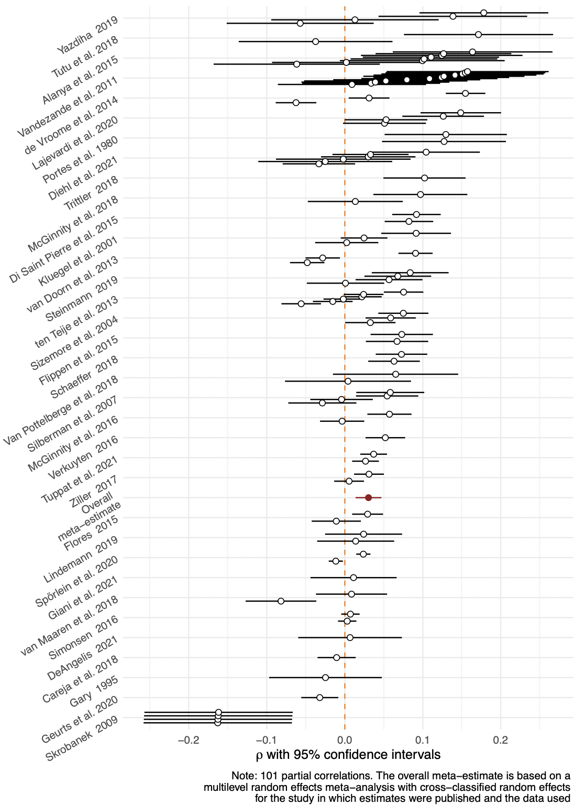
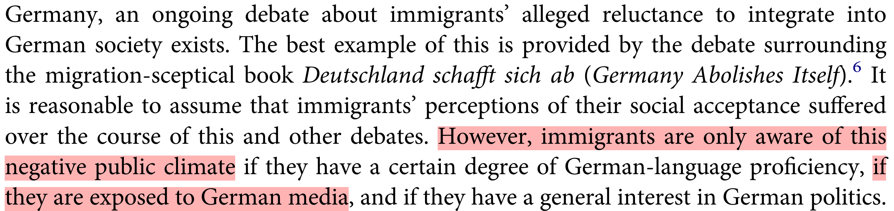
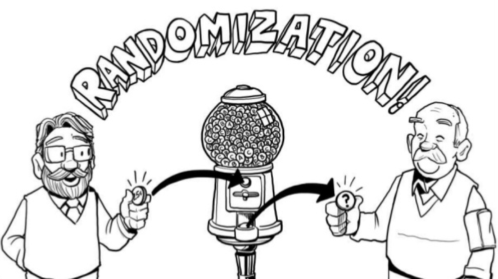
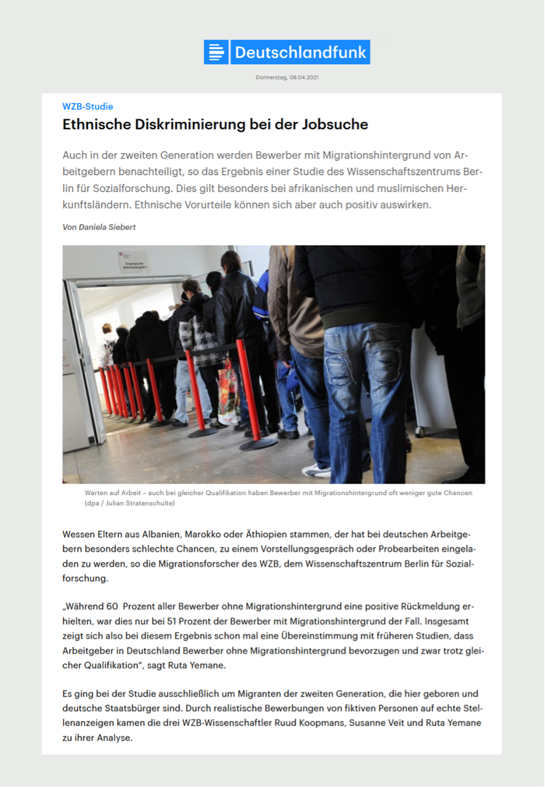
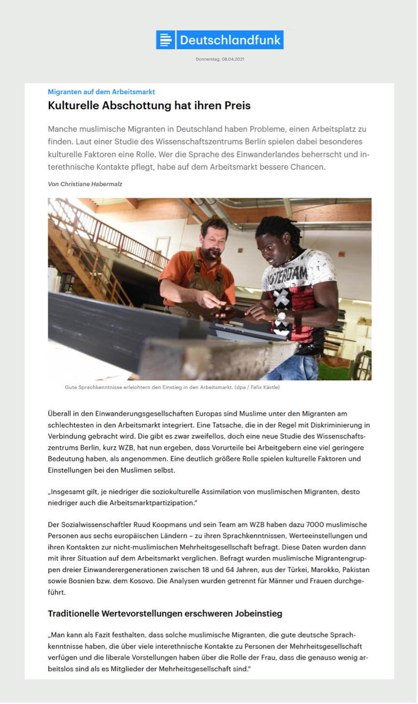

```{r setup, include = FALSE}
library(RefManageR)
library(knitr)
library(ggrepel) # Nicely placed labels in figures.
library(modelr)
library(webexercises) # Small web-based answer scales.
library(equatiomatic) # Regression equations from model objects.
library(essentials)

options(htmltools.preserve.raw = FALSE,
        htmltools.dir.version = FALSE, servr.interval = 0.5, width = 115, digits = 3)
knitr::opts_chunk$set(
  collapse = TRUE, message = FALSE, fig.retina = 3, error = TRUE,
  warning = FALSE, cache = FALSE, fig.align = 'center',
  comment = "#", strip.white = TRUE, tidy = FALSE)

BibOptions(check.entries = FALSE, 
           bib.style = "authoryear", 
           style = "markdown",
           hyperlink = FALSE,
           no.print.fields = c("doi", "url", "ISSN", "urldate", "language", "note", "isbn", "volume"))
myBib <- ReadBib("./../../../Stats_II.bib", check = FALSE)

xaringanExtra::use_xaringan_extra(c("tile_view", "tachyons"))
xaringanExtra::use_panelset()
```

# The goal of social science research

.font140[.center[.alert[Use data to discover patterns ("social facts" in Durkheim's terms), <br> and the social mechanisms that **bring them about**.]]]

```{r, echo = FALSE, out.width='70%', fig.align='center'}
knitr::include_graphics('https://liu.se/-/media/istock-501261958.jpg?mw=1120&mh=1120&hash=DA8977CCE6A6E600AE80A40CFEE771C9')
```

---
class: inverse
.push-left[
<br>
<br>
.font200[**The Integration Paradox**]

Immigrant minorities who have better established themselves among the (native) mainstream report more discrimination on average.
]
.push-right[
```{r, echo = FALSE, out.width='83%', fig.align='center'}

```
.backgrnote[.center[*Source:*]]
]

---
class: inverse
# The Integration Paradox .font60[Research question of the day]

.right-column[
```{r, echo = FALSE, out.width='60%', fig.align='center'}

```

```{r, echo = FALSE, out.width='100%', fig.align='center'}

knitr::include_graphics('img/Steinmann2.png')
```

```{r, echo = FALSE, out.width='100%', fig.align='center'}

```
.backgrnote[.center[*Source:*]]
]

--

.left-column[.center[.font110[
**Does news media consumption** <br><br> _**causally increase**_ <br><br> **immigrant minorities' perceptions that they are being discriminated?**
]]]

---
# The fallacy!

.left-column[

.center["How does reading the news affect you?"]

```{r, echo = FALSE, out.width='100%', fig.align='center'}
knitr::include_graphics('http://www.news.uzh.ch/dam/jcr:00000000-09c6-5ee1-ffff-ffffa1749bbf/mikro.jpg')
```
.content-box-green[.center[
Why might this be problematic?
]]
]

--

.right-column[
.center[**Asking the subjects of inquiry <br> to answer your research question is not enough!**]
- Statements by the subjects of inquiry are important!


- But they are .alert[not credible scientific evidence.]
  + People often weird ideas of how things affect them.
  + Their insights are not based on scientific methods.

```{r, echo = FALSE, out.width='50%', fig.align='center'}
knitr::include_graphics('https://images.prismic.io/sketchplanations/7bceee66-1da8-4c63-ad1c-580283f1f16c_155448043121.jpg?auto=compress,format')
```

]

---
class: clear
# Hypothesis $\rightarrow$ comparison

- $H_{1}:$ Media consumption increases immigrant minorities' perceptions that they are being discriminated!
  + .backgrnote[ 
  $H_{0}:$ Media consumption *does not affect* ...
  ]


- $0 < Avg_{n}[\text{Discrimination}|\text{Read news} = 1] - Avg_{n}[\text{Discrimination}|\text{Read news} = 0]$
 + .backgrnote[ 
 $0 = Avg_{n}[\text{Discrimination}|\text{Read news} = 1] - Avg_{n}[\text{Discrimination}|\text{Read news} = 0]$
 ]
 
--


.content-box-green[
.center[**What are the comparisons implied in the following?**]

- **Marx**: Capitalist labor alienates people from engaging with their many creative talents and reduces psychological wellbeing.

- **Simmel**: Urbanization increases functional social relations and intensifies nervous stimulation. Residents of cities are therefore rational and distant.
]

---
# Preparations

.panelset[
.panel[.panel-name[Packages for today's session]
```{r libraries}
pacman::p_load(
  tidyverse, # Data manipulation,
  furniture, # For row-means,
  ggplot2, # beautiful figures,
  estimatr, # Regression for weighted data,
  modelr, # Turn results of lm() into a tibble,
  modelsummary, # for balance tables,
  ggdag, # Draw DAGs,
  texreg) # regression tables with nice layout.
```
]
.panel[.panel-name[The APAX survey]
.left-column[
- PI: Merlin Schaeffer;<br> Postdoc: Judith Kas.
- XYZ Immigrants and children of immigrants.
- Berlin, Hamburg, Munich, Frankfurt, and Cologne.
- Interviewed in august 2021
- Financed by [German Research Council](https://gepris.dfg.de/gepris/projekt/428878477?language=en)
]

.right-column[.font80[
1. > On a typical day, about how much time do you spend watching, reading, or listening to news about politics and current affairs? *Please give your answer in hours and then minutes.*

2. > Now we would like to ask you about discrimination. How often were you personally discriminated in the following situations here in Germany? .backgrnote[
Discrimination means that a person is treated worse than others including specific reasons for this behavior and no factual justification. People use different modes of discrimination like insult, ostracism, or sexual harassment. Rules and laws disadvantaging people are also discrimination.]
> ...When looking for work or an apprenticeship<br>
> ...At work / in professional life<br>
> ...While attending school or higher education<br>
> ...When looking for housing<br>
> ...When having contact with government officials or public administrators<br>
> ...When you were out in public during your free time<br><br>
> (1) Never, (2) Rarely, (3) Sometimes, (4) Often, (5) Very often<br>
]]
]

.panel[.panel-name[Get the APAX data]
.left-column[.font80[
```{r results = FALSE}
load("APAX.RData") # Read APAX data
APAX <- APAX %>% mutate(
  # News in minutes
  news = news_hrs*60 + news_mins, 
  news_yn = case_when( # News Yes/No
    news < 10 ~ 0, # Less than 15  minutes
    news > 14 ~ 1, # More than 15  minutes
    TRUE ~ as.numeric(NA)),
  # Average discrimination across domains.
  dis_index = rowmeans( #<<
    dis_trainee, dis_job, dis_school, 
    dis_house, dis_gov, dis_public, 
    na.rm = TRUE))
```
]]

.right-column[
```{r echo = FALSE}
APAX
```
]

]]

---
# Fruitless naïv comparison

.push-left[
```{r naiv, out.width = "98%", fig.height = 3.5, fig.width = 5, echo = FALSE}
ggplot(data = APAX, aes(y = dis_index, x = news)) +
  geom_point(aes(size = gewFAKT), alpha = 1/3) +
  geom_smooth(aes(weight = gewFAKT), method = "lm") +
  scale_y_continuous(breaks = 1:5, labels = c("Never", "Rarely", "Sometimes", "Often", "Very often")) +
  labs(y = "Perceived discrimination index", x = "Daily minutes of news consumption") +
  theme_minimal() +
  theme(legend.position = "none")
```
]

--

```{r naiv_OLS}
mod <- lm_robust(dis_index ~ news_yn, 
                 weight = gewFAKT, data = APAX)
screenreg(mod, include.ci = FALSE, digits = 3)
```

---
# Small recap .font60[Hypotheses tests, *t*- and *p*-values]

.left-column[
```{r naiv_OLS}
```
]

.right-column[.font80[
$`r coef(mod)["news_yn"]` = Avg_{n}[\text{Discrimination}|\text{Read news} = 1] - Avg_{n}[\text{Discrimination}|\text{Read news} = 0]$
]

.mini-left[
```{r, echo = FALSE, out.width='100%', fig.align='center'}
knitr::include_graphics('https://www.convinceandconvert.com/wp-content/uploads/2014/07/bigstock-Portrait-of-a-senior-man-skept-12585803.jpg')
```
]

.big-right[
```{r Hypo_test, out.width='100%', fig.height = 4, fig.width = 6, echo = FALSE}
library("car")
library("highr")
library("lattice")

coef <- coef(mod)["news_yn"] %>% round(3) %>% as.scalar()
se <- vcov(mod) %>% diag() %>% sqrt() %>% round(3)
se <- se["news_yn"] %>% as.scalar()
critval <- qt(0.975, 1032)
teh <- mod %>% tidy() %>% filter(term == "news_yn") %>% select(statistic) %>% pull() %>% abs()


betas = seq(-4*se, 4*se, length = 1000)
density = dnorm(betas, sd = se)
data <- as.data.frame(cbind(betas,density))

#First subst the data and add the coordinates to make it shade to y = 0
shade1 <- rbind(c(-critval*se, 0), subset(data, betas > -critval*se & betas < critval*se), c(critval*se, 0))
shade2 <- rbind(c(-teh*se, 0), subset(data, betas > -teh*se & betas < teh*se), c(teh*se, 0))

ggplot(data= data, aes(x = betas, y = density)) +
  geom_path() +
  geom_polygon(data = shade1, aes(betas, density), fill = "#de2d26") +
  geom_polygon(data = shade2, aes(betas, density), fill = "orange") +
  geom_vline(xintercept = 0, colour = "#045a8d", size = 1) +
  geom_vline(xintercept = coef, colour = "#045a8d", size = 1, lty = 2) +
  scale_x_continuous(breaks = c(-critval*se, coef, 0, critval*se), labels = c(expression("0 - Crit.Val.*"~sigma), expression("Est. of "~beta~"=0.042"), expression("H0:"~beta~"=0"), expression("0 + Crit.Val.*"~sigma)), guide = guide_axis(n.dodge = 2)) +
  labs(y = "", x = "") +
  theme_minimal() +
  theme(legend.position = "none")
```
]]

---

EXERCISE 1: NEWS and anto discr-policies

---
# Potential outcomes .font60[Ferda's personal news effect]

.push-left[
$\text{News effect}_{\text{Ferda}} = \underbrace{\text{Discrimination}_{1, \text{Ferda}}}_{\text{Read news} = 1} - \underbrace{\text{Discrimination}_{0, \text{Ferda}}}_{\text{News} = 0}.$

.font80[
|                        Ferda|
-----------------------|:----:
$Y_{0}$: Outcome without news   | 2 (rarely)    
$Y_{1}$: Outcome with news      | 4 (often)  
News effect            | +2    
]]

.push-right[
```{r, echo = FALSE, out.width='80%', fig.align='center'}
knitr::include_graphics('https://miro.medium.com/max/1400/0*M_2Lt3gq2wUHeTrI')
```
]

--

.content-box-green[
.center[
Why can we *never* observe Ferda's news effect?
]]

--

.content-box-red[
.center[
If a person tells us how something affect(ed) them, it is an interesting  personal interpretation. <br> $\Rightarrow$ *But it is not scientific evidence of an effect on them!*
]]

---
layout: true
# Apples and oranges .font60[Ferda compared to Tuki?]

.left-column[
```{r, echo = FALSE, out.width='100%', fig.align='center'}
knitr::include_graphics('https://live.staticflickr.com/3181/2720702285_026ca43aa2_b.jpg')
```
<br>

.font80[
|                        Ferda  | Tuki 
-----------------------|:----:|:----:
$Y_{0}$: Outcome without news | .gray[2 (Rarely)]    | 5<br>(V.often)   
$Y_{1}$: Outcome with news    | 4 (Often)   | .gray[5<br>(V.often)]    
True news effect          | .gray[+2] | .gray[0]    
Actual news          | 1    | 0    
]]

---

.right-column[
$$\begin{equation} \begin{split}
\text{Anomie effect}_{\text{Ferda}} & \neq \underbrace{\text{Discrimination}_{1, \text{Ferda}}}_{4} - \underbrace{\text{Discrimination}_{0, \text{Tuki}}}_{5} = -1
\end{split} \end{equation}$$

.content-box-green[.center[
Why is it misleading to compare Ferda to Tuki?
]]]

---

.right-column[.font90[

$$\begin{equation} \begin{split}
\text{Anomie effect}_{\text{Ferda}} & \neq \underbrace{\text{Discr.}_{1, \text{Ferda}}}_{4} - \underbrace{\text{Discr.}_{0, \text{Tuki}}}_{5} = -1 \\
& = \underbrace{\text{Discr.}_{1, \text{Ferda}} \color{gray}{(- \text{Discr.}_{0, \text{Ferda}}}}_{\text{True news effect: 4 - 5 = 1}} \color{gray}{+} \underbrace{\color{gray}{\text{Discr.}_{0, \text{Ferda}})} - \text{Discr.}_{0, \text{Tuki}}}_{\text{"Selection bias": 4 - 5 = -1}}.
\end{split} \end{equation}$$
]]

---

.right-column[.font90[
$$\begin{equation} \begin{split}
\text{Anomie effect}_{\text{Ferda}} & \neq \underbrace{\text{Discr.}_{1, \text{Ferda}}}_{4} - \underbrace{\text{Discr.}_{0, \text{Tuki}}}_{5} = -1 \\
& = \underbrace{\text{Discr.}_{1, \text{Ferda}} \color{gray}{(- \text{Discr.}_{0, \text{Ferda}}}}_{\text{True news effect: 4 - 5 = 1}} \color{gray}{+} \underbrace{\color{gray}{\text{Discr.}_{0, \text{Ferda}})} - \text{Discr.}_{0, \text{Tuki}}}_{\text{"Selection bias": 4 - 5 = -1}}.
\end{split} \end{equation}$$
]

.content-box-red[.center[
**Selection bias**: $Y_{0, \text{Ferda}} \neq Y_{0, \text{Tuki}}$
$\Rightarrow$ Tuki's *baseline* (i.e., no news) perceived discrimination <br> is higher than Ferda's!
]]]

---
layout: false
# More generally

.right-column[
.content-box-red[.center[
$\text{Selection bias} = \underbrace{Avg_{n}[Y_{0} | X = 1]}_{\text{Unobserved!}} - Avg_{n}[Y_{0} |X = 0].$

$\rightarrow$ The difference in average $Y_{0}$ (the baseline of the outcome) between the groups we compare.

$\underbrace{\text{Difference in group means}}_{\text{Fruitless naïv comparison}} = \text{Average causal effect} + \text{Selection bias}$.
]]

.content-box-green[.center[
Think carefully:<br>Is $Avg_{n}[Y_{0}]$ (the baseline level of the outcome) <br>likely to differ between immigrant minorities who read news regularly and those who do not?

That is, had those who read the news not read them, would they feel as discriminated as those who do not read the news?
]]]

.left-column[
```{r, echo = FALSE, out.width='100%', fig.align='center'}
knitr::include_graphics('https://media.istockphoto.com/photos/children-pulling-a-rope-picture-id521182687?k=20&m=521182687&s=612x612&w=0&h=OeGtAQn8dz4bDiasD09E7QFrNvbQCUoaolztX8QKbcI=')
```
]

---
# Imbalance .font60[Why the comparison is fruitless and naïv]

.panelset[
.panel[.panel-name[R code]
```{r balance1, results = FALSE}
APAX %>%
  # Select variables for which I want my balance test,
  select(news_yn, dis_index, age, nbh_exposed, imor, german, gewFAKT) %>%
  rename(weights = gewFAKT) %>% # Rename the weights variable! #<<
  datasummary_balance( #<<
    formula = ~ news_yn, # By Reading news Yes/No #<< 
    data = . , #<<
    title = "Perceived discrimination and socio-demographic characterisitcs of those who read news and those who don't" #<<
  ) #<<
```

- Note that I `rename(weights = gewFAKT)`
  + Thereby `datasummary_balance()` automatically treats this variable as a weight.
]
.panel[.panel-name[Balance table]
```{r ref.label = "balance1", echo = FALSE}
```
]]

---
layout: true
# Directed Acyclical Graphs (DAGs)

.push-left[
- Nodes represent variables.

- Arrows\edges represent causal effects.

- DAGs are theoretical models and can contain observed and unobserved variables.

- A DAG should capture the underlying social processes and how they came to be represented in the data. LIT

- **Backdoor paths**: all those paths linking $X$ and $Y$ that start with an arrow going into $X$. LIT

- **Confounder \ Backdoor bias** = Selection bias.
]

---
.push-right[
```{tikz, DAG1,  echo = FALSE, out.width='40%'}
\usetikzlibrary{shapes,decorations,arrows,calc,arrows.meta,fit,positioning}
\tikzset{
    -Latex,auto,node distance =1 cm and 1 cm,semithick,
    state/.style ={ellipse, draw, minimum width = 0.7 cm},
    point/.style = {circle, draw, inner sep=0.04cm,fill,node contents={}},
    bidirected/.style={Latex-Latex,dashed},
    el/.style = {inner sep=2pt, align=left, sloped}
}

\begin{tikzpicture}
\sffamily
    \node[state] (1) at (0,0) {$C$};
    \node[state] (2) [below = of 1] {$X$};
    \node[state] (3) [right = of 2] {$Y$};

    \path (1) edge  (2);
    \path[bidirected] (2) edge[red, bend right=50] (3);
    \path (1) edge (3);
\end{tikzpicture}
```
]

---

.push-right[
```{tikz, DAG2,  echo = FALSE, out.width='100%'}
\usetikzlibrary{shapes,decorations,arrows,calc,arrows.meta,fit,positioning}
\tikzset{
    -Latex,auto,node distance =1 cm and 1 cm,semithick,
    state/.style ={ellipse, draw, minimum width = 0.7 cm},
    point/.style = {circle, draw, inner sep=0.04cm,fill,node contents={}},
    bidirected/.style={Latex-Latex,dashed},
    el/.style = {inner sep=2pt, align=left, sloped}
}

\begin{tikzpicture}
\sffamily
    \node[state] (1) at (0,0) {German citizen};
    \node[state] (2) [below = of 1] {Read news};
    \node[state] (3) [right = of 2] {Perc. discrimination};

    \path (1) edge  (2);
    \path (2) edge (3);
    \path[bidirected] (2) edge[red, bend right=50] (3);
    \path (1) edge (3);
\end{tikzpicture}
```
]

---
layout: false

EXERCISE: DAG & balance

---
# Solution: Experiment

.left-column[
- We do not observe, we actively intervene.

- Thereby, we control, who gets $X$ and who does not!

```{r, echo = FALSE, out.width='67%', fig.align='center'}
knitr::include_graphics('./img/randomization1.png')
```
]

.push-right[
```{tikz, DAG3,  echo = FALSE, out.width='40%'}
\usetikzlibrary{shapes,decorations,arrows,calc,arrows.meta,fit,positioning}
\tikzset{
    -Latex,auto,node distance =1 cm and 1 cm,semithick,
    state/.style ={ellipse, draw, minimum width = 0.7 cm},
    point/.style = {circle, draw, inner sep=0.04cm,fill,node contents={}},
    bidirected/.style={Latex-Latex,dashed},
    el/.style = {inner sep=2pt, align=left, sloped}
}

\begin{tikzpicture}
\sffamily
    \node[state] (1) at (0,0) {$C$};
    \node[state] (2) [below = of 1] {$X$};
    \node[state] (3) [right = of 2] {$Y$};

    \path (2) edge (3);
    \path (1) edge (3);
\end{tikzpicture}
```
]

---
# Randomized Controlled Trials (RCT)


.push-left[

```{r, echo = FALSE, out.width='100%', fig.align='center'}

```

- We .alert[randomly] decide, who gets: 
  + $\text{Read news = 0} \rightarrow$ *control group*, 
  + $\text{Read news = 1} \rightarrow$ *treatment group*.
]

--

.push-right[

```{r, echo = FALSE, out.width='70%', fig.align='center'}
knitr::include_graphics('https://lotterylab.s3.amazonaws.com/summernoteimages/606ffa6b3468c.gif')
```

- Randomization is "fair": Everyone has the same probability to be part of the treatment or control group, .alert[regardless of who they are]!

.content-box-green[
.center[Why does this result in equal (Discr.) baselines?]
.font90[
$Avg[\text{Discr.}_{i, \text{Read news} = 0}|\text{Read news} = 1] = Avg[\text{Discr.}_{i, \text{Read news} = 0}|\text{Read news} = 0]$
]]]

---
# Randomized Controlled Trials (RCT)

.push-left[

- If we randomly divide subjects into treatment and control groups, they come from the same underlying population. 

$\rightarrow$ they will be the same *in every way*,<br> **including their $Y_{0}$ **!
]

---
layout: true
class: clear
.push-left[
<br>

.font160[**APAX survey experiment**]
- We asked APAX subjects to read a news article.
- We *randomized* which article they saw.
]

---

.push-right[
```{r, echo = FALSE, out.width='83%', fig.align='center'}

```
]

---

.push-right[
```{r, echo = FALSE, out.width='75%', fig.align='center'}

```
]

---

.push-right[
```{r, echo = FALSE, out.width='100%', fig.align='center'}

```
]

---
layout: false

---
class: inverse
# Today's general lessons

1. R allows you to easily download tons of interesting data.
2. You can combine (i.e., join/merge) data than contain (at least party) the same observations, if they have some variables in common that uniquely identify them. This allows for a lot of fascinating analyses and great term papers!
3. Always make a scatter plot of the variables you want to correlate.
4. Z-standardization helps interpretation and gives a common unit to different variables.
5. The correlation coefficient is an easy to understand statistic of a (undirected) association between two variables.
6. As a linear model, regression expresses on outcome variable as a linear function of a predictor. It thus estimates a directed relation. 
7. $\beta$ the slope, tells us how average levels of $\hat{y}$ chnage with a unit increase in $x$. 
8. OLS finds the linear model that best fits the data.
9. Regression should under normal circumstances not be interpreted in causal terms.
10. Categorical predictors are (typically) dummy coded and then tel us the average difference in the outcome between a category to the reference group.
11. We should make sure that the correlations and regressions we estimate actually capture aprrox. linear relationships and that they are not driven by outliers.

---
class: inverse
# Today's (important) functions

1. `cor()`: Estimate correlation coefficient.
2. `lm()`: Estimate linear OLS regression.
3. `plot(model_object)` to test regression assumptions.
4. `inner_join()`, `left_join()`, `right_join()`, and `full_join()` allow you to join/merge different tibbles together than have common observations and a key that identifies them.
5. `textreg::texreg()`, `textreg::htmlreg()`, and `textreg::screenreg()`: Create nicely-formatted (html, Word, ASCII, or Latex) tables of (one or several) regression models.
6. `scale()` z-standardizes variables. But sometimes it returns a matrix rather than a vector. Therefore it makes sense to always code `scale(x) %>% as.numeric()` to ensure you get an numeric vector out of it.

---
# References