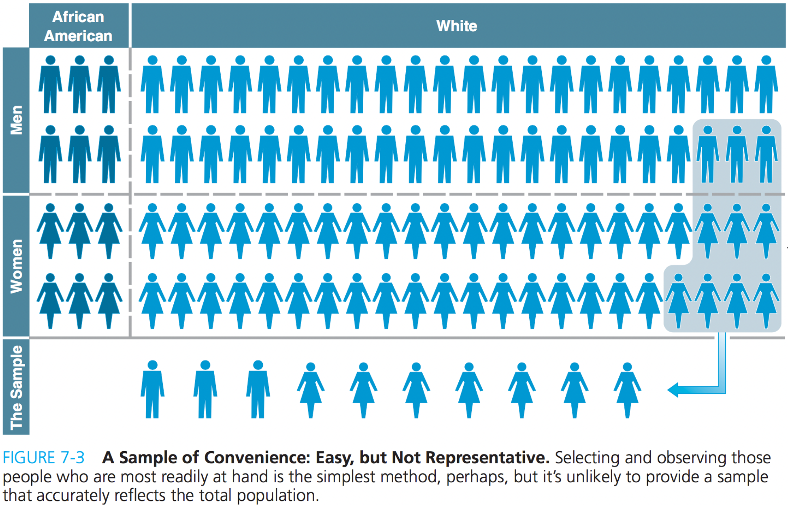
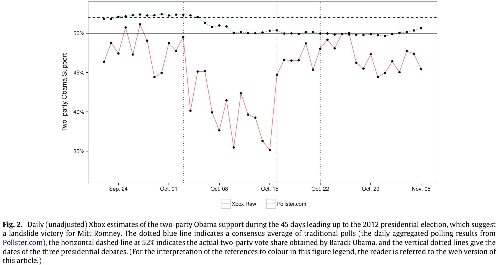

```{r setup, include = FALSE}
library(RefManageR)
library(knitr)
library(httr)

httr::set_config(config(ssl_verifypeer = 0L))

options(htmltools.dir.version = FALSE, servr.interval = 0.5, width = 115, digits = 3)
knitr::opts_chunk$set(
  collapse = TRUE, message = FALSE, fig.retina = 3, error = TRUE,
  warning = FALSE, cache = FALSE, fig.align = 'center',
  comment = "#", strip.white = TRUE, tidy = FALSE)

BibOptions(check.entries = FALSE, 
           bib.style = "authoryear", 
           style = "markdown",
           hyperlink = FALSE,
           no.print.fields = c("doi", "url", "ISSN", "urldate", "language", "note", "isbn", "volume"))
myBib <- ReadBib("./../../../Stats_II.bib", check = FALSE)

xaringanExtra::use_xaringan_extra(c("tile_view", "tachyons"))
xaringanExtra::use_panelset()
```
# Goal of empirical sociology

.font130[.center[Use data to .alert[discover patterns], <br> and the social mechanisms that bring them about.]]

```{r, echo = FALSE, out.width='70%', fig.align='center'}
knitr::include_graphics('https://liu.se/-/media/istock-501261958.jpg?mw=1120&mh=1120&hash=DA8977CCE6A6E600AE80A40CFEE771C9')
```
---
class: inverse
# Today's schedule

1. **Today's research question**: Education and trust in the political system.
  
2. **Randomness**
    + Samples
    + Weights

3. **Statistical inference**
    + Sampling error $\sigma$
    + Standard error $\hat{\sigma}$
    + Confidence intervals
    + Hypothesis tests
        + $H_0$
        + $t$ and $p$-values

---
class: inverse
# Today's research question

.push-left[
<iframe src='https://en.wikipedia.org/wiki/Political_efficacy' width='1200' height='550' frameborder='0' scrolling='yes'></iframe>
]


--

.push-right[
.center[**Do better-educated individuals _generally_ exhibit a stronger belief in the political system's fairness and government responsiveness?**

```{r, echo = FALSE, out.width='90%'}
knitr::include_graphics('https://media.istockphoto.com/vectors/politician-and-masks-vector-id1285284677?k=20&m=1285284677&s=612x612&w=0&h=pE_RkXIK8XaJBtuuHIsEbUo7pvtfu3yHEAQR5h8G-Jw=')
```
.center[.backgrnote[*Source*: [istockphoto.com](https://www.istockphoto.com/de)]]
]]

---
# Preparations

.panelset[
.panel[.panel-name[Packages for today's session]
```{r libraries}
pacman::p_load(
  tidyverse, # Data manipulation,
  haven, # Handle labelled data.
  ggplot2, # beautiful figures,
  estimatr, # Regression for weighted data,
  modelr, # Turn results of lm() into a tibble,
  modelsummary) # regression tables with nice layout.
```
]

.panel[.panel-name[Get the ESS data]
.push-left[
Download the "ESS9e03_1.sav" data from Absalon. Place them into the folder for this course and where you have your R-project.
]
.push-right[
```{r ESS}
# Read the ESS round 9 data
ESS <- read_spss("../../../assets/ESS9e03_1.sav") %>%
  filter(cntry == "DK") %>% # Keep only the Danish data,
  # Keep only a minimum set of variables we need today,
  select(idno, pspwght, gndr, eduyrs, agea, 
         psppsgva, trstlgl, trstplc) %>%
  drop_na() # Delete cases with missing values.
```
]]]

---
class: inverse middle center
# Randomness

---
# General patterns

.push-left[
All data we use are samples based on which we seek to draw general insights.
]

.push-right[
```{r, echo = FALSE, out.width='50%'}
knitr::include_graphics('https://upload.wikimedia.org/wikipedia/commons/thumb/f/fd/Generalization_process_using_trees.svg/1280px-Generalization_process_using_trees.svg.png')
```
.center[.backgrnote[*Source*: [Wikipedia](https://en.wikipedia.org/wiki/Generalization)]]
]

---
# Samples

.center[**Research is based on samples for two reasons:**]

--

.push-left[
(1) Populations are too large to study everyone.

```{r, echo = FALSE, out.width='90%', fig.align='center'}
knitr::include_graphics('https://optimise2.assets-servd.host/best-fit/production/images/Roskilde-2022-Orange-Stage-Post-Malone-FlemmingBoJensen.jpeg?w=600&h=338&q=100&auto=format&fit=crop&dm=1669804307&s=b60a3165c822d00e54be5f3b64a69a7d')
```
]

--

.push-right[
(2) Even if we have (e.g., register) data on everyone, we are interested in .font120[.alert[general patterns and social mechanisms]]:
  - There is less poverty in socialist countries?
  - Do better educated have more political efficacy?
  - Does anomie make people suicidal?
    
    
  $\rightarrow$ We generally want to know these things. .backgrnote[
  (i.e. not only for the current population of Denmark, or for the currently existing countries in the world.)]
  
  .content-box-red[
  $\rightarrow$ We thus treat any data as a sample of an unobservable "super population".
]]

---
# Convenience samples

.left-column[
Samples should be representative: accurately reflect the (unobservable super) population.

.content-box-green[
If you snowball sample starting with your best friend, what biases will that result in? Who would be underrepresented?
]]

.right-column[
```{r, echo = FALSE, out.width='100%', fig.align='center'}

```
]
---
# Random samples!

.push-left[.content-box-red[
.center[**We rely on randomness to<br> draw _unbiased_ conclusions**]

Two types of conclusions:
  1. Random sample $\rightarrow$ Population
  2. Random $x \rightarrow$ causal effect of $x$ on $y$
]]

.push-right[
```{r, echo = FALSE, out.width='80%', fig.align='center'}
knitr::include_graphics('https://m.media-amazon.com/images/I/71jm22A7m9L._AC_SL1200_.jpg')
```
.center[.backgrnote[
Similar to certain mirrors,<br> data often lead to biased insights.]]
]

---
# Why randomness?

.push-left[
.content-box-green[
Why do many games have a random element?
]

```{r, echo = FALSE, out.width='60%', fig.align='center'}
knitr::include_graphics('https://upload.wikimedia.org/wikipedia/commons/7/78/Monopoly_board_on_white_bg.jpg')
```
]

--

.push-right[
```{r, echo = FALSE, out.width='80%', fig.align='center'}
knitr::include_graphics('https://lotterylab.s3.amazonaws.com/summernoteimages/606ffa6b3468c.gif')
```

1. Thrill: No one knows the outcome.

2. .font120[.alert[Fairness!]] Known and similar probabilities for all players, *regardless of who they are*.

]

---
layout: true
# Random samples!

.push-left[

```{r, echo = FALSE, out.width='60%', fig.align='center'}
knitr::include_graphics('https://lotterylab.s3.amazonaws.com/summernoteimages/606ffa6b3468c.gif')
```

<br>
<br>
Random samples are "fair": <br>
Everyone in the (unobservable super) population has the same probability to be part of the sample, .alert[regardless of who they are]!

$\rightarrow$ No group can be forgotten.
]

---

.push-right[
```{r, echo = FALSE, out.width='50%', fig.align='center'}
knitr::include_graphics('https://www.kuechengoetter.de/uploads/media/630x630/02/28602-suppentopf-mit-nudeln-und-haehnchen.jpg?v=1-0')
```
.center[.backgrnote[
Random sampling is the equivalent of <br> giving the soup a proper stir before we taste it ;).]]
]

---
layout: false
class: inverse middle center

Nice talk man.

**But we all know that it's not random who participates in a study**

<br>
```{r, echo = FALSE, out.width='50%', fig.align='center'}
knitr::include_graphics('https://bloximages.chicago2.vip.townnews.com/buffalonews.com/content/tncms/assets/v3/editorial/1/dc/1dc9a2da-fc52-11eb-9244-2b611ea83ea0/61169b5e36ff5.image.jpg')
```


---
# Weights

.push-left[
- A *weight* tells you the probability that a case should be in the sample. .backgrnote[
In a true random sample, each case of the population has an equal probability to be sampled. Thus each sampled case has a weight of 1.]
-  Some groups tend to be over\under-sampled. Post-stratification weights try to counterbalance this.
<br>

.content-box-green[.center[
Why would survey researchers assign lower weights to older people?
]]]

.push-right[
.panelset[
.panel[.panel-name[Plot]
```{r weights_fig, out.width='100%', fig.height = 4, fig.width = 5, results = FALSE, echo = FALSE}
ggplot(data = ESS, 
       mapping = aes(y = pspwght, x = agea)) +
  geom_point(alpha = 1/3) +
  geom_smooth(method = "lm", se = FALSE) + # OLS regression line.
  labs(y = "Post-stratification weight", x = "Age in years",
       caption = "Danish European Social Survey 2018") +
  theme_minimal()
```
]
.panel[.panel-name[Code]
```{r ref.label="weights_fig", results = FALSE, fig.show = "hide"}
```
]]]

---
# How weights work

- Statistically, we use weights by multiplication. 

.push-left[
- Consider an example of a patriarchal society where the weight of men's votes is twice that of women's. In this context, we have a ballot on the topic of women's driving rights.

```{r results = 'asis', echo = FALSE}
library(knitr)
i <- 1:5
Gender <- c("man", "man", "woman", "woman", "woman")
Vote <- c("No", "Yes", "Yes", "Yes", "No")
`Voted yes` <- c(0, 1, 1, 1, 0)
Weight <- c(2, 2, 1, 1, 1)

dat <- tibble(i, Gender, Vote, `Voted yes`, Weight)
kable(dat, format = "html")
```

.center[
.content-box-green[
What is the patriarchy-weighted percent <br> of "Yes"-votes?
]
]
]

--

.push-right[
- Three equivalent ways to calculate the percent of patriarchy-weighted "Yes"-votes:

.panelset[
.panel[.panel-name[1.]
```{r}
((0*2 + 1*2 + 1 + 1 + 0) / 7) * 100 # (1)
```
]
.panel[.panel-name[2.]
```{r}
(sum(`Voted yes` * Weight) / sum(Weight)) * 100 # (2)
```
]
.panel[.panel-name[3.]
```{r}
weighted.mean(x = `Voted yes`, w = Weight) * 100 # (3)
```
]]]

---
# Weights can be amazing!

.push-left[
```{r, echo = FALSE, out.width='100%', fig.align='center'}

```
]

--

.push-right[
```{r, echo = FALSE, out.width='100%', fig.align='center'}
knitr::include_graphics('img/Wang2.png')
```
]


---
# Using weights

.left-column[
- Most R commands have a weights argument.

- For OLS regression use: `estimatr::lm_robust()`. 
.backgrnote[
Using weights results in heteroscedastic residuals, which violates an OLS assumption. lm_robust() corrects for that.]
]

.right-column[
.panelset[
```{r weighted_reg, results= FALSE, echo = FALSE}
# Prepare the data
ESS <- ESS %>% mutate(
    psppsgva = zap_labels(psppsgva), # Make numeric
    eduyrs = case_when( # Censor years of education at 9 & 21 years.
        eduyrs > 21 ~ 21,
        eduyrs < 9 ~ 9,
        TRUE ~ as.numeric(eduyrs)),
    gndr = as_factor(gndr)) # Make factor

# Estimate the models
mod1 <- lm_robust(psppsgva ~ eduyrs, data = ESS) # Unweighted

mod2 <- lm_robust(psppsgva ~ eduyrs, data = ESS, # Weighted
                  weights = pspwght) #<<

# Nicely-formatted regression table
modelsummary(list("Unweighted" = mod1, "Weighted" = mod2),
             statistic = NULL, # Don't report stat. inference
             gof_map = c("nobs", "r.squared")) # Only 2 models fit stats
```

.panel[.panel-name[Example]
```{r ols_fig, out.width='90%', fig.height = 4, fig.width = 6, results = FALSE, echo = FALSE}
ggplot(data = ESS, aes(y = psppsgva, x = eduyrs)) +
  geom_jitter(aes(size = pspwght), alpha = 1/3, width = 0.1, height = 0.1) +
  geom_smooth(aes(weight = pspwght), method = "lm", se = FALSE) +
  theme_minimal() +
  labs(y = "The political system allows people \n to have a say in what government does",
       x = "Years of education")
```
]
.panel[.panel-name[OLS Regression]
```{r ref.label = "weighted_reg", echo = FALSE, results = 'asis'}
```
]
.panel[.panel-name[Code]
```{r ref.label = "weighted_reg", results = FALSE}
```
]]]

---
class: inverse middle center

.push-left[
<br>
<br>
<br>
<br>
<br>
```{r, echo = FALSE, out.width='60%', fig.align='center'}
knitr::include_graphics('https://www.business2community.com/wp-content/uploads/2013/03/Question1.jpg')
```
]

.push-left[
<br>
OK, great: Randomness prohibits systematic biases and thus enables us to draw representative samples. If randomization has partly failed, we use post-stratification weights to counterbalance.

**But doesn't this mean, I have randomness in my data** <br> (e.g., just by chance too many vegetarians or so) <br> **and thus still biased data?**
]

---
class: inverse middle center
# Break

<iframe src='https://www.online-timer.net/' width='400' height='385' frameborder='0' scrolling='yes'></iframe>

---
class: middle clear

.left-column[
```{r, echo = FALSE, out.width='100%'}
knitr::include_graphics('https://cdn.dribbble.com/users/10549/screenshots/9916149/media/a9dbfea8e23e5b8e23db142528c3bc9f.png?compress=1&resize=1200x900&vertical=top')
```

<iframe src='https://www.online-timer.net/' width='400' height='385' frameborder='0' scrolling='yes'></iframe>
]

.right-column[
<br>

<iframe src='exercise1.html' width='1000' height='600' frameborder='0' scrolling='yes'></iframe>
]

---
class: inverse middle center
# Break

<iframe src='https://www.online-timer.net/' width='400' height='385' frameborder='0' scrolling='yes'></iframe>

---
class: inverse middle center
# Statistical inference

---
# Sampling error $\sigma$ .font60[(aka sampling variability)]

.push-left[
**Goal**: Gain unbiased insights from data.

.center[
$\downarrow$ 
]

**Solution**: *Random sampling* prohibits systematic biases, and *weighting* helps to alleviate partly failed randomization.

.center[
$\downarrow$ 
]

**Problem**: Random samples contain unsystematic *sampling error*.

.center[
$\downarrow$ 
]

**Question**: With how much confidence can we *infer* (i.e., generalize) from our random sample to the unobserved (super) population? Could the patterns in our data just be the result of happenstance (i.e., sampling error)?
]

.push-right[
```{r, echo = FALSE, out.width='60%', fig.align='center'}
knitr::include_graphics('https://ecampusontario.pressbooks.pub/app/uploads/sites/376/2019/02/70-959x1024.png')
```
.backgrnote[.center[Random sampling ensures validity (i.e. unbiased), but it results in some unreliability (i.e. sampling error). The question is: How unreliable are the data?]]
]
---
# Sampling error $\sigma$ .font60[(aka sampling variability)]

.push-left[
- **Let's assume, the Danish ESS with it's `r nrow(ESS)` respondents was our (unobservable super) population of interest.** .backgrnote[Thus no weights in this example ;)]

- That would mean, we can *calculate* the true OLS regression line (in blue): $\beta = `r coef(lm(psppsgva ~ eduyrs, data = ESS))["eduyrs"]`$.
]

.push-right[
```{r true_ols, out.width='90%', fig.height = 4, fig.width = 6, results = FALSE, echo = FALSE}
ggplot(data = ESS, aes(y = psppsgva, x = eduyrs)) +
  geom_jitter(alpha = 1/3, width = 0.1, height = 0.1) +
  geom_smooth(method = "lm", se = FALSE) +
  theme_minimal() +
  labs(y = "The political system allows people \n to have a say in what government does",
       x = "Years of education")
```
]

---
# Sampling error $\sigma$ .font60[(aka sampling variability)]

.push-left[
- **Lets assume, the Danish ESS with it's `r nrow(ESS)` respondents was our (unobservable super) population of interest.** .backgrnote[I thus don't use weights in this example ;)]

- That would mean, we can *calculate* the true OLS regression line (in blue): $\beta = `r coef(lm(psppsgva ~ eduyrs, data = ESS))["eduyrs"]`$.

- Now I take a random sample of 50 persons.

```{r sample1}
set.seed(1261990) # Random seed, to reproduce result.
ESS_sample <- ESS %>% sample_n(50) # Draw the sample.
```
]

.push-right[
```{r sample1_ols1, out.width='90%', fig.height = 4, fig.width = 6, results = FALSE, echo = FALSE}
(sample1_ols1 <- ggplot(data = ESS_sample, aes(y = psppsgva, x = eduyrs)) +
  geom_jitter(color = "#901A1E", alpha = 1/3, width = 0.1, height = 0.1) +
  geom_smooth(data = ESS, method = "lm", se = FALSE) +
  theme_minimal() +
  ylim(1, 5) +
  labs(y = "The political system allows people \n to have a say in what government does",
       x = "Years of education"))
```
]

---
# Sampling error $\sigma$ .font60[(aka sampling variability)]

.push-left[
- **Lets assume, the Danish ESS with it's `r nrow(ESS)` respondents was our (unobservable super) population of interest.** .backgrnote[I thus don't use weights in this example ;)]

- That would mean, we can *calculate* the true OLS regression line (in blue): $\beta = `r coef(lm(psppsgva ~ eduyrs, data = ESS))["eduyrs"]`$.

- Now I take a random sample of 50 persons.

```{r ref.label = "sample1", eval = FALSE}
```

- ... and *estimate* an OLS regression line based on that 50-person sample (in red): $\hat{\beta} = `r coef(lm(psppsgva ~ eduyrs, data = ESS_sample))["eduyrs"]`$.
]

.push-right[
```{r sample1_ols2, out.width='90%', fig.height = 4, fig.width = 6, results = FALSE, echo = FALSE}
sample1_ols1 + 
  geom_smooth(method = "lm", se = FALSE, color = "#901A1E")
```
]

---
# Sampling error $\sigma$ .font60[(aka sampling variability)]

.push-left[
- **Lets assume, the Danish ESS with it's `r nrow(ESS)` respondents was our (unobservable super) population of interest.** .backgrnote[I thus don't use weights in this example ;)]

- That would mean, we can *calculate* the true OLS regression line (in blue): $\beta = `r coef(lm(psppsgva ~ eduyrs, data = ESS))["eduyrs"]`$

- .alert[Let's take another random sample of 50 persons.]

```{r sample2}
ESS_sample_2 <- ESS %>% sample_n(50) # Draw the sample.
```

- ... and *estimate* an OLS regression line based on that 50-person sample (in red): $\hat{\beta} = `r coef(lm(psppsgva ~ eduyrs, data = ESS_sample_2))["eduyrs"]`$.
]

.push-right[
```{r sample1_ols3, out.width='90%', fig.height = 4, fig.width = 6, results = FALSE, echo = FALSE}
ggplot(data = ESS_sample_2, aes(y = psppsgva, x = eduyrs)) +
  geom_jitter(color = "#901A1E", alpha = 1/3, width = 0.1, height = 0.1) +
  geom_smooth(data = ESS_sample, 
              method = "lm", se = FALSE, color = "#901A1E", size = 0.3, alpha = 0.1) +
  geom_smooth(data = ESS, method = "lm", se = FALSE) +
  geom_smooth(method = "lm", se = FALSE, color = "#901A1E") +
  ylim(1, 5) +
  theme_minimal() +
  labs(y = "The political system allows people \n to have a say in what government does",
       x = "Years of education")
```
]

---
# Let's do this 1000 times!

.panelset[
.panel[.panel-name[Code for the Nerds]
```{r}
Samples <- bind_rows(
  ESS_sample, ESS_sample_2, 
  .id = "sample_nr") %>%
  mutate(sample_nr = as.numeric(sample_nr))

# Add more samples to the first two in a loop.
for (draw in 3:1000) { 
  Samples <- bind_rows(
    Samples,
    ESS %>% 
      sample_n(50) %>% 
      mutate(sample_nr = draw))
}
```
]
.panel[.panel-name[Animated figure]
```{r sample1000_ols3, out.width='60%', fig.height = 4, fig.width = 6, echo = FALSE}
library(gganimate)

ggplot(data = Samples, aes(y = psppsgva, x = eduyrs)) +
  geom_jitter(color = "#901A1E", alpha = 1/3, width = 0.1, height = 0.1) +
  geom_smooth(method = "lm", se = FALSE, color = "#901A1E", size = 0.7) +
  geom_smooth(data = ESS, method = "lm", se = FALSE) +
  theme_minimal() +
  labs(y = "The political system allows people \n to have a say in what government does",
       x = "Years of education") +
  transition_states(factor(sample_nr),
                    transition_length = 10,
                    state_length = 1) +
  shadow_mark(alpha = 0.15, size = 0.1)
```
]

.panel[.panel-name[Histogram]
```{r sample1000_ols4, out.width='60%', fig.height = 4, fig.width = 6, echo = FALSE}
library(fixest)
library(ggforce)
library(essentials)

Sampled_coefs <- feols(psppsgva ~ eduyrs, data = Samples, split = ~sample_nr) %>%
  coefficients() %>%
  data.frame() %>%
  select(eduyrs) %>%
  rowid_to_column("index")

bin_width <- 0.003

count_data <- # some minor data transformation
  Sampled_coefs %>%
  mutate(x = plyr::round_any(eduyrs, bin_width)) %>%
  group_by(x) %>%
  mutate(y = seq_along(x))

true_beta <- coef(lm(psppsgva ~ eduyrs, data = ESS))["eduyrs"] %>%
  as.scalar() %>%
  round(3)

SD <- sd(Sampled_coefs$eduyrs)
beta_hat <- Sampled_coefs$eduyrs

ggplot(count_data) +
  geom_vline(xintercept = true_beta, color = "#901A1E") +
  geom_ellipse(aes(color = abs(true_beta - x), fill = abs(true_beta - x),
                   group = index, x0 = x, y0 = y, a = bin_width/2, b = 0.5, angle = 0)) +
  coord_equal(bin_width) + # to make the dots look nice and round
  scale_fill_steps(low = "#901A1E", high = "#425570", breaks = c(round(1.65*SD, 3), round(1.96*SD, 3)), nice.breaks = FALSE, guide = FALSE) +
  scale_color_steps(low = "#901A1E", high = "#425570", breaks = c(round(1.65*SD, 3), round(1.96*SD, 3)), nice.breaks = FALSE, guide = FALSE) +
  scale_x_continuous(breaks = c(round(true_beta-1.96*SD, 3), round(true_beta-1.65*SD, 3), round(true_beta, 3), round(true_beta+1.65*SD, 3), round(true_beta+1.96*SD, 3)), guide = guide_axis(n.dodge = 2)) +
  theme_minimal() +
  labs(y = "Count", x = expression(beta)) # +
  # gganimate::transition_reveal(along = index)
```
]
.panel[.panel-name[Normal distribution]
.left-column[
.center[We know the area under the Normal distribution!]

- .alert["Critical values"]: 
  + $\sigma = 1.65$ for 90%
  + $\sigma = 1.96$ for 95%

.font90[
```{r}
# If assuming the Normal distribution
# is correct, then 95% of the 
# estimates of beta will lie in 
# the interval:
mean(beta_hat) - 1.96 * sd(beta_hat)
mean(beta_hat) + 1.96 * sd(beta_hat)
```
]]

.right-column[
```{r, echo = FALSE, out.width='80%'}
knitr::include_graphics('img/68-90-99.png')
```
.center[.backgrnote[*Source:* `r Citet(myBib, "veaux_stats_2021")`]]
]]
.panel[.panel-name[*t*-distribution]
.left-column[
.center[With small samples things are a bit more complex!]

Critical values depend on the degrees of freedom (df): Sample size $n$ minus the number of estimated parameters.

.font80[
```{r}
# Critical value for 95%,
# with df = 50 - 5:
(crit_val <- qt(p = 0.975, df = 48))

# 95% of the estimates of beta 
# will lie in the interval
mean(beta_hat) - crit_val * sd(beta_hat)
mean(beta_hat) + crit_val * sd(beta_hat)
```
]]

.right-column[
```{r, echo = FALSE, out.width='65%'}
knitr::include_graphics('img/t-dist.png')
```
.center[.backgrnote[*Source:* [Wikipedia](https://en.wikipedia.org/wiki/Student%27s_t-distribution)]]
]]

]


---
class: inverse middle center

.push-left[
<br>
<br>
<br>
<br>
<br>
```{r, echo = FALSE, out.width='60%', fig.align='center'}
knitr::include_graphics('https://www.business2community.com/wp-content/uploads/2013/03/Question1.jpg')
```
]

.push-left[
<br>
But if I can't sample the whole (unobservable super) population, then I surely can't draw thousands of 50 person samples.
]

---
class: clear
layout: true
# The standard error $\hat{\sigma}$ .font70[(i.e., estimated sampling error)]

.left-column[
True sampling error from our repeated samples:

```{r}
sd(beta_hat)
```

```{r ref.label = "sample1000_ols4", out.width='100%', fig.height = 4, fig.width = 6, echo = FALSE}
```
]

---

---

.right-column[
.push-left[
```{r, echo = FALSE, out.width='60%', fig.align='center'}
knitr::include_graphics('https://upload.wikimedia.org/wikipedia/commons/thumb/e/ec/Carl_Friedrich_Gauss_1840_by_Jensen.jpg/440px-Carl_Friedrich_Gauss_1840_by_Jensen.jpg')
```
.center[.backgrnote[Carl Friedrich Gauss (1777-1855)]]
]
.push-right[
Thanks to mathematician [Carl Friedrich Gauss](https://en.wikipedia.org/wiki/Carl_Friedrich_Gauss), we can *estimate* the sampling error of most statistics based on a single sample!
]]

---

.right-column[
.push-left[
Estimated sampling error based on our initial 50-person sample using Gauss' formula for the standard error of an OLS regression coefficient: $$\hat{\sigma}(\beta)=\sqrt{\frac{1}{n-2}\frac{\text{SD}(e)}{\text{SD}(x)}}$$
]
.push-right[
```{r}
mod <- lm_robust( # OLS regression
  psppsgva ~ eduyrs, 
  se_type = "classical", # Gauss #<<
  data = ESS_sample) #<<

modelsummary( # Regression table
  list("Pol. efficacy" = mod),
  gof_map = c("nobs", "r.squared"))
```
]]

---

.right-column[
.push-left[
Estimated sampling error based on our second 50-person sample using Gauss' formula for the standard error of an OLS regression coefficient, $\hat{\sigma}(\beta)=\sqrt{\frac{1}{n-2}\frac{\text{SD}(e)}{\text{SD}(x)}}$
]
.push-right[
```{r}
mod2 <- lm_robust( # OLS regression
  psppsgva ~ eduyrs, 
  se_type = "classical", # Gauss #<<
  data = ESS_sample_2) #<<

modelsummary( # Regression table
  list("Pol. efficacy" = mod2),
  gof_map = c("nobs", "r.squared"))
```
]]

---
layout: false
# 95% Confidence intervals 

.left-column[
.content-box-green[
If we continuously drew random samples and estimated the interval:

$\hat{\beta} \pm \text{Critical value} * \hat{\sigma}$, 

how many of these would contain $\beta$?
]
]
.right-column[
<iframe src='https://seeing-theory.brown.edu/frequentist-inference/index.html#section2' width='1200' height='550' frameborder='0' scrolling='yes'></iframe>
]

---
class: clear
# Visualizing uncertainty .font70[95% CIs in scatterplots]

.panelset[
.panel[.panel-name[Code]
```{r 95ci, fig.show = "hide"}
ggplot(data = ESS_sample, aes(y = psppsgva, x = eduyrs)) +
  geom_jitter(alpha = 1/3, width = 0.1, height = 0.1) +
  geom_smooth(method = "lm", # OLS
              level = 0.95, # 95% CI
              color = "#901A1E") + 
  ylim(1, 5) +
  labs(y = "The political system allows people \n to have a say in what government does",
       x = "Years of education") +
  theme_minimal()
```
]
.panel[.panel-name[Plot]
.push-left[
```{r ref.label = "95ci", out.width='90%', fig.height = 4, fig.width = 6, echo = FALSE}
```
]

.push-right[
```{r ref.label = "sample1000_ols3", out.width='90%', fig.height = 4, fig.width = 6, echo = FALSE}
```
]]]

---
layout: true
# Hypotheses tests .font60[The Null Hypothesis]

.left-column[
<br>

```{r, echo = FALSE, out.width='100%', fig.align='center'}
knitr::include_graphics('https://upload.wikimedia.org/wikipedia/commons/5/59/The_Debate_Of_Socrates_And_Aspasia.jpg')
```
.center[.backgrnote[The debate of Socrates and Aspasia]]

Doing research is basically like having a debate with an opponent who does not believe your argument.
]

---

---

.right-column[
<br>

.push-left[
```{r, echo = FALSE, out.width='60%', fig.align='center'}
knitr::include_graphics('https://www.convinceandconvert.com/wp-content/uploads/2014/07/bigstock-Portrait-of-a-senior-man-skept-12585803.jpg')
```
]

.push-right[
> More educated people read more news and thus know about all the corruption. 

> Certainly, their believe in political efficacy is no different!

> That you find otherwise in your data is just a chance finding.

]]

---

.right-column[
<br>

.push-left[
```{r, echo = FALSE, out.width='60%', fig.align='center'}
knitr::include_graphics('https://www.convinceandconvert.com/wp-content/uploads/2014/07/bigstock-Portrait-of-a-senior-man-skept-12585803.jpg')
```
]

.push-right[
> More educated people read more news and thus know about all the corruption. 

> Certainly, their believe in political efficacy is no different!

> That you find otherwise in your data is just a chance finding.

$\rightarrow \underbrace{H_{0}:}_{\text{Aka }H_{\text{0pponent  }} ;)}\beta_{\text{Years of education}} = 0$
]]

---
layout: false
# The weird logic .font60[of hypotheses tests]

.push-left[
- $H_{0}:$ Today, the sun is shining!

- What is the probability that I randomly observe 5 kids, all of whom go to school with an umbrella, under the assumption: $H_{0} = \text{TRUE}$?
  + $P(\text{5 Umbrella kids}|\text{Sunshine})$


- If $P(\text{5 Umbrella kids}|\text{Sunshine}) < 5\%$,<br> I rather believe the sun is not shining!
]

.push-right[
```{r, echo = FALSE, out.width='90%', fig.align='center'}
knitr::include_graphics('https://i.pinimg.com/originals/20/a6/33/20a633fe23ae51592ee7919e983b41f9.jpg')
```
]

---
layout: false
# The weird logic .font60[of hypotheses tests]

.push-left[
- $H_{0}:$ Today, the sun is shining!

- What is the probability that I randomly observe 5 kids, all of whom go to school with an umbrella, under the assumption: $H_{0} = \text{TRUE}$?
  + $P(\text{5 Umbrella kids}|\text{Sunshine})$


- If $P(\text{5 Umbrella kids}|\text{Sunshine}) < 5\%$,<br> I rather believe the sun is not shining!

.content-box-green[.center[
Can you come up with another example?
]]
]

.push-right[
```{r, echo = FALSE, out.width='90%', fig.align='center'}
knitr::include_graphics('https://i.pinimg.com/originals/20/a6/33/20a633fe23ae51592ee7919e983b41f9.jpg')
```
]

---
# Put into practice

.left-column[
<br>

```{r, echo = FALSE, out.width='60%', fig.align='center'}
knitr::include_graphics('https://www.convinceandconvert.com/wp-content/uploads/2014/07/bigstock-Portrait-of-a-senior-man-skept-12585803.jpg')
```

$\underbrace{H_{0}:}_{\text{Aka }H_{\text{0pponent  }} ;)}\beta_{\text{Years of education}} = 0$
]

--

.right-column[
.panelset[
.panel[.panel-name[Regression model]
```{r ols}
ols <- lm_robust(psppsgva ~ eduyrs, data = ESS_sample)
summary(ols)
```
]

.panel[.panel-name[Hypothesis test]
```{r density1, out.width='90%', fig.height = 4, fig.width = 6, echo = FALSE}
library("car")
library("highr")
library("lattice")

coef <- coef(ols)["eduyrs"] %>% round(3) %>% as.scalar()
se <- vcov(ols) %>% diag() %>% sqrt() %>% round(3)
se <- se["eduyrs"] %>% as.scalar()
critval <- qt(0.975, 48)

betas = seq(-4*se, 4*se, length = 1000)
density = dnorm(betas, sd = se)
data <- as.data.frame(cbind(betas,density))

#First subst the data and add the coordinates to make it shade to y = 0
shade <- rbind(c(-critval*se,-critval*se), subset(data, betas > -critval*se & betas < critval*se), c(critval*se, 0))

ggplot(data= data, aes(x = betas, y = density)) +
  geom_path() +
  geom_polygon(data = shade, aes(betas, density), fill = "#de2d26") +
  geom_vline(xintercept = 0, colour = "#045a8d", size = 1) +
  geom_vline(xintercept = coef, colour = "#045a8d", size = 1, lty = 2) +
  scale_x_continuous(breaks = c(-critval*se, 0, coef, critval*se), labels = c(expression("0 - Crit.Val.*"~sigma), expression("H0:"~beta~"=0"), expression("Est. of "~beta~"=0.042"), expression("0 + Crit.Val.*"~sigma)), guide = guide_axis(n.dodge = 2)) +
  labs(y = "", x = "") +
  theme_minimal() +
  theme(legend.position = "none")
```
]
.panel[.panel-name[t- and p-value]
.push-left[
- $t=\frac{\hat{\beta}}{\sigma}$: How many $\sigma$'s is $\hat{\beta}$ away from $H_{0}:\beta=0$?


- $p$-value: The area outside $0 \pm t$
  + $P(\hat{\beta}|\beta=0)$: The probability that we observe $\hat{\beta}$, although $\beta=0$ in reality.
]
.push-right[
```{r density2, out.width='90%', fig.height = 4, fig.width = 6, echo = FALSE}
teh <- ols %>% tidy() %>% filter(term == "eduyrs") %>% select(statistic) %>% pull()
#First subst the data and add the coordinates to make it shade to y = 0
shade2 <- rbind(c(-teh*se,-teh*se), subset(data, betas > -teh*se & betas < teh*se), c(teh*se, 0))

ggplot(data= data, aes(x = betas, y = density)) +
  geom_path() +
  geom_polygon(data = shade, aes(betas, density), fill = "#de2d26") +
  geom_polygon(data = shade2, aes(betas, density), fill = "orange") +
  geom_vline(xintercept = 0, colour = "#045a8d", size = 1) +
  geom_vline(xintercept = coef, colour = "#045a8d", size = 1, lty = 2) +
  scale_x_continuous(breaks = c(-teh*se, 0, coef), labels = c(expression("0 - t*"~sigma), expression("H0:"~beta~"=0"), expression("Est. of "~beta~"=0.042"))) +
  labs(y = "", x = "") +
  theme_minimal() +
  theme(legend.position = "none")
```
]]]
]

---
# Learning goal achieved!

.left-column[
.center[**Do better-educated individuals _generally_ exhibit a stronger belief in the political system's fairness and government responsiveness?**

```{r, echo = FALSE, out.width='90%'}
knitr::include_graphics('https://media.istockphoto.com/vectors/politician-and-masks-vector-id1285284677?k=20&m=1285284677&s=612x612&w=0&h=pE_RkXIK8XaJBtuuHIsEbUo7pvtfu3yHEAQR5h8G-Jw=')
```
.center[.backgrnote[*Source*: [istockphoto.com](https://www.istockphoto.com/de)]]
]]

.right-column[
.panelset[
.panel[.panel-name[Regression table]
```{r}
ols_goal <- lm_robust(psppsgva ~ eduyrs, weights = pspwght, data = ESS)
summary(ols_goal, include.ci = FALSE, digits = 3)
```
]
.panel[.panel-name[Scatterplot]
```{r goal, out.width='90%', fig.height = 4, fig.width = 6, echo = FALSE}
ggplot(data = ESS, aes(y = psppsgva, x = eduyrs)) +
  geom_jitter(aes(size = pspwght), alpha = 1/3, height = 0.1, width = 0.1) +
  geom_hline(yintercept = mean(ESS$psppsgva, na.rm = TRUE), color = "orange") +
  geom_smooth(method = "lm") +
  labs(y = "The political system allows people \n to have a say in what government does",
       x = "Years of education") +
  theme_minimal() +
  theme(legend.position = "none")
```
]]]

---
class: inverse middle center
# Break

<iframe src='https://www.online-timer.net/' width='400' height='385' frameborder='0' scrolling='yes'></iframe>

---
class: middle clear

.left-column[
```{r, echo = FALSE, out.width='100%'}
knitr::include_graphics('https://www.latentview.com/wp-content/uploads/2016/04/LatentView-Turns-Ten-A-decade-of-data-science.jpg')
```

<iframe src='https://www.online-timer.net/' width='400' height='385' frameborder='0' scrolling='yes'></iframe>
]

.right-column[
<br>
<iframe src='exercise2.html' width='1000' height='600' frameborder='0' scrolling='yes'></iframe>
]

---
class: inverse
# Today's general lessons
- Randomness prevents systematic bias, ensuring that random samples are representative unless the sample size (n) is very small.
- In cases where random sampling is not feasible, we utilize post-stratification weights to counterbalance bias.
- Random sampling introduces sampling error, which reduces reliability.
- These errors follow a normal or $t$-distribution, depending on the sample size.
- We can estimate the sampling error from our data using the standard error $(\hat{\sigma})$.
- By leveraging our knowledge of the normal and $t$-distributions, we can estimate 95% confidence intervals to express uncertainty and conduct hypothesis tests to determine the likelihood of our findings being due to chance.
- Hypothesis tests assess the null hypothesis ($H_0$), typically the opposite of what is being demonstrated.
- They evaluate the probability ($p$-value) of observing the data when $H_0$ is true.
- The $t$-value represents the number of standard errors by which the estimate (e.g., $\beta$) deviates from the null hypothesis (usually 0).
- The $p$-value indicates the area under the sampling distribution outside of $H_0 \pm t$. Conventionally, the $p$-value should be $<0.05$.

---
class: inverse
# Today's (important) R functions
- `geom_smooth(method = "lm")`: Add OLS lines to scatter plots.
- Most R functions have a `weights` argument.
- `modelsummary()` allows you to design your regression tables in various ways.
---
# References

.font80[
```{r ref, results = 'asis', echo = FALSE}
PrintBibliography(myBib)
```
]