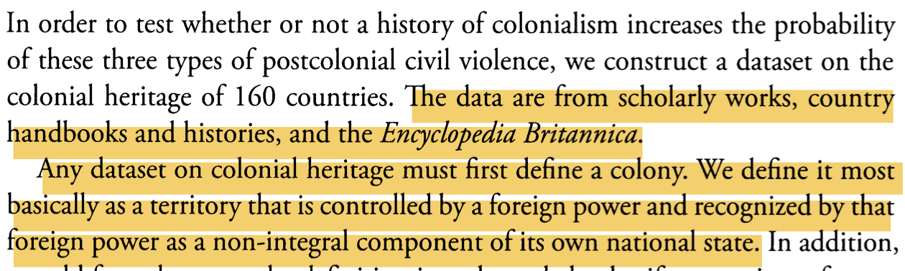
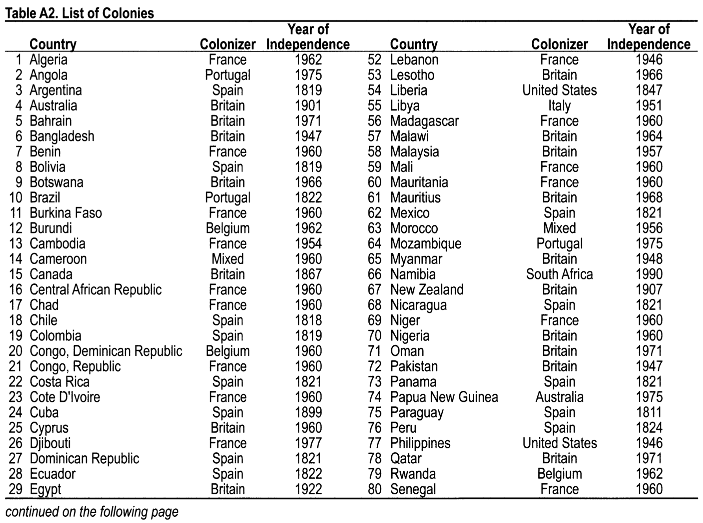
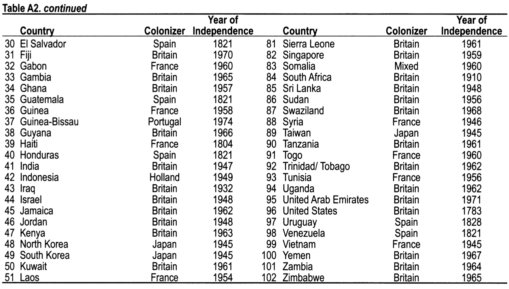

```{r setup, include = FALSE}
library(RefManageR)
library(knitr)
library(ggrepel) # Nicely placed labels in figures.
library(modelr)
library(webexercises) # Small web-based answer scales.
library(equatiomatic) # Regression equations from model objects.

options(htmltools.preserve.raw = FALSE,
        htmltools.dir.version = FALSE, servr.interval = 0.5, width = 115, digits = 3)
knitr::opts_chunk$set(
  collapse = TRUE, message = FALSE, fig.retina = 3, error = TRUE,
  warning = FALSE, cache = FALSE, fig.align = 'center',
  comment = "#", strip.white = TRUE, tidy = FALSE)

BibOptions(check.entries = FALSE, 
           bib.style = "authoryear", 
           style = "markdown",
           hyperlink = FALSE,
           no.print.fields = c("doi", "url", "ISSN", "urldate", "language", "note", "isbn", "volume"))
myBib <- ReadBib("./../../../Stats_II.bib", check = FALSE)

xaringanExtra::use_xaringan_extra(c("tile_view", "tachyons"))
xaringanExtra::use_panelset()
```

# The goal of social science research

.font140[.center[.alert[Use data to **discover patterns** ("social facts" in Durkheim's terms), <br> and the social mechanisms that bring them about.]]]

```{r, echo = FALSE, out.width='70%', fig.align='center'}
knitr::include_graphics('https://liu.se/-/media/istock-501261958.jpg?mw=1120&mh=1120&hash=DA8977CCE6A6E600AE80A40CFEE771C9')
```
---
class: inverse middle
# Today's schedule

1. **Application**: Colonialism and poverty
  + History of colonial rule data.
  
2. **OLS assumptions**
  + No outliers
  + Linearity
  
3. **Categorical predictors**
  + Dummy coding
  
4. **Binary outcomes**
  + Linear probability model (LPM)
  
5. **Visualizing regression**
  + Coefficient plots
  + Model predictions
  
---
class: inverse
# Colonial legacy

.push-left[
```{r, echo = FALSE, out.width='100%', fig.align='center'}
knitr::include_graphics('https://cdn.cfr.org/sites/default/files/styles/open_graph_article/public/image/2020/01/France-Macron-Pau-Summit-G5-Sahel.jpg?h=63648819')
```
]

--

.push-right[
```{r, echo = FALSE, out.width='80%', fig.align='center'}
knitr::include_graphics('https://en.natmus.dk/typo3temp/assets/images/csm_neky-holbech-16x9_b72c084303_2836164db1.jpg')
```

```{r, echo = FALSE, out.width='80%', fig.align='center'}
knitr::include_graphics('https://ichef.bbci.co.uk/news/976/cpsprodpb/6E2E/production/_113460282_mediaitem113460280.jpg')
```
]

---
class: inverse
# Colonial legacy and extreme poverty

.left-column[
- .font130[How much could former colonies reduce extreme poverty since independence?]

- .font130[How do different colonial legacies compare to one another <br> (former French vs British colonies) <br> in terms of contemporary extreme poverty?]
]

.right-column[
.font130[.center[Colonial empires 1945]]
```{r, echo = FALSE, out.width='100%', fig.align='center'}
knitr::include_graphics('https://upload.wikimedia.org/wikipedia/commons/a/a9/Colonization_1945.png')
```
.center[*Source*: [.white[Wikipedia]](https://en.wikipedia.org/wiki/File:World_1914_empires_colonies_territory.PNG)]]

---
# Preparations

.panelset[
.panel[.panel-name[Packages for today's session]
```{r}
pacman::p_load(
  tidyverse, # Data manipulation,
  ggplot2, # beautiful figures,
  democracyData, # download democracy datasets used in the scholarly literature.
  wbstats, # download data from Worldbank. Tremendous source of global socio-economic data.
  estimatr, # OLS with robust SE,
  texreg) # regression tables with nice layout,
```
]]

---
class: clear
# Worldbank Data .font70[On extreme poverty across the World]

.panelset[
.panel[.panel-name[Searching Wb archive]
- With `wbstats::wb_search()`, you can search the Wb archive for any keyword! Here I use "poverty":
```{r}
(wb_poverty_archive <- wb_search("poverty"))
```
]
.panel[.panel-name[Get Wb data]
```{r}
(Dat <- wb_data("SI.POV.DDAY", # Download poverty data: <1.90$ per day,
                start_date = 2002, end_date = 2022) %>%
   rename(poverty = SI.POV.DDAY) %>% # rename poverty variable,
   select(country, date, poverty) %>% # Keep only 3 variables
   drop_na(poverty) %>% # Drop cases with missing data,
   group_by(country) %>% # Group by country,
   filter(date == max(date)) %>% # Keep the most recent data per country.
   mutate(date = as.numeric(date)) %>% ungroup())
```
]
.panel[.panel-name[Extreme poverty across the world]
```{r poverty-world, out.width='100%', fig.height = 8, fig.width = 20, results = FALSE, echo = FALSE}
ggplot(data = Dat, # Make coord system for data,
       aes(y = poverty, # Y- and X-axis of plot,
           x = reorder(country, poverty))) +
  geom_bar(stat = "identity") + # plot data as is in a bar chart,
  labs(y = "% population with less than 1.90$ a day", x = "") + # Axis labels,
  theme_minimal() + # Simple background layout,
  theme(axis.text.x = element_text(angle = 60, hjust = 1)) # Write country names in a 60 degree angle.
```
]]

---
# Colonial legacy

.panelset[
.panel[.panel-name[A study]

.push-left[
<iframe src='https://academic.oup.com/sf/article/88/2/785/2235304' width='800' height='500' frameborder='0' scrolling='yes'></iframe>
]

.push-right[
```{r, echo = FALSE, out.width='100%', fig.align='center'}

```
.center[.backgrnote[*Source*: `r Citet(myBib, "veaux_stats_2021", after = ", p.199")`]]
]
]

.panel[.panel-name[Its data]

.push-left[
```{r, echo = FALSE, out.width='100%', fig.align='center'}

```
]

.push-right[
```{r, echo = FALSE, out.width='100%', fig.align='center'}

```
.center[.backgrnote[*Source*: `r Citet(myBib, "veaux_stats_2021", after = ", p.199")`]]
]]

.panel[.panel-name[Coding colonial powers]

```{r}
Dat <- Dat %>% 
  mutate(
    colonizer = case_when(
      str_detect(country, "Algeria|Benin|Burkina Faso|Cambodia|Central African Republic|Chad") |
        str_detect(country, "Djibouti|Gabon|Guinea|Haiti|Laos|Lebanon|Madagascar|Mali|Congo, Rep.|Cote D'Ivoire") | 
        str_detect(country, "Mauritania|Niger|Senegal|Syria|Togo|Tunisia|Vietnam") ~ "France", # France
      str_detect(country, "Angola|Brazil|Mozambique|Guinea-Bissau") ~ "Portugal", # Portugal
      str_detect(country, "Argentina|Bolivia|Chile|Colombia|Costa Rica|Cuba|Dominican Republic|Ecuador") |
        str_detect(country, "El Salvador|Guatemala|Honduras|Mexico|Nicaragua|Panama|Paraguay|Peru") |
        str_detect(country, "Uruguay|Venezuela") ~ "Spain", # Spain
      str_detect(country, "Australia|Bahrain|Bangladesh|Botswana|Canada|Cyprus|Egypt|Fiji") |
        str_detect(country, "Gambia|Ghana|Guyana|India|Iraq|Israel|Jamaica|Jordan|Kenya|Kuwait") |
        str_detect(country, "Lesotho|Malawi|Malaysia|Mauritius|Myanmar|New Zealand|Nigeria|Oman") | 
        str_detect(country, "Pakistan|Qatar|Sierra Leone|Singapore|South Africa") | 
        str_detect(country, "Sri Lanka|Sudan|Swaziland|Tanzania|Trinidad/Tobago|Uganda") | 
        str_detect(country, "United Arab Emirates|United States|Yemen|Zambia|Zimbabwe") ~ "Britain", # Britain
      str_detect(country, "Burundi|Congo, Dem. Rep.|Rwanda") ~ "Belgium")) # Belgium
      # str_detect(country, "Liberia|Philippines") ~ "USA", # USA
      # str_detect(country, "Libya|Somalia") ~ "Italy", # Italy
      # str_detect(country, "Indonesia") ~ "Holland", # Holland
      # str_detect(country, "Namibia") ~ "South Africa", # Holland
      # str_detect(country, "Korea|Taiwan") ~ "Japan")) # Japan
```
]

.panel[.panel-name[Plot Colonizer]
```{r col-powers, out.width='100%', fig.height = 4.5, fig.width = 12, results = FALSE, echo = FALSE}
Dat <- Dat %>%
  mutate(
    colonizer = factor(colonizer, levels=names(sort(table(colonizer), decreasing = TRUE))))

ggplot(data = Dat %>% filter(!is.na(colonizer)), # Make coord system for data,
       aes(x = colonizer)) + # Y- and X-axis of plot,
  geom_bar() + # plot data as is in a bar chart,
  labs(y = "Nr of (former) colonies", x = "") + # Axis labels,
  theme_minimal()
```
]

.panel[.panel-name[Coding independence]
.font60[
```{r}
Dat <- Dat %>% 
  mutate(
    years_indep = case_when(
      is.na(colonizer) ~ as.numeric(NA),
      country == "United States" ~ date - 1783, country == "Haiti" ~ date - 1804, 
      country == "Paraguay" ~ date - 1811, country == "Chile" ~ date - 1818,
      str_detect(country, "Argentina|Bolivia|Colombia") ~ date - 1819,
      str_detect(country, "Costa Rica|Dominican Republic|Mexico|Nicaragua|Panama|El Salvador|Guatemala|Honduras|Venezuela") ~ date - 1821,
      str_detect(country, "Brazil|Ecuador") ~ date - 1822,
      country == "Peru" ~ date - 1824, country == "Uruguay" ~ date - 1828,
      country == "Cuba" ~ date - 1899, country == "Australia" ~ date - 1901,
      country == "New Zealand" ~ date - 1907, country == "South Africa" ~ date - 1910,
      country == "Egypt" ~ date - 1922, country == "Iraq" ~ date - 1932,
      str_detect(country, "Korea|Taiwan|Vietnam") ~ date - 1945,
      str_detect(country, "Lebanon|Philippines|Syria") ~ date - 1946,
      str_detect(country, "Bangladesh|Pakistan|India|Liberia") ~ date - 1947,
      str_detect(country, "Myanmar|Israel|Jordan|Sri Lanka") ~ date - 1948,
      country == "Indonesia" ~ date - 1949, country == "Libya" ~ date - 1951,
      str_detect(country, "Cambodia|Loas") ~ date - 1954,
      str_detect(country, "Morocco|Sudan|Tunisia") ~ date - 1956,
      str_detect(country, "Malaysia|Ghana") ~ date - 1957,
      country == "Guinea" ~ date - 1958, country == "Singapore" ~ date - 1959,
      str_detect(country, "Benin|Burkina Faso|Central African Republic|Chad|Congo, Dem. Rep.|Congo, Rep.|Code D'Ivoire|Mali|Mauritania|Niger|Nigeria|Senegal|Gabon|Somalia|Togo") ~ date - 1960,
      str_detect(country, "Kuwait|Sierra Leone|Tanzania") ~ date - 1961,
      str_detect(country, "Algeria|Burundi|Rwanda|Jamaica|Trinidad/ Tobago|Uganda") ~ date - 1962,
      country == "Kenya" ~ date - 1963,
      str_detect(country, "Malawi|Zambia") ~ date - 1964,
      str_detect(country, "Gambia|Zimbabwe") ~ date - 1965,
      str_detect(country, "Botswana|Lesotho|Guyana") ~ date - 1966,
      str_detect(country, "Canada|Yemen") ~ date - 1967,
      str_detect(country, "Mauritius|Swaziland") ~ date - 1968,
      country == "Fiji" ~ date - 1970,
      str_detect(country, "Bahrain|Oman|Qatar|United Arab Emirates") ~ date - 1971,
      country == "Guinea-Bissau" ~ date - 1974,
      str_detect(country, "Angola|Mozambigue|Papua New Guinea") ~ date - 1975,
      country == "Djibouti" ~ date - 1977, 
      country == "Namibia" ~ date - 1990))
```
]]

.panel[.panel-name[Plot indep.]
```{r pov-indep, out.width='100%', fig.height = 8, fig.width = 20, results = FALSE, echo = FALSE}
ggplot(data = Dat %>% filter(!is.na(colonizer) & !is.na(years_indep)), # Make coord system for data,
       aes(y = years_indep, # Y- and X-axis of plot,
           x = reorder(country, years_indep))) +
  geom_bar(stat = "identity") + # plot data as is in a bar chart,
  labs(y = "Years since independence", x = "") + # Axis labels,
  theme_minimal() + # Simple background layout,
  theme(axis.text.x = element_text(angle = 60, hjust = 1)) # Write country names in a 60 degree angle.
```
]]

---
# Poverty and years of independence

.left-column[
```{r}
# Estimate OLS regression
ols <- lm_robust( 
  poverty ~ years_indep, 
  data = Dat)

# Regression table
screenreg(ols, include.ci = FALSE, 
          digits = 3)
```
]

.right-column[
```{r indep-world, out.width='100%', fig.height = 4, fig.width = 6, results = FALSE, echo = FALSE}
ggplot(data = Dat %>% filter(!is.na(colonizer) & !is.na(years_indep)), # Make coord system for data,
       aes(y = poverty, # Y- and X-axis of plot,
           x = years_indep)) +
  geom_smooth(method = "lm") +
  geom_text(aes(label = country)) +
  labs(y = "% population with less than 1.90$ a day", x = "Years since independence") + # Axis labels,
  theme_minimal() # Simple background layout
```
]

---
class: inverse middle center
# OLS assumptions

---
class: clear
# OLS Assumptions

.left-column[
.content-box-blue[.center[
**Requirements for OLS to predict useful results:**
]
1. **No outliers.**
2. **Linear relationship.**
3. Homoscedasticity.
  - If you use `lm_robust()`, don't worry.
 
4. Homogeneous trends across subpopulations.
5. No unsupported extrapolation.

$\rightarrow$ Scatter plots!
]]

.right-column[
<iframe src='https://seeing-theory.brown.edu/regression-analysis/index.html#section1' width='700' height='670' frameborder='0' scrolling='yes'></iframe>
]

---
# Outlier 

.left-column[
- **Leverage:** case has strong influence on regression line.
  

- **Z-standardized residuals:** case far from regression line.
  + Somalia with extreme poverty of `r Dat$poverty[Dat$country == "Somalia"]`%.

```{r outlier, results = FALSE, fig.show='hide'}
# Re-estimate model using lm(),
ols <- lm(poverty ~ years_indep, 
          data = Dat)

# The best outlier plot.
plot(ols, which = 5) 
```
]

.right-column[
```{r ref.label = "outlier", out.width='80%', fig.height = 4, fig.width = 5, results = FALSE, echo = FALSE}
```
]

---
# An artificial outlier
.panelset[
.panel[.panel-name[Let's create an outlier]
```{r}
Dat_outl <- Dat %>%
  mutate( # Let's create an outlier:
    years_indep = case_when(
      country == "Sweden" ~ 500, # years of independence
      TRUE ~ years_indep),
    poverty = case_when(
      country == "Sweden" ~ 99.99, # 99.99% poverty
      TRUE ~ poverty))
```
]

.panel[.panel-name[OLS]
.left-column[
```{r}
ols_outl <- lm_robust( # Estimation
  poverty ~ years_indep, 
  data = Dat_outl)

screenreg(ols_outl, # Regression table
          include.ci = FALSE, 
          digits = 3)
```
]

.right-column[
```{r Sweden, out.width='100%', fig.height = 4, fig.width = 6.5, results = FALSE, echo = FALSE}
ggplot(data = Dat_outl, # Make coord system for data,
       aes(y = poverty, # Y- and X-axis of plot,
           x = years_indep)) +
  geom_smooth(method = "lm") +
  geom_text(aes(label = country)) +
  labs(y = "% population with less than 1.90$ a day", x = "Years since independence") + # Axis labels,
  theme_minimal() # Simple background layout
```
]]
.panel[.panel-name[Outlier analysis]
.left-column[
- **Leverage:** case has strong influence on regression line.
  

- **Z-standardized residuals:** case far from regression line.

```{r outlier2, results = FALSE, fig.show='hide'}
# Re-estimate model using lm(),
ols_outl <- lm(poverty ~ years_indep, 
          data = Dat_outl)

# The best outlier plot.
plot(ols_outl, which = 5) 
```
]

.right-column[
```{r ref.label = "outlier2", out.width='75%', fig.height = 4, fig.width = 5, results = FALSE, echo = FALSE}
```
]
]]

---
# Linearity

.left-column[
- The gray dotted line is out regression model.

- The red line should ideally be the same.
  + .alert[Here the linearity assumption doesn't perfectly hold, but seems overall OK.]

```{r linearity, results = FALSE, fig.show = 'hide'}
# The best outlier plot.
plot(ols, which = 1)
```
]

.right-column[
```{r ref.label = "linearity", out.width='80%', fig.height = 4, fig.width = 5, results = FALSE, echo = FALSE}
```
]

---
# Linearity .font70[And our strange outlier ...]

.left-column[
- The gray dotted line is out regression model.

- The red line should ideally be the same.

```{r linearity2, results = FALSE, fig.show = 'hide'}
# The best outlier plot.
plot(ols_outl, which = 1)
```
]

.right-column[
```{r ref.label = "linearity2", out.width='80%', fig.height = 4, fig.width = 5, results = FALSE, echo = FALSE}
```
]

---
class: inverse middle center
# Categorical predicators

---
# Categorical predicators

.panelset[
.panel[.panel-name[Scatter plot]

.left-column[
.content-box-green[
1. Where does the regression line pass through the cloud of countries without a socialist past?
2. Where does the regression line pass through the cloud of countries with a socialist past?
3. What does this suggest about the slope $\hat{\beta}$?
]]
.right-column[
```{r categorical, out.width='100%', fig.height = 3, fig.width = 5, results = FALSE, echo = FALSE}
Dat_bi <- Dat %>%
   mutate(
     colonizer_bi = case_when(
       colonizer == "Belgium" ~ 1,
       colonizer == "Britain" ~ 0,
       TRUE ~ as.numeric(NA)))

ggplot(data = Dat_bi, aes(y = poverty, x = colonizer_bi)) +
  geom_text(aes(label = country), size = 3) +
  geom_smooth(method = "lm") +
  scale_x_continuous(breaks = c(0, 1), labels = c("Britain", "Belgium")) +
  labs(y = "% population with less \n than 1.90$ a day", 
       x = "Colonializer") +
  theme_minimal() +
  guides(color = "none")
```
]]

.panel[.panel-name[Dummy coding]

.push-left[
$$x=
  \begin{cases}
    1, & \text{if condition is met} \\
    0 & \text{otherwise}
  \end{cases}$$

Contintent                       | Belgium | France | ...
---------------------------------|----|----|----
Burundi                 | 1  | 0  | 0 
Rwanda                 | 1  | 0  | 0
...                 | 1  | 0  | 0
Cambodia                          | 0  | 1  | 0  
Algeria                          | 0  | 1  | 0
...                          | 0  | 1  | 0
Reference <br> .backgrnote[(Britain)] | 0  | 0  | 0
]

.push-right[
```{r categorical2, out.width='100%', fig.height = 3, fig.width = 4.5, results = FALSE, echo = FALSE}
Dat_bi <- Dat %>%
   mutate(
     colonizer_bi = case_when(
       colonizer == "Belgium" ~ 1,
       TRUE ~ 0))

ggplot(data = Dat_bi, aes(y = poverty, x = colonizer_bi)) +
  geom_text(aes(label = country)) +
  geom_smooth(method = "lm") +
  scale_x_continuous(breaks = c(0, 1)) +
  labs(y = "% population with less \n than 1.90$ a day", 
       x = "Belgium") +
  theme_minimal() +
  guides(color = "none")
```
]]

.panel[.panel-name[How it's done in R]
.push-left[
```{r ols_2, eval = FALSE}
# R recognizes categorical variables automatically.
ols_2 <- lm_robust(poverty ~ colonizer, data = Dat)

htmlreg(ols_2, # Nicely-formatted table.
        include.ci = FALSE, digits = 3, single.row = TRUE,
        custom.coef.names = c("Intercept", "France",
                              "Spain", "Belgium",
                              "Portugal"))
```

```{r ref.label = "categorical", out.width='80%', fig.height = 4, fig.width = 6.5, results = FALSE, echo = FALSE}
```
]
.push-right[
```{r ref.label = "ols_2", results = 'asis', echo = FALSE}
```
]]

.panel[.panel-name[Interpretation]
.push-left[.font90[
```{r ref.label = "ols_2", results = 'asis', echo = FALSE}
```
]]
.push-right[
```{r include = FALSE}
# R recognizes categorical variables automatically.
ols_2 <- lm(poverty ~ colonizer, data = Dat)
```

`r extract_eq(ols_2, wrap = TRUE, terms_per_line = 2, use_coefs = TRUE)`

- When France = 0, Belgium = 0, Spain == 0, and Portugal = 0, then poverty is on average `r round(coef(ols_2)[1], 2)`%.<br> $\rightarrow$ Average poverty across countries colonized by Britain: `r round(coef(ols_2)[1], 2)`%.

- Across countries colonized by France, poverty is on average `r round(coef(ols_2)[2], 2)`% higher than among those colonized by Britain; yet this difference is statistically not significant/systematic (could be the result of randomness).
  + Across countries colonized by France, poverty is thus: $`r round(coef(ols_2)[1], 2)`\% + `r round(coef(ols_2)[2], 2)`\% = `r round(coef(ols_2)[1], 2) + round(coef(ols_2)[2], 2)`\%$.
]]]

---
class: inverse middle center
# Break

<iframe src='https://www.online-timer.net/' width='400' height='385' frameborder='0' scrolling='yes'></iframe>

---
class: middle clear

.left-column[
```{r, echo = FALSE, out.width='100%'}
knitr::include_graphics('https://cdn.dribbble.com/users/10549/screenshots/9890798/media/f38f0e4d71d9763c7533641d2418b35b.png?compress=1&resize=1200x900&vertical=top')
```

<iframe src='https://www.online-timer.net/' width='400' height='385' frameborder='0' scrolling='yes'></iframe>
]

.right-column[
<br>

<iframe src='exercise1.html' width='1000' height='600' frameborder='0' scrolling='yes'></iframe>
]

---
class: inverse middle center
# Binary outcomes

---
---
class: inverse middle center
# Visualizing regression models

---
class: clear
# 1 Coefficient plots

.panelset[
.panel[.panel-name[Preparation code]
```{r}
(plotdata <- lm_robust(poverty ~ colonizer, data = Dat) %>%
   tidy() %>% # Turn results into a tibble, #<<
   mutate( # Rename variables for the plot.
     term = case_when(
       term == "colonizerFrance" ~ "France",
       term == "colonizerSpain" ~ "Spain",
       term == "colonizerBelgium" ~ "Belgium",
       term == "colonizerPortugal" ~ "Portugal",
       term == "(Intercept)" ~ "Intercept \n (Britain)")))
```
]

.panel[.panel-name[R plotting]
```{r Coefplotter, fig.show = 'hide'}
ggplot(data = plotdata, aes(y = estimate, 
                            # Order by effect size
                            x = reorder(term, estimate))) +
  geom_hline(yintercept = 0, color = "red", lty = "dashed") +
  # Point with error-bars,
  geom_pointrange(aes(min = conf.low, max = conf.high)) +
  coord_flip() + # Flip Y- & X-Axis,
  labs(
    title = "Regression of extreme poverty",
    x = "Colonizer",
    # Write Greek beta into axis title.
    y = expression("Estimate of"~beta)) +
  theme_minimal()
```
]
.panel[.panel-name[Plot]
.push-left[
```{r ref.label = "Coefplotter", out.width='100%', fig.height = 4, fig.width = 6, echo = FALSE}
```
]
.push-right[
```{r ref.label = "ols_2", results = 'asis', echo = FALSE}
```
]]]

---
# 2 Model predictions

.panelset[
.panel[.panel-name[The OLS model]
.push-left[
```{r}
(ols <- lm_robust(poverty ~ years_indep, data = Dat))
```
]
.push-right[
```{r Coefplot2, out.width='100%', fig.height = 4, fig.width = 6, echo = FALSE}
plotdata2 <- ols %>%
  tidy() %>% # Turn results into a tibble,
  mutate( # Rename variables for the plot.
    term = case_when(
      term == "years_indep" ~ "Years since independence",
      term == "(Intercept)" ~ "Intercept"))

ggplot(data = plotdata2, aes(y = estimate, 
                            # Order by effect size
                            x = reorder(term, estimate))) +
  geom_hline(yintercept = 0, color = "red", lty = "dashed") +
  # Point with error-bars,
  geom_pointrange(aes(min = conf.low, max = conf.high)) +
  coord_flip() + # Flip Y- & X-Axis,
  labs(
    title = "Regression of extreme poverty",
    x = "",
    # Write Greek beta into axis title.
    y = expression("Estimate of"~beta)) +
  theme_minimal()
```
]]
.panel[.panel-name[Predictions]
.push-left[
**Step 1**: Generate fictional data of $x$ with theoretically-informative values.

```{r}
(fict_dat <- tibble(years_indep = 1:500))
```
]
.push-right[
**Step 2**: Apply estimated model to fictional data. Given fictional data, what $\hat{y}$ does our model predict?

```{r}
(fict_dat <- predict( #<<
  ols, newdata = fict_dat, #<<
  interval = "confidence", level = 0.95)$fit %>% #<<
   as_tibble() %>% # Turn into a tibble, then
   bind_cols(fict_dat, .)) # Add to the synthetic data.
```
]]
.panel[.panel-name[Visualization]
.push-left[
```{r Predplot, fig.show = 'hide'}
ggplot(data = fict_dat, aes(y = fit, x = years_indep)) +
  geom_vline(xintercept = c(34, 236), color = "red", lty = "dashed") +
  geom_ribbon(aes(ymin = lwr, ymax = upr), alpha = 0.5) +
  geom_line() +
  labs(
    title = "Predictions based on regression of extreme poverty",
    x = "By years since independence",
    # Write Greek beta into axis title.
    y = "Predicted average of extreme poverty") +
  theme_minimal()
```
]
.push-right[
```{r ref.label = "Predplot", out.width='100%', fig.height = 4, fig.width = 6, echo = FALSE}
```
]]]

---
# Learning goal achieved!

.left-column[
- .font130[How much could former colonies reduce extreme poverty since independence?]

- .font130[How do different colonial legacies compare to one another <br> (former French vs British colonies) <br> in terms of contemporary extreme poverty?]
]

.right-column[
```{r ref.label = "Predplot", out.width='60%', fig.height = 4, fig.width = 7, echo = FALSE}
```

```{r ref.label = "Coefplotter", out.width='60%', fig.height = 4, fig.width = 7, echo = FALSE}
```
]

---
class: inverse middle center
# Break

<iframe src='https://www.online-timer.net/' width='400' height='385' frameborder='0' scrolling='yes'></iframe>

---
class: middle clear

.left-column[
```{r, echo = FALSE, out.width='100%'}
knitr::include_graphics('https://cdn.dribbble.com/users/10549/screenshots/9890798/media/f38f0e4d71d9763c7533641d2418b35b.png?compress=1&resize=1200x900&vertical=top')
```

<iframe src='https://www.online-timer.net/' width='400' height='385' frameborder='0' scrolling='yes'></iframe>
]

.right-column[
<br>

<iframe src='exercise2.html' width='1000' height='600' frameborder='0' scrolling='yes'></iframe>
]

---
class: inverse
# Today's general lessons

1. Outliers may drive results of OLS regression.
  + Cook's D helps us identify them.
2. OLS assumes an approx. linear relationship between outcome and predictor, if the predictor is a continuous variable. Always check whether this holds in your case. If your predictor is categorical, you don't need to worry!
3. If you want to use a categorical variable as a predictor in a regression analysis, it is (typically) dummy coded. That means, it's tells us the average difference in the outcome between a category to the reference group.
4. R recognizes categorical/factor variables, and dummy-codes them automatically for your OLS regression. The first category is made the reference.
5. OLS regression can be visualized as coefficient plots, but also by visualizing the predictions that the model makes for fictional data. The latter is better suited for a continuous predictor.

---
# Today's (important) functions

- After `lm()`, `plot(YOUR_MODELOBJECT, which = 5)` helps to identify outlier.
- After `lm()`, `plot(YOUR_MODELOBJECT, which = 1)` helps to test, whether the linearity assumption is violated.
- `tidy()` Turns OLS regression results into a tibble.
- `predict()` Can be applied to fictional data to predict $\hat{Y}$ based on your estimated OLS regression. 

