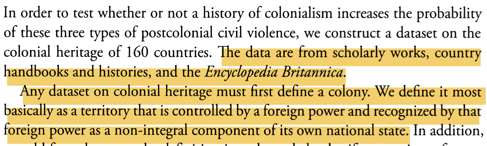
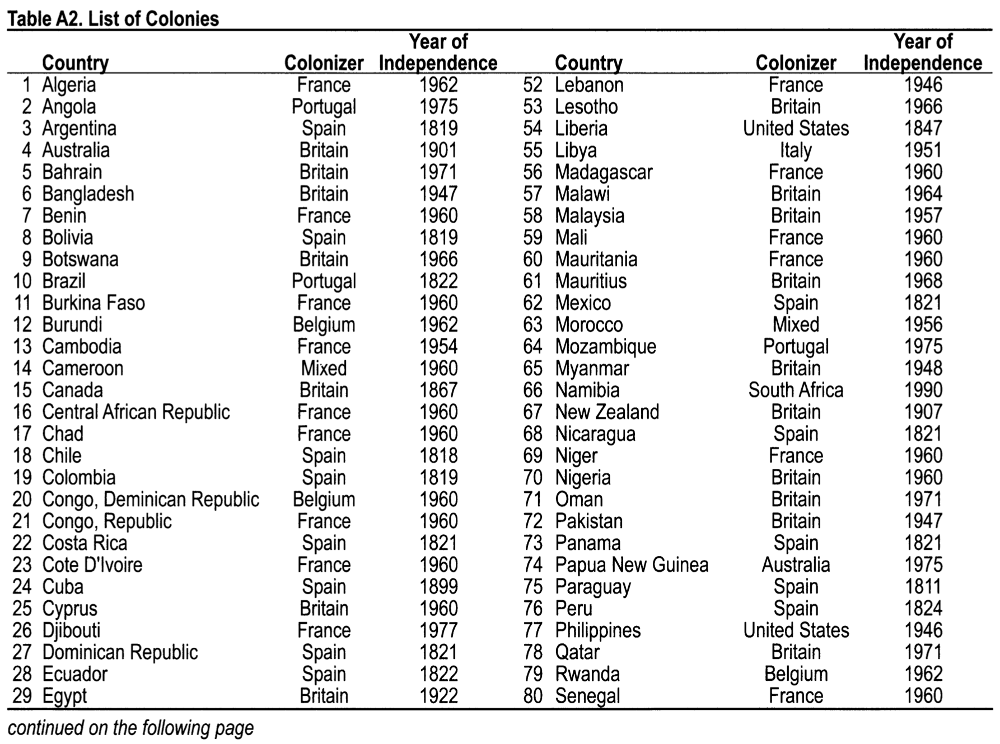
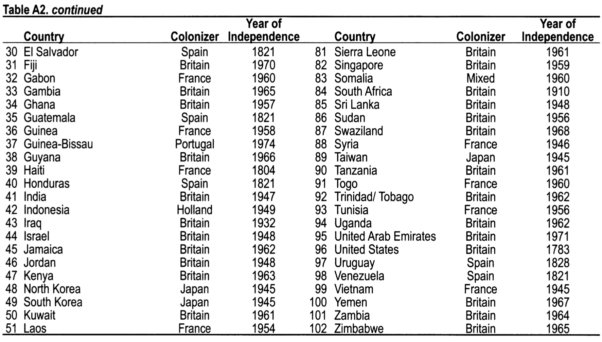

```{r setup, include = FALSE}
library(RefManageR)
library(knitr)
library(ggrepel) # Nicely placed labels in figures.
library(modelr)
library(webexercises) # Small web-based answer scales.
library(equatiomatic) # Regression equations from model objects.

options(htmltools.preserve.raw = FALSE,
        htmltools.dir.version = FALSE, servr.interval = 0.5, width = 115, digits = 3)
knitr::opts_chunk$set(
  collapse = TRUE, message = FALSE, fig.retina = 3, error = TRUE,
  warning = FALSE, cache = TRUE, fig.align = 'center',
  comment = "#", strip.white = TRUE, tidy = FALSE)

BibOptions(check.entries = FALSE, 
           bib.style = "authoryear", 
           style = "markdown",
           hyperlink = FALSE,
           no.print.fields = c("doi", "url", "ISSN", "urldate", "language", "note", "isbn", "volume"))
myBib <- ReadBib("./../../../Stats_II.bib", check = FALSE)

xaringanExtra::use_xaringan_extra(c("tile_view", "tachyons"))
xaringanExtra::use_panelset()
```

# The goal of social science research

.font140[.center[.alert[Use data to **discover patterns** ("social facts" in Durkheim's terms), <br> and the social mechanisms that bring them about.]]]

```{r, echo = FALSE, out.width='70%', fig.align='center'}
knitr::include_graphics('https://liu.se/-/media/istock-501261958.jpg?mw=1120&mh=1120&hash=DA8977CCE6A6E600AE80A40CFEE771C9')
```
---
class: inverse middle
# Today's schedule

1. **Application**: Colonialism and poverty
  + Worldbank API
  + History of colonial rule data.
  + Join/merge both data sources
  
2. **OLS assumptions**
  + No outliers
  + Linearity
  + 
  
3. **Categorical predictors**
  + Dummy coding
  
4. **Visualizing regression**
  + Coefficient plots
  + Model predictions
  
---
class: inverse
# Colonial legacy

.push-left[
```{r, echo = FALSE, out.width='100%', fig.align='center'}
knitr::include_graphics('https://cdn.cfr.org/sites/default/files/styles/open_graph_article/public/image/2020/01/France-Macron-Pau-Summit-G5-Sahel.jpg?h=63648819')
```
]

--

.push-right[
```{r, echo = FALSE, out.width='80%', fig.align='center'}
knitr::include_graphics('https://en.natmus.dk/typo3temp/assets/images/csm_neky-holbech-16x9_b72c084303_2836164db1.jpg')
```

```{r, echo = FALSE, out.width='80%', fig.align='center'}
knitr::include_graphics('https://ichef.bbci.co.uk/news/976/cpsprodpb/6E2E/production/_113460282_mediaitem113460280.jpg')
```
]

---
class: inverse
# Colonial legacy and poverty

.push-left[.font140[.center[
How much could former colonies reduce extreme poverty since independence?
]]]

.push-right[.font140[.center[
How do different colonial legacies compare to one another (e.g., former French vs British colonies) in terms of contemporary extreme poverty?
]]]

---
# Preparations

.panelset[
.panel[.panel-name[Packages for today's session]
```{r}
pacman::p_load(
  tidyverse, # Data manipulation,
  ggplot2, # beautiful figures,
  wbstats, # download data from Worldbank. Tremendous source of global socio-economic data.
  texreg, # regression tables with nice layout,
  countrycode) # Easy recodings of country names,
```
]]

---
class: clear
# Worldbank Data .font70[On extreme poverty across the World]

.panelset[
.panel[.panel-name[Searching Wb archive]
- With `wbstats::wb_search()`, you can search the Wb archive for any keyword! Here I use "poverty":
```{r}
(wb_poverty_archive <- wb_search("poverty")) #<<
```
]
.panel[.panel-name[Get Wb data]
```{r}
(Dat <- wb_data("SI.POV.DDAY", # Download poverty data: <1.90$ per day, #<<
                start_date = 2002, end_date = 2022) %>% #<<
   rename(poverty = SI.POV.DDAY) %>% # rename poverty variable,
   select(country, date, poverty) %>% # Keep only 3 variables
   drop_na(poverty) %>% # Drop cases with missing data,
   group_by(country) %>% # Group by country,
   filter(date == max(date)) %>% # Keep the most recent data per country.
   ungroup())
```
]
.panel[.panel-name[Extreme poverty across the world]
```{r poverty-world, out.width='100%', fig.height = 8, fig.width = 20, results = FALSE, echo = FALSE}
ggplot(data = Dat, # Make coord system for data,
       aes(y = poverty, # Y- and X-axis of plot,
           x = reorder(country, poverty))) +
  geom_bar(stat = "identity") + # plot data as is in a bar chart,
  labs(y = "% population with less than 5.50$ a day", x = "") + # Axis labels,
  theme_minimal() + # Simple background layout,
  theme(axis.text.x = element_text(angle = 60, hjust = 1)) # Write country names in a 60 degree angle.
```
]]

---
# Colonia legacy

.push-left[
<iframe src='https://academic.oup.com/sf/article/88/2/785/2235304' width='800' height='500' frameborder='0' scrolling='yes'></iframe>
]

.push-right[
```{r, echo = FALSE, out.width='100%', fig.align='center'}

```
.center[.backgrnote[*Source*: `r Citet(myBib, "veaux_stats_2021", after = ", p.199")`]]
]

---
# Colonia legacy

.push-left[
```{r, echo = FALSE, out.width='100%', fig.align='center'}

```
.center[.backgrnote[*Source*: `r Citet(myBib, "veaux_stats_2021", after = ", p.199")`]]
]

.push-right[
```{r, echo = FALSE, out.width='100%', fig.align='center'}

```
.center[.backgrnote[*Source*: `r Citet(myBib, "veaux_stats_2021", after = ", p.199")`]]
]

---
# Hand coding ;( .font70[Colonia power]

```{r}
Dat <- Dat %>% 
  mutate(
    colonizer = case_when(
      str_detect(country, "Algeria|Benin|Burkina Faso|Cambodia|Central African Republic|Chad|Congo, Rep.|Cote D'Ivoire") |
        str_detect(country, "Djibouti|Gabon|Guinea|Haiti|Laos|Lebanon|Madagascar|Mali|Mauritania|Niger") | 
        str_detect(country, "Senegal|Syria|Togo|Tunisia|Vietnam") ~ "France", # France
      str_detect(country, "Angola|Brazil|Mozambique|Guinea-Bissau") ~ "Portugal", # Portugal
      str_detect(country, "Argentina|Bolivia|Chile|Colombia|Costa Rica|Cuba|Dominican Republic|Ecuador") |
        str_detect(country, "El Salvador|Guatemala|Honduras|Mexico|Nicaragua|Panama|Paraguay|Peru") |
        str_detect(country, "Uruguay|Venezuela") ~ "Spain", # Spain
      str_detect(country, "Australia|Bahrain|Bangladesh|Botswana|Canada|Cyprus|Egypt|Fiji") |
        str_detect(country, "Gambia|Ghana|Guyana|India|Iraq|Israel|Jamaica|Jordan|Kenya|Kuwait") |
        str_detect(country, "Lesotho|Malawi|Malaysia|Mauritius|Myanmar|New Zealand|Nigeria|Oman") | 
        str_detect(country, "Pakistan|Qatar|Sierra Leone|Singapore|South Africa") | 
        str_detect(country, "Sri Lanka|Sudan|Swaziland|Tanzania|Trinidad/Tobago|Uganda") | 
        str_detect(country, "United Arab Emirates|USA|Yemen|Zambia|Zimbabwe") ~ "Britain", # Britain
      str_detect(country, "Burundi|Congo, Dem. Rep.|Rwanda") ~ "Belgium", # Belgium
      str_detect(country, "Liberia|Philippines") ~ "USA", # USA
      str_detect(country, "Libya|Somalia") ~ "Italy", # Italy
      str_detect(country, "Indonesia") ~ "Holland", # Holland
      str_detect(country, "Korea|Taiwan") ~ "Japan")) # Japan
```

---
# Hand coding ;( .font70[Years of independence]

```{r}
Dat <- Dat %>% 
  mutate(
    years_indep = case_when(
      str_detect(country, "Argentina|Bolivia|Colombia") ~ date - 1819,
      country == "Australia" ~ date - 1901,
      str_detect(country, "Algeria|Burundi|Rwanda|Jamaica|Trinidad/ Tobago|Uganda") ~ date - 1962,
      str_detect(country, "Angola|Mozambigue") ~ date - 1962,
      str_detect(country, "Bahrain|Oman|Qatar|United Arab Emirates") ~ date - 1971))
```


---
# Categorical predicators

.panelset[
.panel[.panel-name[Continent]
```{r}
(Dat <- Dat %>%
   mutate(
     continent = countrycode( # Nice function from the countrycode package ;)
       sourcevar = country, # What is the original variable?
       origin = "country.name", # What info does the original variable contain?
       destination = "continent") %>% # What do you want as output?
       factor() %>% fct_relevel("Europe"))) # Turn into factor and make "Europe" the reference.
```
]
.panel[.panel-name[Scatter plot]

.left-column[
.content-box-green[
1. Where does the regression line pass through the cloud of countries without a socialist past?
2. Where does the regression line pass through the cloud of countries with a socialist past?
3. What does this sugest about the slope $\beta$?
]
]
.right-column[
```{r categorical, out.width='100%', fig.height = 4, fig.width = 6.5, results = FALSE, echo = FALSE}
Dat_bi <- Dat %>%
   mutate(
     continent_bi = case_when(
       continent == "Americas" ~ 1,
       continent == "Europe" ~ 0,
       TRUE ~ as.numeric(NA)))

ggplot(data = Dat_bi, aes(y = poverty, x = continent_bi)) +
  geom_text(aes(label = country)) +
  geom_smooth(method = "lm", se = FALSE) +
  scale_x_continuous(breaks = c(0, 1), labels = c("Europe", "Americas")) +
  labs(y = "% population with less \n than 5.50$ a day", 
       x = "") +
  theme_minimal() +
  guides(color = "none")
```
]]
.panel[.panel-name[Dummy coding]

.push-left[
$$x=
  \begin{cases}
    1, & \text{if condition is met} \\
    0 & \text{otherwise}
  \end{cases}$$

Contintent                       | Africa | Asia | ...
---------------------------------|----|----|----
Burundi                 | 1  | 0  | 0 
Somalia                 | 1  | 0  | 0
...                 | 1  | 0  | 0
China                          | 0  | 1  | 0  
Japan                          | 0  | 1  | 0
...                          | 0  | 1  | 0
Reference <br> .backgrnote[(Europe)] | 0  | 0  | 0
]

.push-right[
```{r categorical2, out.width='100%', fig.height = 4, fig.width = 6.5, results = FALSE, echo = FALSE}
Dat_bi <- Dat %>%
   mutate(
     continent_bi = case_when(
       continent == "Asia" ~ 1,
       TRUE ~ 0))

ggplot(data = Dat_bi, aes(y = poverty, x = continent_bi)) +
  geom_text(aes(label = country)) +
  geom_smooth(method = "lm", se = FALSE) +
  scale_x_continuous(breaks = c(0, 1)) +
  labs(y = "% population with less \n than 5.50$ a day", 
       x = "Asia") +
  theme_minimal() +
  guides(color = "none")
```
]]
.panel[.panel-name[How it's done in R]
.push-left[
```{r ols_2, eval = FALSE}
# R recognizes categorical variables automatically.
ols_2 <- lm(data = Dat, formula = poverty ~ continent)

htmlreg(ols_2, # Nicely-formatted table.
        custom.coef.names = c("Intercept", "Africa", 
                              "Americas", "Asia", 
                              "Oceania")) 
```

```{r ref.label = "categorical", out.width='80%', fig.height = 4, fig.width = 6.5, results = FALSE, echo = FALSE}
```
]

.push-right[.font90[
```{r ref.label = "ols_2", results = 'asis', echo = FALSE}
```
]]]

.panel[.panel-name[Interpretation]
.push-left[.font90[
```{r ref.label = "ols_2", results = 'asis', echo = FALSE}
```
]]
.push-right[

`r extract_eq(ols_2, wrap = TRUE, terms_per_line = 2, use_coefs = TRUE)`

- When Africa = 0, and Asia = 0, and America == 0, and Oceania = 0, then poverty is on average `r round(coef(ols_2)[1], 2)`%.<br> $\rightarrow$ The average poverty across countries in the reference group (Europe) is `r round(coef(ols_2)[1], 2)`%.

- Across African countries, poverty is on average `r round(coef(ols_2)[2], 2)`% higher than across European ones.
  + Across African countries, poverty is thus: $`r round(coef(ols_2)[1], 2)`\% + `r round(coef(ols_2)[2], 2)`\% = `r round(coef(ols_2)[1], 2) + round(coef(ols_2)[2], 2)`\%$.

]

]]


---
class: clear
# Assumptions

.left-column[
.content-box-blue[.center[
**4 requirements for OLS results to predict useful conditional means:**
]
1. **No outliers.**
2. **Linear relationship.**
3. Homogeneous trends across subpopulations.
4. No unsupported extrapolation

$\rightarrow$ Scatter plots!
]]

.right-column[
<iframe src='https://seeing-theory.brown.edu/regression-analysis/index.html#section1' width='700' height='670' frameborder='0' scrolling='yes'></iframe>
]

---
# Outlier 

.left-column[
- **Leverage:** a case has a strong influence on the regression line.
  + China and Vietnam drive our results!
  

- **Z-standardized residuals:** a case is far from the regression line.
  + Haiti with poverty of `r Dat$poverty[Dat$country == "Burundi"]`% is such a case. But so is Denmark with its `r Dat$poverty[Dat$country == "Denmark"]`% poverty rate.
]

.right-column[
```{r outlier, out.width='80%', fig.height = 4, fig.width = 5, results = FALSE}
plot(ols_2, which = 5) # The best outlier plot.
```
]

---
# Linearity

.left-column[
- The gray dotted line is out regression model.

- The red line should ideally be the same.
  + .alert[Here the linearity assumption clearly does not hold.]
]

.right-column[
```{r linearity, out.width='80%', fig.height = 4, fig.width = 5, results = FALSE}
plot(ols_2, which = 1) # The best outlier plot.
```
]

---
class: middle clear

.left-column[
```{r, echo = FALSE, out.width='100%'}
knitr::include_graphics('https://cdn.dribbble.com/users/10549/screenshots/9890798/media/f38f0e4d71d9763c7533641d2418b35b.png?compress=1&resize=1200x900&vertical=top')
```

```{r ref.label = "pov-citiz-corr2", out.width='90%', fig.height = 4, fig.width = 7.5, results = FALSE, echo = FALSE}
```
]

.right-column[
<iframe src='https://merlin-advanced-stats.netlify.app/lectures/1-correlation-n-regression/exercise3.html' width='1000' height='600' frameborder='0' scrolling='yes'></iframe>
]

---
# Learning goal achieved!

.push-left[
- No, there is no freedom-equality trade-off!
  + Socialist countries don't seem to be better or worse at fighting poverty.
  + Instead our z-standardized results tell us that granting more rights to citizens is much more strongly associated with lower levels of poverty than is socialism.
  
```{r echo = FALSE}
# Dat <- Dat %>%
#   mutate(
#     z_citizen_rights = scale(citizen_rights) %>% as.numeric())
```

```{r goal, results = FALSE}
# # Regression models.
# zols <- lm(z_poverty ~ z_socialist, Dat) 
# zols_2 <- lm(z_poverty ~ z_citizen_rights, Dat)
# 
# # Nicely-formatted table.
# htmlreg(list(zols, zols_2), 
#         custom.coef.names = c("Intercept", "Socialism", 
#                               "Citizenhip rights"))
```
]

.push-right[
```{r ref.label = "goal", echo = FALSE, results = 'asis'}
```
]

---
class: clear
# Visualizing uncertainty .font70[95% CIs in coefficient plots]

.panelset[
.panel[.panel-name[Preparation code]
```{r}
# (plotdata <- lm_robust(psppsgva ~ eduyrs, data = ESS_sample) %>%
#    tidy() %>% # Turn results into a tibble,
#    mutate( # Rename variables for the plot.
#      term = case_when(
#        term == "eduyrs" ~ "Years of Education",
#        term == "(Intercept)" ~ "Intercept")))
```
]

.panel[.panel-name[Plot]
.push-left[
```{r Coefplot, fig.show = 'hide'}
# ggplot(data = plotdata, aes(y = estimate, x = term)) +
#   # Point with error-bars,
#   geom_pointrange(aes(min = conf.low, max = conf.high)) +
#   coord_flip() + # Flip Y- & X-Axis,
#   labs(
#     title = "Regression of political efficacy", 
#     x = "",
#     # Write Greek beta into axis title.
#     y = expression("Estimate of"~beta)) + 
#   theme_minimal()
```
]
.push-right[
```{r ref.label = "Coefplot", out.width='90%', fig.height = 4, fig.width = 6, echo = FALSE}
```
]
]]

---
class: inverse
# Today's general lessons

1. If you want to use a categorical variable as a predictor in a regression analysis, it is (typically) dummy coded. That means, it's tells us the average difference in the outcome between a category to the reference group.
2. We should make sure that the correlations and regressions we estimate actually capture aprrox. linear relationships and that they are not driven by outliers.

---
class: inverse
# Today's (important) functions

