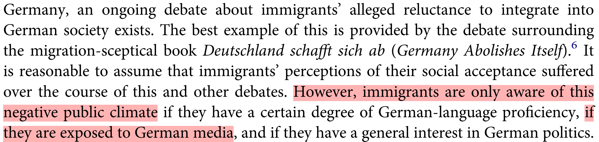

```{r setup, include = FALSE}
library(RefManageR)
library(knitr)
library(ggrepel) # Nicely placed labels in figures.
library(modelr)
library(webexercises) # Small web-based answer scales.
library(equatiomatic) # Regression equations from model objects.
library(essentials)

options(htmltools.preserve.raw = FALSE,
        htmltools.dir.version = FALSE, servr.interval = 0.5, width = 115, digits = 3)
knitr::opts_chunk$set(
  collapse = TRUE, message = FALSE, fig.retina = 3, error = TRUE,
  warning = FALSE, cache = FALSE, fig.align = 'center',
  comment = "#", strip.white = TRUE, tidy = FALSE)

BibOptions(check.entries = FALSE, 
           bib.style = "authoryear", 
           style = "markdown",
           hyperlink = FALSE,
           no.print.fields = c("doi", "url", "ISSN", "urldate", "language", "note", "isbn", "volume"))
myBib <- ReadBib("./../../../Stats_II.bib", check = FALSE)

xaringanExtra::use_xaringan_extra(c("tile_view", "tachyons"))
xaringanExtra::use_panelset()
```
# The goal of social science research

.font140[.center[.alert[Use data to discover patterns ("social facts" in Durkheim's terms), <br> and the **social mechanisms that bring them about**.]]]

```{r, echo = FALSE, out.width='70%', fig.align='center'}
knitr::include_graphics('https://liu.se/-/media/istock-501261958.jpg?mw=1120&mh=1120&hash=DA8977CCE6A6E600AE80A40CFEE771C9')
```

---
class: inverse middle
# Today's schedule

1. **Application**: The Integration (or Discrimination) Paradox

2. **Hypothesis $\rightarrow$ comparison**

3. **Fruitless naïv comparison**

4. **Potential outcomes**
  + Average causal effect
  + Selection bias

5. **Directed Acycical Graphs (DAGs)**
  + Backdoor paths
  + Confounder bias (= selection bias)

---
class: inverse
.push-left[
<br>
<br>
.font200[**The Integration Paradox**]

The better immigrant minorities establish themselves among the (native) mainstream the *more* discrimination do they report.
]

.push-right[
```{r, echo = FALSE, out.width='83%', fig.align='center'}

```
.font70[.center[*Source:* `r Citet(myBib, "schaeffer_integration_2021")`]]]

---
class: inverse
# The Integration Paradox .font60[Research question of the day]

.right-column[
```{r, echo = FALSE, out.width='60%', fig.align='center'}
knitr::include_graphics('img/Shocking.jpeg')
```

```{r, echo = FALSE, out.width='100%', fig.align='center'}
knitr::include_graphics('img/Steinmann1.png')
knitr::include_graphics('img/Steinmann2.png')
```

```{r, echo = FALSE, out.width='100%', fig.align='center'}

```
.font70[.center[*Source:* `r Citet(myBib, "steinmann_paradox_2019")`]]
]

--

.left-column[.center[.font110[
**Does news media consumption** <br><br> _**increase**_ <br><br> **immigrant minorities' perceptions that they are being discriminated?**
]]]

---
# The direct-question fallacy!

.left-column[

.center["How does reading the news affect you?"]

```{r, echo = FALSE, out.width='100%', fig.align='center'}
knitr::include_graphics('http://www.news.uzh.ch/dam/jcr:00000000-09c6-5ee1-ffff-ffffa1749bbf/mikro.jpg')
```
.content-box-green[.center[
Why might this be problematic?
]]
]

--

.right-column[
.center[**Asking the subjects of inquiry <br> to answer your research question is not enough!**]
- Statements by the subjects of inquiry are important!


- But they are .alert[not credible scientific evidence.]
  + Many people have wrong ideas of how things affect them.

.left-column[
```{r, echo = FALSE, out.width='100%', fig.align='center'}
knitr::include_graphics('https://feeds.abplive.com/onecms/images/uploaded-images/2021/07/02/498323a6432ea9753e6f84c1e92e5858_original.jpg')
```
]
.right-column[
<iframe src='https://academic.oup.com/esr/article/27/5/669/598636' width='450' height='330' frameborder='0' scrolling='yes'></iframe>
]

]

---
class: inverse middle center
# Hypothesis $\rightarrow$ comparison

---
class: clear
# Instead: Hypothesis $\rightarrow$ comparison

.alert[Causal claims imply a counter factual: Things would have been different, had] $X$ .alert[(not) happened.]

- $H_{1}:$ Media consumption increases immigrant minorities' perceptions that they are being discriminated!
  + .backgrnote[ 
  $H_{0}:$ Media consumption *has no effect* on immigrant minorities' perceptions of discrimination.
  ]

--

$$\downarrow$$

- $0 < Avg_{n}[\text{Discrimination}|\text{Read news} = 1] - Avg_{n}[\text{Discrimination}|\text{Read news} = 0]$
 + .backgrnote[ 
 $0 = Avg_{n}[\text{Discrimination}|\text{Read news} = 1] - Avg_{n}[\text{Discrimination}|\text{Read news} = 0]$
 ]
 
--


.content-box-green[
.center[**What are the comparisons implied in the following examples?**]

- **Marx**: Capitalist labor alienates people from engaging with their many creative talents and reduces psychological wellbeing.

- **Simmel**: Urbanization increases functional social relations and intensifies nervous stimulation. Residents of cities are therefore rational and distant.
]

---
# Preparation

.panelset[
.panel[.panel-name[Packages for today's session]
```{r libraries}
pacman::p_load(
  tidyverse, # Data manipulation,
  furniture, # For row-means,
  ggplot2, # beautiful figures,
  estimatr, # Regression for weighted data,
  modelr, # Turn results of lm() into a tibble,
  modelsummary, # for balance tables,
  texreg) # regression tables with nice layout.
```
]
.panel[.panel-name[The APAX survey]
.left-column[
- PI: Merlin Schaeffer;<br> Postdoc: Judith Kas.
- 1093 Immigrants and children of immigrants.
- Berlin, Hamburg, Munich, Frankfurt, and Cologne.
- Interviewed in August 2021
- Financed by [German Research Council](https://gepris.dfg.de/gepris/projekt/428878477?language=en)
]

.right-column[.font80[
1. > On a typical day, about how much time do you spend watching, reading, or listening to news about politics and current affairs? *Please give your answer in hours and then minutes.*

2. > Now we would like to ask you about discrimination. How often were you personally discriminated in the following situations here in Germany? .backgrnote[
Discrimination means that a person is treated worse than others including specific reasons for this behavior and no factual justification. People use different modes of discrimination like insult, ostracism, or sexual harassment. Rules and laws disadvantaging people are also discrimination.]
> ...When looking for work or an apprenticeship<br>
> ...At work / in professional life<br>
> ...While attending school or higher education<br>
> ...When looking for housing<br>
> ...When having contact with government officials or public administrators<br>
> ...When you were out in public during your free time<br><br>
> (1) Never, (2) Rarely, (3) Sometimes, (4) Often, (5) Very often<br>
]]
]

.panel[.panel-name[Get the APAX data]
.left-column[.font80[
```{r results = FALSE}
load("APAX.RData") # Read APAX data,
APAX <- APAX %>% mutate(
  # News in minutes,
  news = news_hrs*60 + news_mins, 
  news_yn = case_when( # News Yes/No,
    news < 10 ~ 0, # Less than 15  minutes,
    news > 14 ~ 1, # More than 15  minutes,
    TRUE ~ as.numeric(NA)),
  # Average discrimination index across domains,
  dis_index = rowmeans( #<<
    dis_trainee, dis_job, dis_school, #<<
    dis_house, dis_gov, dis_public, #<<
    na.rm = TRUE), #<<
  # Z-standardized discrimination index.
  z_dis_index = scale(dis_index) %>% 
    as.numeric())
```
]]

.right-column[
```{r echo = FALSE}
APAX
```
]

]]

---
class: inverse middle center
# Fruitless naïv comparison

---
# Fruitless naïv comparison

.push-left[
```{r naiv, out.width = "98%", fig.height = 3.5, fig.width = 5, echo = FALSE}
ggplot(data = APAX, aes(y = dis_index, x = news)) +
  geom_point(aes(size = gewFAKT), alpha = 1/3) +
  geom_smooth(aes(weight = gewFAKT), method = "lm") +
  scale_y_continuous(breaks = 1:5, labels = c("Never", "Rarely", "Sometimes", "Often", "Very often")) +
  labs(y = "Perceived discrimination index", x = "Daily minutes of news consumption") +
  theme_minimal() +
  theme(legend.position = "none")
```
.content-box-green[
How does this scatter plot test the comparison stated in $H_{1}$?
]]

--

.push-right[
```{r naiv_OLS}
ols <- lm_robust(dis_index ~ news_yn, 
                 weight = gewFAKT, data = APAX)
screenreg(ols, include.ci = FALSE, digits = 3)
```
.content-box-green[
What do we learn about $H_{1}$ here?
]]

---
# Small recap .font60[Hypotheses tests, *t*- and, *p*-values]

.left-column[
```{r naiv_OLS}
```
]

.right-column[.font80[
$`r coef(ols)["news_yn"]` = Avg_{n}[\text{Discrimination}|\text{Read news} = 1] - Avg_{n}[\text{Discrimination}|\text{Read news} = 0]$

$`r coef(ols)["news_yn"]` \ngtr 0$
]

.mini-left[
```{r, echo = FALSE, out.width='100%', fig.align='center'}
knitr::include_graphics('https://www.convinceandconvert.com/wp-content/uploads/2014/07/bigstock-Portrait-of-a-senior-man-skept-12585803.jpg')
```
]

.big-right[
```{r Hypo_test, out.width='100%', fig.height = 4, fig.width = 6, echo = FALSE}
library("car")
library("highr")
library("lattice")

coef <- coef(ols)["news_yn"] %>% round(3) %>% as.scalar()
se <- vcov(ols) %>% diag() %>% sqrt() %>% round(3)
se <- se["news_yn"] %>% as.scalar()
critval <- qt(0.975, 1032)
teh <- ols %>% tidy() %>% filter(term == "news_yn") %>% select(statistic) %>% pull() %>% abs()


betas = seq(-4*se, 4*se, length = 1000)
density = dnorm(betas, sd = se)
data <- as.data.frame(cbind(betas,density))

#First subst the data and add the coordinates to make it shade to y = 0
shade1 <- rbind(c(-critval*se, 0), subset(data, betas > -critval*se & betas < critval*se), c(critval*se, 0))
shade2 <- rbind(c(-teh*se, 0), subset(data, betas > -teh*se & betas < teh*se), c(teh*se, 0))

ggplot(data= data, aes(x = betas, y = density)) +
  geom_path() +
  geom_polygon(data = shade1, aes(betas, density), fill = "#de2d26") +
  geom_polygon(data = shade2, aes(betas, density), fill = "orange") +
  geom_vline(xintercept = 0, colour = "#045a8d", size = 1) +
  geom_vline(xintercept = coef, colour = "#045a8d", size = 1, lty = 2) +
  scale_x_continuous(breaks = c(-critval*se, coef, 0, critval*se), labels = c(expression("0 - Crit.Val.*"~sigma), expression("Est. of "~beta~"=-0.172"), expression("H0:"~beta~"=0"), expression("0 + Crit.Val.*"~sigma)), guide = guide_axis(n.dodge = 2)) +
  labs(y = "", x = "") +
  theme_minimal() +
  theme(legend.position = "none")
```
]]

---
class: inverse middle center
# Break

<iframe src='https://www.online-timer.net/' width='400' height='385' frameborder='0' scrolling='yes'></iframe>

---
class: middle clear

.left-column[
```{r, echo = FALSE, out.width='80%'}
knitr::include_graphics('https://www.laserfiche.com/wp-content/uploads/2014/10/femalecoder.jpg')
```

<iframe src='https://www.online-timer.net/' width='400' height='385' frameborder='0' scrolling='yes'></iframe>
]

.right-column[
<br>
<iframe src='exercise1.html' width='1000' height='600' frameborder='0' scrolling='yes'></iframe>
]

---
class: inverse middle center
# Potential outcomes
## The Neyman–Rubin framework of causality

> The Rubin causal model is based on the idea of potential outcomes. For example, a person would have a particular income at age 40 if they had attended college, whereas they would have a different income at age 40 if they had not attended college. To measure the causal effect of going to college for this person, we need to compare the outcome for the same individual in both alternative futures. Since it is impossible to see both potential outcomes at once, one of the potential outcomes is always missing. This dilemma is the "fundamental problem of causal inference"

> -- *Source*: [.white[Wikipedia]](https://en.wikipedia.org/wiki/Rubin_causal_model)
---
# Potential outcomes .font60[Ferda's personal news effect]

.push-left[
$\text{News effect}_{\text{Ferda}} = \underbrace{\text{Discrimination}_{1, \text{Ferda}}}_{\text{Read news} = 1} - \underbrace{\text{Discrimination}_{0, \text{Ferda}}}_{\text{Read news} = 0}.$

.font80[
|                        Ferda|
-----------------------|:----:
$Y_{0}$: Outcome without news   | 2 (rarely)    
$Y_{1}$: Outcome with news      | 4 (often)  
News effect            | +2    
]]

.push-right[
```{r, echo = FALSE, out.width='80%', fig.align='center'}
knitr::include_graphics('https://miro.medium.com/max/1400/0*M_2Lt3gq2wUHeTrI')
```
]

--

.content-box-green[
.center[
Why can we *never* observe Ferda's news effect?
]]

--

.content-box-red[
.center[
If a person tells us how something affect(ed) them, it is an interesting  personal interpretation. <br> $\Rightarrow$ *But it is not scientific evidence of an effect on them!*
]]

---
layout: false
class: center inverse
# More generally: The average causal effect

$$\underbrace{Avg_{n}[Y_{1i}-Y_{0i}] = \frac{1}{n} \displaystyle\sum_{i=1}^{n}Y_{1i} - \frac{1}{n} \displaystyle\sum_{i=1}^{n}Y_{0i}}_{\text{Average causal effect!}}.$$

*The average causal effect is the average of personal causal effects!*

For example, the average causal effect of reading the news compares discrimination for everyone in the sample in the hypothetical scenario that they all read the news, to the discrimination for everyone in the sample in the hypothetical scenario that they did not read the news.

---
layout: true
# Apples and oranges .font60[Ferda compared to Tuki?]

.left-column[
```{r, echo = FALSE, out.width='100%', fig.align='center'}
knitr::include_graphics('https://live.staticflickr.com/3181/2720702285_026ca43aa2_b.jpg')
```
<br>

.font80[
|                        Ferda  | Tuki 
-----------------------|:----:|:----:
$Y_{0}$: Outcome without news | .gray[2 (Rarely)]    | 5<br>(V.often)   
$Y_{1}$: Outcome with news    | 4 (Often)   | .gray[5<br>(V.often)]    
True news effect          | .gray[+2] | .gray[0]    
Actual news          | 1    | 0    
]]

---

---
.right-column[
$$\begin{equation} \begin{split}
\text{Anomie effect}_{\text{Ferda}} & \neq \underbrace{\text{Discrimination}_{1, \text{Ferda}}}_{4} - \underbrace{\text{Discrimination}_{0, \text{Tuki}}}_{5} = -1
\end{split} \end{equation}$$

.content-box-green[.center[
Why is it misleading to compare Ferda to Tuki?
]]]

---

.right-column[.font90[

$$\begin{equation} \begin{split}
\text{Anomie effect}_{\text{Ferda}} & \neq \underbrace{\text{Discr}_{1, \text{Ferda}}}_{4} - \underbrace{\text{Discr}_{0, \text{Tuki}}}_{5} = -1 \\
& = \underbrace{\text{Discr}_{1, \text{Ferda}} \color{gray}{(- \text{Discr}_{0, \text{Ferda}}}}_{\text{True news effect: 4 - 2 = +2}} \color{gray}{+} \underbrace{\color{gray}{\text{Discr}_{0, \text{Ferda}})} - \text{Discr}_{0, \text{Tuki}}}_{\text{"Selection bias": 2 - 5 = -3}}.
\end{split} \end{equation}$$
]]

---

.right-column[.font90[
$$\begin{equation} \begin{split}
\text{Anomie effect}_{\text{Ferda}} & \neq \underbrace{\text{Discr}_{1, \text{Ferda}}}_{4} - \underbrace{\text{Discr}_{0, \text{Tuki}}}_{5} = -1 \\
& = \underbrace{\text{Discr}_{1, \text{Ferda}} \color{gray}{(- \text{Discr}_{0, \text{Ferda}}}}_{\text{True news effect: 4 - 2 = +2}} \color{gray}{+} \underbrace{\color{gray}{\text{Discr}_{0, \text{Ferda}})} - \text{Discr}_{0, \text{Tuki}}}_{\text{"Selection bias": 2 - 5 = -3}}.
\end{split} \end{equation}$$
]

.content-box-red[.center[
**Selection bias**: $Y_{0, \text{Ferda}} \neq Y_{0, \text{Tuki}}$
$\Rightarrow$ Tuki's *baseline* <br> (i.e., no news) perceived discrimination <br> is higher than Ferda's!
]]]

---
layout: false
class: inverse center
# More generally: Differences in group means

.left-column[
$\begin{equation} D_{i}=\begin{cases} 1, & \text{if}\ i = \text{Reads news} \\ 0, & \text{otherwise}\end{cases}\end{equation}$
]

.right-column[
$Avg_{n}[Y_{1i}|D_{i} = 1] - Avg_{n}[Y_{0i}|D_{i} = 0]$

Differences in group means are (most of the time) a comparison of apples (i.e. Ferda) to oranges (i.e. Tuki), which does not tell us about the average causal effect $(Avg_{n}[Y_{1i}-Y_{0i}])$.
]


---
# Why? Selection bias!

.left-column[

```{r, echo = FALSE, out.width='100%', fig.align='center'}
knitr::include_graphics('https://media.istockphoto.com/photos/children-pulling-a-rope-picture-id521182687?k=20&m=521182687&s=612x612&w=0&h=OeGtAQn8dz4bDiasD09E7QFrNvbQCUoaolztX8QKbcI=')
```
]

.right-column[
.content-box-red[.center[
$\text{Selection bias} = \underbrace{Avg_{n}[Y_{0i} | D_{i} = 1]}_{\text{Unobserved!}} - Avg_{n}[Y_{0i} | D_{i} = 0].$

$\rightarrow$ The difference in average $Y_{0i}$ (the baseline of the outcome) between the groups we compare.

$\underbrace{\text{Difference in group means}}_{\text{Fruitless naïv comparison}} = \text{Average causal effect} + \text{Selection bias}$!
]]

.content-box-green[.center[
Think carefully:<br>Is $Avg_{n}[Y_{0i}]$ (the baseline level of the outcome) <br>likely to differ between immigrant minorities who read news regularly and those who do not?

That is, had those who read the news not read them, would they feel as discriminated as those who do not read the news?
]]]

---
# (Im-)balance .font70[.alert[of oberserved variables!]]

.panelset[
.panel[.panel-name[R code]
```{r balance1, results = FALSE}
APAX %>%
  # Select variables for which I want my balance test,
  select(news_yn, dis_index, age, nbh_exposed, imor, german, gewFAKT) %>%
  rename(weights = gewFAKT) %>% # Rename the weights variable! #<<
  datasummary_balance( # Make a balance table, #<<
    formula = ~ news_yn, # by Reading news Yes/No #<< 
    data = . , #<<
    title = "Socio-demographic characterisitcs of those who read news and those who don't" #<<
  ) #<<
```

- Note that I `rename(weights = gewFAKT)`
  + Thereby `datasummary_balance()` automatically treats this variable as a weight.
]
.panel[.panel-name[Balance table]
```{r ref.label = "balance1", echo = FALSE}
```
]]

---
class: inverse middle center
# Directed Acyclical Graphs (DAGs)

---
layout: true
# Directed Acyclical Graphs (DAG)

.push-left[
- **Nodes** represent variables, **Arrows\edges** represent causal effects `r Citep(myBib, "pearl_causal_2016")`.
  + there cannot by a cycle: Follow paths until one re-arrives at the origin.


- DAGs are theoretical models and can contain observed *and unobserved* variables.


- A DAG should capture the social processes by which $X$ comes to be associated with $Y$ in your data.


- **Backdoor paths**: All paths linking $X$ and $Y$ that start with an arrow into $X$ `r Citep(myBib, c("pearl_causal_2016", "gerxhani_causal_2022"))`.


- **Confounder \ Backdoor bias** = Selection bias.
]

---

.push-right[
```{tikz, DAG1,  echo = FALSE, out.width='40%'}
\usetikzlibrary{shapes,decorations,arrows,calc,arrows.meta,fit,positioning}
\tikzset{
    -Latex,auto,node distance =1 cm and 1 cm,semithick,
    state/.style ={ellipse, draw, minimum width = 0.7 cm},
    point/.style = {circle, draw, inner sep=0.04cm,fill,node contents={}},
    bidirected/.style={Latex-Latex,dashed},
    el/.style = {inner sep=2pt, align=left, sloped}
}

\begin{tikzpicture}
\sffamily
    \node[state] (1) at (0,0) {$C$};
    \node[state] (2) [below = of 1] {$D$};
    \node[state] (3) [right = of 2] {$Y$};

    \path (1) edge  (2);
    \path[bidirected] (2) edge[red, bend right=50] (3);
    \path (1) edge (3);
\end{tikzpicture}
```
.backgrnote[
The red bi-directed arrow is officially not part of the DAG, but helps you see that the correlation between $X$ and $Y$ is spurious because of $C$.
]]

---

.push-right[
```{tikz, DAG2,  echo = FALSE, out.width='100%'}
\usetikzlibrary{shapes,decorations,arrows,calc,arrows.meta,fit,positioning}
\tikzset{
    -Latex,auto,node distance =1 cm and 1 cm,semithick,
    state/.style ={ellipse, draw, minimum width = 0.7 cm},
    point/.style = {circle, draw, inner sep=0.04cm,fill,node contents={}},
    bidirected/.style={Latex-Latex,dashed},
    el/.style = {inner sep=2pt, align=left, sloped}
}

\begin{tikzpicture}
\sffamily
    \node[state] (1) at (0,0) {German citizen};
    \node[state] (2) [below = of 1] {Read news};
    \node[state] (3) [right = of 2] {Perc. discrimination};

    \path (1) edge  (2);
    \path (2) edge (3);
    \path[bidirected] (2) edge[red, bend right=50] (3);
    \path (1) edge (3);
\end{tikzpicture}
```

.backgrnote[
The red bi-directed arrow is officially not part of the DAG, but helps you see that the correlation between read news and perceived discrimination is biased because immigrant minorities who obtained German citizenship read news more often than those who are foreign citizens.]
]

---
layout: false
# Learning goal achieved!

.push-left[
```{r ref.label = "naiv", out.width = "100%", fig.height = 3.5, fig.width = 5, echo = FALSE}
```
]

.push-right[.center[
.content-box-red[
Correlation ≠ causation,

because the baseline of the outcome $Y_{0i}$ likely differs between the groups we compare. This is, because certain other variables (i.e. confounders) make us select into / out of $D_{i}$. This is called selection, confounder, or backdoor bias.
]]]

---
layout: false
class: middle clear

.left-column[
```{r, echo = FALSE, out.width='80%'}
knitr::include_graphics('https://www.laserfiche.com/wp-content/uploads/2014/10/femalecoder.jpg')
```

<iframe src='https://www.online-timer.net/' width='400' height='385' frameborder='0' scrolling='yes'></iframe>
]

.right-column[
<br>
<iframe src='exercise2.html' width='1000' height='600' frameborder='0' scrolling='yes'></iframe>
]

---
class: inverse
# Today's general lessons

1. Causal claims are counter factual claims. Therefore they imply a comparison.
2. Potential outcomes: A theoretical framework to think about the comparison implied in causal claims.
3. Personal causal effect: The unobservable comparison for an individual case $i$ to experience treatment $D_{i}=1$ as compared to not experience that treatment ($D_{i}=0$).
3. Average causal effect: The average of personal causal effects.
4. Direct comparisons (i.e. differences in group means) are often fruitless and naïv, because of selection/confounder bias.
5. Selection bias: The baseline of the outcome is unequal between treated and non-treated subjects, because certain type of people select into/out of the treatment.
6. Balance test: Attempt to test for selection bias, but can only be applied to variables that are observed in the data at hand.
7. Directed Acyclic Graphs (DAG): A graphical theoretical framework to think about causality. It consists of nodes and directed edges. It may not contain cycles.
8. Backdoor paths: All paths linking $X$ and $Y$ that start with an arrow into $X$. Backdoor paths result in confounder/selection bias.
9. Confounder bias: = selection bias.

---
class: inverse
# Today's (important) functions

1. `funiture::rowmeans()`: Combine several variables (that need to have a similar scale) to an additive index.
2. `modelsummary::datasummary_balance()`: Make a balance table.

---
# References

.font80[
```{r ref, results = 'asis', echo = FALSE}
PrintBibliography(myBib)
```
]