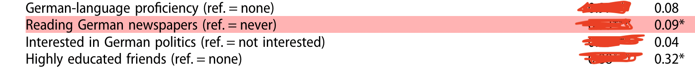

```{r setup, include = FALSE}
library(RefManageR)
library(knitr)
library(ggrepel) # Nicely placed labels in figures.
library(modelr)
library(webexercises) # Small web-based answer scales.
library(equatiomatic) # Regression equations from model objects.
library(essentials)

options(htmltools.preserve.raw = FALSE,
        htmltools.dir.version = FALSE, servr.interval = 0.5, width = 115, digits = 3)
knitr::opts_chunk$set(
  collapse = TRUE, message = FALSE, fig.retina = 3, error = TRUE,
  warning = FALSE, cache = FALSE, fig.align = 'center',
  comment = "#", strip.white = TRUE, tidy = FALSE)

BibOptions(check.entries = FALSE, 
           bib.style = "authoryear", 
           style = "markdown",
           hyperlink = FALSE,
           no.print.fields = c("doi", "url", "ISSN", "urldate", "language", "note", "isbn", "volume"))
myBib <- ReadBib("./../../../Stats_II.bib", check = FALSE)

xaringanExtra::use_xaringan_extra(c("tile_view", "tachyons"))
xaringanExtra::use_panelset()
```
# Goal of empirical sociology

.font130[.center[Use data to discover patterns, <br> and the .alert[social mechanisms that bring them about.]]]

```{r, echo = FALSE, out.width='70%', fig.align='center'}
knitr::include_graphics('https://liu.se/-/media/istock-501261958.jpg?mw=1120&mh=1120&hash=DA8977CCE6A6E600AE80A40CFEE771C9')
```

---
class: inverse middle
# Today's schedule

1. **Today's research question**: The Integration Paradox

2. **Hypothesis $\rightarrow$ comparison**

3. **Fruitless\naïv comparisons**

4. **Potential outcomes**
  + The fundamental problem of causality
  + Average causal effect
  + Selection bias

5. **Directed Acycical Graphs (DAGs)**
  + Backdoor paths
  + Confounder bias (= selection bias)

---
# Race relations in the US

```{r, echo = FALSE, out.width='70%', fig.align='center'}

```
.font70[ .center[ *Source:* [Gallup](https://news.gallup.com/poll/1687/race-relations.aspx)]]

---
class: inverse
.push-left[
<br>
<br>
.font200[**The Integration Paradox**]

immigrants and their descendants with seemingly better access to mainstream middle-class society <br> — as evidenced by their education, labor market success, length of residence, or generational status — <br> often report more discrimination than those on the societal margins.
]

.push-right[
```{r, echo = FALSE, out.width='85%', fig.align='center'}
knitr::include_graphics('img/Meta.png')
```
.font70[.center[*Source:* `r Citet(myBib, "schaeffer_integration_2024")`]]]

---
class: inverse
# The Integration Paradox .font60[Research question of the day]

.right-column[
```{r, echo = FALSE, out.width='60%', fig.align='center'}

```

```{r, echo = FALSE, out.width='100%', fig.align='center'}


```

```{r, echo = FALSE, out.width='100%', fig.align='center'}
knitr::include_graphics('img/Steinmann3.png')
```
.font70[.center[*Source:* `r Citet(myBib, "steinmann_paradox_2019")`]]
]

--

.left-column[.center[.font110[
**Does news media consumption** <br><br> _**increase**_ <br><br> **how often immigrant minorities' report discrimination?**
]]]

---
# The direct-question fallacy!

.left-column[

.center["How does<br> reading the news<br> affect you?"]

```{r, echo = FALSE, out.width='100%', fig.align='center'}
knitr::include_graphics('http://www.news.uzh.ch/dam/jcr:00000000-09c6-5ee1-ffff-ffffa1749bbf/mikro.jpg')
```
.content-box-green[.center[
Why might this be problematic?
]]
]

--

.right-column[
Statements by research subjects are valuable,<br>
but they are .alert[not credible scientific evidence].

$\rightarrow$ People have inaccurate perceptions 
   of what factors influence them.

.left-column[
```{r, echo = FALSE, out.width='100%', fig.align='center'}
knitr::include_graphics('https://www.unhcr.org/sites/default/files/legacy-images/5d7642403.jpg')
```
]
.right-column[
```{r, echo = FALSE, out.width='78%', fig.align='center'}

```
]

]

---
class: inverse middle center
# Hypothesis $\rightarrow$ Comparison

---
class: clear
# Hypothesis $\rightarrow$ Comparison

Causal claims imply a .alert[counterfactual]: Things would have been different had X (not) happened.

$H_{1}:$ Media consumption *increases* how often immigrant minorities report discrimination.

.backgrnote[
$H_{0}:$ Media consumption *does not change* how often immigrant minorities report discrimination.]

--

$$\Downarrow$$

$H_{1}: 0 < Avg_{n}[\text{Discrimination}|\text{Read news} = 1] - Avg_{n}[\text{Discrimination}|\text{Read news} = 0]$

.font80[
- The average reported discrimination for those who read news (Read news = 1) is greater than for those who don't (Read news = 0).
- The difference between these two averages is positive $(> 0).$
]
 
.backgrnote[ 
$H_{0}: 0 \geq Avg_{n}[\text{Discrimination}|\text{Read news} = 1] - Avg_{n}[\text{Discrimination}|\text{Read news} = 0]$

- This formula states that the average reported discrimination for those who read news is less than or equal to those who don't.
- The difference between these two averages is zero or negative $(\geq 0).$
 ]
 
--

.content-box-green[.font80[
.center[**What are the comparisons implied in the following examples?**]

- **Marx**: Capitalist labor alienates people from engaging with their creative talents; capitalism thereby reduces mental health.

- **Simmel**: Urbanization increases impersonal relations nervous stimulation; residents of cities are therefore rational and distant.
]]

---
# Preparation

.panelset[
.panel[.panel-name[Packages for today's session]
```{r libraries}
pacman::p_load( # Load several R packages using the pacman package manager
  tidyverse,  # A collection of packages for data manipulation and visualization
  ggplot2,    # Powerful package for creating static, animated and interactive visualizations
  estimatr,   # Package for fast estimators for regression with weighted data
  modelr,     # Provides functions for modelling and prediction
  kableExtra, # Enhances table creation in R
  modelsummary) # Creates tables and plots to summarize statistical models
```
]
.panel[.panel-name[The APAD survey]
.left-column[.font80[
- `r Citet(myBib, "schaeffer_association_2023")`
- 1093 Immigrants and children of immigrants.
- Berlin, Hamburg, Munich, Frankfurt, and Cologne.
- Interviewed August 2021.
- Financed by [German Research Council (DFG)](https://gepris.dfg.de/gepris/projekt/428878477?language=en)
]]

.right-column[.font80[
1. > On a typical day, about how much time do you spend watching, reading, or listening to news about politics and current affairs? *Please give your answer in hours and then minutes.*

2. > Now we would like to ask you about discrimination. How often were you personally discriminated in the following situations here in Germany? .backgrnote[
Discrimination means that a person is treated worse than others including specific reasons for this behavior and no factual justification. People use different modes of discrimination like insult, ostracism, or sexual harassment. Rules and laws disadvantaging people are also discrimination.]
> ... When looking for work or an apprenticeship<br>
> ... At work / in professional life<br>
> ... While attending school or higher education<br>
> ... When looking for housing<br>
> ... When having contact with government officials or public administrators<br>
> ... When you were out in public during your free time<br><br>
> (1) Never, (2) Rarely, (3) Sometimes, (4) Often, (5) Very often<br>
]]
]

.panel[.panel-name[Get the APAD data]
.push-left[.font80[
```{r results = FALSE, echo = FALSE}
# Read APAD data,
load("../../../assets/APAD.RData") 
```

```{r eval = FALSE}
load("APAD.RData") # Load APAD dataset
```

```{r results = FALSE}
APAD <- APAD %>% mutate( # Process APAD data
  # Convert news consumption to minutes
  # Example: 2 hours and 30 minutes becomes 2*60 + 30 = 150 minutes
  news = news_hrs*60 + news_mins, 
  # Create binary variable for news consumption
  news_yn = case_when(
    news < 15 ~ 0,  # 0 if less than 15 minutes
    news >= 15 ~ 1, # 1 if 15 minutes or more
    TRUE ~ as.numeric(NA)), # Handle other cases as missing
  # Calculate average discrimination index across multiple domains
  dis_index = rowMeans( # Calculate the mean for each row (participant)
    select(., # Choose specific discrimination columns from "." (APAD)
           dis_trainee, dis_job, dis_school, 
           dis_house, dis_gov, dis_public),
    na.rm = TRUE), # Ignore NA values
  # Standardize discrimination index
  # scale() standardizes; as.numeric() converts to numeric vector
  z_dis_index = scale(dis_index) %>% as.numeric()
)
```
]]

.push-right[.font80[
<br>
```{r echo = FALSE}
APAD
```
]]

]]

---
class: inverse middle center
# Fruitless naïv comparison

---
# Fruitless\naïv comparison

.push-left[
```{r naiv, out.width = "98%", fig.height = 3.5, fig.width = 5, echo = FALSE}
ggplot(data = APAD, aes(y = dis_index, x = news)) +
  geom_point(aes(size = gewFAKT), alpha = 1/3) +
  geom_smooth(aes(weight = gewFAKT), method = "lm") +
  scale_y_continuous(breaks = 1:5, labels = c("Never", "Rarely", "Sometimes", "Often", "Very often")) +
  labs(y = "Perceived discrimination index", x = "Daily minutes of news consumption") +
  theme_minimal() +
  theme(legend.position = "none")
```
.content-box-green[
How does this scatter plot test $H_{1}$?
]]

--

.push-right[.fon80[
```{r naiv_OLS}
ols <- lm_robust(dis_index ~ news_yn, # Run weighted OLS
                 weight = gewFAKT, data = APAD)

modelsummary( # Create summary table of OLS results
  list("Discr." = ols), # List of OLS model objects
  stars = TRUE, # Indicate significance level
  # Choose Goodness of Fit indicators
  gof_map = c("nobs", "r.squared"), 
  output = "kableExtra") # Format as HTML
```
]]

---
# Small recap .font60[Hypotheses tests, *t*- and, *p*-values]

.left-column[
```{r naiv_OLS, echo = FALSE}
```
]

.right-column[.font80[
$`r coef(ols)["news_yn"]` = Avg_{n}[\text{Discrimination}|\text{Read news} = 1] - Avg_{n}[\text{Discrimination}|\text{Read news} = 0]$

$`r coef(ols)["news_yn"]` \ngtr 0$
]

.mini-left[
```{r, echo = FALSE, out.width='100%', fig.align='center'}
knitr::include_graphics('https://www.convinceandconvert.com/wp-content/uploads/2014/07/bigstock-Portrait-of-a-senior-man-skept-12585803.jpg')
```
]

.big-right[
```{r Hypo_test, out.width='100%', fig.height = 4, fig.width = 6, echo = FALSE}
library("car")
library("highr")
library("lattice")

coef <- coef(ols)["news_yn"] %>% round(3) %>% as.scalar()
se <- vcov(ols) %>% diag() %>% sqrt() %>% round(3)
se <- se["news_yn"] %>% as.scalar()
critval <- qt(0.975, 1085)
teh <- ols %>% tidy() %>% filter(term == "news_yn") %>% select(statistic) %>% pull() %>% abs()


betas = seq(-4*se, 4*se, length = 1000)
density = dnorm(betas, sd = se)
data <- as.data.frame(cbind(betas,density))

#First subst the data and add the coordinates to make it shade to y = 0
shade1 <- rbind(c(-critval*se, 0), subset(data, betas > -critval*se & betas < critval*se), c(critval*se, 0))
shade2 <- rbind(c(-teh*se, 0), subset(data, betas > -teh*se & betas < teh*se), c(teh*se, 0))

ggplot(data= data, aes(x = betas, y = density)) +
  geom_path() +
  geom_polygon(data = shade1, aes(betas, density), fill = "#de2d26") +
  geom_polygon(data = shade2, aes(betas, density), fill = "orange") +
  geom_vline(xintercept = 0, colour = "#045a8d", size = 1) +
  geom_vline(xintercept = coef, colour = "#045a8d", size = 1, lty = 2) +
  scale_x_continuous(breaks = c(-critval*se, coef, 0, critval*se), labels = c(expression("0 - Crit.Val.*"~sigma), expression("Est. of "~beta~"=-0.093"), expression("H0:"~beta~"=0"), expression("0 + Crit.Val.*"~sigma)), guide = guide_axis(n.dodge = 2)) +
  labs(y = "", x = "") +
  theme_minimal() +
  theme(legend.position = "none")
```
]]

---
class: inverse middle center
# Break

<iframe src='https://www.online-timer.net/' width='400' height='385' frameborder='0' scrolling='yes'></iframe>

---
class: middle clear

.left-column[
```{r, echo = FALSE, out.width='80%'}
knitr::include_graphics('https://www.laserfiche.com/wp-content/uploads/2014/10/femalecoder.jpg')
```

<iframe src='https://www.online-timer.net/' width='400' height='385' frameborder='0' scrolling='yes'></iframe>
]

.right-column[
<br>
<iframe src='exercise1.html' width='1000' height='600' frameborder='0' scrolling='yes'></iframe>
]

---
class: inverse middle center
# Break

<iframe src='https://www.online-timer.net/' width='400' height='385' frameborder='0' scrolling='yes'></iframe>

---
class: inverse middle center
# Potential outcomes
## The Neyman–Rubin framework of causality

> The Neyman–Rubin causal model is based on the idea of potential outcomes. For example, a person would have a particular income at age 40 if they had attended college, whereas they would have a different income at age 40 if they had not attended college. To measure the causal effect of going to college for this person, we need to compare the outcome for the same individual in both alternative futures. Since it is impossible to see both potential outcomes at once, one of the potential outcomes is always missing. This dilemma is the "fundamental problem of causal inference"

> -- *Source*: [.white[Wikipedia]](https://en.wikipedia.org/wiki/Rubin_causal_model)
---
# Potential outcomes .font60[Ferda's *personal causl effect*]

.push-left[
$\text{News effect}_{\text{Ferda}} = \underbrace{\text{Discrimination}_{1, \text{Ferda}}}_{\text{Read news} = 1} - \underbrace{\text{Discrimination}_{0, \text{Ferda}}}_{\text{Read news} = 0}.$

.font80[
|                        Ferda|
-----------------------|:----:
$Y_{0}$: Outcome without news   | 2 (rarely)    
$Y_{1}$: Outcome with news      | 4 (often)  
News effect            | +2    
]]

.push-right[
```{r, echo = FALSE, out.width='80%', fig.align='center'}
knitr::include_graphics('https://miro.medium.com/max/1400/0*M_2Lt3gq2wUHeTrI')
```
]

---
class: center inverse
# The average causal effect

$$Avg_{n}[Y_{1i}-Y_{0i}] = \frac{1}{n} \displaystyle\sum_{i=1}^{n}Y_{1i} - \frac{1}{n} \displaystyle\sum_{i=1}^{n}Y_{0i}.$$


.push-left[
The average causal effect is <br> *the average of all personal causal effects* <br> in your sample!
]

.push-right[.font80[
For example, the average causal effect of reading the news compares discrimination for everyone in the sample in the hypothetical scenario that they all read the news, to the discrimination for everyone in the sample in the hypothetical scenario that they did not read the news.
]]

---
layout: false
class: inverse center
# The fundamental problem of causality

.push-left[
.content-box-blue[
When a person tells us how something affected them, it is an interesting personal interpretation. It is how they perceive and make sense of the world around them.

However, it is not scientific evidence of a causal effect on them.

.center[
$\Rightarrow$ *We can never know how a person's life had turned out, had $X$ (not) occured!*
]]
]

.push-right[
```{r, echo = FALSE, out.width='100%', fig.align='center'}

```
]

---
layout: true
# Apples and oranges .font60[Ferda compared to Tuki?]

.left-column[
```{r, echo = FALSE, out.width='100%', fig.align='center'}
knitr::include_graphics('https://live.staticflickr.com/3181/2720702285_026ca43aa2_b.jpg')
```
<br>

.font80[
|                        Ferda  | Tuki 
-----------------------|:----:|:----:
$Y_{0}$: Outcome without news | .gray[2 (Rarely)]    | 5<br>(V.often)   
$Y_{1}$: Outcome with news    | 4 (Often)   | .gray[5<br>(V.often)]    
True news effect          | .gray[+2] | .gray[0]
]]

---

---
.right-column[
$$\begin{equation} \begin{split}
\text{News effect}_{\text{Ferda}} & \neq \underbrace{\text{Discrimination}_{1, \text{Ferda}}}_{4} - \underbrace{\text{Discrimination}_{0, \text{Tuki}}}_{5} = -1
\end{split} \end{equation}$$

.content-box-green[.center[
Why is it misleading to compare Ferda to Tuki?
]]]

---

.right-column[.font90[

$$\begin{equation} \begin{split}
\text{News effect}_{\text{Ferda}} & \neq \underbrace{\text{Discr}_{1, \text{Ferda}}}_{4} - \underbrace{\text{Discr}_{0, \text{Tuki}}}_{5} = -1 \\
& = \underbrace{\text{Discr}_{1, \text{Ferda}} \color{gray}{(- \text{Discr}_{0, \text{Ferda}}}}_{\text{True news effect: 4 - 2 = +2}} \color{gray}{+} \underbrace{\color{gray}{\text{Discr}_{0, \text{Ferda}})} - \text{Discr}_{0, \text{Tuki}}}_{\text{"Selection bias": 2 - 5 = -3}}.
\end{split} \end{equation}$$
]]

---

.right-column[.font90[
$$\begin{equation} \begin{split}
\text{News effect}_{\text{Ferda}} & \neq \underbrace{\text{Discr}_{1, \text{Ferda}}}_{4} - \underbrace{\text{Discr}_{0, \text{Tuki}}}_{5} = -1 \\
& = \underbrace{\text{Discr}_{1, \text{Ferda}} \color{gray}{(- \text{Discr}_{0, \text{Ferda}}}}_{\text{True news effect: 4 - 2 = +2}} \color{gray}{+} \underbrace{\color{gray}{\text{Discr}_{0, \text{Ferda}})} - \text{Discr}_{0, \text{Tuki}}}_{\text{"Selection bias": 2 - 5 = -3}}.
\end{split} \end{equation}$$
]

.content-box-red[.center[
**Selection bias**: $Y_{0, \text{Ferda}} \neq Y_{0, \text{Tuki}}$

$\Downarrow$

Tuki's *baseline* (i.e., no news) to report discrimination <br> is higher than Ferda's!
]]]

---
layout: false
# Observed vs Potential Outcomes

$$\begin{equation} D_{i}=\begin{cases} 1, & \text{if}\ i = \text{Reads news} \\ 0, & \text{otherwise}\end{cases}\end{equation}$$

.push-left[.content-box-blue[
.center[**Observed outcomes**]

- $Y_{1i}|D_{i} = 1$: Outcome of treated, if treated.
  + .font70[Observed discrimination among those who read news.<br><br>]


- $Y_{0i}|D_{i} = 0$: Outcome of non-treated, if not treated.
  + .font70[Observed discrimination among those who don't read news.]
]]

.push-left[.content-box-red[
.center[**Potential outcomes**]

- $Y_{0i}|D_{i} = 1$: Outcome of treated, if not treated.
  + .font70[Potential discrimination among those who read news,<br> *if they had not read news*.]


- $Y_{1i}|D_{i} = 0$: Outcome of non-treated, if treated.
  + .font70[Potential discrimination among those who don't read news,<br> *if they had read it news*.]
]]

---
# Observed differences between groups

$$Avg_{n}[Y_{1i}-Y_{0i}] \neq Avg_{n}[Y_{1i}|D_{i} = 1] - Avg_{n}[Y_{0i}|D_{i} = 0]$$

<br>
<br>
.push-left[
```{r, echo = FALSE, out.width='70%', fig.align='center'}
knitr::include_graphics('https://www.rbgcal.com/wp-content/uploads/2018/01/Network-Comparison.png')
```
]
.push-right[
Usually, observed differences between groups do not tell us the average causal effect: $Avg_{n}[Y_{1i}-Y_{0i}]$!
]
---
# Why? Selection bias!

$$\begin{equation} \begin{split}
\underbrace{Avg_{n}[Y_{1i}|D_{i} = 1] - Avg_{n}[Y_{0i}|D_{i} = 0]}_{\text{Difference in observed group means}} = \underbrace{Avg_{n}[Y_{1i}|D_{i} = 1] \color{gray}{(-  Avg_{n}[Y_{0i}|D_{i} = 1]}}_{\text{Average causal effect } among \text{ } the \text{ } treated} \color{gray}{+} \underbrace{\color{gray}{Avg_{n}[Y_{0i}|D_{i} = 1])} -  Avg_{n}[Y_{0i}|D_{i} = 0]}_{\text{Selection bias}}.
\end{split} \end{equation}$$


.content-box-red[.center[
$\text{Selection bias} = \underbrace{Avg_{n}[Y_{0i} | D_{i} = 1]}_{\text{Unobserved!}} - Avg_{n}[Y_{0i} | D_{i} = 0].$

$\rightarrow$ The difference in $Avg_{n}(Y_{0i})$, the baseline of the outcome, between the groups we compare.
]]

--

.content-box-green[.center[
**Think carefully**<br>Is $Avg_{n}[Y_{0i}]$, the baseline level of the outcome, <br>likely to differ between immigrant minorities who read news regularly and those who do not?

That is, if immigrant minorities who read the news had not read them, would they report discrimination as often as those who do not read the news?
]]

---
# (Im-)balance .font70[.alert[of oberserved variables!]]

.panelset[
.panel[.panel-name[R code]
```{r balance1, results = FALSE}
APAD %>% # Start with the APAD dataset, then pipe
  # Select specific variables for the balance test
  select(news_yn, age, nbh_exposed, imor, german, gewFAKT) %>%
  # Rename the weights variable so that the following #<<
  # command (datasummary_balance) automatically treats it as a weight #<<
  rename(weights = gewFAKT) %>% #<<
  # Create a balance table #<<
  datasummary_balance( #<<
    # Formula specifies to compare groups based on news_yn #<<
    formula = ~ news_yn, #<<
    data = ., # Use the data piped in from above #<<
    # Provide a title for the table #<<
    title = "Socio-demographic characteristics of those who read news and those who do not", #<<
    output = "kableExtra"# Specify the output format as kableExtra #<<
  ) #<<
```

]
.panel[.panel-name[Balance table]
```{r ref.label = "balance1", echo = FALSE}
```
]]

---
class: inverse middle center
# Directed Acyclical Graphs (DAGs)

---
layout: true
# Directed Acyclical Graphs (DAGs)

.push-left[
.center[**A visual way to represent causal relationships**]

*Nodes*: Represent variables.

*Arrows/edges*: Represent causal effects.

*DAGs*: Are theoretical models and can contain observed and unobserved variables.

.alert[Backdoor paths]: All paths linking $D$ and $Y$ that start with an arrow into $D$ `r Citep(myBib, c("pearl_causal_2016", "gerxhani_causal_2022"))`.

.alert[Confounder \ Backdoor path bias \ Selection bias]: A confounder is a variable that is on a backdoor path between $D$ and $Y$. It biases our estimate of the causal effect of $D$ on $Y$.
]

---

.push-right[
```{tikz, DAG1,  echo = FALSE, out.width='40%'}
\usetikzlibrary{shapes,decorations,arrows,calc,arrows.meta,fit,positioning}
\tikzset{
    -Latex,auto,node distance =1 cm and 1 cm,semithick,
    state/.style ={ellipse, draw, minimum width = 0.7 cm},
    point/.style = {circle, draw, inner sep=0.04cm,fill,node contents={}},
    bidirected/.style={Latex-Latex,dashed},
    el/.style = {inner sep=2pt, align=left, sloped}
}

\begin{tikzpicture}
\sffamily
    \node[state] (1) at (0,0) {$C$};
    \node[state] (2) [below = of 1] {$D$};
    \node[state] (3) [right = of 2] {$Y$};

    \path (1) edge  (2);
    \path[bidirected] (2) edge[red, bend right=50] (3);
    \path (1) edge (3);
\end{tikzpicture}
```
.backgrnote[
The red bi-directed arrow is officially not part of the DAG. But helps it helps us to understand that the correlation between $Y$ and $D$ is not causal in nature. The reason for this non-causal relationship is the existence of a backdoor path. The backdoor path is opened by variable C, which influences both D and Y.
]]

---

.push-right[
```{tikz, DAG2,  echo = FALSE, out.width='100%'}
\usetikzlibrary{shapes,decorations,arrows,calc,arrows.meta,fit,positioning}
\tikzset{
    -Latex,auto,node distance =1 cm and 1 cm,semithick,
    state/.style ={ellipse, draw, minimum width = 0.7 cm},
    point/.style = {circle, draw, inner sep=0.04cm,fill,node contents={}},
    bidirected/.style={Latex-Latex,dashed},
    el/.style = {inner sep=2pt, align=left, sloped}
}

\begin{tikzpicture}
\sffamily
    \node[state] (1) at (0,0) {German citizen};
    \node[state] (2) [below = of 1] {Read news};
    \node[state] (3) [right = of 2] {Discrimination};

    \path (1) edge  (2);
    \path[bidirected] (2) edge[red, bend right=50] (3);
    \path (1) edge (3);
\end{tikzpicture}
```

.backgrnote[
The red bi-directed arrow is officially not part of the DAG. But helps it helps us to understand that the correlation between Discrimination and Reading the news is not causal in nature. The reason for this non-causal relationship is the existence of a backdoor path. The backdoor path is opened by German citizenship, which influences whether people read the news but also how much discrimination they experience.
]]

---
layout: false
# Learning goal achieved!

.push-left[
```{r ref.label = "naiv", out.width = "100%", fig.height = 3.5, fig.width = 5, echo = FALSE}
```
]

.push-right[.center[
.content-box-red[
**Correlation ≠ causation**

The baseline of the outcome, $Y_{0i}$, may differ between the groups we compare. This is because certain other variables (i.e. confounders) may make us select into / out of the groups that we compare.

.font80[For example, if we find a correlation between ice cream sales and shark attacks, it is more likely that the correlation is due to temperature than to ice cream. Temperature affects both ice cream sales and shark attacks, and it also affects the likelihood of people going swimming. This means that the correlation between ice cream sales and shark attacks is not due to a causal relationship between the two variables.]

]]]

---
layout: false
class: middle clear

.left-column[
```{r, echo = FALSE, out.width='80%'}
knitr::include_graphics('https://www.laserfiche.com/wp-content/uploads/2014/10/femalecoder.jpg')
```

<iframe src='https://www.online-timer.net/' width='400' height='385' frameborder='0' scrolling='yes'></iframe>
]

.right-column[
<br>
<iframe src='exercise2.html' width='1000' height='600' frameborder='0' scrolling='yes'></iframe>
]

---
class: inverse
# Today's general lessons

1. Causal claims are **counterfactual** claims. This means that they compare what would happen if a treatment were applied to an individual to what would happen if the treatment were not applied.

2. **Potential outcomes** are a theoretical framework for thinking about causal claims. They represent the possible outcomes for an individual, given that they receive a particular treatment or not.

3. The **personal causal effect** is the difference between the potential outcomes for an individual. It is the effect that the treatment would have on an individual, if they were to receive it.

4. The **average causal effect** is the average of the personal causal effects for a population. It is the effect that the treatment would have on the average person in the population.

5. **Direct comparisons** (i.e. differences in group means) are often fruitless and naïve, because of selection/confounder bias. This is because the average outcome for the treated group may be different from the average outcome for the non-treated group, even if the treatment has no causal effect. This difference can be due to selection bias, which occurs when the treated and non-treated groups are different in ways other than the treatment.


---
class: inverse
# Today's general lessons

6) A **balance test** is a statistical test that can be used to assess the presence of selection bias. It compares the distribution of covariates (variables other than the treatment) in the treated and non-treated groups. If the distributions are different, this suggests that there may be selection bias.

7) **Directed Acyclic Graphs (DAGs)** are a graphical way of representing causal relationships. They consist of nodes (variables) and directed edges (causal arrows). DAGs can be used to identify potential sources of bias in causal inference.

8) **Backdoor paths** are paths in a DAG that start with an arrow into the treatment variable and end with an arrow into the outcome variable. Backdoor paths can lead to selection bias, because they allow for the possibility that the treatment and outcome are correlated through a third variable.

9) **Confounder \ backdoor bias** is a type of **selection bias** that occurs when a third variable is correlated with both the treatment and the outcome. Confounder bias can lead to an overestimate or underestimate of the causal effect of the treatment.

---
class: inverse
# Today's (important) functions

1. `rowMeans()`: Combine several variables to an additive index;  the variable must be measured in the same units.
2. `modelsummary::datasummary_balance()`: Make a balance table.

---
# References

.font80[
```{r ref, results = 'asis', echo = FALSE}
PrintBibliography(myBib)
```
]