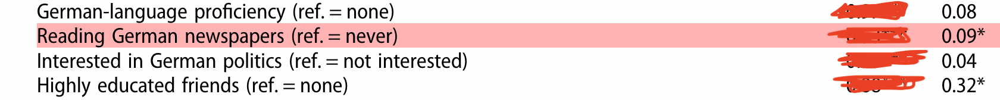
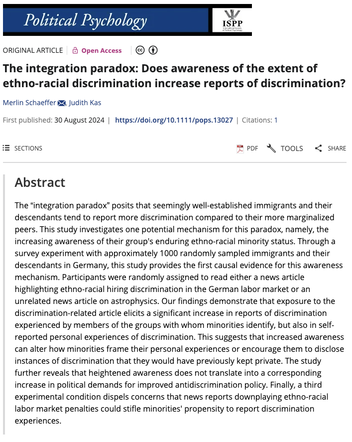

```{r setup, include = FALSE}
library(RefManageR)
library(knitr)
library(ggrepel) # Nicely placed labels in figures.
library(modelr)
library(webexercises) # Small web-based answer scales.
library(equatiomatic) # Regression equations from model objects.
library(essentials)

options(htmltools.preserve.raw = FALSE,
        htmltools.dir.version = FALSE, servr.interval = 0.5, width = 115, digits = 3)
knitr::opts_chunk$set(
  collapse = TRUE, message = FALSE, fig.retina = 3, error = TRUE,
  warning = FALSE, cache = FALSE, fig.align = 'center',
  comment = "#", strip.white = TRUE, tidy = FALSE)

BibOptions(check.entries = FALSE, 
           bib.style = "authoryear", 
           style = "markdown",
           hyperlink = FALSE,
           no.print.fields = c("doi", "url", "ISSN", "urldate", "language", "note", "isbn", "volume"))
myBib <- ReadBib("./../../../Stats_II.bib", check = FALSE)

xaringanExtra::use_xaringan_extra(c("tile_view", "tachyons"))
xaringanExtra::use_panelset()
```
class: clear

```{r, echo = FALSE, out.width='60%', fig.align='center'}
knitr::include_graphics('https://pbs.twimg.com/media/EouSsOKUUAM0P_y.jpg')
```
.backgrnote[.center[*Source:* `r Citet(myBib, "polack_safety_2020")`]]

---
# Goal of empirical sociology

.font130[.center[Use data to discover patterns, <br> and the .alert[social mechanisms that bring them about.]]]

```{r, echo = FALSE, out.width='65%', fig.align='center'}
knitr::include_graphics('https://researchleap.com/wp-content/uploads/2021/12/Population-data.jpeg')
```

---
class: inverse middle
# Today's schedule

1. **Today's research question**: The Integration Paradox

2. **Experiments**
  + Randmozied Controlled Trials (RCTs)
  + RCTs, potential outcomes, and DAGs

---
class: inverse
# The Integration Paradox .font60[Research question of the day]

.right-column[
```{r, echo = FALSE, out.width='60%', fig.align='center'}
knitr::include_graphics('img/Shocking.jpeg')
```

```{r, echo = FALSE, out.width='100%', fig.align='center'}
knitr::include_graphics('img/Steinmann1.png')

```

```{r, echo = FALSE, out.width='100%', fig.align='center'}
knitr::include_graphics('img/Steinmann3.png')
```
.font70[.center[*Source:* `r Citet(myBib, "steinmann_paradox_2019")`]]
]

.left-column[.center[.font110[
**Does news media consumption** <br><br> _**increase**_ <br><br> **immigrant minorities' reports of discrimination?**
]]]

---
# Preparation

.panelset[
.panel[.panel-name[Packages for today's session]
```{r libraries}
pacman::p_load( # Load several R packages using the pacman package manager
  tidyverse,  # A collection of packages for data manipulation and visualization
  ggplot2,    # Powerful package for creating static, animated and interactive visualizations
  estimatr,   # Package for fast estimators for regression with weighted data
  modelr,     # Provides functions for modelling and prediction
  kableExtra, # Enhances table creation in R
  modelsummary) # Creates tables and plots to summarize statistical models
```
]
.panel[.panel-name[The APAD survey]
.left-column[.font80[
- `r Citet(myBib, "schaeffer_association_2023")`
- 1093 Immigrants and children of immigrants.
- Berlin, Hamburg, Munich, Frankfurt, and Cologne.
- Interviewed August 2021.
- Financed by [German Research Council (DFG)](https://gepris.dfg.de/gepris/projekt/428878477?language=en)
]]

.right-column[.font80[
1. > On a typical day, about how much time do you spend watching, reading, or listening to news about politics and current affairs? *Please give your answer in hours and then minutes.*

2. > Now we would like to ask you about discrimination. How often were you personally discriminated in the following situations here in Germany? .backgrnote[
Discrimination means that a person is treated worse than others including specific reasons for this behavior and no factual justification. People use different modes of discrimination like insult, ostracism, or sexual harassment. Rules and laws disadvantaging people are also discrimination.]
> ... When looking for work or an apprenticeship<br>
> ... At work / in professional life<br>
> ... While attending school or higher education<br>
> ... When looking for housing<br>
> ... When having contact with government officials or public administrators<br>
> ... When you were out in public during your free time<br><br>
> (1) Never, (2) Rarely, (3) Sometimes, (4) Often, (5) Very often<br>
]]
]

.panel[.panel-name[Get the APAD data]
.push-left[.font80[
```{r results = FALSE, echo = FALSE}
# Read APAD data,
load("../../../assets/APAD.RData") 
```

```{r eval = FALSE}
load("APAD.RData") # Load APAD dataset
```

```{r results = FALSE}
APAD <- APAD %>% mutate( # Process APAD data
  # Convert news consumption to minutes
  # Example: 2 hours and 30 minutes becomes 2*60 + 30 = 150 minutes
  news = news_hrs*60 + news_mins, 
  # Create binary variable for news consumption
  news_yn = case_when(
    news < 15 ~ 0,  # 0 if less than 15 minutes
    news >= 15 ~ 1, # 1 if 15 minutes or more
    TRUE ~ as.numeric(NA)), # Handle other cases as missing
  # Calculate average discrimination index across multiple domains
  dis_index = rowMeans( # Calculate the mean for each row (participant)
    select(., # Choose specific discrimination columns from "." (APAD)
           dis_trainee, dis_job, dis_school, 
           dis_house, dis_gov, dis_public),
    na.rm = TRUE), # Ignore NA values
  # Standardize discrimination index
  # scale() standardizes; as.numeric() converts to numeric vector
  z_dis_index = scale(dis_index) %>% as.numeric()
)
```
]]

.push-right[.font80[
<br>
```{r echo = FALSE}
APAD
```
]]

]]

---
# Fruitless\naïv comparison

.push-left[
```{r naiv, out.width = "98%", fig.height = 3.5, fig.width = 5, echo = FALSE}
ggplot(data = APAD, aes(y = dis_index, x = news)) +
  geom_point(aes(size = gewFAKT), alpha = 1/3) +
  geom_smooth(aes(weight = gewFAKT), method = "lm") +
  scale_y_continuous(breaks = 1:5, labels = c("Never", "Rarely", "Sometimes", "Often", "Very often")) +
  labs(y = "Perceived discrimination index", x = "Daily minutes of news consumption") +
  theme_minimal() +
  theme(legend.position = "none")
```
]

--

.push-right[.font80[
```{r naiv_OLS}
ols <- lm_robust(dis_index ~ news_yn, # Run weighted OLS
                 weight = gewFAKT, data = APAD)

modelsummary( # Create summary table of OLS results
  list("Discr." = ols), # List of OLS model objects
  stars = TRUE, # Indicate significance level
  # Choose Goodness of Fit indicators
  gof_map = c("nobs", "r.squared"), 
  output = "kableExtra") # Format as HTML
```
]]

---
# Why? Selection bias!

$$\begin{equation} \begin{split}
\underbrace{Avg_{n}[Y_{1i}|D_{i} = 1] - Avg_{n}[Y_{0i}|D_{i} = 0]}_{\text{Difference in observed group means}} = \underbrace{Avg_{n}[Y_{1i}|D_{i} = 1] \color{gray}{(-  Avg_{n}[Y_{0i}|D_{i} = 1]}}_{\text{Average causal effect } among \text{ } the \text{ } treated} \color{gray}{+} \underbrace{\color{gray}{Avg_{n}[Y_{0i}|D_{i} = 1])} -  Avg_{n}[Y_{0i}|D_{i} = 0]}_{\text{Selection bias}}.
\end{split} \end{equation}$$


.content-box-red[.center[
$\text{Selection bias} = \underbrace{Avg_{n}[Y_{0i} | D_{i} = 1]}_{\text{Unobserved!}} - Avg_{n}[Y_{0i} | D_{i} = 0].$

$\rightarrow$ The difference in $Avg_{n}(Y_{0i})$, the baseline of the outcome, between the groups we compare.
]]

---
# (Im-)balance .font70[.alert[of oberserved variables!]]

.panelset[
.panel[.panel-name[R code]
```{r balance1, results = FALSE}
APAD %>% # Start with the APAD dataset, then pipe
  # Select specific variables for the balance test
  select(news_yn, age, nbh_exposed, imor, german, gewFAKT) %>%
  # Rename the weights variable so that the following #<<
  # command (datasummary_balance) automatically treats it as a weight #<<
  rename(weights = gewFAKT) %>% #<<
  # Create a balance table #<<
  datasummary_balance( #<<
    # Formula specifies to compare groups based on news_yn #<<
    formula = ~ news_yn, #<<
    data = ., # Use the data piped in from above #<<
    # Provide a title for the table #<<
    title = "Socio-demographic characteristics of those who read news and those who do not", #<<
    output = "kableExtra"# Specify the output format as kableExtra #<<
  ) #<<
```

]
.panel[.panel-name[Balance table]
```{r ref.label = "balance1", echo = FALSE}
```
]]

---
# Directed Acyclical Graphs (DAG)


```{tikz, DAG2,  echo = FALSE, out.width='70%'}
\usetikzlibrary{shapes,decorations,arrows,calc,arrows.meta,fit,positioning}
\tikzset{
    -Latex,auto,node distance =1 cm and 1 cm,semithick,
    state/.style ={ellipse, draw, minimum width = 0.7 cm},
    point/.style = {circle, draw, inner sep=0.04cm,fill,node contents={}},
    bidirected/.style={Latex-Latex,dashed},
    el/.style = {inner sep=2pt, align=left, sloped}
}

\begin{tikzpicture}
\sffamily
    \node[state] (1) at (0,0) {German citizen};
    \node[state] (2) [below = of 1] {Read news};
    \node[state] (3) [right = of 2] {Discrimination};

    \path (1) edge  (2);
    \path[bidirected] (2) edge[red, bend right=50] (3);
    \path (1) edge (3);
\end{tikzpicture}
```

.backgrnote[
The red bi-directed arrow is officially not part of the DAG. But helps it helps us to understand that the correlation between Discrimination and Reading the news is not causal in nature. The reason for this non-causal relationship is the existence of a backdoor path. The backdoor path is opened by German citizenship, which influences whether people read the news but also how much discrimination they experience.
]

---
class: inverse middle center
# Experiments

---
layout: true
# Experiment

.left-column[
- We do not *passively observe*, <br> we .alert[actively intervene].

- Thereby *we* control, who gets $D$ and who does not!

```{r, echo = FALSE, out.width='80%', fig.align='center'}

```
]

---

.push-right[
```{tikz, DAG3,  echo = FALSE, out.width='80%'}
\usetikzlibrary{shapes,decorations,arrows,calc,arrows.meta,fit,positioning}
\tikzset{
  -Latex,auto,node distance =1 cm and 1 cm,semithick,
  state/.style ={ellipse, draw, minimum width = 0.7 cm},
  point/.style = {circle, draw, inner sep=0.04cm,fill,node contents={}},
  bidirected/.style={Latex-Latex,dashed},
  el/.style = {inner sep=2pt, align=left, sloped}
}

\begin{tikzpicture}
\sffamily
\node[state] (1) [red] at (0,0) {$I$};
\node[state] (2) [right = of 1] {$D$};
\node[state] (3) [above = of 2] {$C$};
\node[state] (4) [right = of 2] {$Y$};

\path (1) [red] edge (2);
\path (2) edge (4);
\path (3) edge [dashed] (4);
\path (3) edge [dashed] (2);
\end{tikzpicture}
```
]

---


.push-right[
```{tikz, ref.label = "DAG3",  echo = FALSE, out.width='70%'}
```

.content-box-green[.center[
How can we $\color{red}{I}$ntervene to eliminate correlation between the treatment $D$ and potential confounders $C$?
]]]

---
layout: false
class: middle center
background-image: url("https://gummibaerenland.de/cdn/shop/products/212669_lakritz_schnecken_1.jpg?v=1649245056&width=1200")
background-position: center
background-size: cover


---
layout: false
class: inverse middle center
# Break

<iframe src='https://panel.letstimeit.com/instant-timer/15-minute' width='600' height='400' frameborder='0' scrolling='yes'></iframe>

---
class: middle clear

.left-column[
```{r, echo = FALSE, out.width='80%'}
knitr::include_graphics('https://www.laserfiche.com/wp-content/uploads/2014/10/femalecoder.jpg')
```

<iframe src='https://panel.letstimeit.com/instant-timer/20-minute' width='600' height='400' frameborder='0' scrolling='yes'></iframe>
]

.right-column[
<br>
<iframe src='exercise1.html' width='1000' height='600' frameborder='0' scrolling='yes'></iframe>
]

---
layout: false
class: inverse middle center
# Break

<iframe src='https://panel.letstimeit.com/instant-timer/10-minute' width='600' height='400' frameborder='0' scrolling='yes'></iframe>

---
layout: true
# Randomized Controlled Trials (RCT)


.push-left[

```{r, echo = FALSE, out.width='100%', fig.align='center'}
knitr::include_graphics('./img/randomization2.png')
```

- We .alert[randomly] decide, who gets: 
  + $\text{Read news = 0} \rightarrow$ *Control* group, 
  + $\text{Read news = 1} \rightarrow$ *Treatment* group.
]

---

---

.push-right[

```{r, echo = FALSE, out.width='70%', fig.align='center'}
knitr::include_graphics('https://media1.giphy.com/media/v1.Y2lkPTc5MGI3NjExaGJzdDlrMXNwNTFtNHlpd3ppM2p6NmVsYjBmZGczOXJyNnBmdzFoOSZlcD12MV9pbnRlcm5hbF9naWZfYnlfaWQmY3Q9Zw/Ps8XflhsT5EVa/giphy.webp')
```

Remember, randomization is "fair": 

Everyone has the same probability to be part of the treatment or control group, .alert[regardless of who they are]!

.content-box-green[
Why does this result in equal $Y_{0i}$ baselines?
$$Avg_{n}[Y_{0i}|\text{News} = 1] = Avg_{n}[Y_{0i}|\text{News} = 0]$$
]]

---
layout: false
# Randomized Controlled Trials (RCTs)

.push-left[

If we *randomly* divide subjects into treatment and control groups, .alert[they come from the same underlying population]. 
  <br> <br> $\rightarrow$ They will be similar, on average, *in every way*;<br> **including their $Y_{0}$ **!
  <br> <br> $\rightarrow E[Y_{0i}|D=1] = E[Y_{0i}|D=0]$!
  
**Beware**, in practice randomization can fail, especially if your sample is small.
]

.push-right[
```{r, echo = FALSE, out.width='90%', fig.align='center'}
knitr::include_graphics('./img/randomization2.png')
```
]

---
# RCTs and potential outcomes

.push-left[
```{r, echo = FALSE, out.width='60%', fig.align='center'}
knitr::include_graphics('./img/randomization2.png')
```

If we *randomly* divide subjects into treatment and control groups, .alert[they come from the same underlying population]. 
    <br> <br> $\rightarrow$ They will be similar, on average, *in every way*;<br> **including their $Y_{0}$ **!
    <br> <br> $\rightarrow E[Y_{0i}|D=1] = E[Y_{0i}|D=0]$!
    
**Beware**, in practice randomization can fail, especially if your sample is small.
]

--

.push-right[

$$\begin{equation}\begin{split} &  \underbrace{E[Y_{1i}|D=1] - E[Y_{0i}|D=0]}_{\text{Comparison between treatment and control group}} \\  \\ & = E[Y_{0i} + \color{red}{\kappa} |D=1] - E[Y_{0i}|D=0], \\ \\ &= \color{red}{\kappa} + \underbrace{E[Y_{0i} |D=1] - E[Y_{0i}|D=0]}_{\underbrace{0}_{\text{Selection bias (if randomization has worked)}}}, \\ \\ & = \underbrace{\color{red}{\kappa}.}_{\text{The average causal effect}} \end{split}\end{equation}$$
]


---
# RCTs and DAGs

.left-column[
Because of the randomization, there is no backdoor path. That is, no path from $I$ to $Y$ that starts with an arrow into $I$.

$\Rightarrow$ No selection/confounder bias!

**Beware**, in practice randomization can fail, especially if your sample is small.
]

.right-column[
```{tikz, ref.label = "DAG3",  echo = FALSE, out.width='70%'}
```
]

---
layout: true
class: clear
.push-left[
<br>

.font160[.center[**APAD survey experiment**]]

We asked APAD subjects to read a news article.

```{r, echo = FALSE, out.width='80%', fig.align='center'}
knitr::include_graphics('./img/randomization2.png')
```

<br>

We .alert[randomly] decided, who got:

  + Venus $\rightarrow$ *Control* group, 
  
  + Discrimination $\rightarrow$ **_Treatment_ group 1**,
  
  + Acculturation $\rightarrow$ **_Treatment_ group 2**.
]

---

.push-right[
```{r, echo = FALSE, out.width='100%', fig.align='center'}
knitr::include_graphics('./img/Contr.png')
```
]

---

.push-right[
```{r, echo = FALSE, out.width='89%', fig.align='center'}
knitr::include_graphics('./img/Exp2.png')
```
]

---

.push-right[
```{r, echo = FALSE, out.width='75%', fig.align='center'}
knitr::include_graphics('./img/Exp1.png')
```
]

---
layout: false
# Balance test

.panelset[
.panel[.panel-name[Balance table (surveyed news reading)]
```{r ref.label = "balance1", echo = FALSE}
```
]
.panel[.panel-name[Balance table (RCT news)]
```{r balance2, echo = FALSE}
APAD %>% # Start with the APAD dataset, then pipe
  # Select specific variables for the balance test
  select(article,news_yn, age, nbh_exposed, imor, german, gewFAKT) %>%
  # Rename the weights variable so that the following #<<
  # command (datasummary_balance) automatically treats it as a weight #<<
  rename(weights = gewFAKT) %>% #<<
  # Create a balance table #<<
  datasummary_balance( #<<
    # Formula specifies to compare groups based on treatment/control  #<<
    formula = ~ article, #<<
    data = ., # Use the data piped in from above #<<
    # Provide a title for the table #<<
    title = "Socio-demographic characteristics of those who read news and those who do not", #<<
    output = "kableExtra"# Specify the output format as kableExtra #<<
  ) #<<
```
]

.panel[.panel-name[R code]
```{r ref.label = "balance2", results = FALSE}
```
]]

---
# Causal effect of news articles

.push-left[.font80[
<br>

```{r OLS_causal, results = 'hide'}
# Weighted OLS to analyze survey RCT.
ols <- lm_robust(dis_index ~ article, 
                 weight = gewFAKT, data = APAD)
# Weighted and z-standardized OLS to analyze survey RCT.
zols <- lm_robust(z_dis_index ~ article, 
                  weight = gewFAKT, data = APAD)

modelsummary( # Formatted table comparing both OLS models
  list("Discr." = ols, "Z-Discr." = zols), # List of models
  stars = TRUE, # Show significance stars
  coef_map = c("(Intercept)" = "Intercept (Venus control)", 
               "articleTreat_1" = "Article on discrimination", 
               "articleTreat_2" = "Article on Acculturation"),
  # 'coef_map' renames coefficients for clarity
  gof_map = c("nobs", "r.squared"), # Goodness-of-fit
  output = "kableExtra") # Output format for the table
```
]]

--

.push-right[
<br>

```{r ref.label = "OLS_causal", echo = FALSE, results = 'asis'}
```
]

---
# Visualize

.panelset[
.panel[.panel-name[R code]
```{r Coefplot, fig.show='hide'}
plotdata <- zols %>% # Prepare data for plotting
  tidy() %>% # Convert regression results to a tidy data frame
  filter(term != "(Intercept)") %>% # Remove the intercept term
  mutate( # Rename treatment variables for clarity
    term = case_when(
      term == "articleTreat_1" ~ "Discrimination",
      term == "articleTreat_2" ~ "Acculturation"))

# Create the plot
ggplot(data = plotdata, aes(y = estimate, x = term)) +
  geom_hline(yintercept = 0, color = "orange", 
             lty = "dashed") + # Add a horizontal line at y=0
  # Plot point estimates and confidence intervals
  geom_pointrange(aes(min = conf.low, max = conf.high)) + 
  coord_flip() + # Flip coordinates for horizontal display
  labs(title = "Causal effect of news articles", 
       x = "Article on",
       y = "Comparison to control group (article on Venus) 
    in standard deviations",
    caption = "Note: Results are based on a weighted OLS with robust standard errors.
    N = 1085, and R2 = 0.012.") + 
  theme_minimal() # Use a minimal theme for clean appearance
```
]


.panel[.panel-name[Plot]
```{r ref.label = "Coefplot", out.width='65%', fig.height = 3, fig.width = 6, echo = FALSE, results = FALSE}
```
]]

---
# Learning goal achieved!

.push-left[
```{r, echo = FALSE, out.width='75%'}

```
.backgrnote[.center[*Source:* `r Citet(myBib, "schaeffer_integration_2024")`]]
]

.push-right[
.center[.font80[Effects of experimentally induced awareness of discrimination]]
```{r, echo = FALSE, out.width='70%'}
knitr::include_graphics('./img/pops13027-fig-0001-m.jpg')
```
.backgrnote[.font70[
Point estimates with 90 and 95% confidence intervals based on post-stratification weighted OLS regression with (cluster-)robust standard errors.
]]]

---
class: middle clear

.left-column[
```{r, echo = FALSE, out.width='80%'}
knitr::include_graphics('https://www.laserfiche.com/wp-content/uploads/2014/10/femalecoder.jpg')
```
]

.right-column[
<iframe src='exercise2.html' width='1000' height='600' frameborder='0' scrolling='yes'></iframe>
]

---
class: inverse
# Today's general lessons

1. **Experiment**: A study in which the researcher manipulates one or more variables (the "treatment") and then observes the effect of this manipulation on another variable (the "outcome").

2. **Randomized Controlled Trial (RCT)**: A type of experiment in which participants are randomly assigned to either a treatment group or a control group. The treatment group receives the treatment, while the control group does not. This randomization ensures that the two groups are as similar as possible at the start of the experiment, except for the fact that the treatment group receives the treatment and the control group does not.

3. **Randomization**: The process of randomly assigning participants to either the treatment group or the control group in an RCT. Randomization is important because it helps to ensure that the two groups are as similar as possible at the start of the experiment, which minimizes the risk of selection bias.

4. **OLS regression**: A statistical technique that can be used to analyze the results of an RCT. OLS regression can be used to estimate the causal effect of the treatment on the outcome, while controlling for the effects of other variables that may be correlated with the treatment.

---
# References

.font80[
```{r ref, results = 'asis', echo = FALSE}
PrintBibliography(myBib)
```
]