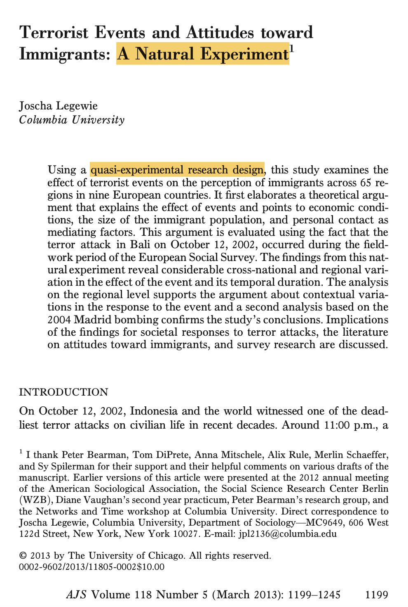
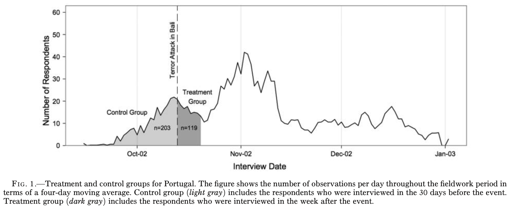
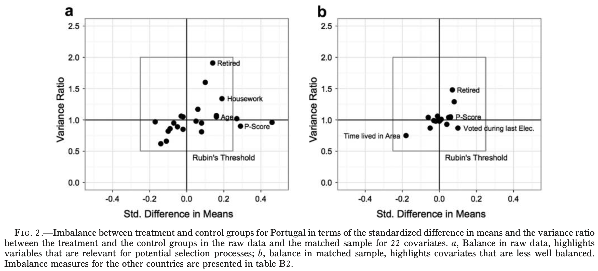
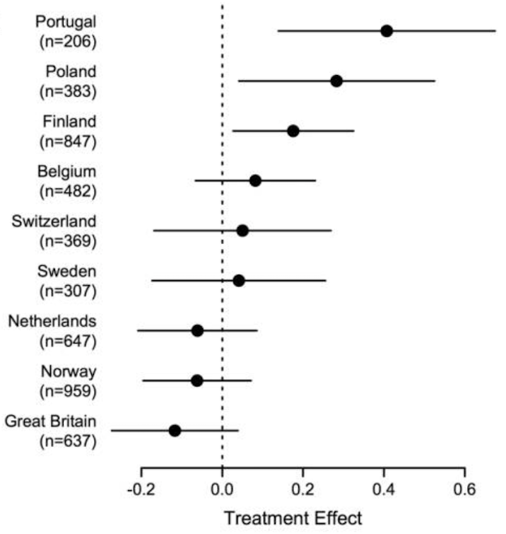
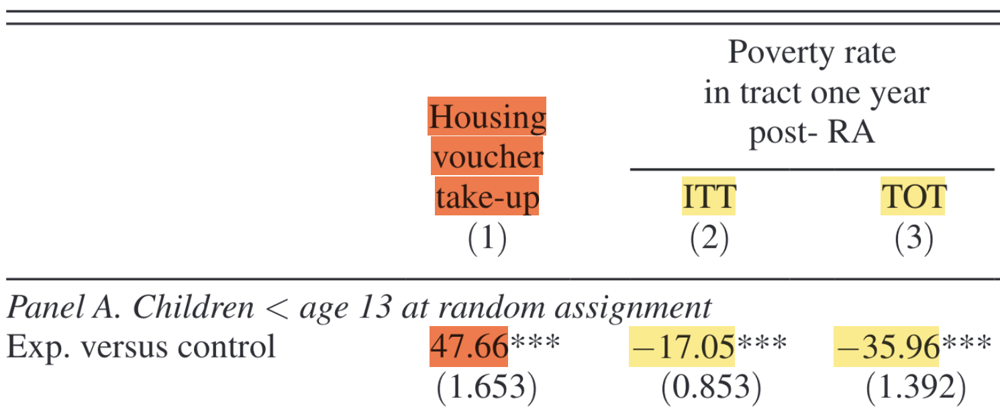
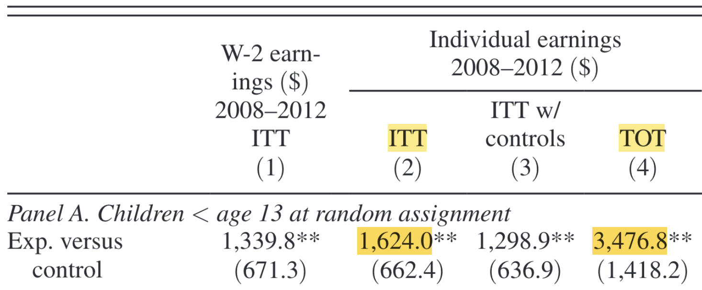

```{r setup, include = FALSE}
library(RefManageR)
library(knitr)
library(ggrepel) # Nicely placed labels in figures.
library(modelr)
library(webexercises) # Small web-based answer scales.
library(equatiomatic) # Regression equations from model objects.
library(essentials)

options(htmltools.preserve.raw = FALSE, tikzDefaultEngine = "xetex",
        htmltools.dir.version = FALSE, servr.interval = 0.5, width = 115, digits = 3)
knitr::opts_chunk$set(
  collapse = TRUE, message = FALSE, fig.retina = 3, error = TRUE,
  warning = FALSE, cache = TRUE, fig.align = 'center',
  comment = "#", strip.white = TRUE, tidy = FALSE)

BibOptions(check.entries = FALSE, 
           bib.style = "authoryear", 
           style = "markdown",
           hyperlink = FALSE,
           no.print.fields = c("doi", "url", "ISSN", "urldate", "language", "note", "isbn", "volume"))
myBib <- ReadBib("./../../../Stats_II.bib", check = FALSE)

xaringanExtra::use_xaringan_extra(c("tile_view", "tachyons"))
xaringanExtra::use_panelset()
```
# The goal of social science research

.font140[.center[.alert[Use data to discover patterns ("social facts" in Durkheim's terms), <br> and **the social mechanisms that bring them about**.]]]

```{r, echo = FALSE, out.width='70%', fig.align='center'}
knitr::include_graphics('https://liu.se/-/media/istock-501261958.jpg?mw=1120&mh=1120&hash=DA8977CCE6A6E600AE80A40CFEE771C9')
```

---
class: inverse middle
# Today's schedule

1. **Application 1**: Terrorist attacks and xenophobia. 

2. **Natural Experiments**
  + RCTs versus Natural Experiments

3. **Application 2:** Moving out of poor neighborhoods during early childhood.

4. **Intention to Treat (ITT)** Effects
  + RCTs versus ITTs

5. **Instrument Variables (IV)**
  - 3 IV requirements
  - First stage, reduced form, & IV estimator
  - Why IV is LATE (local average treatment effect)

---
# Terrorism and xenophobia

.push-left[
```{r, echo = FALSE, out.width='80%'}
knitr::include_graphics('https://cdn.britannica.com/25/74225-050-7F97DCE4/second-jetliners-terrorists-al-Qaeda-smoke-billows-crash-Sept-11-2001.jpg')
```


]

.push-right[
```{r, echo = FALSE, out.width='77.5%'}
knitr::include_graphics('https://cdn.britannica.com/33/129733-050-AF95D301/Smoke-flames-twin-towers-attacks-World-Trade-September-11-2001.jpg')
```
]

---
class: inverse middle center
# Research question 1 of the day

.right-column[
```{r, echo = FALSE, out.width='60%'}
knitr::include_graphics('https://api.time.com/wp-content/uploads/2019/07/gettyimages-1064896696.jpg')
knitr::include_graphics('https://www.brookings.edu/wp-content/uploads/2019/07/Denmark.jpg?w=1200&h=630&crop=1')
```
]

--

.left-column[
.font130[
**What is the** 

**average causal effect**

**of terrorist attacks on xenophobia?**
]]

---
# We need an RCT!

.push-left[
```{r, echo = FALSE, out.width='60%', fig.align='center'}
knitr::include_graphics('./img/randomization2.png')
```

- If we *randomly* divide subjects into treatment and control groups: They come from the same underlying population. 
  <br> <br> $\rightarrow$ Similar .alert[on average], *in every way*,<br> **including their $Y_{0}$ **!
  <br> <br> $\rightarrow E[Y_{0i}|D=1] = E[Y_{0i}|D=0]$!
]

.push-right[

$$\begin{equation}\begin{split} E & [Y_{1i}|D=1] - E[Y_{0i}|D=0] \\  \\ & = E[\color{red}{Y_{0i} + \kappa} |D=1] - E[Y_{0i}|D=0], \\ \\ &= \color{red}{\kappa} + \underbrace{E[Y_{0i} |D=1] - E[Y_{0i}|D=0]}_{\underbrace{0}_{\text{(if randomization has worked)}}}, \\ \\ & = \underbrace{\color{red}{\kappa}.}_{\text{The average causal effect}} \end{split}\end{equation}$$
]

---
# But that's impossible and un-ethical!

.left-column[.center[
.alert[We cannot 

treat people with terrorism!]
]]

.right-column[
```{tikz, DAG1, echo = FALSE, out.width='70%', fig.ext = 'png', fig.retina = 3}
\usetikzlibrary{shapes,decorations,arrows,calc,arrows.meta,fit,positioning}
\tikzset{
  -Latex,auto,node distance =1 cm and 1 cm,semithick,
  state/.style ={ellipse, draw, minimum width = 0.7 cm},
  point/.style = {circle, draw, inner sep=0.04cm,fill,node contents={}},
  bidirected/.style={Latex-Latex,dashed},
  el/.style = {inner sep=2pt, align=left, sloped}
}

\begin{tikzpicture}
\sffamily
\node[state] (1) [red] at (0,0) {$I$};
\node[state] (2) [right = of 1] {$D$};
\node[state] (3) [above = of 2] {$C$};
\node[state] (4) [right = of 2] {$Y$};

\path (1) [red] edge (2);
\path (2) edge (4);
\path (3) edge [dashed] (4);
\path (3) edge [dashed] (2);
\end{tikzpicture}
```
]

---
class: inverse middle center
# Natural Experiments


---
class: clear
.left-column[
<br>

```{r, echo = FALSE, out.width='100%'}
knitr::include_graphics('https://jlegewie.com/files/joscha.jpg')
```

### My friend Joscha 

### had an idea

]

.right-column[
```{r, echo = FALSE, out.width='60%'}

```
]

---
# Natural experiments


.push-left[
**Natural experiment**: .alert[Random exposure] to treatment or control conditions are determined .alert[by nature] (or by other factors outside the control of researchers).

In comparison to a normal RCT, this allows for:
> an experiment [...] on the grandest scale.

> -- `r Citet(myBib, "snow_mode_1856")`
]

.push-right[.center[
The first natural experiment: <br>
The cause of Cholera]
```{r, echo = FALSE, out.width='80%'}
knitr::include_graphics('https://upload.wikimedia.org/wikipedia/commons/thumb/2/27/Snow-cholera-map-1.jpg/1920px-Snow-cholera-map-1.jpg')
```
.center[.backgrnote[*Source:* `r Citet(myBib, "snow_mode_1856")`]]
]
---
# The 2002 Bali bombings

.left-column[
```{r, echo = FALSE, out.width='100%'}
knitr::include_graphics('https://www.iri.org/wp-content/uploads/2018/01/335017fda2a54fdc58700d83f73217c0.jpg?w=650')
knitr::include_graphics('https://dynaimage.cdn.cnn.com/cnn/c_fill,g_auto,w_1200,h_675,ar_16:9/https%3A%2F%2Fcdn.cnn.com%2Fcnnnext%2Fdam%2Fassets%2F201213212550-indonesia-bali-bombings-arrest-intl-hnk-file-101602.jpg')
```
]

.right-column[
<iframe src='https://en.wikipedia.org/wiki/2002_Bali_bombings' width='1000' height='600' frameborder='0' scrolling='yes'></iframe>
]

---
# The natural experiment

```{r, echo = FALSE, out.width='70%'}

```
.center[.backgrnote[*Source:* `r Citet(myBib, "legewie_terrorist_2013")`]]

--

.push-left[
.alert[Assumption 1]: The European Social Survey is based on random sampling. .alert[The day of] $i$.alert['s interview is also random!]

- *Reachability bias*: Respondents who are easier to contact tend to be interviewed earlier during the survey period.
]

--

.push-right[
.alert[Assumption 2]: No other event or change over time had a causal effect on $Y_{i}$.
]

---
# Balance?

.left-column[
$$E[Y_{0i}|D=1] = E[Y_{0i}|D=0]?$$

```{tikz, ref.label = "DAG1", echo = FALSE, out.width='100%'}
```
]

.right-column[
```{r, echo = FALSE, out.width='100%'}

```
.center[.backgrnote[*Source:* `r Citet(myBib, "legewie_terrorist_2013")`]]
]

---
# RCTs vs Natural experiments

.push-left[.content-box-red[
.font120[.center[**Internal validity**]]

With an RCT, we have control treatment assignment and thus know that the intervention $I$ was randomly assigned.

```{tikz, ref.label = "DAG1", echo = FALSE, out.width='70%'}
```
]]

--

.push-left[.content-box-blue[
.font120[.center[**External validity**]]

With a natural experiment, we can study a real event $E$ and not some artificial intervention $I$.
<br><br>

```{tikz, DAG2, echo = FALSE, out.width='70%'}
\usetikzlibrary{shapes,decorations,arrows,calc,arrows.meta,fit,positioning,quotes}
\tikzset{
  -Latex,auto,node distance =1 cm and 1 cm,semithick,
  state/.style ={ellipse, draw, minimum width = 0.7 cm},
  point/.style = {circle, draw, inner sep=0.04cm,fill,node contents={}},
  bidirected/.style={Latex-Latex,dashed},
  el/.style = {inner sep=2pt, align=left, sloped}
}

\begin{tikzpicture}
\sffamily
\node[state] (1) [red] at (0,0) {$E$};
\node[state] (2) [right = of 1] {$D$};
\node[state] (3) [above = of 2] {$C$};
\node[state] (4) [right = of 2] {$Y$};

\path (1) [red] edge (2);
\path (1) [red, bidirected] edge ["?"] (3);
\path (2) edge (4);
\path (3) edge [dashed] (4);
\path (3) edge [dashed] (2);
\end{tikzpicture}
```
]]

---
# Natural experiments .font70[How to?!]

.left-column[.content-box-blue[
Analyzing a natural experiment does not necessarily involve much statistical sophistication; often simple OLS suffices.

*But finding one is as tough as finding truffles; you got to be lucky!*

.center[**_Are you such a <br>lucky truffle pig?_**]
]]

.right-column[
```{r, echo = FALSE, out.width='80%'}
knitr::include_graphics('https://upload.wikimedia.org/wikipedia/commons/5/5e/Cochon_truffier.JPG')
```
]

---
class: clear
# Learning goal 1 .font60[Terror attacks can increase xenophobia]

.right-column[
```{r, echo = FALSE, out.width='100%'}

```
.center[.backgrnote[*Source:* `r Citet(myBib, "legewie_terrorist_2013")`]]
]

--

.left-column[.content-box-green[.center[
My friend Joscha <br> is a truffle pig ;)

Based on the idea that the day of a survey interview is random, he could estimate the causal effect of the Bali 2002 terror attack.

Do you want to learn what Joscha has to say about:

*Why was there an effect in Portugal, but not in the UK?* 

Read his article ;)
]]]

---
class: inverse middle center
# Break

<iframe src='https://www.online-timer.net/' width='400' height='385' frameborder='0' scrolling='yes'></iframe>

---
class: middle clear

.left-column[
```{r, echo = FALSE, out.width='100%'}
knitr::include_graphics('https://www.latentview.com/wp-content/uploads/2016/04/LatentView-Turns-Ten-A-decade-of-data-science.jpg')
```

<iframe src='https://www.online-timer.net/' width='400' height='385' frameborder='0' scrolling='yes'></iframe>
]

.right-column[
<br>
<iframe src='exercise1.html' width='1000' height='600' frameborder='0' scrolling='yes'></iframe>
]

---
class: inverse middle center
# Intention to Treat (ITT) Designs

---
# .font80[One of the largest RCTs in the social sciences]

.left-column[
```{r, echo = FALSE, out.width='55%'}
knitr::include_graphics('https://s3.amazonaws.com/uploads.thirdway.org/legacy/publishing/images/files/000/000/955/NEXT_-_Moving_to_Opportunity_COVER_Web.jpg?1422480199')
```

```{r, echo = FALSE, out.width='100%'}
knitr::include_graphics('https://media.npr.org/assets/news/2010/12/06/chicago-176e8cb0fb2f87289bbda3bfd2b8b4f492fa572d-s1100-c50.jpg')
```
]

.right-column[
<iframe src='https://en.wikipedia.org/wiki/Moving_to_Opportunity' width='1000' height='600' frameborder='0' scrolling='yes'></iframe>
]

---
layout: true
# Intention to treat $\neq$ treatment

.left-column[
```{r, echo = FALSE, out.width='100%'}
knitr::include_graphics('https://i.ytimg.com/vi/h5MD2ptO998/maxresdefault.jpg')
```

```{tikz, DAG3, echo = FALSE, out.width='100%'}
\usetikzlibrary{shapes,decorations,arrows,calc,arrows.meta,fit,positioning,quotes}
\tikzset{
  -Latex,auto,node distance =1 cm and 1 cm,semithick,
  state/.style ={ellipse, draw, minimum width = 0.7 cm},
  point/.style = {circle, draw, inner sep=0.04cm,fill,node contents={}},
  bidirected/.style={Latex-Latex,dashed},
  el/.style = {inner sep=2pt, align=left, sloped}
}

\begin{tikzpicture}
\sffamily
\node[state] (1) [red] at (0,0) {$Z$};
\node[state] (2) [right = of 1] {$D$};
\node[state] (3) [above = of 2] {$C$};
\node[state] (4) [right = of 2] {$Y$};

\path (1) [red] edge ["0.4766"] (2);
\path (2) edge (4);
\path (3) edge [dashed] (4);
\path (3) edge [dashed] (2);
\end{tikzpicture}
```
]

---

.right-column[
```{r, echo = FALSE, out.width='80%'}

```
.center[.backgrnote[*Source:* `r Citet(myBib, "chetty_effects_2016")`]]
]

---

.right-column[
```{r, echo = FALSE, out.width='80%'}

```
.center[.backgrnote[*Source:* `r Citet(myBib, "chetty_effects_2016")`]]

.content-box-green[.center[
Are these average causal effects of moving out of poor neighborhoods during childhood?
]]]

---

.right-column[
```{r, echo = FALSE, out.width='80%'}

```
.center[.backgrnote[*Source:* `r Citet(myBib, "chetty_effects_2016")`]]

.content-box-blue[

.center[Since support for moving out of poor neighborhoods was randomly assigned by a lottery...]

$\rightarrow$ The ITTs are average causal effects.

$\rightarrow$ But they are average causal effects .alert[of being offered support] $\color{red}{Z}$ .alert[, not of having moved to a better neighborhood] $\color{black}{D}$.alert[!]

]]

---
layout: false
# RCTs vs ITTs

.push-left[.content-box-red[
.font120[.center[**RCT**]]

$$\begin{equation}\begin{split} & |r_{I,D}| = 1 \\ &\rightarrow I = D! \end{split}\end{equation}$$

That is, the absolute correlation between intervention $I$ and predictor of interest $D$ is 1, making them practically the same thing.
<br>
<br>

```{tikz, DAG4, echo = FALSE, out.width='70%'}
\usetikzlibrary{shapes,decorations,arrows,calc,arrows.meta,fit,positioning,quotes}
\tikzset{
  -Latex,auto,node distance =1 cm and 1 cm,semithick,
  state/.style ={ellipse, draw, minimum width = 0.7 cm},
  point/.style = {circle, draw, inner sep=0.04cm,fill,node contents={}},
  bidirected/.style={Latex-Latex,dashed},
  el/.style = {inner sep=2pt, align=left, sloped}
}

\begin{tikzpicture}
\sffamily
\node[state] (1) [red] at (0,0) {$I$};
\node[state] (2) [right = of 1] {$D$};
\node[state] (3) [above = of 2] {$C$};
\node[state] (4) [right = of 2] {$Y$};

\path (1) [red] edge ["$|r|=1$"] (2);
\path (2) edge (4);
\path (3) edge [dashed] (4);
\path (3) edge [dashed] (2);
\end{tikzpicture}
```
]]

--

.push-left[.content-box-blue[
.font120[.center[**ITT**]]

$$\begin{equation}\begin{split} & |r_{Z, D}| < 1 \\ &\rightarrow Z \neq D! \end{split}\end{equation}$$

That is, the absolute correlation between intervention $Z$ and predictor of interest $D$ is smaller than 1, inducing some portion of random variation into $D$.


```{tikz, DAG5, echo = FALSE, out.width='70%'}
\usetikzlibrary{shapes,decorations,arrows,calc,arrows.meta,fit,positioning,quotes}
\tikzset{
  -Latex,auto,node distance =1 cm and 1 cm,semithick,
  state/.style ={ellipse, draw, minimum width = 0.7 cm},
  point/.style = {circle, draw, inner sep=0.04cm,fill,node contents={}},
  bidirected/.style={Latex-Latex, dashed},
  el/.style = {inner sep=2pt, align=left, sloped}
}

\begin{tikzpicture}
\sffamily
\node[state] (1) [red] at (0,0) {$Z$};
\node[state] (2) [right = of 1] {$D$};
\node[state] (3) [above = of 2] {$C$};
\node[state] (4) [right = of 2] {$Y$};

\path (1) [red] edge ["$|r|<1$"] (2);
\path (2) edge (4);
\path (3) edge [dashed] (4);
\path (3) edge [dashed] (2);
\end{tikzpicture}
```
]]

---
layout: false
class: inverse middle center
# .font50[Fortunately, the Intervention (i.e. intention to treat) can be used as an:]<br> Instrument Variable (IV)

---
layout: true
# Instrument Variables (IV)

.left-column[.content-box-red[
.center[**3 Requirements**]
1. *First stage*: Instrument has causal effect on outcome $Y_{i}$.

2. *Randomization*: Instrument is randomly assigned (RCT or natural experiment).

3. *Exclusion restriction*: Instrument affects outcome $Y_{i}$ **_only_** through its effect on $D$.
  + In practice very difficult to test
]]

---
.right-column[
```{tikz, ref.label = "DAG5", echo = FALSE, out.width='70%'}
```
]

---

.right-column[
```{tikz, DAG6, echo = FALSE, out.width='100%'}
\usetikzlibrary{shapes,decorations,arrows,calc,arrows.meta,fit,positioning,quotes}
\tikzset{
  -Latex,auto,node distance =1 cm and 1 cm,semithick,
  state/.style ={ellipse, draw, minimum width = 0.7 cm},
  point/.style = {circle, draw, inner sep=0.04cm,fill,node contents={}},
  bidirected/.style={Latex-Latex,dashed},
  el/.style = {inner sep=2pt, align=left, sloped}
}

\begin{tikzpicture}
\sffamily
\node[state] (1) [red, align = center] at (0,0) {Support};
\node[state] (2) [right = of 1, align = center] {Moving out \\ of poverty};
\node[state] (3) [above = of 2, align = center] {E.g.\ optimistic \\ personality};
\node[state] (4) [right = of 2, align = center] {Income \\ as adult};

\path (1) [red] edge ["0.4766"] (2);
\path (1) [red] edge ["?"] (3);
\path (2) edge (4);
\path (3) edge [red] (4);
\path (3) edge [dashed] (2);
\end{tikzpicture}
```
]


---

.right-column[
```{tikz, DAG7, echo = FALSE, out.width='100%'}
\usetikzlibrary{shapes,decorations,arrows,calc,arrows.meta,fit,positioning,quotes}
\tikzset{
  -Latex,auto,node distance =1 cm and 1 cm,semithick,
  state/.style ={ellipse, draw, minimum width = 0.7 cm},
  point/.style = {circle, draw, inner sep=0.04cm,fill,node contents={}},
  bidirected/.style={Latex-Latex,dashed},
  el/.style = {inner sep=2pt, align=left, sloped}
}

\begin{tikzpicture}
\sffamily
\node[state] (1) [red, align = center] at (0,0) {Support};
\node[state] (2) [right = of 1, align = center] {Moving out \\ of poverty};
\node[state] (3) [above = of 2, align = center] {E.g.\ optimistic \\ personality};
\node[state] (4) [right = of 2, align = center] {Income \\ as adult};

\path (1) [red] edge ["0.4766"] (2);
\path (2) edge ["?"] (4);
\path (3) edge [dashed] (4);
\path (3) edge [dashed] (2);
\end{tikzpicture}
```

$$\underbrace{\kappa_{\text{Support}\rightarrow\text{Income}}}_{1624\text{ Dollar}} = \underbrace{\kappa_{\text{Support}\rightarrow\text{Moving}}}_{0.4766} \times \underbrace{\kappa_{\text{Moving}\rightarrow\text{Income}}}_{?}$$

]

---

.right-column[
```{tikz, ref.label = "DAG7", echo = FALSE, out.width='100%'}
```

$$\begin{equation}\begin{split} & \underbrace{\kappa_{\text{Support}\rightarrow\text{Income}}}_{1624\text{ Dollar}} = \underbrace{\kappa_{\text{Support}\rightarrow\text{Moving}}}_{0.4766} \times \underbrace{\kappa_{\text{Moving}\rightarrow\text{Income}}}_{?} \\ \\ & \frac{\kappa_{\text{Support}\rightarrow\text{Income}}}{\kappa_{\text{Support}\rightarrow\text{Moving}}} = \underbrace{\kappa_{\text{Moving}\rightarrow\text{Income}}}_{?} \end{split}\end{equation}$$
]
---
layout: false
# IV .font60[in general]

.push-left[
```{tikz, DAG8, echo = FALSE, out.width='70%'}
\usetikzlibrary{shapes,decorations,arrows,calc,arrows.meta,fit,positioning,quotes}
\tikzset{
  -Latex,auto,node distance =1 cm and 1 cm,semithick,
  state/.style ={ellipse, draw, minimum width = 0.7 cm},
  point/.style = {circle, draw, inner sep=0.04cm,fill,node contents={}},
  bidirected/.style={Latex-Latex, dashed},
  el/.style = {inner sep=2pt, align=left, sloped}
}

\begin{tikzpicture}
\sffamily
\node[state] (1) [red] at (0,0) {$Z$};
\node[state] (2) [right = of 1] {$D$};
\node[state] (3) [above = of 2] {$C$};
\node[state] (4) [right = of 2] {$Y$};

\path (1) [red] edge ["$\phi$"] (2);
\path (2) edge ["$\lambda$"](4);
\path (3) edge [dashed] (4);
\path (3) edge [dashed] (2);
\end{tikzpicture}
```

**First Stage:** $E[D_{i}|Z_{i}=1]-E[D_{i}|Z_{i}=0]; \text{call this }\phi.$

**Reduced Form:** $E[Y_{i}|Z_{i}=1]-E[Y_{i}|Z_{i}=0]; \text{call this }\rho.$

**IV Estimator:** $\lambda = \frac{\rho}{\phi} = \frac{E[Y_{i}|Z_{i}=1]-E[Y_{i}|Z_{i}=0]}{E[D_{i}|Z_{i}=1]-E[D_{i}|Z_{i}=0]}.$
]

--

.push-right[.content-box-blue[
.center[**The exclusion restriction matters!**<br>(but we can never test it)]
```{tikz, ref.label = "DAG6", echo = FALSE, out.width='65%'}
```

$$\frac{1624}{0.4766} = \frac{\rho \color{red}{+ ?}}{\phi}\neq \lambda$$
.center[.alert[
If the exclusion restriction does not hold, <br> we weigh-up other causal effects than $D$ by $\frac{1}{\phi}$
]]]]

---
layout: false
# IV is LATE .font60[Local Average Treatment Effect]

.push-left[
```{tikz, ref.label = "DAG8", echo = FALSE, out.width='70%'}
```

**First Stage:** $E[D_{i}|Z_{i}=1]-E[D_{i}|Z_{i}=0]; \text{call this }\phi.$

**Reduced Form:** $E[Y_{i}|Z_{i}=1]-E[Y_{i}|Z_{i}=0]; \text{call this }\rho.$

**IV Estimator of LATE:** $\lambda = \frac{\rho}{\phi} = \frac{E[Y_{i}|Z_{i}=1]-E[Y_{i}|Z_{i}=0]}{E[D_{i}|Z_{i}=1]-E[D_{i}|Z_{i}=0]} \color{red}{= E[Y_{1i}-Y_{0i}|\text{Complier}_{i}=1]}.$
]

.push-right[
```{tikz, Tree1, echo = FALSE, out.width='90%'}
\usetikzlibrary{trees}

\tikzset{
  el/.style = {inner sep=2pt, align=left, sloped},
  level distance=1.5cm,
  level 1/.style={sibling distance=6.5cm},
  level 2/.style={sibling distance=3cm},
  level 3/.style={sibling distance=1.5cm},
  node/.style={align=center,anchor=north}
}

\tikzstyle{bag} = [align=center]

\begin{tikzpicture}
  \node[bag] {Sample}
    child {node[bag] {Lottery\\winners\\$Z_{i}=1$}
      child {node[bag, red] {Moved \\ away}
        child {node[bag, red] {Compliers}}
        }
      child {node[bag] {Stayed}
        child {node[bag] {Never-\\taker}}
        child {node[bag] {Defiers}}
        }
    }
    child {node[bag] {Lottery \\ losers \\ $Z_{i}=0$}
    child {node[bag] {Moved \\ away}
      child {node[bag] {Defiers}}
      child {node[bag] {Always-\\taker}}
      }
      child {node[bag, red] {Stayed}
        child {node[bag, red] {Compliers}}
      }
    };
\end{tikzpicture}
```
]

---
layout: false
# IV is LATE .font60[Local Average Treatment Effect]

.push-left[
```{tikz, ref.label = "DAG8", echo = FALSE, out.width='70%'}
```

**First Stage:** $E[D_{i}|Z_{i}=1]-E[D_{i}|Z_{i}=0]; \text{call this }\phi.$

**Reduced Form:** $E[Y_{i}|Z_{i}=1]-E[Y_{i}|Z_{i}=0]; \text{call this }\rho.$

**IV Estimator of LATE:** $\lambda = \frac{\rho}{\phi} = \frac{E[Y_{i}|Z_{i}=1]-E[Y_{i}|Z_{i}=0]}{E[D_{i}|Z_{i}=1]-E[D_{i}|Z_{i}=0]} \color{red}{= E[Y_{1i}-Y_{0i}|\text{Complier}_{i}=1]}.$
]

.push-right[
```{tikz, ref.label = "Tree1", echo = FALSE, out.width='90%'}
```

**IV is LATE**: Never- & Always-taker don't respond to our intention to treat them. IV tells us nothing about them, but only about compliers.

**Monotonicity**: If there are defiers (& compliers),<br> IV produces garbage.
]

---
class: clear
# Learning goal 2 .font60[Moving kids out of poor nbhs improves their adult lifes!]

.left-column[
$\lambda = \frac{\rho}{\phi} = \frac{E[Y_{i}|Z_{i}=1]-E[Y_{i}|Z_{i}=0]}{E[D_{i}|Z_{i}=1]-E[D_{i}|Z_{i}=0]}.$

```{tikz, ref.label = "DAG8", echo = FALSE, out.width='70%'}
```
]
.right-column[
```{r, echo = FALSE, out.width='100%'}

```
.center[.backgrnote[*Source:* `r Citet(myBib, "chetty_effects_2016")`]]
]

---
class: inverse middle center
# Break

<iframe src='https://www.online-timer.net/' width='400' height='385' frameborder='0' scrolling='yes'></iframe>


---
layout: true
# Zero-tolerance for domestic violence?

.push-right[
```{r, echo = FALSE, out.width='80%'}
knitr::include_graphics('https://images.theconversation.com/files/325865/original/file-20200406-6044-hao5gp.jpg?ixlib=rb-1.1.0&q=45&auto=format&w=1200&h=675.0&fit=crop')
knitr::include_graphics('https://minbynyt.dk/wp-content/uploads/2021/01/Politi-Betjent-ligger-anholdt-i-ha%CC%8AndjernFoto-Lars-Aarjpg1-780x470.jpg')
```
]

---

.push-left[
<iframe src='https://www.jstor.org/stable/2095575#metadata_info_tab_contents' width='600' height='550' frameborder='0' scrolling='yes'></iframe>
]

---

.push-left[
> [...] the pains of punishment deter people from repeating the crimes for which they are punished, especially when punishment is certain, swift and severe. 

.center[versus]

> [...] punishment often makes individuals more likely to commit crimes because of altered interactional structures, foreclosed legal opportunities and secondary deviance
> -- .center[.backgrnote[*Source:* `r Citet(myBib, "sherman_specific_1984")`]]

.center[**Does punishment increase repeat domestic abuse?**]
]

---
layout: false
class: middle clear

.left-column[
```{r, echo = FALSE, out.width='100%'}
knitr::include_graphics('https://www.latentview.com/wp-content/uploads/2016/04/LatentView-Turns-Ten-A-decade-of-data-science.jpg')
```

<iframe src='https://www.online-timer.net/' width='400' height='385' frameborder='0' scrolling='yes'></iframe>
]

.right-column[
<br>
<iframe src='exercise2.html' width='1000' height='600' frameborder='0' scrolling='yes'></iframe>
]

---
class: inverse
# Today's general lessons

1. *Natural Experiment*: Sometimes nature or other forces randomly exposure people to treatment or control conditions. Compared to RCTs we have less control that exposure was truly random, but we can often study more interesting - real - events.

2. *Intention to Treat*: Some people do not comply with the experimental group we assign them to. In that case we estimate an average causal intention to treat effect, if we focus on the randomly assigned treatment alone.

3. *Instrument Variables (IV) Estimation*: Instrument variable regression allows us to recover the causal effect of the treatment (not the intention) in such situations.

4. *LATE (Local average treatment effect:* IV only estimates the treatment effect among compliers; we cannot know how people who did not comply to the intended treatment would have been affected by the treatment.

---
# References

.font80[
```{r ref1, results = 'asis', echo = FALSE}
PrintBibliography(myBib)
```
]

