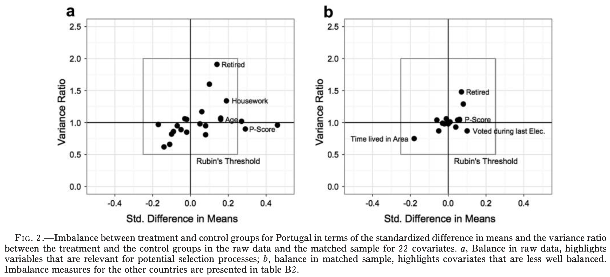
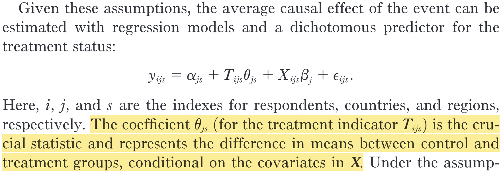
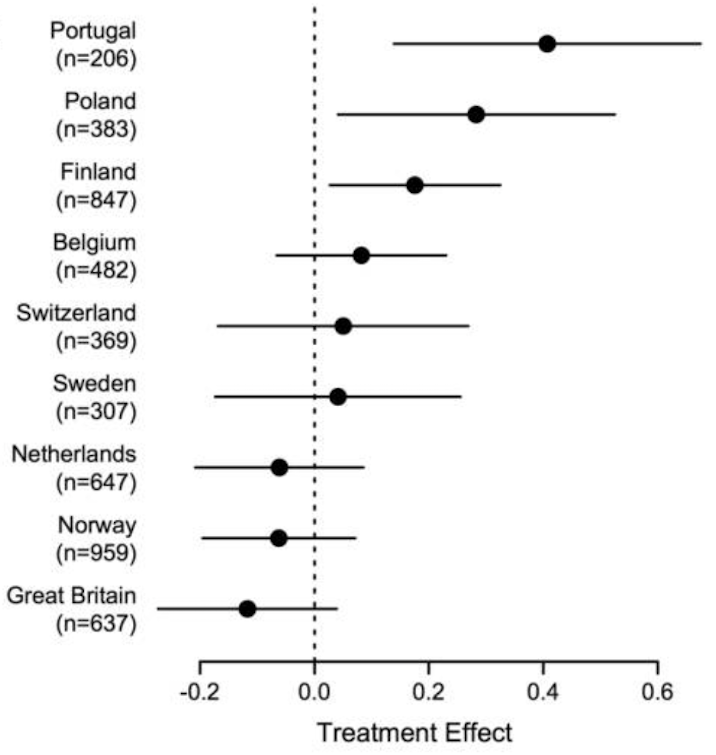

```{r setup, include = FALSE}
library(RefManageR)
library(knitr)
library(ggrepel) # Nicely placed labels in figures.
library(modelr)
library(webexercises) # Small web-based answer scales.
library(equatiomatic) # Regression equations from model objects.
library(essentials)

options(htmltools.preserve.raw = FALSE, tikzDefaultEngine = "xetex",
        htmltools.dir.version = FALSE, servr.interval = 0.5, width = 115, digits = 3)
knitr::opts_chunk$set(
  collapse = TRUE, message = FALSE, fig.retina = 3, error = TRUE,
  warning = FALSE, cache = FALSE, fig.align = 'center',
  comment = "#", strip.white = TRUE, tidy = FALSE)

BibOptions(check.entries = FALSE, 
           bib.style = "authoryear", 
           style = "markdown",
           hyperlink = FALSE,
           no.print.fields = c("doi", "url", "ISSN", "urldate", "language", "note", "isbn", "volume"))
myBib <- ReadBib("./../../../Stats_II.bib", check = FALSE)

xaringanExtra::use_xaringan_extra(c("tile_view", "tachyons"))
xaringanExtra::use_panelset()
```
# The goal of social science research

.font140[.center[.alert[Use data to discover patterns ("social facts" in Durkheim's terms), <br> and **the social mechanisms that bring them about**.]]]

```{r, echo = FALSE, out.width='70%', fig.align='center'}
knitr::include_graphics('https://liu.se/-/media/istock-501261958.jpg?mw=1120&mh=1120&hash=DA8977CCE6A6E600AE80A40CFEE771C9')
```

---
class: inverse middle
# Today's schedule

1. **Application 1**: Terrorist attacks and xenophobia re-visited.

2. **Multiple OLS**

  + Omitted variable bias
  + Frisch-Waugh Theorem
  + Estimation
  
3. **(Natural) RCTs & Multiple OLS** 

4. **Application 2**: Zero-tolerance for domestic violence re-visited.

5. **IV & Multiple OLS**

---
class: inverse middle center
# Research question 1 of the day

.right-column[
```{r, echo = FALSE, out.width='60%'}
knitr::include_graphics('https://api.time.com/wp-content/uploads/2019/07/gettyimages-1064896696.jpg')
knitr::include_graphics('https://www.brookings.edu/wp-content/uploads/2019/07/Denmark.jpg?w=1200&h=630&crop=1')
```
]

.left-column[
.font130[
**What is the** 

**average causal effect**

**of terrorist attacks on xenophobia?**
]]

---
# We need an RCT!

.push-left[
```{r, echo = FALSE, out.width='60%', fig.align='center'}
knitr::include_graphics('./img/randomization2.png')
```

- If we *randomly* divide subjects into treatment and control groups: They come from the same underlying population. 
  <br> <br> $\rightarrow$ Similar .alert[on average], *in every way*,<br> **including their $Y_{0}$ **!
  <br> <br> $\rightarrow E[Y_{0i}|D=1] = E[Y_{0i}|D=0]$!
]

.push-right[
```{tikz, DAG_RCT, echo = FALSE, out.width='70%'}
\usetikzlibrary{shapes,decorations,arrows,calc,arrows.meta,fit,positioning,quotes}
\tikzset{
  -Latex,auto,node distance =1 cm and 1 cm,semithick,
  state/.style ={ellipse, draw, minimum width = 0.7 cm},
  point/.style = {circle, draw, inner sep=0.04cm,fill,node contents={}},
  bidirected/.style={Latex-Latex,dashed},
  el/.style = {inner sep=2pt, align=left, sloped}
}

\begin{tikzpicture}
\sffamily
\node[state] (1) [red] at (0,0) {$I$};
\node[state] (2) [right = of 1] {$D$};
\node[state] (3) [above = of 2] {$C$};
\node[state] (4) [right = of 2] {$Y$};

\path (1) [red] edge ["$|r|=1$"] (2);
\path (2) edge (4);
\path (3) edge [dashed] (4);
\path (3) edge [dashed] (2);
\end{tikzpicture}
```
]

---
layout: true
# My friend Joscha had an idea

.left-column[
<br>

```{r, echo = FALSE, out.width='100%'}
knitr::include_graphics('https://jlegewie.com/files/joscha.jpg')
```

]

---

.right-column[
```{r, echo = FALSE, out.width='100%'}
knitr::include_graphics('./img/Joscha2.png')
```
.center[.backgrnote[*Source:* `r Citet(myBib, "legewie_terrorist_2013")`]]
]

---

.right-column[
```{r, echo = FALSE, out.width='100%'}
knitr::include_graphics('./img/Joscha2.png')
```
.center[.backgrnote[*Source:* `r Citet(myBib, "legewie_terrorist_2013")`]]

.alert[Assumption 1]: The European Social Survey is based on random sampling. .alert[The day of] $i$.alert['s interview is also random!]

- *Reachability bias*: Respondents who are easier to contact tend to be interviewed earlier during the survey period.

.alert[Assumption 2]: No other event had a causal effect on $Y_{i}$.
]

---
layout: false
# Balance?

.left-column[
$$E[Y_{0i}|D=1] = E[Y_{0i}|D=0]?$$

```{tikz, DAG_NatExp, echo = FALSE, out.width='70%'}
\usetikzlibrary{shapes,decorations,arrows,calc,arrows.meta,fit,positioning,quotes}
\tikzset{
  -Latex,auto,node distance =1 cm and 1 cm,semithick,
  state/.style ={ellipse, draw, minimum width = 0.7 cm},
  point/.style = {circle, draw, inner sep=0.04cm,fill,node contents={}},
  bidirected/.style={Latex-Latex,dashed},
  el/.style = {inner sep=2pt, align=left, sloped}
}

\begin{tikzpicture}
\sffamily
\node[state] (1) [red] at (0,0) {$E$};
\node[state] (2) [right = of 1] {$D$};
\node[state] (3) [above = of 2] {$C$};
\node[state] (4) [right = of 2] {$Y$};

\path (1) [red] edge (2);
\path (3) [red] edge [dashed, "?"] (1);
\path (2) edge (4);
\path (3) edge [dashed] (4);
\end{tikzpicture}
```
]

.right-column[
```{r, echo = FALSE, out.width='100%'}

```
.center[.backgrnote[*Source:* `r Citet(myBib, "legewie_terrorist_2013")`]]

> The treatment group is on average slightly younger, and the proportion of people who are retired and who work from home is lower. 

> -- `r Citet(myBib, "legewie_terrorist_2013", after = ", page 1211")`.

]

---
class: clear
# Age as confounder? .font70[(i.e., Age-based selection into treatment?)]

.left-column[
- On average, xenophobia increases with age.

- The older a respondent, the more likely they are part of the control group (i.e., not exposed to Bali attack).

$\rightarrow E[Y_{0i}|D=0] \color{red}{>} E[Y_{0i}|D=1]$ 
]
.right-column[
```{tikz, DAG_Age, echo = FALSE, out.width='80%'}
\usetikzlibrary{shapes,decorations,arrows,calc,arrows.meta,fit,positioning,quotes}
\tikzset{
  -Latex,auto,node distance =1 cm and 1 cm,semithick,
  state/.style ={ellipse, draw, minimum width = 0.7 cm},
  point/.style = {circle, draw, inner sep=0.04cm,fill,node contents={}},
  bidirected/.style={Latex-Latex,dashed},
  el/.style = {inner sep=2pt, align=left, sloped}
}

\begin{tikzpicture}
\sffamily
\node[state, align = center] (1) at (0,0) {Day of \\ interview};
\node[state, align = center] (2) [right = of 1] {Exp. to \\ Bali};
\node[state] (3) [red, above = of 2] {Age};
\node[state] (4) [right = of 2] {Xeno};

\path (1) edge (2);
\path (3) edge [red, "(-)"] (1);
\path (2) edge (4);
\path (3) edge [red, "(+)"] (4);
\end{tikzpicture}
```
]

---
class: inverse middle center
# Multiple OLS Regression

---
# Setup and simulated toy data

.panelset[
.panel[.panel-name[Packages]
```{r libraries}
pacman::p_load(
  tidyverse, # Data manipulation,
  haven, # Read Stata data,
  furniture, # For row-means,
  ggplot2, # beautiful figures,
  estimatr, # Regression for weighted data,
  modelr, # Turn results of lm() into a tibble,
  modelsummary, # for balance tables,
  texreg) # regression tables with nice layout.
```
]
.panel[.panel-name[Simulated: Age]
.push-left[
```{r include = FALSE}
set.seed(831983)
```

```{r}
# Simulate random normally/gauss-distributed age.
toydat <- tibble( 
  age = rnorm(n = 500, mean = 45, sd = 10))
```
]

.push-right[
```{r echo = FALSE, out.width = "80%"}
ggplot(data = toydat) +
  geom_histogram(aes(x = age)) +
  theme_minimal()
```
]]
.panel[.panel-name[Exposure to terror]
.push-left[.font90[
```{r}
toydat <- toydat %>% 
  mutate( # Day of interview: Age + random.
    int_day = (-0.05*age) + rnorm(n = 500, mean = 0, sd = 1),
    # Bali: After mean survey period.
    bali = case_when(
      int_day < mean(int_day) ~ 0,
      int_day >= mean(int_day) ~ 1))

lm_robust(bali ~ age, data = toydat) %>%
  screenreg(include.ci = FALSE, digits = 3)
```
]]
.push-right[
```{r echo = FALSE, out.width = "80%"}
ggplot(data = toydat, aes(y = bali, x = age)) +
  geom_jitter(height = 0.05, alpha = 1/2) +
  scale_y_continuous(breaks = c(0, 1)) +
  geom_smooth(method = "lm") +
  theme_minimal()
```
]
]
.panel[.panel-name[Xenophobia]
.push-left[
```{r}
# Because I simulate these data,
# I define and thus KNOW the truth!! 
# Xenophobia is a linear function of:
# exposure to Bali, and age, and a random part.
toydat <- toydat %>%
  mutate(
    xeno = (0.3 * bali) + (0.05 * age) + #<<
      rnorm(n = 500, mean = 0, sd = 1)) #<<
```
]
.push-right[
```{r echo = FALSE, out.width = "80%"}
ggplot(data = toydat, aes(x = xeno)) +
  geom_histogram() +
  theme_minimal()
```
]]]

---
# What's going one here?

.push-left[
```{r OLS, eval  = FALSE}
# Bivariate OLS
ols_bi <- lm_robust(xeno ~ bali, data = toydat)

# Multiple OLS
ols_mult <- lm_robust(xeno ~ bali + age, data = toydat)

# Regression table of both results
htmlreg(list(ols_bi, ols_mult), 
        include.ci = FALSE, digits = 3,
        custom.model.names = c("Bivariate OLS", 
                               "Multiple OLS"))
```

.content-box-green[
Which one of the two models is correct?
]
]

.push-right[
```{r ref.label = "OLS", echo  = FALSE, results = 'asis'}
```
]

---
class: clear
# Omitted variable bias .font60[aka selection/confounder bias]

.push-right[
```{tikz, ref.label = "DAG_Age", echo = FALSE, out.width='80%'}
```
]


.push-left[
.center[When we compare Xenophobia between those with Bali = 0 to those with Bali = 1:]

1. We .alert[know] that one part of the difference is the causal effect $\beta_{\text{sample}} = 0.3 + \sigma_{\text{sample}} = `r coef(ols_mult)["bali"]`$.

.content-box-green[
- Why do we .alert[know] that in this specific case?

- What else is different between those with Bali = 0 compared to those with <br> Bali = 1?
]]

---
class: clear
# Omitted variable bias .font60[aka selection/confounder bias]

.push-right[
```{tikz, ref.label = "DAG_Age", echo = FALSE, out.width='80%'}
```
.font90[
```{r}
ols_age <- lm_robust(age ~ bali, data = toydat)
screenreg(ols_age, include.ci = FALSE, digits = 3)
```
]]

.push-left[
.center[When we compare Xenophobia between those with Bali = 0 to those with Bali = 1:]

1. We .alert[know] that one part of the difference is the causal effect $\beta_{\text{sample}} = 0.3 + \sigma_{\text{sample}} = `r coef(ols_mult)["bali"]`$.

2. We compare between people who have an average age difference of `r coef(ols_age)["bali"]` years.

.content-box-green[
To how much Xenophobia do `r coef(ols_age)["bali"]` years of age amount?
]
]

---
class: clear
# Omitted variable bias .font60[aka selection/confounder bias]

.push-right[
```{tikz, ref.label = "DAG_Age", echo = FALSE, out.width='80%'}
```
]

.push-left[
.center[When we compare Xenophobia between those with Bali = 0 to those with Bali = 1:]

1. We .alert[know] that one part of the difference is the causal effect $\beta_{\text{sample}} = 0.3 + \sigma_{\text{sample}} = `r coef(ols_mult)["bali"]`$.

2. We compare between people who have an average age difference of `r coef(ols_age)["bali"]` years.
   + Because of this age difference, Xenophobia should additionally differ by:

$\begin{equation}\begin{split} & `r coef(ols_age)["bali"]` \times (0.05+\sigma_{\text{Sample}}) \\ = & `r coef(ols_age)["bali"]` \times `r coef(ols_mult)["age"]`, \\ = & `r coef(ols_age)["bali"] * coef(ols_mult)["age"]`. \end{split}\end{equation}$

.content-box-green[
What is the result if we take 1. and 2. together?
]
]

---
# Omitted variable bias

.push-left[
.content-box-red[
```{tikz, DAG_OMV, echo = FALSE, out.width='40%'}
\usetikzlibrary{shapes,decorations,arrows,calc,arrows.meta,fit,positioning,quotes}
\tikzset{
  -Latex,auto,node distance =1 cm and 1 cm,semithick,
  state/.style ={ellipse, draw, minimum width = 0.7 cm},
  point/.style = {circle, draw, inner sep=0.04cm,fill,node contents={}},
  bidirected/.style={Latex-Latex,dashed},
  el/.style = {inner sep=2pt, align=left, sloped}
}

\begin{tikzpicture}
\sffamily
\node[state, align = center] (1) at (0,0) {$D$};
\node[state] (2) [red, above = of 1] {$C$};
\node[state] (3) [right = of 1] {$Y$};

\path (1) edge (3);
\path (2) edge [red] (1);
\path (2) edge [red] (3);
\end{tikzpicture}
```

$$\tilde{\beta}_{Y \leftarrow D} = \beta_{Y \leftarrow D} + \underbrace{(\beta_{Y \leftarrow C} \times \beta_{C \leftarrow D})}_{\text{Omitted Variable Bias}}$$
]]

--

.push-right[
.font90[
```{r ref.label = "OLS", echo  = FALSE, results = 'asis'}
```
]
$$`r coef(ols_bi)["bali"]` = `r coef(ols_mult)["bali"]` + \underbrace{(`r coef(ols_mult)["age"]` \times `r coef(ols_age)["bali"]`)}_{`r coef(ols_mult)["age"] * coef(ols_age)["bali"]`}$$
]

---
class: inverse middle

.push-left[
```{r, echo = FALSE, out.width='80%'}
knitr::include_graphics('https://st.depositphotos.com/1654249/2526/i/600/depositphotos_25269433-stock-photo-3d-man-with-red-question.jpg
')
```
]

.push-right[
OK great, but how does multiple OLS get the correct $\beta_{Y \leftarrow D}$ that is not biased by omitted $C$?
]

---
layout: true
# Frisch-Waugh Theorem

.left-column[
It partials out/controlls for:
  1. $\beta_{Y \leftarrow C}$
  2. $\beta_{D \leftarrow C}$
  
`r Citet(myBib, "frisch_partial_1933")` proved that the way multiple OLS achieves this is mathematically equivalent to the following three steps:
]

---

---

.right-column[
.center[
**Step 1: Regress $Y$ on $C$, then keep residuals.**
]
.push-left[
.font80[
```{r}
# Regress xeno on age,
(toydat <- lm_robust(xeno ~ age, data = toydat) %>%
   # Get residuals,
   add_residuals(toydat, model = .) %>% 
   # Rename residuals.
   rename(e_xeno = resid)) 
```
]]
.push-right[
```{r residuals, out.width='100%', fig.height = 4, fig.width = 5, results = FALSE, echo = FALSE}
toydat_plot <- lm_robust(xeno ~ age, data = toydat) %>%
  add_predictions(toydat, model = .)

ggplot(data = toydat_plot, mapping = aes(y = xeno, x = age)) +
  geom_linerange(mapping = aes(ymin = pred, ymax = (e_xeno + pred)), 
                 alpha = 2/3, color = "#901A1E") +
  geom_point(alpha = 2/3) +
  geom_smooth(method = "lm", se = FALSE) +
  theme_minimal()
```
]]

---

.right-column[
.center[
**Step 2: Regress $D$ on $C$, then keep residuals.**
]
.push-left[
.font80[
```{r}
# Regress xeno on age,
(toydat <- lm_robust(bali ~ age, data = toydat) %>%
   # Get residuals,
   add_residuals(toydat, model = .) %>%
   # Rename residuals.
   rename(e_bali = resid))
```
]]
.push-right[
```{r residuals2, out.width='100%', fig.height = 4, fig.width = 5, results = FALSE, echo = FALSE}
toydat_plot <- lm_robust(bali ~ age, data = toydat) %>%
  add_predictions(toydat, model = .) %>%
  mutate(
    eh = rnorm(n = 500, mean = 0, sd = 0.025),
    bali = bali + eh,
    e_bali = e_bali + eh
  )

ggplot(data = toydat_plot, mapping = aes(y = bali, x = age)) +
  geom_linerange(mapping = aes(ymin = pred, ymax = (e_bali + pred)), 
                 alpha = 2/3, color = "#901A1E") +
  geom_point(alpha = 2/3) +
  scale_y_continuous(breaks = c(0, 0.25, 0.5, 0.75, 1)) +
  geom_smooth(method = "lm", se = FALSE) +
  theme_minimal()
```
]]

---

.right-column[
.center[
**Step 3: Regress $e_{D}$ on $e_{C}$.**
]
.push-left[
.font80[
```{r}
# Regress xeno on age,
ols_e <- lm_robust(e_xeno ~ e_bali, data = toydat)

screenreg(list(ols_mult, ols_e),
          include.ci = FALSE, digits = 3)
```
]]
.push-right[
```{r residuals3, out.width='100%', fig.height = 4, fig.width = 5, results = FALSE, echo = FALSE}
ggplot(data = toydat, mapping = aes(y = e_xeno, x = e_bali)) +
  geom_point(alpha = 2/3) +
  geom_smooth(method = "lm") +
  theme_minimal()
```
]]

---
layout: false
class: inverse center

# Why multiple OLS

.push-left[.left[
- Allows us to estimate $\beta_{Y \leftarrow D}$, partialling out/controlling for **_observed_** confounding variables.

- **_If all confounders are observed without measurement error_**, multiple OLS can thus identify the average causal effect $\kappa_{Y \leftarrow D}$.

```{r ref.label = "residuals3", out.width='60%', fig.height = 4, fig.width = 5, results = FALSE, echo = FALSE}
```
]]

--

.push-right[.left[
- You can think of multiple OLS as down-weighting typical cases (e.g. young people exposed to Bali) and up-weighting untypical cases (older people exposed to Bali)

- Because of this weighting, multiple OLS increases the random variation in $D$.
]

```{r residuals2, out.width='60%', fig.height = 4, fig.width = 5, results = FALSE, echo = FALSE}
```
]

---
# Estimation: Still OLS

The best (now multidimensional) "line" is defined by an overall intercept $\alpha$ (i.e. $\bar{Y}$ when all predictors are zero) and multiple slope coefficients $\beta_{1} \ldots \beta_{k}$.

$$\begin{align*}
      \min \text{RSS} &= \min \sum_{i=1}^{n} e_{i}^{2} \\
      &= \min \sum_{i=1}^{n} y_{i} - \hat{y_{i}} \\
      &= \min \sum_{i=1}^{n} (y_{i} - (\color{orange}{\alpha} + \color{orange}{\beta_{1}} x_{1i} + \ldots + \color{orange}{\beta_{k}} x_{ki})^{2}
    \end{align*}$$

---
# Back to Bali

```{r, echo = FALSE, out.width='80%'}

```
.center[.backgrnote[*Source:* `r Citet(myBib, "legewie_terrorist_2013", after = ", page 1210")`.]]

---
class: clear
# Learning goal 1 .font60[Terror attacks can increase xenophobia]

.push-left[
```{r include = FALSE}
# Bali terror attack
event_date_begin <- as.Date("2002-09-14")
event_date       <- as.Date("2002-10-13")
event_date_end   <- as.Date("2002-10-20")

# Read the ESS 2002 data and prepare for analysis
ESS <- read_dta("../../../assets/Legewie_ESS_02.dta") %>%
  mutate(
    # Day and time of the survey interview,
    int_year = inwyr,
    int_mon  = inwmm,
    int_day  = inwdd,
    int_date = sprintf("%s-%s-%s", int_year, int_mon, int_day) %>% as.Date(),
    # Treatment indicator,
    treat = case_when(
      int_date > event_date & int_date <= event_date_end ~ "After Bali",
      int_date < event_date & int_date > event_date_begin ~ "Before Bali",
      TRUE ~ as.character(NA)) %>% fct_relevel("Before Bali", "After Bali"),
    # Attitudes towards immigrants
    anti_immi = rowmeans(
      imtcjob, imbleco, imbgeco, imueclt,
      imwbcnt, imwbcrm, imbghct, na.rm = TRUE) %>% scale() %>% as.numeric(),
    # Subtract from max to make larger values more xenophobic.
    anti_immi = max(anti_immi, na.rm = TRUE) - anti_immi,
    # Immigrant origin
    brncntr = as_factor(brncntr),
    mocntr = as_factor(mocntr),
    facntr = as_factor(facntr),
    # Age
    age = int_year - yrbrn,
    # Weights
    pspwght = pweight * dweight) %>%
  # Sample restriction        
  filter(str_detect(cntry, "PT") & # Countries
           # Mainstream members (i.e. immigrant origin)
           brncntr == "yes" & mocntr == "yes" &  facntr == "yes") %>%
  # Keep only a minimum set of variables we need today,
  select(treat, age, anti_immi, cntry, int_date, pspwght) %>%
  drop_na() # Delete cases with missing values.
```

.font90[
```{r olsPT}
# Estimate the treatment effect with OLS
ols_pt_bi <- lm_robust(anti_immi ~ treat, 
                       data = ESS, weights = pspwght)
ols_pt_mult <- lm_robust(anti_immi ~ treat + age, 
                         data = ESS, weights = pspwght)

# Report results in a nicely-formatted table
screenreg(list(ols_pt_bi, ols_pt_mult), 
          include.ci = FALSE, digits = 3)
```
]]

.push-right[
```{r coefplotPT,  out.width='90%', fig.height = 4, fig.width = 6.5, results = FALSE, echo = FALSE}
bind_rows(ols_pt_bi %>% tidy(),
          ols_pt_mult %>% tidy(),
          .id = "model") %>%
  filter(term == "treatAfter Bali") %>%
  mutate(
    model = case_when(
      model == 1 ~ "Bivariate",
      model == 2 ~ "Adjusted for age")) %>%
  ggplot(aes(y = estimate, x = model, ymin = conf.low, ymax = conf.high)) +
  geom_hline(yintercept = 0, color = "orange", lty = "dashed") +
  geom_pointrange() +
  coord_flip() +
  labs(title = "Causal effect of Bali 2002 terror attack among the Portugese",
       x = "", y =  "Standardized difference in xenophobia
    compared to respondents interviewed before the attack") +
  theme_minimal()
```
]

---
layout: false
class: clear
# Learning goal 1 .font60[Terror attacks can increase xenophobia]

.right-column[
```{r, echo = FALSE, out.width='100%'}

```
.center[.backgrnote[*Source:* `r Citet(myBib, "legewie_terrorist_2013")`]]
]

.left-column[
These results are adjusted for several further variables. After the break, it's your turn to repliacte that.
]

---
class: inverse middle center
# Break

<iframe src='https://www.online-timer.net/' width='400' height='385' frameborder='0' scrolling='yes'></iframe>

---
class: middle clear

.left-column[
```{r, echo = FALSE, out.width='100%'}
knitr::include_graphics('https://www.latentview.com/wp-content/uploads/2016/04/LatentView-Turns-Ten-A-decade-of-data-science.jpg')
```

<iframe src='https://www.online-timer.net/' width='400' height='385' frameborder='0' scrolling='yes'></iframe>
]

.right-column[
<br>
<iframe src='exercise1.html' width='1000' height='600' frameborder='0' scrolling='yes'></iframe>
]

---
class: inverse middle center
# Break

<iframe src='https://www.online-timer.net/' width='400' height='385' frameborder='0' scrolling='yes'></iframe>


---
layout: true
# Zero-tolerance for domestic violence?

.push-right[
```{r, echo = FALSE, out.width='80%'}
knitr::include_graphics('https://images.theconversation.com/files/325865/original/file-20200406-6044-hao5gp.jpg?ixlib=rb-1.1.0&q=45&auto=format&w=1200&h=675.0&fit=crop')
knitr::include_graphics('https://minbynyt.dk/wp-content/uploads/2021/01/Politi-Betjent-ligger-anholdt-i-ha%CC%8AndjernFoto-Lars-Aarjpg1-780x470.jpg')
```
]

---

.push-left[
<iframe src='https://www.jstor.org/stable/2095575#metadata_info_tab_contents' width='600' height='550' frameborder='0' scrolling='yes'></iframe>
]

---

.push-left[
> [...] the pains of punishment deter people from repeating the crimes for which they are punished, especially when punishment is certain, swift and severe. 

.center[versus]

> [...] punishment often makes individuals more likely to commit crimes because of altered interactional structures, foreclosed legal opportunities and secondary deviance
> -- .center[.backgrnote[*Source:* `r Citet(myBib, "sherman_specific_1984")`]]

.center[**Does punishment increase repeat domestic abuse?**]
]

---
layout: false
class: middle clear

.left-column[
```{r, echo = FALSE, out.width='100%'}
knitr::include_graphics('https://www.latentview.com/wp-content/uploads/2016/04/LatentView-Turns-Ten-A-decade-of-data-science.jpg')
```

<iframe src='https://www.online-timer.net/' width='400' height='385' frameborder='0' scrolling='yes'></iframe>
]

.right-column[
<br>
<iframe src='exercise2.html' width='1000' height='600' frameborder='0' scrolling='yes'></iframe>
]

---
class: inverse
# Today's general lessons

1. *Natural Experiment*: Sometimes nature or other forces randomly exposure people to treatment or control conditions. Compared to RCTs we have less control that exposure was truly random, but we can often study more interesting - real - events.

2. *Intention to Treat*: Some people do not comply with the experimental group we assign them to. In that case we estimate an average causal intention to treat effect, if we focus on the randomly assigned treatment alone.

3. *Instrument Variables (IV) Estimation*: Instrument variable regression allows us to recover the causal effect of the treatment (not the intention) in such situations.

4. *LATE (Local average treatment effect:* IV only estimates the treatment effect among compliers; we cannot know how people who did not comply to the intended treatment would have been affected by the treatment.

---
# References

.font80[
```{r ref1, results = 'asis', echo = FALSE}
PrintBibliography(myBib)
```
]

