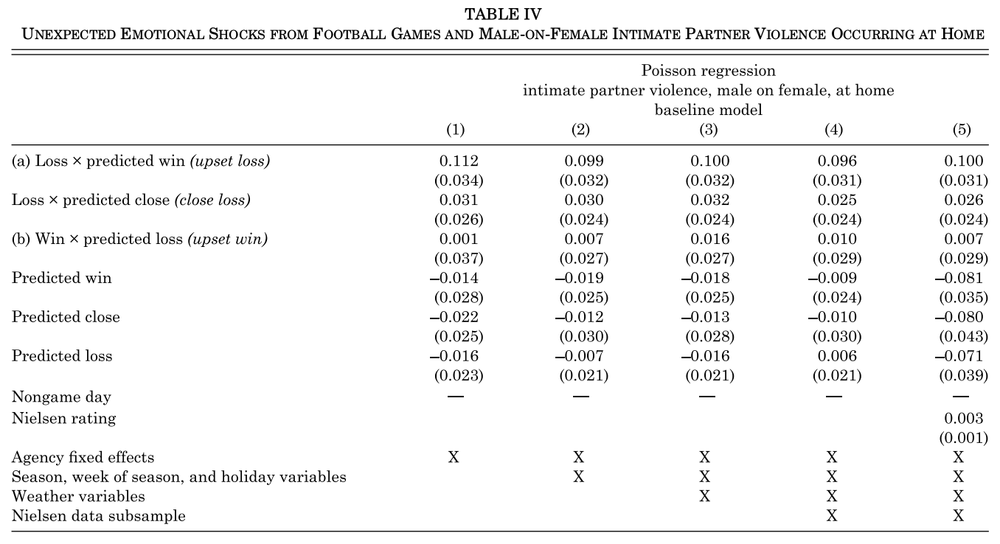
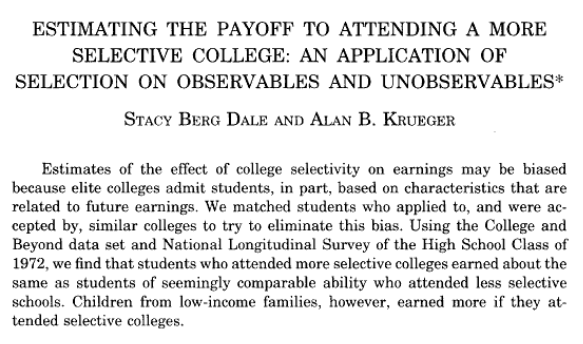
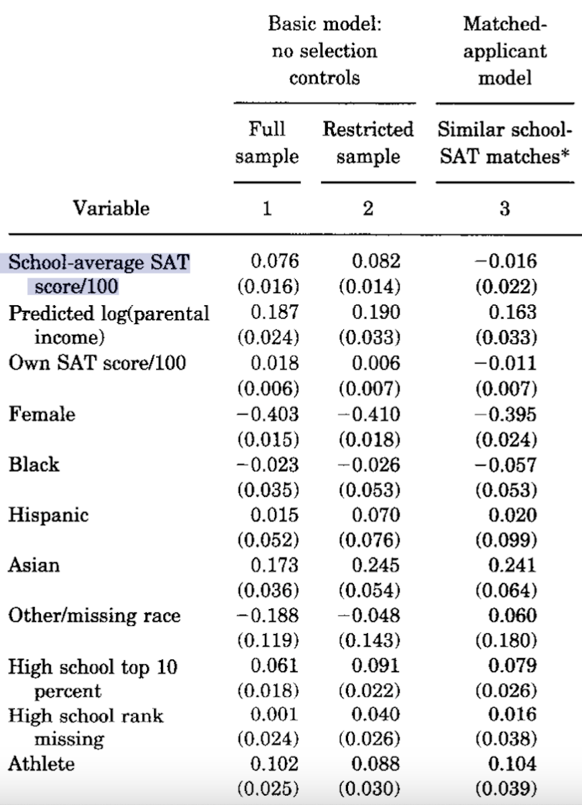

```{r setup, include = FALSE}
library(RefManageR)
library(knitr)
library(ggrepel) # Nicely placed labels in figures.
library(modelr)
library(webexercises) # Small web-based answer scales.
library(equatiomatic) # Regression equations from model objects.
library(essentials)

options(htmltools.preserve.raw = FALSE, tikzDefaultEngine = "xetex",
        htmltools.dir.version = FALSE, servr.interval = 0.5, width = 115, digits = 3)
knitr::opts_chunk$set(
  collapse = TRUE, message = FALSE, fig.retina = 3, error = TRUE,
  warning = FALSE, cache = FALSE, fig.align = 'center',
  comment = "#", strip.white = TRUE, tidy = FALSE)

BibOptions(check.entries = FALSE, 
           bib.style = "authoryear", 
           style = "markdown",
           hyperlink = FALSE,
           no.print.fields = c("doi", "url", "ISSN", "urldate", "language", "note", "isbn", "volume"))
myBib <- ReadBib("./../../../Stats_II.bib", check = FALSE)

xaringanExtra::use_xaringan_extra(c("tile_view", "tachyons"))
xaringanExtra::use_panelset()
```
# Goal of empirical sociology

.font130[.center[Use data to discover patterns, <br> and the .alert[social mechanisms that bring them about.]]]

```{r, echo = FALSE, out.width='50%', fig.align='center'}
knitr::include_graphics('https://blogger.googleusercontent.com/img/b/R29vZ2xl/AVvXsEgykJbXZbwIX-nd1oVOyzmEfj09ho8aQ4HBhfMH27t6YeTYSBevfrD2DFTEQSe7e3UwaVnv-fAJAOVpjW2pSGfG2QNrgHfkTmFtRWK4VXl6KmWK6vVlLud0DRU6lFXAqBF7iij420oOTLFh/s1600/photo.JPG')
```

---
class: inverse middle center
# Today's schedule

```{tikz, Tree1, echo = FALSE, out.width='70%'}
\usetikzlibrary{trees}

\tikzset{
  el/.style = {inner sep=2pt, align=left, sloped},
  level distance=1.5cm,
  level 1/.style={sibling distance=6.5cm},
  level 2/.style={sibling distance=3cm},
  level 3/.style={sibling distance=1.5cm},
  node/.style={align=center,anchor=north}
}

\tikzstyle{bag} = [align=center]

\begin{tikzpicture}
  \node[bag] {Uses of Multiple OLS}
    child {node[bag] {Improved \\ Comparisons}
      child {node[bag] {Control  \\ Confounders}}
      child {node[bag] {Mechanisms \\ Mediation}}
    }
    child {node[bag] {Causal \\ Inference}
      child {node[bag] {Fix broken \\ Interventions}}
      child {node[bag] {Smart \\ summary \\ controls}}
    };
\end{tikzpicture}
```

---
class: inverse middle center

# 1. Confounders versus Mediators

---
class: clear
# Confounders versus Mediators

.push-left[.font90[
.content-box-red[
- **Backdoor path**: Any path from $D$ to $Y$ that starts with an arrow **into** $D$; here $C$ opens a backdoor path and is thus a **confounder**.


- We use multiple OLS to block backdoor paths \ control for confounders.
]
.content-box-blue[
- **Mechanisms/mediators**: Any path from $D$ to $Y$ that starts with an arrow **out of** $D$; here $M$ lies on the causal path $D\rightarrow M \rightarrow Y$ and is thus a **mediator**.


- If we use multiple OLS to block $M$, we do not estimate the overall causal effect of $D$,<br> but only a part of it.
]]]

.push-right[
```{tikz, DAG_ConfMed, echo = FALSE, out.width='80%'}
\usetikzlibrary{shapes,decorations,arrows,calc,arrows.meta,fit,positioning,quotes}
\tikzset{
  -Latex,auto,node distance =1 cm and 1 cm,semithick,
  state/.style ={ellipse, draw, minimum width = 0.7 cm},
  point/.style = {circle, draw, inner sep=0.04cm,fill,node contents={}},
  bidirected/.style={Latex-Latex,dashed},
  el/.style = {inner sep=2pt, align=left, sloped}
}

\begin{tikzpicture}
\sffamily
\node[state, align = center] (1) at (0,0) {$D$};
\node[state] (2) at (-1,1.2) [gray, dashed] {$C$};
\node[state] (3) at (1,-1) {$M$};
\node[state] (4) [right = of 1] {$Y$};

\path (1) edge (4);
\path (1) edge (3);
\path (2) edge [gray, dashed] (1);
\path (2) edge [gray, dashed] (4);
\path (3) edge (4);
\end{tikzpicture}
```
]

---
# Confounders versus Mediators

.content-box-red[
If we want to get closer to the overall causal effect $D \rightarrow Y$, we need to control for observed confounders. *But must not control for any mediators!*
]

.content-box-blue[
But for some research questions, controlling for mediators can make sense. Sometimes we are interested in the partial effect $D \rightarrow Y$ that does not run through $M$.
]

---
# A clear case of mediation

.panelset[
.panel[.panel-name[The ESS]
.font80[
```{r}
pacman::p_load(
  tidyverse,  # Load the tidyverse package for data manipulation
  haven,  # Load the haven package to handle labelled data (like SPSS files)
  ggplot2,  # Load the ggplot2 package for creating beautiful figures
  estimatr,  # Load the estimatr package for regression with weighted data
  essentials,  # Load the essentials package 
  modelsummary)  # Load the modelsummary package for creating nice regression tables

# 1. read the ESS round 9 data
ESS <- read_spss("../../../assets/ESS9e03_1.sav") %>%  # Read the SPSS data file
  filter(cntry == "DK") %>%  # Keep only the data for Denmark
  select(idno, pspwght, gndr, eduyrs, agea,  # Select specific variables
         psppsgva, grspnum, infqbst, wkhct) %>% 
  mutate(psppsgva = zap_labels(psppsgva),  # Remove labels from 'psppsgva' and convert to numeric
         grspnum = zap_labels(grspnum),  # Remove labels from 'grspnum' and convert to numeric
         wkhct = zap_labels(wkhct),  # Remove labels from 'wkhct' and convert to numeric
         grwage = case_when(  # Calculate 'grwage' based on different conditions
           infqbst == 1 ~ 4 * grspnum,  # If 'infqbst' is 1, multiply 'grspnum' by 4
           infqbst == 3 ~ grspnum / 12,  # If 'infqbst' is 3, divide 'grspnum' by 12
           TRUE ~ grspnum),  # Otherwise, keep 'grspnum' as it is
         pspwght = zap_labels(pspwght),  # Remove labels from 'pspwght' and convert to numeric
         eduyrs = case_when(  # Censor 'eduyrs' to be between 9 and 21
           eduyrs > 21 ~ 21,  # If 'eduyrs' is greater than 21, set it to 21
           eduyrs < 9 ~ 9,  # If 'eduyrs' is less than 9, set it to 9
           TRUE ~ as.numeric(eduyrs)),  # Otherwise, keep 'eduyrs' as it is
         gndr = as_factor(gndr)) %>%  # Convert 'gndr' to a factor
  filter(wkhct > 0) %>%  # Filter out cases where 'wkhct' is not greater than 0
  drop_na()  # Remove rows with missing values
```
]]
.panel[.panel-name[OLS]
.push-left[
```{r OLSgender, echo = FALSE}
# Run robust regressions of 'grwage' on 'gndr' with weights
mod1 <- lm_robust(grwage ~ gndr, data = ESS, weights = pspwght) 
mod2 <- lm_robust(grwage ~ gndr + wkhct, data = ESS, weights = pspwght)

modelsummary(list("Wage before tax" = mod1, "Wage before tax" = mod2),  # Regression table with both models
             gof_map = c("nobs", "r.squared"),  # Include nr obs and R-squared
             stars = TRUE,  # Add stars for significance levels
             output = "kableExtra")  # Use kableExtra for output formatting
```
]
.push-right[.font80[
```{r ref.label = "OLSgender", include = FALSE}
```
]

```{tikz, DAG_gender, echo = FALSE, out.width='100%'}
\usetikzlibrary{shapes,decorations,arrows,calc,arrows.meta,fit,positioning,quotes}
\tikzset{
  -Latex,auto,node distance =1 cm and 1 cm,semithick,
  state/.style ={ellipse, draw, minimum width = 0.7 cm},
  point/.style = {circle, draw, inner sep=0.04cm,fill,node contents={}},
  bidirected/.style={Latex-Latex,dashed},
  el/.style = {inner sep=2pt, align=left, sloped}
}

\begin{tikzpicture}
\sffamily
\node[state] (1) at (0,0) {Gender};
\node[state] (2) [double, gray] at (3,-2) {Work hours};
\node[state] (3) at (6,0) {Gross wage};

\path (1) edge [red] (3);
\path (1) edge [gray] (2);
\path (2) edge [gray] (3);
\end{tikzpicture}
```

$$(1 - \frac{`r coef(mod2)["gndrFemale"]`}{`r coef(mod1)["gndrFemale"]`}) \times 100 = `r round((1 - coef(mod2)["gndrFemale"] / coef(mod1)["gndrFemale"]) * 100, 2)`\%$$

]]]

---
# An unclear case

.left-column[
.content-box-green[
Are citizenship rights a confounder or mediator if we are interested in the effect of socialism on poverty?
]]

.right-column[
```{tikz, DAG_ConfMed2, echo = FALSE, out.width='90%'}
\usetikzlibrary{shapes,decorations,arrows,calc,arrows.meta,fit,positioning,quotes}
\tikzset{
  -Latex,auto,node distance =1 cm and 1 cm,semithick,
  state/.style ={ellipse, draw, minimum width = 0.7 cm},
  point/.style = {circle, draw, inner sep=0.04cm,fill,node contents={}},
  bidirected/.style={Latex-Latex,dashed},
  el/.style = {inner sep=2pt, align=left, sloped}
}

\begin{tikzpicture}
\sffamily
\node[state, align = center] (1) at (0,0) {Socialism};
\node[state] (2) [gray] at (3, 2.5) {Citizenship rights};
\node[state, align = center] (3) at (6,0) {Poverty};

\path (1) [red] edge (3);
\path (1) [gray, dashed] edge (2);
\path (2) [gray, dashed] edge (1);
\path (2) [gray, dashed] edge (3);
\end{tikzpicture}
```
]

---
class: inverse
# Revised research question

```{r include = FALSE}
pacman::p_load(
  tidyverse, # Data manipulation,
  ggplot2, # beautiful figures,
  wbstats, # download data from Worldbank. Tremendous source of global socio-economic data.
  estimatr, # OLS with robust SE,
  democracyData, # download democracy data used in the scholarly literature.
  countrycode, # Easy recodings of country names,
  modelsummary, # regression tables with nice layout,
  remotes) # Install beta version packages from GitHub.

# 1. Download Freedom House data for all countries since 1972,
Dat_citi_rights <- download_fh(verbose = FALSE) %>% 
   rename(country = fh_country, # rename country ID,
          citizen_rights = fh_total_reversed, # rename Citizenship rights indicator,
          date = year) %>% # rename year,
   select(country, date, citizen_rights) # Keep only these 3 variables.

# 2. Download poverty data: <US$2.15 per day
Dat_poverty <- wb_data("SI.POV.DDAY", 
                        start_date = 2002, end_date = 2022) %>% #<<
   rename(poverty = SI.POV.DDAY) %>% # rename poverty variable,
   select(country, date, poverty) %>% # Keep only 3 variables
   drop_na(poverty) %>% # Drop cases with missing data,
   group_by(country) %>% # Group by country,
   filter(date == max(date)) %>% # Keep the most recent data per country.
   ungroup()

# 3. Join Freedom House and Worldbank data
Dat <- inner_join(Dat_poverty, Dat_citi_rights, by = c("country", "date"))

# 4. Code socialism index
Dat <- Dat %>% mutate(socialist = case_when( # Years socialist minus years since,
  country == "China" ~ date - 1949,
  country == "Vietnam" ~ date - 1945,
  country == "Algeria" ~ date - 1962,
  str_detect(country,"Portugal|Bangladesh") ~ date - 1972,
  country == "Guinea-Bissau" ~ date - 1973,
  country == "India" ~ date - 1976,
  country == "Nicaragua" ~ date - 1979,
  country == "Sri Lanka" ~ date - 1978,
  country == "Tanzania" ~ date - 1964,
  country == "Albania" ~ (1992 - 1944) - (date - 1992),
  str_detect(country, "Angola|Cabo Verde|Madagascar") ~ (1992 - 1975) - (date - 1992),
  str_detect(country,"Belarus|Bulgaria") ~ (1990 - 1946) - (date - 1990),
  str_detect(country, "Benin|Mozambique") ~ (1990 - 1975) - (date - 1990),
  country == "Chad" ~ (1975 - 1962) - (date - 1975), country == "Congo, Rep." ~ (1992 - 1970) - (date - 1992),
  country == "Czech Republic" ~ (1990 - 1948) - (date - 1990), country == "Djibouti" ~ (1992 - 1981) - (date - 1992),
  country == "Ethiopia" ~ (1991 - 1974) - (date - 1991), country == "Ghana" ~ (1966 - 1960) - (date - 1966),
  country == "Guinea" ~ (1984 - 1958) - (date - 1984), country == "Hungary" ~ (1989 - 1949) - (date - 1989),
  country == "Iraq" ~ (2005 - 1958) - (date - 2005), country == "Mali" ~ (1991 - 1960) - (date - 1991),
  country == "Mauritania" ~ (1978 - 1961) - (date - 1978), country == "Mongolia" ~ (1992 - 1924) - (date - 1992),
  country == "Myanmar" ~ (1988 - 1962) - (date - 1988), country == "Poland" ~ (1989 - 1945) - (date - 1989),
  country == "Romania" ~ (1989 - 1947) - (date - 1989), country == "Russian Federation" ~ (1991 - 1922) - (date - 1991),
  country == "Seychelles" ~ (1991 - 1977) - (date - 1991), country == "Senegal" ~ (1981 - 1960) - (date - 1981),
  country == "Sierra Leone" ~ (1991 - 1978) - (date - 1991), country == "Somalia" ~ (1991 - 1969) - (date - 1991),
  country == "Sudan" ~ (1985 - 1969) - (date - 1985), country == "Syria" ~ (2012 - 1963) - (date - 2012),
  country == "Tunisia" ~ (1988 - 1964) - (date - 1988), country == "Ukraine" ~ (1991 - 1919) - (date - 1991),
  country == "Yemen, Rep." ~ (1991 - 1967) - (date - 1991), country == "Zambia" ~ (1991 - 1973) - (date - 1991),
  str_detect(country,"Slovenia|Croatia|Serbia|Montenegro|Bosnia and Herzegovina|North Macedonia|Kosovo") ~ (1992 - 1943) - (date - 1992),
  TRUE ~ 0),
  socialist = case_when( # Min. 5 years given socialist history,
    (socialist < 5 & socialist > 0) | socialist < 0 ~ 5,
    TRUE ~ socialist)) %>% drop_na() # Drop countries with missing values.
```

.center[.font140[
Would socialist countries be better at reducing poverty<br><br> **if they didn't offer fewer citizenship rights to their citizens?**
]]

<br>
.push-left[
```{r echo = FALSE, out.width='100%', fig.height = 4, fig.width = 7, results = FALSE, echo = FALSE}
ggplot(data = Dat, aes(y = citizen_rights, x = socialist, label = country)) +
  geom_label_repel(data = Dat %>% filter(country == "Denmark"), 
                   show.legend = FALSE, color = "#901A1E",
                   alpha = 0.8, segment.curvature = -0.1,
                   segment.ncp = 4, segment.angle = 10,
                   size = 5, box.padding = 1.5,
                   point.padding = 0.5, force = 100,
                   segment.size  = 1) +
  geom_smooth(method = "lm") +
  geom_text() +
  labs(y = "Freedom House Index of Citizenship Rights", 
       x = "Our Socialism Index") +
  theme_minimal()
```
]

.push-right[
```{r, echo = FALSE, out.width='96%'}
knitr::include_graphics('https://paradoxoftheday.com/wp-content/uploads/2016/05/marx.engels.lenin_.stalin.mao_.webp')
```
]

---
# Multiple OLS

.right-column[.font90[
```{r}
# Bivariate OLS
ols <- lm_robust(poverty ~ socialist, data = Dat)
# Multiple OLS
ols_mult <- lm_robust(poverty ~ socialist + citizen_rights, data = Dat)
# Regression table
modelsummary(list("Poverty (Biv. OLS)" = ols, "Poverty (OLS mult.)" = ols_mult),
             gof_map = c("nobs", "r.squared"), stars = TRUE, output = "kableExtra")
```
]]

.left-column[
.content-box-green[
Multiple OLS cannot provide a definite answer! Only an experiment could.

But how does it get us closer to an answer to our research question?
]

```{tikz, DAG_ConfMed2b, echo = FALSE, out.width='90%'}
\usetikzlibrary{shapes,decorations,arrows,calc,arrows.meta,fit,positioning,quotes}
\tikzset{
  -Latex,auto,node distance =1 cm and 1 cm,semithick,
  state/.style ={ellipse, draw, minimum width = 0.7 cm},
  point/.style = {circle, draw, inner sep=0.04cm,fill,node contents={}},
  bidirected/.style={Latex-Latex,dashed},
  el/.style = {inner sep=2pt, align=left, sloped}
}

\begin{tikzpicture}
\sffamily
\node[state, align = center] (1) at (0,0) {Socialism};
\node[state] (2) at (1, 2) [gray, double] {Citizenhsip rights};
\node[state, align = center] (3) [right = of 1] {Poverty};

\path (1) edge (3);
\path (1) [gray, dashed] edge (2);
\path (2) [gray, dashed] edge (1);
\path (2) [gray, dashed] edge (3);
\end{tikzpicture}
```

]

---
layout: true
# Recap: Frisch-Waugh

.left-column[
OLS controlls for:
  1. $\beta_{C \leftarrow Y}$
  2. $\beta_{C \leftarrow D}$
  
`r Citet(myBib, "frisch_partial_1933")` demonstrated that "controlling" for a confounder is mathematically equivalent to a three-step procedure.

```{tikz, DAG_FrischWaugh, echo = FALSE, out.width='70%'}
\usetikzlibrary{shapes,decorations,arrows,calc,arrows.meta,fit,positioning,quotes}
\tikzset{
  -Latex,auto,node distance =1 cm and 1 cm,semithick,
  state/.style ={ellipse, draw, minimum width = 0.7 cm},
  point/.style = {circle, draw, inner sep=0.04cm,fill,node contents={}},
  bidirected/.style={Latex-Latex,dashed},
  el/.style = {inner sep=2pt, align=left, sloped}
}

\begin{tikzpicture}
\sffamily
\node[state, align = center] (1) at (0,0) {$D$};
\node[state] (2) [gray, double, above = of 1] {$C$};
\node[state] (3) [right = of 1] {$Y$};

\path (1) edge (3);
\path (2) edge [gray, dashed] (1);
\path (1) edge [gray, dashed] (2);
\path (2) edge [gray, dashed] (3);
\end{tikzpicture}
```
]

---

.right-column[
.center[
**Step 1: Regress $Y$ on $C$, then keep residuals.**
]
.push-left[
.font80[
```{r}
# Regress poverty on citizen rights,
(Dat <- lm_robust(poverty ~ citizen_rights, 
                  data = Dat) %>%
   # Get residuals,
   add_residuals(Dat, model = .) %>% 
   # Rename residuals.
   rename(e_poverty = resid)) 
```
]]
.push-right[
```{r residuals, out.width='100%', fig.height = 4, fig.width = 5, results = FALSE, echo = FALSE}
Dat_plot <- lm_robust(poverty ~ citizen_rights, data = Dat) %>%
  add_predictions(Dat, model = .)

ggplot(data = Dat_plot, mapping = aes(y = poverty, x = citizen_rights, label = country)) +
  geom_linerange(mapping = aes(ymin = pred, ymax = (e_poverty + pred)), 
                 alpha = 2/3, color = "#901A1E") +
  geom_text() +
  geom_label_repel(data = Dat %>% filter(country == "Denmark"), 
                   show.legend = FALSE, color = "#901A1E",
                   alpha = 0.8, segment.curvature = -0.1,
                   segment.ncp = 4, segment.angle = 10,
                   size = 5, box.padding = 1.5,
                   point.padding = 0.5, force = 100,
                   segment.size  = 1) +
  geom_smooth(method = "lm", se = FALSE) +
  labs(y = "% population with less than 5.50$ a day", 
       x = "Freedom House Index of Citizenship Rights") +
  theme_minimal()
```
]]

---

.right-column[
.center[
**Step 2: Regress $D$ on $C$, then keep residuals.**
]
.push-left[
.font80[
```{r}
# Regress socialism on citizen rights,
(Dat <- lm_robust(socialist ~ citizen_rights, 
                  data = Dat) %>%
   # Get residuals,
   add_residuals(Dat, model = .) %>% 
   # Rename residuals.
   rename(e_socialist = resid)) 
```
]]
.push-right[
```{r residuals2, out.width='100%', fig.height = 4, fig.width = 5, results = FALSE, echo = FALSE}
Dat_plot <- lm_robust(socialist ~ citizen_rights, data = Dat) %>%
  add_predictions(Dat, model = .)

ggplot(data = Dat_plot, mapping = aes(y = socialist, x = citizen_rights, label = country)) +
  geom_linerange(mapping = aes(ymin = pred, ymax = (e_socialist + pred)), 
                 alpha = 2/3, color = "#901A1E") +
  geom_text() +
  geom_label_repel(data = Dat %>% filter(country == "Denmark"), 
                   show.legend = FALSE, color = "#901A1E",
                   alpha = 0.8, segment.curvature = -0.1,
                   segment.ncp = 4, segment.angle = 10,
                   size = 5, box.padding = 1.5,
                   point.padding = 0.5, force = 100,
                   segment.size  = 1) +
  geom_smooth(method = "lm", se = FALSE) +
  labs(y = "Our Socialism Index", 
       x = "Freedom House Index of Citizenship Rights") +
  theme_minimal()
```
]]

---
layout: false
# Recap: Frisch-Waugh

.left-column[
.center[
**Step 3: Regress $Y_{e}$ on $D_{e}$.**
]
.font80[
```{r FW3, echo = FALSE}
# Regress residuals of poverty on res. of socialism,
ols_e <- lm_robust(e_poverty ~ e_socialist, data = Dat)
# Regression table
modelsummary(list("OLS (mult.)" = ols_mult, "OLS (Res.)" = ols_e), 
             gof_map = c("nobs", "r.squared"), stars = TRUE, output = "kableExtra")
```
]]

.right-column[
```{r ref.label = "FW3", results = FALSE}
```

.push-right[
```{r out.width='100%', fig.height = 4, fig.width = 5, results = FALSE, echo = FALSE}
ggplot(data = Dat, aes(y = poverty, x = socialist, label = country)) +
  geom_label_repel(data = Dat %>% filter(country == "Denmark"), 
                   show.legend = FALSE, color = "#901A1E",
                   alpha = 0.8, segment.curvature = -0.1,
                   segment.ncp = 4, segment.angle = 10,
                   size = 5, box.padding = 1.5,
                   point.padding = 0.5, force = 100,
                   segment.size  = 1) +
  geom_smooth(method = "lm") +
  geom_text() +
  labs(y = "% population with less than 5.50$ a day", 
       x = "Our Socialism Index") +
  theme_minimal()
```
]

.push-left[
```{r residuals3, out.width='100%', fig.height = 4, fig.width = 5, results = FALSE, echo = FALSE}
ggplot(data = Dat_plot, mapping = aes(y = e_poverty, x = e_socialist, label = country)) +
  geom_text() +
  geom_label_repel(data = Dat %>% filter(country == "Denmark"), 
                   show.legend = FALSE, color = "#901A1E",
                   alpha = 0.8, segment.curvature = -0.1,
                   segment.ncp = 4, segment.angle = 10,
                   size = 5, box.padding = 1.5,
                   point.padding = 0.5, force = 100,
                   segment.size  = 1) +
  geom_smooth(method = "lm") +
  labs(y = "Residualized \n % population with less than 5.50$ a day", 
       x = "Residualized \n Socialism Index") +
  theme_minimal()
```
]]

---
class: inverse middle center
# Break

<iframe src='https://www.online-timer.net/' width='400' height='385' frameborder='0' scrolling='yes'></iframe>

---
class: middle clear

.left-column[
```{r, echo = FALSE, out.width='80%'}
knitr::include_graphics('https://www.laserfiche.com/wp-content/uploads/2014/10/femalecoder.jpg')
```

<iframe src='https://www.online-timer.net/' width='400' height='385' frameborder='0' scrolling='yes'></iframe>
]

.right-column[
<br>
<iframe src='exercise1.html' width='1000' height='600' frameborder='0' scrolling='yes'></iframe>
]

---
class: inverse middle center
# Break

<iframe src='https://www.online-timer.net/' width='400' height='385' frameborder='0' scrolling='yes'></iframe>

---
# Visualize model predictions

.panelset[
.panel[.panel-name[The model]
.push-left[.font80[
```{r Coefplot2, fig.show = 'hide'}
plotdata <- ols_mult %>% 
  tidy() %>%  # Turn results into a tibble 
  mutate(  # Rename variables for the plot
    term = case_when(
      term == "socialist" ~ "Socialism index",
      term == "citizen_rights" ~ "Citizenship rights",
      term == "(Intercept)" ~ "Intercept")) %>% 
  filter(term != "Intercept")  # Drop the intercept

ggplot(data = plotdata, 
       # Create the plot, reordering x-axis by estimate
       aes(y = estimate, x = reorder(term, estimate))) + 
  # Add a horizontal line at y=0
  geom_hline(yintercept = 0, color = "red", lty = "dashed") + 
  # Add points with error bars
  geom_pointrange(aes(min = conf.low, max = conf.high)) +  
  coord_flip() +  # Flip the x and y axes
  labs(
    title = "Multiple OLS of extreme poverty",  # Set the plot title
    x = "",  # Remove x-axis label
    # Set y-axis label with Greek beta
    y = expression("Estimate of"~beta)) +  
  theme_minimal()  # Use a minimal theme
```
]]
.push-right[
```{r ref.label = "Coefplot2", out.width='100%', fig.height = 4, fig.width = 6, echo = FALSE}

```
]]
.panel[.panel-name[Predictions]
.push-left[
**Step 1**: Generate fictional data of $x1$ with informative values. .alert[Set controls to informative constant value (e.g. average citizen rights)!]
.font80[
```{r}
(fict_dat <- tibble(
  # Sequence from 0 to 100 for 'socialist' variable
  socialist = 0:100,  
  # Set 'citizen_rights' to the mean value from 'Dat' #<<
  citizen_rights = mean(Dat$citizen_rights))) #<<
```
]]
.push-right[
**Step 2**: Apply estimated model to fictional data. Given fictional data, what $\hat{y}$ does our model predict?
.font80[
```{r}
(fict_dat <- predict( 
  ols_mult, # Predict using the 'ols_mult'
  newdata = fict_dat, # Use 'fict_dat' for prediction
  # Calculate 95% confidence intervals
  interval = "confidence", level = 0.95)$fit %>%  
  as_tibble() %>%  # Convert output to a tibble
  # Combine predictions with original 'fict_dat' 
  bind_cols(fict_dat, .))  
```
]]]
.panel[.panel-name[Visualization]
.push-left[.font80[
```{r Predplot, fig.show = 'hide'}
ggplot(data = fict_dat, aes(y = fit, x = socialist)) +
  geom_vline(xintercept = c(73),  # Add a vertical line at x=73
             color = "red", lty = "dashed") + 
  geom_hline(yintercept = 0,  # Add a horizontal line at y=0
             color = "orange", lty = "dashed") +
  # Add a ribbon for the confidence interval
  geom_ribbon(aes(ymin = lwr, ymax = upr), alpha = 0.5) + 
  geom_line() +  # Add a line for the predicted values
  labs( # Set the plot title, x- & y-axis labels
    title = "Predictions based on multiple OLS of extreme poverty",  
    x = "By years of socialist history\n(At average citizenship rights)", 
    y = "Predicted population in extreme poverty") +
  theme_minimal()  # Use a minimal theme
```
]]
.push-right[
```{r ref.label = "Predplot", out.width='100%', fig.height = 4, fig.width = 6, echo = FALSE}
```
]]]

---
class: inverse middle center

# 2. Smart summary controls

> Control for a wide range of factors seems daunting: the possibilities are virtually infinite, and many characterisitcs are hard to quantify.

> -- `r Citet(myBib, "angrist_mastering_2014", after  = ", page 51")`

---
layout: true
# Football and domestic violence

.left-column[
```{tikz, DAG_Card,  echo = FALSE, out.width='100%'}
\usetikzlibrary{shapes,decorations,arrows,calc,arrows.meta,fit,positioning}
\tikzset{
    -Latex,auto,node distance =1 cm and 1 cm,semithick,
    state/.style ={ellipse, draw, minimum width = 0.7 cm},
    point/.style = {circle, draw, inner sep=0.04cm,fill,node contents={}},
    bidirected/.style={Latex-Latex,dashed},
    el/.style = {inner sep=2pt, align=left, sloped}
}

\begin{tikzpicture}
\sffamily
    \node[state, align = center] (1) at (0,0) [dashed, gray] {Poor \\ team};
    \node[state] (2) at (2,0) [dashed, gray] {$C?$};
    \node[state, align = center] (3) [double, gray, below = of 1] {Sports \\ bet};
    \node[state, align = center] (4) [below = of 3] {Lost \\ game};
    \node[state, align = center] (5) at (5,-4.65) {Domestic \\ violence};

    \path (1) edge [dashed, gray] (3);
    \path (2) edge  [dashed, gray] (3);
    \path (3) edge [gray] (4);
    \path (4) edge [gray] (5);
    \path (1) edge [dashed, gray] (5);
    \path (2) edge [dashed, gray] (5);
\end{tikzpicture}
```


```{r, echo = FALSE, out.width='100%', fig.align='center'}
knitr::include_graphics('https://wpr-public.s3.amazonaws.com/wprorg/styles/facebook/s3/field/image/ap20296067506098.jpg?itok=hZu82HBq')
```
]

---

.right-column[.content-box-green[
1. What counfounders could bias the effect of a lost football game on domestic violence?

2. Does controlling for Sports Bet block the backdoor path through those confounders?
]]

---

.right-column[
```{r, echo = FALSE, out.width='100%', fig.align='center'}

```
.backgrnote[.center[*Source:* `r Citet(myBib, "card_family_2011")`]]
]

---
layout: true
# Do selective universities pay off?

---

.push-left[
```{tikz, DaleKrueger, echo = FALSE, out.width = '100%'}
\usetikzlibrary{shapes,decorations,arrows,calc,arrows.meta,fit,positioning,quotes}
\tikzset{
  -Latex,auto,node distance =1 cm and 1 cm,semithick,
  state/.style ={ellipse, draw, minimum width = 0.7 cm},
  point/.style = {circle, draw, inner sep=0.04cm,fill,node contents={}},
  bidirected/.style={Latex-Latex,dashed},
  el/.style = {inner sep=2pt, align=left, sloped}
}

\begin{tikzpicture}
\sffamily
\node[state, align = center] (1) at (0,0) {Selective \\ Uni};
\node[state] (2) [dashed, above = of 1] {Parental \$};
\node[state] (3) [dashed, right = of 2] {IQ};
\node[state] (4) [dashed, red, left = of 2] {... C?};
\node[state] (5) at (5,0) {\$};


\path (1) edge ["?"](5);
\path (2) edge [dashed] (1);
\path (3) edge [dashed] (1);
\path (4) edge [dashed, red] (1);
\path (2) edge [dashed] (5);
\path (3) edge [dashed] (5);
\path (4) edge [dashed, red] (5);
\end{tikzpicture}
```

.content-box-green[
What else could be $C?$ That is, which other confounders would we need to consider, if we wanted to answer this research question.
]]


.push-right[
```{r, echo = FALSE, out.width='60%'}

```
]

---

.push-left[
```{tikz, DaleKrueger2, echo = FALSE, out.width = '100%'}
\usetikzlibrary{shapes,decorations,arrows,calc,arrows.meta,fit,positioning,quotes}
\tikzset{
  -Latex,auto,node distance =1 cm and 1 cm,semithick,
  state/.style ={ellipse, draw, minimum width = 0.7 cm},
  point/.style = {circle, draw, inner sep=0.04cm,fill,node contents={}},
  bidirected/.style={Latex-Latex,dashed},
  el/.style = {inner sep=2pt, align=left, sloped}
}

\begin{tikzpicture}
\sffamily
\node[state, align = center] (1) at (0,0) {Selective \\ Uni};

\node[state, align = center] (2) at (0,2) [gray, double] {Matched \\ Students};

\node[state, align = center] (3) at (2,4) [gray] {Unis \\ applied to};
\node[state, align = center] (4) at (-2,4) [gray] {Unis \\ admitted to};

\node[state] (5) at (0,6) [gray, dashed] {Parental \$};
\node[state] (6) [gray, dashed, right = of 5] {IQ};
\node[state] (7) [gray, dashed, red, left = of 5] {... C?};
\node[state] (8) at (5,0) {\$};

\path (1) edge ["?"](8);
\path (2) edge [gray, dashed] (1);
\path (3) edge [gray, dashed] (2);
\path (4) edge [gray, dashed] (2);
\path (5) edge [dashed] (3);
\path (5) edge [dashed] (4);
\path (5) edge [dashed, out=30,in=90, looseness=1.2] (8);
\path (6) edge [dashed] (3);
\path (6) edge [dashed] (4);
\path (6) edge [dashed] (8);
\path (7) edge [gray, dashed] (3);
\path (7) edge [gray, dashed] (4);
\path (7) edge [gray, dashed, out=30,in=70, looseness=1.4] (8);
\end{tikzpicture}
```
]

.push-right[
```{r, echo = FALSE, out.width='100%', fig.align='center'}

```
.center[.backgrnote[*Source:* `r Citet(myBib, "dale_estimating_2002")`]]
]

---

.left-column[
```{tikz, ref.label = "DaleKrueger2", echo = FALSE, out.width = '100%'}

```
]

.right-column[
```{r, echo = FALSE, out.width='100%'}
knitr::include_graphics('./img/DaleKrueger2.png')
```
.center[.backgrnote[*Source:* `r Citet(myBib, "dale_estimating_2002")`]]
]

---

.push-left[
```{tikz, DaleKrueger3, echo = FALSE, out.width = '100%'}
\usetikzlibrary{shapes,decorations,arrows,calc,arrows.meta,fit,positioning,quotes}
\tikzset{
  -Latex,auto,node distance =1 cm and 1 cm,semithick,
  state/.style ={ellipse, draw, minimum width = 0.7 cm},
  point/.style = {circle, draw, inner sep=0.04cm,fill,node contents={}},
  bidirected/.style={Latex-Latex,dashed},
  el/.style = {inner sep=2pt, align=left, sloped}
}

\begin{tikzpicture}
\sffamily
\node[state, align = center] (1) at (0,0) {Selective \\ Uni};

\node[state, align = center] (2) at (0,2) [gray, double] {Matched \\ Students};

\node[state, align = center] (3) at (2,4) [gray] {Unis \\ applied to};
\node[state, align = center] (4) at (-2,4) [gray] {Unis \\ admitted to};

\node[state] (5) at (0,6) [gray, dashed] {Parental \$};
\node[state] (6) [gray, dashed, right = of 5] {IQ};
\node[state] (7) [gray, dashed, red, left = of 5] {... C?};
\node[state] (8) at (5,0) {\$};

\path (1) edge ["?"](8);
\path (2) edge [gray, dashed] (1);
\path (3) edge [gray, dashed] (2);
\path (4) edge [gray, dashed] (2);
\path (5) edge [dashed] (3);
\path (5) edge [dashed] (4);
\path (5) edge [dashed, out=30,in=90, looseness=1.2] (8);
\path (6) edge [dashed] (3);
\path (6) edge [dashed] (4);
\path (6) edge [dashed] (8);
\path (7) edge [gray, dashed] (3);
\path (7) edge [gray, dashed] (4);
\path (7) edge [red, dashed, out=30,in=70, looseness=1.4] (8);
\path (7) edge [red, dashed, out=180,in=180, looseness=0.5] (1);
\end{tikzpicture}
```
]

.push-right[
.center[.alert[Assumption]]
```{r, echo = FALSE, out.width='100%'}
knitr::include_graphics('./img/DaleKrueger3.png')
```
.center[.backgrnote[*Source:* `r Citet(myBib, "dale_estimating_2002")`]]
]
---
layout: false
class: clear

.push-left[
## Do selective universities 

## pay off?
```{tikz, ref.label = "DaleKrueger3", echo = FALSE, out.width = '100%'}

```
]

.push-right[
```{r, echo = FALSE, out.width='80%'}

```
.center[.backgrnote[*Source:* `r Citet(myBib, "dale_estimating_2002")`]]
]

---
class: inverse middle center

# If there is no Harvard premium in the US, <br> there is probably no KU premium in Denmark.

$\rightarrow$ **A degree from KU only pays off, because you're smart and put in the work ...**

```{r, echo = FALSE, out.width='10%'}
knitr::include_graphics('https://cdn.pixabay.com/photo/2014/03/24/17/18/smiley-295353__340.png')
```

---
class: inverse middle center
# Break

<iframe src='https://www.online-timer.net/' width='400' height='385' frameborder='0' scrolling='yes'></iframe>

---
class: middle clear

.left-column[
```{r, echo = FALSE, out.width='80%'}
knitr::include_graphics('https://www.laserfiche.com/wp-content/uploads/2014/10/femalecoder.jpg')
```

<iframe src='https://www.online-timer.net/' width='400' height='385' frameborder='0' scrolling='yes'></iframe>
]

.right-column[
<br>
<iframe src='exercise2.html' width='1000' height='600' frameborder='0' scrolling='yes'></iframe>
]

---
class: inverse
# Today's general lessons 1

Multiple ordinary least squares (OLS) is a statistical technique that can be used for a variety of purposes, including:

1. Improving balance for natural experimental designs: Multiple OLS can be used to create more balanced treatment and control groups in natural experimental designs, such as when researchers are comparing the outcomes of students who attend different schools.

2. Improving comparisons by adjusting for confounders: Multiple OLS can be used to adjust for confounders, which are variables that can influence both the treatment and the outcome of interest. This can help to improve the accuracy and fairness of comparisons between treatment and control groups.

3. Improving comparisons by ruling out mechanisms \ mediators: Multiple OLS can be used to rule out alternative explanations for the observed relationship between the treatment and the outcome of interest.

---
class: inverse
# Today's general lessons 2

- **Confounder**: A variable that lies on a backdoor path from treatment to outcome (i.e., a path that starts with an arrow into the treatment). A confounder is a variable that is related to both the treatment and the outcome of interest, but is not caused by either one. For example, in a study of the effects of a new drug on blood pressure, age could be a confounder. Age is related to both blood pressure and the likelihood of being prescribed the new drug, but it is not caused by either one.

- **Mediator/mechanism**: A variable that is part of the causal channel via which the treatment affects the outcome of interest. A mediator/mechanism is a variable that explains how the treatment affects the outcome of interest. For example, in the study of the new drug and blood pressure, a possible mediator/mechanism is the drug's effect on cholesterol levels. The drug may lower blood pressure by lowering cholesterol levels, so cholesterol levels are a mediator/mechanism of the drug's effect on blood pressure.

---
# References

.font80[
```{r ref1, results = 'asis', echo = FALSE}
PrintBibliography(myBib)
```
]