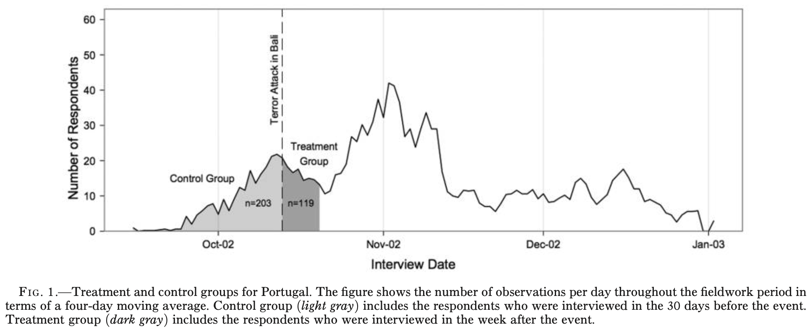
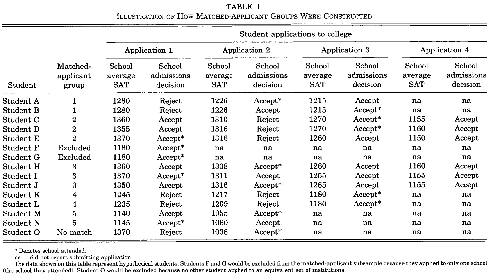
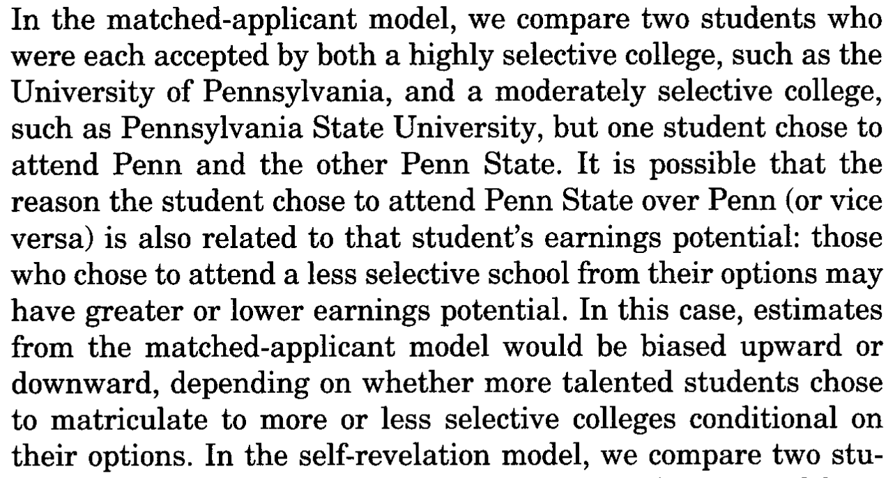
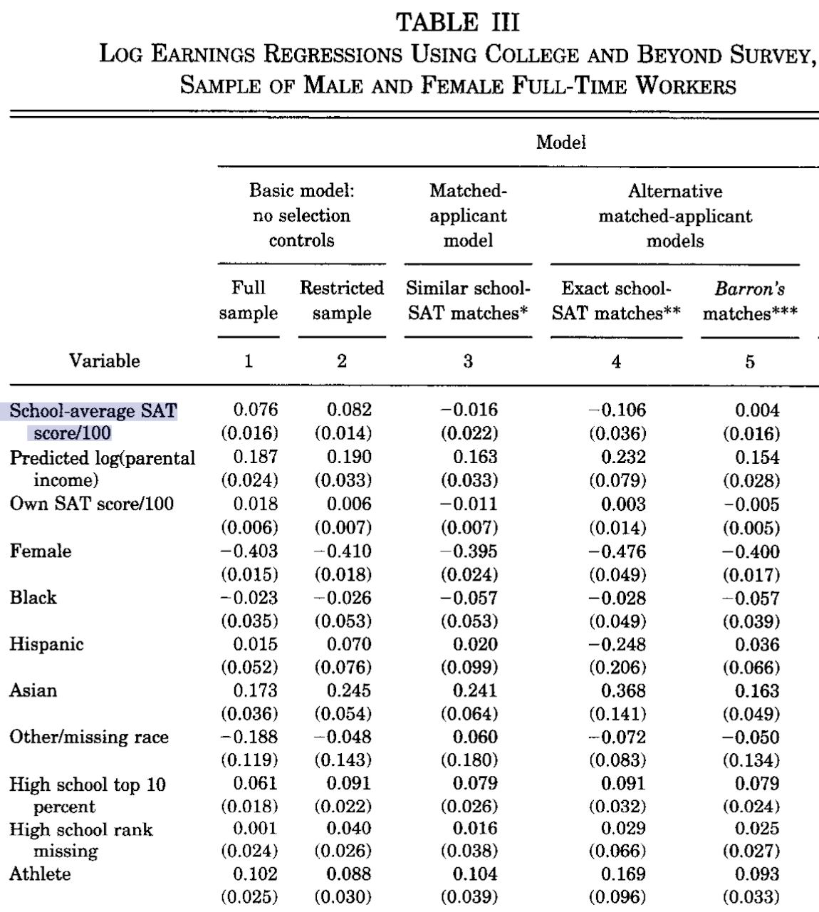

```{r setup, include = FALSE}
library(RefManageR)
library(knitr)
library(ggrepel) # Nicely placed labels in figures.
library(modelr)
library(webexercises) # Small web-based answer scales.
library(equatiomatic) # Regression equations from model objects.
library(essentials)

options(htmltools.preserve.raw = FALSE, tikzDefaultEngine = "xetex",
        htmltools.dir.version = FALSE, servr.interval = 0.5, width = 115, digits = 3)
knitr::opts_chunk$set(
  collapse = TRUE, message = FALSE, fig.retina = 3, error = TRUE,
  warning = FALSE, cache = FALSE, fig.align = 'center',
  comment = "#", strip.white = TRUE, tidy = FALSE)

BibOptions(check.entries = FALSE, 
           bib.style = "authoryear", 
           style = "markdown",
           hyperlink = FALSE,
           no.print.fields = c("doi", "url", "ISSN", "urldate", "language", "note", "isbn", "volume"))
myBib <- ReadBib("./../../../Stats_II.bib", check = FALSE)

xaringanExtra::use_xaringan_extra(c("tile_view", "tachyons"))
xaringanExtra::use_panelset()
```
# The goal of social science research

.font140[.center[.alert[Use data to discover patterns ("social facts" in Durkheim's terms), <br> and **the social mechanisms that bring them about**.]]]

```{r, echo = FALSE, out.width='70%', fig.align='center'}
knitr::include_graphics('https://liu.se/-/media/istock-501261958.jpg?mw=1120&mh=1120&hash=DA8977CCE6A6E600AE80A40CFEE771C9')
```

---
class: inverse middle center
# Today's schedule


```{tikz, Tree1, echo = FALSE, out.width='70%'}
\usetikzlibrary{trees}

\tikzset{
  el/.style = {inner sep=2pt, align=left, sloped},
  level distance=1.5cm,
  level 1/.style={sibling distance=6.5cm},
  level 2/.style={sibling distance=3cm},
  level 3/.style={sibling distance=1.5cm},
  node/.style={align=center,anchor=north}
}

\tikzstyle{bag} = [align=center]

\begin{tikzpicture}
  \node[bag] {Uses of Multiple OLS}
    child {node[bag] {Causal \\ Inference}
      child {node[bag] {Fix broken \\ Interventions}}
      child {node[bag] {Smart \\ summary \\ controls}}
    }
    child {node[bag] {Improved \\ Comparisons}
      child {node[bag] {Control  \\ Confounders}}
      child {node[bag] {Rule out \\ Alternatives}}
    };
\end{tikzpicture}
```

---
layout: false
class: inverse middle center

# 1. Fix broken Interventions

---
# My friend Joscha had an idea

.left-column[
<br>

```{r, echo = FALSE, out.width='100%'}
knitr::include_graphics('https://jlegewie.com/files/joscha.jpg')
```

]

.right-column[
```{r, echo = FALSE, out.width='100%'}

```
.center[.backgrnote[*Source:* `r Citet(myBib, "legewie_terrorist_2013")`]]

.alert[Assumption 1]: The European Social Survey is based on random sampling. .alert[The day of] $i$.alert['s interview is also random!]

- *Reachability bias*: Respondents who are easier to contact tend to be interviewed earlier during the survey period.

.alert[Assumption 2]: No other event had a causal effect on $Y_{i}$.
]

---
class: clear
# Age as confounder? .font70[(i.e., Age-based selection into treatment?)]

.left-column[
- On average, xenophobia increases with age.

- The older a respondent, the more likely they are part of the control group (i.e., not exposed to Bali attack).

$\rightarrow E[Y_{0i}|D=0] \color{red}{>} E[Y_{0i}|D=1]$ 

.backgrnote[
- Note that in Portugal, older respondents were more likely to be in the treatment group.
$\rightarrow E[Y_{0i}|D=0] \color{red}{<} E[Y_{0i}|D=1]$ 
]]

.right-column[
```{tikz, DAG_Age, echo = FALSE, out.width='80%'}
\usetikzlibrary{shapes,decorations,arrows,calc,arrows.meta,fit,positioning,quotes}
\tikzset{
  -Latex,auto,node distance =1 cm and 1 cm,semithick,
  state/.style ={ellipse, draw, minimum width = 0.7 cm},
  point/.style = {circle, draw, inner sep=0.04cm,fill,node contents={}},
  bidirected/.style={Latex-Latex,dashed},
  el/.style = {inner sep=2pt, align=left, sloped}
}

\begin{tikzpicture}
\sffamily
\node[state, align = center] (1) [red] at (0,0) {Day of \\ interview};
\node[state, align = center] (2) [right = of 1] {Exp. to \\ Bali};
\node[state] (3) [red, dashed, above = of 2] {Age};
\node[state] (4) [right = of 2] {Xeno};

\path (1) edge [red] (2);
\path (3) edge [red, dashed] (1);
\path (2) edge (4);
\path (3) edge [red, dashed] (4);
\end{tikzpicture}
```
]

---
# Omitted variable bias

.content-box-red[
```{tikz, DAG_OMV, echo = FALSE, out.width='25%'}
\usetikzlibrary{shapes,decorations,arrows,calc,arrows.meta,fit,positioning,quotes}
\tikzset{
  -Latex,auto,node distance =1 cm and 1 cm,semithick,
  state/.style ={ellipse, draw, minimum width = 0.7 cm},
  point/.style = {circle, draw, inner sep=0.04cm,fill,node contents={}},
  bidirected/.style={Latex-Latex,dashed},
  el/.style = {inner sep=2pt, align=left, sloped}
}

\begin{tikzpicture}
\sffamily
\node[state, align = center] (1) at (0,0) {$D$};
\node[state] (2) [red, dashed, above = of 1] {$C$};
\node[state] (3) [right = of 1] {$Y$};

\path (1) edge (3);
\path (2) edge [red, dashed] (1);
\path (2) edge [red, dashed] (3);
\end{tikzpicture}
```

$$\tilde{\beta}_{Y \leftarrow D} = \beta_{Y \leftarrow D} + \underbrace{(\beta_{Y \leftarrow C} \times \beta_{C \leftarrow D})}_{\text{Omitted Variable Bias}}$$
]

---
# Back to Bali .font70[The Portuguese subsample]

```{r include = FALSE}
pacman::p_load(
  tidyverse, # Data manipulation,
  haven, # Read Stata data,
  furniture, # For row-means,
  ggplot2, # beautiful figures,
  estimatr, # Regression for weighted data,
  modelr, # Turn results of lm() into a tibble,
  modelsummary, # for balance tables,
  texreg) # regression tables with nice layout.

# Bali terror attack
event_date_begin <- as.Date("2002-09-14")
event_date       <- as.Date("2002-10-13")
event_date_end   <- as.Date("2002-10-20")

# Read the ESS 2002 data and prepare for analysis
ESS <- read_dta("../../../assets/Legewie_ESS_02.dta") %>%
  mutate(
    # Day and time of the survey interview,
    int_year = inwyr,
    int_mon  = inwmm,
    int_day  = inwdd,
    int_date = sprintf("%s-%s-%s", int_year, int_mon, int_day) %>% as.Date(),
    # Treatment indicator,
    treat = case_when(
      int_date > event_date & int_date <= event_date_end ~ "After Bali",
      int_date < event_date & int_date > event_date_begin ~ "Before Bali",
      TRUE ~ as.character(NA)) %>% fct_relevel("Before Bali", "After Bali"),
    # Attitudes towards immigrants
    anti_immi = rowmeans(
      imtcjob, imbleco, imbgeco, imueclt,
      imwbcnt, imwbcrm, imbghct, na.rm = TRUE) %>% scale() %>% as.numeric(),
    # Subtract from max to make larger values more xenophobic.
    anti_immi = max(anti_immi, na.rm = TRUE) - anti_immi,
    # Immigrant origin
    brncntr = as_factor(brncntr),
    mocntr = as_factor(mocntr),
    facntr = as_factor(facntr),
    # Age
    age = int_year - yrbrn,
    # Weights
    pspwght = pweight * dweight) %>%
  # Sample restriction        
  filter(# Mainstream members (i.e. immigrant origin)
    brncntr == "yes" & mocntr == "yes" &  facntr == "yes") %>%
  # Keep only a minimum set of variables we need today,
  select(treat, age, anti_immi, cntry, int_date, pspwght) %>%
  drop_na() # Delete cases with missing values.
```

.panelset[
.panel[.panel-name[Balance table]
.left-column[
.content-box-green[
- What do we learn from this balance table?

- What does it suggest about the direction of the omitted age bias among Portuguese? (Assuming that xenophobia also increases with age in Portugal?)
]]
.right-panel[
```{r balance1, echo = FALSE, results = 'asis'}
ESS %>%
  # Focus on Portuguese respondents
  filter(cntry == "PT") %>%
  # Select variables for which I want my balance test,
  select(age, anti_immi, treat, pspwght) %>%
  rename(weights = pspwght) %>% # Rename the weights variable! #<<
  datasummary_balance( # Make a balance table, #<<
    formula = ~ treat, # by exposure to Bali #<< 
    data = . , #<<
    title = "Xeno and age by those who were (not) exposed to Bali") #<<
```
]]

.panel[.panel-name[R code]
```{r balance1, eval = FALSE}
```
]]

---
class: clear
# Controlling for *observed* confounders

.left-column[
- Alternative names for "controlling for $X$": 
  + Partialling out $X$,
  + Adjusted for $X$,
  + Conditional on $X$.
]

.right-column[
```{r, echo = FALSE, out.width='100%'}
knitr::include_graphics('./img/Joscha5.png')
```
.center[.backgrnote[*Source:* `r Citet(myBib, "legewie_terrorist_2013", after = ", page 1210")`.]]
]

---
class: clear
# Adjusting for age-based selection into treatment

.push-left[
.font90[
```{r olsPT}
# Estimate the treatment effect with OLS
ols_pt_bi <- lm_robust(anti_immi ~ treat, 
                       data = ESS %>% filter(cntry == "PT"), 
                       weights = pspwght)
ols_pt_mult <- lm_robust(anti_immi ~ treat + age, 
                         data = ESS %>% filter(cntry == "PT"), 
                         weights = pspwght)

# Report results in a nicely-formatted table
screenreg(list(ols_pt_bi, ols_pt_mult), 
          include.ci = FALSE, digits = 3)
```
]]

.push-right[
.panelset[
.panel[.panel-name[Coefficient plot]
```{r coefplotPT,  out.width='90%', fig.height = 4, fig.width = 6.5, results = FALSE, echo = FALSE}
bind_rows(ols_pt_bi %>% tidy(),
          ols_pt_mult %>% tidy(),
          .id = "model") %>%
  filter(term == "treatAfter Bali") %>%
  mutate(model = case_when(
    model == 1 ~ "Bivariate",
    model == 2 ~ "Adjusted for age")) %>%
  ggplot(aes(y = estimate, x = model, 
             ymin = conf.low, ymax = conf.high)) +
  geom_hline(yintercept = 0, 
             color = "orange", lty = "dashed") +
  geom_pointrange() +
  coord_flip() +
  labs(
    title = "Causal effect of Bali 2002 terror attack among the Portugese",
    y = "Standardized difference in xenophobia
    compared to respondents interviewed before the attack",
    x = "") +
  theme_minimal()
```

```{r include = FALSE}
ols_bias <- lm_robust(age ~ treat, data = ESS %>% filter(cntry == "PT"), weights = pspwght)
```

$$\tilde{\beta}_{y \leftarrow D} = \underbrace{`r coef(ols_pt_mult)["treatAfter Bali"]`}_{\beta_{y \leftarrow D}} + \underbrace{(`r round(coef(ols_bias)["treatAfter Bali"], digits = 1)` \times `r coef(ols_pt_mult)["age"]`)}_{\text{OVB}} = `r coef(ols_pt_mult)["treatAfter Bali"] + ( coef(ols_bias)["treatAfter Bali"] * coef(ols_pt_mult)["age"] )`$$
]
.panel[.panel-name[R code]
```{r ref.label = "coefplotPT", eval = FALSE}
```
]]]

---
class: clear
# Can multiple OLS fix broken interventions?

.push-left[.content-box-green[

```{tikz, ref.label = "DAG_FrischWaugh", echo = FALSE, out.width = '40%'}

```

- OLS can statistically balance **_observed_** confounders, even after the data has been finally collected.
]]

.push-right[.content-box-red[

```{tikz, DAG_FrischWaugh2, echo = FALSE, out.width = '40%'}
\usetikzlibrary{shapes,decorations,arrows,calc,arrows.meta,fit,positioning,quotes}
\tikzset{
  -Latex,auto,node distance =1 cm and 1 cm,semithick,
  state/.style ={ellipse, draw, minimum width = 0.7 cm},
  point/.style = {circle, draw, inner sep=0.04cm,fill,node contents={}},
  bidirected/.style={Latex-Latex,dashed},
  el/.style = {inner sep=2pt, align=left, sloped}
}

\begin{tikzpicture}
\sffamily
\node[state, align = center] (1) at (0,0) {$D$};
\node[state] (2) [gray, double, above = of 1] {$C_{1}$};
\node[state] (3) [right = of 1] {$Y$};
\node[state] (4) [dashed, above = of 3] {$C_{2}$};

\path (1) edge (3);
\path (2) edge [gray, dashed] (1);
\path (2) edge [gray, dashed] (3);
\path (4) edge [dashed] (1);
\path (4) edge [dashed] (3);
\end{tikzpicture}
```

- If **_observed_** confounders are imbalanced, *maybe more is broken that we have not observed?*
]]

---
class: inverse middle center
# 2. Ruling out alternatives

---
class: inverse
# Revisit our research question from Lecture 2

.center[.font140[
**Is there a freedom-equality trade-off?**
]
.font110[
In other words:<br>
**Are socialist countries good at reducing poverty**,<br> at the cost of offering less freedom?
]]

<br>
.push-left[
```{r, echo = FALSE, out.width='90%'}
knitr::include_graphics('https://miro.medium.com/max/1280/1*8Y_EPw2a67TRRos3b24YlA.jpeg')
```
]

.push-right[
```{r, echo = FALSE, out.width='96%'}
knitr::include_graphics('https://almayasabdam.com/wp-content/uploads/2020/09/1496441134_communists.png')
```
]

---
# Poverty and socialism

```{r include = FALSE}
pacman::p_load(
  tidyverse, # Data manipulation,
  ggplot2, # beautiful figures,
  wbstats, # download data from Worldbank. Tremendous source of global socio-economic data.
  # democracyData, # download democracy data used in the scholarly literature.
  texreg, # regression tables with nice layout,
  countrycode, # Easy recodings of country names,
  democracyData, # download democracy data used in the scholarly literature.
  remotes) # Install beta version packages from GitHub.


Dat_citi_rights <- download_fh(verbose = FALSE) %>% # Download Freedom House data for all countries since 1972, #<<
  rename(country = fh_country, # rename country ID,
         citizen_rights = fh_total_reversed, # rename Citizenship rights indicator,
         date = year) %>% # rename year,
  select(country, date, citizen_rights) # Keep only these 3 variables.

Dat_poverty <- wb_data("SI.POV.UMIC", # Download poverty data: <5.50$ per day,
                       start_date = 2002, end_date = 2022) %>% #<<
  rename(poverty = SI.POV.UMIC) %>% # rename poverty variable,
  select(country, date, poverty) %>% # Keep only 3 variables
  drop_na(poverty) %>% # Drop cases with missing data,
  group_by(country) %>% # Group by country,
  filter(date == max(date)) %>% # Keep the most recent data per country.
  ungroup()


Dat <- inner_join(Dat_poverty, Dat_citi_rights, by = c("country", "date")) %>%
  mutate(socialist = case_when( # Years socialist minus years since,
    country == "China" ~ date - 1949,
    country == "Vietnam" ~ date - 1945,
    country == "Algeria" ~ date - 1962,
    str_detect(country,"Portugal|Bangladesh") ~ date - 1972,
    country == "Guinea-Bissau" ~ date - 1973,
    country == "India" ~ date - 1976,
    country == "Nicaragua" ~ date - 1979,
    country == "Sri Lanka" ~ date - 1978,
    country == "Tanzania" ~ date - 1964,
    country == "Albania" ~ (1992 - 1944) - (date - 1992),
    str_detect(country, "Angola|Cabo Verde|Madagascar") ~ (1992 - 1975) - (date - 1992),
    str_detect(country,"Belarus|Bulgaria") ~ (1990 - 1946) - (date - 1990),
    str_detect(country, "Benin|Mozambique") ~ (1990 - 1975) - (date - 1990),
    country == "Chad" ~ (1975 - 1962) - (date - 1975), country == "Congo, Rep." ~ (1992 - 1970) - (date - 1992),
    country == "Czech Republic" ~ (1990 - 1948) - (date - 1990), country == "Djibouti" ~ (1992 - 1981) - (date - 1992),
    country == "Ethiopia" ~ (1991 - 1974) - (date - 1991), country == "Ghana" ~ (1966 - 1960) - (date - 1966),
    country == "Guinea" ~ (1984 - 1958) - (date - 1984), country == "Hungary" ~ (1989 - 1949) - (date - 1989),
    country == "Iraq" ~ (2005 - 1958) - (date - 2005), country == "Mali" ~ (1991 - 1960) - (date - 1991),
    country == "Mauritania" ~ (1978 - 1961) - (date - 1978), country == "Mongolia" ~ (1992 - 1924) - (date - 1992),
    country == "Myanmar" ~ (1988 - 1962) - (date - 1988), country == "Poland" ~ (1989 - 1945) - (date - 1989),
    country == "Romania" ~ (1989 - 1947) - (date - 1989), country == "Russian Federation" ~ (1991 - 1922) - (date - 1991),
    country == "Seychelles" ~ (1991 - 1977) - (date - 1991), country == "Senegal" ~ (1981 - 1960) - (date - 1981),
    country == "Sierra Leone" ~ (1991 - 1978) - (date - 1991), country == "Somalia" ~ (1991 - 1969) - (date - 1991),
    country == "Sudan" ~ (1985 - 1969) - (date - 1985), country == "Syria" ~ (2012 - 1963) - (date - 2012),
    country == "Tunisia" ~ (1988 - 1964) - (date - 1988), country == "Ukraine" ~ (1991 - 1919) - (date - 1991),
    country == "Yemen, Rep." ~ (1991 - 1967) - (date - 1991), country == "Zambia" ~ (1991 - 1973) - (date - 1991),
    str_detect(country,"Slovenia|Croatia|Serbia|Montenegro|Bosnia and Herzegovina|North Macedonia|Kosovo") ~ (1992 - 1943) - (date - 1992),
    TRUE ~ 0),
    socialist = case_when( # Min. 5 years given socialist history,
      (socialist < 5 & socialist > 0) | socialist < 0 ~ 5,
      TRUE ~ socialist)) %>% drop_na() # Drop countries with missing values.
```


.left-column[
```{r}
# Bivariate OLS
ols_soc <- lm_robust(poverty ~ socialist, 
                     data = Dat)
# Regression table
screenreg(ols_soc, 
          include.ci = FALSE, digits = 3)
```
.alert[P.S.: Same data preparations as for Lecture 2]
]

.right-column[
```{r socialism-corr1, out.width='100%', fig.height = 5, fig.width = 7, results = FALSE, echo = FALSE}
ggplot(data = Dat, 
       aes(y = poverty, x = socialist, label = country)) +
  geom_smooth(method = "lm") +
  geom_text() +
  geom_label_repel(data = Dat %>% filter(country == "Denmark"), 
                   show.legend = FALSE, color = "#901A1E",
                   alpha = 0.8, segment.curvature = -0.1,
                   segment.ncp = 4, segment.angle = 10,
                   size = 5, box.padding = 1.5,
                   point.padding = 0.5, force = 100,
                   segment.size  = 1) +
  labs(y = "% population with less than 5.50$ a day", 
       x = "Our Socialism index") +
  theme_minimal()
```
]

---
# Poverty and citizenship rights

.left-column[
```{r}
# Bivariate OLS
ols_fh <- lm_robust(poverty ~ citizen_rights, 
                    data = Dat)
# Regression table
screenreg(ols_fh,
          include.ci = FALSE, digits = 3)
```
]

.right-column[
```{r citizen-corr1, out.width='100%', fig.height = 5, fig.width = 7, results = FALSE, echo = FALSE}
ggplot(data = Dat, 
       aes(y = poverty, x = citizen_rights, label = country)) +
  geom_smooth(method = "lm") +
  geom_text() +
  geom_label_repel(data = Dat %>% filter(country == "Denmark"), 
                   show.legend = FALSE, color = "#901A1E",
                   alpha = 0.8, segment.curvature = -0.1,
                   segment.ncp = 4, segment.angle = 10,
                   size = 5, box.padding = 1.5,
                   point.padding = 0.5, force = 100,
                   segment.size  = 1) +
  labs(y = "% population with less than 5.50$ a day", 
       x = "Freedom House Index of Citizenship Rights") +
  theme_minimal()
```
]

---
class: inverse
# Revised research question

.center[.font140[
Would socialist countries be better at reducing poverty than capitalist democracies,<br><br> **if there was no difference <br><br> in terms of the citizenship rights they offer to their citizens**
]]

<br>
.push-left[
```{r, echo = FALSE, out.width='90%'}
knitr::include_graphics('https://miro.medium.com/max/1280/1*8Y_EPw2a67TRRos3b24YlA.jpeg')
```
]

.push-right[
```{r, echo = FALSE, out.width='96%'}
knitr::include_graphics('https://almayasabdam.com/wp-content/uploads/2020/09/1496441134_communists.png')
```
]

---
# Multiple OLS

.right-column[
```{r}
# Multiple OLS
ols_mult <- lm_robust(poverty ~ socialist + citizen_rights,
                      data = Dat)
# Regression table
screenreg(list(ols_soc, ols_fh, ols_mult),
          include.ci = FALSE, digits = 3)
```
]

.left-column[
.content-box-green[
Multiple OLS doesn't give give a final answer!

But how does it bring us quite a bit closer to answering the research question that we just asked?
]]

---
layout: true
# Recap: Frisch-Waugh

.left-column[
It partials out/controlls for:
  1. $\beta_{Y \leftarrow C}$
  2. $\beta_{D \leftarrow C}$
  
`r Citet(myBib, "frisch_partial_1933")` proved that the way multiple OLS achieves this is mathematically equivalent to the following three steps:

```{tikz, DAG_FrischWaugh, echo = FALSE, out.width='70%'}
\usetikzlibrary{shapes,decorations,arrows,calc,arrows.meta,fit,positioning,quotes}
\tikzset{
  -Latex,auto,node distance =1 cm and 1 cm,semithick,
  state/.style ={ellipse, draw, minimum width = 0.7 cm},
  point/.style = {circle, draw, inner sep=0.04cm,fill,node contents={}},
  bidirected/.style={Latex-Latex,dashed},
  el/.style = {inner sep=2pt, align=left, sloped}
}

\begin{tikzpicture}
\sffamily
\node[state, align = center] (1) at (0,0) {$D$};
\node[state] (2) [gray, double, above = of 1] {$C$};
\node[state] (3) [right = of 1] {$Y$};

\path (1) edge (3);
\path (2) edge [gray, dashed] (1);
\path (2) edge [gray, dashed] (3);
\end{tikzpicture}
```
]

---

.right-column[
.center[
**Step 1: Regress $Y$ on $C$, then keep residuals.**
]
.push-left[
.font80[
```{r}
# Regress xeno on age,
(Dat <- lm_robust(poverty ~ citizen_rights, 
                  data = Dat) %>%
   # Get residuals,
   add_residuals(Dat, model = .) %>% 
   # Rename residuals.
   rename(e_poverty = resid)) 
```
]]
.push-right[
```{r residuals, out.width='100%', fig.height = 4, fig.width = 5, results = FALSE, echo = FALSE}
Dat_plot <- lm_robust(poverty ~ citizen_rights, data = Dat) %>%
  add_predictions(Dat, model = .)

ggplot(data = Dat_plot, mapping = aes(y = poverty, x = citizen_rights, label = country)) +
  geom_linerange(mapping = aes(ymin = pred, ymax = (e_poverty + pred)), 
                 alpha = 2/3, color = "#901A1E") +
  geom_text() +
  geom_label_repel(data = Dat %>% filter(country == "Denmark"), 
                   show.legend = FALSE, color = "#901A1E",
                   alpha = 0.8, segment.curvature = -0.1,
                   segment.ncp = 4, segment.angle = 10,
                   size = 5, box.padding = 1.5,
                   point.padding = 0.5, force = 100,
                   segment.size  = 1) +
  geom_smooth(method = "lm", se = FALSE) +
  labs(y = "% population with less than 5.50$ a day", 
       x = "Freedom House Index of Citizenship Rights") +
  theme_minimal()
```
]]

---

.right-column[
.center[
**Step 2: Regress $D$ on $C$, then keep residuals.**
]
.push-left[
.font80[
```{r}
# Regress xeno on age,
(Dat <- lm_robust(socialist ~ citizen_rights, 
                  data = Dat) %>%
   # Get residuals,
   add_residuals(Dat, model = .) %>% 
   # Rename residuals.
   rename(e_socialist = resid)) 
```
]]
.push-right[
```{r residuals2, out.width='100%', fig.height = 4, fig.width = 5, results = FALSE, echo = FALSE}
Dat_plot <- lm_robust(socialist ~ citizen_rights, data = Dat) %>%
  add_predictions(Dat, model = .)

ggplot(data = Dat_plot, mapping = aes(y = socialist, x = citizen_rights, label = country)) +
  geom_linerange(mapping = aes(ymin = pred, ymax = (e_socialist + pred)), 
                 alpha = 2/3, color = "#901A1E") +
  geom_text() +
  geom_label_repel(data = Dat %>% filter(country == "Denmark"), 
                   show.legend = FALSE, color = "#901A1E",
                   alpha = 0.8, segment.curvature = -0.1,
                   segment.ncp = 4, segment.angle = 10,
                   size = 5, box.padding = 1.5,
                   point.padding = 0.5, force = 100,
                   segment.size  = 1) +
  geom_smooth(method = "lm", se = FALSE) +
  labs(y = "Our Socialism Index", 
       x = "Freedom House Index of Citizenship Rights") +
  theme_minimal()
```
]]

---
layout: false
# Recap: Frisch-Waugh

.left-column[
.center[
**Step 3: Regress $Y_{e}$ on $D_{e}$.**
]
.font80[
```{r}
# Regress xeno on age,
ols_e <- lm_robust(e_poverty ~ e_socialist, 
                   data = Dat)
# Regression table
screenreg(list(ols_mult, ols_e),
          include.ci = FALSE, digits = 3)
```
]]

.right-column[
.push-right[
```{r ref.label = "socialism-corr1", out.width='100%', fig.height = 4, fig.width = 5, results = FALSE, echo = FALSE}

```
]

.push-left[
```{r residuals3, out.width='100%', fig.height = 4, fig.width = 5, results = FALSE, echo = FALSE}
ggplot(data = Dat_plot, mapping = aes(y = e_poverty, x = e_socialist, label = country)) +
  geom_text() +
  geom_label_repel(data = Dat %>% filter(country == "Denmark"), 
                   show.legend = FALSE, color = "#901A1E",
                   alpha = 0.8, segment.curvature = -0.1,
                   segment.ncp = 4, segment.angle = 10,
                   size = 5, box.padding = 1.5,
                   point.padding = 0.5, force = 100,
                   segment.size  = 1) +
  geom_smooth(method = "lm") +
  labs(y = "Residualized \n % population with less than 5.50$ a day", 
       x = "Residualized \n Socialism Index") +
  theme_minimal()
```
]]

---
class: inverse middle center
# Break

<iframe src='https://www.online-timer.net/' width='400' height='385' frameborder='0' scrolling='yes'></iframe>

---
class: middle clear

.left-column[
```{r, echo = FALSE, out.width='100%'}
knitr::include_graphics('https://d1rytvr7gmk1sx.cloudfront.net/wp-content/uploads/2022/08/learn-coding-automation-just.jpeg?x27457')
```

<iframe src='https://www.online-timer.net/' width='400' height='385' frameborder='0' scrolling='yes'></iframe>
]

.right-column[
<br>
<iframe src='exercise1.html' width='1000' height='600' frameborder='0' scrolling='yes'></iframe>
]

---
class: inverse middle center

# 3. Smart summary controls

> Control for [such] a wide range of factors seems daunting: the possibilities are virtually infinite, and many characterisitcs are hard to quantify.

> -- `r Citet(myBib, "angrist_mastering_2014", after  = ", page 51")`

---
layout: true
# Do selective universities pay off?

---

.push-left[
```{tikz, DaleKrueger, echo = FALSE, out.width = '100%'}
\usetikzlibrary{shapes,decorations,arrows,calc,arrows.meta,fit,positioning,quotes}
\tikzset{
  -Latex,auto,node distance =1 cm and 1 cm,semithick,
  state/.style ={ellipse, draw, minimum width = 0.7 cm},
  point/.style = {circle, draw, inner sep=0.04cm,fill,node contents={}},
  bidirected/.style={Latex-Latex,dashed},
  el/.style = {inner sep=2pt, align=left, sloped}
}

\begin{tikzpicture}
\sffamily
\node[state, align = center] (1) at (0,0) {Selective \\ Uni};
\node[state] (2) [dashed, above = of 1] {Parental \$};
\node[state] (3) [dashed, right = of 2] {IQ};
\node[state] (4) [dashed, red, left = of 2] {... C?};
\node[state] (5) at (5,0) {\$};


\path (1) edge ["?"](5);
\path (2) edge [dashed] (1);
\path (3) edge [dashed] (1);
\path (4) edge [dashed, red] (1);
\path (2) edge [dashed] (5);
\path (3) edge [dashed] (5);
\path (4) edge [dashed, red] (5);
\end{tikzpicture}
```

.content-box-green[
What else could be $C?$ That is, which other confounders would we need to consider, if we wanted to answer this research question.
]]


.push-right[
```{r, echo = FALSE, out.width='60%'}
knitr::include_graphics('https://upload.wikimedia.org/wikipedia/en/thumb/2/29/Harvard_shield_wreath.svg/1200px-Harvard_shield_wreath.svg.png')
```
]

---

.push-left[

```{tikz, DaleKrueger2, echo = FALSE, out.width = '100%'}
\usetikzlibrary{shapes,decorations,arrows,calc,arrows.meta,fit,positioning,quotes}
\tikzset{
  -Latex,auto,node distance =1 cm and 1 cm,semithick,
  state/.style ={ellipse, draw, minimum width = 0.7 cm},
  point/.style = {circle, draw, inner sep=0.04cm,fill,node contents={}},
  bidirected/.style={Latex-Latex,dashed},
  el/.style = {inner sep=2pt, align=left, sloped}
}

\begin{tikzpicture}
\sffamily
\node[state, align = center] (1) at (0,0) {Selective \\ Uni};

\node[state, align = center] (2) at (0,2) [gray, double] {Matched \\ Students};

\node[state, align = center] (3) at (2,4) [gray] {Unis \\ applied to};
\node[state, align = center] (4) at (-2,4) [gray] {Unis \\ admitted to};

\node[state] (5) at (0,6) [gray, dashed] {Parental \$};
\node[state] (6) [gray, dashed, right = of 5] {IQ};
\node[state] (7) [gray, dashed, red, left = of 5] {... C?};
\node[state] (8) at (5,0) {\$};

\path (1) edge ["?"](8);
\path (2) edge [gray, dashed] (1);
\path (3) edge [gray, dashed] (2);
\path (4) edge [gray, dashed] (2);
\path (5) edge [dashed] (3);
\path (5) edge [dashed] (4);
\path (5) edge [dashed, out=30,in=90, looseness=1.2] (8);
\path (6) edge [dashed] (3);
\path (6) edge [dashed] (4);
\path (6) edge [dashed] (8);
\path (7) edge [gray, dashed] (3);
\path (7) edge [gray, dashed] (4);
\path (7) edge [gray, dashed, out=30,in=70, looseness=1.4] (8);
\end{tikzpicture}
```
]

.push-right[

<iframe src='https://academic.oup.com/qje/article/117/4/1491/1876022' width='700' height='500' frameborder='0' scrolling='yes'></iframe>
]

---

.push-left[
```{tikz, ref.label = "DaleKrueger2", echo = FALSE, out.width = '100%'}

```
]

.push-right[
```{r, echo = FALSE, out.width='100%'}

```
.center[.backgrnote[*Source:* `r Citet(myBib, "dale_estimating_2002")`]]
]

---

.push-left[
```{tikz, DaleKrueger3, echo = FALSE, out.width = '100%'}
\usetikzlibrary{shapes,decorations,arrows,calc,arrows.meta,fit,positioning,quotes}
\tikzset{
  -Latex,auto,node distance =1 cm and 1 cm,semithick,
  state/.style ={ellipse, draw, minimum width = 0.7 cm},
  point/.style = {circle, draw, inner sep=0.04cm,fill,node contents={}},
  bidirected/.style={Latex-Latex,dashed},
  el/.style = {inner sep=2pt, align=left, sloped}
}

\begin{tikzpicture}
\sffamily
\node[state, align = center] (1) at (0,0) {Selective \\ Uni};

\node[state, align = center] (2) at (0,2) [gray, double] {Matched \\ Students};

\node[state, align = center] (3) at (2,4) [gray] {Unis \\ applied to};
\node[state, align = center] (4) at (-2,4) [gray] {Unis \\ admitted to};

\node[state] (5) at (0,6) [gray, dashed] {Parental \$};
\node[state] (6) [gray, dashed, right = of 5] {IQ};
\node[state] (7) [gray, dashed, red, left = of 5] {... C?};
\node[state] (8) at (5,0) {\$};

\path (1) edge ["?"](8);
\path (2) edge [gray, dashed] (1);
\path (3) edge [gray, dashed] (2);
\path (4) edge [gray, dashed] (2);
\path (5) edge [dashed] (3);
\path (5) edge [dashed] (4);
\path (5) edge [dashed, out=30,in=90, looseness=1.2] (8);
\path (6) edge [dashed] (3);
\path (6) edge [dashed] (4);
\path (6) edge [dashed] (8);
\path (7) edge [gray, dashed] (3);
\path (7) edge [gray, dashed] (4);
\path (7) edge [red, dashed, out=30,in=70, looseness=1.4] (8);
\path (7) edge [red, dashed, out=180,in=180, looseness=0.5] (1);
\end{tikzpicture}
```
]

.push-right[
.center[.alert[Assumption]]
```{r, echo = FALSE, out.width='100%'}

```
.center[.backgrnote[*Source:* `r Citet(myBib, "dale_estimating_2002")`]]
]
---
layout: false
class: clear

.push-left[
```{tikz, ref.label = "DaleKrueger3", echo = FALSE, out.width = '100%'}

```
]

.push-right[
```{r, echo = FALSE, out.width='100%'}

```
.center[.backgrnote[*Source:* `r Citet(myBib, "dale_estimating_2002")`]]
]

---
class: inverse middle center

# If there is no Harvard premium in the US, <br> there is probably no KU premium in Denmark either.

$\rightarrow$ **A degree from KU only pays off, because you're smart and put in the work ...**

```{r, echo = FALSE, out.width='10%'}
knitr::include_graphics('https://cdn.pixabay.com/photo/2014/03/24/17/18/smiley-295353__340.png')
```

---
class: inverse middle center

# 4. Control confounders

---
class: clear
# Confounders versus mechanisms/mediators

.push-left[
.content-box-red[
- **Backdoor path**: Any path from $D$ to $Y$ that starts with an arrow into $D$; here $C$ opens a backdoor path and is thus a **confounder**
- We use multiple OLS to block backdoor paths!
- Because pre-treatment variables can only have an arrow into $D$, it's uncontrovetial to control for them.
]
.content-box-blue[
- **Mechanisms/mediators**: Are intermediate variables via which $D$ causally affects $Y$. They lie on the causal path $D\rightarrow M \rightarrow Y$.
- If we use multiple OLS to block mechanism paths, we do not estimate the average causal effect of $D$, but only part of it.
- Because post-treatment variables could be a result of $D$, it's controvetial to control for them.
]]

.push-right[
```{tikz, DAG_ConfMed, echo = FALSE, out.width='100%'}
\usetikzlibrary{shapes,decorations,arrows,calc,arrows.meta,fit,positioning,quotes}
\tikzset{
  -Latex,auto,node distance =1 cm and 1 cm,semithick,
  state/.style ={ellipse, draw, minimum width = 0.7 cm},
  point/.style = {circle, draw, inner sep=0.04cm,fill,node contents={}},
  bidirected/.style={Latex-Latex,dashed},
  el/.style = {inner sep=2pt, align=left, sloped}
}

\begin{tikzpicture}
\sffamily
\node[state, align = center] (1) at (0,0) {$D$};
\node[state] (2) at (-1,1.2) [gray, double] {$C$};
\node[state] (3) at (1,-1) {$M$};
\node[state] (4) [right = of 1] {$Y$};

\path (1) edge (4);
\path (1) edge (3);
\path (2) edge [gray, dashed] (1);
\path (2) edge [gray, dashed] (4);
\path (3) edge (4);
\end{tikzpicture}
```
]

---
# Group work

.left-column[
.content-box-green[
Another look at the APAX data and the effect of news consumption on perceived discrimination.

- Which variables should we control for, and which ones better not? 

- Does your answer depend on whether you analyze the experimental news or the reported news variable?

- Draw a DAG that answers both questions.
]]

.right-column[
```{tikz, DAG_ConfMed2, echo = FALSE, out.width='100%'}
\usetikzlibrary{shapes,decorations,arrows,calc,arrows.meta,fit,positioning,quotes}
\tikzset{
  -Latex,auto,node distance =1 cm and 1 cm,semithick,
  state/.style ={ellipse, draw, minimum width = 0.7 cm},
  point/.style = {circle, draw, inner sep=0.04cm,fill,node contents={}},
  bidirected/.style={Latex-Latex,dashed},
  el/.style = {inner sep=2pt, align=left, sloped}
}

\begin{tikzpicture}
\sffamily
\node[state, align = center] (1) at (0,0) {News \\ Consumption};
\node[state] (2) at (-1, 2) [gray, double] {$C$};
\node[state] (3) at (1, -2) {$M$};
\node[state, align = center] (4) [right = of 1] {Perceived \\ Discrimination};

\path (1) edge (4);
\path (1) edge (3);
\path (2) edge [gray, dashed] (1);
\path (2) edge [gray, dashed] (4);
\path (3) edge (4);
\end{tikzpicture}
```
]

---
# References

.font80[
```{r ref1, results = 'asis', echo = FALSE}
PrintBibliography(myBib)
```
]